# Exercise 2 - Enabling Data Connectors

## Estimated Duration: 40 Minutes

## Lab Scenario

You are a Security Operations Analyst working at a company that implemented Microsoft Sentinel. You must learn how to connect log data from the many data sources in your organization. The organization has data from Microsoft 365, Microsoft 365 Defender, Azure resources, non-azure virtual machines, and network appliances.

You plan on using the Microsoft Sentinel data connectors to integrate the log data from various sources. You need to write a connector plan for management that maps each of the organization's data sources to the proper Microsoft Sentinel data connector.

## Lab Objectives
 In this lab, you will perform the following:

- Task 1: Access the Microsoft Sentinel Workspace
- Task 2: Connect the Microsoft Entra ID connector
- Task 3: Connect the Microsoft Entra ID Protection connector
- Task 4: Connect the Microsoft Defender for Cloud connector
- Task 5: Connect the Azure Activity connector

## Architecture Diagram

  

### Task 1: Access the Microsoft Sentinel Workspace

 In this task, you will create a Log Analytics workspace for use with Microsoft Defender for Cloud and you will access your Microsoft Sentinel workspace.  

 1. In the Search bar of the Azure portal, type **Log Analytics workspaces (1)**, then select **Log Analytics workspaces (2)**.

    

1. On the **Log Analytics workspaces** page, select **+ Create** from the command bar.

   

1. To create a **log analytics workspaces**, follow these steps:

    - Leave the **Subscription (1)** as default.
    - Select **sentinel-rg (2),** for Resource group.
    - For the Name, enter **uniquenameSentinel (3)**.
    - Leave the **Region (4)** as default.
    - Select **Review + Create (5)**.

      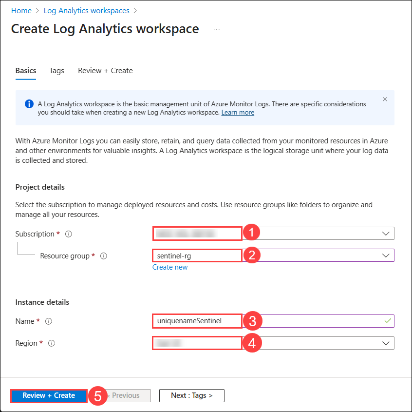

1. Once the workspace validation has passed, select **Create**.

   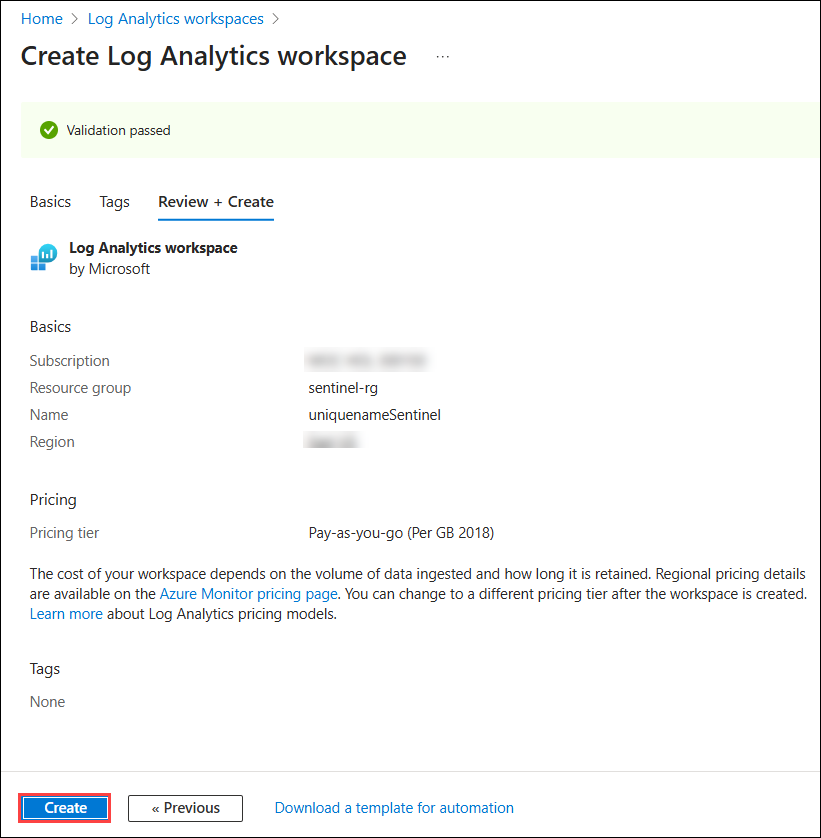

1. Wait for the new workspace to be provisioned, this may take a few minutes.
   
   

1. In the Search bar of the Azure portal, type **Microsoft Sentinel (1)**, then select **Microsoft Sentinel (2)**.

   

1. On the **Microsoft Sentinel** page, select **+ Create** from the command bar.

   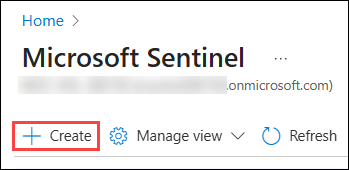

1. Select the newly created workspace named **uniquenameSentinel (1)** and click on **Add (2)**.
  
   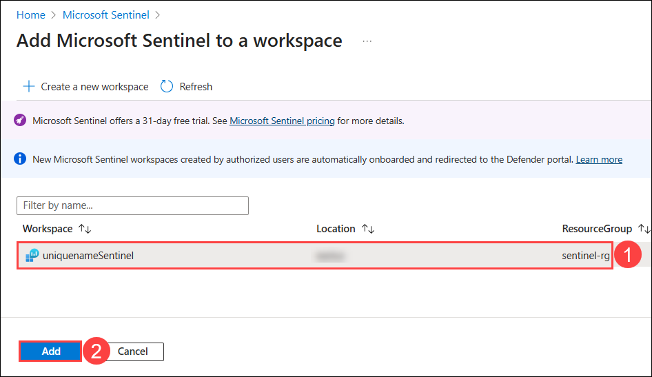

1. In the **Microsoft Sentinel free trial activated** tab, select **Ok**.

   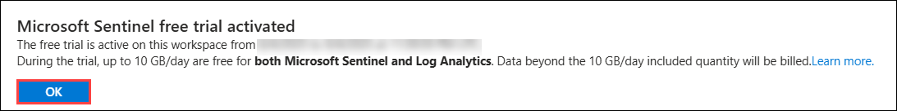

### Task 2: Connect the Microsoft Entra ID connector

 In this task, you will connect the Microsoft Entra ID connector to Microsoft Sentinel.

 1. On the left side menu, in the Configuration area select **Data connectors**.
 
 1. On the **Data connectors** page, click on **Content Hub.** 

    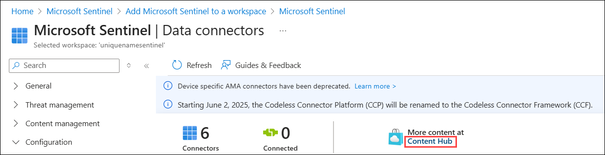
 
 1. On the Content hub page, search for **Microsoft Entra ID (1)**, then select **Microsoft Entra ID (2)** Data connector from the dropdown list and click on **Install (3)** to install it.

    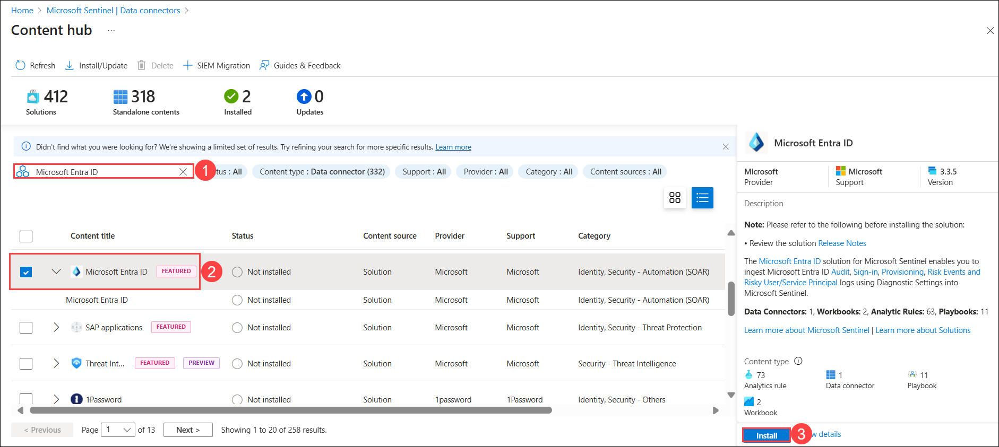

 1. Expand **Microsoft Entra ID (1)** data connector and click on it, then select the **Open connector page (2)** on the connector information blade.

    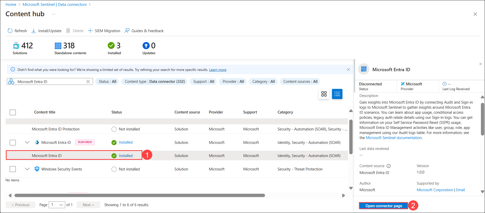

 1. Check the box for **Sign-in Logs (1)** and **Audit Logs (2)** options under the Configuration, then select **Apply Changes (3)**.

    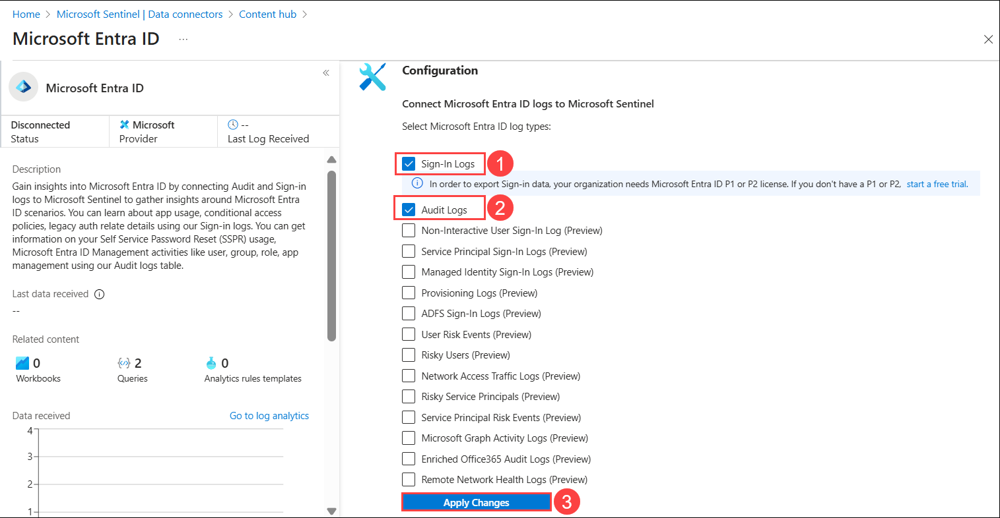

### Task 3: Connect the Microsoft Entra ID Protection connector

In this task, you will connect the Microsoft Entra ID Protection connector to Microsoft Sentinel.

1. On the left side menu, under Configuration, select **Data connectors (1)**.

1. On the Data Connectors page, search for **Microsoft Entra ID Protection (2)** and select **Microsoft Entra ID Protection (3)** Data connector from the list, then click on **Open connector page (4)**.

   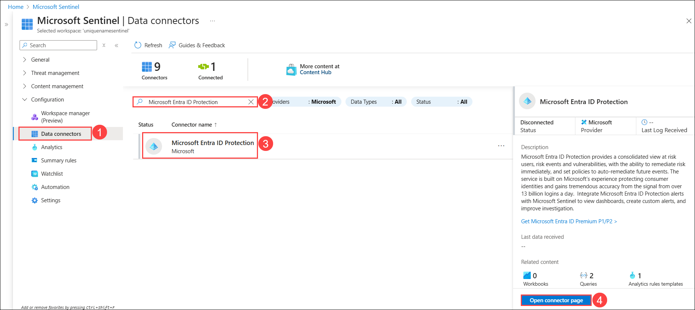
 
1. From the **Configuration** area select the **Connect** button.

   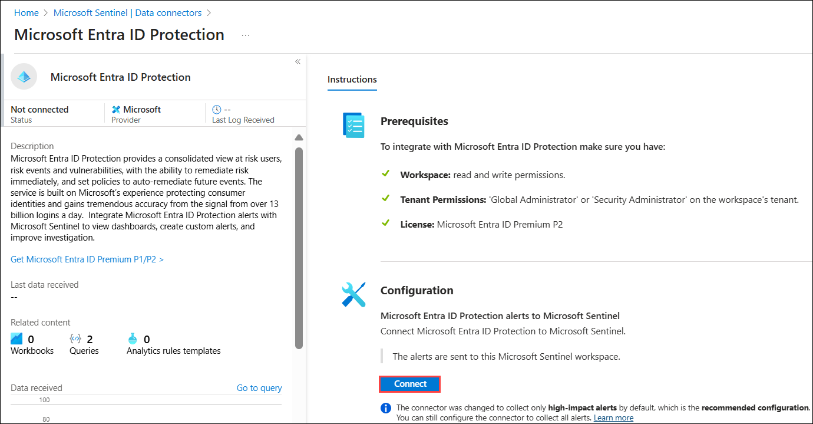

 > **Congratulations** on completing the task! Now, it's time to validate it. Here are the steps:
    - If you receive a success message, you can proceed to the next task.
    - If not, carefully read the error message and retry the step, following the instructions in the lab guide.
    - If you need any assistance, please contact us at cloudlabs-support@spektrasystems.com. We are available 24/7 to help you out.
 
 <validation step="15254bc0-c312-424f-aa2c-9e30d0101a0d" />

### Task 4: Connect the Microsoft Defender for Cloud connector

In this task, you will connect the Microsoft Defender for Cloud connector.

1. On the **Data connectors** page, click on **Content Hub.** 

   

1. On **Content hub** page, search for **Microsoft Defender for Cloud (1)** and **expand it (2)** from the list, then select **Subscription-based Microsoft Defender for Cloud (Legacy) (3)** Data connector and click on **Install Solution (4)** to install it.

   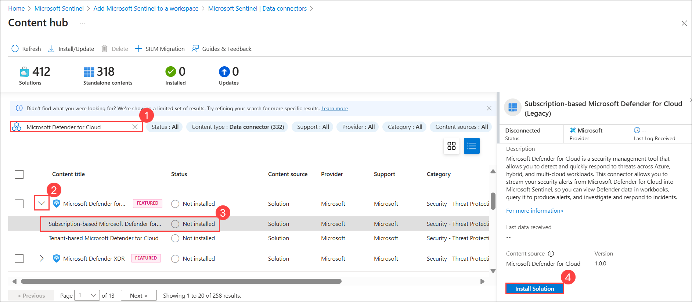

    >**Note:** The Microsoft Defender for Cloud solution installs the Subscription-based Microsoft Defender for Cloud (Legacy) Data connector, the Tenant-based Microsoft Defender for Cloud (Preview) Data connector, and an Analytics rule.

1. On **Content hub** page, select the **Subscription-based Microsoft Defender for Cloud (Legacy) (1)** Data connector, and select the **Open connector page (2)** on the connector information blade.
   
   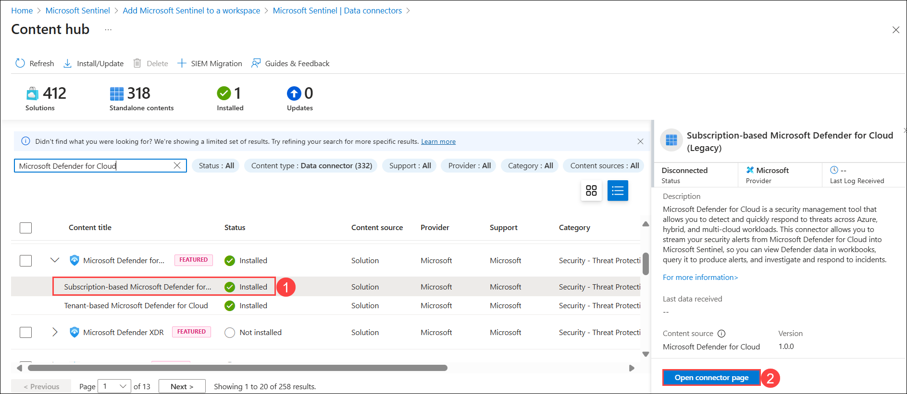 

1. On the **Subscription-based Microsoft Defender for Cloud (Legacy)** page, scroll down, then under **Configuration** section, select the checkbox for the available **Subscription (1)** and slide the **Status** option to the right to indicate **Connected (2)** and **"Bi-directional sync"** should be **Enabled (3)**.

   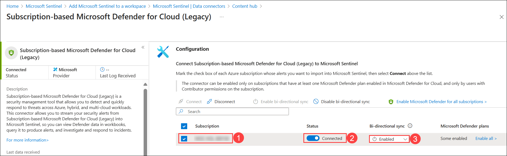

### Task 5: Connect the Azure Activity connector

In this task, you will connect the Azure Activity connector.

1. On the **Data connectors** page, click on **Content Hub.** 

   

1. On **Content hub** page, search for **Azure Activity (1)** and select **Azure Activity (2)** Data connector from the list,  and click on **Install (3)** to install it.

   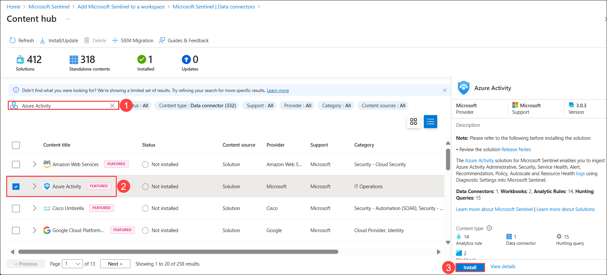

1. On **Content hub** page, select the ****Azure Activity (1)** Data connector, and select the **Open connector page (2)** on the connector information blade.

   

1. In the Configuration area, scroll down and under "2. Connect your subscriptions..." select **Launch Azure Policy Assignment wizard>**.

   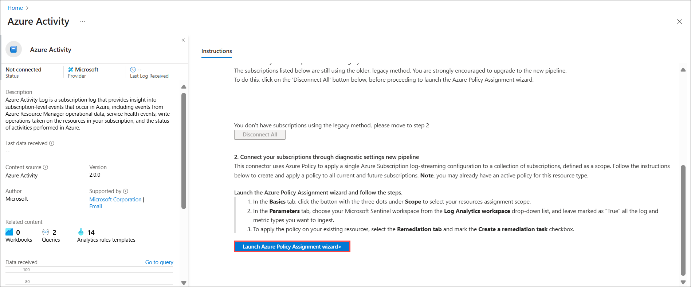

1. In the **Basics** tab, select the ellipsis button **(...) (1)** under **Scope** and select your **subscription (2)** from the drop-down list and click **Select (3)**.

   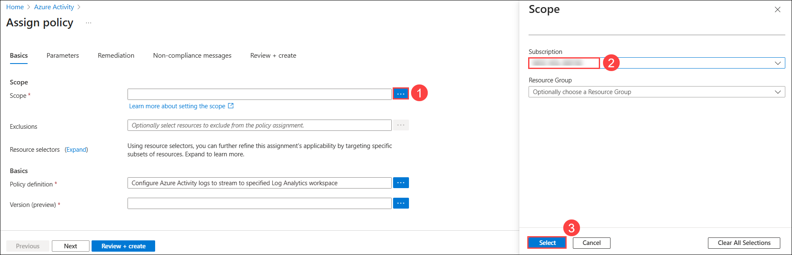

1. In the **Primary** tab, click the ellipsis button **(...) (1)** next to **Primary Log Analytics workspace** and select your **workspace (2)** from the drop-down list and click **Select (3)**.

   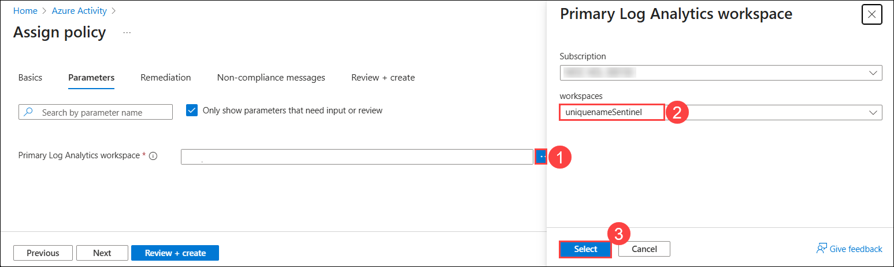

1. Select the **Remediation** tab and select the **Create a remediation task (1)** checkbox. This action will apply the policy to existing Azure resources.

1. Select the **Review + Create (2)** button to review the configuration.

   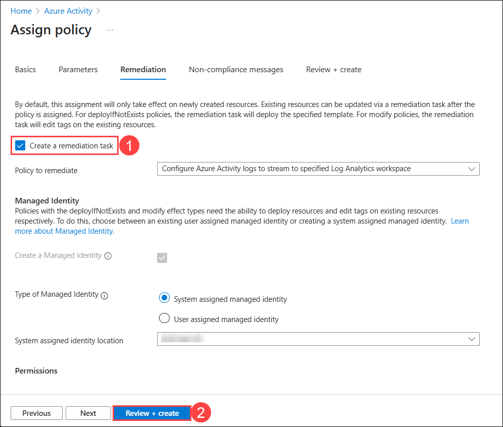

1. On **Review + create**, select **Create** to finish. 

   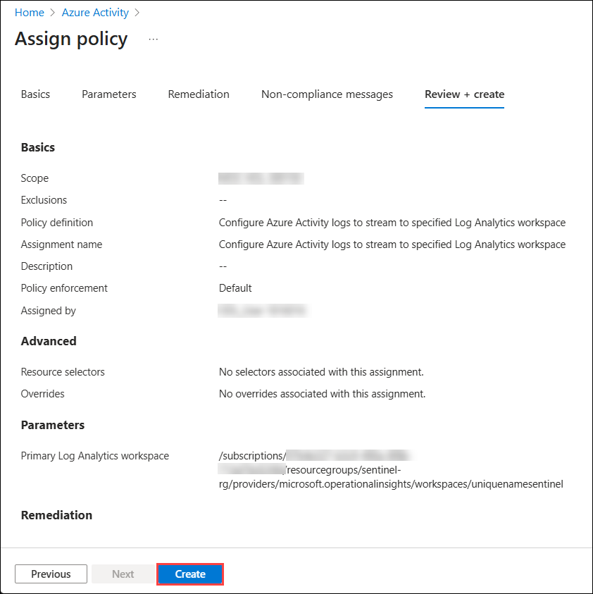

### Summary
In this lab, you have integrated log data from various data sources within the organization into Microsoft Sentinel using appropriate data connectors.

### Now, click on **Next** from the lower right corner to move on to the next page.

   

