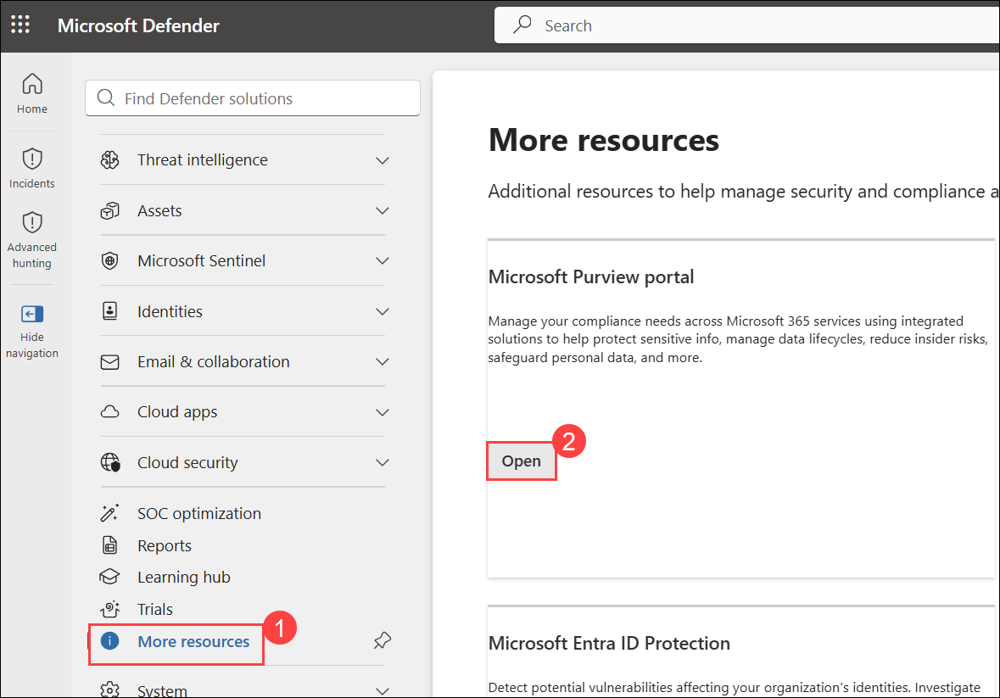
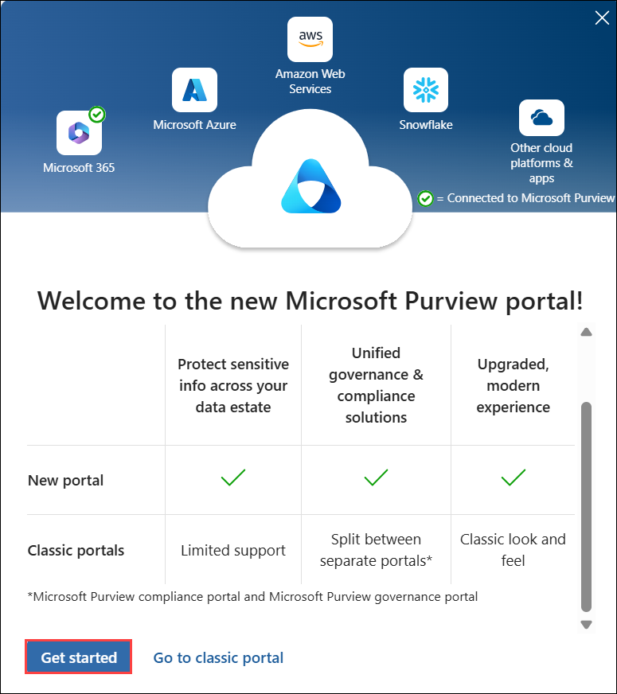
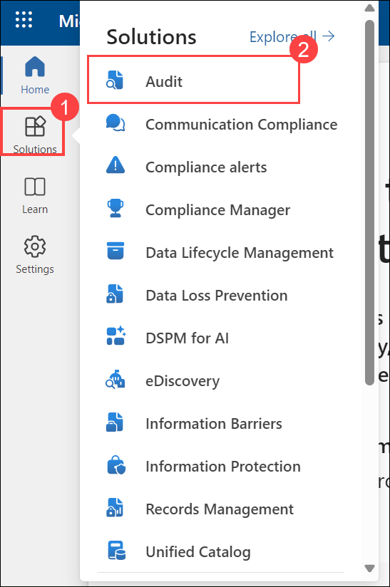
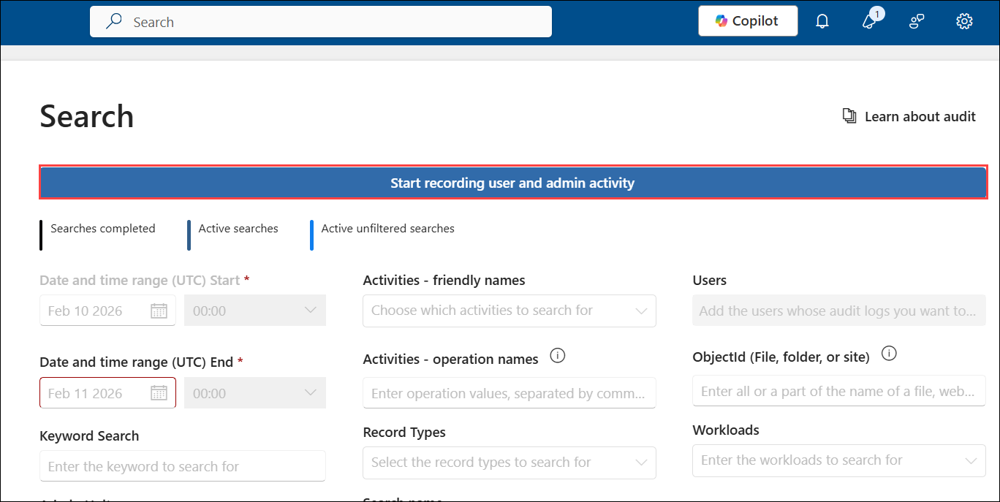

# Explore Microsoft Purview Audit logs

## Lab Scenario

You're a Security Operations Analyst working at a company that is implementing Microsoft Defender XDR and Microsoft Purview. You're assisting colleagues on the the IT compliance team with configuring both Purview Audit (Standard) and Audit (Premium). Their objective is to ensure that all access and modifications to patient data in our network of healthcare facilitie sare accurately logged to meet health data protection regulations.

## Lab Objectives

In this lab, you will perform:

- **Task 1:** Enable Purview Audit logs

## Architecture Diagram

  

### Estimated Timing: 15 Minutes

### Task 1: Enable Purview Audit logs

In this task, you'll assign preset security policies for Exchange Online Protection (EOP) and Microsoft Defender for Office 365 in the Microsoft 365 security portal.

1. In the **Microsoft Edge** browser, navigate to the **Microsoft Defender XDR portal** at [Microsoft Defender XDR portal](https://security.microsoft.com).

1. You'll see the **Sign into Microsoft Defender XDR portal** tab. Here, enter the username and password as below:

    - **Username: <inject key="AzureAdUserEmail"></inject>** 
    - **Password: <inject key="AzureAdUserPassword"></inject>** 

1. On **Microsoft Defender** page, if the left navigation pane is collapsed, select **Show navigation** to expand it.

   

1. From the navigation menu, click on **More resources (1)** and select **Open (2)** button on **Microsoft Purview portal** tile

   

1. When the Microsoft Purview portal opens, a message appears stating that The compliance Portal is retired. This message will timeout and redirect you to new Microsoft Purview portal.

1. When the **Microsoft Purview portal** opens, a message about the **Welcome to the new Microsoft Purview portal** will appear on the screen. Click **Get started** to continue

    

    >**Note:** If you see a message that the Compliance portal is retired, please wait for a few seconds, it will redirect you to the new portal. 

1. Select **Solutions (1)** from the left sidebar, then select **Audit (2)**.

   

    > **Note:** The **Audit** option may take some time to appear in the **Solutions** menu. If it does not show up immediately,  wait for a few minutes and refresh the browser before proceeding. 

    > **Note:** The **Audit** option may take some time to appear in the **Solutions** menu. If it does not show up immediately, try refreshing the page using **Ctrl + F5**, signing out by selecting the circle with your initials in the top-right corner and choosing **Sign out**, and then signing back in using your **Tenant Email** credentials. You can also try opening the portal in **InPrivate/Incognito mode** or wait for **10–15 minutes** and check again.

    > If the option is still not visible after trying these steps, it may be an issue with the **Microsoft Defender portal**. In that case, please contact Cloudlabs-Support@spektrasystems.com for assistance.
    
    
1. On the **Search** page, select the blue **Start recording user and admin activity** bar to enable audit logging.

    

    >**Note:** If you get a message to **Complete organizational setup**, click on **Yes**. 

1. Once you select this option, the **blue bar** should disappear from the page.

    >**Note:** It might take **60 Minutes** to start recording activities. You can proceed with the next lab exercises.

### Review
 In this lab, you have completed the following:

   - Enabled Purview Audit logs

## PROCEED TO  THE NEXT EXERCISE
