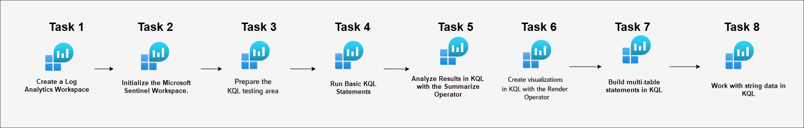
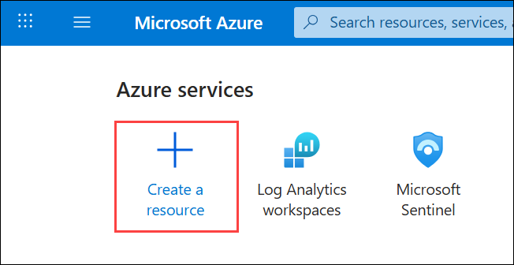
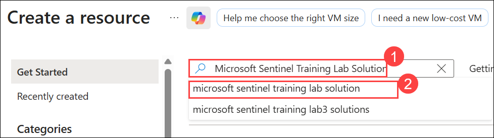
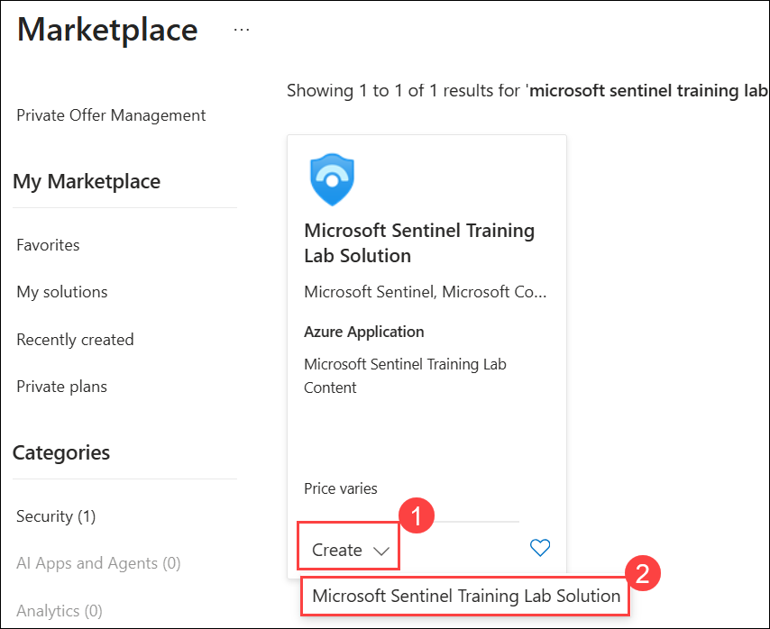
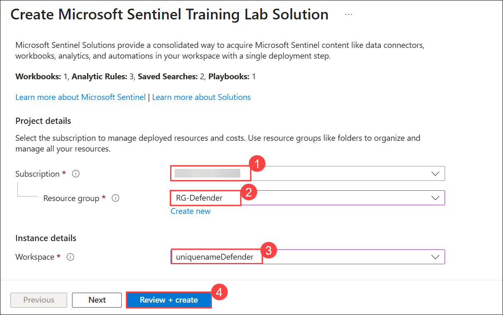
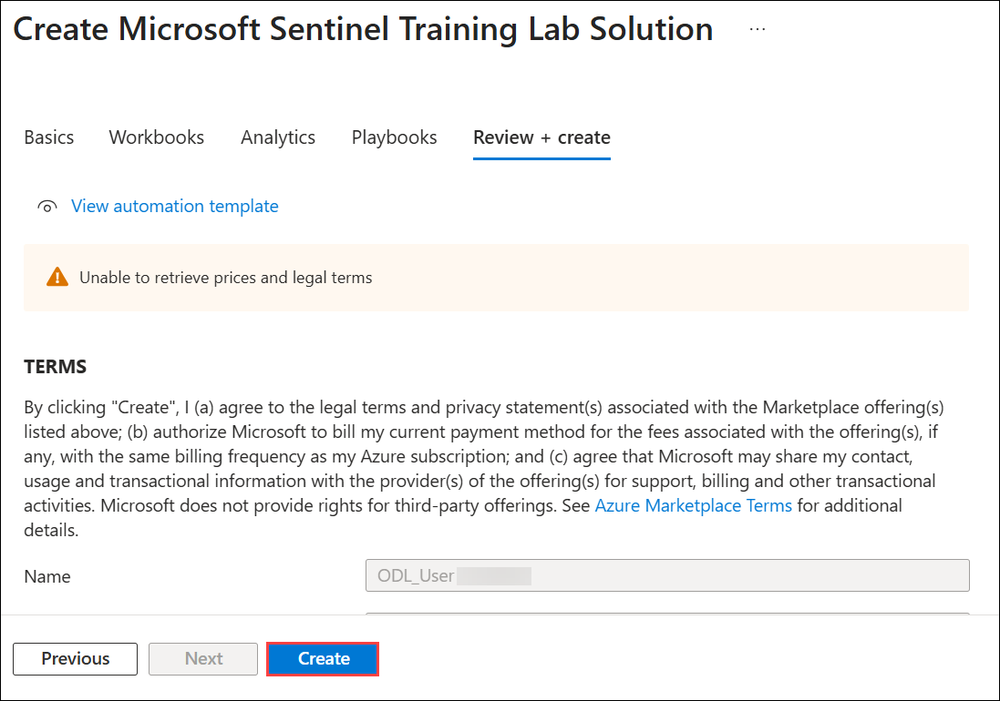
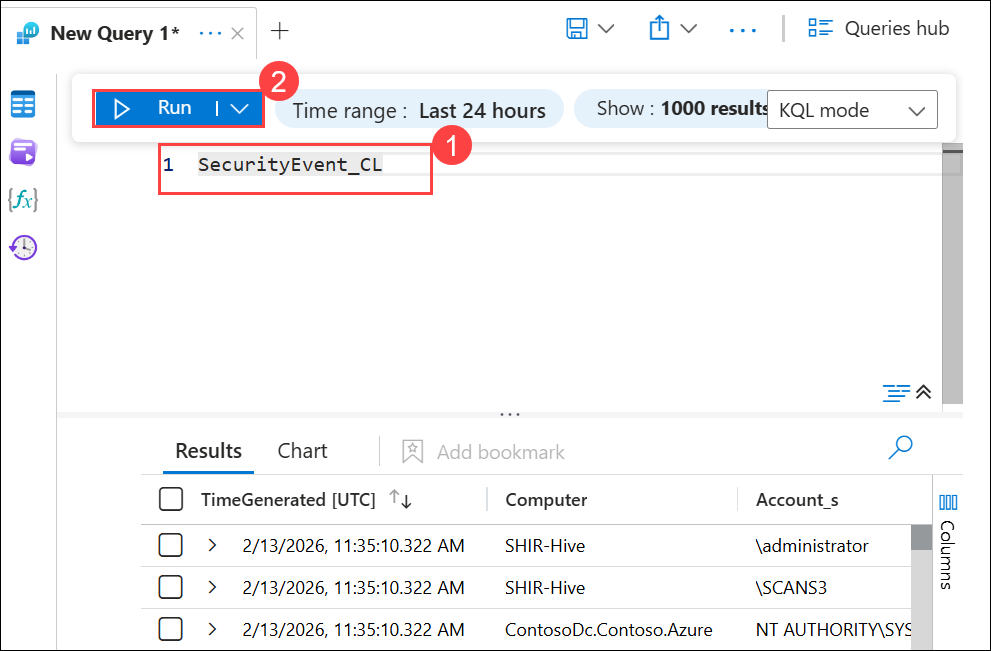
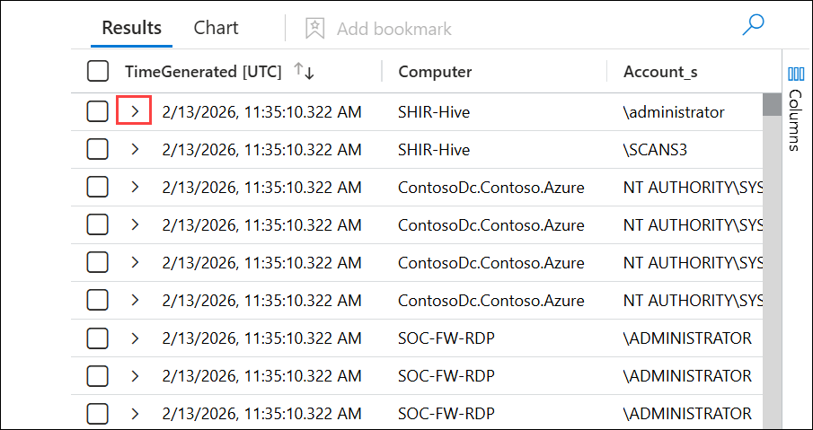
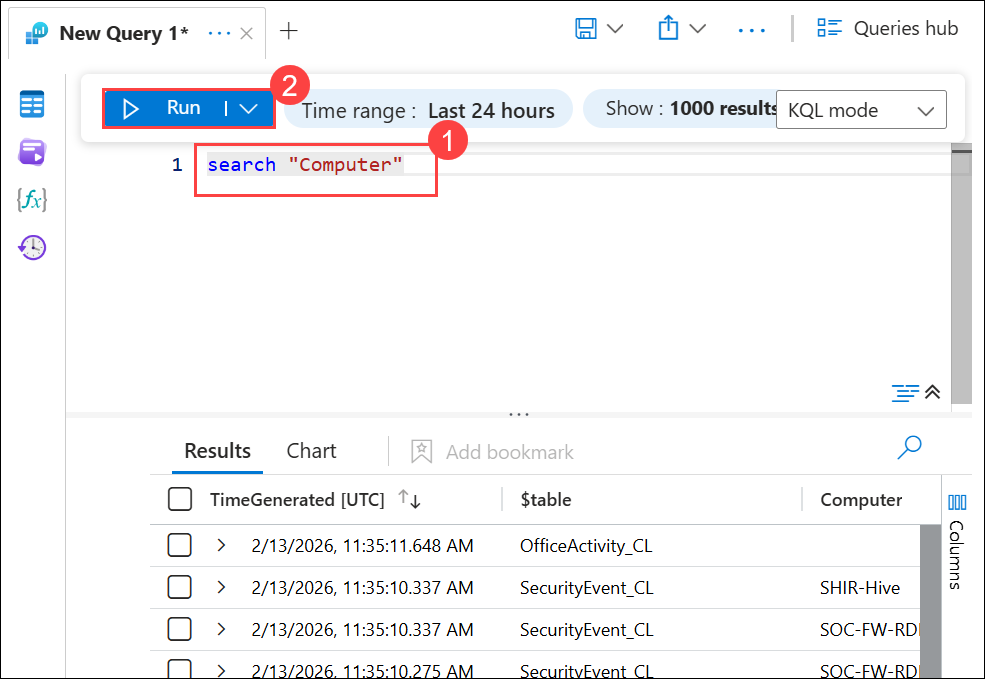

# Lab 05 - Exercise 1: Create queries for Microsoft Sentinel using Kusto Query Language (KQL)

## Lab Scenario

You're a Security Operations Analyst working at a company that is implementing Microsoft Sentinel. You're responsible for performing log data analysis to search for malicious activity, display visualizations, and perform threat hunting. To query log data, you use the Kusto Query Language (KQL).

>**Important:** The lab exercises for Learning Path #6 are in a *standalone* environment. If you exit the lab before completing it, you will be required to re-run any configurations steps again.

<!--- >**Tip:** This lab involves entering many KQL scripts into Microsoft Sentinel. The scripts were provided in a file at the beginning of this lab. An alternate location to download them is:  <https://github.com/MicrosoftLearning/SC-200T00A-Microsoft-Security-Operations-Analyst/tree/master/Allfiles> --->

## Lab Objectives

 In this lab, you will perform the following:

- Task 1: Create a Log Analytics Workspace
- Task 2: Initialize the Microsoft Sentinel Workspace.
- Task 3: Prepare the KQL testing area
- Task 4: Run Basic KQL Statements
- Task 5: Analyze Results in KQL with the Summarize Operator
- Task 6: Create visualizations in KQL with the Render Operator
- Task 7: Build multi-table statements in KQL
- Task 8: Work with string data in KQL

## Estimated Timing: 90 Minutes

## Architecture Diagram

  

### Task 1: Create a Log Analytics Workspace

In this task, you will create a Log Analytics workspace for use with Microsoft Defender for Cloud.

1. In the Search bar of the Azure portal, type **Log Analytics (1)**, then select **Log Analytics workspaces (2)**.

   

1. Select **+ Create** from the command bar.

   

1. To create a **log analytics workspace**, follow these steps:

    - Subscription **Accept default subscription (1)**
    - Select **RG-Defender (2)** resource Group from drop down
    - For the Name, enter **uniquenameDefender (3)**.
    - Leave the **default Region (4)**.
    - Select **Review + Create (5)**.

      

1. Once the workspace validation has passed, select **Create**.

   

1. Wait for the new workspace to be provisioned, this may take a few minutes.

> **Congratulations** on completing the task! Now, it's time to validate it. Here are the steps:
> - Hit the Validate button for the corresponding task. You can proceed to the next task if you receive a success message.
> - If not, carefully read the error message and retry the step, following the instructions in the lab guide.
> - If you need any assistance, please contact us at cloudlabs-support@spektrasystems.com. We are available 24/7 to help you out.

  <validation step="8edea4c7-f6fb-4714-9021-fcf6b6942abe" />

### Task 2: Initialize the Microsoft Sentinel Workspace.

In this task, you will set up a Microsoft Sentinel workspace within the Azure portal. This workspace will be the foundation for monitoring, detecting, and responding to security threats.

1. In the Search bar of the Azure portal, type **microsoft sentinel (1)**, then select **Microsoft Sentinel (2)**.

   

1. Click on **+ Create**.  

    

1. Next, in Add Microsoft Sentinel to a workspace page.

1. Select your existing  **log analytics workspace (1)** that was created in the previous task, then select **Add (2)**. This could take a few minutes.

   

1. In the Microsoft Sentinel free trial activated tab, select **Ok**.

    

### Task 3: Prepare the KQL testing area

In this task, you install the **Microsoft Sentinel Training Lab Solution** from the Marketplace which will populate a Log Analytics workspace with sample data that you can use to practice writing KQL statements.

1. In the Azure portal home page, under Azure services, select **Create a resource**.

     

1. In the **Search the Marketplace** box, type **Microsoft Sentinel Training Lab Solution (1)** and select **Microsoft Sentinel Training Lab Solution (2)** from the search results.

     

1. Select **Create (1)**, then choose **Microsoft Sentinel Training Lab Solution (2)** from the dropdown.

     

1. In the **Create Microsoft Sentinel Training Lab Solution** page, select the following details and click on **Review + Create (4)**.

    | Settings | Values |
    |  -- | -- |
    | Subscription | **Accept default subscription (1)**|
    | Resource group | **RG-Defender (2)** |
    | Workspace | **uniquenameDefender (3)**|

     

1. When validation is complete, select **Create** to deploy the solution.

     
    
     >**Note:** It takes approximately 10-15 minutes for the solution to be fully deployed and for all resources to be available.

1. Wait for the deployment to complete, then select **Home** from the breadcrumb navigation.

### Task 4: Run Basic KQL Statements

In this task, you will build basic KQL statements.

   > **Important:** For each query, clear the previous statement from the Query Window or open a new Query Window by selecting **+** after the last opened tab (up to 25).

1. Navigate to **Microsoft Sentinel**, open the **uniquenamedefender (1)** workspace, expand the **General** section and select **Logs (2)** from the navigation menu and close the Log Analytics video pop-up window that appears **(3)**.

   

   >**Note:** If you see the message “This page has been moved to the Defender portal for the optimal, unified SecOps experience”, refresh the page and continue this lab in the Microsoft Azure portal, as the lab environment is configured for the Azure portal and the Microsoft Defender portal experience may take longer to load for this lab.

1. Close the **Queries hub**.

     

1. From the mode dropdown, switch from **Simple mode (1)** to **KQL mode (2)**.

     

1. Explore the available tables and other tools listed in the **schema and filter pane** on the left side of the screen.

1. In the query editor, enter the following query **(1)** and select the **Run (2)** button. You should see the query results in the bottom window.

    ```KQL
    SecurityEvent_CL
    ```

    

    >**Note:** The *SecurityEvent_CL* table is a custom table created by the Microsoft Sentinel Training Lab Solution. It contains sample data that you can use to practice writing KQL statements.

1. Notice that the filter set to **Show: 1000 results**.

1. Next to the first record, select the **>** to expand the information for the row.

     

1. The following statement demonstrates the **search** operator, which searches all columns in the table for the value.

1. The *Time range* should default to **Last 24 hours** in the Query Window.

1. In the Query Window, enter the following statement and select **Run**:

    ```KQL
    search "Computer"
    ```

    

    >**Note:** Using the *Search* operator without specific tables or qualifying clauses is less efficient than table-specific and column-specific text filtering.

1. The following statement demonstrates **search** across tables listed within the **in** clause. In the Query Window, enter the following statement and select **Run**:

    ```KQL
    search in (SecurityEvent_CL,App*) "new"
    ```

1. Change back the *Time range* to **Last 24 hours** in the Query Window.

1. The following statements demonstrate the **where** operator, which filters on a specific predicate. In the Query Window, enter the following statement and select **Run**:

    >**Important:** You should select **Run** after entering each query from the code blocks below.

    ```KQL
    SecurityEvent_CL  
    | where TimeGenerated > ago(7d)
    ```

    >**Note:** The *Time range* now shows *Set in query* since we are filtering with the TimeGenerated column.

    ```KQL
    SecurityEvent_CL  
    | where TimeGenerated > ago(7d) and EventID_s == 4624
    ```

    ```KQL
    SecurityEvent_CL  
    | where TimeGenerated > ago(7d)
    | where EventID_s == 4624  
    | where AccountType_s =~ "user"
    ```

    ```KQL
    SecurityEvent_CL  
    | where TimeGenerated > ago(7d) and EventID_s in (4624, 4625)
 
    ```

1. The following statement demonstrates the use of the **let** statement to declare *variables*. In the Query Window, enter the following statement and select **Run**:

    ```KQL
    let timeOffset = 10m;
    let discardEventID = 4688;
    SecurityEvent_CL
    | where TimeGenerated > ago(timeOffset*60) and TimeGenerated < ago(timeOffset)
    | where EventID_s != discardEventID
    ```

1. The following statement demonstrates the use of the **let** statement to declare a *dynamic list*. In the Query Window, enter the following statement and select **Run**:

    ```KQL
    let suspiciousAccounts = datatable(account: string) [
      @"NA\timadmin", 
      @"NT AUTHORITY\SYSTEM"
    ];
    SecurityEvent_CL  
    | where TimeGenerated > ago(7d)
    | where Account_s in (suspiciousAccounts)
    ```

    >**Tip:** You can re-format the query easily by selecting the ellipsis (...) in the Query window and select **Format query**.

1. The following statement demonstrates the use of the **let** statement to declare a *dynamic table*. In the Query Window, enter the following statement and select **Run**:

    ```KQL
    let LowActivityAccounts =
        SecurityEvent_CL 
        | summarize cnt = count() by Account_s 
        | where cnt < 1000;
    LowActivityAccounts | where Account_s contains "sql"
    ```


### Task 5: Analyze Results in KQL with the Summarize Operator

In this task, you'll build KQL statements to aggregate data. **Summarize** groups the rows according to the **by** group columns, and calculates aggregations over each group.

1. The following statement demonstrates the **count()** function, which returns a count of the group. In the Query Window enter the following statement and select **Run**:

    ```KQL
    SecurityEvent_CL  
    | where TimeGenerated > ago(7d) and EventID_s == 4688  
    | summarize count() by Computer
    ```

1. The following statement demonstrates the **count()** function, but in this example, we name the column as *cnt*. In the Query Window, enter the following statement and select **Run**:

    ```KQL
    SecurityEvent_CL  
    | where TimeGenerated > ago(7d) and EventID_s == 4624  
    | summarize cnt=count() by AccountType_s, Computer
    ```

1. The following statement demonstrates the **dcount()** function, which returns an approximate distinct count of the group elements. In the Query Window, enter the following statement and select **Run**:

    ```KQL
    SigninLogs_CL  
    | where TimeGenerated > ago(7d)
    | summarize dcount(IPAddress)
    ```

1. The following statement is a rule to detect *User account is disabled* failures across multiple applications for the same account. In the Query Window, enter the following statement and select **Run**:

    ```KQL
    let timeframe = 30d;
    let threshold = 1;
    SigninLogs_CL
    | where TimeGenerated >= ago(timeframe)
    | where ResultDescription has "User account is disabled"
    | summarize applicationCount = dcount(AppDisplayName_s) by UserPrincipalName_s, IPAddress
    | where applicationCount >= threshold
    ```

1. The following statement demonstrates the **arg_max()** function, which returns one or more expressions when the argument is maximized. The following statement returns the most current row from the SecurityEvent_CL table for the computer *VictimPC2*. The * in the arg_max function requests all columns for the row. In the Query Window, enter the following statement and select **Run**:

    ```KQL
    SecurityEvent_CL  
    | where Computer == "VictimPC2"
    | summarize arg_max(TimeGenerated,*) by Computer
    ```

1. The following statement demonstrates the **arg_min()** function, which returns one or more expressions when the argument is minimized. In this statement, the oldest SecurityEvent_CL for the computer *VictimPC2* will be returned as the result set. In the Query Window, enter the following statement and select **Run**:

    ```KQL
    SecurityEvent_CL  
    | where Computer == "VictimPC2"
    | summarize arg_min(TimeGenerated,*) by Computer
    ```

1. The following statements demonstrate the importance of understanding results based on the order of the *pipe*. In the Query Window, enter the following queries and run each query separately:

    1. **Query 1** has Accounts for which the last activity was a login. The SecurityEvent_CL table will first be summarized and return the most current row for each Account. Then only rows with EventID_s equals 4624 (login) will be returned.

        ```KQL
        SecurityEvent_CL  
        | summarize arg_max(TimeGenerated, *) by Account_s 
        | where EventID_s == 4624  
        ```

    1. **Query 2** has the most recent login for Accounts that have logged in. The SecurityEvent_CL table is filtered to only include EventID_s = 4624. Then these results are summarized for the most current login row by Account.

        ```KQL
        SecurityEvent_CL  
        | where EventID_s == 4624  
        | summarize arg_max(TimeGenerated, *) by Account_s
        ```

    >**Note:**  You can also review the "Total CPU" and "Data used for processed query" by selecting the "Query details" link on the lower right and compare the data between both statements.

1. The following statement demonstrates the **make_list()** function, which returns a *list* of all the values within the group. This KQL query will first filter the EventID_s with the where operator. Next, for each Computer, the results are a JSON array of Accounts. The resulting JSON array will include duplicate accounts. In the Query Window, enter the following statement and select **Run**: 

    ```KQL
    SecurityEvent_CL  
    | where TimeGenerated > ago(7d)
    | where EventID_s == 4624  
    | summarize make_list(Account_s) by Computer
    ```

1. The following statement demonstrates the **make_set()** function, which returns a set of *distinct* values within the group. This KQL query will first filter the EventID_s with the where operator. Next, for each Computer, the results are a JSON array of unique Accounts. In the Query Window, enter the following statement and select **Run**: 

    ```KQL
    SecurityEvent_CL  
    | where TimeGenerated > ago(7d)
    | where EventID_s == 4624  
    | summarize make_set(Account_s) by Computer
    ```

### Task 6: Create visualizations in KQL with the Render Operator

In this task, you'll use generate visualizations with KQL statements.

1. The following statement demonstrates the **render** operator (which renders results as a graphical output), using a **barchart** visualization. In the Query Window, enter the following statement and select **Run**: 

    ```KQL
    SecurityEvent_CL  
    | where TimeGenerated > ago(7d)
    | summarize count() by Account_s
    | render barchart
    ```

1. The following statement demonstrates the **render** operator visualizing results with a time series. The **bin()** function rounds all values in a timeframe and groups them, used frequently in combination with **summarize**. If you have a scattered set of values, the values are grouped into a smaller set of specific values. Combining the generated results and pipe them to a **render** operator with a **timechart** provides a time series visualization. In the Query Window, enter the following statement and select **Run**: 

    ```KQL
    SecurityEvent_CL  
    | where TimeGenerated > ago(7d)
    | summarize count() by bin(TimeGenerated, 1m)
    | render timechart
    ```
    > **Congratulations** on completing the task! Now, it's time to validate it. Here are the steps:
    > - Hit the Validate button for the corresponding task. You can proceed to the next task if you receive a success message.
    > - If not, carefully read the error message and retry the step, following the instructions in the lab guide.
    > - If you need any assistance, please contact us at cloudlabs-support@spektrasystems.com. We are available 24/7 to help you out.

   <validation step="43dbc561-34b3-4571-b014-c5b7d09e1b40" />

### Task 7: Build multi-table statements in KQL

In this task, you'll build multi-table KQL statements.

1. Change the **Time range** to **Last 7 days** in the Query Window. This limits our results for the following statements.

1. The following statement demonstrates the **union** operator, which takes two or more tables and returns all their rows. Understanding how results are passed and impacted with the pipe character is essential. In the Query Window, enter the following statements and select **Run** for each query separately to see the results:

    1. **Query 1** returns all rows of SecurityEvent_CL and all rows of SigninLogs_CL.

        ```KQL
        SecurityEvent_CL  
        | union SigninLogs_CL  
        ```

    1. **Query 2** returns one row and column, which is the count of all rows of SigninLogs_CL and all rows of SecurityEvent_CL.

        ```KQL
        SecurityEvent_CL  
        | union SigninLogs_CL  
        | summarize count() 
        ```

    1. **Query 3** returns all rows of SecurityEvent_CL and one (last) row for SigninLogs_CL. The last row for SigninLogs_CL has the summarized count of the total number of rows.

        ```KQL
        SecurityEvent_CL  
        | union (SigninLogs_CL | summarize count() | project count_)
        ```

       >**Note:** The 'empty row' in the results will show the summarized count of SigninLogs_CL.

1. The following statement demonstrates the **union** operator support to union multiple tables with wildcards. In the Query Window, enter the following statement and select **Run**:

    ```KQL
    union Sec*  
    | summarize count() by Type
    ```

1. The following statement demonstrates the **join** operator, which merges the rows of two tables to form a new table by matching values of the specified column(s) from each table. In the Query Window, enter the following statement and select **Run**:

    ```KQL
    SecurityEvent_CL  
    | where EventID_s == 4624 
    | summarize LogOnCount=count() by  EventID_s, Account_s
    | project LogOnCount, Account_s
    | join kind = inner( 
     SecurityEvent_CL  
    | where EventID_s == 4634 
    | summarize LogOffCount=count() by  EventID_s, Account_s
    | project LogOffCount, Account_s
    ) on Account_s
    ```

    >**Important:**
     The first table specified in the join is considered the Left table. The table after the **join** operator is the right table. When working with columns from the tables, the $left.Column name and $right.Column name is to distinguish which tables column are referenced. The **join** operator supports a full range of types: flouter, inner, innerunique, leftanti, leftantisemi, leftouter, leftsemi, rightanti, rightantisemi, rightouter, rightsemi.

1. You can leave the **Time range** at **Last 7 days** in the Query Window.

### Task 8: Work with string data in KQL

In this task, you'll work with structured and unstructured string fields with KQL statements.

1. The following statement demonstrates the **extract** function, which gets a match for a regular expression from a source string. You have the option to convert the extracted substring to the indicated type. In the Query Window, enter the following statement and select **Run**: 

    ```KQL
    print extract("x=([0-9.]+)", 1, "hello x=45.6|wo") == "45.6"
    ```

1. The following statements use the **extract** function to pull out the Account_s Name from the Account_s field of the SecurityEvent_CL table. In the Query Window, enter the following statement and select **Run**: 

    ```KQL
    SecurityEvent_CL  
    | where EventID_s == 4672 and AccountType_s == 'User' 
    | extend Account_Name = extract(@"^(.*\\)?([^@]*)(@.*)?$", 2, tolower(Account_s))
    | summarize LoginCount = count() by Account_Name
    | where Account_Name != "" 
    | where LoginCount < 10
    ```

1. The following statement demonstrates the **parse** operator, which evaluates a string expression and parses its value into one or more calculated columns. Use for structuring unstructured data. In the Query Window, enter the following statement and select **Run**:

    ```KQL
    let Traces = datatable(EventText:string)
    [
    "Event: NotifySliceRelease (resourceName=PipelineScheduler, totalSlices=27, sliceNumber=23, lockTime=02/17/2016 08:40:01, releaseTime=02/17/2016 08:40:01, previousLockTime=02/17/2016 08:39:01)",
    "Event: NotifySliceRelease (resourceName=PipelineScheduler, totalSlices=27, sliceNumber=15, lockTime=02/17/2016 08:40:00, releaseTime=02/17/2016 08:40:00, previousLockTime=02/17/2016 08:39:00)",
    "Event: NotifySliceRelease (resourceName=PipelineScheduler, totalSlices=27, sliceNumber=20, lockTime=02/17/2016 08:40:01, releaseTime=02/17/2016 08:40:01, previousLockTime=02/17/2016 08:39:01)",
    "Event: NotifySliceRelease (resourceName=PipelineScheduler, totalSlices=27, sliceNumber=22, lockTime=02/17/2016 08:41:01, releaseTime=02/17/2016 08:41:00, previousLockTime=02/17/2016 08:40:01)",
    "Event: NotifySliceRelease (resourceName=PipelineScheduler, totalSlices=27, sliceNumber=16, lockTime=02/17/2016 08:41:00, releaseTime=02/17/2016 08:41:00, previousLockTime=02/17/2016 08:40:00)"
    ];
    Traces   
    | parse EventText with * "resourceName=" resourceName ", totalSlices=" totalSlices:long * "sliceNumber=" sliceNumber:long * "lockTime=" lockTime ", releaseTime=" releaseTime:date "," * "previousLockTime=" previousLockTime:date ")" *  
    | project resourceName, totalSlices, sliceNumber, lockTime, releaseTime, previousLockTime
    ```

1. The following statements demonstrate operators to manipulate JSON stored in string fields. Many logs submit data in JSON format, which requires you to know how to transform JSON data to fields that can be queried. In the Query Window, enter the following statement and select **Run**:

    ```KQL
    SigninLogs_CL 
    | extend AuthDetails =  parse_json(AuthenticationDetails_s) 
    | extend AuthMethod =  AuthDetails[0].authenticationMethod 
    | extend AuthResult = AuthDetails[0].["authenticationStepResultDetail"] 
    | project AuthMethod, AuthResult, AuthDetails 
    ```

1. The following statement demonstrates the **mv-expand** operator, which turns dynamic arrays into rows (multi-value expansion).

    ```KQL
    SigninLogs_CL 
    | mv-expand AuthDetails = parse_json(AuthenticationDetails_s) 
    | project AuthDetails
    ```

1. Expand the first row by selecting ">" and then again next to *AuthDetails* to review the expanded results.

1. The following statement demonstrates the **mv-apply** operator, which applies a subquery to each record and returns the union of the results of all subqueries.

    ```KQL
    SigninLogs_CL 
    | mv-apply AuthDetails = parse_json(AuthenticationDetails_s) on
    (where AuthDetails.authenticationMethod == "Password")
    ```

1. A **function** is a log query that can be used in other log queries with the saved name as a command. To create a **function**, after running your query, select the **Save** button and then select **Save As function** from the drop-down. Enter the name you want (for example: *PrivLogins*) in the **Function name** box and enter a **Legacy category** (for example: *General*) and select **Save**. The function is available in KQL by using the function's alias:

    ```KQL
    PrivLogins  
    ```

## Review

In this lab, you have completed the following:
- Created a Log Analytics Workspace
- Initialized the Microsoft Sentinel Workspace.
- Prepared the KQL testing area
- Ran Basic KQL Statements
- Analyzed Results in KQL with the Summarize Operator
- Created visualizations in KQL with the Render Operator
- Build multi-table statements in KQL
- Worked with string data in KQL

## PROCEED TO  THE NEXT EXERCISE
