# Create queries for Microsoft Sentinel using Kusto Query Language (KQL)

## Lab Scenario

You're a Security Operations Analyst working at a company that is implementing Microsoft Sentinel. You're responsible for performing log data analysis to search for malicious activity, display visualizations, and perform threat hunting. To query log data, you use the Kusto Query Language (KQL).

>**Important:** The lab exercises for Learning Path #6 are in a *standalone* environment. If you exit the lab before completing it, you will be required to re-run any configurations steps again.

<!--- >**Tip:** This lab involves entering many KQL scripts into Microsoft Sentinel. The scripts were provided in a file at the beginning of this lab. An alternate location to download them is:  <https://github.com/MicrosoftLearning/SC-200T00A-Microsoft-Security-Operations-Analyst/tree/master/Allfiles> --->

## Lab Objectives

 In this lab, you will perform the following:

- Task 1: Create a Log Analytics Workspace
- Task 2: Initialize the Microsoft Sentinel Workspace.
- Task 3: Connect the Windows security event connector
- Task 4: Run Basic KQL Statements
- Task 5: Analyze Results in KQL with the Summarize Operator
- Task 6: Create visualizations in KQL with the Render Operator
- Task 7: Build multi-table statements in KQL

## Estimated Timing: 90 Minutes

## Architecture Diagram

  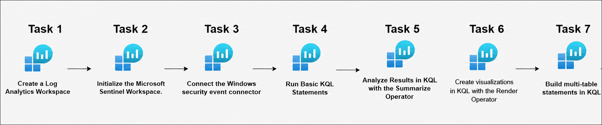

### Task 1: Create a Log Analytics Workspace

In this task, you will create a Log Analytics workspace for use with Microsoft Defender for Cloud.

1. In the Search bar of the Azure portal, type **Log Analytics (1)**, then select **Log Analytics workspaces (2)**.

   

1. Select **+ Create** from the command bar.

   

1. To create a **log analytics workspace**, follow these steps:

    - Subscription **Accept default subscription (1)**
    - Select **RG-Defender (2)** resource Group from drop down
    - For the Name, enter **uniquenameDefender (3)**.
    - Leave the **default Region (4)**.
    - Select **Review + Create (5)**.

      

1. Once the workspace validation has passed, select **Create**.

   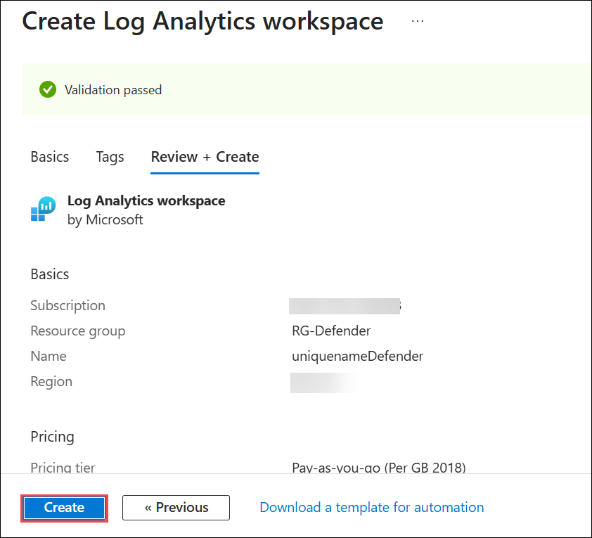

1. Wait for the new workspace to be provisioned, this may take a few minutes.

### Task 2: Initialize the Microsoft Sentinel Workspace.

In this task, you will set up a Microsoft Sentinel workspace within the Azure portal. This workspace will be the foundation for monitoring, detecting, and responding to security threats.

1. In the Search bar of the Azure portal, type **microsoft sentinel (1)**, then select **Microsoft Sentinel (2)**.

   

1. Click on **+ Create**.  

    

1. Next, in Add Microsoft Sentinel to a workspace page.

1. Select your existing  **log analytics workspace (1)** that was created in the previous task, then select **Add (2)**. This could take a few minutes.

   

1. In the Microsoft Sentinel free trial activated tab, select **Ok**.

    

### Task 3: Connect the Windows security event connector

In this task, you will connect an Azure Windows VM to Microsoft Sentinel by installing the Windows Security Events data connector, creating a Data Collection Rule to collect all security events, and confirming the connection.

1. Open a new tab in Edge browser and navigate to the **Defender portal** using the link below:

     ```
     https://security.microsoft.com/
     ```

1. In the Microsoft Defender portal page, follow the below instructions to install the data connector:

    - Click **Show navigation (1)** to expand the left navigation pane. Under **Microsoft Sentinel (2)**, expand **Content management (3)** and select **Content hub (4)**.

    - On the **Content hub** page, enter **Windows Security Events (5)** in the search box and press **Enter**. From the search results, select **Windows Security Events (6)**.

       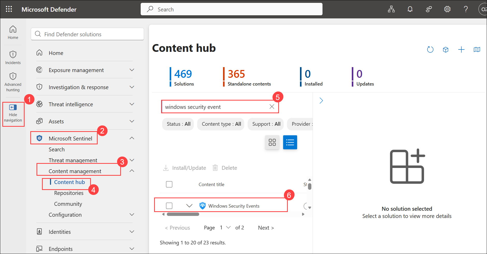

       > **Note:** After opening the **Microsoft Defender portal**, it may take **5–10 minutes** for the **Microsoft Sentinel workspace** to appear in the **Workspaces** list. If no workspace is displayed initially, try refreshing the page using **Ctrl + F5**, signing out by selecting the circle with your initials in the top-right corner and choosing **Sign out**, and then signing back in using your **Tenant Email** credentials. You can also try opening the portal in **InPrivate/Incognito mode**. If the workspace is **already connected**, please **proceed to the next step**. 

       > **Important:** The total lab duration already includes any waiting time required for deployments, data connectors, or services (such as the **5–10 minutes** mentioned above). Please do not worry if certain steps take additional time to complete, and plan your activities accordingly while performing the lab.

1. Click on **Install** on the right navigation page that shows up, scroll down if you don't see the Install button.

     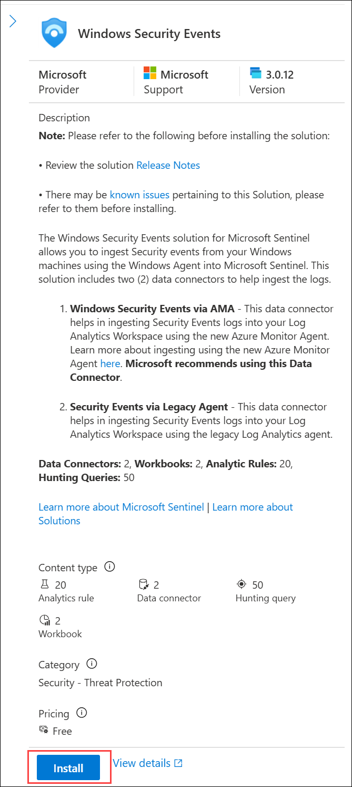

     > **Note:** The installation may take up to a minute. Wait for the Install Success notification

1. When the installation completes select **Manage**, scroll down if you don't see the Manage button.

     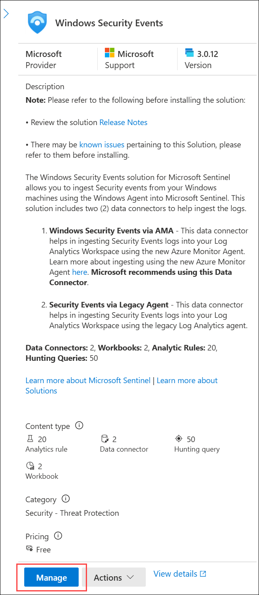

     > **Note:** The Windows Security Events solution installs both the Windows Security Events via AMA and the Security Events via Legacy Agent Data connectors, along with 2 Workbooks, 20 Analytic Rules, and 43 Hunting Queries.

1. Select the check box for Windows **Security Events via AMA (1)** Data connector, and select **Open connector page (2)** on the connector information blade.

     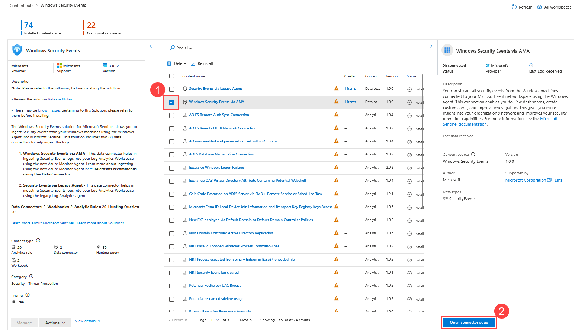
    
     >**Note:** If you don't see the connectors, you need to close the tab.

     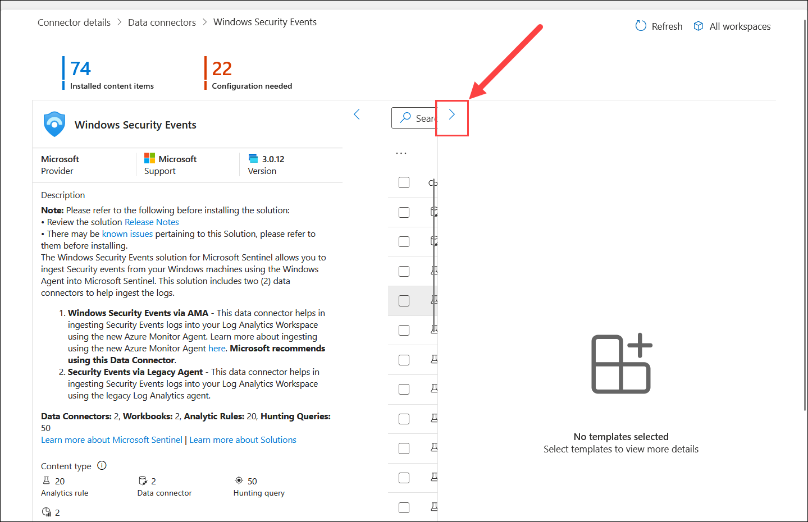

1. In the **Configuration section (1)**, select the **+ Create data collection rule (2)**.

     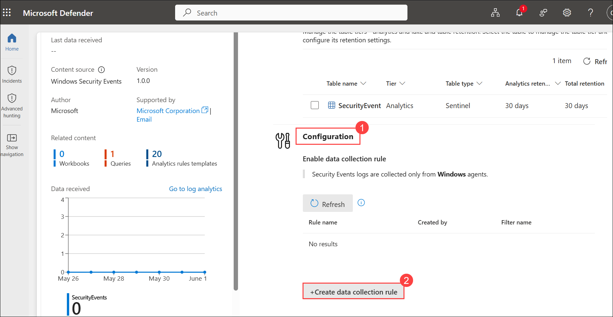

1. On the **Basics** tab of the **Create Data Collection Rule** pane, enter the following details:

    -  **Rule Name:** **windows-security-events (1)**

    - **Subscription:** Select the **default assigned subscription (2)**.

    - **Resource group:** Select **RG-Defender** resource group from the drop-down list **(3)**.

    - Select **Next: Resources > (4)**

      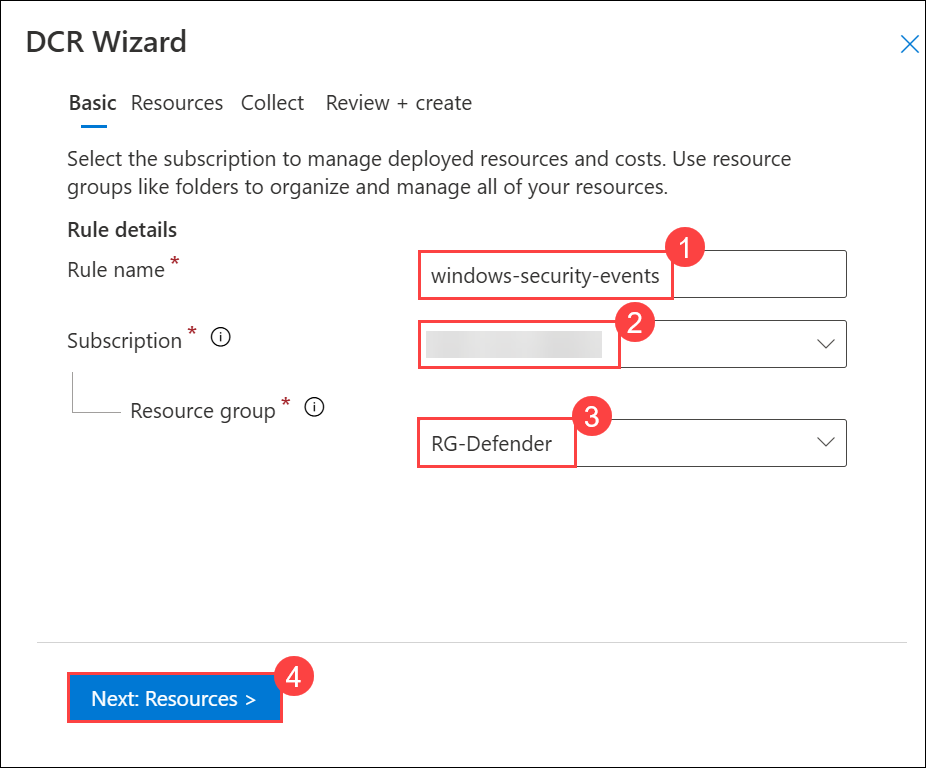

1. On the **Resources** tab of the **Select a scope** page, perform the following steps:

    - Expand the resource group **WIN-1** under default subscription

    - Select the Windows virtual machine named **WIN1 (1)**

    - Click on **Next: Collect > (2)**.

      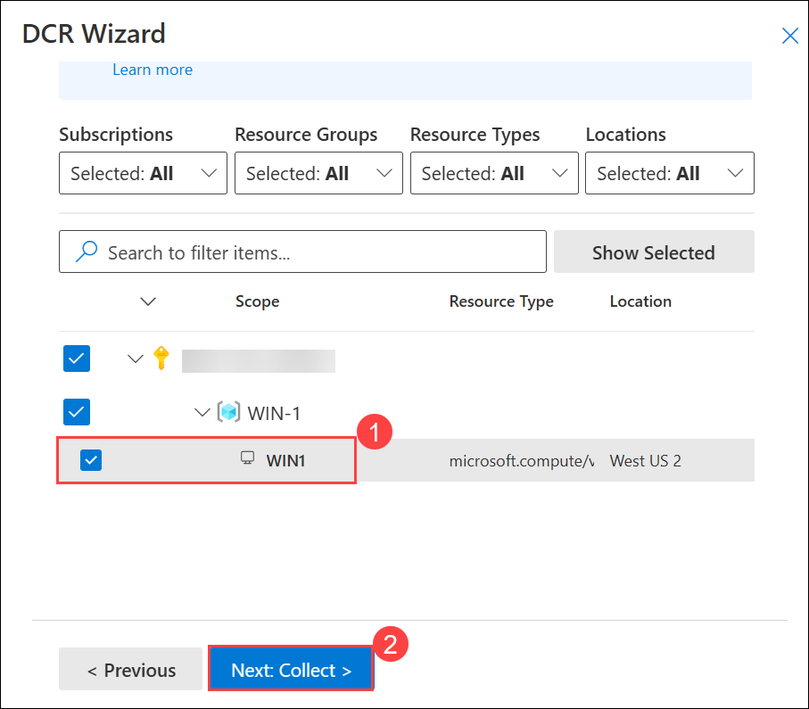

      >**Note:** Note: This lab is provided with a pre-created Windows virtual machine (for the ease of the users), which can be added as a resource to connect with Microsoft Sentinel.

1. On the Collect tab, follow the below instructions:

    - Select which events to stream: Choose **All Security Events (1)**

    - Click on **Next : Review + create > (2)**.

      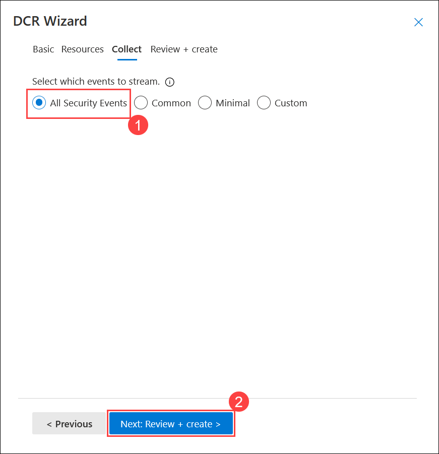

1. Review the configuration and click on **Create.**

    > **Note:** Wait for the Successfully installed extension notification within the Azure portal, implying that the DCR has been created along with the AMA being installed successfully. Select Refresh to see the new data collection rule listed.

1. On the **Microsoft Sentinel | Configuration | Data connectors** page click on **Windows Security Events via AMA**, under configuration notice that now the **Windows Security Events via AMA** data connector is successfully connected with Microsoft Sentinel.

    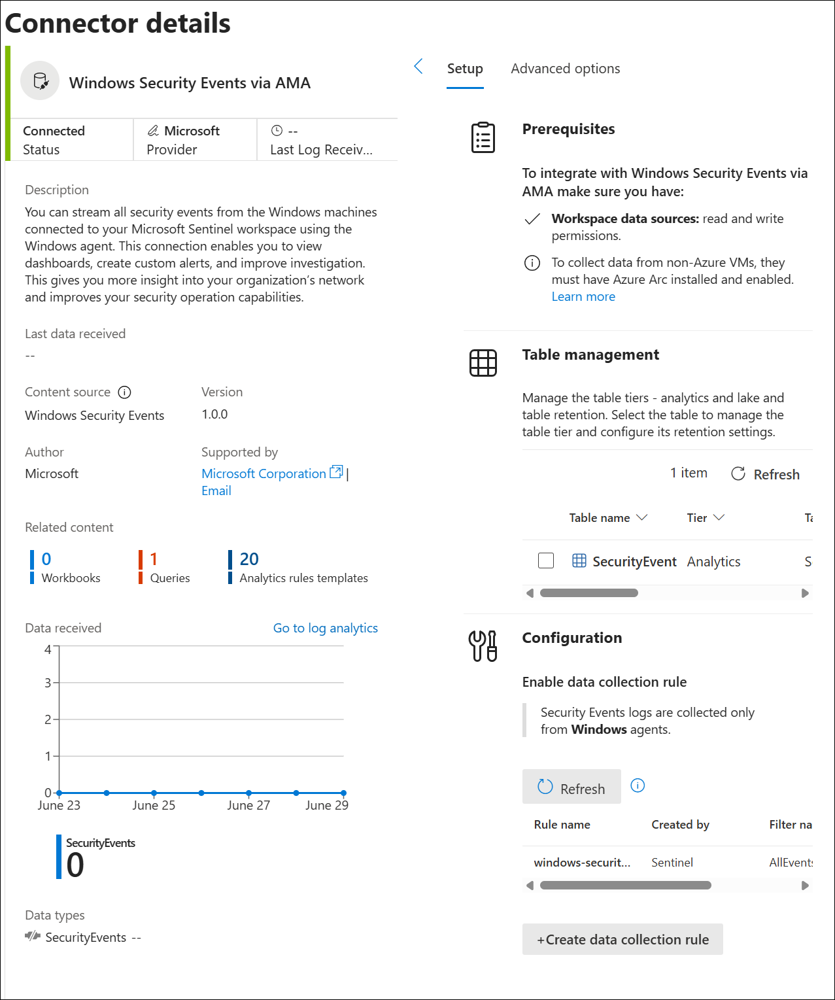

    > **Note:** It may take 15–20 minutes for the Windows Security Events data connector to show a Connected status after configuration.

### Task 4: Run Basic KQL Statements

In this task, you will build basic KQL statements.

   > **Important:** For each query, clear the previous statement from the Query Window or open a new Query Window by selecting **+** after the last opened tab (up to 25).

1. In the Microsoft Defender navigation menu, scroll down and expand the **Investigation & Response (1)** section.

1. Expand the **Hunting (2)** section and select **Advanced hunting (3)**.

   

    > **Note:** Please paste any KQL queries first in Notepad and then copy from there to the New Query 1 Log window to avoid any errors.

    > **Note:** If you receive the message, "security.microsoft.com wants to.. See text and images copied to the clipboard", select Allow.

1. In the query editor, enter the following query **(1)** and select the **Run (2)** button. You should see the query results in the bottom window.

    ```KQL
    SecurityEvent
    ```

    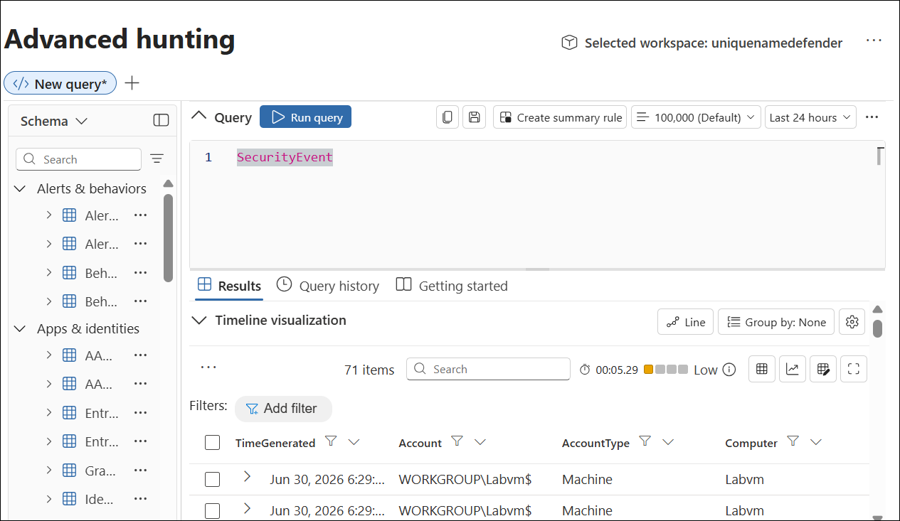

    >**Note:** It may take 15-20 minutes for the query results to appear.

    > **Note:** `Some KQL queries may initially return "No results found in the specified time frame." This can occur because Windows Security Events collected through the Azure Monitor Agent (AMA) may take several minutes to be ingested into the workspace, or because the specific event IDs used in the query have not yet been generated on the virtual machine. If this happens, wait 10–15 minutes and rerun the query. If the issue persists, try increasing the query time range (for example, from Last 1 hour to Last 24 hours or Last 7 days)`

1. Change the **Time range** to **Last hour** in the Query Window.

    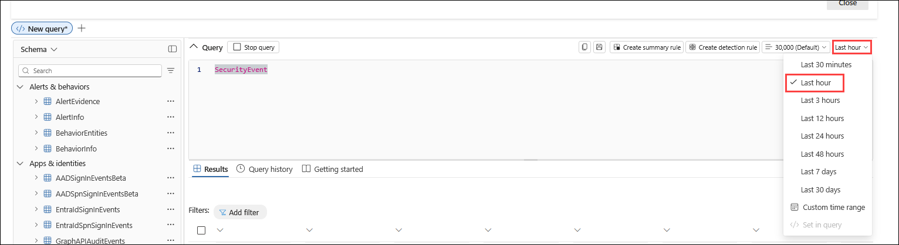

1. In the Query Window, enter the following statement and select **Run**:

    > **Hint:** If the above command is not getting output replace "err" to "new".

    ```KQL
    search "err"
    ```

    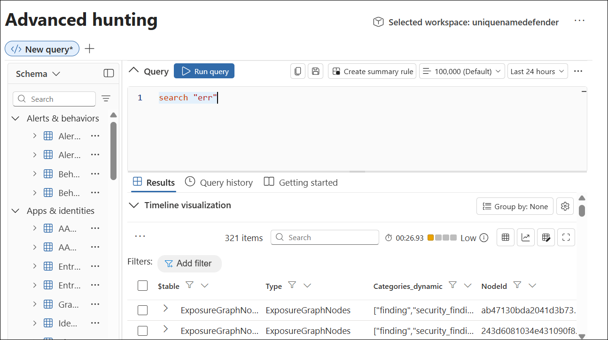

    > **Note:** It will take some time to reflect, you can move to other command and check this later.

1. The following statement demonstrates **search** across tables listed within the **in** clause. In the Query Window, enter the following statement and select **Run**:

    ```KQL
    search in (SecurityEvent,SecurityAlert,A*) "new"
    ```

    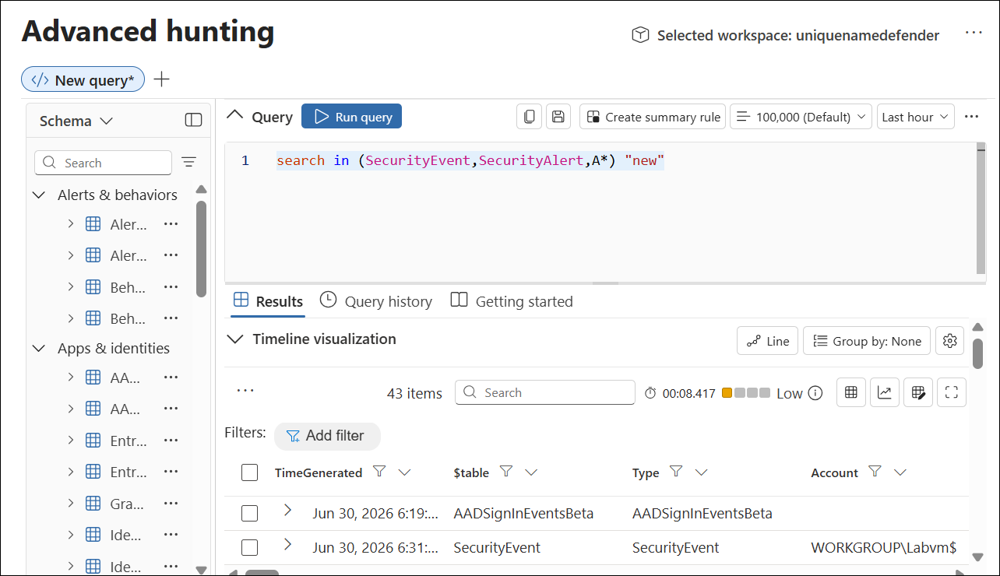

1. Change back the *Time range* to **Last 24 hours** in the Query Window.

1. The following statements demonstrate the **where** operator, which filters on a specific predicate. In the Query Window, enter the following statement and select **Run**:

    > **Important:** You should select **Run** after entering each query from the code blocks below.

    > **Note:** It will take some time to reflect for some commands, you can move to other commands and check this later.

    ```KQL
    SecurityEvent  
    | where TimeGenerated > ago(7d)
    ```

    >**Note:** The *Time range* now shows *Set in query* since we are filtering with the TimeGenerated column.

    ```KQL
    SecurityEvent  
    | where TimeGenerated > ago(7d) and EventID == "4624"
    ```

1. The following statement demonstrates the use of the **let** statement to declare *variables*. In the Query Window, enter the following statement and select **Run**:

    ```KQL
    let timeOffset = 10m;
    let discardEventId = 4688;
    SecurityEvent
    | where TimeGenerated > ago(timeOffset*60) and TimeGenerated < ago(timeOffset)
    | where EventID != discardEventId

    ```

1. The following statement demonstrates the use of the **let** statement to declare a *dynamic list*. In the Query Window, enter the following statement and select **Run**:

    ```KQL
    let suspiciousAccounts = datatable(account: string) [
    @"\administrator", 
    @"NT AUTHORITY\SYSTEM"
    ];
    SecurityEvent  
    | where TimeGenerated > ago(1h)
    | where Account in (suspiciousAccounts)
    ```

1. The following statement demonstrates the use of the **let** statement to declare a *dynamic table*. In the Query Window, enter the following statement and select **Run**:

    ```KQL
    let LowActivityAccounts =
        SecurityEvent 
        | summarize cnt = count() by Account 
        | where cnt < 1000;
    LowActivityAccounts
    ```

### Task 5: Analyze Results in KQL with the Summarize Operator

In this task, you'll build KQL statements to aggregate data. **Summarize** groups the rows according to the **by** group columns, and calculates aggregations over each group.

1. The following statement demonstrates the **count()** function, which returns a count of the group. In the Query Window enter the following statement and select **Run**:

    ```KQL
    SecurityEvent  
    | where TimeGenerated > ago(7d) and EventID_s == 4688  
    | summarize count() by Computer
    ```

    > **Note:** It will take some time to reflect for some commands, you can move to other commands and check this later.

1. The following statement demonstrates the **count()** function, but in this example, we name the column as *cnt*. In the Query Window, enter the following statement and select **Run**:

    ```KQL
    SecurityEvent 
    | where TimeGenerated > ago(7d) and EventID == 4624  
    | summarize cnt=count() by AccountType, Computer
    ```

    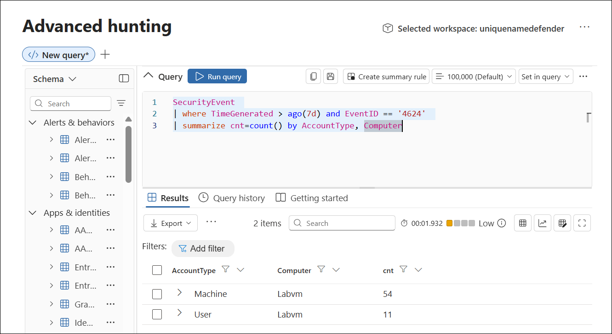

1. The following statement demonstrates the **dcount()** function, which returns an approximate distinct count of the group elements. In the Query Window, enter the following statement and select **Run**:

    ```KQL
    SecurityEvent 
    | where TimeGenerated > ago(7d)
    | summarize dcount(IpAddress)
    ```

1. The following statements demonstrate the importance of understanding results based on the order of the *pipe*. In the Query Window, enter the following queries and run each query separately:

    1. **Query 1** has Accounts for which the last activity was a login. The SecurityEvent table will first be summarized and return the most current row for each Account. Then only rows with EventID equals 4624 (login) will be returned.

        ```KQL
        SecurityEvent  
        | summarize arg_max(TimeGenerated, *) by Account
        | where EventID == '4688'  
        ```

    1. **Query 2** has the most recent login for Accounts that have logged in. The SecurityEvent table is filtered to only include EventID = 4624. Then these results are summarized for the most current login row by Account.

        ```KQL
        SecurityEvent  
        | where EventID == '4624'  
        | summarize arg_max(TimeGenerated, *) by Account
        ```

    >**Note:**  You can also review the "Total CPU" and "Data used for processed query" by selecting the "Query details" link on the lower right and compare the data between both statements.

1. The following statement demonstrates the **make_list()** function, which returns a *list* of all the values within the group. This KQL query will first filter the EventID_s with the where operator. Next, for each Computer, the results are a JSON array of Accounts. The resulting JSON array will include duplicate accounts. In the Query Window, enter the following statement and select **Run**: 

    ```KQL
    SecurityEvent  
    | where TimeGenerated > ago(7d)
    | where EventID == '4624'  
    | summarize make_list(Account) by Computer
    ```

1. The following statement demonstrates the **make_set()** function, which returns a set of *distinct* values within the group. This KQL query will first filter the EventID_s with the where operator. Next, for each Computer, the results are a JSON array of unique Accounts. In the Query Window, enter the following statement and select **Run**: 

    ```KQL
    SecurityEvent  
    | where TimeGenerated > ago(7d)
    | where EventID == '4624'  
    | summarize make_set(Account) by Computer
    ```

### Task 6: Create visualizations in KQL with the Render Operator

In this task, you'll use generate visualizations with KQL statements.

1. The following statement demonstrates the **render** operator visualizing results with a time series. The **bin()** function rounds all values in a timeframe and groups them, used frequently in combination with **summarize**. If you have a scattered set of values, the values are grouped into a smaller set of specific values. Combining the generated results and pipe them to a **render** operator with a **timechart** provides a time series visualization. In the Query Window, enter the following statement and select **Run**: 

    ```KQL
    SecurityEvent  
    | where TimeGenerated > ago(7d)
    | summarize count() by bin(TimeGenerated, 1m)
    | render timechart
    ```

    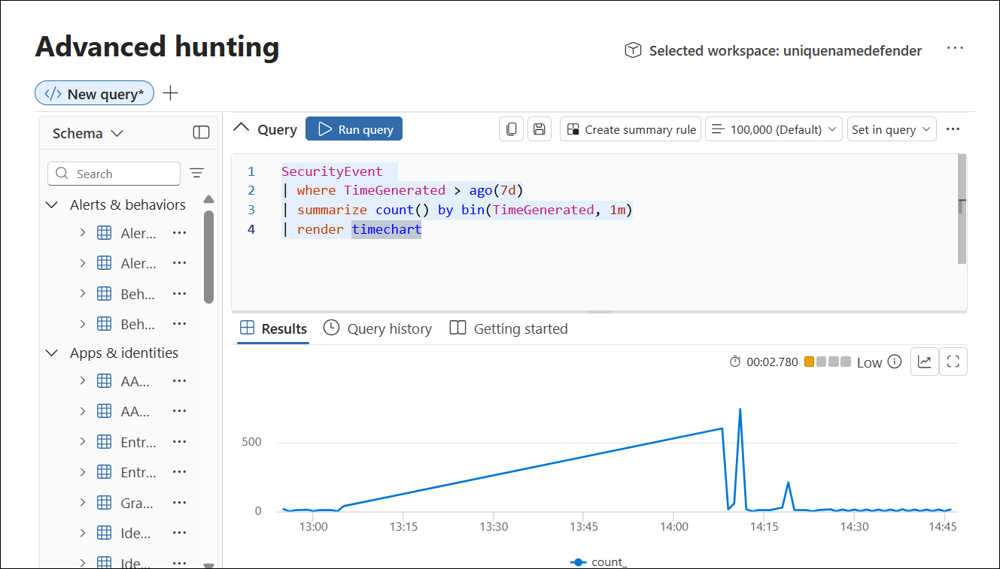

### Task 7: Build multi-table statements in KQL

In this task, you'll build multi-table KQL statements.

1. Change the **Time range** to **Last 7 days** in the Query Window. This limits our results for the following statements.

1. The following statement demonstrates the **union** operator, which takes two or more tables and returns all their rows. Understanding how results are passed and impacted with the pipe character is essential. In the Query Window, enter the following statements and select **Run** for each query separately to see the results:

    > **Note:** It will take some time to reflect for some commands, you can move to other commands and check this later.

    1. **Query 1** returns all rows of SecurityEvent and all rows of SigninLogs.

        ```KQL
        SecurityEvent  
        | union SigninLogs  
        ```

    1. **Query 2** returns one row and column, which is the count of all rows of SigninLogs and all rows of SecurityEvent.

        ```KQL
        SecurityEvent  
        | union SigninLogs  
        | summarize count() 
        ```

    1. **Query 3** returns all rows of SecurityEvent and one (last) row for SigninLogs. The last row for SigninLogs has the summarized count of the total number of rows.

        ```KQL
        SecurityEvent  
        | union (SigninLogs | summarize count() | project count_)
        ```

1. The following statement demonstrates the **union** operator support to union multiple tables with wildcards. In the Query Window, enter the following statement and select **Run**:

    ```KQL
    union Security*  
    | summarize count() by Type
    ```

1. The following statement demonstrates the **join** operator, which merges the rows of two tables to form a new table by matching values of the specified column(s) from each table. In the Query Window, enter the following statement and select **Run**:

    ```KQL
    SecurityEvent  
    | where EventID == "4624" 
    | summarize LogOnCount=count() by EventID, Account
    | project LogOnCount, Account
    | join kind = inner( 
    SecurityEvent  
    | where EventID == "4624" 
    | summarize LogOffCount=count() by EventID, Account
    | project LogOffCount, Account
    ) on Account
    ```

    >**Important:**
     The first table specified in the join is considered the Left table. The table after the **join** operator is the right table. When working with columns from the tables, the $left.Column name and $right.Column name is to distinguish which tables column are referenced. The **join** operator supports a full range of types: flouter, inner, innerunique, leftanti, leftantisemi, leftouter, leftsemi, rightanti, rightantisemi, rightouter, rightsemi.


## Review

In this lab, you have completed the following:
- Created a Log Analytics Workspace
- Initialized the Microsoft Sentinel Workspace.
- Connect the Windows security event connector
- Ran Basic KQL Statements
- Analyzed Results in KQL with the Summarize Operator
- Created visualizations in KQL with the Render Operator
- Build multi-table statements in KQL
## PROCEED TO  THE NEXT EXERCISE
