# Lab 08 - Exercise 7: Investigate Incidents

## Lab Scenario

You are a Security Operations Analyst working at a company that implemented Microsoft Sentinel. You already created Scheduled and Microsoft Security Analytics rules. The Fusion and Anomalies Analytics rules are also enabled in your environment. Now is the time to investigate the Incidents created by them.

An incident can include multiple alerts. It is an aggregation of all the relevant evidence for a specific investigation. The properties related to the alerts, such as severity and status, are set at the incident level. After you let Microsoft Sentinel know what kinds of threats you are looking for and how to find them, you can monitor detected threats by investigating incidents.

>**Important:** The lab exercises for Learning Path #9 are in a **standalone** environment. If you exit the lab before completing it, you will be required to re-run the configurations again.

## Lab Objectives
 In this lab, you will Understand the following:
 - Task 1: Investigate an incident

## Estimated Timing: 20 Minutes

## Architecture Diagram

  

### Task 1: Investigate an incident

In this task, you will investigate an incident.

1. In the Microsoft Defender navigation menu, scroll down and expand the **Investigation & response (1)** section.

1. Expand the **Incidents & alerts (2)** section and select **Incidents (3)**.

    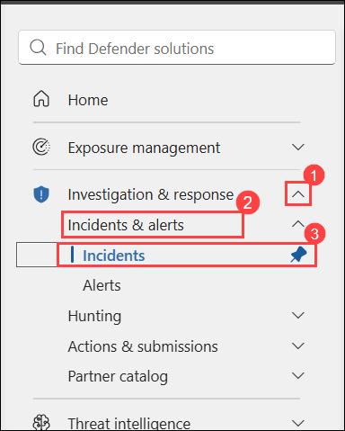 

1. Review the list of incidents.

    >**Note:** The Analytics rules are generating alerts and incidents on the same specific log entry. Remember that this was done in the *Query scheduling* configuration to generate more alerts and incidents to be utilized in the lab.
  
1. In the Microsoft Defender navigation menu, scroll down and expand the **Investigation & response** section.

1. Expand the **Incidents & alerts** section and select **Incidents**.

1. Review the list of incidents.

    >**Note:** The Analytics rules are generating alerts and incidents on the same specific log entry. Remember that this was done in the *Query scheduling* configuration to generate more alerts and incidents to be utilized in the lab.
  
1. Select one of the **Alert from WIN-xxxxxx** incidents.

    > **Note:** If the **Startup RegKey** incident is displayed in the list, select it to continue with the exercise.

1. Review the incident details on the page that opened.

1. Select **Manage incident** from the toolbar. It will have a *pencil* icon.

	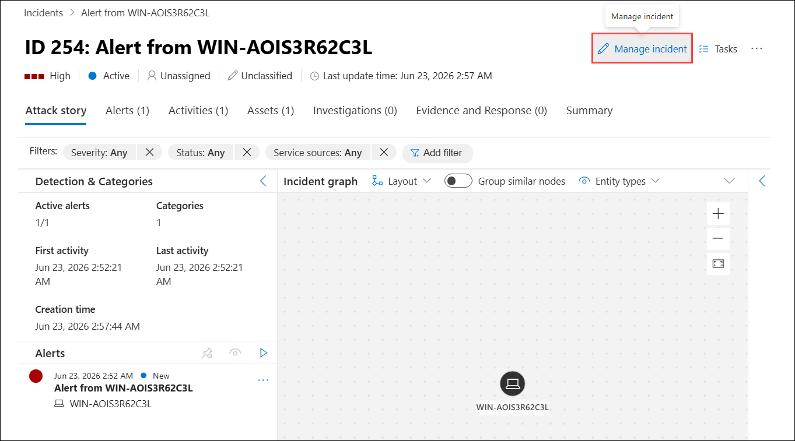

1. On the *Manage incident* page for the incident, verify that the *Status* is **Active**. If not, change the Status to **Active** and then select **Save**.

1. In the *Incident tags* field, type **RegKey** and select **RegKey (Create new)**.

	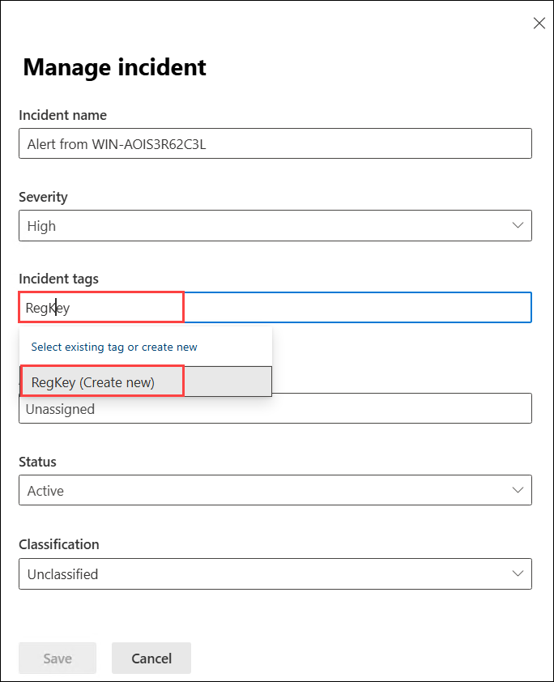

1. In the *Assign to* field, select the box and then select **Assign to me** from the dropdown.

	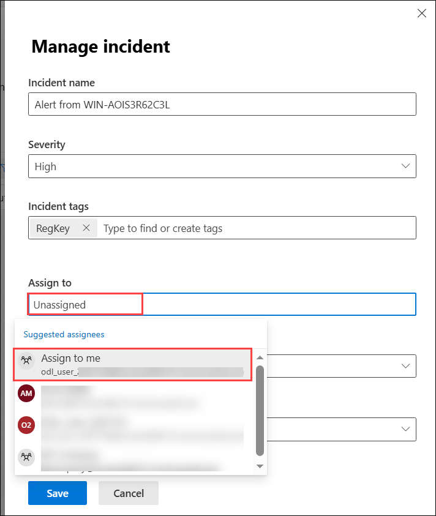

1. Select the **Save** button and the page closes.

1. Review the **Attack story** tab. 

1. Select the ellipsis icon **(...) (1)** and then choose the **Run playbook (2)** from the toolbar.

	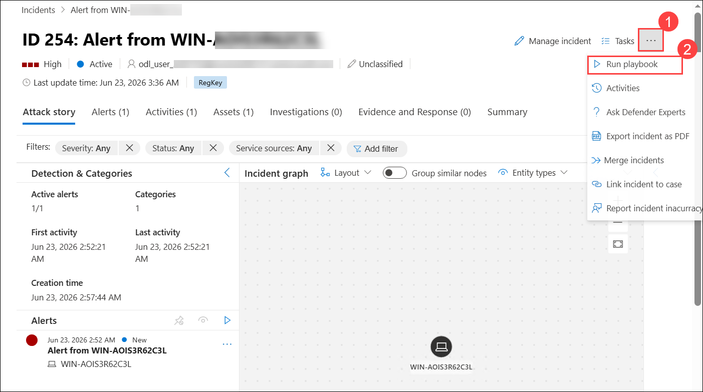

1. You should see the *Defender_XDR_Ransomware_Playbook_SecOps_Tasks* playbook. This option helps you to run playbooks manually.

1. Close the *Run playbook on incident* blade by selecting the **X** icon in the top right.

	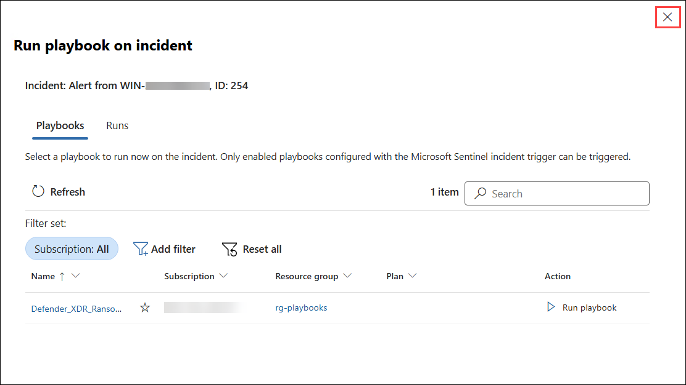

1. Review the **Assets** window. At least the *Host* entity that we mapped within the KQL query from the previous exercise should appear. **Hint:** If no entities are shown, refresh the page.

	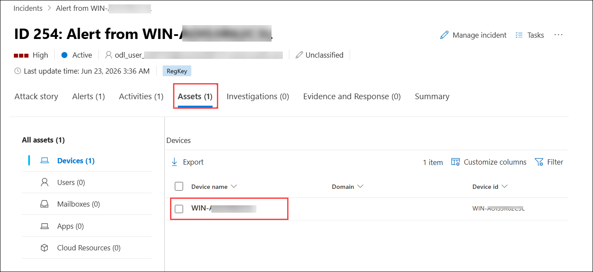

1. Select the new **Tasks** button from the command bar.

	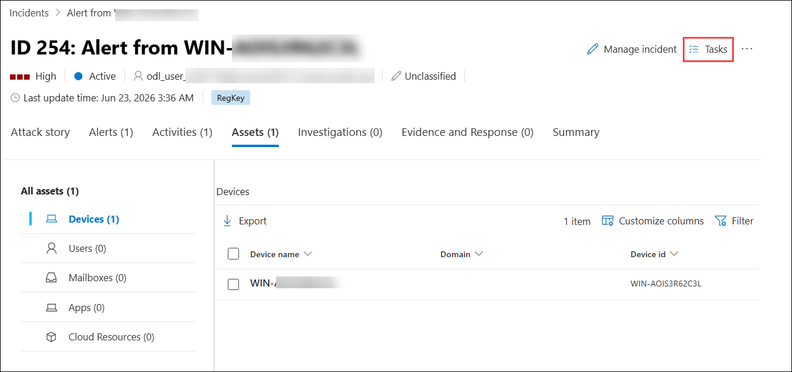

1. Select **+ Add task (1)**, type **Review who owns the machine (2)** in the Title box and select **Save (3)**.

	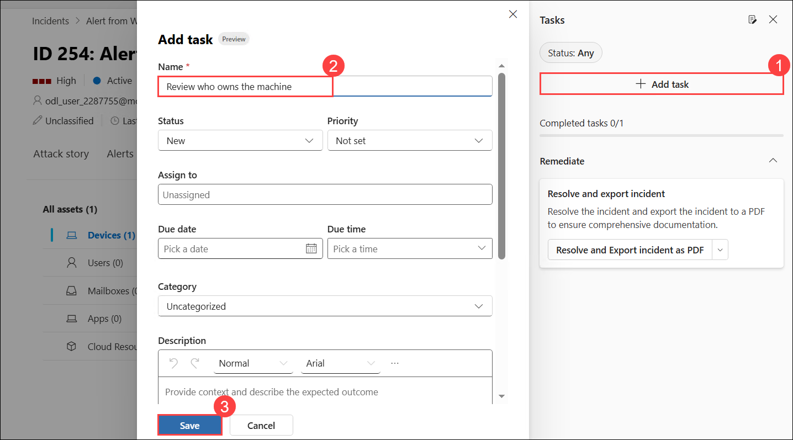

1. Close the *Incident tasks* page by selecting the **x** icon in the top right.

	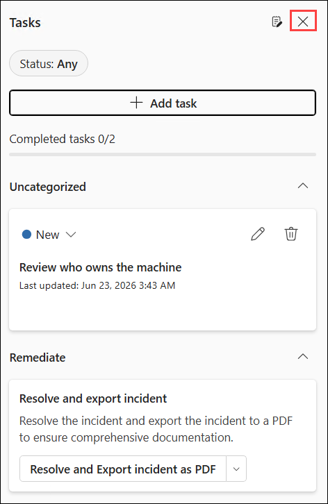

1. Select the new **Activities** button from the command bar.

	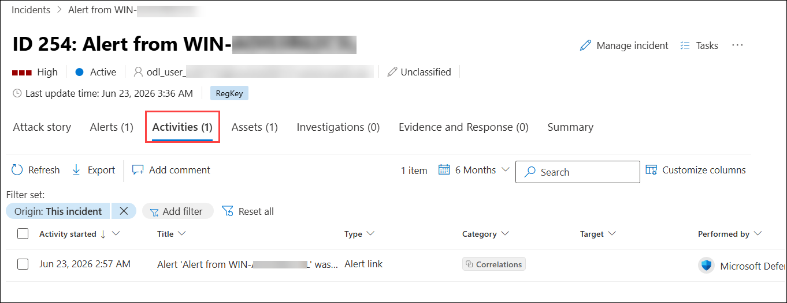

1. Review the actions you have taken during this exercise.

	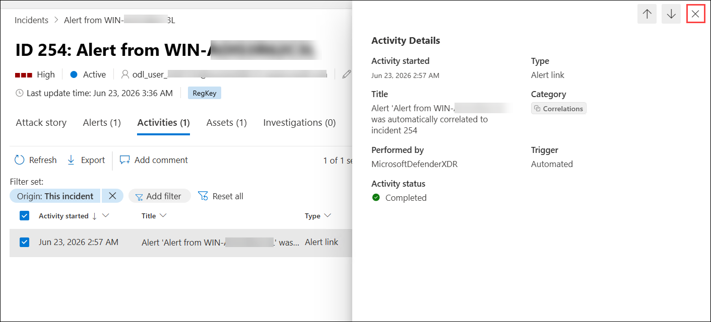

1. Close the *Activities* page by selecting the **x** icon in the top right.

1. In the *Attack story* tab, collapse the *Detections & Categories* section by selecting the **<** to have more space for the *Incident graph*.

    >**Hint:** If the icons are too small for your screen, select **(+)** to magnify them.
	
	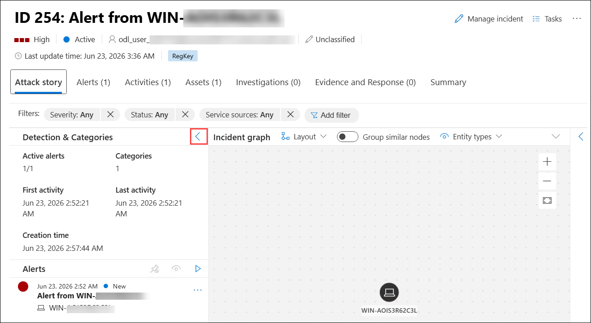

1. Now select the **WINServer** entity, a window on the right opens for more detailed information. Review the **Info** page.

1. Select the **Incident** which we are exploring in the previous instructions, click on **Active (1)** under **Status** column and select **Manage incident (2)**. 

	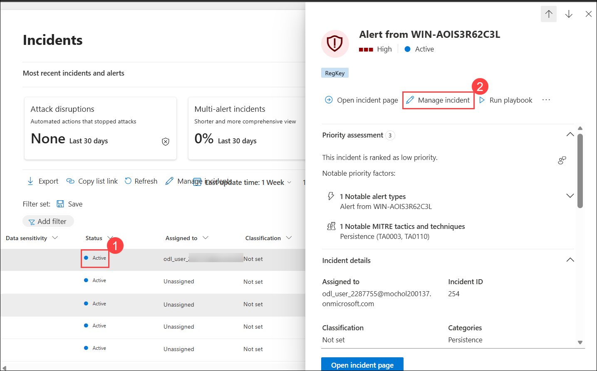

1. Back in the incident page, in the left pane select **Active Status** and select **Resolved (1)** and click on **Save (2)**.

	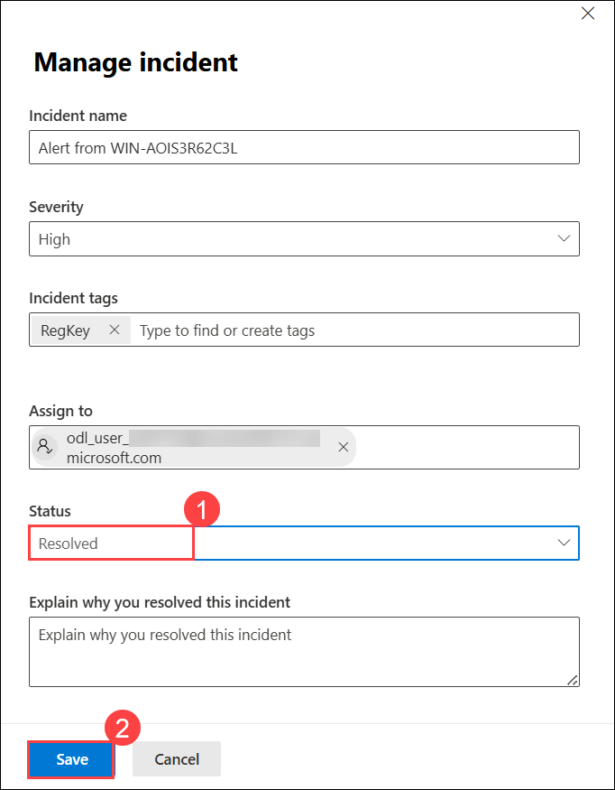

1. Now in the *Select classification* drop-down review the different options. After that, select **True positive - Others (1)** and then select **Save (2)**.

	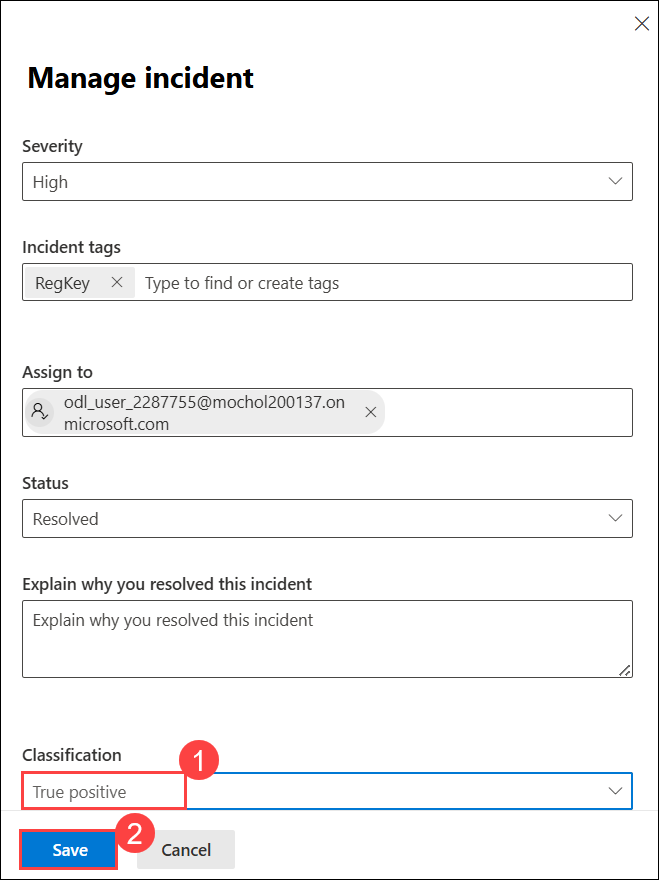

## Review
In this lab, you have completed the following:
- Investigated an incident.

## PROCEED TO  THE NEXT EXERCISE
