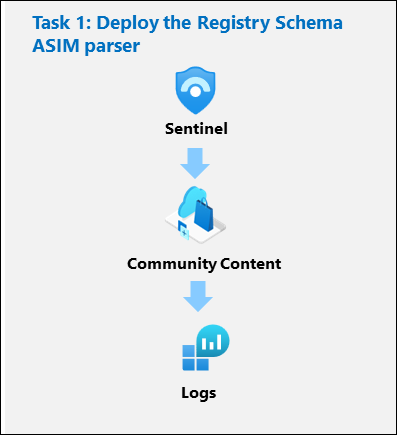
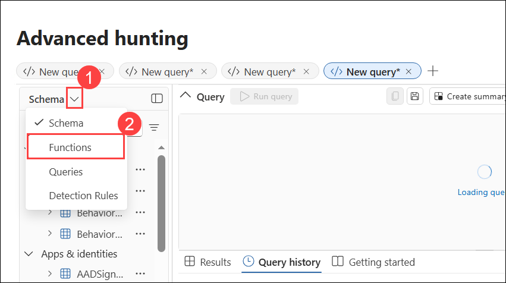
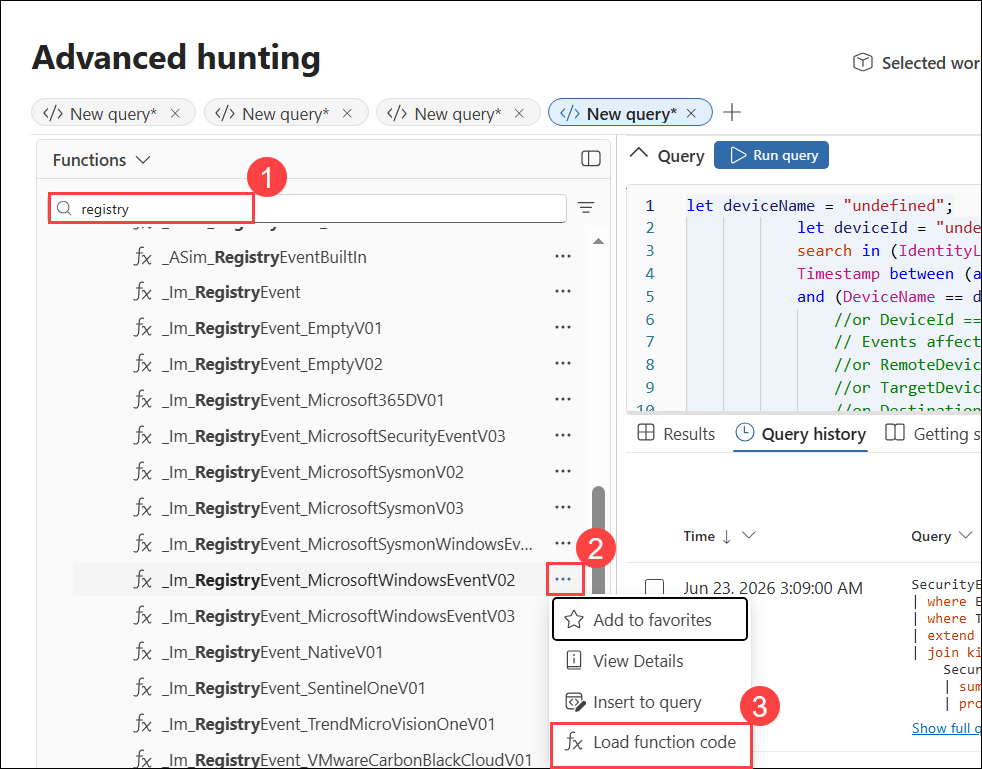
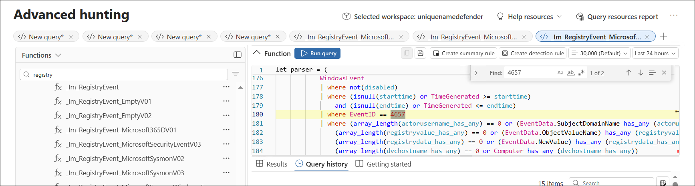

# Lab 08 - Exercise 8: Deploy ASIM parsers

## Lab Scenario

You're a Security Operations Analyst working at a company that implemented Microsoft Sentinel. You need to model ASIM parsers for a specific User Management event. These parsers will be finalized at a later time following the [Advanced Security Information Model (ASIM) User Management Event normalization schema reference].

>**Important:** The lab exercises for Learning Path #9 are in a **standalone** environment. If you exit the lab before completing it, you will be required to re-run the configurations again.

## Lab Objectives
 In this lab, you will Understand following:

 - Task 1: Deploy the User Management Schema ASIM parsers

## Estimated Timing: 30 Minutes

## Architecture Diagram

### Task 1: Deploy the User Management Schema ASIM parsers

In this task, you'll review the User Management Schema parsers that are included with the Microsoft Sentinel deployment.

1. Navigate back to **https://security.microsoft.com**

1. In the **Microsoft Defender** portal, expand **Investigation & response (1)**, expand **Hunting (2)**, and then select **Advanced hunting (3)**.

    

    >**Note:** Refresh the browser if log page is not loading

1. Open the *Schema (1)* drop-down select **Function (2)**.

	

1. In the *Search* bar type **registry (1)**, and scroll down through the ASIM parser functions until you see the following **_Im_RegistryEvent_MicrosoftWindowsEventxxx** for Microsoft Windows under the **Microsoft Sentinel** heading.

    >**Note:** We're using the xxx in the ASIM parser function name to account for version changes. At the time this lab was updated the function was _Im_RegistryEvent_MicrosoftWindowsEvent*V02*.

1. Locate the **_Im_RegistryEvent_MicrosoftWindowsEventxxx** ASIM function and then select **Load the function code (3)** from the ellipsis icon **(...) (2)**.

	

1. Review the KQL that is parsing the Event ID 4657 to simplifying your analysis of the data in the Microsoft Sentinel workspace.

	

    >**Hint:** Typing ctrl+f in the code window brings up *Find* and makes searching for *EventID: 4657* much easier.

1. **Run** the ASIM function query.

    >**Note:** A **Semantic error** may appear during this step. If it does, you can ignore the error and continue with the remaining steps.

## Review
In this lab, you have completed the following:

-  Deployed the User Management Schema ASIM parser 

## PROCEED TO  THE NEXT EXERCISE