# LAB PREREQUISITES

### Estimated Timing: 40 Minutes

## Prerequisites to be completed before proceeding to further exercises

## Lab Objectives

 In this lab, you will perform the following:

 - Task 1: Connect a non-Azure Windows Machine

### Task 1: Connect a non-Azure Windows Machine

In this task, you will install Azure Arc and connect a non-Azure Windows virtual machine to Microsoft Sentinel.  

> ### **Note:** <span style="color: maroon;">The steps up to point **39** of task 1 were covered in a previous labs. You can skip them and proceed directly to **Step 40** of the task. If you would like a refresher or want to understand how the resources are being configured in this exercise, feel free to review the steps before continuing.</span>

>**Important:** The next steps are done on a different machine than the one you were previously working on. Look for the Virtual Machine name references.

>**Important:** The **Windows Security Events via AMA** data connector requires Azure Arc for non-Azure devices. 

1. In the lab virtual machine, Select **WINserver** from the desktop.

   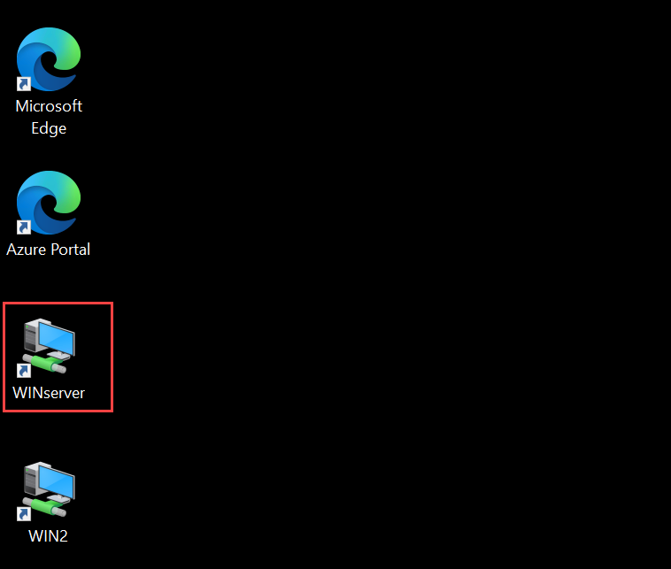

1. If **Connect to WINServer** prompted, click **Connect.**

     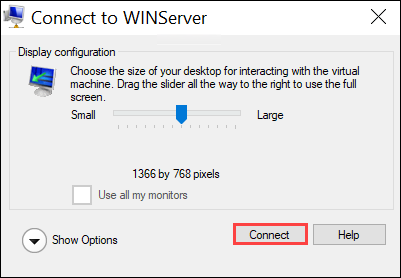  
    
1. Enter the **Password** as `Password.1!!` when prompted.

     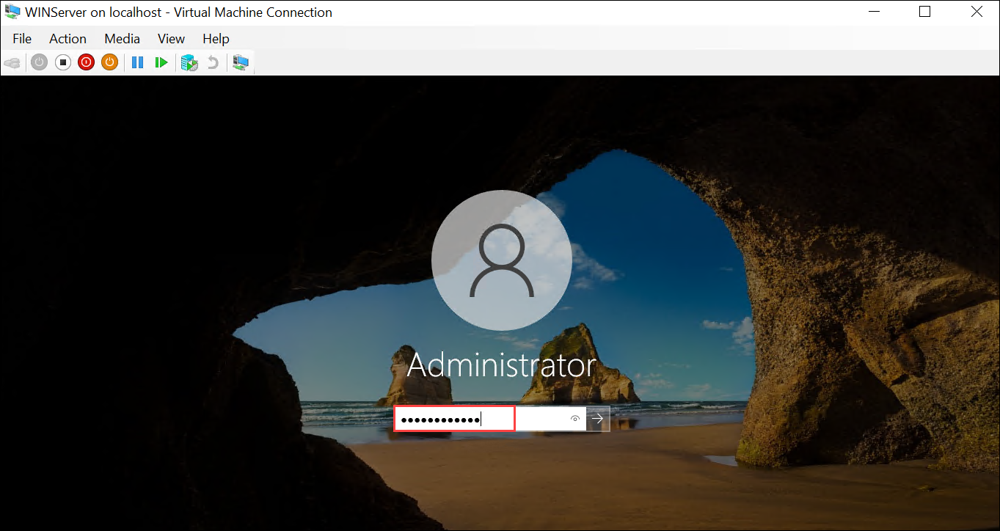

1. Open the Microsoft Edge browser inside **WINSERVER**.

1. On your virtual machine, click on the **Azure Portal** icon as shown below:
 
     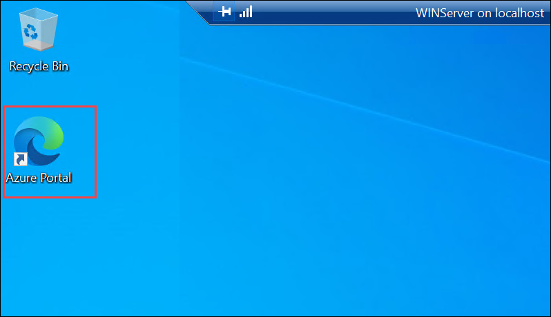
 
2. You'll see the **Sign into Microsoft Azure** tab. Here, enter your credentials:
 
   - **Email/Username:** <inject key="AzureAdUserEmail"></inject>
 
      
 
3. Next, provide your password:
 
   - **Password:** <inject key="AzureAdUserPassword"></inject>
 
     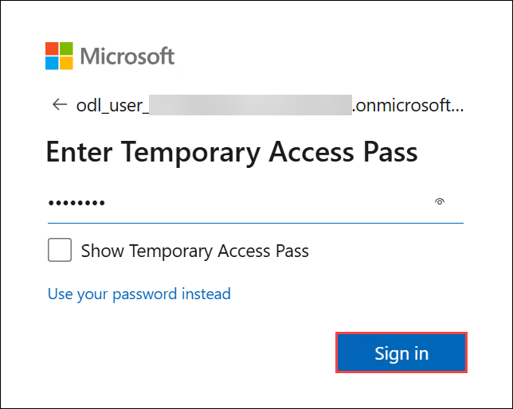
 
4. If prompted to stay signed in, you can click **No**.

    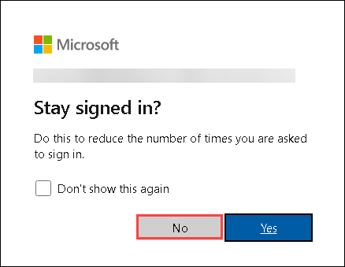

     >**Note:** If you are not able to copy-paste the username and password then:
     > - Go to Hyper-V manager.
     > - On the left-right click on **WINSERVER**.
     > - Click on Hyper-V settings.
     > - From there click on allow enhanced mode policy Under **Server** and enable the option.
     > - Again, click on allow enhanced mode under **User** and enable the option. Restart the WINSERVER machine once to reflect the changes.

     >**Note:** If the copy-paste function is still not working, first copy the required content. Then, in the top navigation pane of the WINSERVER Hyper-V VM, click on **Clipboard** and select **Type Clipboard Text** to paste it.
          
     > 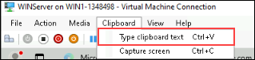

1. In the Search bar of the Azure portal, type **Azure Arc (1)**, then select **Azure Arc (2)**.

     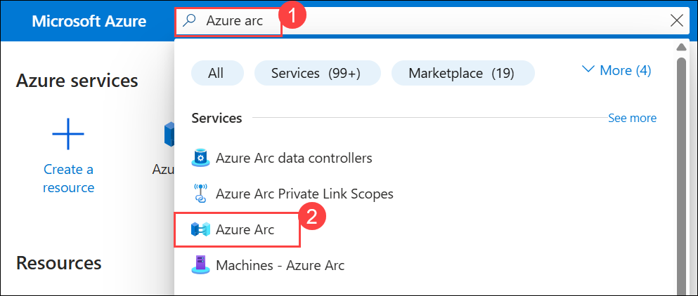

1. On the left side navigation pane under **Azure Arc resources** select **Machines (1)** and then click on **+ Onboard/Create (2)** drop dowm and then click on **Onboard existing machines (3)**.

     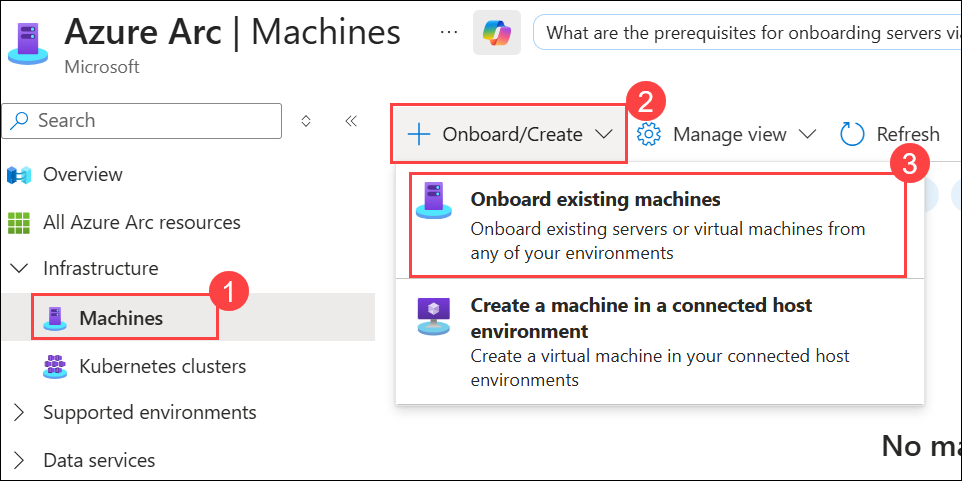

1. First, select the **East US** region.

1. Then, create a new resource group by clicking on **Create New (1)** with the name **RG-DEFENDER (2)** then click **OK (3)**

     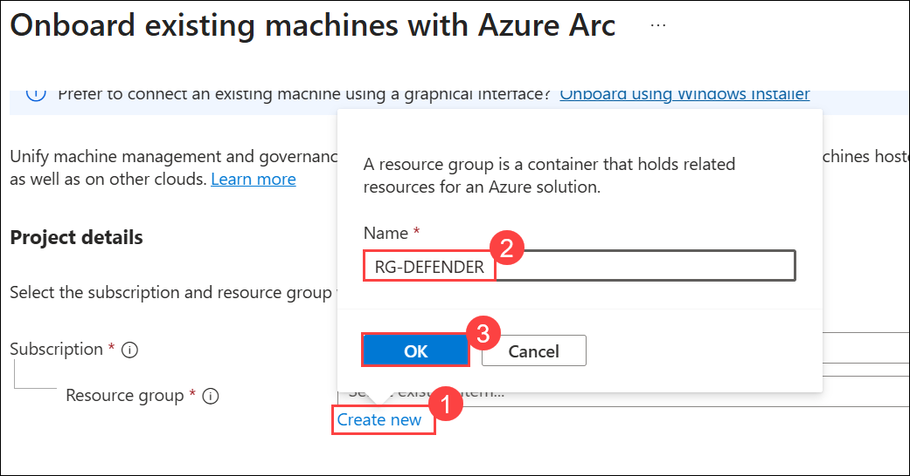
     
1. Review the **Server details** and **Connectivity method** options. Keep the default values and select **Next: Tags>** to get to the Tags tab.

     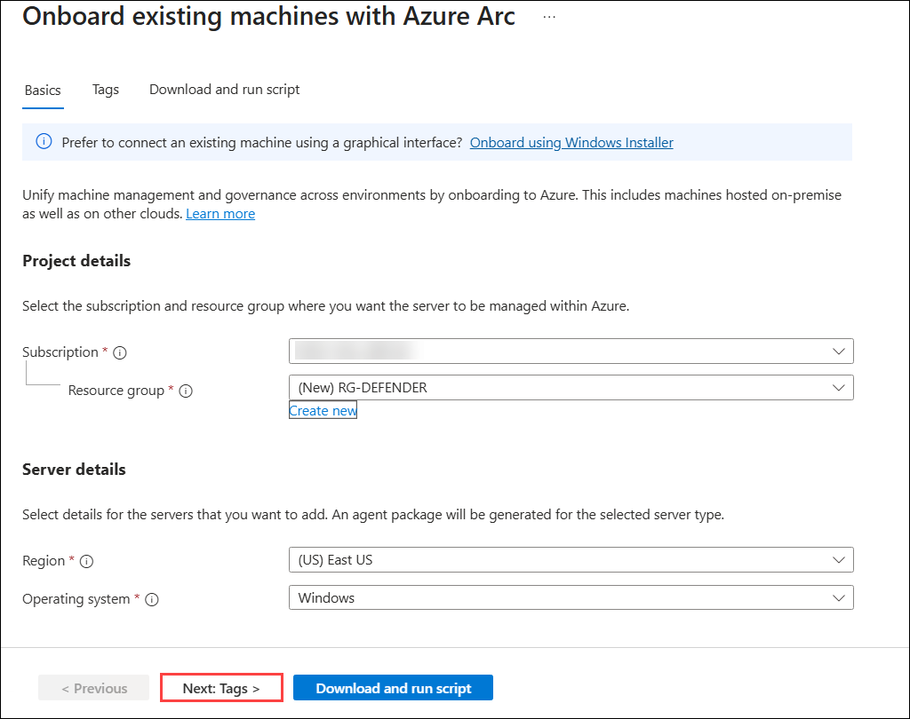

1. Select **Next: Download and run script >** to get to the Download and run script tab.

1. Scroll down and select the **Download** button. **Hint:** If your browser blocks the download, take action in the browser to allow it.

     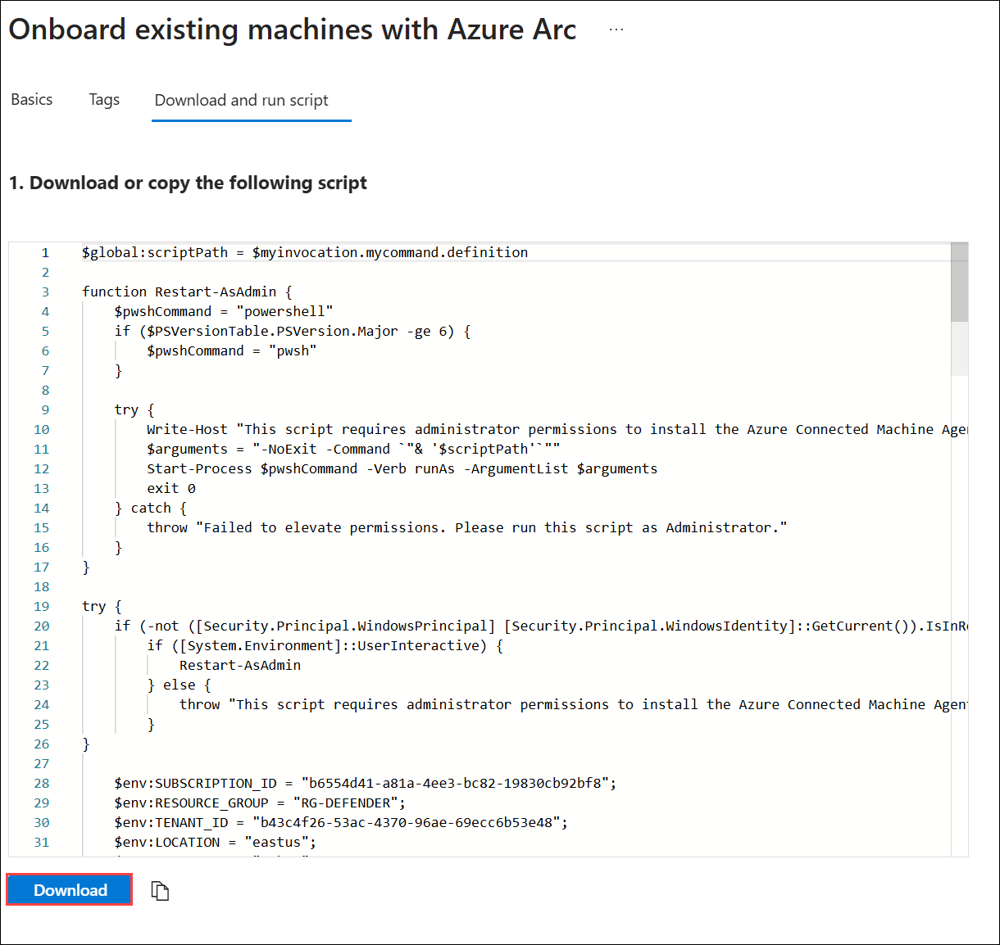

1. In Microsoft Edge Browser, select the ellipsis button (...) **(1)** if needed and then select **Keep (2)**.

   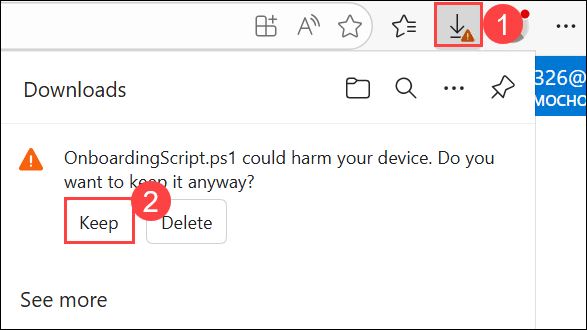     

1. Right-click the Windows Start **(1)** button and select **Windows PowerShell (Admin) (2)**.

      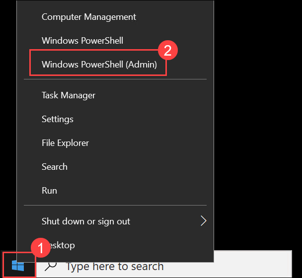
   
1. In case you get a UAC prompt, enter **Administrator** for "Username" and **Passw0rd!** for "Password", else skip to the next step.

1. Enter the below command.

    ```CommandPrompt
    cd C:\Users\Administrator\Downloads
    ```

    >**Note:** If you are not able to copy the content, then copy the required content to a notepad file using the Clipboard functionality in the top navigation pane of the Hyper V VM in the lab VM and paste it into the Powershell window.
 
1. Enter the below command and press enter.

    ```CommandPrompt
    Set-ExecutionPolicy -ExecutionPolicy Unrestricted
    ```

1. Enter **A** for Yes to All and press enter.

     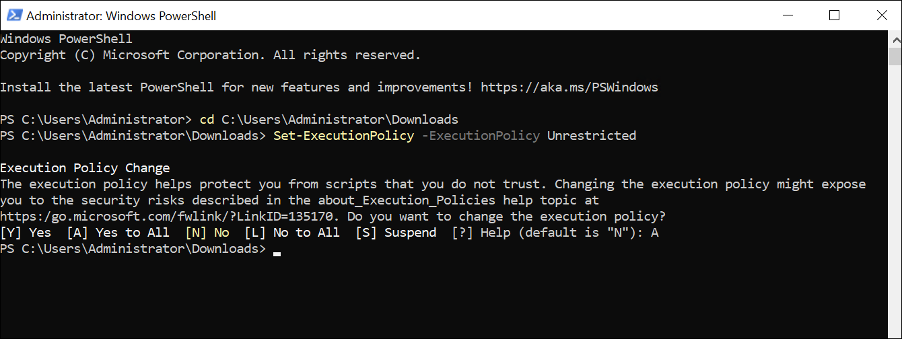

1. Type `.\OnboardingScript.ps1` and press enter.  

    >**Important:** If you get the error **"The term .\OnboardingScript.ps1 is not recognized..."**, make sure you are doing the steps for Task 3 on the WINSERVER virtual machine. Another issue might be that the name of the file changed due to multiple downloads, search for **".\OnboardingScript (1).ps1"** or other file numbers in the running directory.

    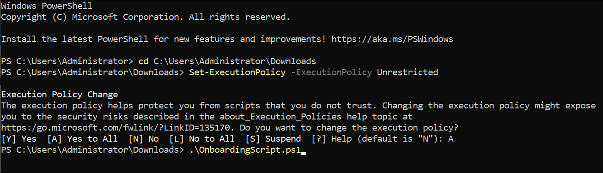

1. Enter **R** to Run once and press enter (this may take a couple of minutes).

     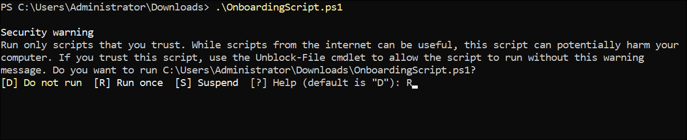

1. The setup process will open a new Edge browser tab to authenticate the Azure Arc agent. Select your admin account, wait for the message "Authentication complete" and then go back to the Windows PowerShell window.

      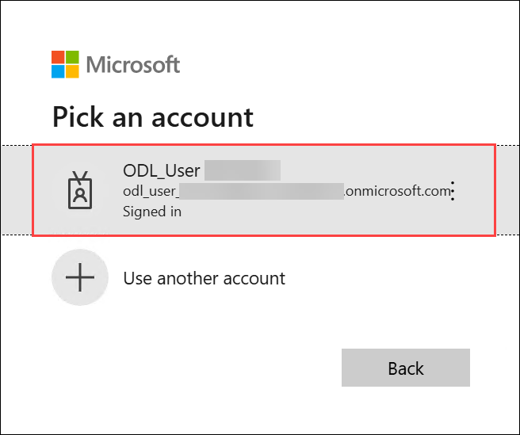

1. When the installation finishes,you will get a output like this in the powershell. 

     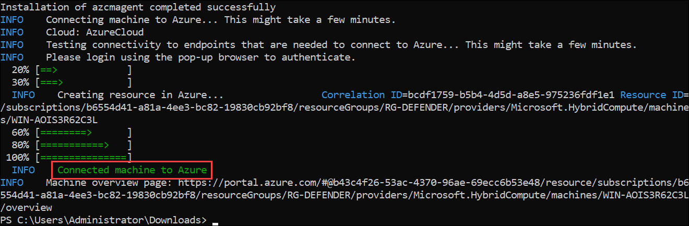

1. Then go back to the Azure portal page where you downloaded the script and select **Close**. Close the **Add servers with Azure Arc** to go back to the Azure Arc **Servers** page.

1. Select **Refresh** until **WIN-xxxxxxxxxxx** name appears.

    >**Note:** This could take a few minutes.

    >**Note:** **xxxxxxxxxxx** will be a random suffix of the **WIN-**, as demonstrated in the below image. 

     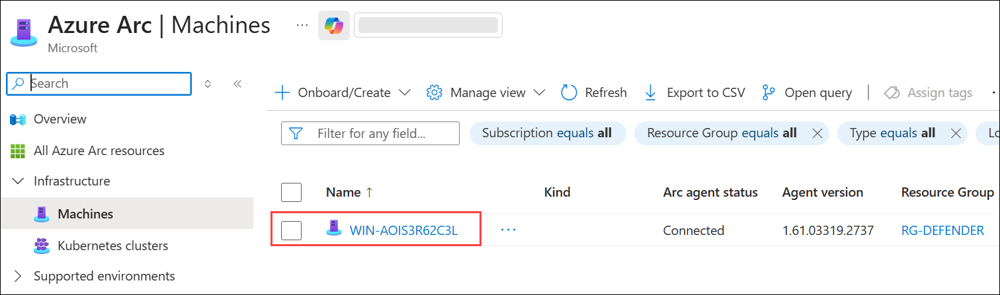
    
1. In the Azure portal's search bar, type **Log Analytics workspaces (1)** and select **Log Analytics workspaces (2)**.

     

1. Click on **+ Create**.

     

1. On the **Create Log Analytics workspace** provide the following details and click **Review + Create (5)**.

      - Subscription: Leave the default subscription **(1)**
      - Resource group: Select **RG-DEFENDER (2)**
      - Name: Enter  **uniquenameDefender (3)**
      - Region: **East US (4)**

        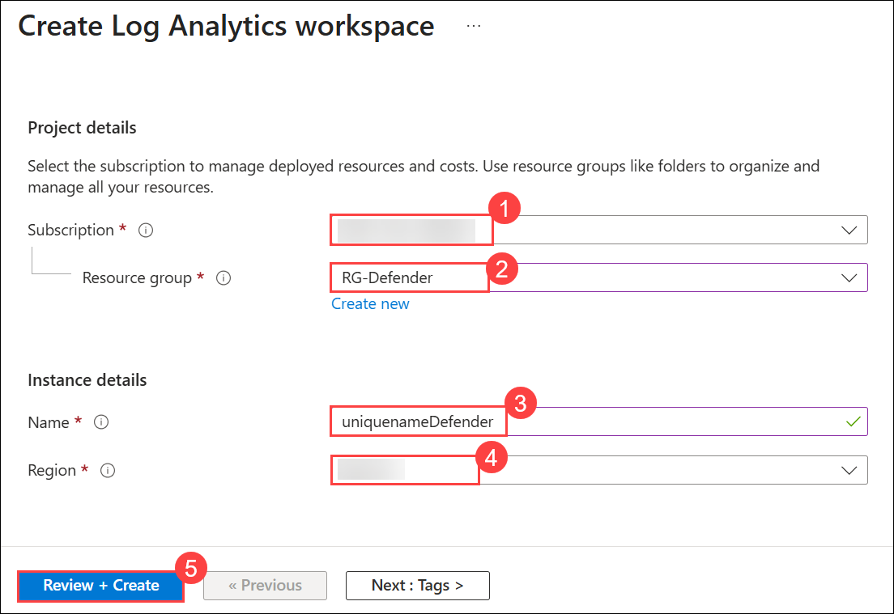

        >**Note:** If **uniquenameDefender** name is not available use **Defender<inject key="DeploymentID"></inject>**
        
1. Once the workspace validation has passed, select **Create**. Wait for the new workspace to be provisioned, this may take a few minutes.

1. In the Azure portal search bar, type **Microsoft Sentinel (1)** and select it **Microsoft Sentinel (2)**.

     

1. On **Microsoft Sentinel** page, Click on **+ Create**.

      

1. Next, in Add Microsoft Sentinel to a workspace page select the **uniquenameDefender (1)** that was created in the previous lab, then select **Add (2)**. This could take a few minutes.

     

1. In the Microsoft Sentinel free trial activated tab, select **Ok**.

   

1. On a new tab in the browser, go to **https://security.microsoft.com**

1. Close the **Meet your improved security center** pop-up using **X**.

     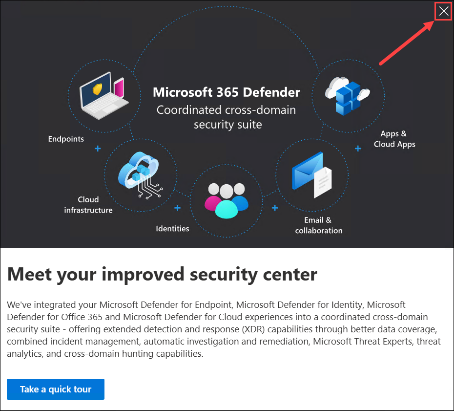

1. In the left navigation pane, click **Show navigation (1)** to expand the menu if it is collapsed. Next, expand **Microsoft Sentinel (2)**, then expand **Content management (3)**, and select **Content hub (4)**.

     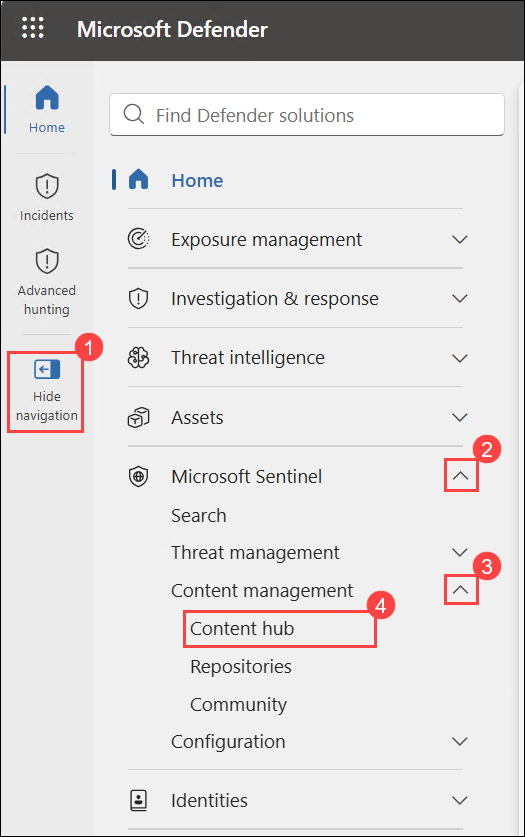

     > **Note:** If workspace is not connected, click on Connect workspace to connect.

1. On the **Content hub** page, search for **Windows Security Events (1)**, press **Enter** and select **Windows Security Events (2)** and click on **Install (3)**.

     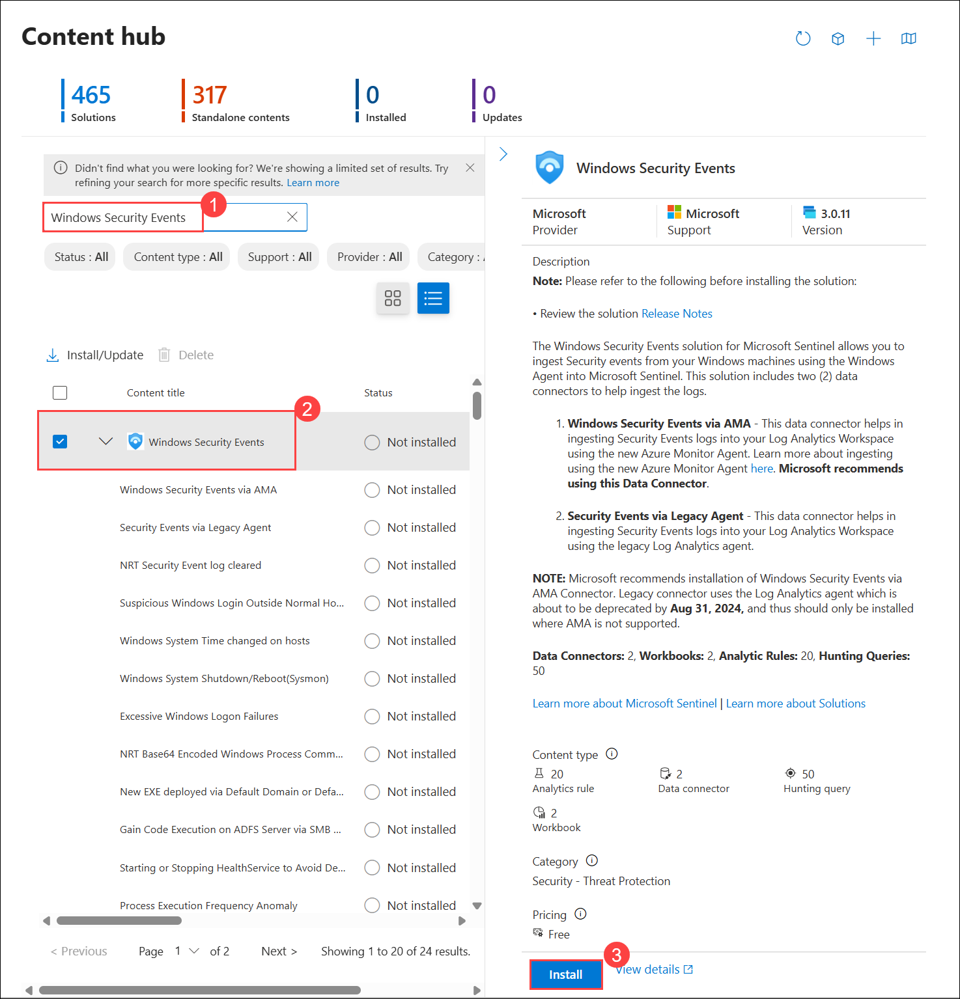

     > **Note:** If the page does not appear after waiting for 5-10 minutes, sign out of the portal and sign back in. If the issue persists, open the same page in an InPrivate or Incognito browser window.

1. Once the installation is completed, go to the **Data connector (1)** page and refresh you should find **Windows Security Events via AMA**.

1. Select the **Windows Security Events via AMA (2)** connector and click on **Open connector page (3)** on the connector information blade. 

     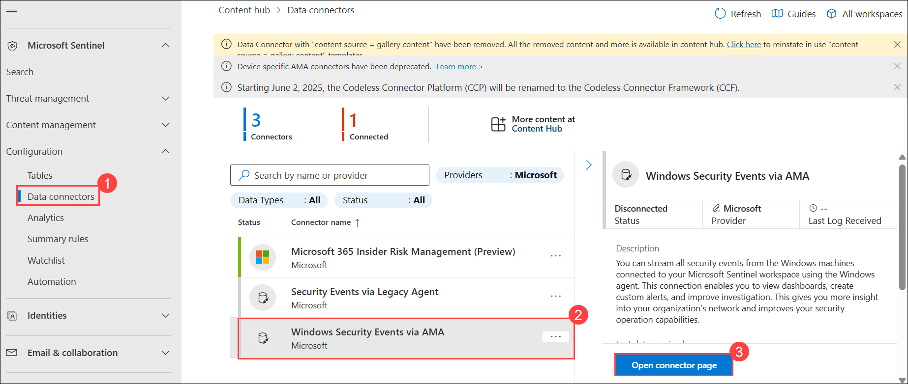
 
1. Scroll down and in the **Configuration** section, select the **+Create data collection rule**.

     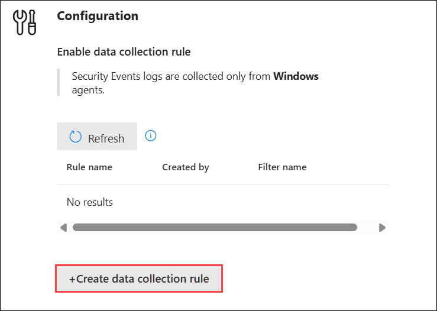

1. Enter **WINSERVER (1)** for Rule Name, then select **Next: Resources (2)**.

     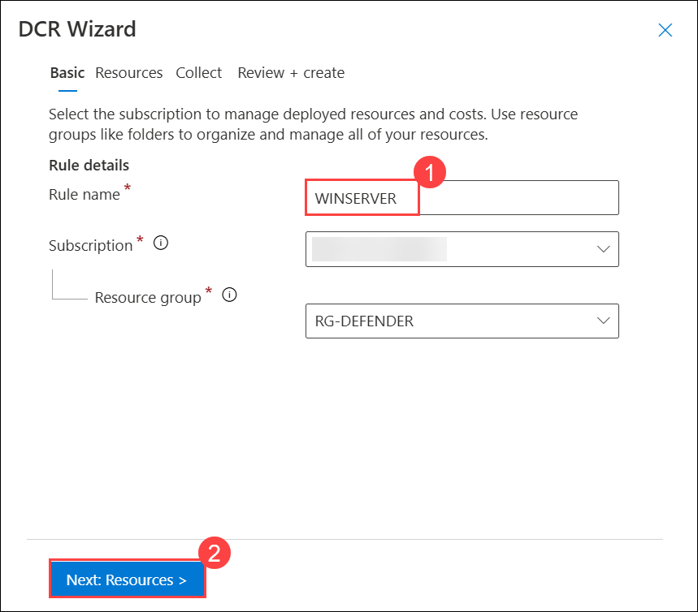

1. Expand the **Subscription (1)** and the **RG-DEFENDER (2)** (or the Resource Group you have created), then select **WIN-xxxx (3)**. Then select **Next: Collect (4)**.

     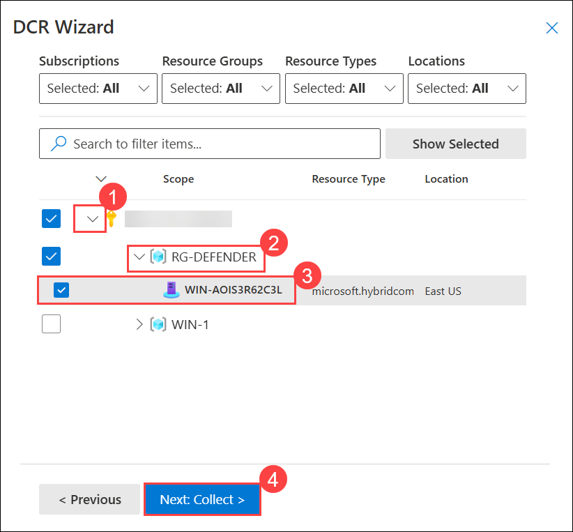

1. Then click **Next: Review + Create**.    

     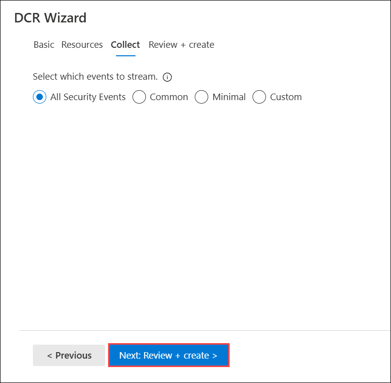

1. On the **Create data Collection Rule** page, Select **Create**.

1. Wait a few minutes and then select **Refresh (1)** to see the new data collection rule listed **(2)**.

     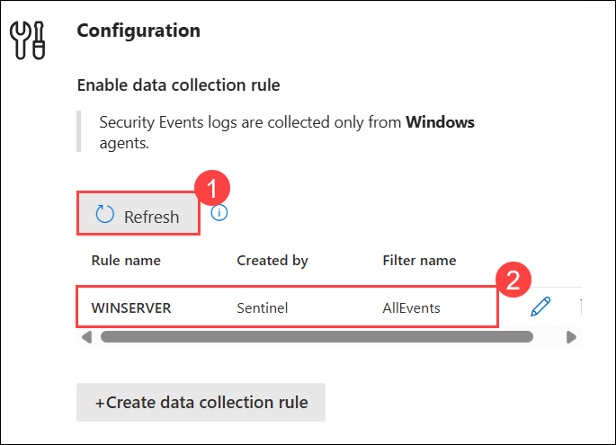

> **Congratulations** on completing the task! Now, it's time to validate it. Here are the steps:
- If you receive a success message, you can proceed to the next task.
- If not, carefully read the error message and retry the step, following the instructions in the lab guide.
- If you need any assistance, please contact us at cloudlabs-support@spektrasystems.com.com. We are available 24/7 to help you out.
 
<validation step="e476363a-77e4-4028-810f-f919e1cee4f0" />

## Review
-  Connected a non-Azure Windows Machine

## PROCEED TO  THE NEXT EXERCISE
