# Threat Hunting using Notebooks with Microsoft Sentinel

## Lab Scenario
You are a Security Operations Analyst working at a company that implemented Sentinel. You need to explore the benefits of threat hunting with Microsoft Sentinel Notebooks.

>**Important:** The lab exercises for Learning Path #10 are in a **standalone** environment. If you exit the lab before completing it, you will be required to re-run the configurations again.

## Lab Objectives
 In this lab, you will Understand the following:
  -  Task 1: Explore Notebooks

## Estimated Time: 30 Minutes

## Architecture Diagram

 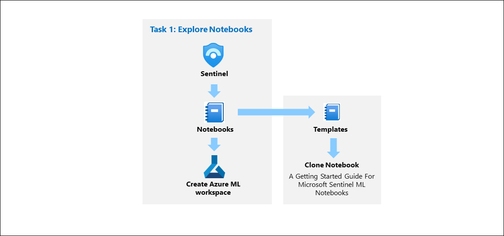

### Task 1: Explore Notebooks

In this task, you will explore using notebooks in Microsoft Sentinel.

1. In the Microsoft Defender portal, expand **Microsoft Sentinel**, and then under **Threat management (1)**, select **Notebooks (2)**.

1. Next, you need to create an AzureML Workspace. select the settings menu **(3)** and then select the **Create new Azure ML workspace (4)** button in the command bar.

     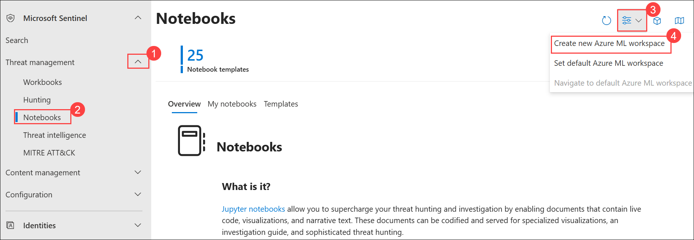

1. On the **Azure Machine Learning** page, 
     - In the Subscription box, select your **subscription (1)**.

     - Select **Create new** for the Resource group and enter **RG-MachineLearning** for the Name and select **OK** **(2)**

     - Enter **Notebook<inject key="DeploymentID" enableCopy="false"/> (3)** for Workspace name

     - Leave **East US (4)** as the default value for **Region**.
     - Keep the default Storage account, Key vault, and Application insights information.
     - The Container registry option can remain as **None (5)**.

     - At the bottom of the page, select **Review + Create (6)**. 

       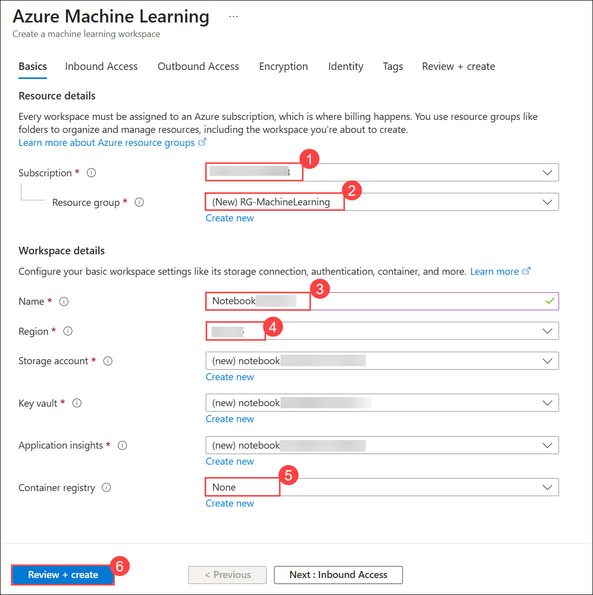    
     
1. When you see the **"Validation passed"** message, select **Create**. 

     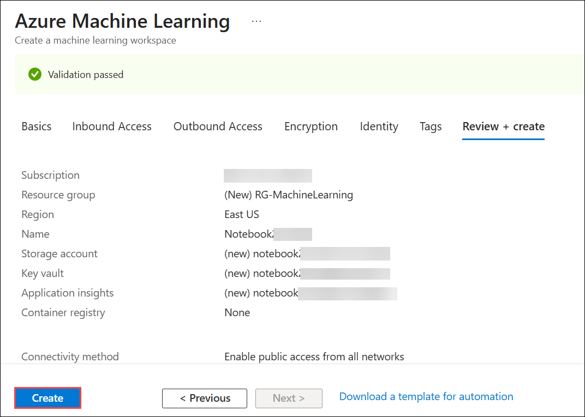

     >**Note:** It may take a few minutes to deploy the Machine Learning workspace.

     >**Note:** If Azure ML workspace is not created follow from step 2 in the same task and select the RG-MachineLearning rg, same options and create.

     > **Note:** If the Azure ML workspace is not getting created, alternatively, you can search for **Azure Machine Learning** in the Azure portal and create the workspace directly from there using the same resource group, region, and naming conventions specified in this exercise.

1. After **Your deployment is complete** message appears, return to the Microsoft Sentinel portal.

1. Select **Notebooks (1)** again and then select the **Templates (2)** tab from the middle command bar. 

     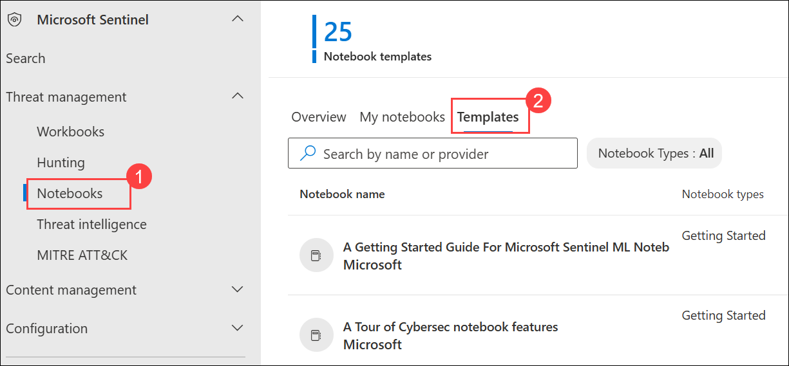

     > **Note:** If you do not see **Notebooks page** in the Microsoft Sentinel portal, try refreshing the browser. Wait 5 minutes and refresh again until it appears.

1. Select **A Getting Started Guide for Microsoft Sentinel ML Notebooks (1)**. 

1. On the right pane, scroll down and select **Create from template (2)** button. 

   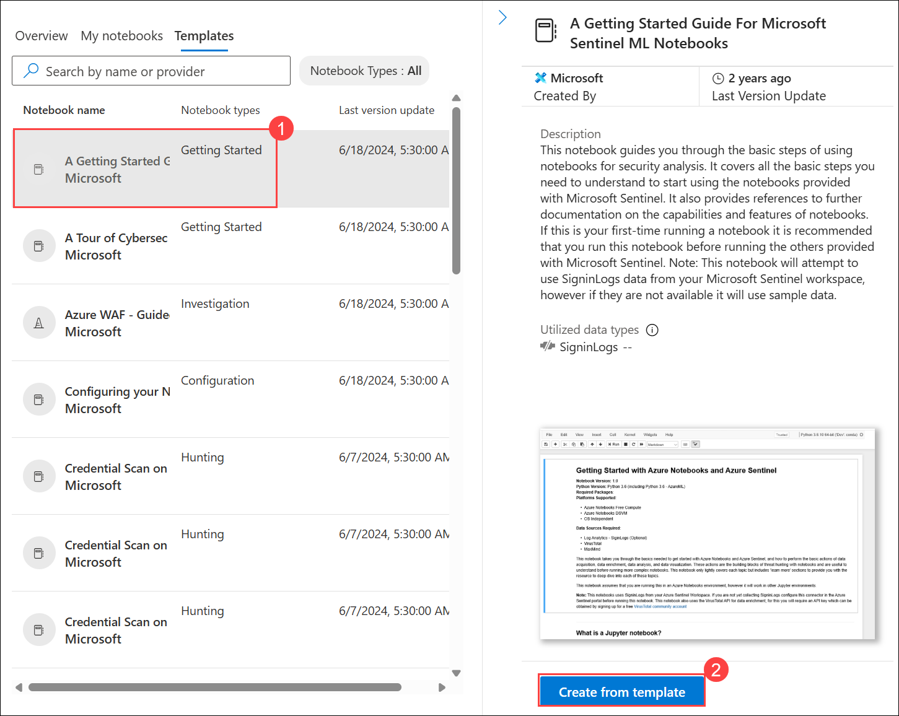

1. Review the default options and then select **Save**.   

     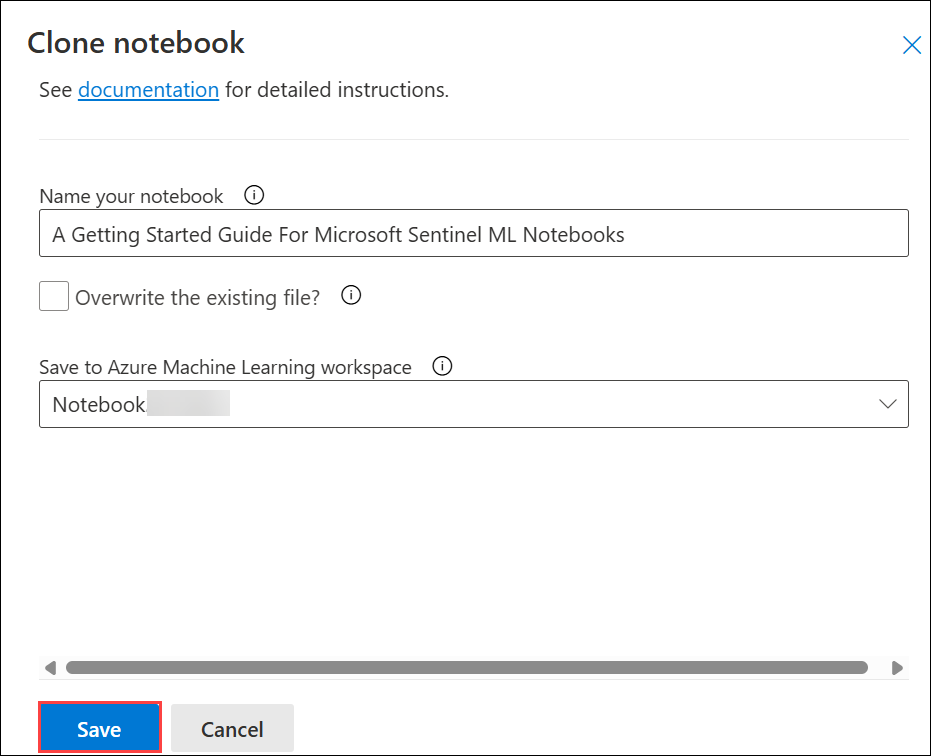

1. Once the saving is done, select the **Launch notebook** button. This will take you to the Microsoft Azure Machine Learning Studio.

    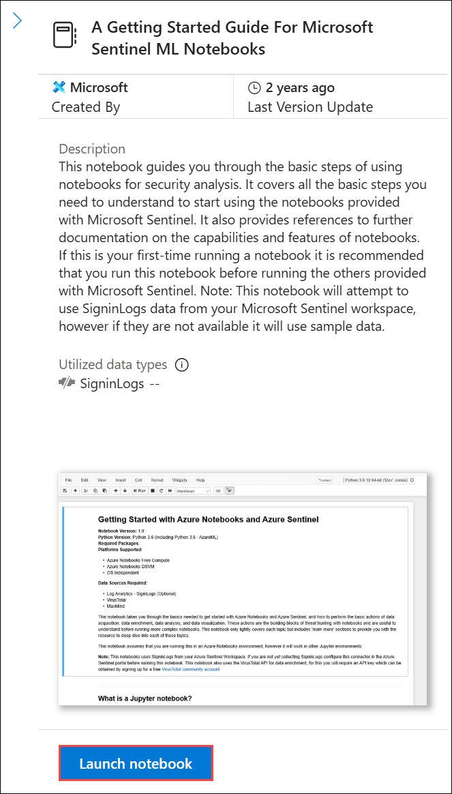

1. Select **Close** if an informational window appears in the Microsoft Azure Machine Learning Studio.

1. In the command bar, to the right of the **Compute instance:**  selector, select the **+ Create Azure ML Compute (2)**. **Hint:** It might be hidden inside the ellipsis icon **(...) (1)**.

     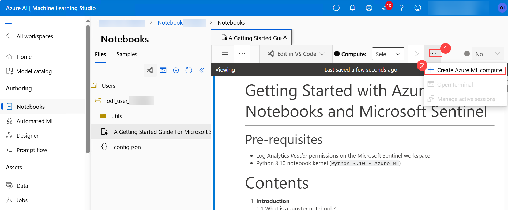

     >**Note:** You can have more screen space by hiding the Azure ML Studio left blade by selecting the 3 lines on the top left, as well as the Notebooks Files by selecting the **<<** icon.

1. Enter **Mycompute<inject key="DeploymentID" enableCopy="false"/> (1)** in the **Compute name** field. This will identify your compute instance.

     - Scroll down and select **Standard_DS11_v2 (2)**. 
     - Select the **Review + Create (3)** button at the bottom of the screen.

       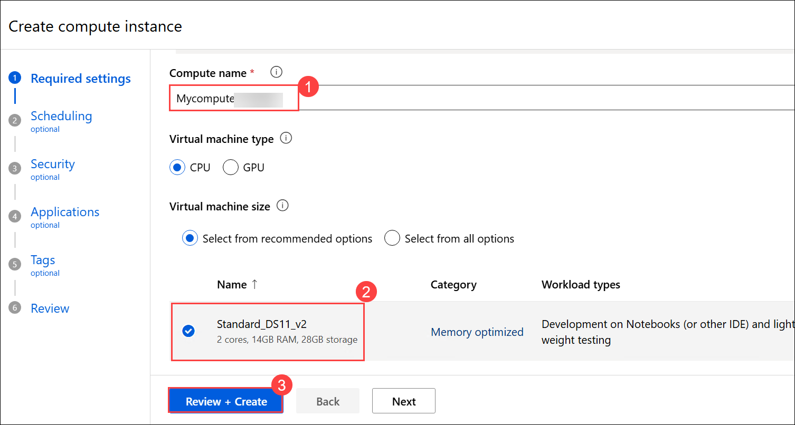

1. Then scroll down and select **Create**. Close any feedback window that may appear. This takes a few minutes, you'll see a notification (bell icon) when it's done and the **Compute instance (1)** left icon turns from blue to green.

   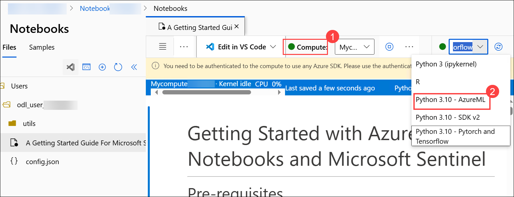

1. Once the Compute has been created and running, verify that the kernel to use is **Python 3.10 - AzureML (2)**. **Hint:** This is shown in the right of the command bar.

1. Select the **Authenticate** button and wait for the authentication to complete.

     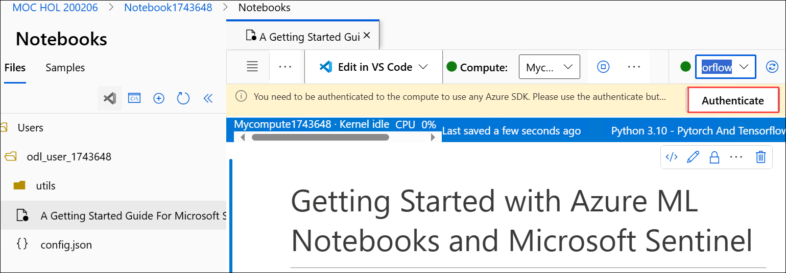

1. Clear all the results from the notebook by selecting the **Clear all outputs (2)** from the command bar and following the **Getting Started** tutorial. **Hint:** This can be found by selecting the ellipsis **(...) (1)** from the command bar.

   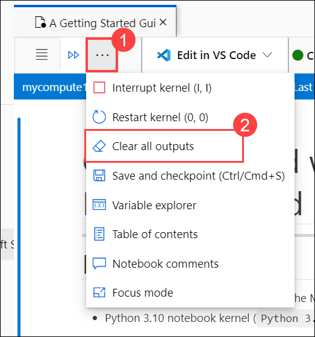

1. Review section **1 Introdution** in the notebook and proceed to section **2 Initializing the notebook and MSTICPy**.

1. In section **2 Initializing the notebook and MSTICPy**, review the content on initalizing the notebook and installing the MSTICPy package.

1. Run the **Python code** to initialize the cell by selecting the **Run cell** button (Play icon) to the left of the code.

1. It should take approximately 1-2 minutes to run. Once it's done, review the output messages and disregard any warnings about the Python kernel version. The code ran successfully if **msticpyconfig.yaml** was created in the **utils** folder in the **file explorer** pane on the left. It may take another 30 seconds for the file to appear.

   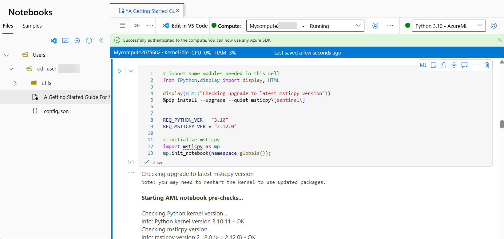

    >**Hint:** You can clear the output messages by selecting the ellipsis (...) on the left of the code window for the **Output menu** and selecting the **Clear output** (square with an **x**) icon.

1. Select the **msticpyconfig.yaml** file in the **file explorer** pane on the left to review the contents of the file and then close it.

    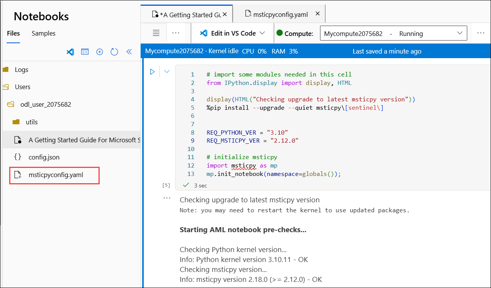

    > **Note:** If you don’t see the `msticpyconfig.yaml` file in the file explorer, select the **Refresh** icon in the left pane to see the file.

1. Proceed to section **3 Querying data with MSTICPy** and review the contents. Don't run the **Multiple Microsoft Sentinel workspaces** code cell as it fails, but the other code cells can be run successfully.

     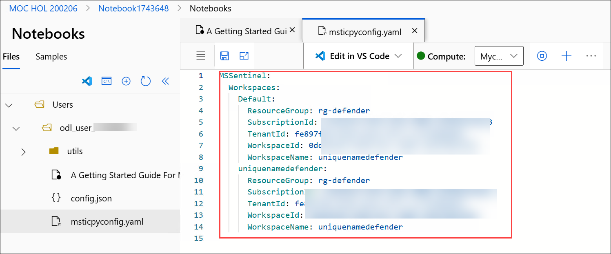

## Review
In this lab, you have completed the following:
- Explored AZURE ML Notebooks.

## PROCEED TO  THE NEXT EXERCISE
