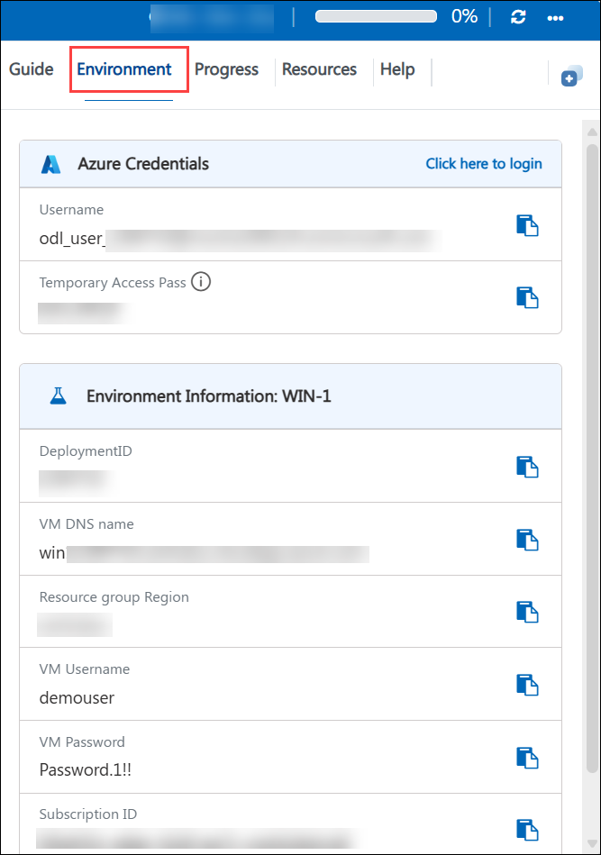
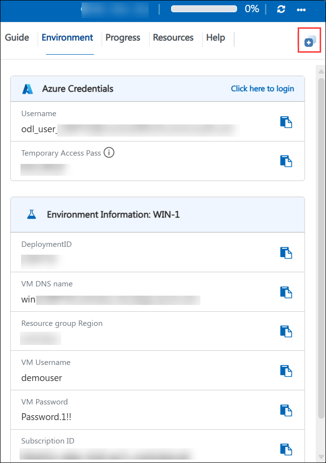

# Getting Started with Your SC-200: Microsoft Security Operations Analyst Workshop

Welcome to your SC-200: Microsoft Security Operations Analyst workshop! We've prepared a seamless environment for you to explore and learn about monitoring, identifying, investigating, and responding to threats in multi-cloud environments. Let's begin by making the most of this experience:

## Overview

In these hands-on labs, you will develop the skills required to monitor, identify, investigate, and respond to threats using Microsoft's unified security operations tools. Working as a Security Operations Analyst, you will explore Microsoft Defender XDR and Microsoft Security Copilot, enable Microsoft Purview Audit for compliance investigations, and deploy Microsoft Defender for Endpoint and Microsoft Defender for Cloud to protect devices and multi-cloud workloads. You will then build a Microsoft Sentinel environment from the ground up—provisioning a Log Analytics workspace, connecting Windows, Linux, Azure, and Defender XDR data sources, and authoring KQL queries. Finally, you will simulate real-world attacks and use Sentinel's analytics rules, automation playbooks, UEBA, ASIM, workbooks, content management, and threat hunting (including notebooks) to detect, investigate, and remediate them. By completing these labs, you will gain the practical, end-to-end experience needed to run a modern, unified Microsoft security operations practice.

## Objectives

By the end of these labs, you will be able to:

1. **Explore Microsoft Defender XDR:** Configure Entra ID groups and Exchange Online Protection/Defender for Office 365 preset security policies, and navigate the unified Defender XDR portal.

2. **Use Microsoft Security Copilot:** Investigate an incident's context, activity, and artifacts using natural-language, AI-assisted prompts integrated into Defender XDR.

3. **Enable Microsoft Purview Audit:** Turn on Audit (Standard/Premium) logging and use it to investigate compliance and data-access scenarios.

4. **Deploy and use Microsoft Defender for Endpoint:** Onboard devices, configure RBAC and device groups, simulate attacks, and investigate the resulting alerts and incidents.

5. **Enable and explore Microsoft Defender for Cloud:** Turn on CSPM and workload protection plans, connect on-premises servers with Azure Arc, and review secure score, recommendations, and regulatory compliance.

6. **Author KQL queries in Log Analytics:** Write and run Kusto Query Language queries—filtering, summarizing, joining, and visualizing data across tables.

7. **Deploy Microsoft Sentinel:** Provision a Log Analytics workspace, enable Sentinel on it, and configure watchlists, threat indicators, and data retention.

8. **Connect data sources to Sentinel:** Ingest data from Azure Activity, Defender for Cloud, Azure and non-Azure Windows machines, Linux machines (CEF/Syslog), and Defender XDR to build a unified SecOps platform.

9. **Detect and respond to threats:** Create analytics rules, automation rules and SOAR playbooks, enable UEBA and ASIM, simulate and investigate attacks, and manage incidents end to end.

10. **Hunt for threats and manage content:** Build hunting queries, NRT rules, and searches mapped to MITRE ATT&CK, use Sentinel notebooks for advanced hunting, build workbooks, and manage analytics content through source control.

## Pre-requisites

- Basic understanding of security operations concepts such as threats, alerts, incidents, and the MITRE ATT&CK framework.
- Familiarity with Microsoft Azure and Microsoft 365 fundamentals, including navigating the Azure and Microsoft Defender portals.
- Basic knowledge of Kusto Query Language (KQL) is helpful but not required, as it is taught within the labs.
- Familiarity with Windows and Linux operating system administration will help learners get the most from this course.

## Architecture

The lab architecture demonstrates how Microsoft's Defender and Sentinel products work together as a unified security operations platform. Throughout these labs, you will configure Microsoft 365 and Azure protections, deploy a Log Analytics workspace and Microsoft Sentinel, connect diverse data sources, simulate attacks, and build detection, automation, and hunting capabilities on top of the unified environment.

1. **Microsoft Defender XDR:** Serves as the unified portal that brings together signals and incidents from Microsoft Defender for Office 365, Defender for Endpoint, and Microsoft Sentinel for end-to-end investigation and response.

1. **Microsoft Purview:** Delivers compliance and audit capabilities, allowing analysts to search audit logs for user and admin activity across Microsoft 365.

1. **Microsoft Defender for Endpoint:** Onboards and protects devices, detecting and responding to endpoint threats and feeding alerts into Defender XDR.

1. **Microsoft Defender for Cloud:** Protects Azure and Azure Arc-connected on-premises/multi-cloud resources through Cloud Security Posture Management (CSPM) and workload protection plans.

1. **Log Analytics Workspace:** Acts as the underlying data store for logs, telemetry, and query execution that powers both Azure Monitor and Microsoft Sentinel.

1. **Microsoft Sentinel:** Functions as the cloud-native SIEM/SOAR, ingesting data from connectors, running analytics rules, automation playbooks, UEBA, and hunting queries.

1. **Data Connectors:** Bring in telemetry from Azure Activity, Defender for Cloud, Windows and Linux machines (via Azure Arc, AMA, CEF/Syslog), and Defender XDR itself.

1. **Automation and SOAR (Logic Apps):** Executes automation rules and playbooks that respond to incidents automatically, reducing manual analyst effort.

1. **Threat Hunting Tools:** Hunting queries, Near-Real-Time (NRT) rules, Searches, and Sentinel Notebooks (Azure Machine Learning/Jupyter) enable proactive threat detection mapped to MITRE ATT&CK.

## Explanation of Components

1. **Microsoft Defender XDR:** A unified pre- and post-breach enterprise defense suite that natively coordinates detection, prevention, investigation, and response across endpoints, identities, email, and applications.

1. **Microsoft Purview Audit:** A compliance solution that records and retains user and administrator activity across Microsoft 365 services, supporting forensic and compliance investigations.

1. **Microsoft Defender for Endpoint:** An endpoint detection and response (EDR) platform that onboards devices, applies role-based access control, and detects, investigates, and remediates threats on endpoints.

1. **Microsoft Defender for Cloud:** A cloud-native application protection platform (CNAPP) that assesses security posture (secure score, regulatory compliance) and protects workloads across Azure, on-premises, and other clouds via Azure Arc.

1. **Azure Log Analytics Workspace:** A centralized repository for log and telemetry data, queried using Kusto Query Language (KQL), that underpins Microsoft Sentinel and Azure Monitor.

1. **Kusto Query Language (KQL):** The query language used to filter, summarize, join, and visualize data stored in Log Analytics, forming the foundation for analytics rules, hunting queries, and workbooks.

1. **Microsoft Sentinel:** A cloud-native Security Information and Event Management (SIEM) and Security Orchestration, Automation, and Response (SOAR) solution used to collect, detect, investigate, and respond to threats across the enterprise.

1. **Data Connectors:** Sentinel components (including Azure Arc, AMA, and CEF/Syslog-based connectors) that ingest data from Azure resources, Windows and Linux machines, and Defender XDR into the Sentinel workspace.

1. **Analytics Rules & Automation Rules/Playbooks:** Analytics rules (scheduled, Microsoft Security, and Fusion) generate incidents from raw data, while automation rules and Logic Apps playbooks orchestrate automated response actions.

1. **User and Entity Behavior Analytics (UEBA) & Advanced Security Information Model (ASIM):** UEBA baselines normal behavior to surface anomalies, while ASIM normalizes data from different sources into a common schema for consistent detection and hunting.

1. **Workbooks, Hunting, and Notebooks:** Workbooks visualize security data on interactive dashboards; hunting queries, NRT rules, and Searches proactively surface threats mapped to MITRE ATT&CK; and Sentinel Notebooks (backed by Azure Machine Learning/Jupyter) enable advanced, code-driven hunting and analysis.

## Accessing Your Lab Environment

Once you're ready to dive in, your virtual machine and **Guide** will be right at your fingertips within your web browser.

 

 ## Lab Guide Zoom In/Zoom Out

To adjust the zoom level for the environment page, click the **A↕ : 100%** icon located next to the timer in the lab environment.

 

## Virtual Machine & Lab Guide

Your virtual machine is your workhorse throughout the workshop. The lab guide is your roadmap to success.

## Exploring Your Lab Resources

To get a better understanding of your lab resources and credentials, navigate to the **Environment** tab.

## Managing Your Virtual Machine

Feel free to **Start, Restart, or Stop (2)** your virtual machine as needed from the **Resources (1)** tab. Your experience is in your hands!

## Lab Progress

You can use the **Progress** tab to track your progress while working on the lab. A score will be provided after successful validation.

## Utilizing the Split Window Feature

For convenience, you can open the lab guide in a separate window by selecting the **Split Window** button from the top right corner.

## **Lab Duration Extension**

1. To extend the duration of the lab, kindly click the **Hourglass** icon in the top right corner of the lab environment. 

    

    >**Note:** You will get the **Hourglass** icon when 10 minutes are remaining in the lab.

2. Click **OK** to extend your lab duration.
 
   

3. If you have not extended the duration prior to when the lab is about to end, a pop-up will appear, giving you the option to extend. Click **OK** to proceed.

## Let's Get Started with Azure Portal

1. On your virtual machine, click on the Azure Portal icon as shown below:

   .png)

1. In the sign-in window, kindly sign in using the provided Azure credentials
   - **Email/Username:** <inject key="AzureAdUserEmail"></inject>

     

   - **Password:** <inject key="AzureAdUserPassword"></inject>

     

1. If prompted to **Stay signed in?**, you can click **No**.

   

1. If a **Welcome to Microsoft Azure** pop-up window appears, simply click **Maybe later** to skip the tour.

   

## Support Contact

The CloudLabs support team is available 24/7, 365 days a year, via email and live chat to ensure seamless assistance at any time. We offer dedicated support channels explicitly tailored for both learners and instructors, ensuring that all your needs are promptly and efficiently addressed.

Learner Support Contacts:

- Email Support: cloudlabs-support@spektrasystems.com
- Live Chat Support: https://cloudlabs.ai/labs-support

Click on **Next** from the lower right corner to move on to the next page.

## Happy Learning !!