# Lab - 01: Configure Exchange Online Protection (EOP) Policies

## Estimated Timing: 120 Minutes

## Lab Scenario

You're a Security Operations Analyst working at a company that relies on Exchange Online for email. Every organization that uses Exchange Online automatically gets **Exchange Online Protection (EOP)** — a built-in service that filters incoming and outgoing mail for spam, malware, and phishing before it ever reaches a user's inbox.

Your job in this lab is to review and configure the core EOP policies so your organization is protected against the most common email-borne threats. You'll work directly with the anti-malware, anti-spam, and anti-phishing policies rather than using bundled presets, so you can see exactly what each protection does and how to tune it.

## Lab Objectives

In this lab, you will perform:

- **Task 1:** Navigate to Threat policies

- **Task 2:** Review and configure the anti-malware policy

- **Task 3:** Configure the anti-spam policies (inbound and outbound)

- **Task 4:** Configure the anti-phishing policy

- **Task 5:** Verify your configuration

## Task 1: Navigate to Threat policies

In this task you'll access the Microsoft Defender portal and review the available threat protection policies.

1. On the **LabVM**, open **Edge** browser, go to the **Microsoft Defender portal** by visiting the following link: [Security portal](https://security.microsoft.com).

1. In the **Sign in** dialog box, copy and paste **Email/Username: <inject key="AzureAdUserEmail"></inject>** and then select **Next**.

1. In the **Enter password** dialog box, copy and paste **Password: <inject key="AzureAdUserPassword"></inject>** and then select **Sign in**.

1. Close the welcome page in **Microsoft Defender** portal.

   

1. On **Microsoft Defender** page, if the left navigation pane is collapsed, select **Show navigation** to expand it.

   

1. From the navigation menu, expand **Email & Collaboration (1)** area, select **Policies & rules (2)**.

1. On the **Policy & rules** dashboard, select **Threat policies (3)**.

   

1. Take a moment to look at the **Threat policies** page. Under the **Policies** heading you'll see entries including **Anti-phishing**, **Anti-spam**, and **Anti-malware** — the three policies you'll configure in this lab.

   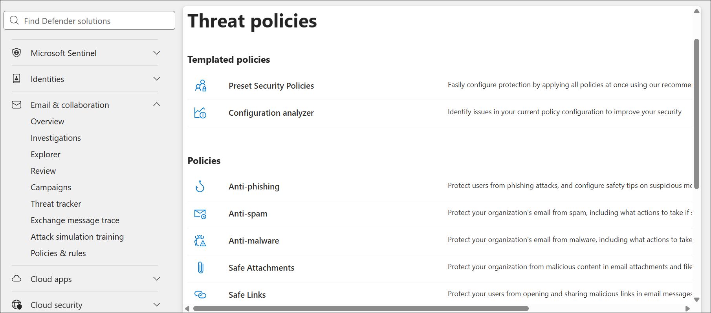

## Task 2: Review and configure the anti-malware policy

In this task, you will assign preset security policies for Exchange Online Protection (EOP) and Microsoft Defender XDR for Office 365 in the Microsoft  security portal.

1. On the **Threat policies** page, under **Policies**, select **Anti-malware**.

   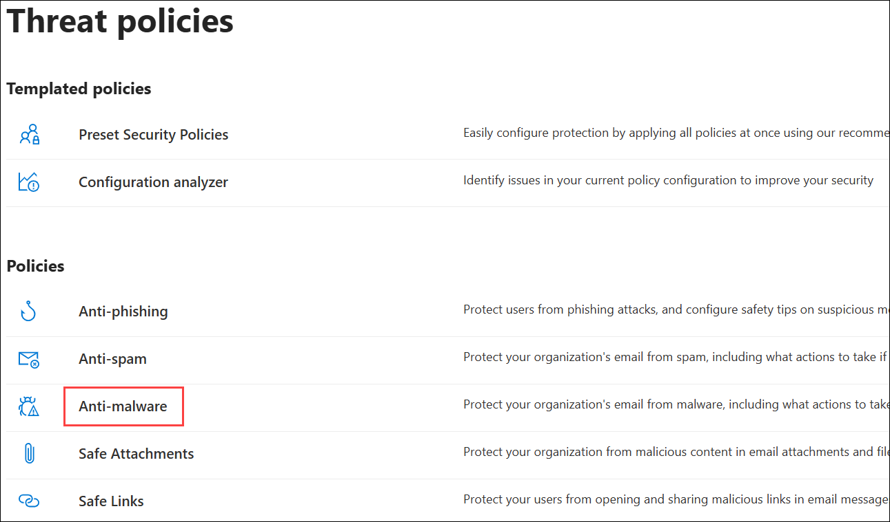

1. Select the **Default (Default) (1)** policy to open it, then scroll down, and  select **Edit protection settings (2)**.

   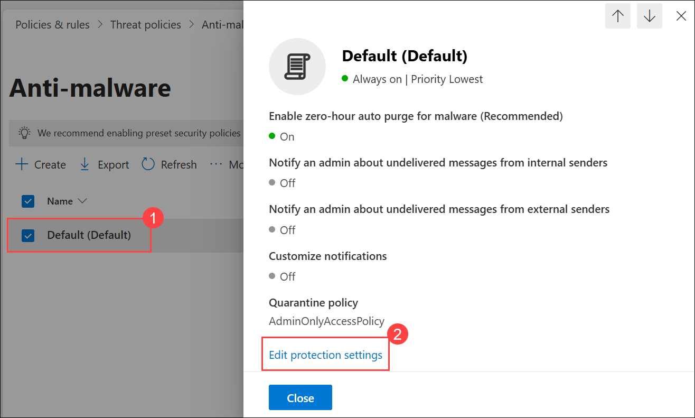

    >**What this does:** The anti-malware policy scans attachments and blocks messages that contain malicious files.

1. Review the **Protection settings**. Confirm that **Enable the common attachments filter** is turned **on**.

    >**What this does:** The common attachments filter blocks file types that are frequently used to deliver malware (for example, executable files), even if no known malware signature is detected. Blocking by file type is a simple but powerful defense.

1. Confirm that **Enable zero-hour auto purge (ZAP) for malware** is turned **on**.

    >**What this does:** ZAP retroactively removes malicious messages that were already delivered if they're later identified as malware — useful when a threat is discovered after the fact.

1. Leave the recipient notification and quarantine settings at their defaults, then select **Save** (or **Cancel** if you made no changes).

   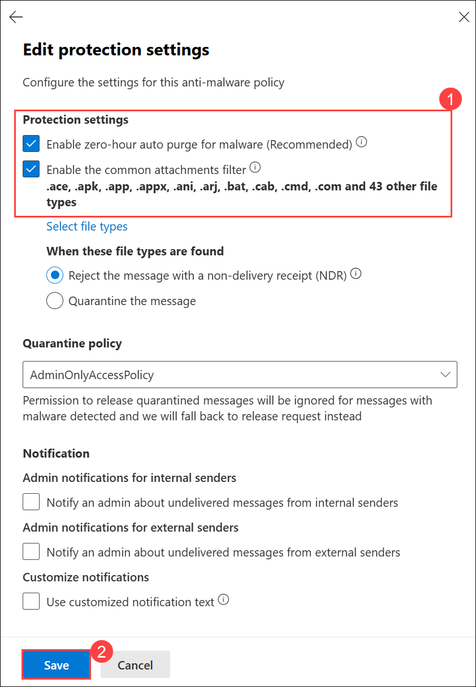

   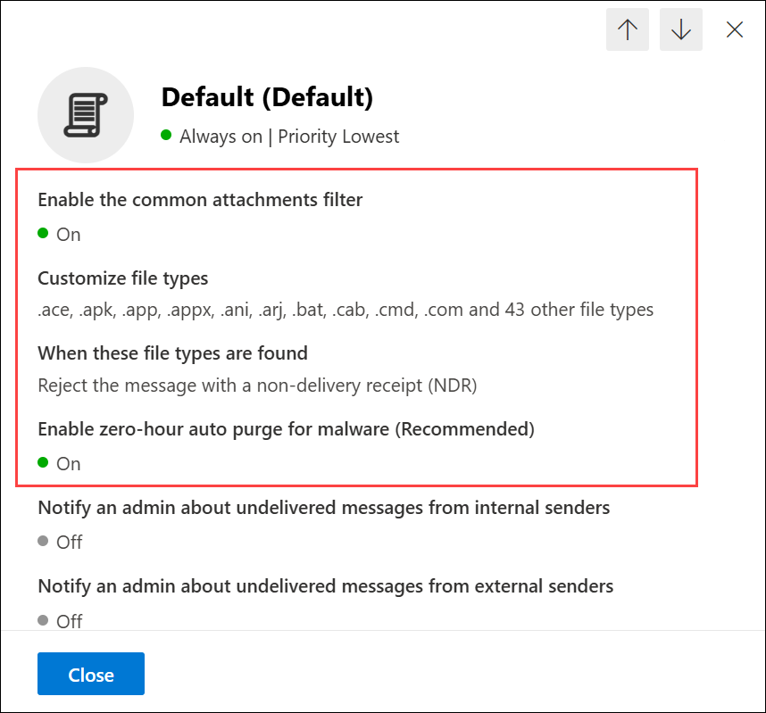

1. You should return to the anti-malware policy list with the default policy still shown as On.

   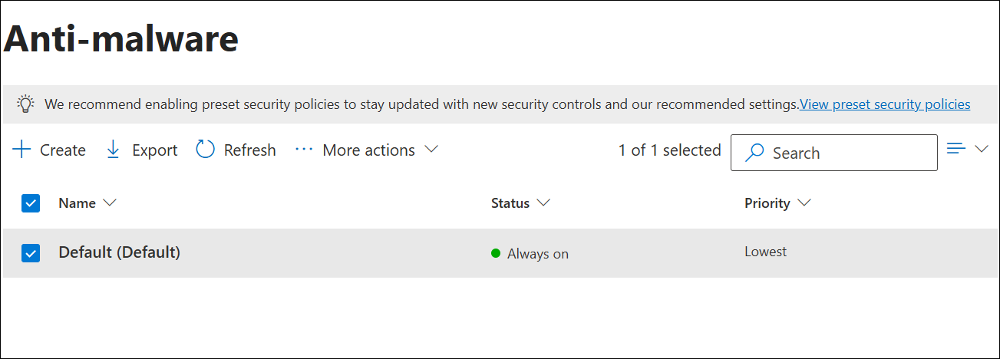

## Task 3: Configure the anti-spam policies (inbound and outbound)

In this task you'll review the inbound and outbound anti-spam policies and their protection settings.

### Task 3.1: Inbound spam

In this task you'll review the inbound anti-spam policy and its spam threshold and actions for detected spam messages.

1. Return to **Threat policies** by selecting **Threat policies** in the breadcrumb navigation.

   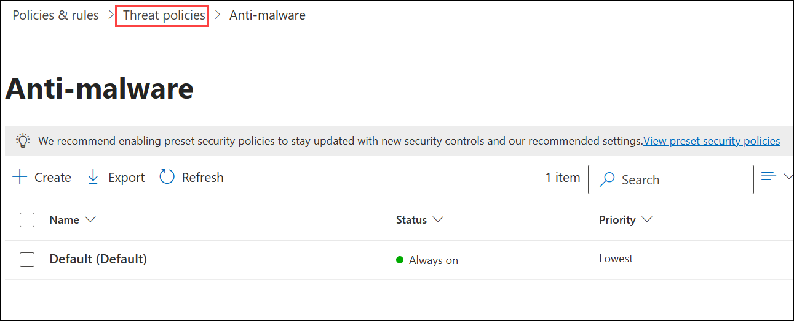

2. On the **Threat policies** page, select **Anti-spam**.
   
   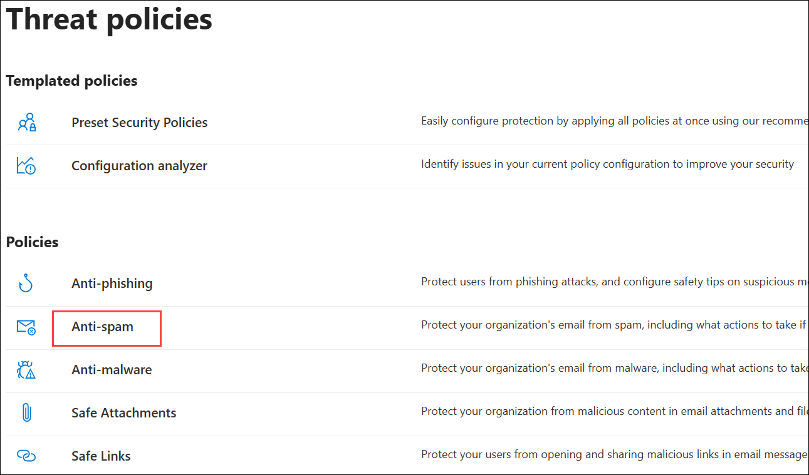

1. On the **Anti-spam policies** page, select **Anti-spam inbound policy (Default) (1)**, scroll down in the details pane, and then select **Edit spam threshold and properties (2)**.

   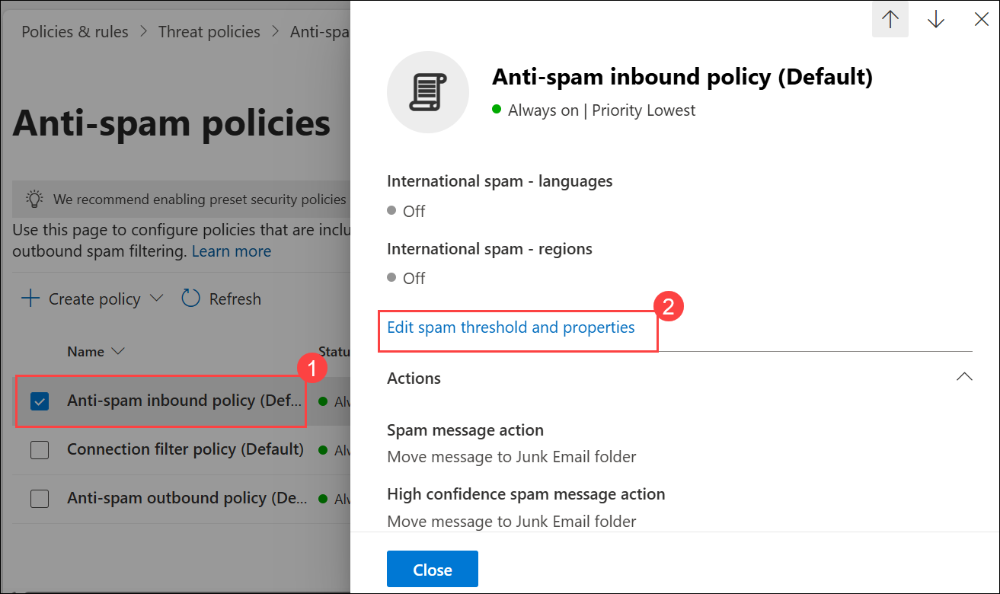

1. Review the **Bulk email threshold**. This is a slider (typically 1–9) that controls how aggressively bulk mail (like marketing newsletters) is treated as spam. A **lower** number is more aggressive.

    >**Think about it:** A lower threshold catches more bulk mail but risks flagging legitimate newsletters. A higher threshold is more lenient. Most organizations start near the default and tune based on user feedback.

1. Leave the threshold at its default (or adjust it to observe the option), then select **Save**.

   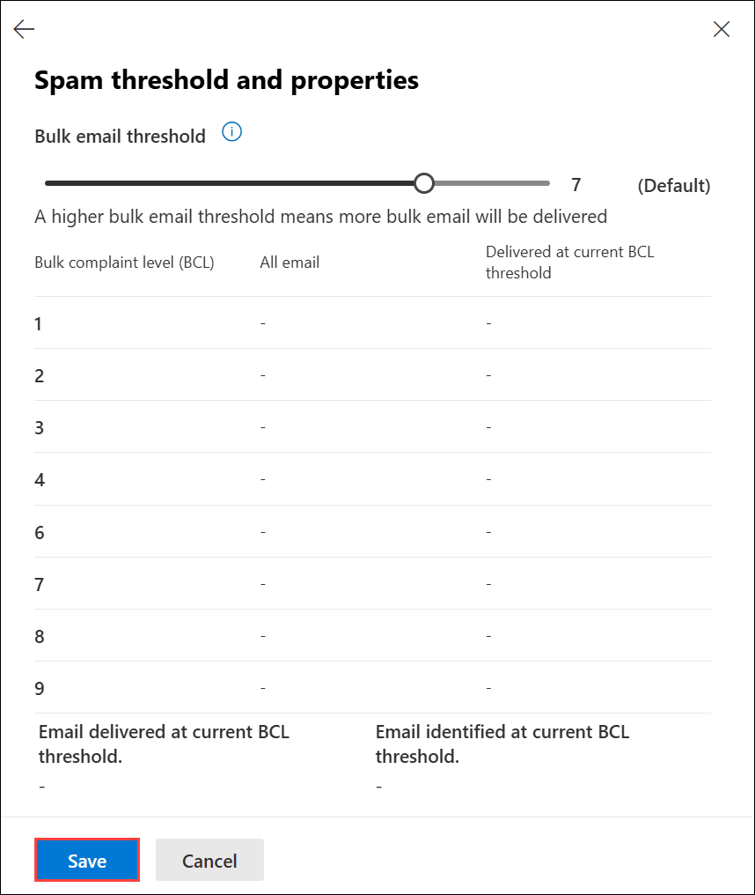

1. Select **Edit actions** to review what happens to detected spam — for example, moving spam to the **Junk Email folder** and higher-confidence spam to **Quarantine**. Review the settings, then **Save** or **Cancel**.

   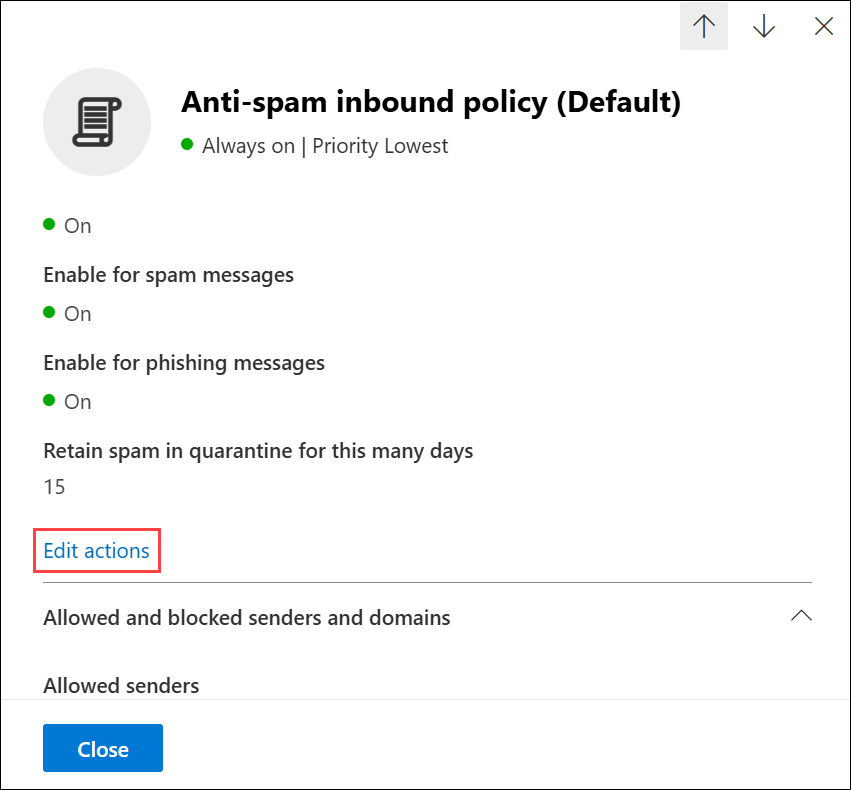

   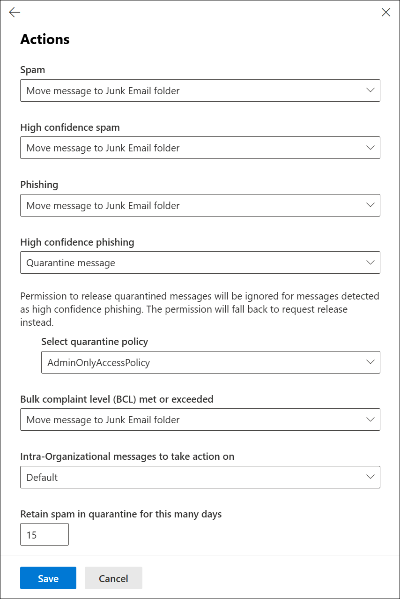

    >**What this does:** These actions decide where suspicious mail goes. "Junk Email folder" keeps it accessible to the user; "Quarantine" holds it for admin or user review.

### Task 3.2: Outbound spam

In this task you'll review the outbound anti-spam policy, including message limits and automatic forwarding protection.

1. Back on the **Anti-spam** page, select the **Anti-spam outbound policy (Default)**, then select **Edit protection settings**.

   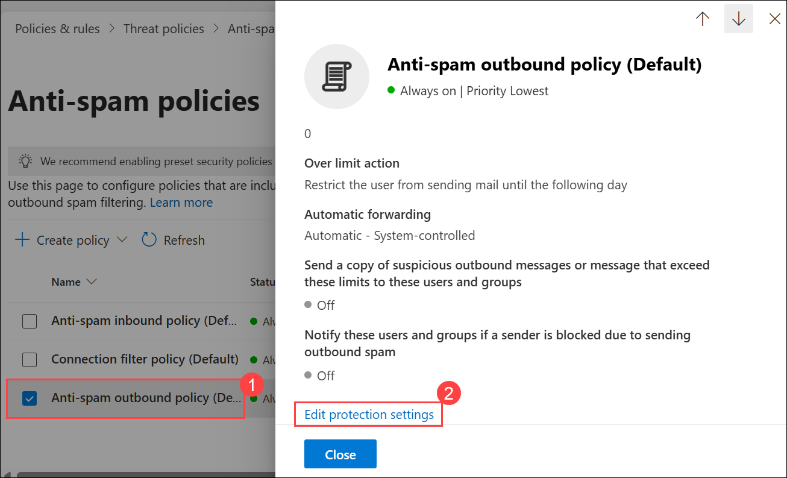

1. Review the outbound message limits (for example, the maximum number of recipients per hour).

    >**Why this matters:** If a user account is compromised, attackers often use it to blast spam. Outbound limits cap the damage by automatically restricting an account that suddenly exceeds normal sending volumes.

1. Review the setting for **automatic forwarding** rules, then **Save** or **Cancel**.

   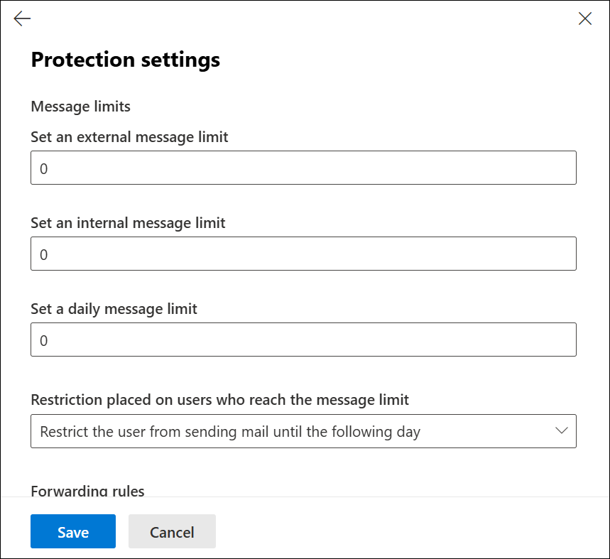

    >**What this does:** Attackers sometimes set up auto-forwarding to secretly exfiltrate a victim's mail. Controlling automatic forwarding is an important outbound protection.

1. Both the inbound and outbound anti-spam policies should remain **On** in the anti-spam policy list.

   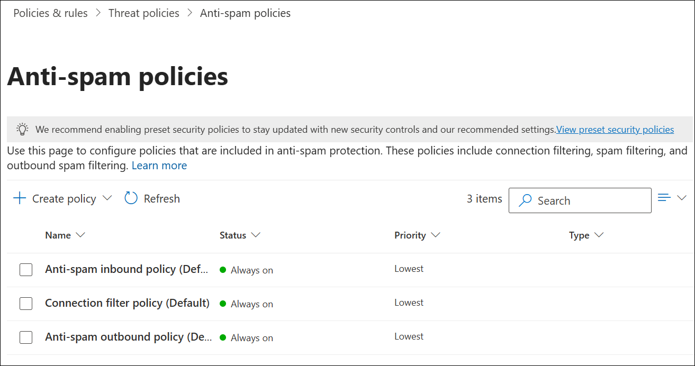

## Task 4: Configure the anti-phishing policy

In this task you'll review the anti-phishing policy and confirm spoof protection is enabled.

1. Return to **Threat policies** by selecting **Threat policies** in the breadcrumb navigation.

   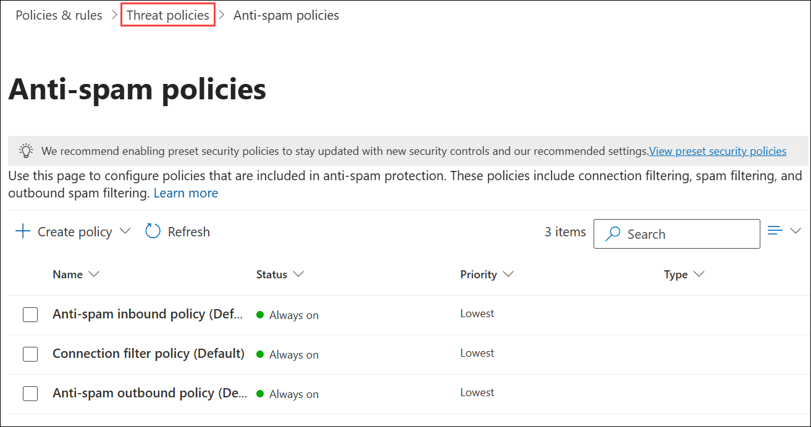

1. On the **Threat policies** page, select **Anti-phishing**.

   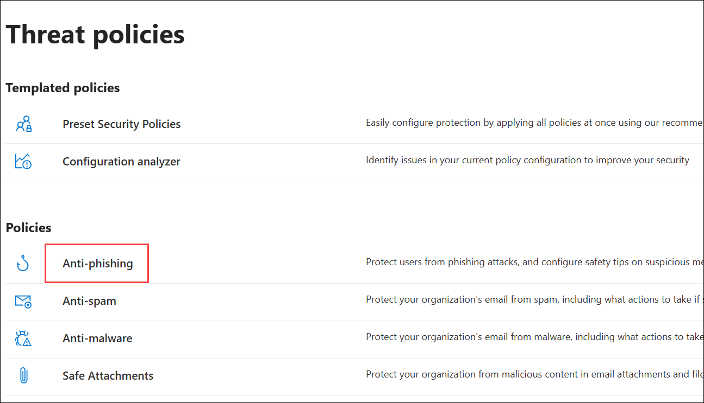

1. Select the **Office365 AntiPhish Default (Default)** policy, then select **Edit protection settings** settings.

    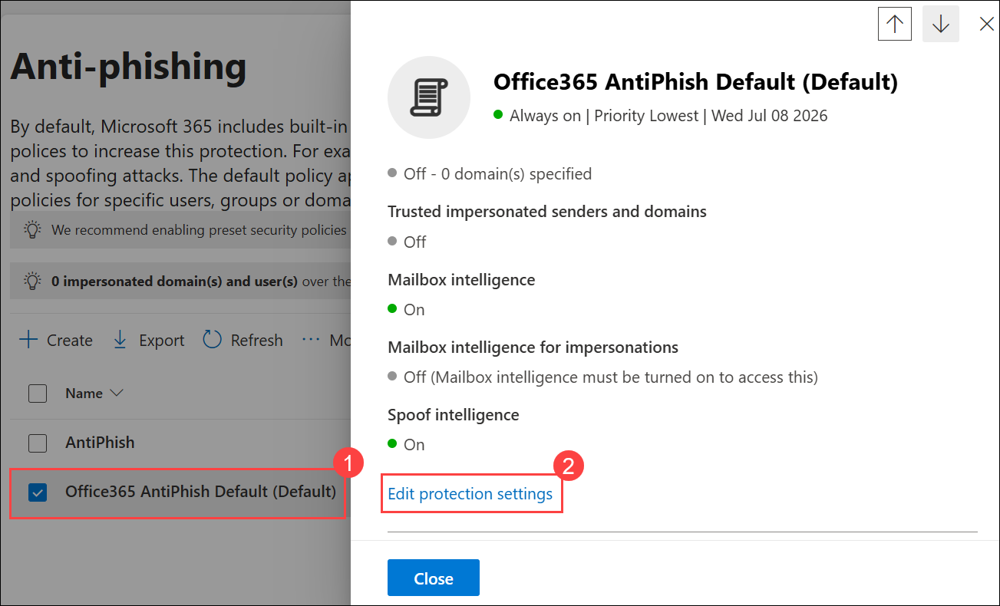

    >**Note:** EOP anti-phishing focuses on **spoof intelligence** — detecting senders who forge your domain or a trusted domain. The more advanced *impersonation* protection (protecting named users like your CEO) is a Microsoft Defender for Office 365 feature and is not part of EOP.

1. Confirm that **spoof intelligence** is turned **on**.

    >**What this does:** Spoof intelligence learns the normal senders for your domains and flags messages that appear to forge a legitimate sender.

1. Review the action taken on messages caught by spoof protection (for example, move to Junk Email or Quarantine), then **Save** or **Cancel**.

    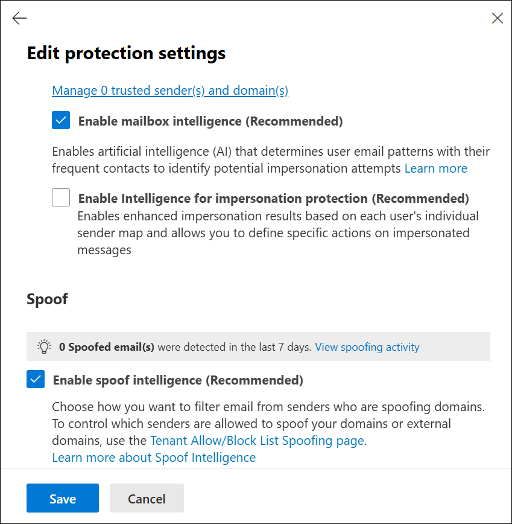

    >**Note:** If you receive the message that the *AntiPhishPolicy* URI *"is not valid for PUT operation..."*, select **OK**, then select **Cancel** to return to the main page. The default policy remains in effect.

1. The anti-phishing default policy should remain **On**.

   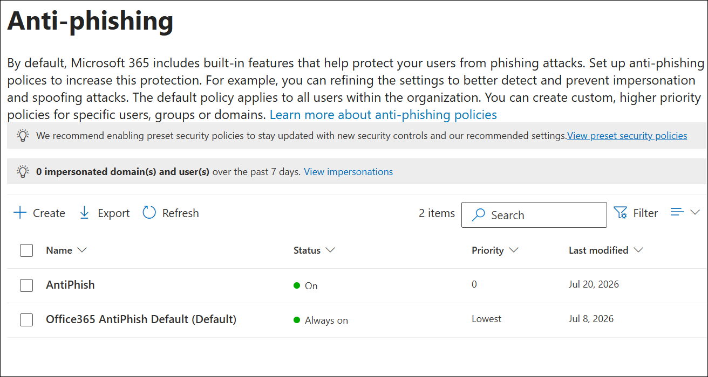

## Task 5: Verify your configuration

In this task you'll verify that the anti-malware, anti-spam, and anti-phishing policies are enabled.

1. Return to **Threat policies** (**Email & Collaboration > Policies & rules > Threat policies**).

1. Open each policy list in turn and confirm the default policy shows a status of **On**:

    - **Anti-malware** — default policy **On**
    - **Anti-spam** — inbound default **On**, outbound default **On**
    - **Anti-phishing** — default policy **On**

    >**Tip:** If a status looks wrong, refresh with **Ctrl+F5**. It can take a moment for the portal to reflect a change.

### Knowledge check

Test your understanding. Answers are below.

1. What is Exchange Online Protection, and which subscriptions include it?
2. In which two directions does EOP filter mail, and why does outbound filtering matter?
3. What does the common attachments filter do, and why is it useful even when no known malware is detected?
4. What is the difference between sending spam to the Junk Email folder versus Quarantine?
5. EOP anti-phishing provides spoof protection. Which more advanced anti-phishing capability is NOT part of EOP, and where does it come from?

Show answers

1. EOP is the cloud-based mail-filtering service that inspects mail for spam, malware, and phishing. It's included with every Exchange Online subscription.
2. EOP filters **inbound** mail (protecting users from incoming threats) and **outbound** mail. Outbound filtering matters because a compromised account is often used to send spam; outbound limits cap the damage.
3. It blocks file types commonly used to deliver malware (like executables) based on the file type itself, so it stops dangerous attachments even when no known malware signature is present.
4. Junk Email keeps the message accessible to the user in their mailbox; Quarantine holds it separately for admin or user review before release.
5. **Impersonation protection** (protecting specific named users or domains) is not part of EOP — it comes from **Microsoft Defender for Office 365**.

## Summary

In this lab you learned what Exchange Online Protection is and how it filters mail. You reviewed and configured the anti-malware policy, the inbound and outbound anti-spam policies, and the anti-phishing spoof protection, then verified all three were enabled. You now know the navigation path to the Threat policies page and can explain what each core EOP policy protects against.

### You've successfully completed the hand's-on lab!
