# Lab: Explore Microsoft Defender XDR

## Lab Scenario
 You are a Security Operations Analyst working at a company that is implementing Microsoft Defender XDR. You start by assigning preset security policies in Exchange Online Protection (EOP) and Microsoft Defender XDR for Office 365.

## Lab Objectives

In this lab, you will perform:

- **Task 1:** Create a Group in Microsoft Entra ID

- **Task 2:** Apply Microsoft Defender XDR for Office 365 to present security policies

- **Task 3:** Preparing the Microsoft Defender XDR workspace
    
## Estimated Timing: 90 Minutes

## Architecture Diagram

  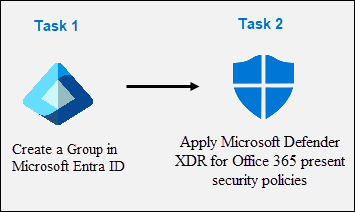

### Task 1: Create a Group in Microsoft Entra ID

In this task, you will create a new group in Microsoft Entra ID using the Azure portal.

1. In the Search bar of the Azure portal, type **Microsoft Entra ID (1)**, then select **Microsoft Entra ID (2)**.

   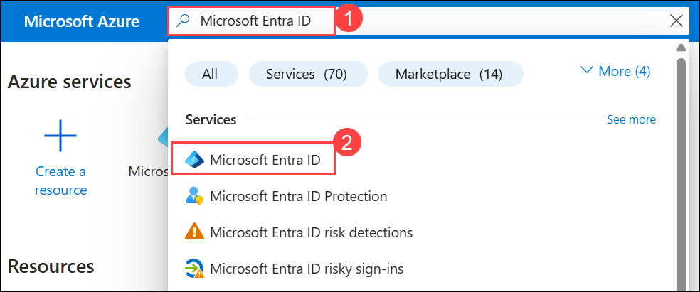

1. Under **Manage** select **Groups** and then click on **New group**.

   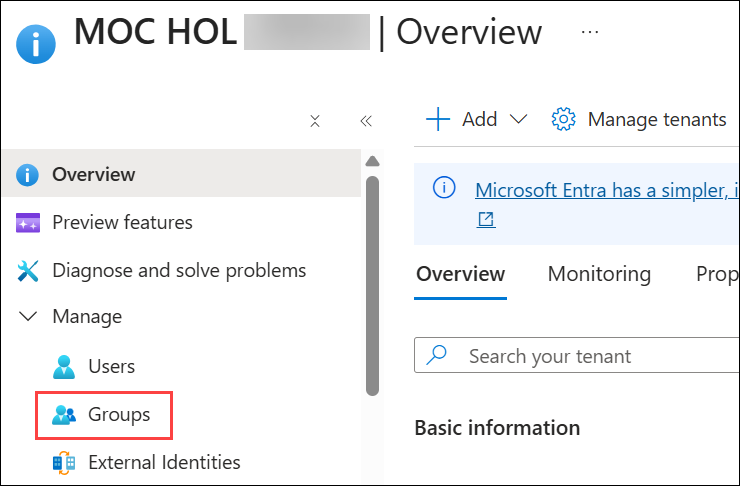

   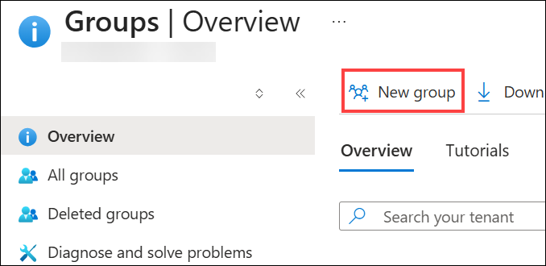

1. Enter the below details for the new group page:

   |Setting|Value|
    |---|---|
    |Group Type| **Microsoft 365 (1)** |
    |Group Name| **Sg-IT-<inject key="DeploymentID" enableCopy="false"/> (2)**|

   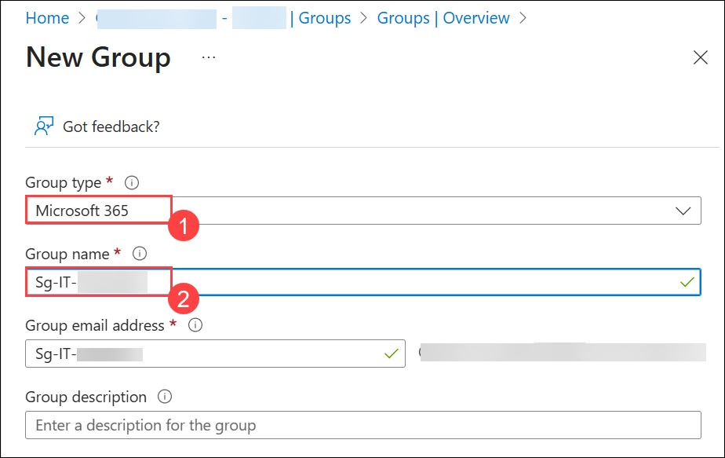

1. Click on **No owners selected** and  select the **ODL_user <inject key="DeploymentID" enableCopy="false"/>** from the list and then click on **Select**.

   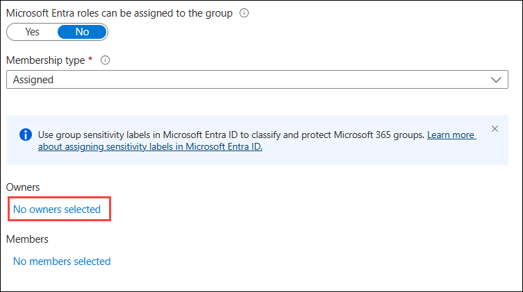

1. Click on **No members selected** and select the **ODL_user <inject key="DeploymentID" enableCopy="false"/>** from the list and then click on **Select**.

   >**Note:** Make sure you have selected **Group type** as **Microsoft 365**.

1. On the **New Group** page, click on **Create**.

   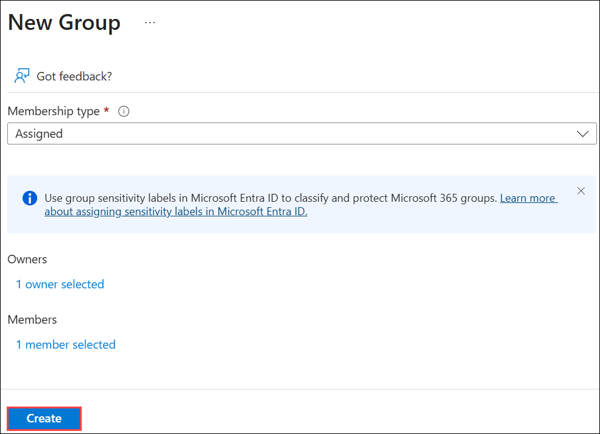

### Task 2: Apply Microsoft Defender XDR for Office 365 preset security policies

In this task, you will assign preset security policies for Exchange Online Protection (EOP) and Microsoft Defender XDR for Office 365 in the Microsoft  security portal.

1. In the Edge browser, navigate to the [Microsoft Defender XDR portal](https://security.microsoft.com) via the **Security portal**.

1. You will see the **Sign into Microsoft Defender XDR portal** tab. Here, enter your credentials to log in:
 
   - **Email/Username:** <inject key="AzureAdUserEmail"></inject>
 
      
 
1. Now enter the Temporary Access Pass and click on **Sign in**.
 
   - **Temporary Access Pass:** <inject key="AzureAdUserPassword"></inject>
 
      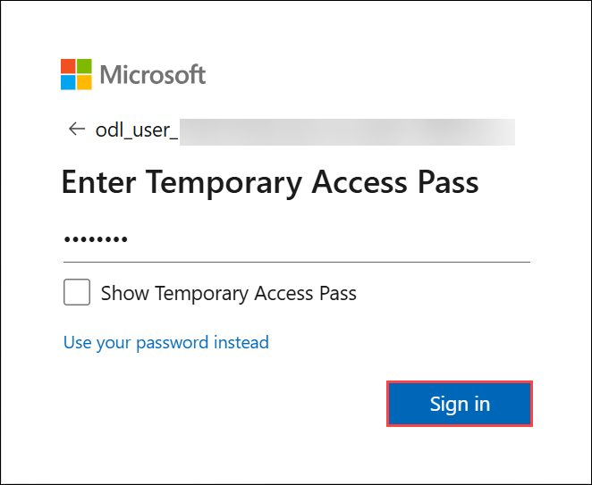

     >**Note:** If you encounter the message **"The operation could not be completed. Please try again later. If the issue persists, contact Microsoft Support."**, click **OK** to continue.

1. If prompted, please close the **Microsoft Defender XDR quick tour** to go ahead.

1. On **Microsoft Defender** page, if the left navigation pane is collapsed, select **Show navigation** to expand it.

   

1. From the navigation menu, expand **Email & Collaboration (1)** area, select **Policies & rules (2)**.

1. On the **Policy & rules** dashboard, select **Threat policies (3)**.

   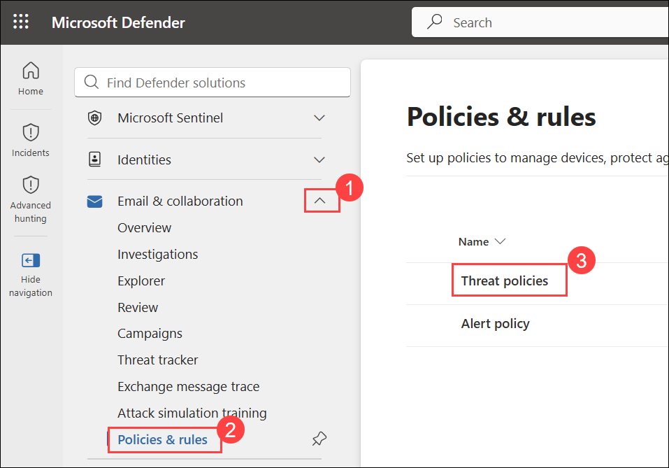

1. On the **Threat policies** dashboard, select **Preset Security Policies**.

   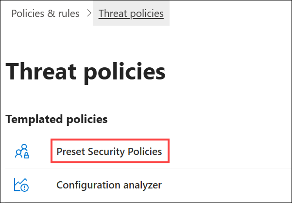

    >**Note:** If you receive the message **"Client Error - Error when getting bip rule"** select **OK** to continue. The error is due to the hydration status of your tenant at Office 365, which is not enabled by default.

    >**Note:** If you see the message **"Client Error - An error occurred when retrieving preset security policies. Please try again later."**, select **OK** to continue, then refresh your browser by pressing **Ctrl+F5**.

1. On the **Learn about preset security policies** **pop-out** page, select **Cancel**.

1. Under **Standard protection**, select **Manage protection settings**. 

   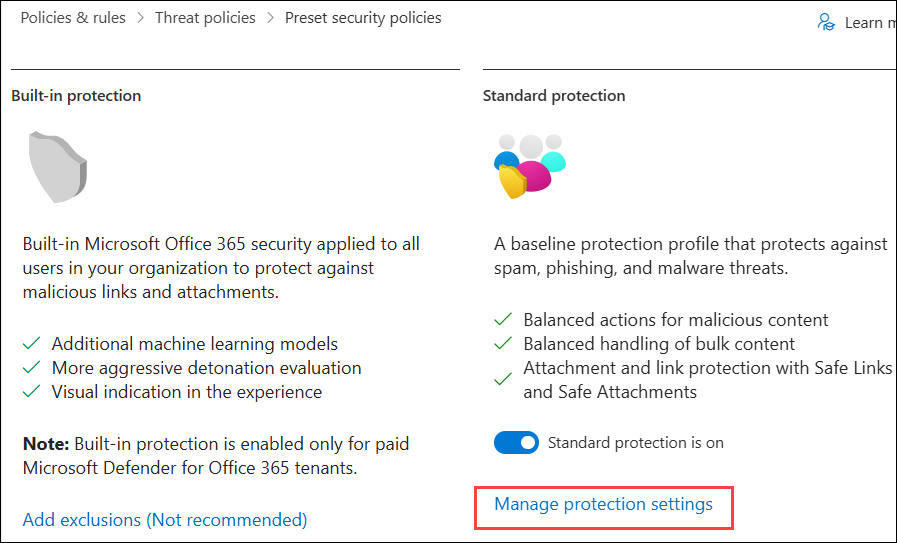

    >**Hint:** If this option appears greyed out, wait for 5 minutes and refresh your browser by pressing **Ctrl+F5** or opening the portal in InPrivate mode. Then sign back in using your Tenant Email credentials. If the option is still not visible after trying these steps, it may be an issue with the Defender portal. In that case, please contact Cloudlabs-Support@spektrasystems.com for assistance.

    >**Note:** After clicking **Manage protection settings**, the content may take **40 to 60 minutes** to load completely. Wait for the page to fully load, then revisit the same page after the waiting period. If needed, sign out of **Microsoft Defender XDR**, sign back in, and repeat the steps to continue.

1. In the **Apply Exchange Online Protection** page, select **Specific recipients (1)** under **Apply protection to:** and under **Domains** you can see that your **domain is selected (2)**. If not, start writing your tenant's domain name (eg: mocholxxxxxx.onmicrosoft.com), select it, and then select **Next (3)**.

   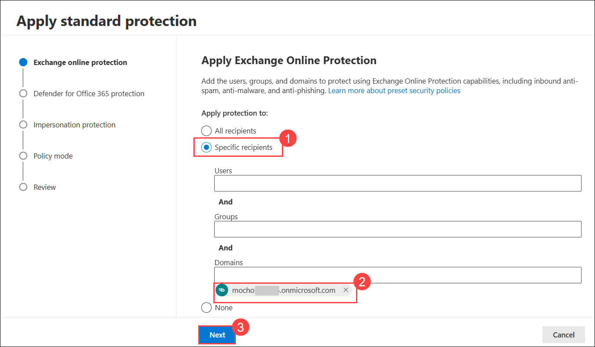                                                                    
  
    >**Hint:** The domain name for your tenant is the same as your admin account, usually in the format **mocholxxxxx.onmicrosoft.com**. This setup enforces policies for anti-spam, outbound spam filtering, anti-malware, and anti-phishing.

1. On the **Apply Defender for Office 365 protection** page, apply the same configuration as in the previous step and select **Next**. This configuration enforces policies for **anti-phishing, Safe Attachments, and Safe Links**.

    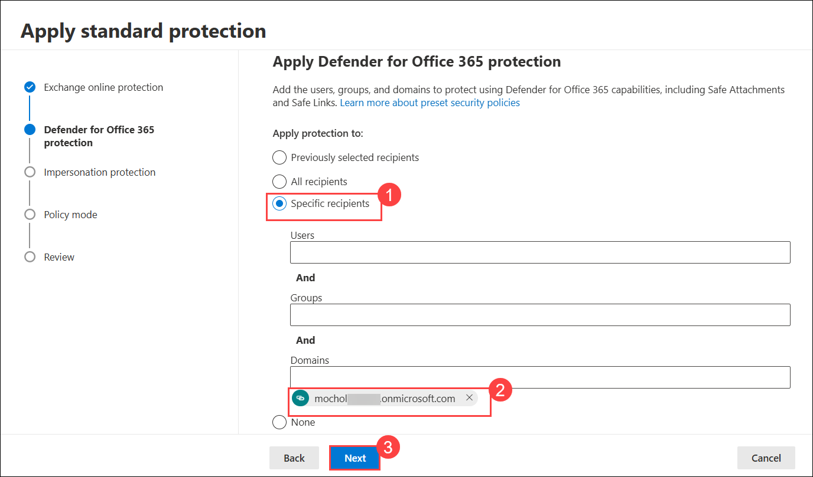  

1. In the Impersonation protection page, select **Next** for all next steps, i.e., 4x times, to continue.

1. If a popup appears for **Policy mode** page, make sure the **Turn on the policy when finished** radio button is selected, and then select **Next**.

1. Read the content under **Review and confirm your changes** and select **Confirm** to apply the changes, and then select **Done** to finish.

   > **Note:** If you see a pop-up stating _Organizational setup in progress_, please wait for 15 minutes and try signing in again to the Defender portal. 

1. Under **Strict protection**, select **Manage protection settings**. **Hint:** **Strict protection** is found under "Email & Collaboration - Policies & rules - Threat policies - Preset security policies".

   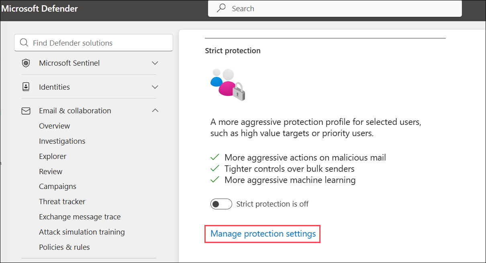 

   > **Hint:** If this option appears greyed out, wait for 5 minutes and refresh your browser by pressing **Ctrl+F5** or opening the portal in InPrivate mode. Then sign back in using your Tenant Email credentials. If the option is still not visible after trying these steps, it may be an issue with the Defender portal. In that case, please contact Cloudlabs-Support@spektrasystems.com for assistance.
   
   > **Note:** You might need to scroll down to find Strict protection. 

1. In the **Apply Exchange Online Protection** page, select **Specific recipients (1)** and under **Groups** start writing **Sg-IT-<inject key="DeploymentID" enableCopy="false"/> (2)**, select it, and then select **Next (3)**. Note that this configuration applies policies for anti-spam, outbound spam filters, anti-malware, and anti-phishing protection.

   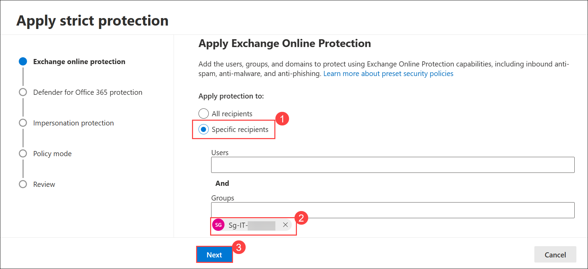 

   >**Note:** If a group is already selected, ensure it is **Sg-IT-<inject key="DeploymentID" enableCopy="false"/>**. If not, remove the selected group and add the correct one.

1. In the **Apply protection to** page, apply the same configuration as the previous step and select **Next**. Notice that this configuration applies policies for **anti-phishing, Safe Attachments, and Safe Links.**

   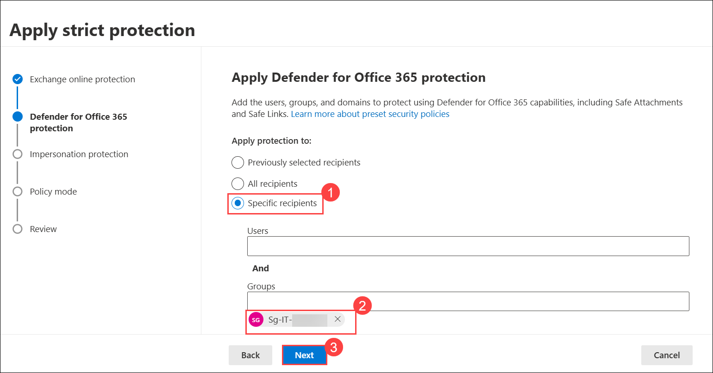

1. In the **Impersonation protection** page, select **Next** for next all steps i.e. (4x times) to continue.

1. In the **Policy mode** page, make sure the **Turn on the policy when finished (1)** radio button is selected, and then select **Next (2)**.

   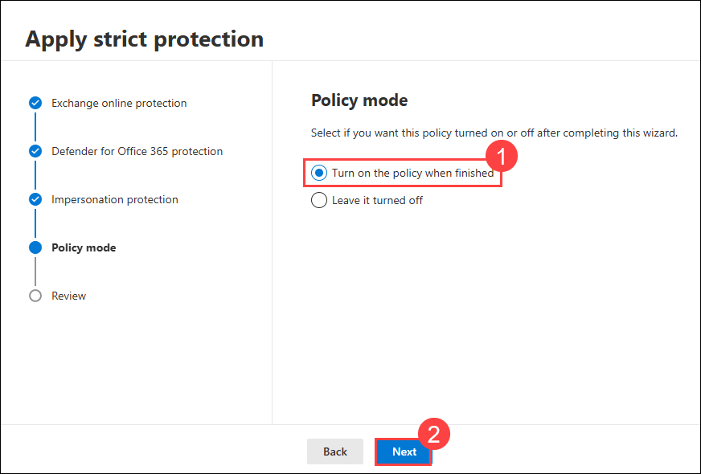

1. Read the content under **Review and confirm your changes** and select **Confirm** to apply the changes, and then select **Done** to finish.

### Task 3: Preparing the Microsoft Defender XDR workspace

> **Note:** If you do not see **Devices** under the **Assets** section in the **Defender portal**, it may be due to a **glitch or an issue** in the **Microsoft Defender portal**. In this case, try refreshing the page. If it still doesn’t appear, just go through the lab guide for this task.  

> **Note:** `The Devices option under the Assets section may take 24–48 hours to appear in the Microsoft Defender portal. This is expected behavior by design. Therefore, this task is provided as read-only for reference.`

1. At the **Microsoft Defender** portal **Home** screen, scroll down the navigation menu items to the **Assets (1)** section, and select **Devices (2)**.

   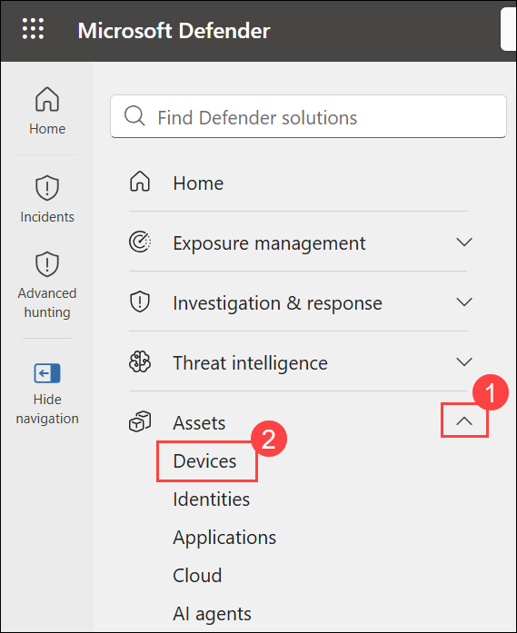 

   >**Note:** If you don’t see the **Devices** under the **Assets** section in the **Defender portal**, sign out by selecting the circle with your initials in the top-right corner and choosing Sign out. You can also try refreshing the page using Ctrl+F5, waiting 30–45 minutes, or opening the portal in InPrivate mode. Then sign back in using your Tenant Email credentials. If the option is still not visible after trying these steps, it may be an issue with the Defender portal. In that case, please contact Cloudlabs-Support@spektrasystems.com for assistance.

1. The process to deploy the Defender XDR workspace should start, and you should see messages saying **loading and Initializing** briefly displayed at the top of the page, and then you're going to see an image of a coffee mug and a message that reads: **Hang on! We're preparing new spaces for your data and connecting them.** It takes approximately 5 minutes to finish. **Leave the page open and make sure it finishes since it's required for the next Lab.**

    >**Note:** Disregard pop-up error messages saying **Some of your data cannot be retrieved**. If the message "Hang on! We're preparing new spaces for your data and connecting them" does not appear, or the "Settings > Microsoft Defender XDR > Account" page opens, but you see the message **Failed to load data storage location. Please try again later**, select "Alert service settings" from the "General" menu.

1. When the new workspace initialization completes successfully, the **Home** portal page will display a **Get your SIEM and XDR in one place** banner. And, in **Settings (1)**, the **Microsoft Defender XDR (2)** General settings for Account, Email notifications, Preview Features, Alert service settings, Permissions and roles and Streaming API are now turned on.

   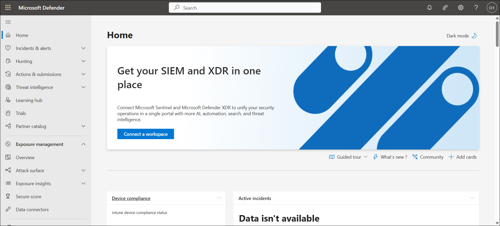
   
   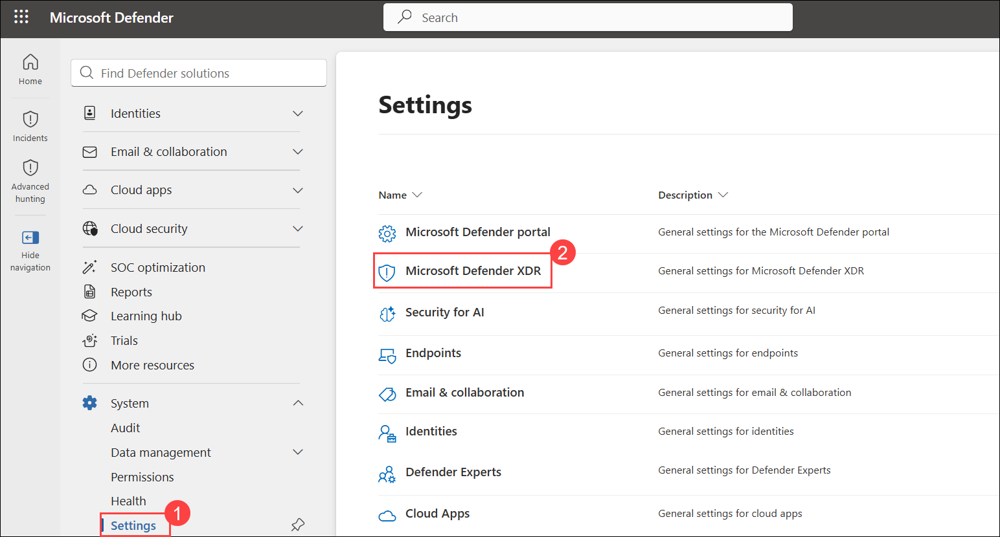 
   
   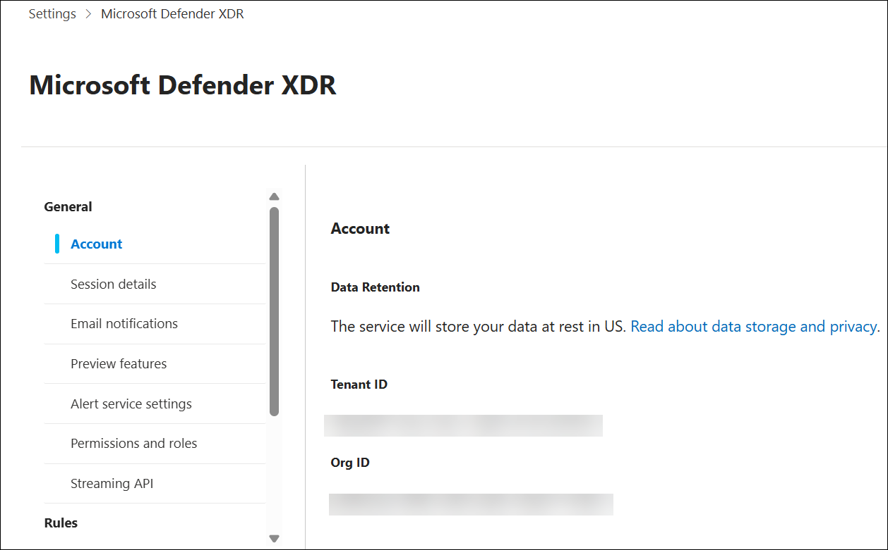 

   > **Congratulations** on completing the task! Now, it's time to validate it. Here are the steps:
   > - Hit the Validate button for the corresponding task. You can proceed to the next task if you receive a success message.
   > - If not, carefully read the error message and retry the step, following the instructions in the lab guide.
   > - If you need any assistance, please contact us at cloudlabs-support@spektrasystems.com. We are available 24/7 to help you out.

   <validation step="0d9ed9a9-da9f-4589-96fc-e2dacd74e6e3" />

### Review
 In this lab, you have completed the following:

   - Created a Group in Microsoft Entra ID
   - Applied Microsoft Defender XDR for Office 365 preset security policies

## You have successfully completed the lab
