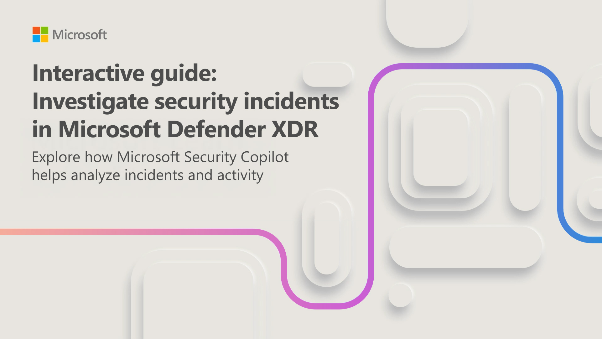
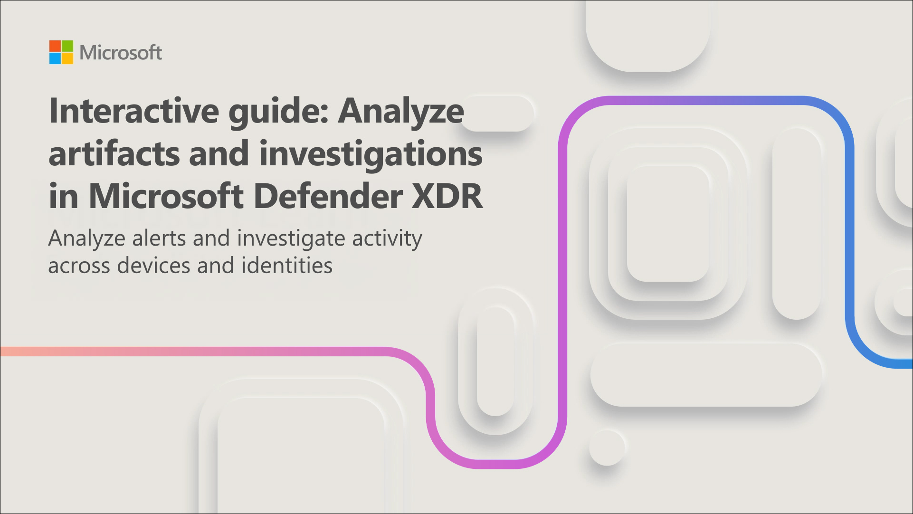

# Lab 02: Explore Microsoft Security Copilot

## Lab Scenario

The organization you work for wants to increase the efficiency and capabilities for its security operations analysts, and to improve security outcomes. In support of that objective, the office of the CISO determined that deploying Microsoft Security Copilot is a key step towards that objective. As a Security administrator for your organization, you're tasked with setting up Copilot.

Security Copilot integrates with Microsoft Defender XDR to help you investigate and respond to security incidents. In this unit, you work through two interactive guides that take you through a complete incident investigation workflow—from understanding incident context to analyzing specific artifacts and performing advanced investigation.

>**Note:** `This exercise is designed to be completed on a local system. Selecting either image launches an interactive click-through simulation in your browser. Follow the guided steps in the simulation to complete the exercise.`

## Lab Objectives

- **Task 1:** Investigate incident context and activity

- **Task 2:** Analyze artifacts and pivot to advanced investigation

## Estimated Timing: 30 Minutes

### Task 1: Investigate incident context and activity

When a complex incident is identified in Microsoft Defender XDR—involving a compromised asset and dozens of alerts—it can be difficult to determine where the attack started and how it progressed. Security Copilot summarizes incident activity, connects related events, and provides guided responses to help you focus on what matters.

In this interactive guide, which takes approximately 10 minutes to complete, you investigate a security incident in Microsoft Defender XDR. You review incident and alert summaries, analyze related entities, and use Security Copilot insights to guide your investigation.

**Select the image below to get started.**

## Task 2: Analyze artifacts and pivot to advanced investigation

After you understand the overall incident context, the next step is to analyze individual alerts and investigate specific artifacts. Security Copilot helps you examine alert details, review device and user context, and identify risks with recommended actions.

In this interactive guide, which guide takes approximately 10 minutes to complete, you continue your investigation by analyzing alerts in Microsoft Defender XDR. You review alert details, examine device and user context, and use Security Copilot to support advanced investigation.

**Select the image below to get started.**

## Summary and additional resources

In this exercise, you explored the first run experience of Microsoft Security Copilot, provisioned capacity, and explored the standalone and embedded experiences of Copilot. You investigated an incident in Microsoft Defender XDR, explored the incident summary, device summary, script analysis, and more. You also pivoted your investigation to the standalone experience and used the pin board as a way to share details of your investigation with your colleagues.

To run additional Microsoft Security Copilot use case simulations, browse to [Explore Microsoft Security Copilot use case simulations](/training/modules/security-copilot-exercises/)

## You have successfully completed the lab
