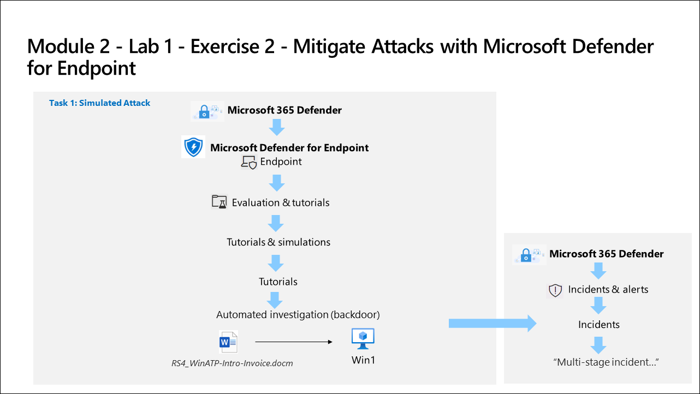

# Module 2 - Lab 1 - Exercise 2 - Mitigate Attacks with Microsoft Defender for Endpoint

## Lab scenario

You are a Security Operations Analyst working at a company that is implementing Microsoft Defender for Endpoint. Your manager plans to onboard a few devices to provide insight into required changes to the Security Operations (SecOps) team response procedures.

To explore the Defender for Endpoint attack mitigation capabilities, you will run two simulated attacks.

## Lab objectives
 In this lab, you will perform the following:
- Task 1: Verify Device onboarding
- Task 2: Investigate alerts and incidents

## Estimated timing: 60 minutes

## Architecture Diagram

  

### Task 1: Verify Device onboarding

In this task, you will confirm that the device is onboarded successfully and create a test alert.

1. If you are not already at the Microsoft Defender XDR portal in your Microsoft Edge browser, go to (https://security.microsoft.com) and login as Admin for your tenant.

1. In the left-hand menu, under the **Assets** area, select **Devices**. Please wait until WIN1 appears in the Devices page before you continue. Otherwise, you might need to repeat this task to see the alerts that will be generated later.

    >**Note:** If you have completed the onboarding process and don't see devices in the Devices list after an hour, it might indicate an onboarding or connectivity problem.

1. Select **Settings** from the left menu bar, then from the Settings page select **Endpoints**.

1. Select **Onboarding** in the Device management section and make sure *"Windows 10 and 11"* is selected as operating system. The *"First device onboarded"* message now shows *Completed*.

1. Scroll down and under the section *"2. Run a detection test"*, copy the detection test script by selecting the **Copy** button.  

1. In the windows search bar of the WIN1 virtual machine, type **CMD** and choose to **Run as Administrator** on the right pane for the Command Prompt app.

1. When the "User Account Control" window is shown, select **Yes** to allow the app to run. 

1. Paste the script by right-clicking in the **Administrator: Command Prompt** windows and press **Enter** to run it.

    >**Note:** The window closes automatically after successfully running the script, and after a few minutes alerts are generated in the Microsoft Defender XDR portal.

### Task 2: Investigate alerts and incidents

In this task, you will investigate the alerts and incidents generated by the onboarding detection test script in the previous task.

1. In the Microsoft Defender XDR portal select **Incidents & alerts** from the left menu bar, then select **Alerts**.

1. In the **Alerts** pane, select the alert named *Suspicious PowerShell commandline* to load its details.

1. Review the *Alert story* timeline, and then review the *Details* and *Recommendations* tabs.

    >**Note:** Under the alert *Details* tab you can scroll down to the *Incident details* section and select the *Execution incident on one endpoint* link to open the incident.

1. In the Microsoft Defender XDR portal select **Incidents & alerts** from the left menu bar, then select **Incidents**

1. A new incident called *Execution incident on one endpoint* is in the right pane. Select the incident name to load its details.

1. Select the **Manage incident** link (with a pencil icon) and a new window blade appears.

1. Under **Incident tags** type "Simulation" and select **Simulation (Create new)** to create a new tag.

1. Select the toggle **Assign to**  and add your user account (Me) as owner of the incident.

1. Under **Classification**, expand the drop-down menu.

1. Under **Informational, expected activity**, select **Security testing**.

1. Add any comments if desired and select **Save** to update the incident and finish.

1. Review the contents of the *Attack story, Alerts, Assets, Investigations, Evidence and Response*, and *Summary* tabs. Devices and Users are under the *Assets* tab. In a real incident the *Attack story* tab displays the *Incident graph*. **Hint:** Some tabs might be hidden due the size of your display. Select the ellipsis tab (...) to make them appear.

<!---    >**Warning:** The simulated attacks here are an excellent source of learning through practice. Only perform the attacks in the instructions provided for this lab when using the course provided Azure tenant.  You may perform other simulated attacks *after* this training course is complete with this tenant. --->

> **Congratulations** on completing the task! Now, it's time to validate it. Here are the steps:
> - Navigate to the Lab Validation Page, from the upper right corner in the lab guide section.
> - Hit the Validate button for the corresponding task. You can proceed to the next task if you receive a success message.
> - If not, carefully read the error message and retry the step, following the instructions in the lab guide.
> - If you need any assistance, please contact us at labs-support@spektrasystems.com. We are available 24/7 to help you out.
 
## Review
In this lab, you have completed the following:
- Ran Simulated Attacks
- Investigated the Attacks

## You have successfully completed the lab.
