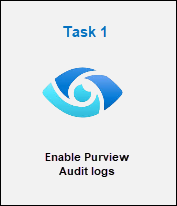
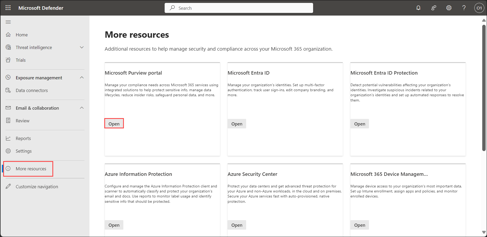
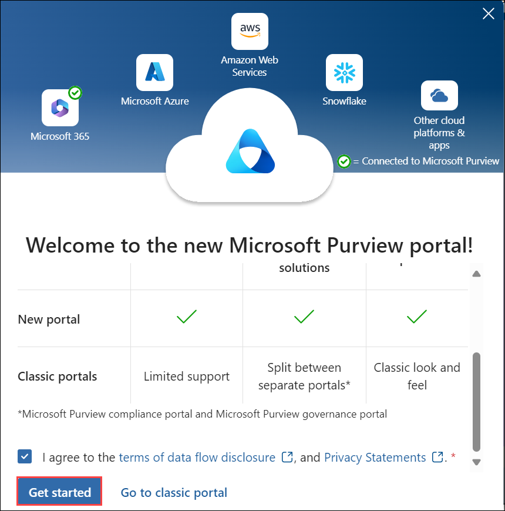
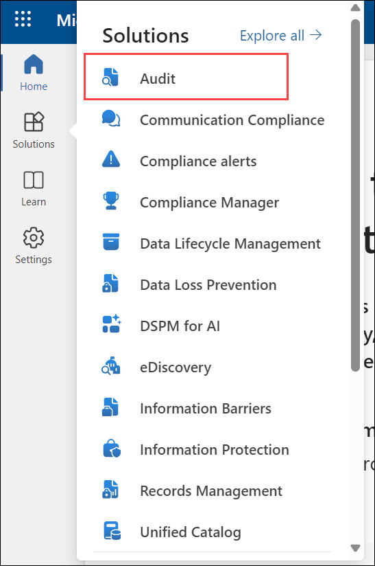
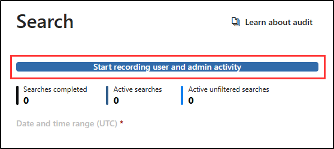

# Module 3 - Lab 1 - Exercise 1 - Explore Microsoft Purview Audit logs

## Lab Scenario

You're a Security Operations Analyst working at a company that is implementing Microsoft Defender XDR and Microsoft Purview. You're assisting colleagues on the the IT compliance team with configuring both Purview Audit (Standard) and Audit (Premium). Their objective is to ensure that all access and modifications to patient data in our network of healthcare facilitie sare accurately logged to meet health data protection regulations.

## Lab Objectives

In this lab, you will perform:

- Task 1: Enable Purview Audit logs

## Architecture Diagram

  

### Estimated Timing: 15 minutes

### Task 1: Enable Purview Audit logs

In this task, you'll assign preset security policies for Exchange Online Protection (EOP) and Microsoft Defender for Office 365 in the Microsoft 365 security portal.

1. In the **Microsoft Edge** browser, navigate to the **Microsoft Defender XDR portal** at [Microsoft Defender XDR portal](https://security.microsoft.com).

1. You'll see the **Sign into Microsoft Defender XDR portal** tab. Here, enter the username and password as below:

    - **Username: <inject key="AzureAdUserEmail"></inject>** 
    - **Password: <inject key="AzureAdUserPassword"></inject>** 

1. From the navigation menu, click on **More resources (1)** and select **Open (2)** button on *Microsoft Purview portal* tile

   

1. When the **Microsoft Purview portal** opens, a message about the *new Microsoft Purview portal* will appear on the screen. Select the option to agree with the **terms of data flow disclosure** and the **privacy statement**, then click **Get started**.

    

    >**Note:** If you see a message that _the Compliance portal is retired_, please wait for a few seconds, it will redirect you to the new portal. 

1. Select **Solutions** from the left sidebar, then select **Audit**.

   

1. On the **Search** page, select the blue **Start recording user and admin activity** bar to enable audit logging.

    

    >**Note:** If you get a message to _complete the organizational setup_, click on Yes. 

1. Once you select this option, the **blue bar** should disappear from the page.

    >**Note:** It might take 60 minutes to start recording activities.

### Review
 In this lab, you have completed the following:

   - Enabled Purview Audit logs

## You have successfully completed the lab
