# Lab - 03: Explore Microsoft Purview Audit (Standard and Premium)

### Estimated Timing: 120 Minutes

## Lab Scenario

You're a Security Operations Analyst working at a company that is implementing Microsoft Defender XDR and Microsoft Purview. You're assisting the IT compliance team with configuring both **Purview Audit (Standard)** and **Audit (Premium)**. Their goal: make sure every access to and modification of patient data across a network of healthcare facilities is accurately logged, so the organization can meet health-data protection regulations.

## Lab Objectives

In this lab, you will perform:

- **Task 1:** Sign in and open the Microsoft Purview portal

- **Task 2:** Enable Purview Audit logging

- **Task 3:** Generate some auditable activity, then submit a search

- **Task 4:** Create an audit log retention policy for patient data

- **Task 5:** Compare Audit (Standard) and Audit (Premium)

- **Task 6:** Revisit your search and review results

## Task 1: Sign in and open the Microsoft Purview portal

In this task you'll sign in to the Microsoft Purview portal and access the Audit solution.

1. In the **Microsoft Edge** browser, navigate to the **Microsoft Defender XDR portal** at [Microsoft Defender XDR portal](https://security.microsoft.com).

1. You'll see the **Sign into Microsoft Defender XDR portal** tab. Here, enter the username and password as below:

    - **Username: <inject key="AzureAdUserEmail"></inject>** 
    - **Password: <inject key="AzureAdUserPassword"></inject>** 

1. On **Microsoft Defender** page, if the left navigation pane is collapsed, select **Show navigation** to expand it.

   

1. From the navigation menu, click on **More resources (1)** and select **Open (2)** button on **Microsoft Purview portal** tile

   

1. If a message states that *the compliance portal is retired*, wait for it to redirect you to the new **Microsoft Purview portal**.

1. When the **Microsoft Purview portal** opens, a message about the **Welcome to the new Microsoft Purview portal** will appear on the screen. Click **Get started** to continue

     

## Task 2: Enable Purview Audit logging

In this task you'll enable Purview Audit logging and verify that audit activity recording is enabled.

1. Select **Solutions (1)** from the left sidebar, then select **Audit (2)**.

   

   > **Note:** The **Audit** option may take some time to appear in the **Solutions** menu. If it does not show up immediately, try refreshing the page using **Ctrl + F5**, signing out by selecting the circle with your initials in the top-right corner and choosing **Sign out**, and then signing back in using your **Tenant Email** credentials. You can also try opening the portal in **InPrivate/Incognito mode** or wait for **10–15 minutes** and check again.

1. On the **Search** page, look for a blue bar reading **Start recording user and admin activity**. Select it to enable audit logging.

    

1. The blue bar should disappear, confirming auditing is being enabled.

    >**Note:** It can take up to 60 minutes for recording to be fully active across all workloads. You don't need to wait here — continue with the lab.

    >**Note:** If the button doesn't appear or you get an error — PowerShell fallback

1. If you don't see the blue bar, or enabling it returns an error, enable auditing directly with PowerShell. This is a common, fully supported alternative.

1. Select the **Start** button, type **PowerShell (1)**, then from the **Best match** section right-click on **Windows PowerShell (2)**, and choose **Run as administrator (3)**.

   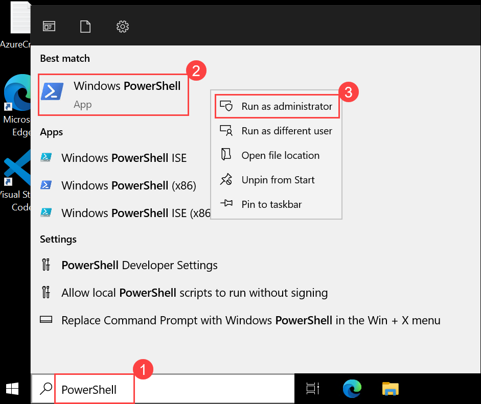

1. Install the Exchange Online management module:

    ```powershell
    Install-Module -Name ExchangeOnlineManagement
    ```

    >**Note:** If asked to trust the PSGallery repository, answer **Y** (yes).

1. Connect to Exchange Online (a sign-in window appears — use your CloudLabs admin credentials):

    ```powershell
    Connect-ExchangeOnline
    ```

1. Check whether auditing is already enabled:

    ```powershell
    Get-AdminAuditLogConfig | FL UnifiedAuditLogIngestionEnabled
    ```

    >**What this shows:** **True** means auditing is on; **False** means it's off.

1. If it's **False**, turn it on:

    ```powershell
    Set-AdminAuditLogConfig -UnifiedAuditLogIngestionEnabled $true
    ```

    >**Note:** If you get an error that you can't run the command in your organization, first run `Enable-OrganizationCustomization`, then run the `Set-AdminAuditLogConfig` command again.

    > **Note:** `On a freshly provisioned tenant, Set-AdminAuditLogConfig can keep throwing the same "you first need to run Enable-OrganizationCustomization" error even after Enable-OrganizationCustomization reports "This operation is not required. Organization is already enabled for customization" and Get-OrganizationConfig | FL IsDehydrated shows False. This is just backend replication lag - it may take 8+ hours for the backend to sync, and no command fixes it faster. Please proceed to Tasks 4 and 5 in the meantime, and re-check later with Get-AdminAuditLogConfig | FL UnifiedAuditLogIngestionEnabled.`

1. Confirm it's now enabled, then disconnect:

    ```powershell
    Get-AdminAuditLogConfig | FL UnifiedAuditLogIngestionEnabled
    Disconnect-ExchangeOnline
    ```

    >**What to expect:** The config now shows **UnifiedAuditLogIngestionEnabled : True**.

## Task 3: Generate some auditable activity, then submit a search

In this task you'll generate an auditable activity and submit an audit search to find the activity later after the logs are available.

1. In the **Microsoft Purview portal**, select **Settings** (⚙️) from the top-right corner.

2. Open any available **Settings** page, wait a few seconds, and then close the page or return to the previous page.

3. Note the approximate time when you performed this activity. You will use this time later when reviewing the audit records.

    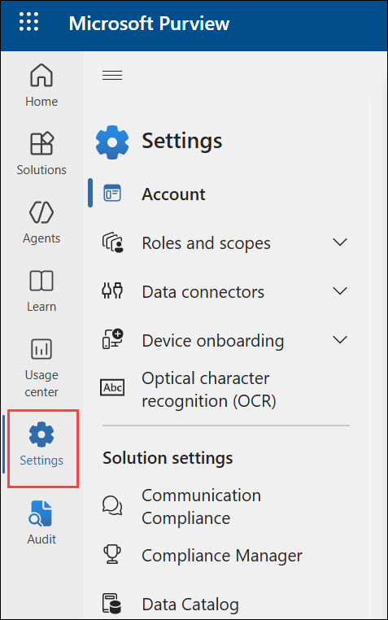

    >**Why this matters:** You're deliberately creating a known activity at a known time so that, when logs populate, you'll have something specific to find - a common technique when validating that auditing works.

1. Return to **Solutions > Audit** and the **Search** page. Take a moment to explore the search form. You'll see fields for:

    | Filter | What it does |
    |---|---|
    | Date range (start/end) | Limits the search to a time window |
    | Activities - friendly names | Search by specific actions (e.g., "Accessed file") |
    | Record types / Workloads | Limit to a service (Exchange, SharePoint, Entra ID, etc.) |
    | Users | Limit to activity by specific accounts |
    | Search name | A label so you can find this search later |

    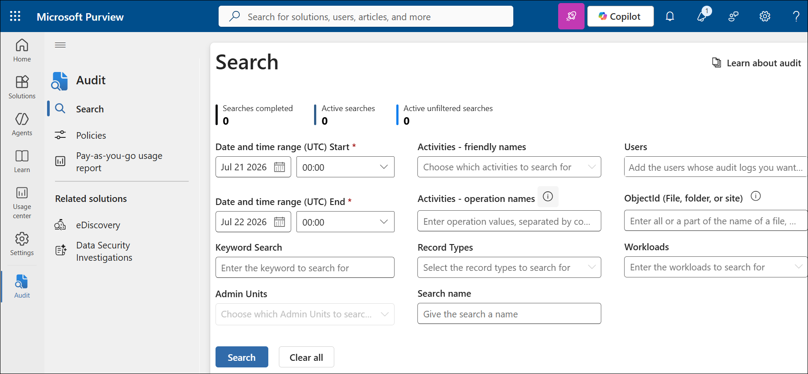

1. Configure a broad search to validate auditing:

    - **Date range:** Set the start time to the beginning of today (00:00) and the end time to the current time **(1)**.
    - **Activities:** leave blank to capture all activity types (broadest search).
    - **Users:** enter your admin account, or leave blank for all users.
    - **Search name:** Enter **Lab3-Validation (2)**.

1. Select **Search (3)** to submit it.

    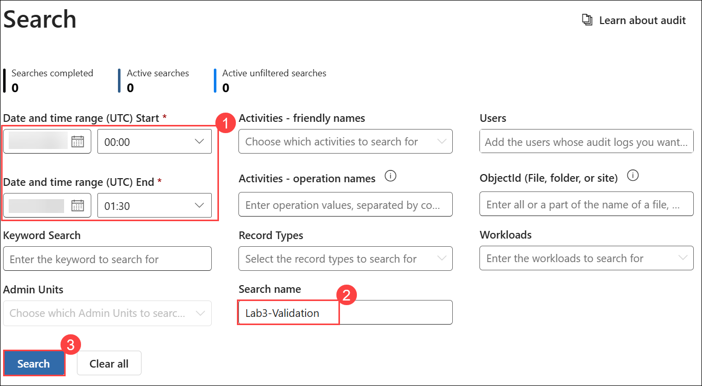

    >**What to expect:** On a freshly enabled tenant, this search may return **few or no results right away** — that's normal and expected because of the ingestion delay. The search itself is saved and will keep running against the log.

1. **Move on to the next tasks.** You'll come back to this search in Task 6 to see whether results have populated.

## Task 4: Create an audit log retention policy for patient data

In this task you'll create a custom audit log retention policy to retain patient-data activity records for a longer period.

>**Note:** Creating retention policies requires the **Organization Configuration** role and appropriate (E5-level) licensing for the longest retention periods. In this trial tenant you may see options limited by license — that's fine; the goal is to learn the workflow.

1. In the Purview portal, go to **Solutions > Audit**.

1. Select the **policies (1)** tab (near the top of the Audit area).

1. Select **+ Create audit retention policy (2)**.

    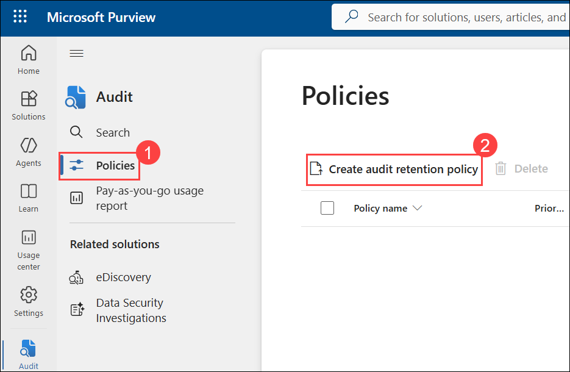

1. Fill in the policy details:

    | Setting | Value | Notes |
    |---|---|---|
    | Policy name | **Patient-Data-Retention (1)** | A clear, descriptive name |
    | Description | **Extended retention for patient-data access logs (2)** | Explains the compliance purpose |
    | Workload | **ExchangeItem (3)** | The services where patient data lives |
    | Duration | **1 year (4)** (if available) | Longer than the 180-day default |
    | Priority | **1 (5)** | Lower number = higher priority when policies overlap |

    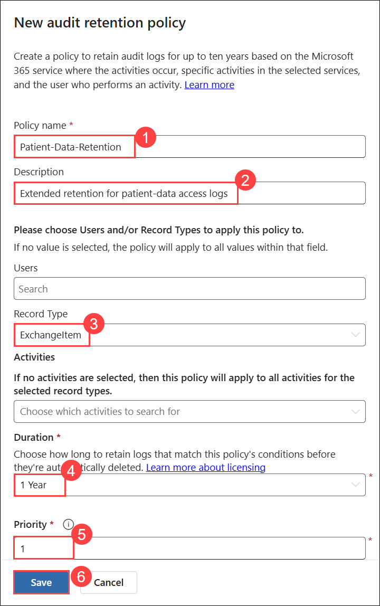

    >**What this does:** This tells Purview to keep audit records for the selected workload longer than the default, so investigators can look back further — essential when a data-access issue is discovered months later.

1. Select **Save (6)** to create the policy.

    >**Think about it:** Why does retention length matter for healthcare compliance? If a patient-data breach is discovered 7 months after it happened, and your logs only go back 180 days (about 6 months), the evidence is already gone. Retention policy is what prevents that gap.

1. A retention policy named **Patient-Data-Retention** appears in the Audit retention policies list.

    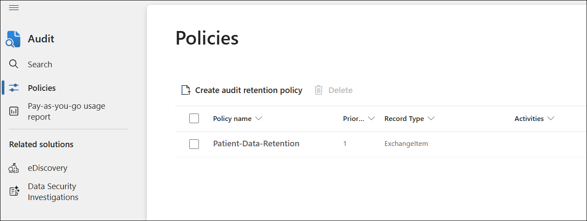

## Task 5: Compare Audit (Standard) and Audit (Premium)

In this task you'll compare Audit (Standard) and Audit (Premium) and understand the benefits of Premium for compliance and security investigations.

1. Review the following comparison of **Audit (Standard)** and **Audit (Premium)**:

    | Capability | Audit (Standard) | Audit (Premium) |
    |---|---|---|
    | Default retention | 180 days | 1 year for Exchange, SharePoint, OneDrive, Entra ID (180 days for other activities) |
    | Maximum retention | 180 days | Up to 10 years (with add-on license) |
    | Custom retention policies | Limited | Yes |
    | High-value ("intelligent insight") events | No | Yes — e.g., mail *read* (MailItemsAccessed), mailbox/SharePoint *search* terms |
    | Licensing | Most M365 subscriptions | E5 / A5 / G5 or Audit add-on |

1. In the **Microsoft Purview portal**, go to **Solutions > Audit** and open the **Search** page.

1. Select the **Activities - friendly names** field and review the available activities.

    >**Why the Premium events matter for a breach:** If an attacker compromises a mailbox, the single most important question is often *"which emails did they actually read?"* The **MailItemsAccessed** event — a Premium capability — answers that. Standard auditing can tell you a sign-in happened; Premium can tell you what was accessed afterward.

1. Consider the healthcare scenario and identify two reasons why the organization would choose **Audit (Premium)** over **Audit (Standard)**:

   * **Longer retention** helps preserve audit evidence when a breach is discovered months after it occurred.

   * **High-value events**, such as **MailItemsAccessed**, provide more detailed information about data that was accessed during a breach investigation.

## Task 6: Revisit your search and review results

In this task you'll revisit the submitted audit search, review the available audit records and their details, and export the results for further analysis.

1. In the Purview portal, go to **Solutions > Audit**.

1. Find and re-run your **Lab3-Validation** search (or submit it again with the same parameters).

    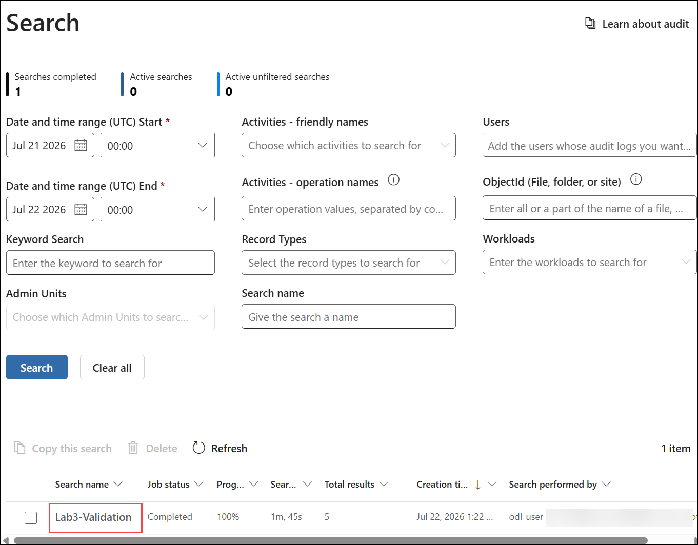

    >**What to expect:** You should now see audit records — sign-ins, admin actions, and page views from earlier in the lab. If results are still sparse, the ingestion delay simply hasn't fully caught up; note this as an expected characteristic rather than an error. Your instructor may also have a pre-seeded search with older, already-populated results to demonstrate with.

1. Select an individual audit record **(1)** to expand it. Review the details, which typically include **(2)**:

    - **Date/time** (UTC) of the activity
    - **User** who performed it
    - **Activity / Operation** name
    - **Workload** (the service involved)
    - **Details** (the raw AuditData, often JSON, with item-level specifics)

      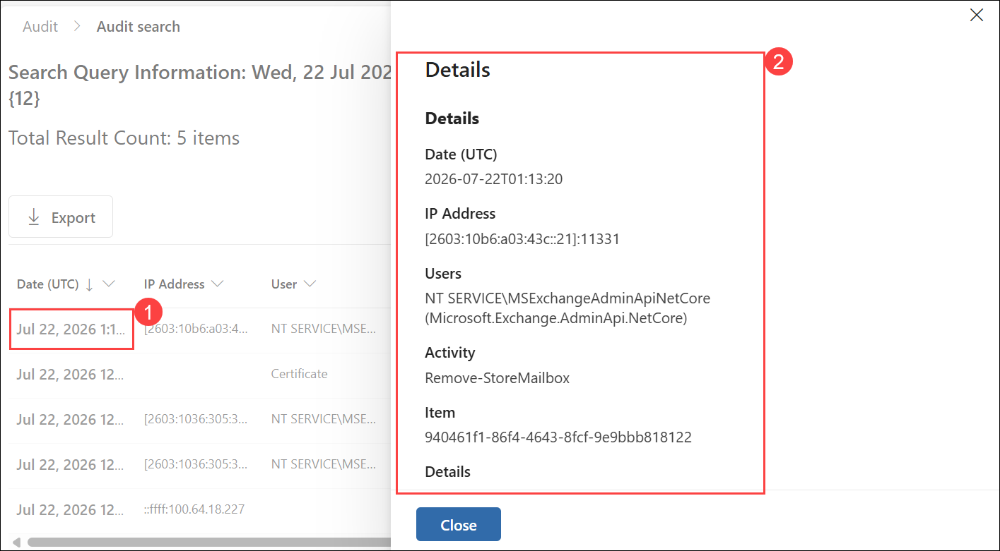

      >**What to look for:** For a patient-data investigation, you'd focus on the user, the file or mailbox item touched, and the timestamp — the who/what/when trail.

1. Practice **exporting** results for offline analysis: select **Export** to download the results as a **CSV** file.

    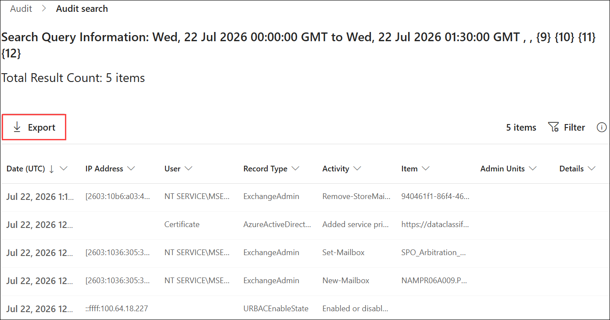

    >**Why this matters:** Compliance teams often need to hand evidence to auditors or open it in Excel to sort and filter. Exporting to CSV is the standard way to package audit evidence.

1. In the **Export in Progress** dialog, select **OK**.

    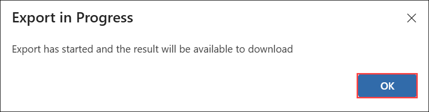

### Knowledge check

Test your understanding. Answers are below.

1. What does Microsoft Purview Audit record, and why is it important for a healthcare organization's compliance?
2. Why is there a delay between enabling auditing (or performing an activity) and being able to search for the result?
3. What is the default retention period for Audit (Standard), and why might that be a problem for a breach discovered seven months later?
4. Name one high-value event available in Audit (Premium) but not Standard, and explain why it matters during a breach investigation.
5. What PowerShell command enables unified audit log ingestion, and what command confirms whether it's on?

<details>
<summary>Show answers</summary>

1. It records user and admin activities across Microsoft 365 (who did what, when, in which service). For healthcare compliance it provides the evidence trail needed to prove who accessed patient data and to investigate suspected breaches.
2. Audit data must be ingested and indexed before it's searchable. Enabling auditing can take up to ~60 minutes to fully activate, and individual records typically appear within minutes to a few hours after the activity.
3. 180 days. If a breach is discovered about seven months later, the relevant records may already have been purged, leaving no evidence — which is why a longer custom retention policy (Premium) is valuable.
4. **MailItemsAccessed** (mail read) — it reveals which emails a compromised account actually accessed, answering the key forensic question of what data was exposed. (Mailbox/SharePoint search terms are also acceptable.)
5. Enable: `Set-AdminAuditLogConfig -UnifiedAuditLogIngestionEnabled $true`. Confirm: `Get-AdminAuditLogConfig | FL UnifiedAuditLogIngestionEnabled`.

</details>

---

## Summary

In this lab you enabled Microsoft Purview Audit (via the portal and the PowerShell fallback), explored the audit search interface and its filters, generated auditable activity and submitted a saved search, created a custom audit log retention policy for patient-data workloads, compared Audit (Standard) and (Premium), and reviewed and exported audit records. You managed the built-in ingestion delay by configuring early and revisiting your search later — the same approach a real compliance team uses when validating that auditing is working.

### You've successfully completed the hand's-on lab!
