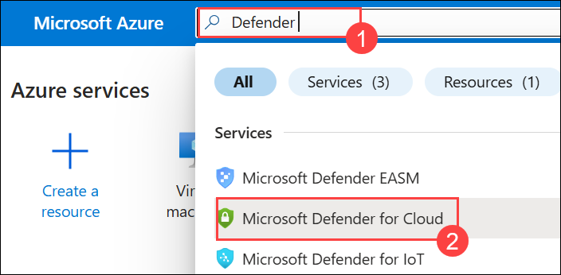
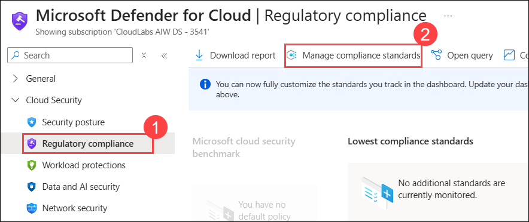
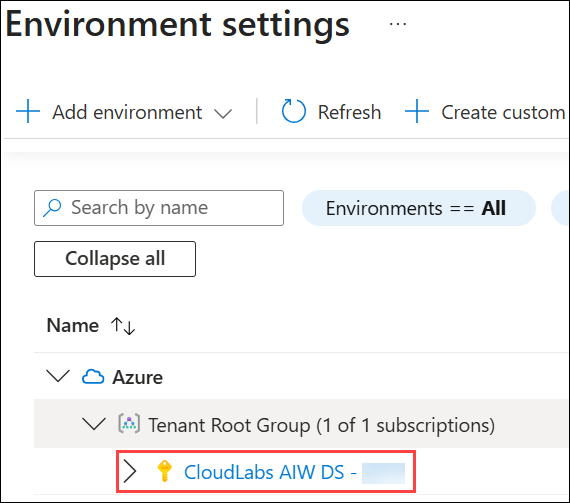
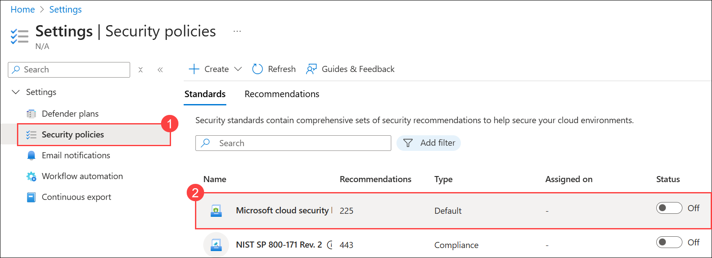
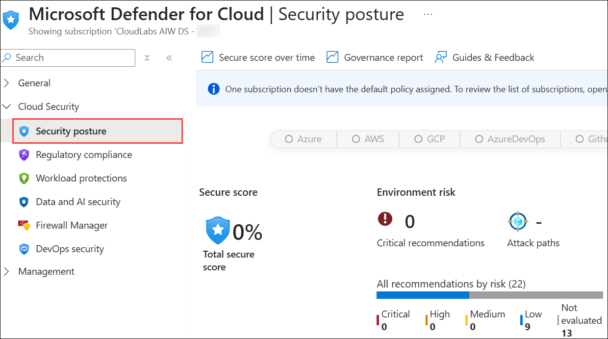
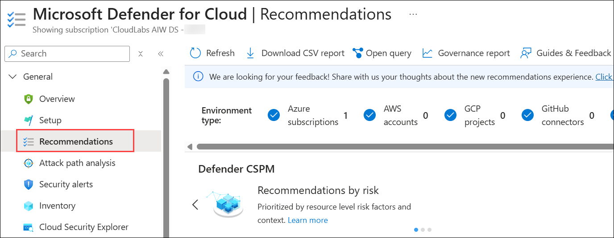
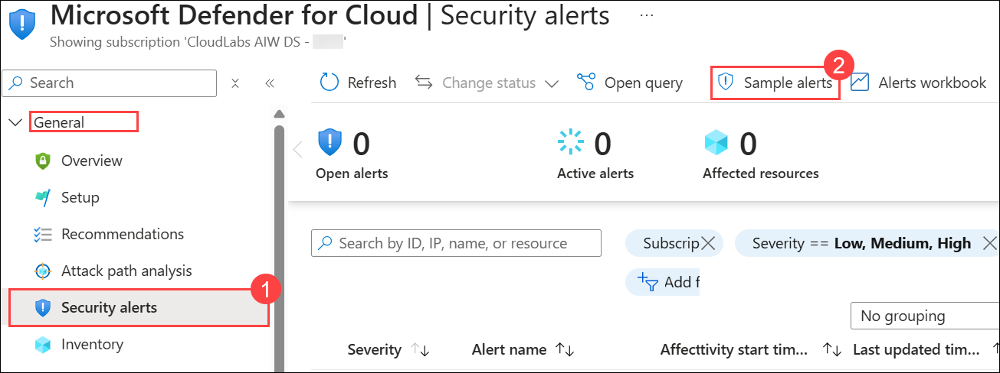
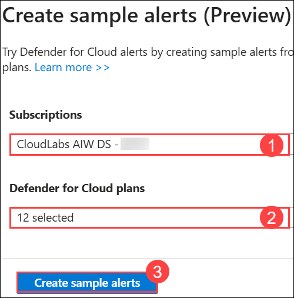
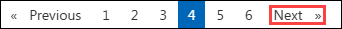

# Lab 03: Mitigate threats using Microsoft Defender for Cloud

### Estimated Duration: 20 Minutes

## Overview

In this lab, you will learn how to respond to security alerts using Microsoft Defender for Cloud. 

As a Security Operations Analyst, you'll explore regulatory compliance, review security posture management, and practice mitigating security alerts.

   > **Note:** Please perform this lab in the SmartHotelHost VM (Lab VM).

## Objectives

In this lab, you will perform the following tasks:
 
- Task 1: Explore Regulatory Compliance
- Task 2: Explore Security posture and recommendations
- Task 3: Mitigate security alerts

## Architecture Diagram

  
  
## Task 1: Explore Regulatory Compliance

In this task, you will load sample security alerts and review the alert details.  

1. In the Search bar of the Azure portal, type **Defender (1)**, then select **Microsoft Defender for Cloud (2)**.

   

1. Under **Cloud Security**, select **Regulatory compliance (1)** in the portal menu. Select **Manage compliance standards (2)** on the toolbar.

   

1. Scroll down and select your subscription by expanding the Tenant Root Group.

   

1. On the left pane, select **Security policies (1)** and click on **Microsoft cloud security (2)**. Review the **Microsoft security benchmark** available to you by default.

   

1. Select 'X' on the upper right of the page to return to the main blade.

## Task 2: Explore Security posture and recommendations

In this task, you will review cloud security posture management. 

   >**Note:** The Secure Score information can take 24 hours to populate. 

1. Navigate back to the Microsoft Defender for Cloud page and on the left menu Under *Cloud Security*, select **Security posture**.

   

   >**Note:** If the security posture page takes longer time to open, hard refresh the browser once or open the browser in an incognito widow and check. 

1. The Secure score most likely will show *N/A* until the score is calculated.
   
   > **Note:** The Secure score may initially be in a buffering state and may not display any value until the calculation is complete.
   
1. Under *General*, select **Recommendations** in the portal menu.

   

1. Explore the Recommendations provided.

## Task 3: Mitigate security alerts

In this task, you will load sample security alerts and review the alert details.

1. Under **General**, select **Security alerts (1)** in the portal menu.
1. Select **Sample alerts (2)** from the command bar.

   

1. In the Create sample alerts (Preview) pane, make sure your **subscription (1)** is selected, all **sample alerts (2)** are selected in the *Defender for Cloud plans* area and click on **Create sample alerts (3)**.  

    

      > **Note:** This sample alert creation process may take a few minutes to complete, wait for the *"Successfully created sample alerts"* notification.

1. Once completed, select **Refresh** to see the alerts appear under the *Security alerts* area.
1. Choose an interesting alert with a *Severity* of *High* and perform the following actions:

    - Select the alert checkbox, and the alert detail pane should appear. Select **View full details**.

    - Review and read the *Alert details* tab.

    - Select the **Take action** tab next to Alert details.

    - Review the *Take action* information. Notice the sections available to take action depending on the type of alert: Inspect resource context, Mitigate the threat, Prevent future attacks, Trigger automated response and Suppress similar alerts.

## Summary

In this lab, you have completed the following:

- Explored Regulatory Compliance
- Explored Security posture and recommendations
- Mitigated security alerts

### You have successfully completed the lab!
### Click on Next >> to procced with next Lab.
 

