# Lab 04 Exercise 1: Deploy Microsoft Defender for Endpoint (Ready-Only)

## Lab Scenario

You are a Security Operations Analyst working at a company that is implementing Microsoft Defender for Endpoint. Your manager plans to onboard a few devices to provide insight into required changes to the Security Operations (SecOps) team response procedures.

You start by initializing the Defender for the Endpoint environment. Next, you onboard the initial devices for your deployment by running the onboarding script on the devices. You configure security for the environment. Lastly, you create Device groups and assign the appropriate devices.

>**Important:** The lab Virtual Machines are used across different modules. Be sure to **SAVE** your virtual machines. If you exit the lab without saving, you will need to re-run some configurations when you return.

## Lab Objectives

In this lab, you will perform the following:
- Task 1: Initialize Microsoft Defender for Endpoint
- Task 2: Onboard a Device
- Task 3: Configure Roles
- Task 4: Configure Device Groups

## Estimated Timing: 60 Minutes

## Architecture Diagram

   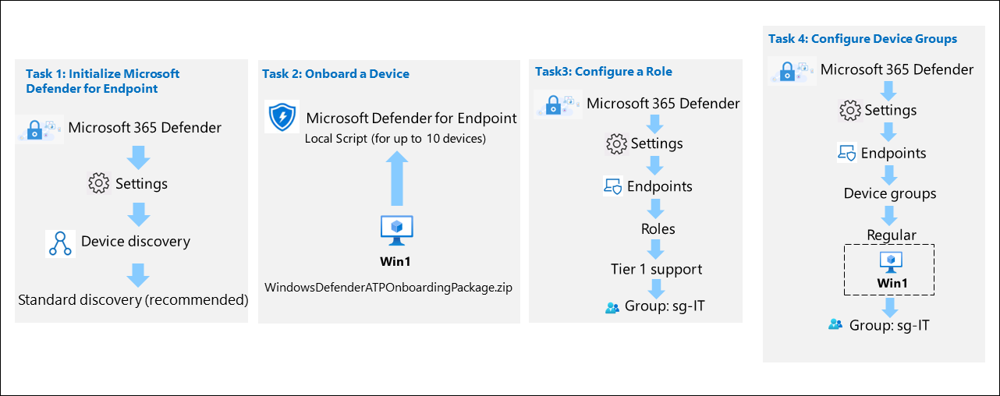

### Task 1: Initialize Microsoft Defender for Endpoint

In this task, you will perform the initialization of the Microsoft Defender for the Endpoint.

1. On the **LabVM**, open **Edge** browser, go to the **Microsoft Defender XDR portal** by visiting the following link: [Security portal](https://security.microsoft.com).

1. In the **Sign in** dialog box, copy and paste **Email/Username: <inject key="AzureAdUserEmail"></inject>** and then select **Next**.

1. In the **Enter password** dialog box, copy and paste **Password: <inject key="AzureAdUserPassword"></inject>** and then select **Sign in**.

1. Close the welcome page in **Microsoft Defender XDR** portal.

   

1. On the **Microsoft Defender XDR** portal, from the left navigation menu, scroll down and under **System (1)**, select **Settings (2)** .

   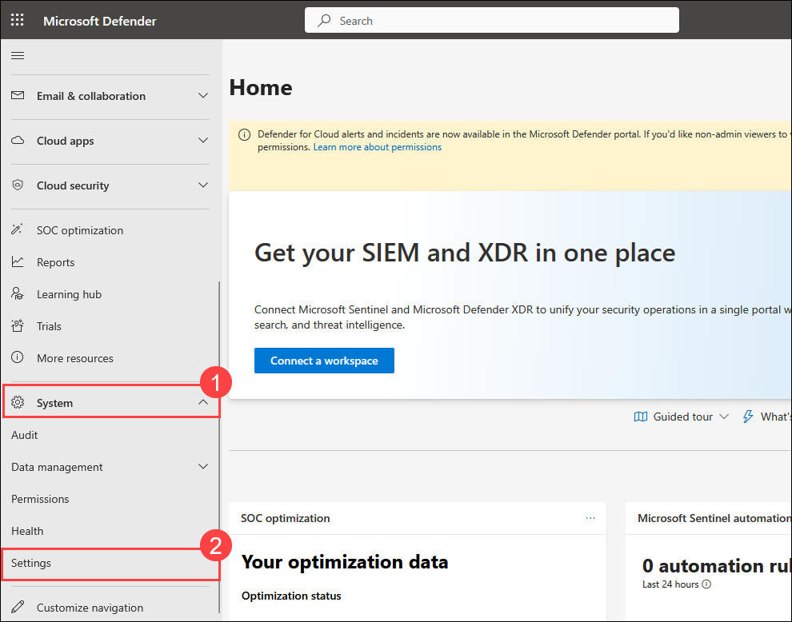

1. On the **Settings** page, select **Device discovery**. 

    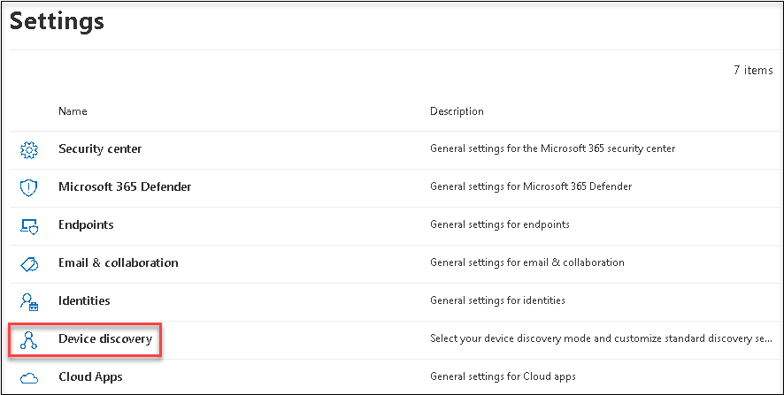

    >**Note:** If you do not see the **Device discovery** option under **Settings**, log out by selecting the top-right circle with your account initials and clicking **Sign out**. Other options to try include refreshing the page with **Ctrl+F5**, waiting for **30-45 minutes**, or opening the page in **InPrivate** mode. Then, log in again with your **Tenant Email** credentials.

    >**Note:** If the option is still not visible after trying these steps, it may be an issue with the Defender portal. In that case, please contact Cloudlabs-Support@spektrasystems.com for assistance.
    
1. In the Discovery setup make sure **Standard discovery (recommended)** is selected. 

    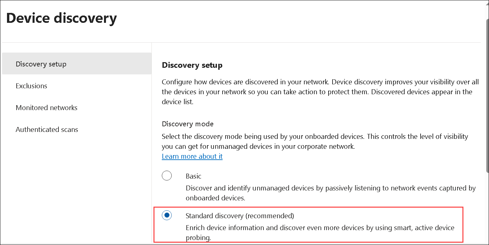

    >**Hint:** If the option is not visible, try refreshing the page.
    
### Task 2: Onboard a Device

In this task, you will onboard a device to Microsoft Defender for Endpoint using an onboarding script.

1. In the Microsoft Defender XDR portal, select **Settings (1)** from the left menu bar, then from the Settings page select **Endpoints (2)**.

    

      > **Note:** The **Endpoints** option may take some time to appear under **Settings**. If it does not show up immediately, wait for a few minutes and refresh the browser before proceeding.

      >**Note:** If the option is still not visible after trying these steps, it may be an issue with the Defender portal. In that case, please contact Cloudlabs-Support@spektrasystems.com for assistance.

1. Select **Onboarding (1)** in the **Device Management** section. In the **Deployment method**, ensure that **Local Script (for up to 10 devices) (2)** is displayed in the drop-down, then click the **Download onboarding package (3)** button. 

    

    >**Note:** You can also onboard devices from the **Assets** section in the left menu bar. Expand **Assets** and select **Devices**. On the **Device Inventory** page, with **Computers & Mobile** selected, scroll down to **Onboard devices.** This will take you to the **Settings > Endpoints** page.

1. Under the **Downloads** pop-up, highlight the **"WindowsDefenderATPOnboardingPackage.zip"** file with your mouse and click the folder icon **Show in folder**.

   >**Hint:** If you don't see it, the file should be located in the **C:\users\admin\downloads** directory.

1. Right-click the downloaded zip file and select **Extract All...**, make sure that **Show extracted files when complete** is checked and select **Extract**.

1. Right-click on the extracted file **WindowsDefenderATPLocalOnboardingScript.cmd** and select **Properties**. Select the **Unblock (1)** checkbox in the bottom right of the Properties windows and select **OK (2)**.

   

1. Right-click on the extracted file **WindowsDefenderATPLocalOnboardingScript.cmd** again and choose **Run as administrator**.
    
1. When the "User Account Control" window is shown, select **Yes** to allow the script to run and answer **Y** to the question presented by the script and press **Enter**. When complete you should see a message in the command screen that says **Successfully onboarded machine to Microsoft Defender for Endpoint**.

1. Press any key to continue. This will close the **Command Prompt** window.

   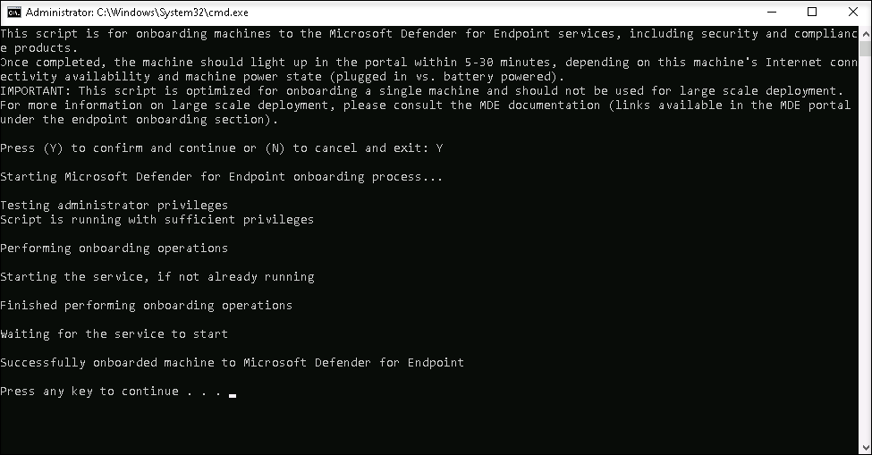

### Task 3: Configure Roles

In this task, you will configure roles for use with device groups.

1. Naviagte back to **Azure Portal**.

1. In the Search bar of the Azure portal, type **Entra ID (1)**, then select **Microsoft Entra ID (2)**.

   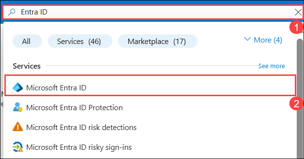
   
1. Select **Groups**.

    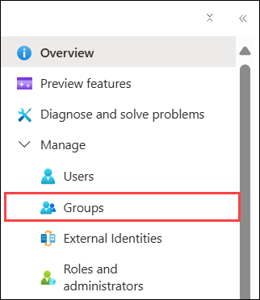

1. Then click on **New group**.

   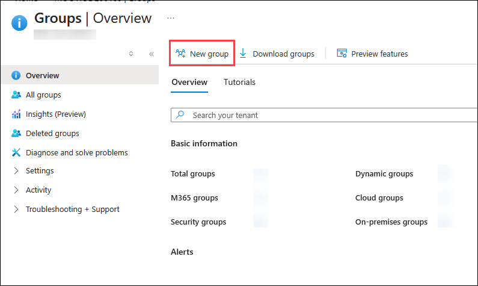

1. Enter the below details for the New group page:

    |Setting|Value|
    |---|---|
    |Group Type| **Microsoft 365 (1)**  |
    |Group Name| **Sg-IT (2)**  |

   

1. Click on **No owners selected (1)** and select the **ODL_user <inject key="DeploymentID" enableCopy="false"/>** from the list and then click on **Select**.

   

1. Click on **No members selected** and select the **ODL_user <inject key="DeploymentID" enableCopy="false"/>** from the list and then click on **Select**.

   >**Note**: Make sure you have selected **Group type** as **Microsoft 365**.

1. On the **New group** page, select **Create**.

   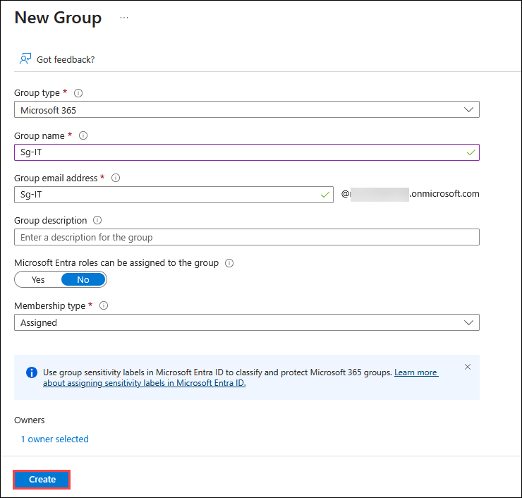

1. Navigate to the [Microsoft Defender XDR portal](https://security.microsoft.com/), select **Settings (1)** from the left menu bar, and then select **Microsoft Defender XDR (2)**.  

   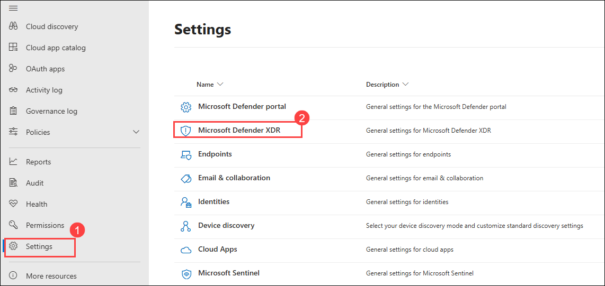  

1. On the **Microsoft Defender XDR** page, select **Permissions and roles (1)** then locate **Active** then toggle the **Status** slider to the right to turn it **On (2)** and click **Go to Permissions and roles (3)**.  

   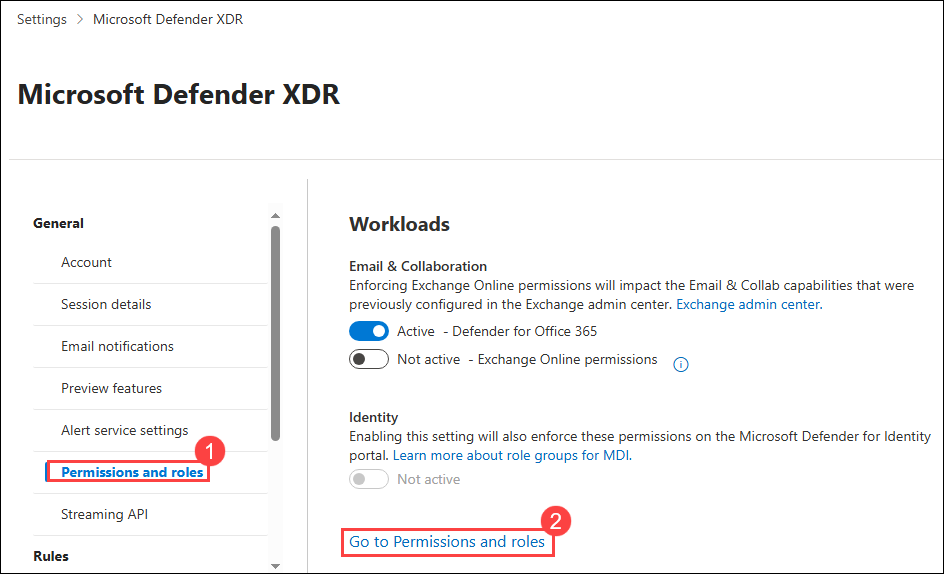  

1. On the **Permissions and roles** page, select **+ Create Custom role**.  

   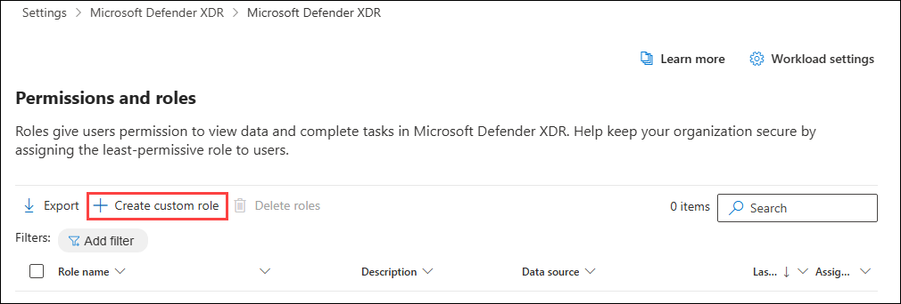  

1. On the **Set up the basics** page, enter **Tier 1 Support (1)** for the Role name and click **Next (2)**. 
 
   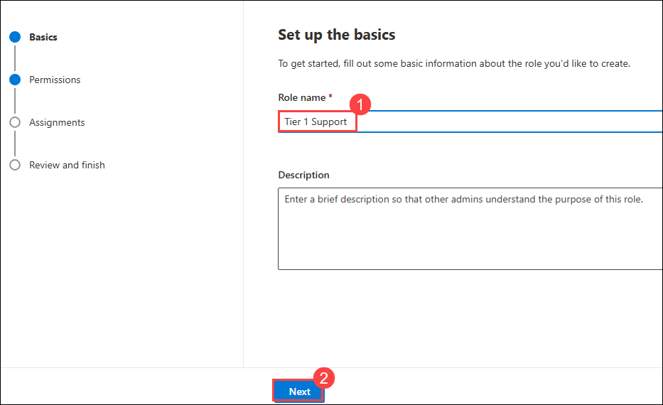  

1. On the **Choose permissions** page, select **Security operations (1)** under the permission group, choose **Select custom permissions (2)**, select **Select custom permissions (3)** under **Security data**, choose **Advanced live response (manage) (4)**, and click **Apply (5)**.

   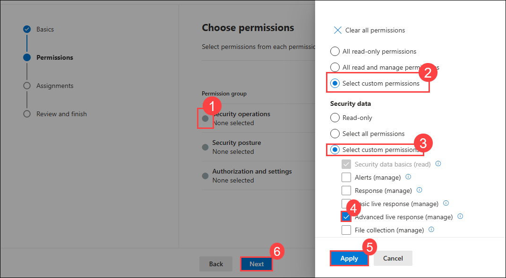

1. Select **Next (6)**.

1. On the **Assign users and data sources** page, select **+ Add assignment**:

   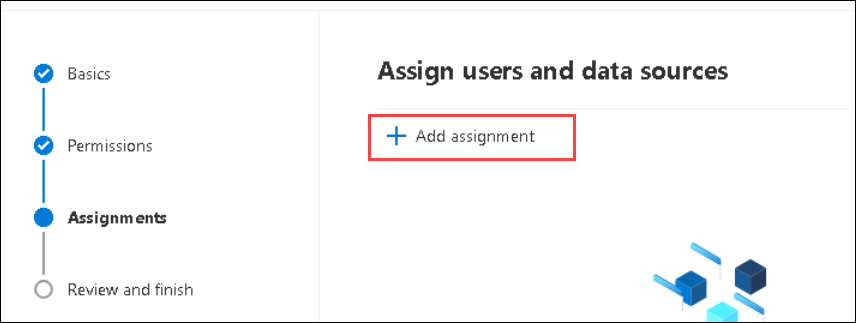
   
1. Provide the below details and click on **Add (4)**

   |Settings | Value|
   |----------|-------|
   |Assignment name | **Support Assistant (2)** |
   |Employees | Search and select **Sg-IT (3)** |
   |Data sources | **Keep Default (4)**|

   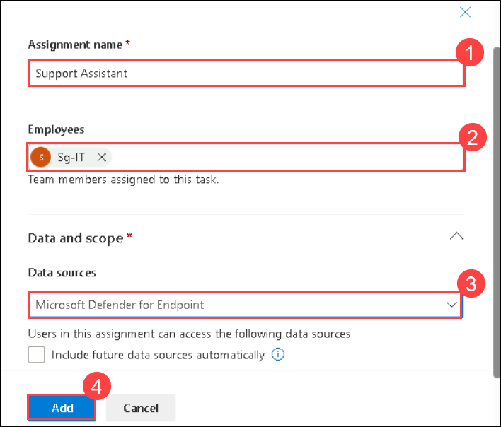

1. Select **Next (6)**

1. On the **Review and finish** page, select **Submit**.

   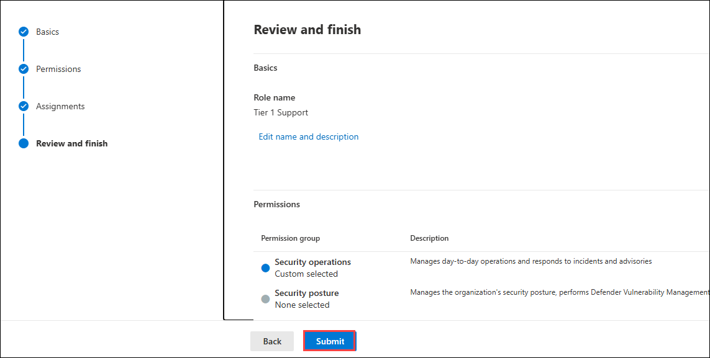

1. Select **Done**

   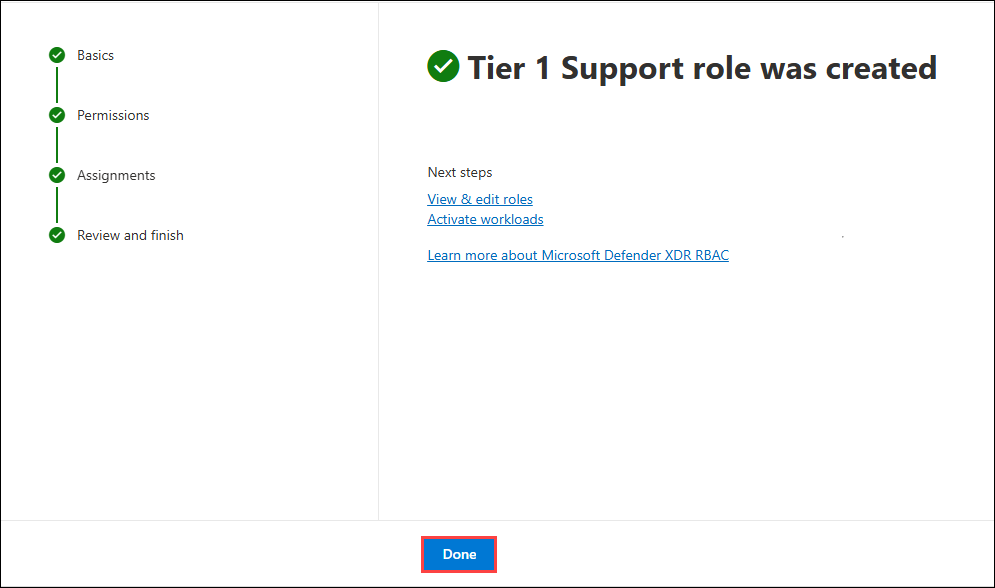

### Task 4: Configure Device Groups

In this task, you will configure device groups that allow for access control and automation configuration.

1. In the Microsoft Defender XDR portal select **Settings** from the left menu bar, then select **Endpoints**. 

1. Select **Device groups** under the permissions area.

1. Select **+ Add device group** icon.

   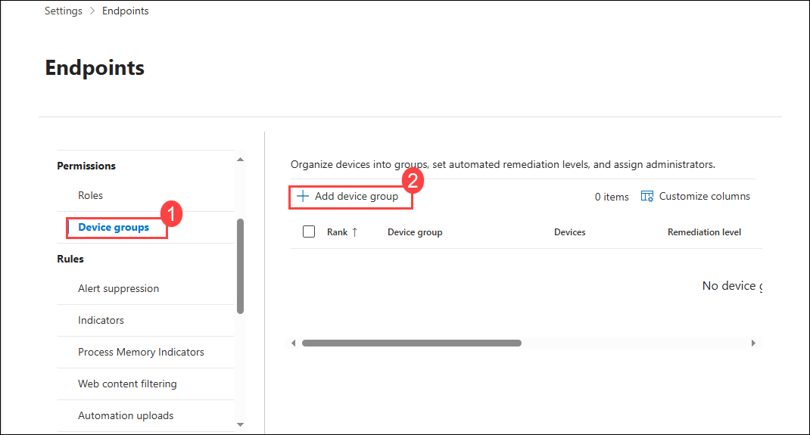

1. Enter the following information on the General tab:

    |General setting|Value|
    |---|---|
    |Device group name| Enter **Regular (1)**|
    |Remediation level| Select **Full-remediate (2)**|

   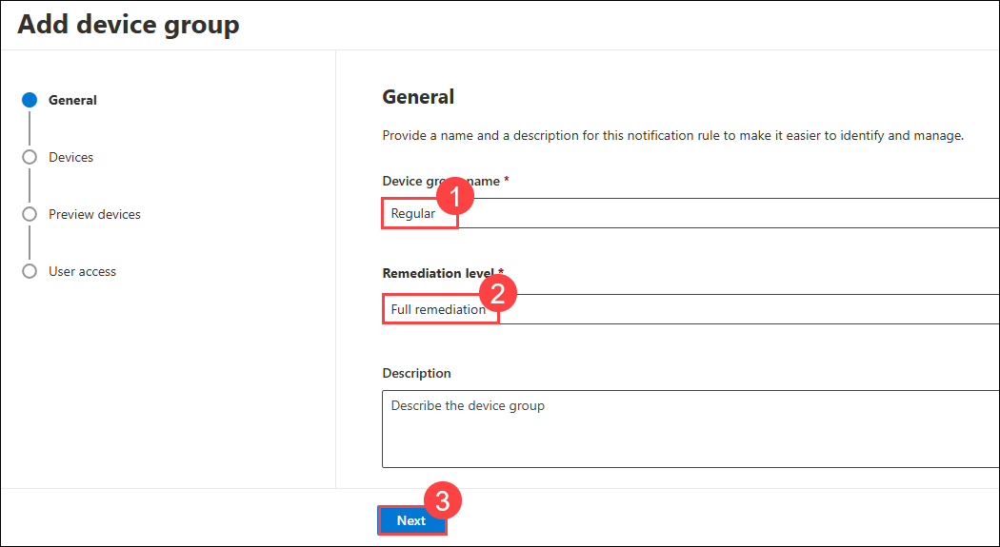

1. On the **Device groups** page, select **Next (3)** to proceed.

1. On the Devices tab, for the OS condition select **Windows server 2022 (1)** and select **Next (2)**.

   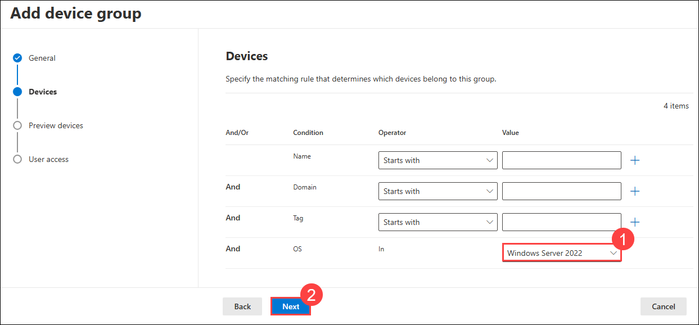

1. On the **Preview devices** tab, the **Show preview (1)** button could show the **labvm (2)** virtual machine, but most likely the data isn't populated yet. select **Next (3)**.

   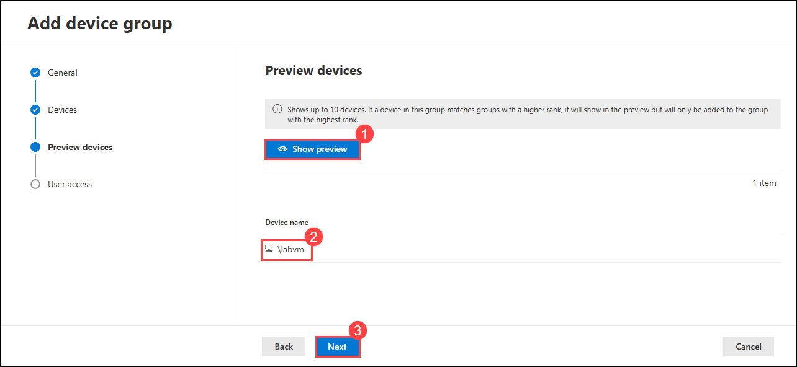

1. For the User access tab, select **sg-IT (1)** and then select **Add selected groups (2)** button. Make sure it appears under **Azure AD user groups with access to this device group**.

   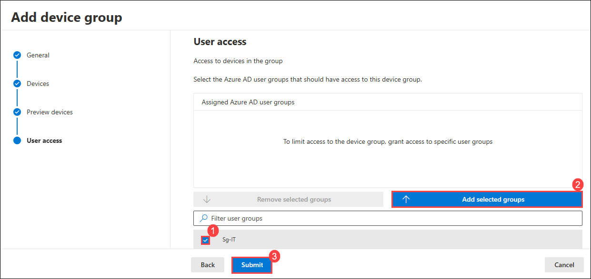

   >**Note:** If you're unable to select the **sg-IT** group and prompted with the message **"Go to Roles settings to define one,"** click on the **Go to Roles settings to define one** link to proceed and follow below steps:

    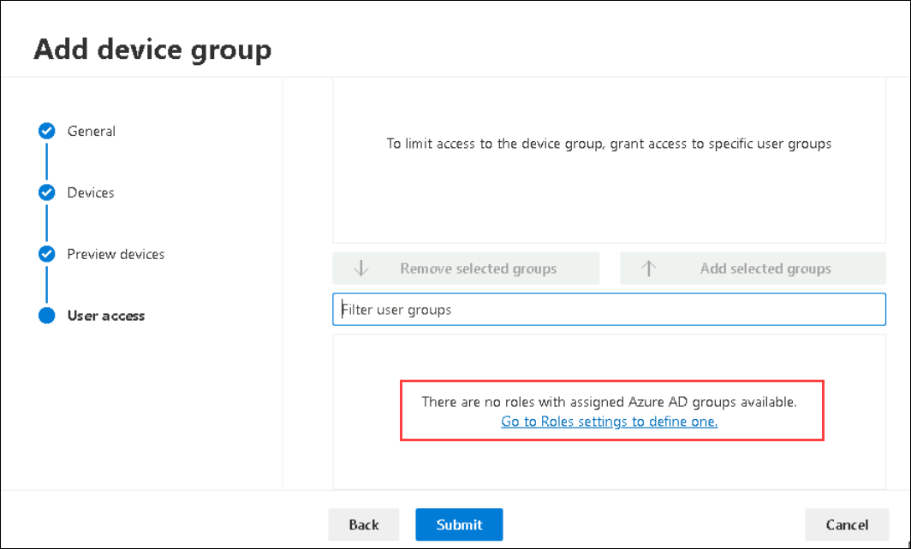

    - On the **Discard changes** pop-up select **Discard**.

      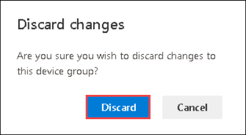
    
    - You will be redirected to the **Roles** tab. Click **Turn On roles**, then wait for 5–10 minutes. After that, refresh the page and restart **Task 4** from the beginning.

      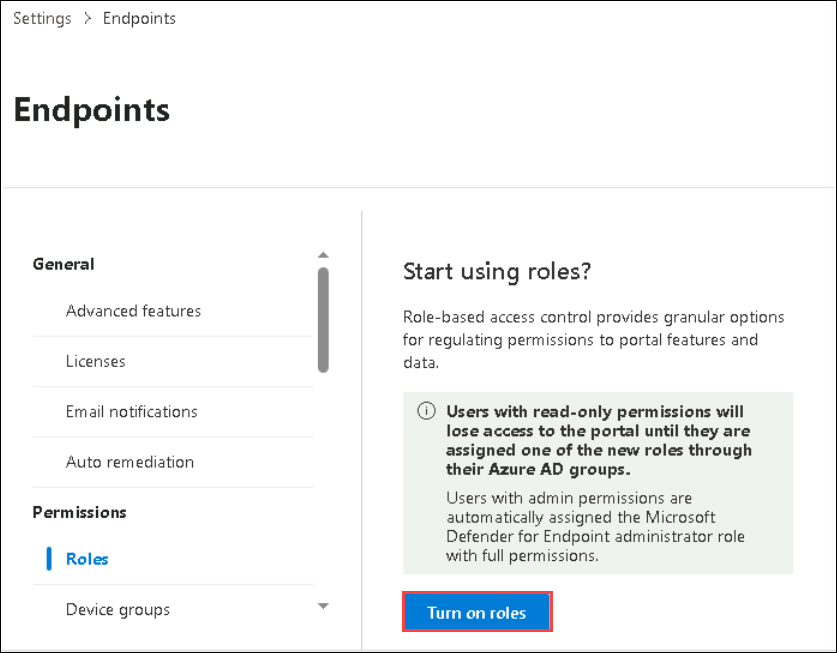

1. Click on **Submit (3)**, then click on **Done**.

1. Device group configuration has changed. Select **Apply changes** to check matches and recalculate groupings.

   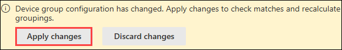

1. You are going to have two device groups now; the **Regular** you just created and the **Ungrouped devices (default)** with the same remediation level.

   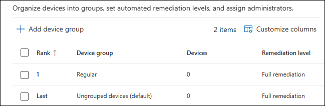

### Review
In this lab, you have completed the following:
- Prepared the Microsoft Defender XDR workspace
- Initialized Microsoft Defender for Endpoint
- Onboarded a Device
- Configured Roles
- Configured Device Groups

## Select **Next** to continue to Exercise 2
