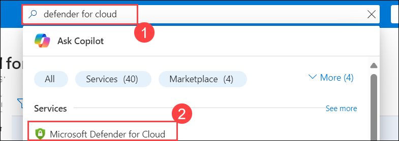
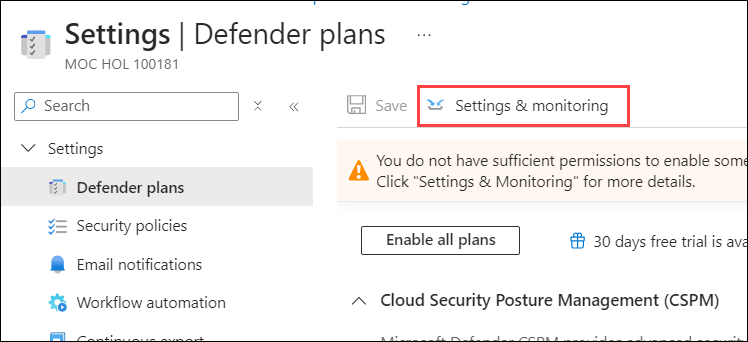

# Module 5 - Lab 1 - Exercise 1 - Enable Microsoft Defender for Cloud

## Lab scenario

You're a Security Operations Analyst working at a company that is implementing cloud workload protections with Microsoft Defender for Cloud. In this lab, you enable Microsoft Defender for Cloud.

>**Important:** The lab exercises for Learning Path #5 are in a *standalone* environment. If you exit the lab before completing it, you will be required to re-run the configurations again.

### Estimated timing: 15 minutes

### Task 1: Enable Microsoft Defender for Cloud

In this task, you'll enable and configure Microsoft Defender for Cloud.

1. In the Search bar of the Microsoft Azure portal, type *Defender*, then select **Microsoft Defender for Cloud**.

   

1. In the left navigation menu for Microsoft Defender for Cloud, expand the *Management* section , and select **Environment settings**.

   

1. Select the **Expand all** button to view all subscriptions and resources.

1. Select the **MOC Subscription-lodxxxxxxxx** subscription (or equivalent name in your Language).

   

1. Review the Azure resources that are now protected with the Defender for Cloud plans.

    >**Important:** If all Defender plans are *Off*, select **Enable all plans**. Select the *$200/month Microsoft Defender for APIs Plan 1* and then select **Save**. Select **Save** at the top of the page and wait for the *"Defender plans (for your) subscription were saved successfully!"* notifications to appear.

1. Select the **Settings & monitoring** tab from the Settings area (next to Save).

    

1. Review the monitoring extensions. It includes configurations for Virtual Machines, Containers, and Storage Accounts.

1. Close the "Settings & monitoring" page by selecting the 'X' on the upper right of the page.

   

1. Close the settings page by selecting the 'X' on the upper right of the page to go back to the **Environment settings**.

<!---1. Select the Log analytics workspace you created earlier *uniquenameDefender* to review the available options and pricing.

1. Select **Enable all plans** (to the right of Select Defender plan) and then select **Save**. Wait for the *"Microsoft Defender plan for workspace uniquenameDefender were saved successfully!"* notification to appear.

    >**Note:** If the page is not being displayed, refresh your Edge browser and try again.

1. Close the Defender plans page by selecting the 'X' on the upper right of the page to go back to the **Environment settings**. --->

### Task 3: Understanding the Microsoft Defender for Cloud Dashboard

1. In the Search bar of the Microsoft Azure portal, type *Defender*, then select **Microsoft Defender for Cloud**.

1. In the left navigation menu for Microsoft Defender for Cloud, under the *General* section, select **Overview**.

   

1. The Overview blade provides a unified view into the security posture and includes multiple independent cloud security pillars such as Security posture, Regulatory compliance, Workload protections, Firewall Manager, Inventory, and Information Protection (preview). Each of these pillars also has its dedicated dashboard allowing deeper insights and actions around that vertical, providing easy access and better visibility for security professionals.

    >**Note:** The top menu bar allows you to view and filter subscriptions by selecting the Subscriptions button. In this lab, we will use only one but selecting different/additional subscriptions will adjust the interface to reflect the security posture of the selected subscriptions

1. Click on the **What’s new** icon link – a new tab opens with the latest release notes where you can stay current on the new features, bug fixes, and more.

    

    >**Note:** The high-level numbers at the top menu; This view allows you to see a summary of your subscriptions, active recommendations, and security alerts alongside connected cloud accounts.

1. From the top menu bar, select **Azure subscriptions**. This will bring you into the environment settings where you can select from the available subscriptions.

   

1. Return to the **Overview** page, and review the **Security posture** tile. You can see your current *Secure score* along with the number of completed controls and recommendations. Selecting this tile will redirect you to a drill-down view across subscriptions.

1. On the **Regulatory compliance** tile, you can get insights into your compliance posture based on continuous assessment of both Azure and hybrid cloud environments. This tile shows the following standards which are Microsoft Cloud Security benchmark, and Lowest compliance regulatory standard. To view the data we first need to add Security policies.

   

1. Selecting this tile will redirect you to the **Regulatory compliance** dashboard – where you can add additional standards and explore the current ones.

1. We will continue exploring *Microsoft Defender for Cloud* **Security posture** and **Regulatory compliance** in the next exercise.

## Proceed to Exercise 2
