# Module 5 - Lab 1 - Exercise 2 - Mitigate threats using Microsoft Defender for Cloud

## Lab Scenario

You're a Security Operations Analyst working at a company that implemented Microsoft Defender for Cloud. You need to respond to security alerts generated by Microsoft Defender for Cloud.

>**Important:** The lab exercises for Learning Path #5 are in a *standalone* environment. If you exit the lab before completing it, you will need to re-run the configurations.

## Lab Objectives

In this lab, you will perform the following:
- Task 1: Explore Regulatory Compliance
- Task 2: Explore Security Recommendations
- Task 3: Mitigate security alerts
  
## Estimated Timing: 20 minutes

## Architecture Diagram

  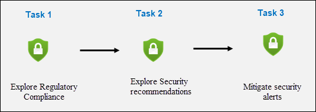
  
### Task 1: Explore Regulatory Compliance

In this task, you will load sample security alerts and review the alert details.  

1. In the Search bar of the Microsoft Azure portal, type **Defender for Cloud (1)**, then select **Microsoft Defender for Cloud (2)**.

   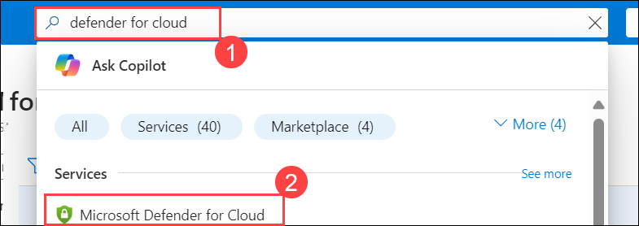

1. Under *Cloud Security (1)*, select **Regulatory compliance (2)** from the left menu items.

    >**Note:** You may need to refresh this page if you do not see the *toolbar* tabs.

   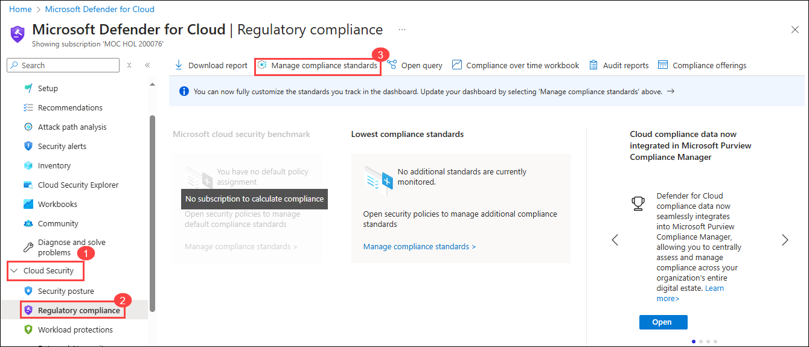

1. Select **Manage compliance standards (3)** on the toolbar.

1. Select your **Subscription**.

   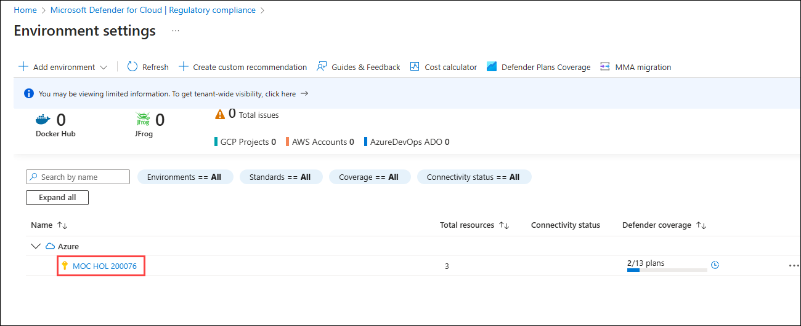

1. Under *Settings*, select **Security policies (1)** in the portal menu.

   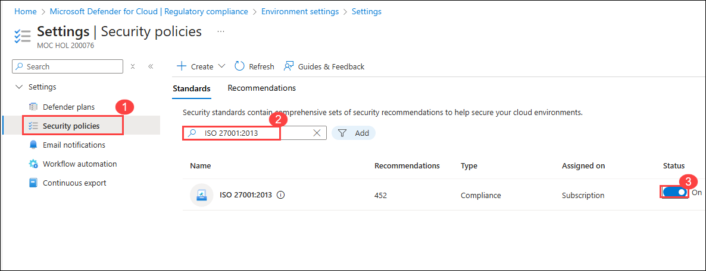

1. Scroll down and review the "Security standards" available to you by default.

1. Use the search box to find *ISO 27001:2013 (2)*.

1. Select and move the **Status** slider to right of *ISO 27001:2013* to **On (3)**.

    >**Note:** Some standards require you to assign an Azure Policy initiative.

1. Select **Refresh** on the page menu to confirm that *ISO 27001:2013* is set to *On* for your subscription.

1. Close the *Security policies* page by selecting the 'X' on the upper right of the page to go back to the **Environment settings**.

    >**Note:** You might want to return later to *Regulatory compliance* to review the new standard controls and recommendations.

### Task 2: Explore Security Recommendations (Read-Only)

In this task, you'll review cloud security posture management.  The Secure Score information can take 24 hours to recalculate. It's recommended to do this task again in 24 hours.

1. Under *Cloud Security*, select **Security posture** from the left menu items.

   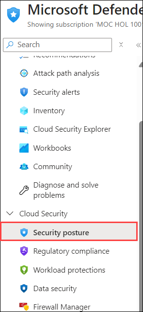

1. The *Secure score* defaults to the *Azure environment*.

1. Under the *Environment* tab, select **View recommendations >** link.

   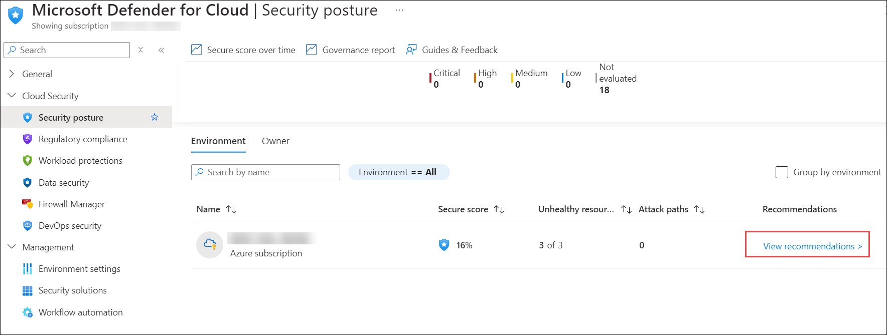

1. Select **Add filter** and then select **Resource type**.

   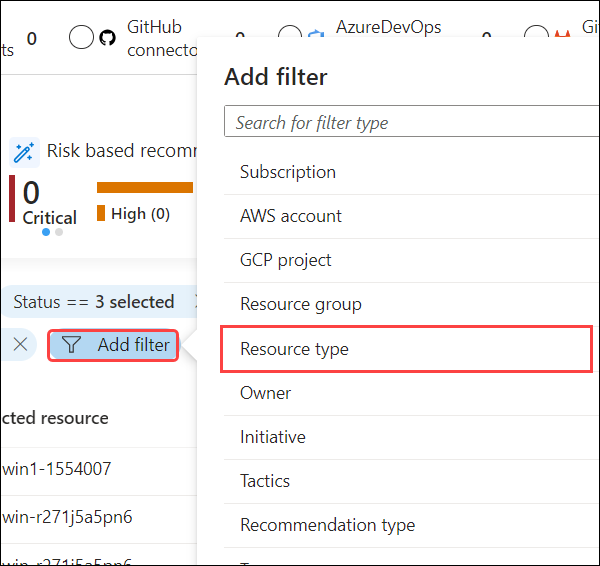

1. Select the **Machines - Azure Arc** checkbox and then select the **Apply** button.

   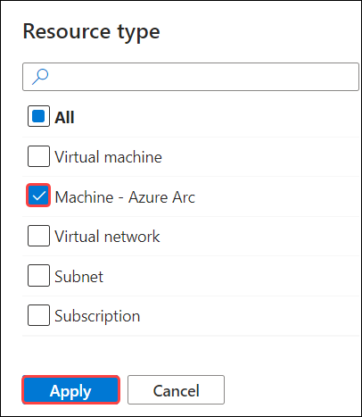

    >**Note:** It may take some time for the **Machines - Azure Arc** to appear.

1. Select any recommendation where the status isn't **Completed**.

1. Review the recommendation and in the **Take action** tab scroll down to **Delegate** and select **Assign owner & set due date**.

   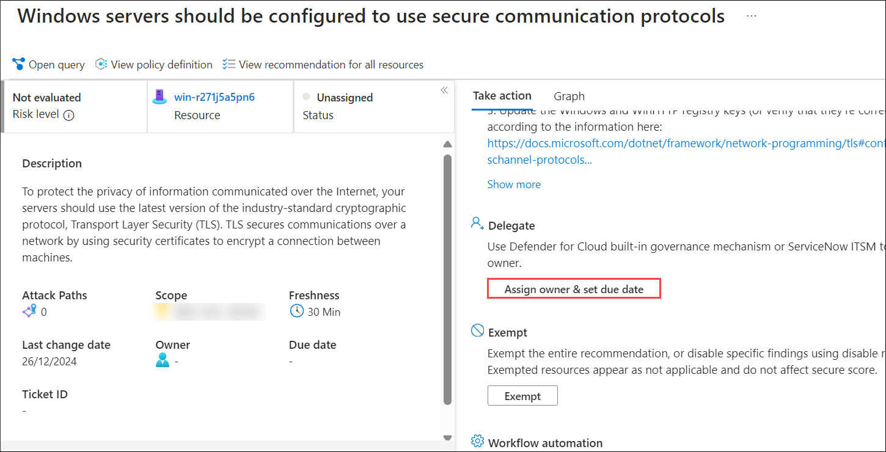

1. In the **Create assignment** window, leave *Type* set to **Defender for Cloud** and expand the **Assignment details**.

   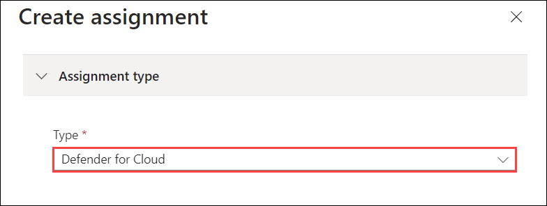

1. In the `Set owner` *Email address* box, enter **<inject key="AzureAdUserEmail"></inject>** . 

1. Explore the *Set remediation timeframe* and *Set email notifications* options and select **Create (2)**.

   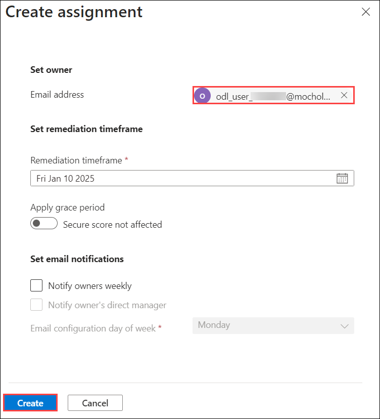

   >**Note:** If you see the error **Failed to create requested assignments**, try again later.

1. Close the recommendation page by selecting the 'X' on the upper right of the window.

### Task 3: Mitigate security alerts

In this task, you'll load sample security alerts and review the alert details.

1. Under **General**, select **Security alerts** in the portal menu.

1. Select **Sample alerts** from the command bar. **Hint:** you may need to select the ellipsis (...) button from the command bar.

   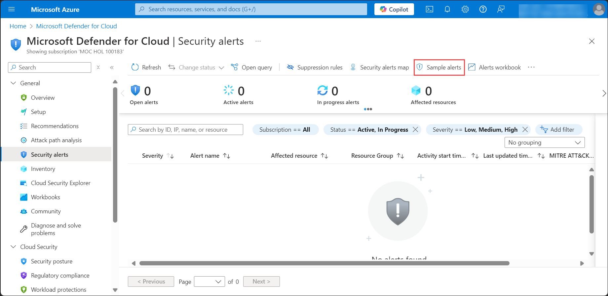

1. In the Create sample alerts (Preview) pane make sure your subscription is selected and that all sample alerts are selected in the *Defender for Cloud plans* area.

1. Select **Create sample alerts**.  

    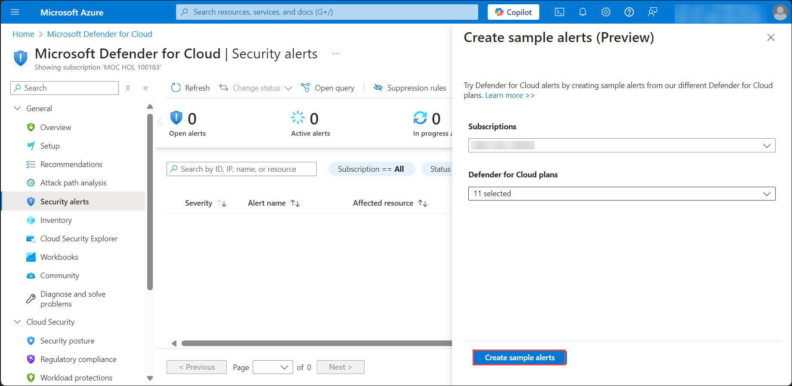

    >**Note:** This sample alert creation process may take a few minutes to complete, wait for the *"Successfully created sample alerts"* notification.

1. Once completed, select **Refresh** (if needed) to see the alerts appear under the *Security alerts* area.

1. Choose an interesting alert with a *Severity* of *High* and perform the following actions:

   - Select the alert checkbox and the alert detail pane should appear. Select **View full details**.

      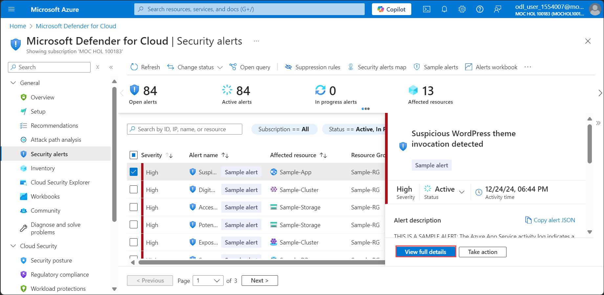

   - Review and read the *Alert details* tab.

   - Select the **Take action** tab..

      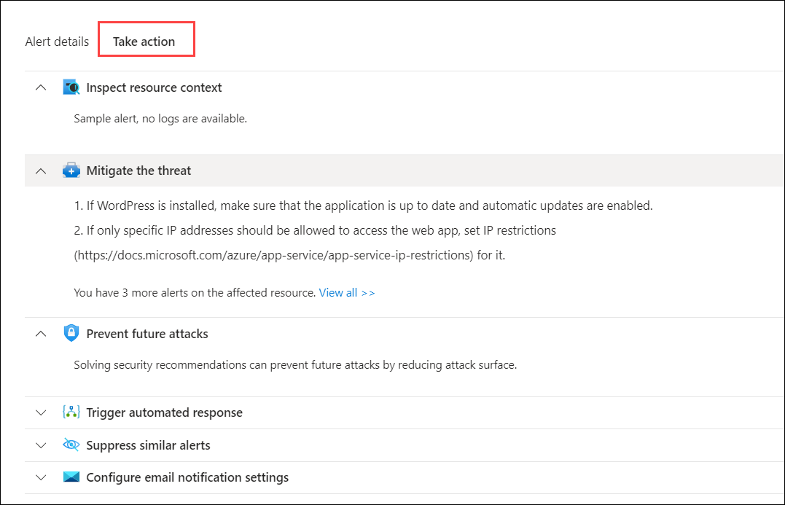

   - Review the *Take action* information. Notice the sections available to take action depending on the type of alert: Inspect resource context, Mitigate the threat, Prevent future attacks, Trigger automated response and Suppress similar alerts.

## Review

In this lab, you have completed the following:

- Explored Regulatory Compliance
- Explored Security posture and recommendations
- Mitigated security alerts

## You have successfully completed the lab
