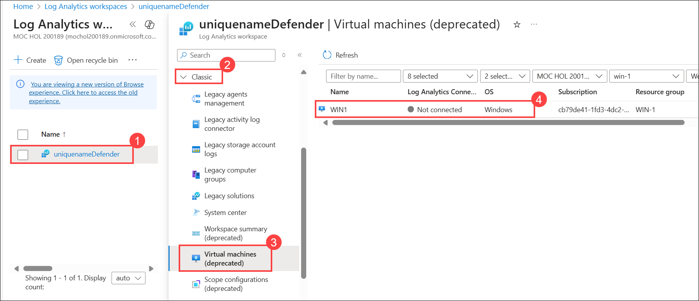
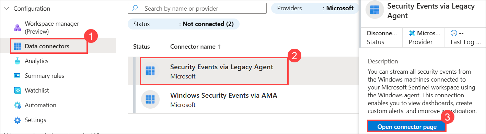
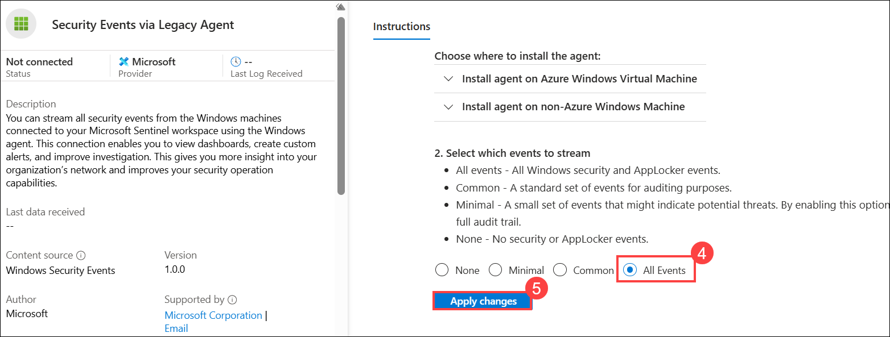
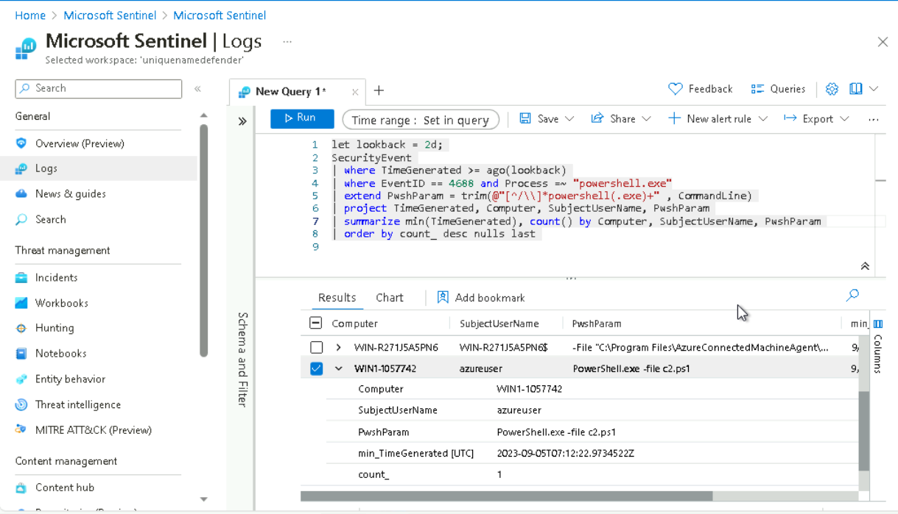
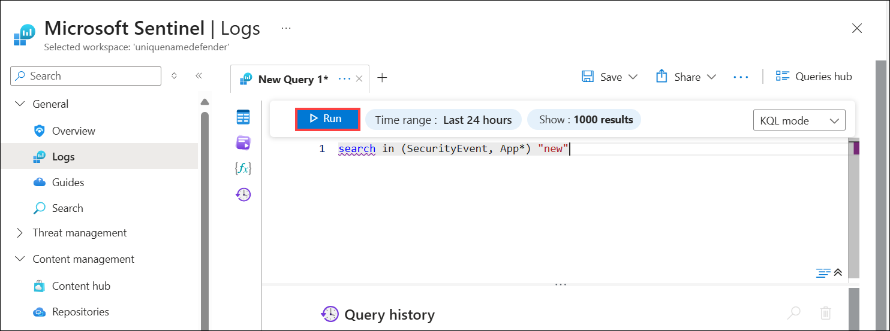

# Lab 06 - Exercise 1: Create queries for Microsoft Sentinel using Kusto Query Language (KQL)

## Lab Scenario
You are a Security Operations Analyst working at a company that is implementing Microsoft Sentinel. You are responsible for performing log data analysis to search for malicious activity, display visualizations, and perform threat hunting. To query log data, you use the Kusto Query Language (KQL).

>**Important:** This lab involves entering many KQL scripts into Microsoft Sentinel. The scripts were provided in a file at the beginning of this lab. An alternate location to download them is:  https://github.com/MicrosoftLearning/SC-200T00A-Microsoft-Security-Operations-Analyst/tree/master/Allfiles

## Lab Objectives

 In this lab, you will perform the following:

- Task 1: Create a Log Analytics Workspace
- Task 2: Initialize the Microsoft Sentinel Workspace.
- Task 3: Run Basic KQL Statements
- Task 4: Analyze Results in KQL with the Summarize Operator
- Task 5: Create visualizations in KQL with the Render Operator
- Task 6: Build multi-table statements in KQL
- Task 7: Work with string data in KQL

## Estimated Timing: 90 Minutes

## Architecture Diagram

  

### Task 1: Create a Log Analytics Workspace

In this task, you will create a Log Analytics workspace for use with Microsoft Defender for Cloud.

1. In the Search bar of the Azure portal, type **Log Analytics (1)**, then select **Log Analytics workspaces (2)**.

   

1. Select **+ Create** from the command bar.

   

1. To create a **log analytics workspace**, follow these steps:

    - Select **Create new** under Resource Group and provide the name **RG-Defender (1)**. Select **Ok**.
    - For the Name, enter **uniquenameDefender (2)**.
    - Leave the **default Region (3)**.
    - Select **Review + Create (4)**.

      

1. Once the workspace validation has passed, select **Create**.

   

1. Wait for the new workspace to be provisioned, this may take a few minutes.

> **Congratulations** on completing the task! Now, it's time to validate it. Here are the steps:
> - Hit the Validate button for the corresponding task. You can proceed to the next task if you receive a success message.
> - If not, carefully read the error message and retry the step, following the instructions in the lab guide.
> - If you need any assistance, please contact us at cloudlabs-support@spektrasystems.com. We are available 24/7 to help you out.

  <validation step="8edea4c7-f6fb-4714-9021-fcf6b6942abe" />

### Task 2: Initialize the Microsoft Sentinel Workspace.

In this task, you will set up a Microsoft Sentinel workspace within the Azure portal. This workspace will be the foundation for monitoring, detecting, and responding to security threats.

1. In the Search bar of the Azure portal, type **microsoft sentinel (1)**, then select **Microsoft Sentinel (2)**.

   

1. Click on **+ Create**.  

    

1. Next, in Add Microsoft Sentinel to a workspace page.

1. Select your existing  **log analytics workspace (1)** that was created in the previous task, then select **Add (2)**. This could take a few minutes.

   

1. In the Microsoft Sentinel free trial activated tab, select **Ok**.

    

### Task 3: Run Basic KQL Statements

In this task, you will build basic KQL statements.

   > **Important:** For each query, clear the previous statement from the Query Window or open a new Query Window by selecting **+** after the last opened tab (up to 25).

1. Navigate to the **Log Analytics workspace (1)** created in the earlier step, expand **Classic (2)**, select the **Virtual machine (deprecated) (3)** option, and on the right of the screen, click on the **WIN1 (4)** virtual machine displayed.
   
   

1. Click on **Connect**. wait for the virtual machine status to change to **Connected**

   

1. Navigate back to the **Microsoft Sentinel** page, from the left navigation menu, scroll down to the **Content management (1)** section and select **Content Hub (2)**.

   

    > **Note:** If the **Content hub** page does not load, refresh the browser until it appears.

1. Search for **Windows Security Events (1)** from the search bar and select **Windows Security Events (2)**, Click on **Install(3)** on the right navigation page that shows up.

   

1. From the left navigation pane, click on **Data connectors (1)** under the **Configuration** section.

1. Select the **Security Events via Legacy Agent (2)** Connector and click on **open connector page (3), scroll down look for **Select which events to stream** Select the **All events (4)** radio button and click on **Apply Changes (5)**.

    

    

   >**Note**: Please wait for at least 5 minutes for the data connector status to update to **Connected**

1. Go to Sentinel, click on **Logs (1)**. Close **(2)** all the pop-ups if they appear.

   

   >**Note:** You may encounter situations where some queries below may not work as expected. If needed, refer to the **lab guide** sometimes, the **connector** may take time to reach the desired state, affecting query execution. Your patience and understanding are greatly appreciated.


1. The following statement demonstrates **search** across tables listed within the **in** clause. In the Query Window enter the following statement and select **Run**: 

    ```KQL
    search in (SecurityEvent,App*) "new"
    ```

    

1. Change back the *Time range* to **Last 24 hours** in the Query Window.

1. The following statements demonstrates the **where** operator, which filters on a specific predicate. In the Query Window enter the following statement and select **Run**: 

    >**Important:** Select **Run** after entering each query from the code blocks below.

    ```KQL
    SecurityEvent  
    | where TimeGenerated > ago(1h)
    ```

    >**Note:** The **Time range** now displays **Set in query** because we are filtering using the **TimeGenerated** column.

    ```KQL
    SecurityEvent  
    | where TimeGenerated > ago(1h) and EventID == 4624
    ```

    ```KQL
    SecurityEvent  
    | where TimeGenerated > ago(1h)
    | where EventID == 4673 
    | where AccountType =~ "user"
    ```

    ```KQL
    SecurityEvent  
    | where TimeGenerated > ago(1h) and EventID in (4624, 4625)
 
    ```

1. The following statement demonstrates the use of the **let** statement to declare a *dynamic list*. In the Query Window enter the following statement and select **Run**: 

    ```KQL
    let suspiciousAccounts = datatable(account: string) [
      @"NA\timadmin", 
      @"NT AUTHORITY\SYSTEM"
    ];
    SecurityEvent  
    | where TimeGenerated > ago(1h)
    | where Account in (suspiciousAccounts)
    ```

    >**Tip:** You can easily reformat the query by selecting the **ellipsis (...)** in the Query window and then clicking **Format query**.

1. Change the **Time range** to **Last hour** in the Query Window. This will limit our results for the following statements.

1. The following statement demonstrates the **extend** operator, which creates a calculated column and adds it to the result set. In the Query Window enter the following statement and select **Run**: 

    ```KQL
    SecurityEvent  
    | where TimeGenerated > ago(1h) 
    | where ProcessName != "" and Process != "" 
    | extend StartDir =  substring(ProcessName,0, string_size(ProcessName)-string_size(Process))
    ```

1. The following statement demonstrates the **order by** operator, which sorts the rows of the input table by one or more columns in ascending or descending order. The **order by** operator is an alias to the **sort by** operator. In the Query Window enter the following statement and select **Run**: 

    ```KQL
    SecurityEvent  
    | where TimeGenerated > ago(1h) 
    | where ProcessName != "" and Process != "" 
    | extend StartDir =  substring(ProcessName,0, string_size(ProcessName)-string_size(Process)) 
    | order by StartDir desc, Process asc
    ```

1. The following statements demonstrate the **project** operator, which selects the columns to include in the order specified. In the Query Window enter the following statement and select **Run**: 

    ```KQL
    SecurityEvent  
    | where TimeGenerated > ago(1h) 
    | where ProcessName != "" and Process != "" 
    | extend StartDir =  substring(ProcessName,0, string_size(ProcessName)-string_size(Process)) 
    | order by StartDir desc, Process asc 
    | project Process, StartDir
    ```

1. The following statements demonstrate the **project-away** operator, which selects the columns to exclude from the output. In the Query Window enter the following statement and select **Run**: 

    ```KQL
    SecurityEvent  
    | where TimeGenerated > ago(1h) 
    | where ProcessName != "" and Process != "" 
    | extend StartDir =  substring(ProcessName,0, string_size(ProcessName)-string_size(Process)) 
    | order by StartDir desc, Process asc 
    | project-away ProcessName
    ```

### Task 4: Analyze Results in KQL with the Summarize Operator

In this task, you will build KQL statements to aggregate data. Summarize groups the rows according to the by group columns, and calculates aggregations over each group.

1. The following statement demonstrates the **count()** function, which returns a count of the group. In the Query Window enter the following statement and select **Run**: 

    ```KQL
    SecurityEvent  
    | where TimeGenerated > ago(1h) and EventID == 4688  
    | summarize count() by Process, Computer
    ```

1. The following statement demonstrates the **count()** function, but in this example, we name the column as *cnt*. In the Query Window enter the following statement and select **Run**: 

    ```KQL
    SecurityEvent  
    | where TimeGenerated > ago(1h) and EventID == 4624  
    | summarize cnt=count() by AccountType, Computer
    ```

1. The following statement demonstrates the **dcount()** function, which returns an approximate distinct count of the group elements. In the Query Window enter the following statement and select **Run**: 

    ```KQL
    SecurityEvent  
    | where TimeGenerated > ago(1h)
    | summarize dcount(IpAddress)
    ```

1. The following statements demonstrate the importance of understanding results based on the order of the *pipe*. In the Query Window enter the following queries and run each query separately: 

    1. **Query 1** returns the most recent SecurityEvent record per account, and then filters those results to show only records where EventID == 4673, which represents:

        ```KQL
        SecurityEvent  
        | summarize arg_max(TimeGenerated, *) by Account 
        | where EventID == 4673 
        ```

    1. **Query 2** first filters for only privileged service call events (EventID 4673), then returns the most recent one per account.

        ```KQL
        SecurityEvent  
        | where EventID == 4673
        | summarize arg_max(TimeGenerated, *) by Account
        ```

    >**Note:**  You can review **Total CPU** and **Data used for processed query** by selecting the **Query details** link in the lower right and comparing the data between both statements.

1. The following statement demonstrates the **make_list()** function, which returns a *list* of all the values within the group. This KQL query will first filter the EventID with the where operator. Next, for each Computer, the results are a JSON array of Accounts. The resulting JSON array will include duplicate accounts. In the Query Window enter the following statement and select **Run**: 

    ```KQL
    SecurityEvent  
    | where TimeGenerated > ago(1h)
    | where EventID == 4624  
    | summarize make_list(Account) by Computer
    ```

1. The following statement demonstrates the **make_set()** function, which returns a set of *distinct* values within the group. This KQL query will first filter the EventID with the where operator. Next, for each Computer, the results are a JSON array of unique Accounts. In the Query Window enter the following statement and select **Run**: 

    ```KQL
    SecurityEvent  
    | where TimeGenerated > ago(1h)
    | where EventID == 4624  
    | summarize make_set(Account) by Computer
    ```

### Task 5: Create visualizations in KQL with the Render Operator

In this task, you will use generate visualizations with KQL statements.

1. The following statement demonstrates the **render** operator (which renders results as a graphical output), using a **barchart** visualization. In the Query Window enter the following statement and select **Run**: 

    ```KQL
    SecurityEvent  
    | where TimeGenerated > ago(1h)
    | summarize count() by Account
    | render barchart
    ```

1. The following statement demonstrates the **render** operator visualizing results with a time series. The **bin()** function rounds all values in a timeframe and groups them, used frequently in combination with **summarize**. If you have a scattered set of values, the values are grouped into a smaller set of specific values. Combining the generated results and pipe them to a **render** operator with a **timechart** provides a time series visualization. In the Query Window enter the following statement and select **Run**: 

    ```KQL
    SecurityEvent  
    | where TimeGenerated > ago(1h)
    | summarize count() by bin(TimeGenerated, 1m)
    | render timechart
    ```
    > **Congratulations** on completing the task! Now, it's time to validate it. Here are the steps:
    > - Hit the Validate button for the corresponding task. You can proceed to the next task if you receive a success message.
    > - If not, carefully read the error message and retry the step, following the instructions in the lab guide.
    > - If you need any assistance, please contact us at cloudlabs-support@spektrasystems.com. We are available 24/7 to help you out.

   <validation step="43dbc561-34b3-4571-b014-c5b7d09e1b40" />

### Task 6: Build multi-table statements in KQL

In this task, you will build multi-table KQL statements.

1. Change the **Time range** to **Last hour** in the Query Window. This will limit our results for the following statements.

1. The following statement demonstrates the **union** operator, which takes two or more tables and returns all their rows. Understanding how results are passed and impacted with the pipe character is essential. In the Query Window enter the following statements and select **Run** for each query separately to see the results: 

    1. **Query 1** will return all rows of SecurityEvent and all rows of SigninLogs.

        ```KQL
        SecurityEvent  
        | union SigninLogs  
        ```

    1. **Query 2** will return one row and column, which is the count of all rows of SigninLogs and all rows of SecurityEvent.

        ```KQL
        SecurityEvent  
        | union SigninLogs  
        | summarize count() 
        ```

    1. **Query 3** will return all rows of SecurityEvent and one (last) row for SigninLogs. The last row for SigninLogs will have the summarized count of the total number of rows.

        ```KQL
        SecurityEvent  
        | union (SigninLogs | summarize count() | project count_)
        ```

    >**Note:** The **'empty row'** in the results will display the summarized count of **SigninLogs**.

1. Change back the **Time range** to **Last 24 hours** in the Query Window.

### Task 7: Work with string data in KQL

In this task, you will work with structured and unstructured string fields with KQL statements.

1. The following statement demonstrates the **extract** function, which gets a match for a regular expression from a source string. You have the option to convert the extracted substring to the indicated type. In the Query Window, enter the following statement and select **Run**: 

    ```KQL
    print extract("x=([0-9.]+)", 1, "hello x=45.6|wo") == "45.6"
    ```

1. The following statements use the **extract** function to pull out the Account Name from the Account field of the SecurityEvent table. In the Query Window enter the following statement and select **Run**: 

    ```KQL
    SecurityEvent  
    | where EventID == 4672 and AccountType == 'User' 
    | extend Account_Name = extract(@"^(.*\\)?([^@]*)(@.*)?$", 2, tolower(Account))
    | summarize LoginCount = count() by Account_Name
    | where Account_Name != "" 
    | where LoginCount < 10
    ```

1. The following statement demonstrates the **parse** operator, which evaluates a string expression and parses its value into one or more calculated columns. Use for structuring unstructured data. In the Query Window enter the following statement and select **Run**: 

    ```KQL
    let Traces = datatable(EventText:string)
    [
    "Event: NotifySliceRelease (resourceName=PipelineScheduler, totalSlices=27, sliceNumber=23, lockTime=02/17/2016 08:40:01, releaseTime=02/17/2016 08:40:01, previousLockTime=02/17/2016 08:39:01)",
    "Event: NotifySliceRelease (resourceName=PipelineScheduler, totalSlices=27, sliceNumber=15, lockTime=02/17/2016 08:40:00, releaseTime=02/17/2016 08:40:00, previousLockTime=02/17/2016 08:39:00)",
    "Event: NotifySliceRelease (resourceName=PipelineScheduler, totalSlices=27, sliceNumber=20, lockTime=02/17/2016 08:40:01, releaseTime=02/17/2016 08:40:01, previousLockTime=02/17/2016 08:39:01)",
    "Event: NotifySliceRelease (resourceName=PipelineScheduler, totalSlices=27, sliceNumber=22, lockTime=02/17/2016 08:41:01, releaseTime=02/17/2016 08:41:00, previousLockTime=02/17/2016 08:40:01)",
    "Event: NotifySliceRelease (resourceName=PipelineScheduler, totalSlices=27, sliceNumber=16, lockTime=02/17/2016 08:41:00, releaseTime=02/17/2016 08:41:00, previousLockTime=02/17/2016 08:40:00)"
    ];
    Traces   
    | parse EventText with * "resourceName=" resourceName ", totalSlices=" totalSlices:long * "sliceNumber=" sliceNumber:long * "lockTime=" lockTime ", releaseTime=" releaseTime:date "," * "previousLockTime=" previousLockTime:date ")" *  
    | project resourceName, totalSlices, sliceNumber, lockTime, releaseTime, previousLockTime
    ```
## Review

In this lab, you have completed the following:
- Created a Log Analytics Workspace
- Initialized the Microsoft Sentinel Workspace.
- Ran Basic KQL Statements
- Analyzed Results in KQL with the Summarize Operator
- Created visualizations in KQL with the Render Operator
- Build multi-table statements in KQL
- Worked with string data in KQL

## You have successfully completed the lab
