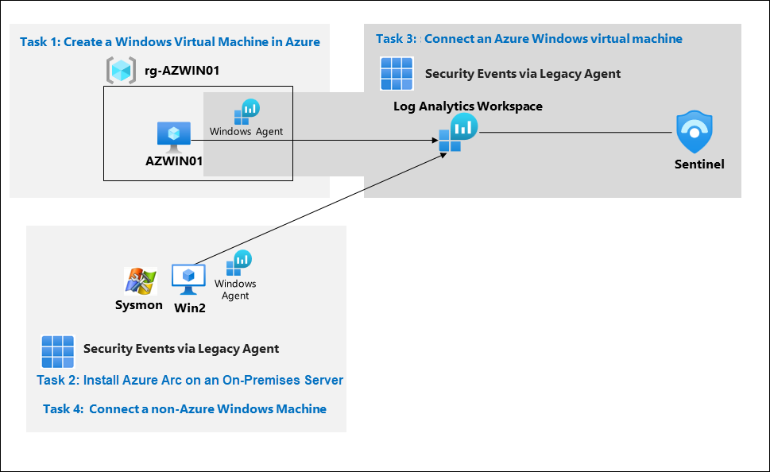

---
lab:
    title: 'Exercise 2 - Connect Windows devices to Microsoft Sentinel using data connectors'
    module: 'Learning Path 6 - Connect logs to Microsoft Sentinel'
---

# Learning Path 6 - Lab 1 - Exercise 2 - Connect Windows devices to Microsoft Sentinel using data connectors

## Lab scenario

You're a Security Operations Analyst working at a company that implemented Microsoft Sentinel. You must learn how to connect log data from the many data sources in your organization. The next source of data is Windows virtual machines inside and outside of Azure, like On-Premises environments or other Public Clouds.

>**Note:** An **[interactive lab simulation](https://mslabs.cloudguides.com/guides/SC-200%20Lab%20Simulation%20-%20Connect%20Windows%20devices%20to%20Microsoft%20Sentinel%20using%20data%20connectors)** is available that allows you to click through this lab at your own pace. You may find slight differences between the interactive simulation and the hosted lab, but the core concepts and ideas being demonstrated are the same. 

### Task 1: Create a Windows Virtual Machine in Azure

In this task, you'll create a Windows virtual machine in Azure.

1. Login to **WIN1** virtual machine as Admin with the password: **Pa55w.rd**.  

1. In the Microsoft Edge browser, navigate to the Azure portal at https://portal.azure.com.

1. In the **Sign in** dialog box, copy, and paste in the **Tenant Email** account provided by your lab hosting provider and then select **Next**.

1. In the **Enter password** dialog box, copy, and paste in the **Tenant Password** provided by your lab hosting provider and then select **Sign in**.

1. Select **+ Create a Resource**. **Hint:** If you were already in the Azure Portal, you might need to select *Microsoft Azure* from the top bar to go Home.

1. In the **Search services and marketplace** box, enter *Windows 10* and select **Microsoft Window 10** from the drop-down list.

1. Select the box for **Microsoft Window 10**.

1. Open the *Plan* drop-down list and select **Windows 10 Enterprise, version 22H2**.

1. Select **Start with a pre-set configuration** to continue.

1. Select **Dev/Test** and then select **Continue to create a VM**.

1. Select **Create new** for *Resource group*, enter RG-AZWIN01 as Name and select **OK**.

    >**Note:** This will be a new resource group for tracking purposes. 

1. In *Virtual machine name*, enter AZWIN01.

1. Leave **(US) East US** as the default value for *Region*.

1. Scroll down and review the *Image* for the virtual machine. If it appears empty, select **Windows 10 Enterprise, version 22H2**.

1. Review the *Size* for the virtual machine. If it appears empty, select **See all sizes**, choose the first VM size under *Most used by Azure users* and select **Select**.

    >**Note:** If you see the message: *This image is not supported for Azure Automanage. To disable this feature,navigate to the Management tab. Otherwise, select a supported image.* Go to the Management tab and disable "Automanage". The creation process will succeed afterwards.

1. Scroll down and enter a *Username* of your choosing. **Hint:** Avoid reserved words like admin or root.

1. Enter a *Password* of your choosing. **Hint:** It might be easier to re-use your tenant password. It can be found in the resources tab.

1. Scroll down to the bottom of the page and select the checkbox below *Licensing* to confirm you have the eligible license.

1. Select **Review + create** and wait until the validation is passed.

    >**Note:** If there is a *Networking* validation failure, select that tab, review its contents and then select **Review + create** again.

1. Select **Create**. Wait for the Resource to be created, this may take a few minutes.

### Task 2: Connect an Azure Windows virtual machine

In this task, you'll connect an Azure Windows virtual machine to Microsoft Sentinel.

1. In the Search bar of the Azure portal, type *Sentinel*, then select **Microsoft Sentinel**.

1. Select your Microsoft Sentinel Workspace you created earlier.

1. 1. In the Microsoft Sentinel left menus, scroll down to the *Content management* section and select **Content Hub**.

1. In the *Content hub*, search for the **Windows Security Events** solution and select it from the list.

1. On the *Windows Security Events* solution page select **Install**.

1. When the installation completes select **Manage**

    >**Note:** The *Windows Security Events* solution installs both the *Windows Security Events via AMA* and the *Security Events via Legacy Agent* Data connectors. Plus 2 Workbooks, 20 Analytic Rules, and 43 Hunting Queries.

1. Select the *Windows Security Events via AMA* Data connector, and select **Open connector page** on the connector information blade.

1. In the *Configuration* section, under the *Instructions* tab, select the **Create data collection rule**.

1. Enter **AZWINDCR** for Rule Name, then select **Next: Resources**.

1. Select **+Add resource(s)** to select the Virtual Machine we created.

1. Expand **RG-AZWIN01**, then select **AZWIN01**.

1. Select **Apply** and then select **Next: Collect**.

1. Review the different Security Event collection option. Keep *All Security Events* and then select **Next: Review + create**.

1. Select **Create** to save the Data Collection Rule.

1. Wait a minute and then select **Refresh** to see the new data collection rule listed.

### Task 3: Connect a non-Azure Windows Machine

In this task, you'll add an Azure Arc connected, non-Azure Windows virtual machine to Microsoft Sentinel.  

   >**Note:** The *Windows Security Events via AMA* data connector requires Azure Arc for non-Azure devices.

1. Make sure you are in the *Windows Security Events via AMA* data connector configuration in your Microsoft Sentinel workspace.

1. In the **Instructions** tab, under the *Configuration* section, edit the **AZWINDCR** *data collection rule* by selecting the *pencil* icon.

1. Select **Next: Resources**, and **+Add resource(s)**.

1. Expand **RG-Defender** (or the Resource Group your created), then select **WINServer**.

    >**Important:** If you do not see WINServer, please refer to the Learning Path 3, Exercise 1, Task 4 where you installed Azure Arc in this server.

1. Select **Apply**.

1. Select **Next: Collect**, then **Next: Review + create**.

1. Select **Create** after *Validation passed* is displayed.

## Proceed to Exercise 3
