# Lab 05: Connect Linux hosts to Microsoft Sentinel using data connectors

### Estimated Duration: 60 Minutes

## Overview

In this lab you are a Security Operations Analyst working at a company that has implemented Microsoft Sentinel. 

You will connect log data from Linux virtual machines using both the Common Event Format (CEF) via Legacy Agent and Syslog connectors to enable data collection for security monitoring and analysis.

>**Important:** There are steps within the next Tasks that are done in different virtual machines. Look for the Virtual Machine name references.

## Objectives

In this lab, you will perform the following tasks: 

- Task 1: Connect a Linux Host using the Common Event Format connector
- Task 2: Connect a Linux host using the Syslog connector
- Task 3: Configure the facilities you want to collect and their severities for the Syslog connector

## Architecture Diagram

  

### Task 1: Connect a Linux Host using the Common Event Format connector

In this task, you will connect a Linux host to Microsoft Sentinel with the Common Event Format (CEF) connector.

   > **Note:** Ensure you are logged into Azure from the SmartHotelHost VM (Lab VM).

   > **Note:** While accessing Sentinel workspace if you see an error that the page was moved to Defender portal, click on the link on the top left side of the page to access the old experience and refresh your browser page. 

   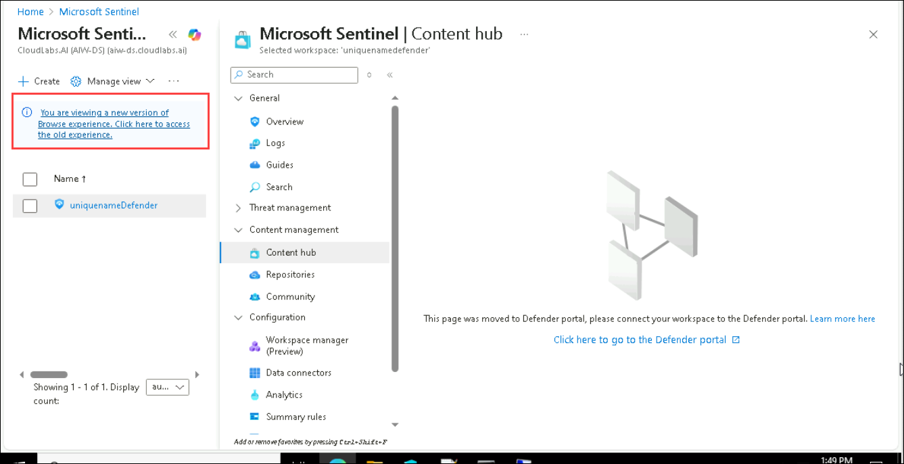 

1. In the Search bar of the Azure portal, type **Sentinel (1)**, then select **Microsoft Sentinel (2)**.

   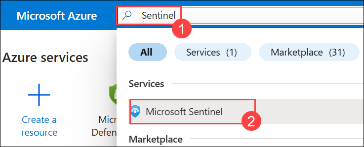

1. Click on the **uniquenameDefender (1)** workspace that we created earlier. Select **Content Hub (2)** under Content management from the left pane.

1. Search for **Common Event Format (3)** and select it.

1. Click on **Install (4)**.

   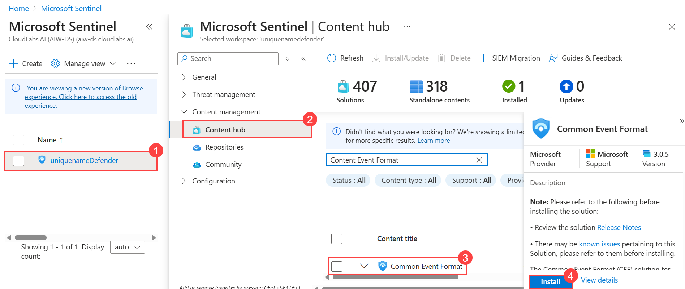

1. Once the **Common Event Format** is installed. Click on **Data connectors (1)** present under Configuration in the left pane.

1. From the Data Connectors tab, select **Common Event Format (CEF) via AMA (2)** connector from the list.
1. Select the **Open connector page (3)** on the connector information blade.

   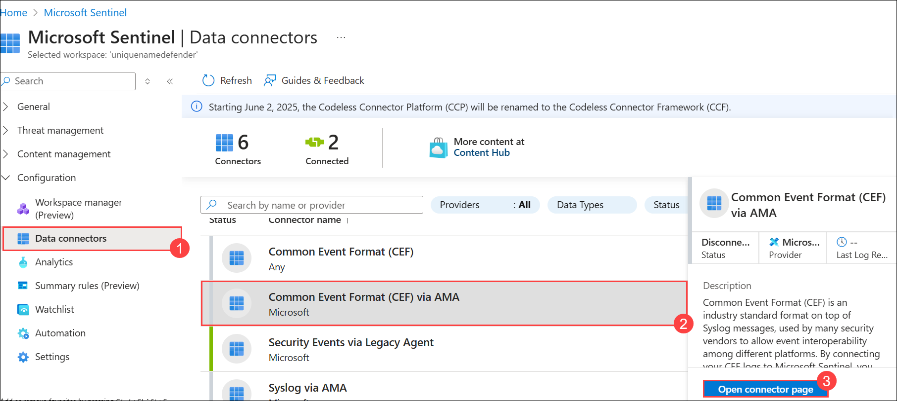

1. Under configuration, copy the command shown in **Run the following command to install and apply the CEF collector** and paste it in a Notepad.

   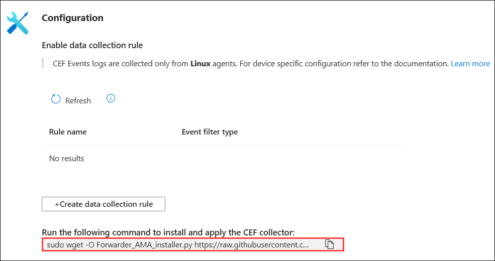

1. In the Search bar, type **Virtual machines (1)** and select **Virtual machines (2)**.

   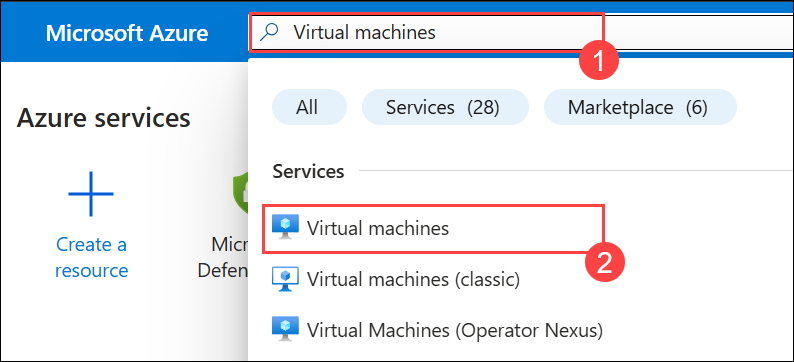

1. Click on **LIN1** Linux virtual machine.

   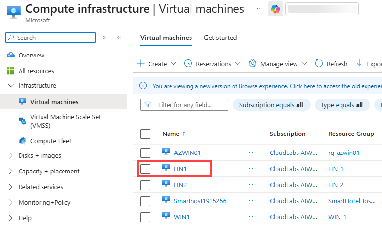  

1. Click on **Connect (1)** from the left navigation pane, scroll down to the Native SSH ,copy the **SSH command (2)** and paste it into the notepad.
   
   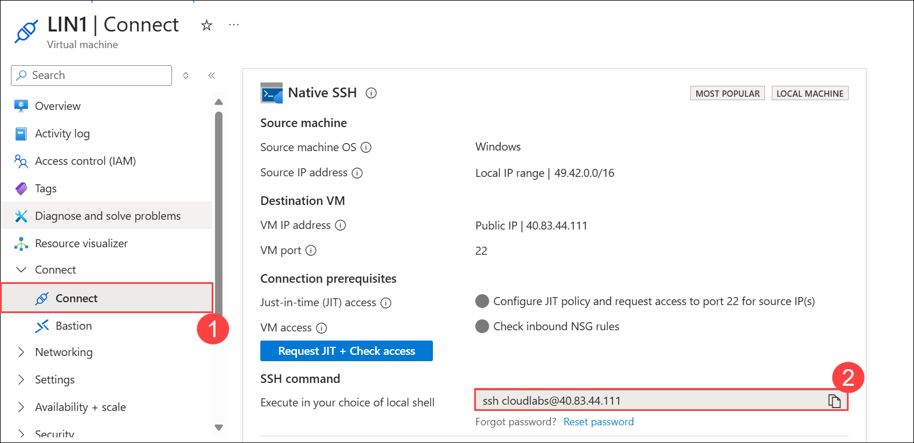  

1. Go back to the WIN1 virtual machine.

1. Launch Windows PowerShell as Administrator by right clicking the Start menu icon and selecting **Windows PowerShell (Admin)**.
1. Paste the command which we copied from the Native SSH window
1. Enter **yes** to confirm the connection and then type the user's **password provided under Resource group: LIN1** in the Environment tab and press **enter**. Your screen should look something like this:

   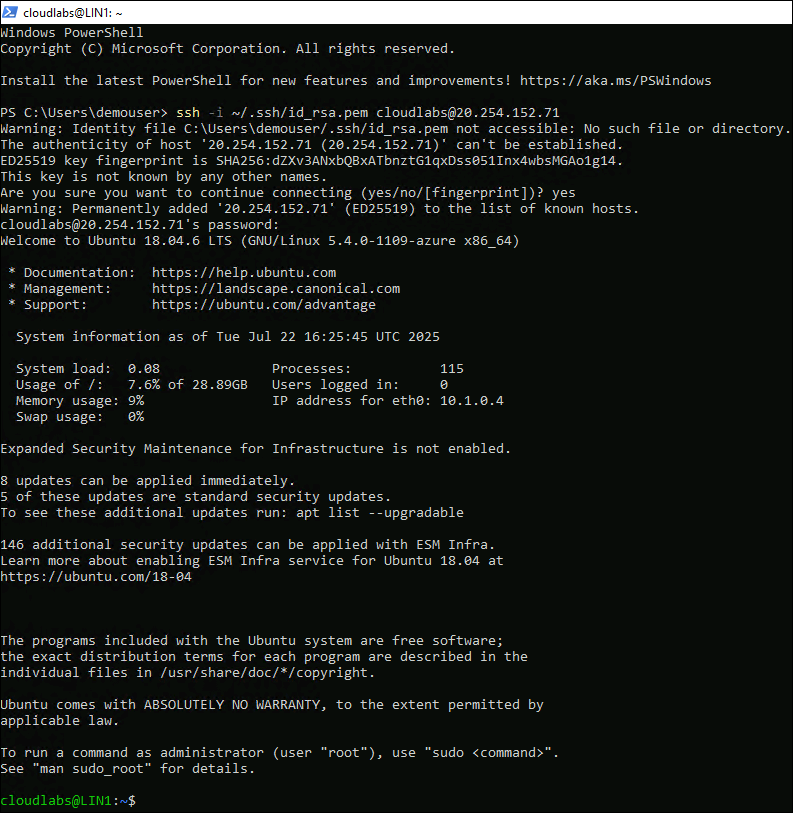

1. Paste the **1.2 Install the CEF collector on the Linux machine** from the earlier step. 

   

1. The script will run against your Linux server remotely. When the script processes properly it should look like this screen:

   
   
1. Close the Powershell Window.

### Task 2: Connect a Linux host using the Syslog connector

   > **Note:** Perform this task from the SmartHotelHost VM (Lab VM).

In this task, you will connect a Linux host to Microsoft Sentinel with the Syslog connector.

1. In the Search bar of the Azure portal, type **Sentinel (1)**, then select **Microsoft Sentinel (2)**.

    

1. Click on the **uniquenameDefender (1)** workspace that we created earlier.

   > **Note:** If you see an error that the page was moved to Defender portal, click on the link on the left top side to access the old experience and refresh the browser page. 

       

1. Select **Content Hub (2)** under Content management from the left pane.
1. Search for **Syslog (3)** and select it. Once selected, click on **Install (4)**.

   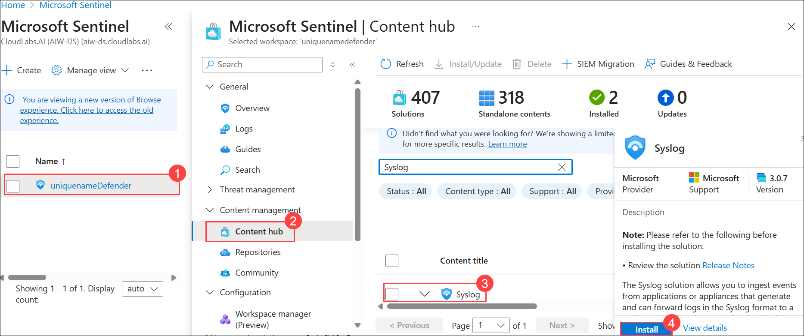  

1. Click on **Data connectors (1)** present under Configuration in the left pane. Select **Syslog via Legacy Agent (2)** connector from the list.

   > **Note:** Refresh if the connector is not visible.

1. Select the **Open connector page (3)** on the connector information blade.

   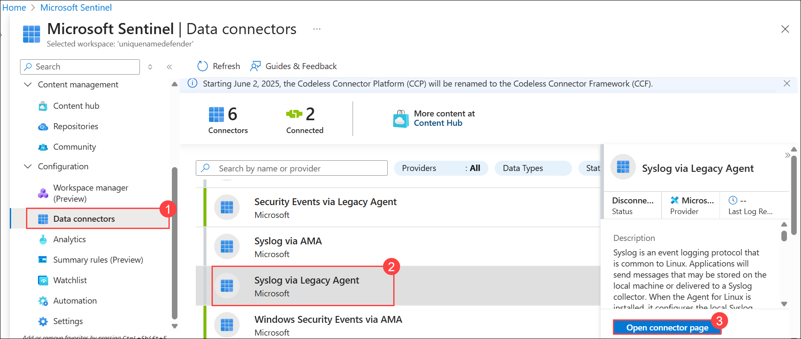  

1. Under **Configuration**, open the **Install agent on a Azure Linux Machine (1)** section. Select the link for **Download & install agent for Azure Linux machine (2)**. 

   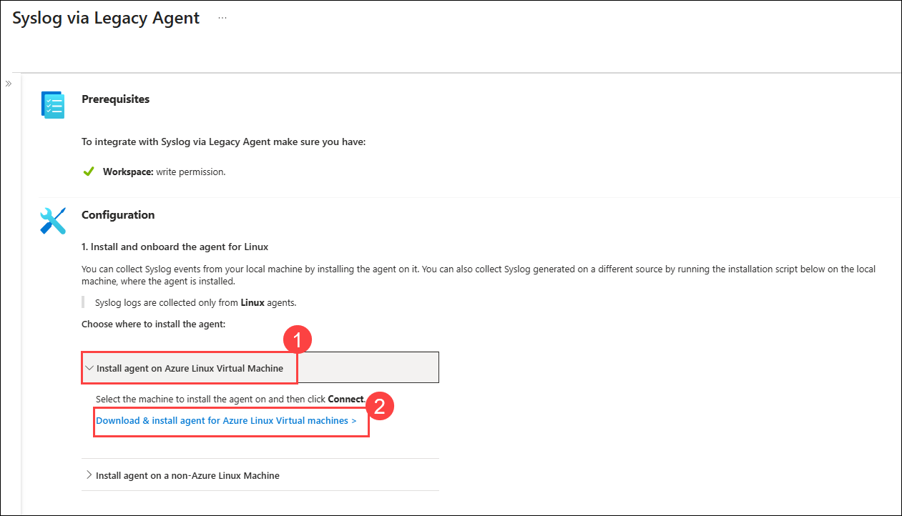  

1. On the Virtual machines page select the LIN2 virtual machine.

   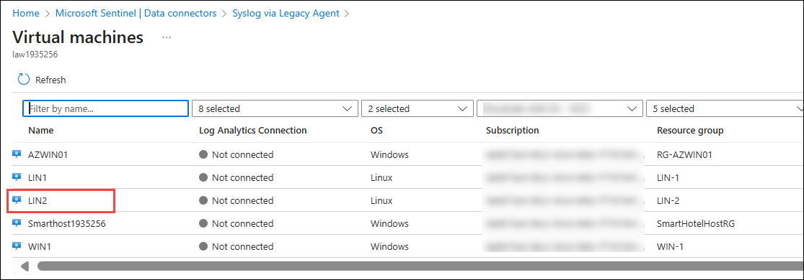 

1. Click on **Connect** and wait for the LIN2 VM to connect to the workspace. 

   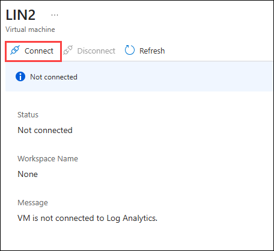 

   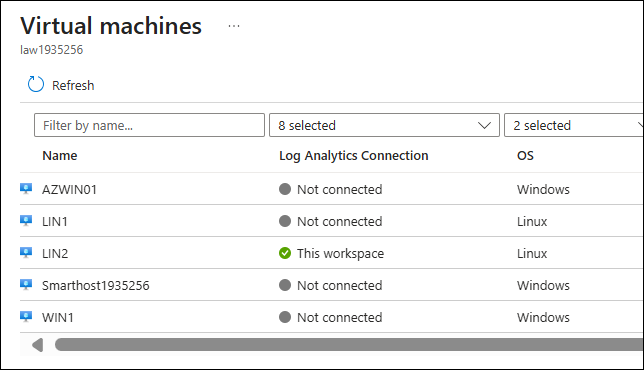

### Task 3: Configure the facilities you want to collect and their severities for the Syslog connector

   > **Note:** Perform this task from the SmartHotelHost VM (Lab VM).

In this task, you configure the **Syslog connector** in Microsoft Sentinel to define which **facilities** and **severity levels** of log data will be collected from your environment. This setup ensures that relevant security and system event logs from Linux devices are captured. It helps enhance **threat detection and monitoring** by filtering and forwarding only the required log categories to Sentinel.

1. In the Search bar of the Azure portal, type **Sentinel (1)**, then select **Microsoft Sentinel (2)**.

    

1. Click on the **uniquenameDefender (1)** workspace. Click on **Settings (2)** and select **Workspace Settings (3)**.

   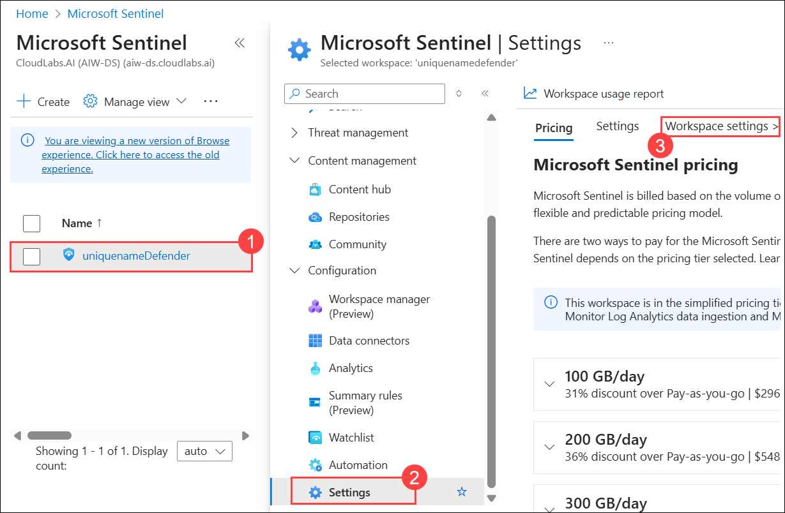 

1. From the left menu, select **Legacy agents management (1)** under the **Classic** area.
1. Click on the **Syslog (2)** tab.
1. Click on the **+ Add facility (3)** button.
1. Select **auth** from the drop-down menu for **Facility name**.

      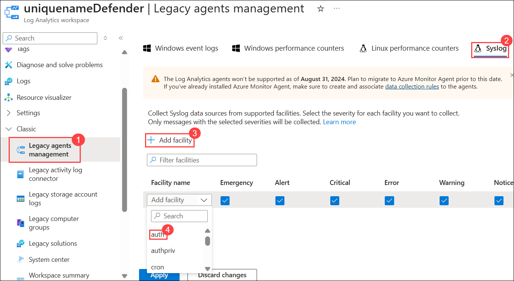 

1. Select the **+ Add facility (1)** button again.
1. Select **authpriv (2)** from the drop-down menu for **Facility name**.
1. Click on **Apply**.

   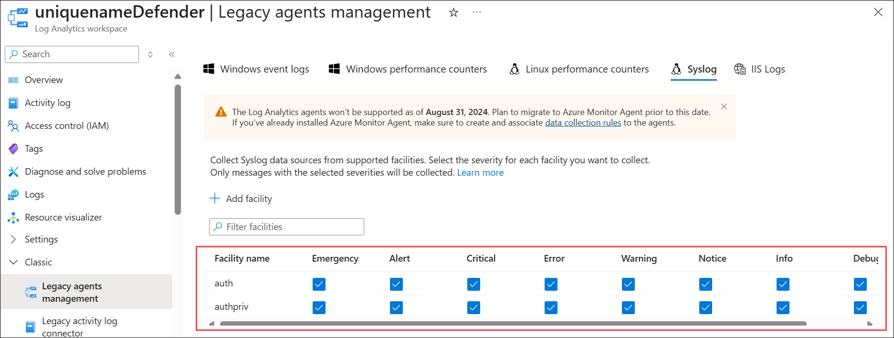    

## Summary 

In this lab, you have completed the following:
- Connected a Linux Host using the Common Event Format connector
- Connected a Linux host using the Syslog connector
- Configured the facilities you want to collect and their severities for the Syslog connector

### You have successfully completed this lab!

By completing this lab **Secure Windows Servers with Azure Arc & Microsoft Defender**, you gained hands-on experience in strengthening hybrid cloud environments using Microsoft security and monitoring tools. You began by onboarding on-premises Windows Servers to Azure Arc, enabling centralized governance and management across hybrid infrastructures. You then configured Microsoft Defender for Cloud to monitor workloads, assess compliance, and mitigate threats through actionable security alerts. Moving further, you connected Windows and Linux machines to Microsoft Sentinel using data connectors such as CEF and Syslog, integrating diverse log sources for advanced threat detection and response. Through this process, you built a unified security architecture that leverages AI-driven intelligence, automated incident handling, and comprehensive visibility to safeguard both on-premises and cloud resources.
