# Lab 07 - Exercise 1: Configure your Microsoft Sentinel environment

## Lab Scenario

You're a Security Operations Analyst working at a company that is implementing Microsoft Sentinel. You're responsible for setting up the Microsoft Sentinel environment to meet the company requirements to minimize cost, meet compliance regulations, and provide the most manageable environment for your security team to perform their daily job responsibilities.

>**Important:** The lab exercises for Learning Path #7 are in a *standalone* environment. If you exit the lab before completing it, you will be required to re-run the configurations again.

## Lab Objectives
 In this lab, you will perform the following:

- Task 1: Create a Log Analytics Workspace
- Task 2: Deploy Microsoft Sentinel to a workspace
- Task 3: Configure data retention
- Task 4: Create a Watchlist
- Task 5: Create a Threat Indicator
- Task 6: Configure log retention

## Estimated Timing: 60 Minutes

## Architecture Diagram

  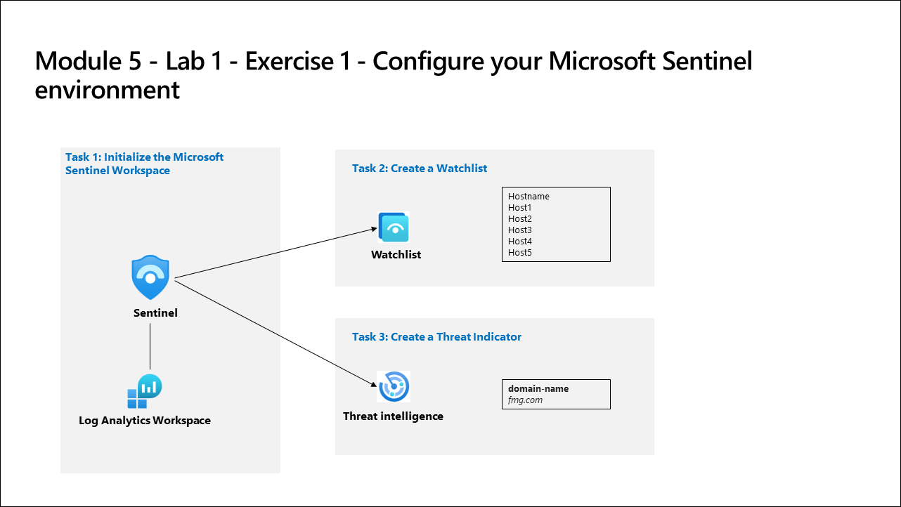

### Task 1: Create a Log Analytics Workspace

In this task, you will create a Log Analytics workspace for use with Microsoft Defender for Cloud.

1. In the Search bar of the Azure portal, type **Log Analytics (1)**, then select **Log Analytics workspaces (2)**.

   

1. Select **+ Create** from the command bar.

   

1. To create a **log analytics workspace**, follow these steps:

    - Select **RG-Defender (1)**, for Resource group.
    - For the Name, enter **uniquenameDefender (2)**.
    - Leave the **default Region (3)**.
    - Select **Review + Create (4)**.

      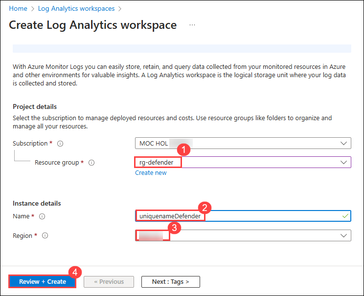

1. Once the workspace validation has passed, select **Create**.

   

1. Wait for the new workspace to be provisioned, this may take a few minutes.

### Task 2 : Deploy Microsoft Sentinel to a workspace

In this task, you will deploy Microsoft Sentinel to an existing Log Analytics workspace, enabling it to collect, detect, and respond to security threats.

1. In the Search bar of the Azure portal, type **microsoft sentinel (1)**, then select **Microsoft Sentinel (2)**.

   

1. Select **+ Create** from the command bar.

   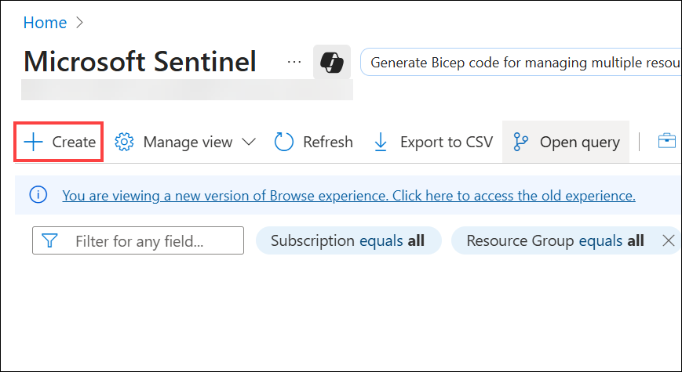

1. Select the newly created **uniquenameDefender (1)** workspace and click on **Add (2)**.
  
   

1. In the Microsoft Sentinel free trial activated tab, select **Ok**.

   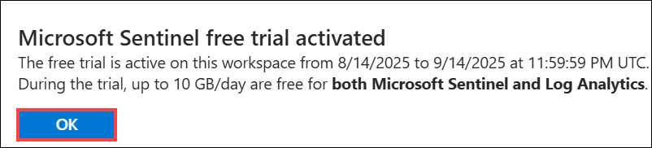

### Task 3 : Configure data retention

In this task, you will configure the data retention in the Log analytics workspace.

1. In the Search bar of the Azure portal, type **Log Analytics (1)**, then select **Log Analytics workspaces (2)**. 

   

1. Select **uniquenameDefender** Log Analytics workspaces. 

   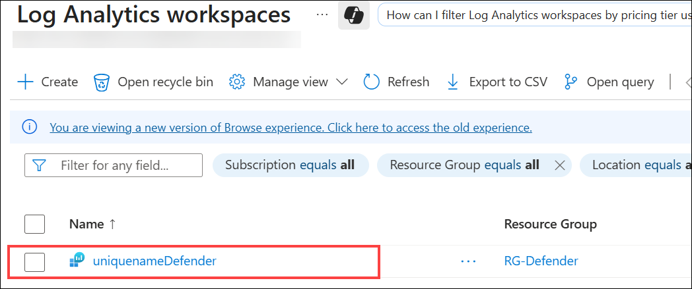

1. Expand the **Settings** section in the navigation menu and select **Usage and estimated costs (1)** then Select **Data retention (2)**.

   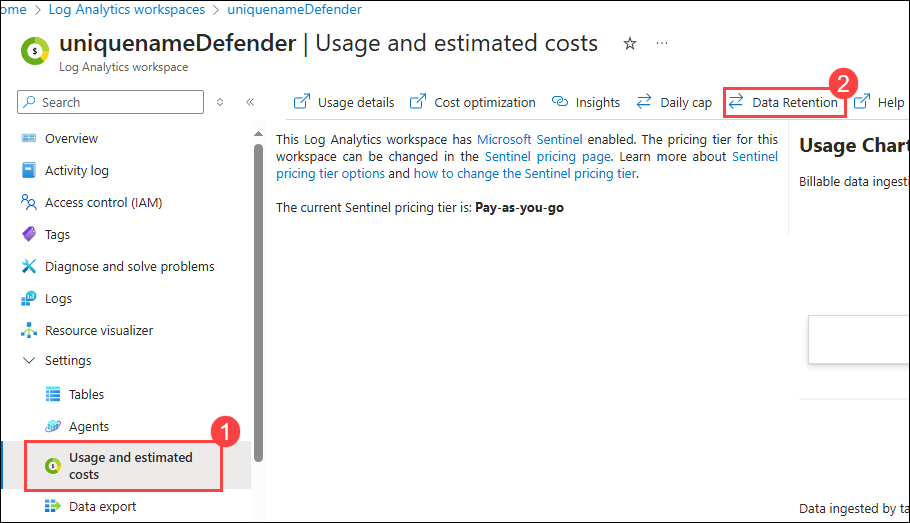

1. Change data retention period to **180 days (1)** then Select **OK (2)**.

   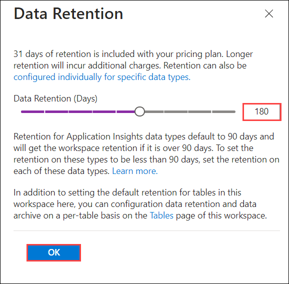

### Task 4: Create a Watchlist

In this task, you will create a watchlist in Microsoft Sentinel.

1. In the search box of your Labvm, enter **Notepad (1)**. Select **Notepad (2)** from the results.

   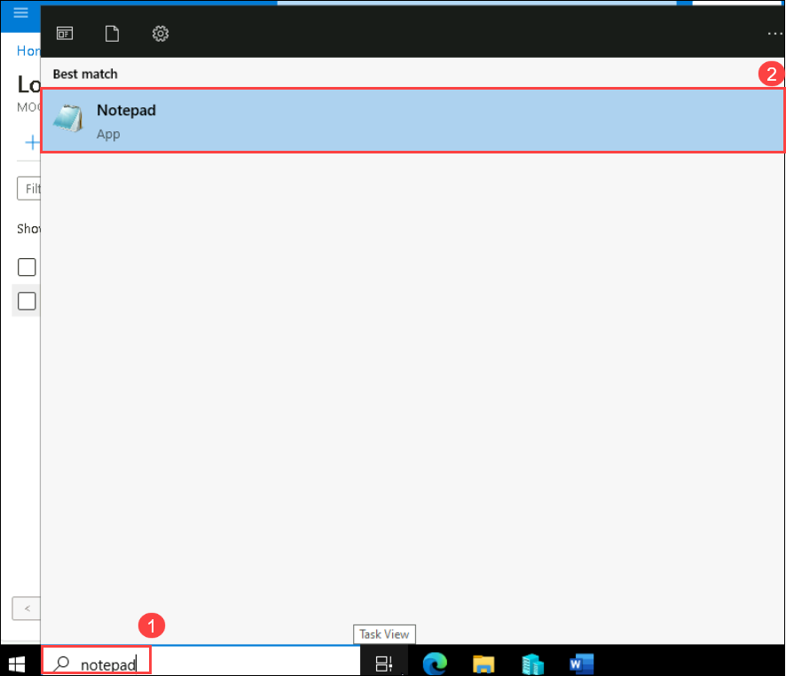

1. Type **Hostname** then enter for a new line.

1. From row 2 of the notepad, copy the following hostnames, each one in a different line:

    ```Notepad
    Host1
    Host2
    Host3
    Host4
    Host5
    ```

    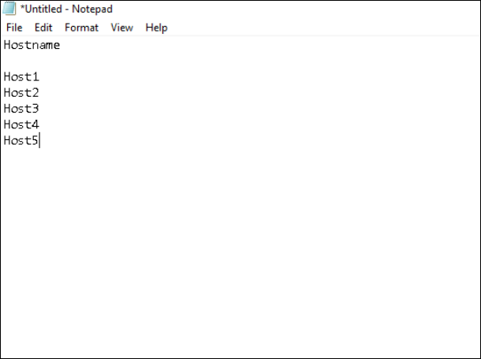

1. From the menu select, **File (1) - Save As (2)**.

   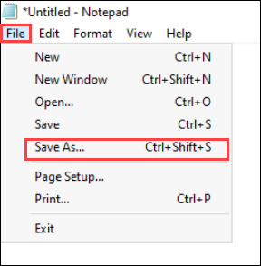

1. Name the file ***HighValue.csv (1)***, change the file type to **All files(*.*) (2)** and select **Save (3)**. 

   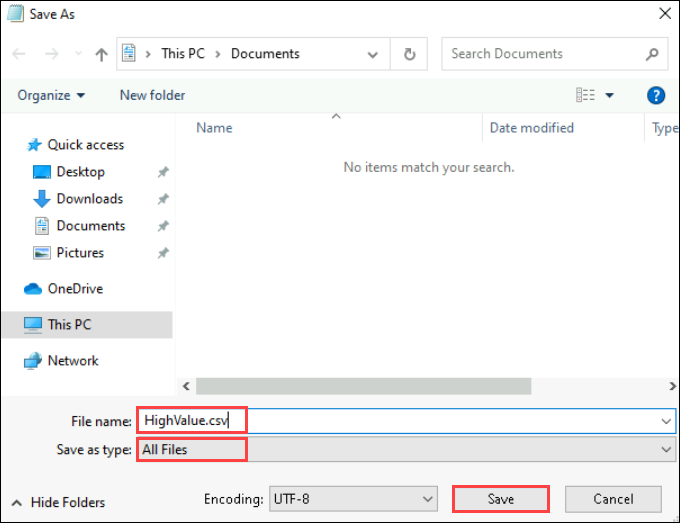

   >**Hint:** The file can be saved in the *Documents* folder.

1. **Close** the Notepad.

1. In the Search bar of the Azure portal, type **microsoft sentinel**, then select **Microsoft Sentinel**.

1. Select **uniquenameDefender** Microsoft Sentinel.

   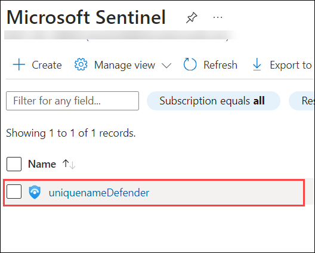

1. In Microsoft Sentinel, On the left menu, select the **Watchlist (1)** option under the **Configuration** area then Select **+ New (2)** from the command bar.

   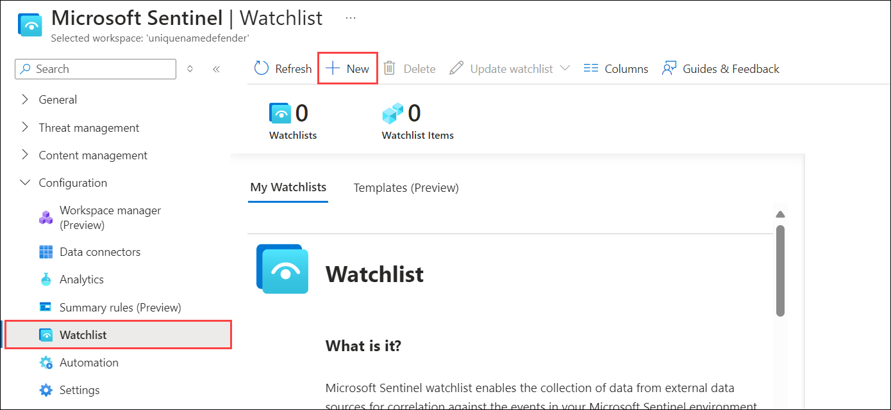

1. In the Watchlist wizard, enter the following then Select **Next: Source > (4)**:

    |General setting|Value|
    |---|---|
    |Name|**HighValueHosts (1)**|
    |Description|**High Value Hosts (2)**|
    |Alias|**HighValueHosts (3)**|

    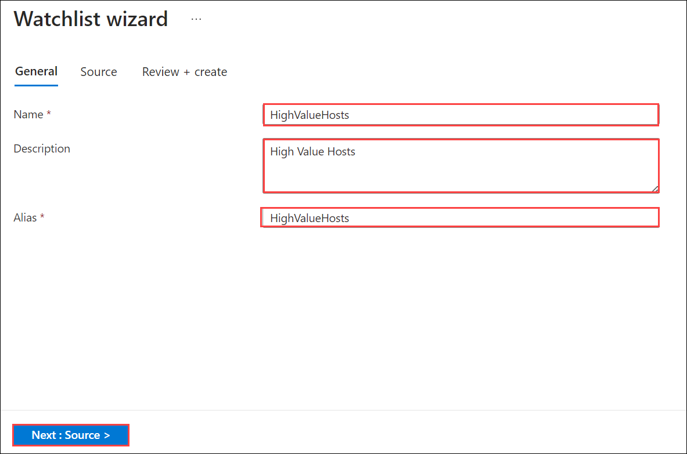

1. Select **Browse for files** under *Upload file* and browse for the *HighValue.csv (1)* file you just created.

    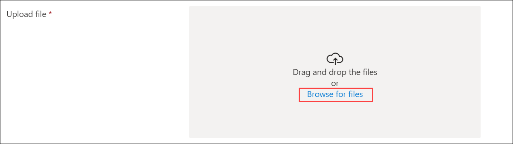

1. In the ***SearchKey field*** select **Hostname (2)**.

1. Select **Next: Review + Create > (3)**.

    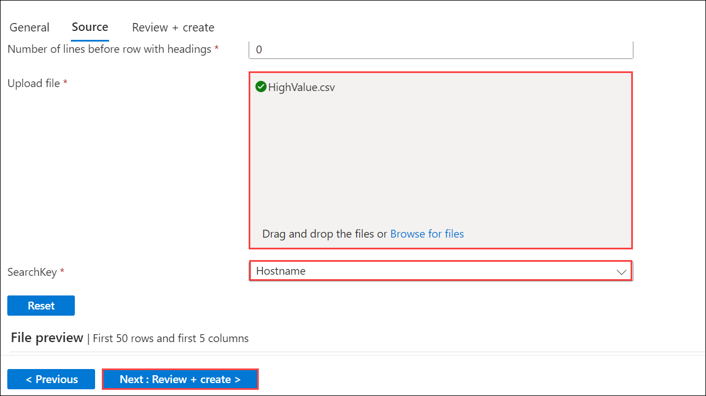

1. Review the settings you entered and select **Create**.

    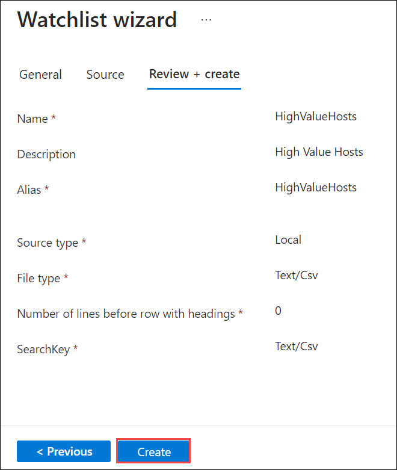

1. The screen returns to the Watchlist page.

1. Select the **HighValueHosts (1)** watchlist and on the right pane, select **View in logs (2)**.

     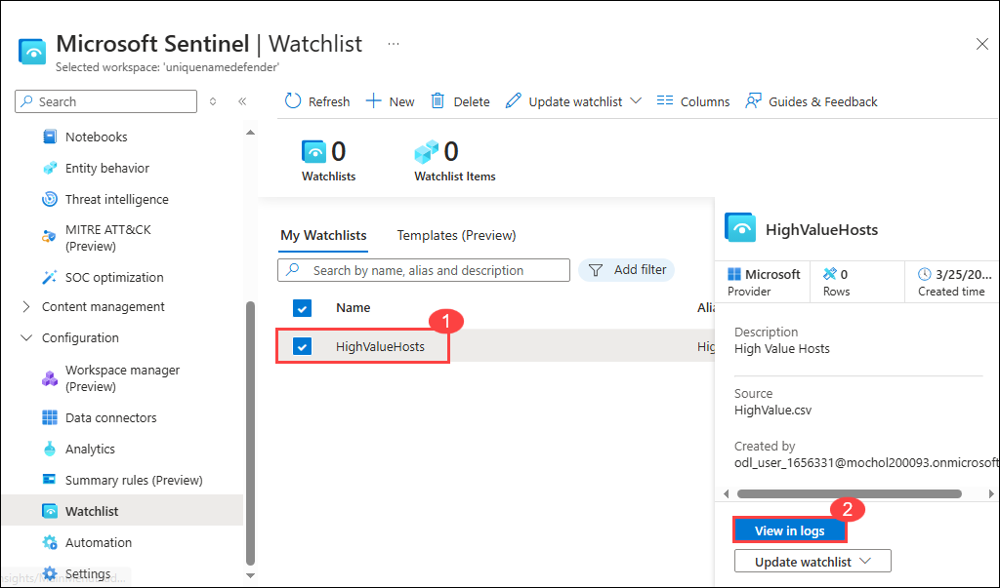

    >**Important:** It could take up to ten minutes for the watchlist to appear. **Please continue with the following task and run this command in the next lab**.
     
    >**Note:** You can now use the `_GetWatchlist('HighValueHosts')` in your own KQL statements to access the list. The column to reference would be **Hostname**.

1. Close the **Logs** window by selecting the 'x' in the top-right. 

    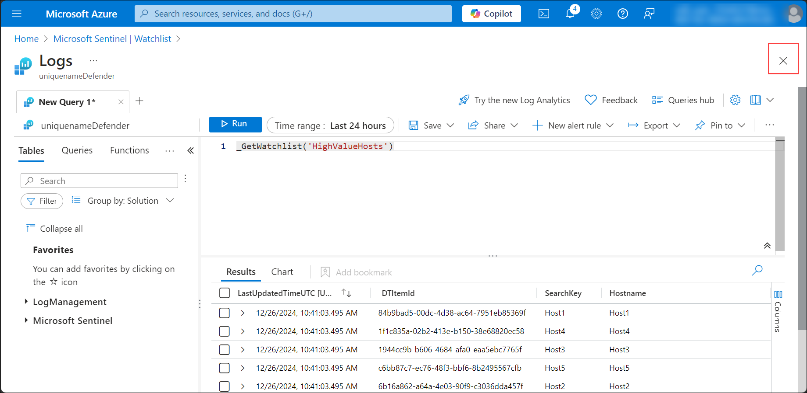

1. Select **OK** to discard the unsaved edits.

    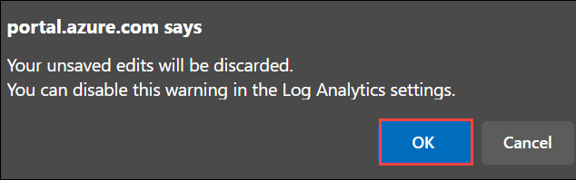

   > **Congratulations** on completing the task! Now, it's time to validate it. Here are the steps:
   > - Hit the Validate button for the corresponding task. You can proceed to the next task if you receive a success message.
   > - If not, carefully read the error message and retry the step, following the instructions in the lab guide.
   > - If you need any assistance, please contact us at labs-support@spektrasystems.com. We are available 24/7 to help you out.

  <validation step="53b31791-6d4b-4f83-a56e-b7136bbba6a7" />
  
### Task 5: Create a Threat Indicator

In this task, you will create an indicator in Microsoft Sentinel.

1. In Microsoft Sentinel, select the **Threat intelligence (1)** option in the **Threat management** area.

1. Select **+ New (2)** from the command bar.

1. Select the **TI Object (3)**.

     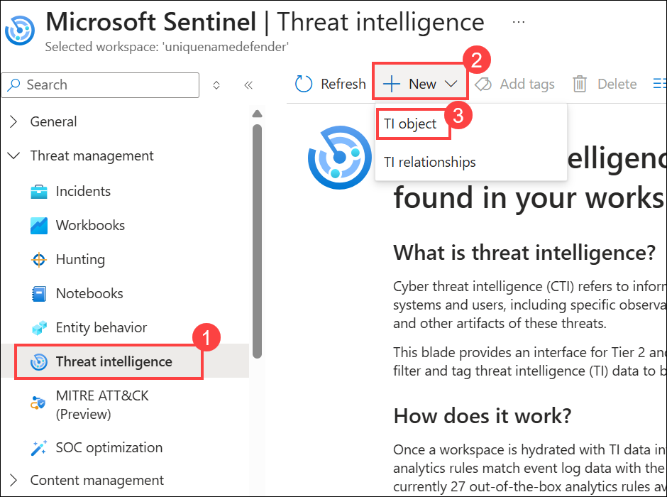

1. From the **Object type** dropdown, select **Indicator (1)**.

1. Select the **+ New observable** dropdown and select **Domain name (2)**.

     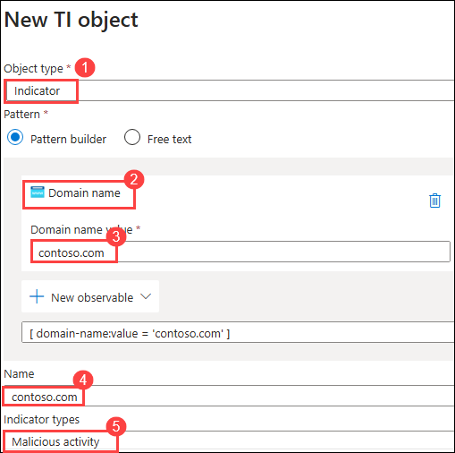

1. For Domain, enter a domain name, for example type **contoso.com (3)**.

1. In the **Name** field enter the same value (4) used for the Domain.

1. In the **Indicator types**, select **malicious-activity (5)**.

1. Set the **Valid from (6)** field to today's date.

     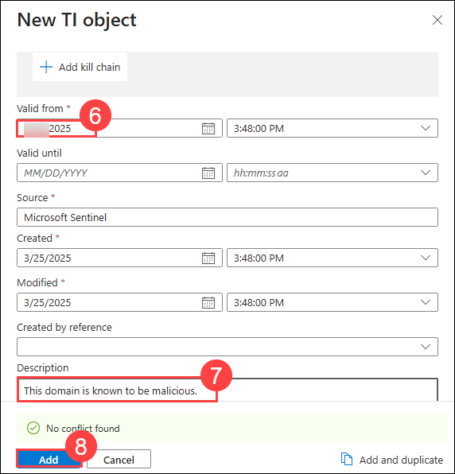

1. Scroll down to the **Description** and enter **This domain is known to be malicious (7)**.

1. Select **Add (8)**.

1. Select the **Logs (1)** option under the **General** area of the **Sentinel** navigation menu. You might want to disable the "Always show queries" option and close the **Queries** window to run the KQL statements.

      >**Note:** In the default **New Query 1** tab, the **_GetWatchList('HighValueHosts')** query should still be there, and will now produce results if run.

1. Select the **+ (2)** sign to create a new query tab.

      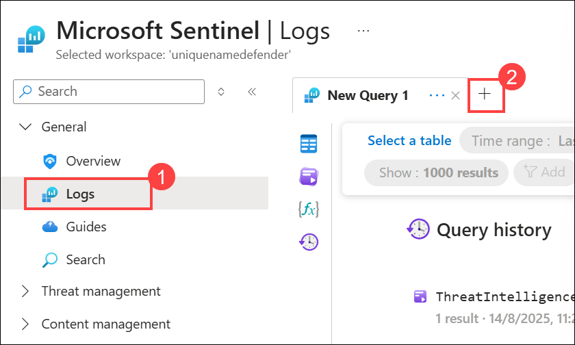

1. Run the following KQL statement.

    ```KQL
    ThreatIntelligenceIndicator
    ```

    >**Note:** It could take up to five minutes for the indicator to appear.

    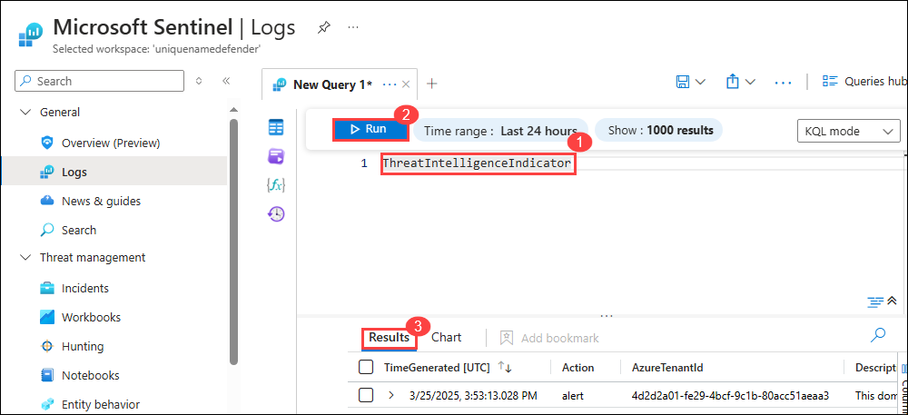

1. Scroll the results to the right to see the DomainName column. You can also run the following KQL statement to just see the DomainName column.

    ```KQL
    ThreatIntelligenceIndicator 
    | project DomainName
    ```

    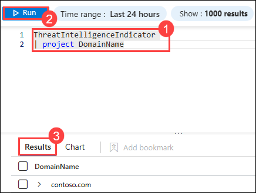

### Task 6: Configure log retention

In this task, you will change the retention period for the SecurityEvent table.

1. In Microsoft Sentinel, select the **Settings (1)** option under the **Configuration** area then select **Workspace settings (2)**.

     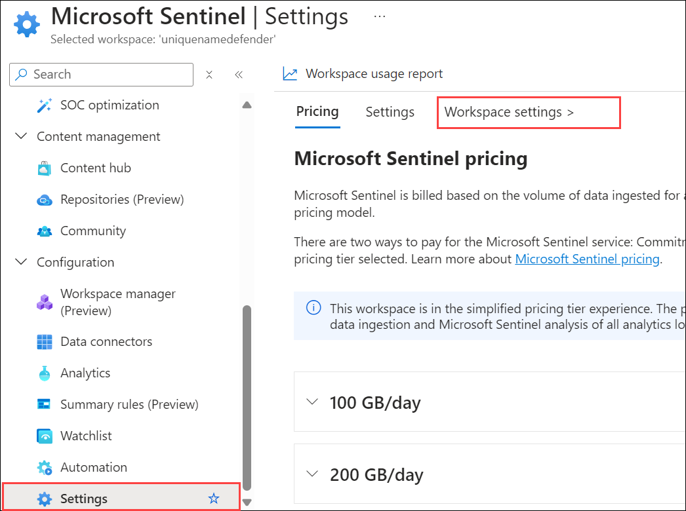

1. In Log Analytics workspace, select the **Tables (1)** option under the **Settings** area.

1. Search and select the table **SecurityEvent (2)**, and then right click on **Security Event (3)** table.

     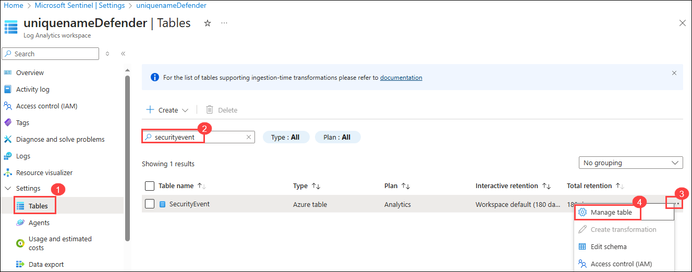

1. Select **Manage Table (4)**.

1. Change the **Interactive retention period** to **90 days (1)**.

     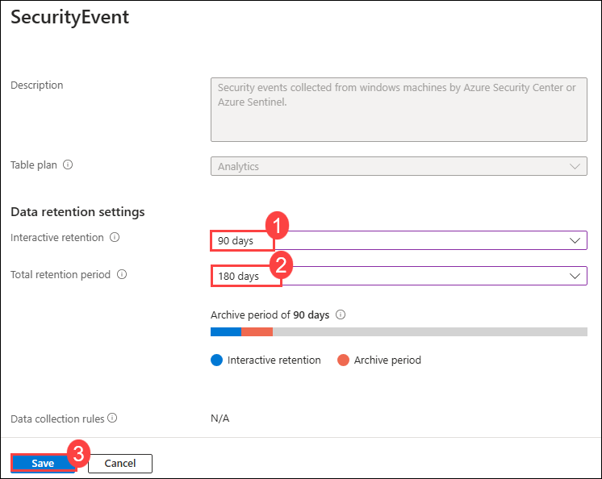

1. Reset the **Total retention period** to **180 days (2)** (if needed). Notice that **Archive period** is set now set to **90 days**, because **Azure Monitor** automatically treats the remaining 90 days of total retention as low-cost, long-term retention.

1. Select **Save (3)** to apply the changes.

## Review
In this lab, you have completed the following:

- Created a Log Analytics Workspace
- Deployed Microsoft Sentinel to a workspace
- Configured data retention
- Created a Watchlist
- Created a Threat Indicator
- Configured log retention

## You have successfully completed the lab
