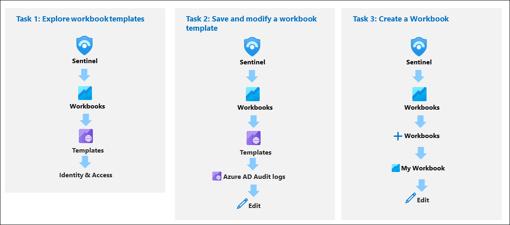
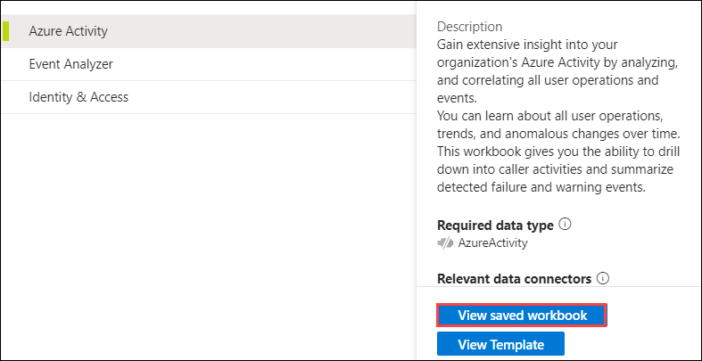
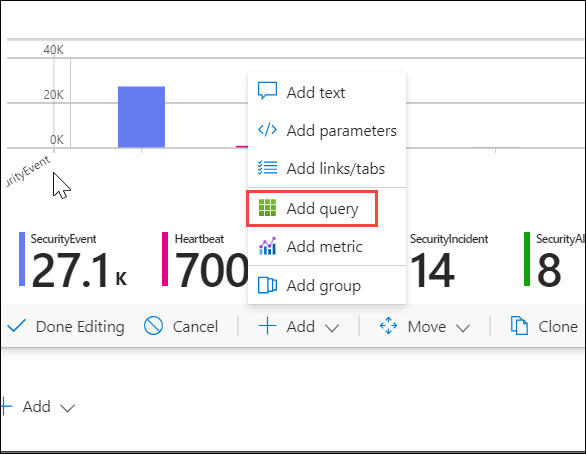
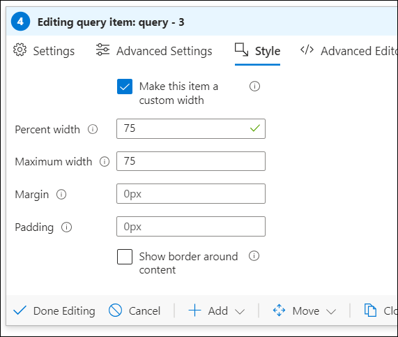

# Module 7 - Lab 1 - Exercise 10 - Create workbooks

## Lab scenario

You are a Security Operations Analyst working at a company that implemented Microsoft Sentinel. Once you have connected your data sources to Microsoft Sentinel, you can visualize and monitor the data using the Microsoft Sentinel adoption of Azure Monitor Workbooks, which provides versatility in creating custom dashboards. 

Microsoft Sentinel allows you to create custom workbooks across your data and also comes with built-in workbook templates to allow you to quickly gain insights across your data as soon as you connect a data source.

>**Note:** An **[interactive lab simulation](https://mslabs.cloudguides.com/guides/SC-200%20Lab%20Simulation%20-%20Create%20workbooks)** is available that allows you to click through this lab at your own pace. You may find slight differences between the interactive simulation and the hosted lab, but the core concepts and ideas being demonstrated are the same.

## Lab objectives
 In this lab, you will Understand following:
 - Task 1: Explore workbook templates
 - Task 2: Save and modify a workbook template
 - Task 3: Create a Workbook

## Estimated timing: 20 minutes

## Architecture Diagram

 

### Task 1: Explore workbook templates

In this task, you will explore the Microsoft Sentinel workbook templates.

1. In the Search bar of the Azure portal, type *Sentinel*, then select **Microsoft Sentinel**.

1. Select your Microsoft Sentinel Workspace.

1. Select **Workbooks** under the *Threat Management* left blade. The *Templates* tab is selected by default.

1. Search for and select the **Azure Activity** template workbook. In the right pane, scroll down and select the **View template** button.

1. Review the contents of the workbook. It shows insights into your Azure subscription operations by collecting and analyzing the data from the Activity Log.

1. Close the workbook by selecting the **X** in the top-right corner.

### Task 2: Save and modify a workbook template

In this task, you will save a workbook template and modify it.

1. You should be back in the **Microsoft Sentinel - Workbooks - Templates** tab. Scroll down again and select the **Save** button for the *Azure Activity* workbook. 

   

1. Leave **East US** as the default value for *Region* and select **Yes**.

1. Select the **View saved workbook** button.

   

1. Select **Edit** in the command bar to enable changes in the workbook.

1. Scroll down to the *Caller activities over time* area, look at the color of the *Activities* column since we are going to format those columns. Select the **Edit** button below the grid.

   

1. Select the **Column Settings** button, it is located to the right of the *Run Query* command bar. **Hint:** This button only appears if there is data from the KQL query.

1. In the *Edit column settings* blade that appears, within *Columns* select **Activities**.

1. Change the value for *Column renderer* to **Heatmap**. For *Colour palette*, scroll down to select **32-color categorical**.

1. Select **Save and Close**. Notice the change in the *Activities* column.

1. Select **Done Editing** at the bottom of the query (not the top menu).

1. Now select **Done Editing** at the top menu and select the **Save** icon. 

1. Close the workbook by selecting the **X** in the top-right corner.

### Task 3: Create a Workbook

In this task, you will create a new workbook with advanced visualizations.

1. You should be back at the **Workbooks** area of the Microsoft Sentinel portal.

1. Select **+ Add workbook** to create a new workbook from scratch. 

    >**Note:** Although it is a new workbook, a startup template is used.

1. To edit the workbook, select **Edit**.

1. Select the **Edit** button below the new workbook
overview of the workbook.

1. Type *# My workbook* in a new line on top of *## New workbook*.

1. Select **Done Editing** on the bottom of this section, *Editing text item: text - 2*. Notice that your header increased in size and name changed.

1. Select **Edit** below the only visible bar chart graph.

1. Review the KQL statement that provides a *union* statement of counts across all tables.

1. Scroll down and select the **Done Editing** on the bottom menu, for the *Editing query item: query - 2*.

1. Select the ellipsis **...** next to the *Edit* button of the bar chart graph, then select **+ Add**, then select **Add query**.

1. Type **SecurityEvent** into the query box.

1. Change the *Time Range* to **Last hour**.

1. Change the *Visualization* to **Time chart**.

1. Select the **Style** tab from the query's command bar.

1. Select the **Make this item a custom width** box.

1. Set the *Percent width* to **25** and *Maximum width* to **25**.

1. Now select **Advanced Settings** tab from the query's command bar.

1. Select **Show refresh icon when not editing** box. 

1. Scroll down and select **Done Editing** on the bottom menu, for the new *Editing query item: query - 2*.

1. Scroll down and at the bottom of the workbook select **+ Add**, then **Add query**.

    

1. Type **SecurityEvent** into the query box.

1. Change the *Time Range* to **Last hour (1)**.

1. Change the *Visualization* to **Grid (2)**.

   

1. Select **Style** from the query's command bar.

1. Select **Make this item a custom width** box.

1. Set the *Percent width* to **75** and *Maximum width* to **75**.

   

1. Scroll down and select **Done Editing** on the bottom menu, for the new *Editing query item: query - 3*.

1. Select **Done Editing** in Workbook's top command bar.

1. Select the **Save** icon, change the *Title* to **My Workbook**.

1. Select the **RG-Defender** resource group if needed and leave other values as default.

1.  Select **Apply** to commit the changes. 

1. Close the workbook by selecting the **X** at the top-right or select **Workbooks** in the Microsoft Sentinel portal.

1. Back in the *Workbooks* page, select the **My workbooks** tab.

1. Select the workbook you just created, **My workbook**.

1. On the right pane, select **View saved workbook** to review your workbook.

## Review
In this lab, you have completed the following:
 - Explored workbook templates
 - Saved and modified a workbook template
 - Created a Workbook

## Proceed to Exercise 11
