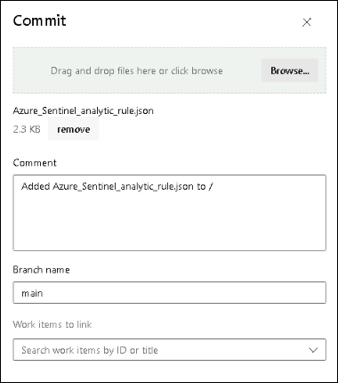
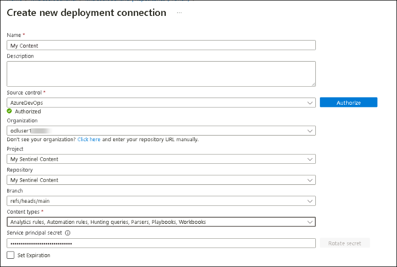

# Module 7 - Lab 1 - Exercise 9 - Use Repositories in Microsoft Sentinel

## Lab scenario

You are a Security Operations Analyst working at a company that implemented Microsoft Sentinel. You already created Scheduled and Microsoft Security Analytics rules.  You need to centralize analytical rules in an Azure DevOps repository.  Then connect Sentinel to the Azure DevOps repository and import the content. 


### Task 1: Create and export an analytical rule

In this task, you will enable Entity behavior analytics in Microsoft Sentinel.

1. Login to WIN1 virtual machine with the password as provided in the environment tab.

1. In the **Sign in** dialog box, copy and paste in the **Tenant Email** account provided by your lab hosting provider and then select **Next**.

1. In the **Enter password** dialog box, copy and paste in the **Tenant Password** provided by your lab hosting provider and then select **Sign in**.

1. In the Search bar of the Azure portal, type *Sentinel*, then select **Microsoft Sentinel**.

1. Select your Microsoft Sentinel Workspace.

1. Select **Analytics** from the Configuration area.

1. Select the **+ Create** button and then select **Scheduled query rule**.

1. In the Analytics rule wizard, on the General tab, type the Name **Rule from Azure DevOps**.

1. For Tactics, select **Persistence**.

1. For Severity, select **Low**.

1. Select **Next: Set rule logic >** button:

1. For the rule query, paste the following KQL statement:

    >**Warning:** When using the Paste function on the virtual machine extra (pipe) characters could be added. Make sure you use Notepad first to paste the following query.

    ```KQL
    SecurityEvent | where EventID == 4732
    ```
    
1. Select **View query results**. You should not receive any results or errors. If you receive an error, please review that the query appears just like the previous KQL statement. Close the *Logs* window by selecting the upper right **X** and select **OK** to discard to save changes to go back to the wizard.


1. Scroll down and under *Query scheduling* set the following:

    |Setting|Value|
    |---|---|
    |Run Query every|5 minutes|
    |Look data from the last|1 Day|

    >**Note:** We are purposely generating many incidents for the same data. This enables the Lab to use these alerts.

1. Under the *Alert threshold* area, leave the value unchanged since we want the alert to register every event.

1. Under the *Event grouping* area, leave the **Group all events into a single alert** as the selected option since we want to generate a single alert every time it runs, as long as the query returns more results than the specified alert threshold above.

1. Select the **Next: Incident settings >** button. 

1. Select the **Next: Automated response >** button.

1. Select the **Next: Review >** button.
 
1. Select **Create**.

1. Select the rule just created, then select **Export** from the toolbar.

   

### Task 2: Create our Azure DevOps environment

In this task, you will test create and populate an Azure DevOps repository.

1. Open another tab in the browser.

1. Navigate to https://aexprodcus1.vsaex.visualstudio.com/me?mkt=en-US.

1. On the *We need a few more details* page, select **Continue**.

1. On the *Get started with Azure DevOps* page, select **Create new organization** and the select **Continue**.

1. On the *Almost done...* page, enter a name for your DevOps organization that you would not want to use in the future, like for example, your tenant prefix. **Hint:** It can be found in the Resources tab of your lab (WWLx...).

1. *Enter characters you see*, then **Continue**.

1. On the *Create a project to get started* page, enter **My Sentinel Content** as project name and then select **Create project**.

1. Navigate to **Repos** on the left pane.

1. At the bottom of the page in the area *Initialize the main branch with a README or gitignore*, select **Initialize**.

1. The page should show the Files for the Repo.  the only file is README.me.

1. On the Files (right side of the page) blade, the toolbar includes options *Set up build*, *Clone*, and *:*.  Select **:** to show more options.

1. Select **Upload Files**.

1. Select **Browse** and select the file **Azure_Sentinel_analytic_rule.json** from your *Downloads* directory.

   

1. Select **Commit**.

1. Select **Azure DevOps** on the top left corner of the page.  This display your organization and projects.

1. Select **Organization settings** from the bottom left of the page.

1. Select **Policies** in the *Security* area.

1. Turn **On** *Third-party application access via OAuth* in the *Application connection policies* area.

### Task 3: Connect Sentinel to Azure DevOps.

1. Select the *Azure Portal*/*Microsoft Sentinel* tab in your browser.

1. In Microsoft Sentinel, select **Repositories (Preview)** in the *Content Management* section.

1. Select **Add new** from the toolbar.

1. For the name enter **My Content**.

1. For Source control, select **Azure DevOps**.

1. Select **Authorize**. Scroll down the permissions request and then select **Accept**.

1. Select the Organization your created earlier (e.g. WWLx...).

1. Select the Project you created earlier, *My Sentinel Content*.

1. Select the Repository you created earlier, *My Sentinel Content*. **Hint:** You might need to scroll down within the drop-down to see the repository.

1. Select the Branch **main**. **Hint:** You might need to scroll down within the drop-down to see the branch.

1. Select all content types.

   

1. Then select **Create**.

1. Go back to Microsoft Sentinel workspace if needed

1. Go to the *Repositories (Preview)* page, select **Refresh**. Wait until *Last deployment status* is *Failed*.  

    
   
    >**Note:** The *Failed/Unknown* status is due to limitations in the hosted lab environment. You would normally see *Succeeded*. Then you can see in the *Analytics* the imported rule *Rule from Azure DevOps*.


## Proceed to the next lab.
