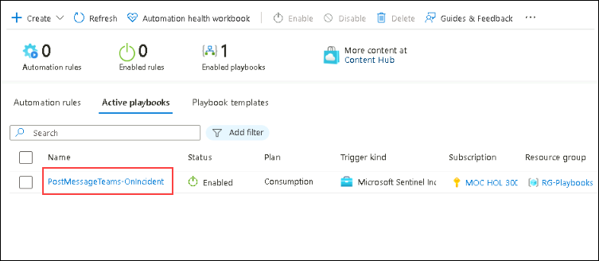
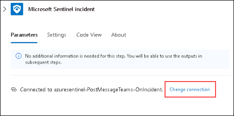
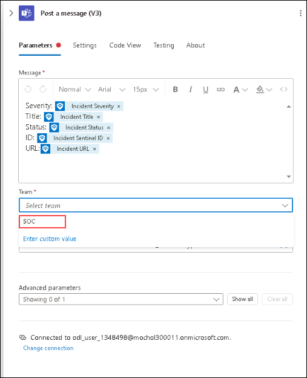

# Module 7 - Lab 1 - Exercise 2 - Create a Playbook

### Task 1: Create a Security Operations Center Team in Microsoft Teams.

In this task, you will create a Microsoft Teams team for use in the lab.

1. In the Edge browser, open a new window and navigate to the Microsoft Teams portal at (https://teams.microsoft.com).

1. In the **Sign in** dialog box, copy and paste in the **Username** provided in the environment details page (odl_user_DID@xxxxx.onmicrosoft.com) and then select Next.

1. In the **Enter password** dialog box, copy and paste in the Password and then select **Sign in**.

1. Close any Teams pop-ups that may appear.

    >**Note:** If prompted to use **New Teams** accept and proceed with the exercise.

1. If not already selected, select **Teams** on the left menu, then at the top, select the **+** icon.

1. Select the **Create Team** option.

1. Select the **From scratch** button.

1. Select the **Private** button.

1. Give the team the name: type **SOC** and select the **Create** button.

1. In the Add members to SOC screen, select the **Skip** button. 

1. Scroll down the Teams blade to locate the newly created SOC team, select the ellipsis **(...)** on the right side of the name and select **Add channel**.

1. Enter a channel name of *New Alerts* and channel type choose it as private then select the **Add** button.

### Task 2: Create a Playbook in Microsoft Sentinel

In this task, you'll create a Logic App that is used as a Playbook in Microsoft Sentinel.

1. In the Microsoft Edge browser, navigate to [Microsoft Sentinel on GitHub](https://github.com/Azure/Azure-Sentinel).

1. Scroll down and select the **Solutions** folder.

1. Next select the **SentinelSOARessentials** folder, then the **Playbooks** folder.

1. Select the **Post-Message-Teams** folder.

1. In the readme.md box, scroll down to the *Quick Deployment* section, Under **Deploy with incident trigger (recommended)**  select the **Deploy to Azure** button.  

   

1. Make sure your Azure Subscription is selected.

1. For Resource Group, select **Create New**, enter *RG-Playbooks* and select **OK**.

1. Leave **(US) East US** as the default value for *Region*.

1. Rename the *Playbook Name* to "PostMessageTeams-OnIncident" and select **Review + create**.

1. Now select **Create**. 

    >**Note:** Wait for the deployment to finish before proceeding to the next task.

### Task 3: Update a Playbook in Microsoft Sentinel

In this task, you'll update the new playbook you created with the proper connection information.

1. In the Search bar of the Azure portal, type *Sentinel*, then select **Microsoft Sentinel**.

1. Select **uniquenameDefender** Microsoft Sentinel Workspace.

1. Select **Automation** under the *Configuration* area and then select the **Active Playbooks** tab.

1. Select **Refresh** from the command bar in case you don't see any playbooks. You should see the playbook created from the previous step.

1. Select the **PostMessageTeams-Onincident** playbook name.

   

1. On the Logic App page for *PostMessageTeams-Onincident*, in the command menu, select **Edit**.

    >**Note:** You may need to refresh the page.

1. Select the *first* block, **Microsoft Sentinel incident**.

1. Select the **Change connection** link.

   

1. Select **Add new** and select **Sign in**. In the new window, select your Azure subscription admin credentials when prompted. The last line of the block should now read "Connected to your-admin-username".

1. Now select the *second* block, **Post a message (V3)**.

1. In the Prameters tab, scroll down and select the **Change connection** link and then select **Add new** and **Sign in**. Chose your Azure admin credentials when prompted. The Prameters tab should now read "Connected to your-admin-username".

1. At the end of the *Team* field, select the **X** to clear the contents. The field is changed to a drop-down with a listing of the available Teams from Microsoft Teams. Select **SOC**.

   

1. Do the same for the *Channel* field, select the **X** at the end of the field to clear the contents. The field is changed to a drop-down with a listing of the Channels of the SOC Teams. Select **New Alerts**.

   

1. Select **Save** on the command bar. The Logic App will be used in a future lab.

## Proceed to Exercise 3
