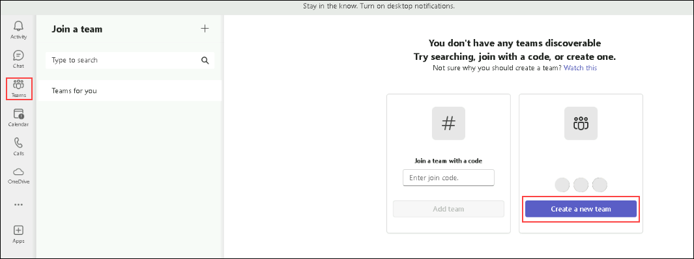
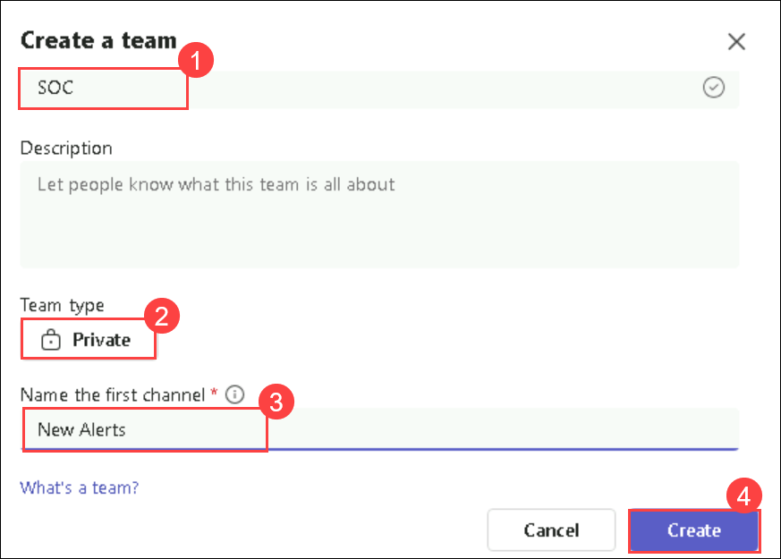
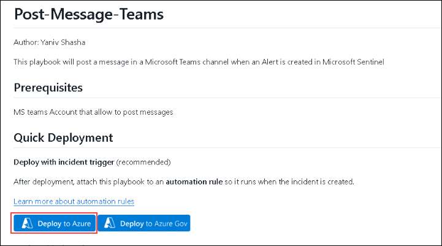
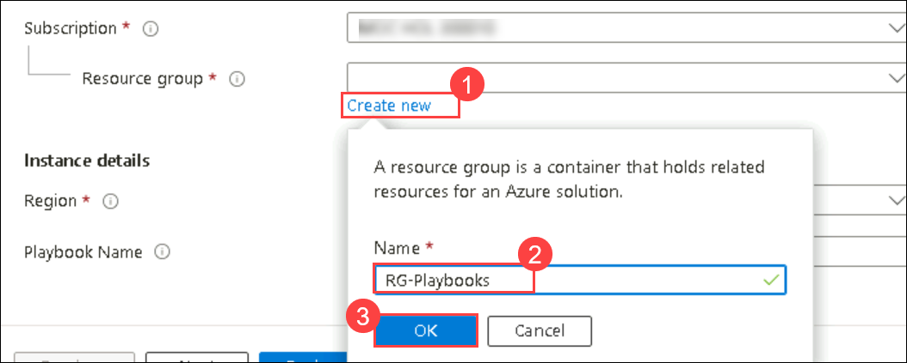
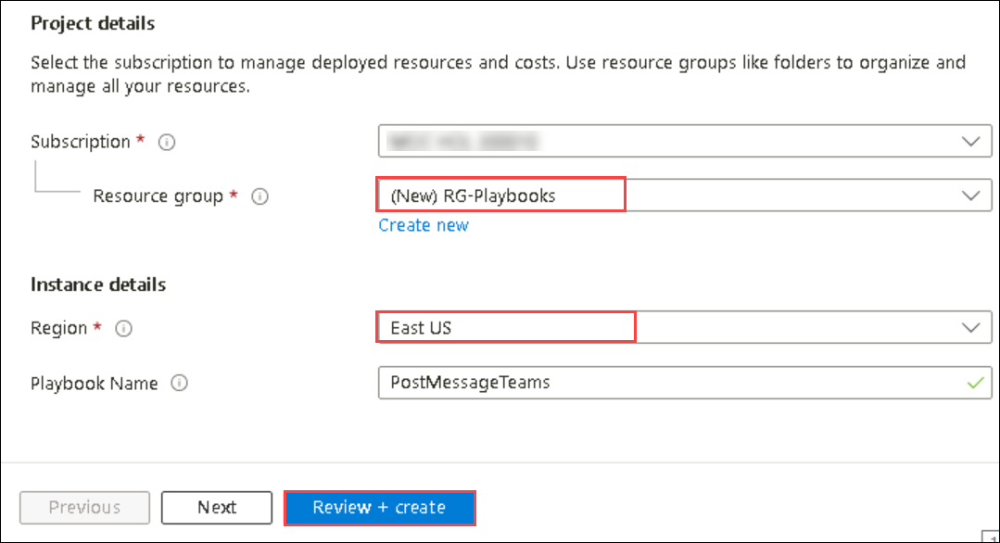
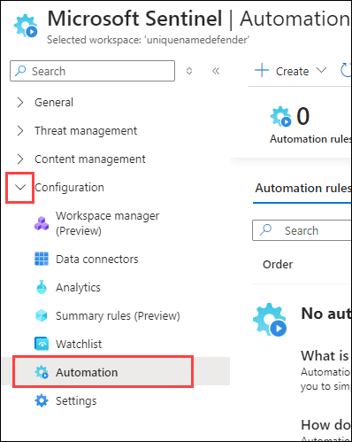
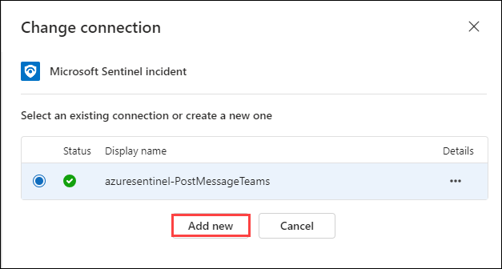
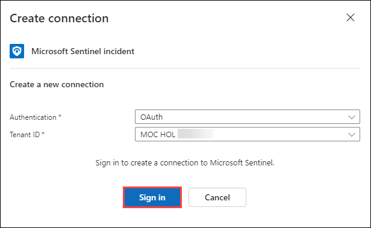
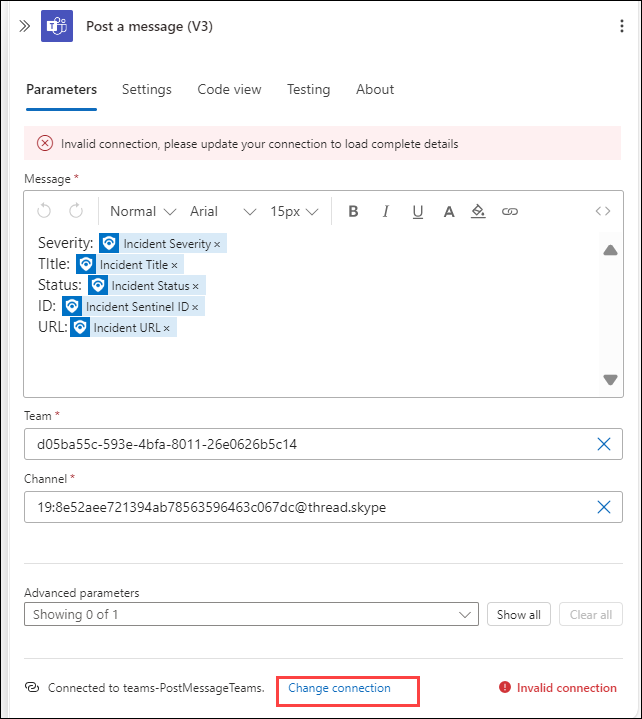
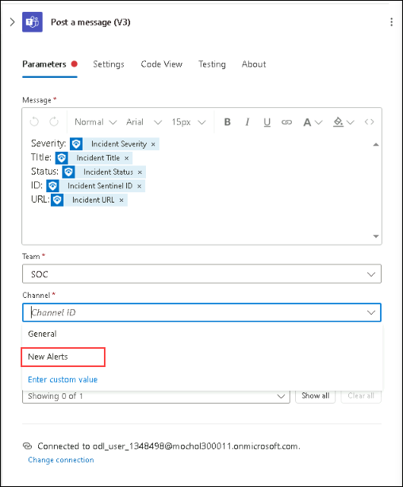

# Module 7 - Lab 1 - Exercise 2 - Create a Playbook

   

You're a Security Operations Analyst working at a company that implemented Microsoft Sentinel. You must learn how to detect and mitigate threats using Microsoft Sentinel. Now, you want to respond and reMediate actions that can be run from Microsoft Sentinel as a routine.

With a playbook, you can help automate and orchestrate your threat response, integrate with other systems both internal and external, and can be set to run automatically in response to specific alerts or incidents, when triggered by an analytics rule or an automation rule, respectively. 

>**Note:** An **[interactive lab simulation](https://mslabs.cloudguides.com/guides/SC-200%20Lab%20Simulation%20-%20Create%20a%20playbook)** is available that allows you to click through this lab at your own pace. You may find slight differences between the interactive simulation and the hosted lab, but the core concepts and ideas being demonstrated are the same.

## Objectives

After you complete this Exercise, you will be able to:

-   Task 1: Create a Security Operations Center Team in Microsoft Teams.
-   Task 2: Create a Playbook in Microsoft Sentinel
-   Task 3: Update a Playbook in Microsoft Sentinel

### Task 1: Create a Security Operations Center Team in Microsoft Teams.

In this task, you will create a Microsoft Teams team for use in the lab.

1. Log in to WIN1 virtual machine as Admin with the password: **Pa55w.rd**.

   >**Note:** WIN1 virtual machine is the same one that your using in Excercise 1. only need to login if your logged out otherwise no need to login again.
   
1. In the Edge browser, open a new window and navigate to the Microsoft Teams portal at (https://teams.microsoft.com).

   >**Note:** If prompted, in the **Sign in** dialog box, copy and paste the **Username** and **Password** from the Environment Tab and then select **Sign in**.

1. Close any Teams pop-ups that may appear.

    >**Note:** If prompted to use **New Teams** accept and proceed with the exercise.

1. If not already selected, select **Teams** on the left menu.

1. Select the **Create a new Team** option.

   

1. Select the **From scratch** button.

1. On the **Create a team** page, provide the team name as **SOC (1)**, select the Team type as **Private (2)** then **Name the first channel** as  **New Alerts (3)** and then click **Create (4).**

    

1. In the Add members to SOC screen, select the **Skip** button. 

### Task 2: Create a Playbook in Microsoft Sentinel

In this task, you'll create a Logic App that is used as a Playbook in Microsoft Sentinel.

1. In the Microsoft Edge browser, navigate to [Microsoft Sentinel on GitHub](https://github.com/Azure/Azure-Sentinel).

1. Scroll down and select the **Solutions** folder.

1. Next select the **SentinelSOARessentials** folder, then the **Playbooks** folder.

1. Select the **Post-Message-Teams** folder.

1. In the readme.md box, scroll down to the *Quick Deployment* section, Under **Deploy with incident trigger (recommended)**  select the **Deploy to Azure** button.  

   

1. Make sure your Azure Subscription is selected.

1. For Resource Group, select **Create New (1)**, enter *RG-Playbooks* **(2)** and select **OK (3)**.

    

1. Leave **(US) East US** as the default value for *Region*.

1. Rename the *Playbook Name* to "PostMessageTeams-OnIncident" and select **Review + create**.

    

1. Now select **Create**. 

    >**Note:** Wait for the deployment to finish before proceeding to the next task.

   > **Congratulations** on completing the task! Now, it's time to validate it. Here are the steps:
   - If you receive a success message, you can proceed to the next task.
   - If not, carefully read the error message and retry the step, following the instructions in the lab guide.
   - If you need any assistance, please contact us at cloudlabs-support@spektrasystems.com. We are available 24/7 to help you out.
 
   <validation step="e223dcc1-aab5-40f3-98a3-dc78a47e2e34" />

### Task 3: Update a Playbook in Microsoft Sentinel

In this task, you'll update the new playbook you created with the proper connection information.

1. In the Search bar of the Azure portal, type *Sentinel*, then select **Microsoft Sentinel**.

1. Select **uniquenameDefender** Microsoft Sentinel Workspace.

1. Select **Automation** under the *Configuration* area.

    

1. Select the **Active Playbooks** tab. click **Refresh** from the command bar in case you don't see any playbooks. You should see the playbook created from the previous step.

1. Select the **PostMessageTeams-Onincident** playbook name.

   

1. On the Logic App page for *PostMessageTeams-Onincident*, in the command menu, select **Edit**.

    >**Note:** You may need to refresh the page.

1. Select the *first* block, **Microsoft Sentinel incident**.

1. Select the **Change connection** link.

   

1. Select **Add new** and select **Sign in**.
   
    
    

1. In the new window, select your Azure subscription admin credentials (odl username) when prompted. The last line of the block should now read "Connected to your-admin-username".

    

   >**Note:** If you face a pop-up blocker from the browser allow it and try to authenticate again.

1. Now select the *second* block, **Post a message (V3)**.

1. In the Parameters tab, scroll down and select the **Change connection** link and then select **Add new** and **Sign in**. Choose your Azure admin credentials (odl username) when prompted. The Parameters tab should now read "Connected to your-admin-username".

    

1. At the end of the *Team* field, select the **X** to clear the contents. The field is changed to a drop-down with a listing of the available Teams from Microsoft Teams. Select **SOC**.

   

1. Do the same for the *Channel* field, select the **X** at the end of the field to clear the contents. The field is changed to a drop-down with a listing of the Channels of the SOC Teams. Select **New Alerts**.

   

1. Select **Save** on the command bar. The Logic App will be used in a future lab.

   

## Review

 In this exercise, you established essential security components. You began by creating a Security Operations Center (SOC) team in Microsoft Teams to facilitate communication, followed by creating and updating a playbook in Microsoft Sentinel to streamline and improve security incident response.

## Proceed to Exercise 3
