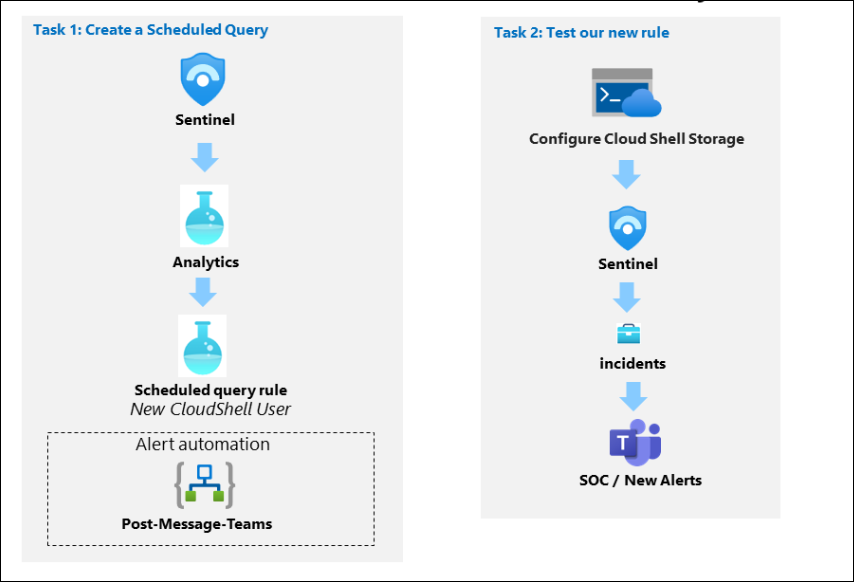
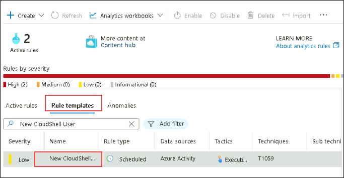
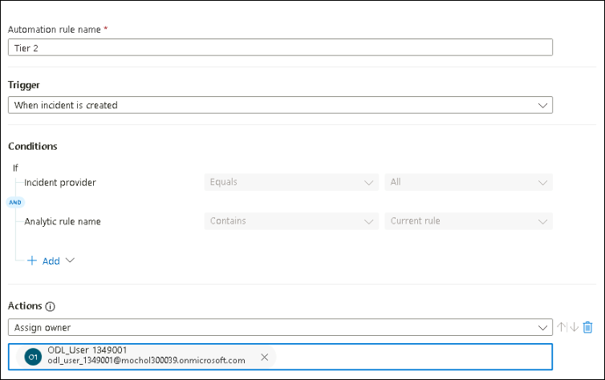
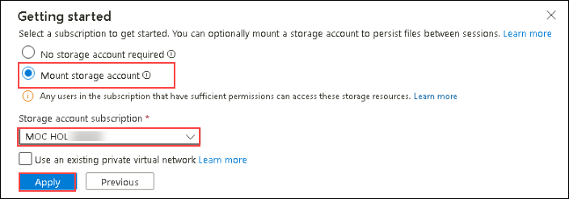
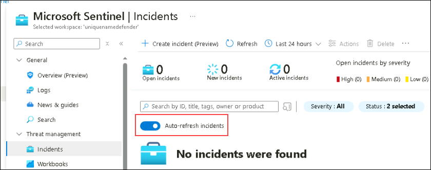

# Module 7 - Lab 1 - Exercise 3 - Create a Scheduled Query from a template

   

You're a Security Operations Analyst working at a company that implemented Microsoft Sentinel. You must learn how to detect and mitigate threats using Microsoft Sentinel. After connecting your data sources to Microsoft Sentinel, you create custom analytics rules to help discover threats and anomalous behaviors in your environment.

Analytics rules search for specific events or sets of events across your environment, alert you when certain event thresholds or conditions are reached, generate incidents for your SOC to triage and investigate, and respond to threats with automated tracking and reMediation processes.

>**Note:** An **[interactive lab simulation](https://mslabs.cloudguides.com/guides/SC-200%20Lab%20Simulation%20-%20Create%20a%20scheduled%20query)** is available that allows you to click through this lab at your own pace. You may find slight differences between the interactive simulation and the hosted lab, but the core concepts and ideas being demonstrated are the same. 
   

### Task 1: Connect the Azure Activity connector.

In this task, you will connect the Azure Activity connector.

1. Log in to WIN1 virtual machine as Admin with the password: Pa55w.rd.

1. In the Sign in dialog box, copy and paste in the Tenant Email account provided by your lab hosting provider and then select Next.

1. In the Enter password dialog box, copy and paste in the Tenant Password provided by your lab hosting provider and then select Sign in.

1. In the Search bar of the Azure portal, type *Sentinel*, then select **Microsoft Sentinel**.

1. Select your Microsoft Sentinel Workspace.

1. Select **Content hub** under the Content management from the left pane.

1. Search for **Azure Activity** then select it and Click on **Install** from the right pane.     

1. From the Data Connectors Tab, search for the **Azure Activity** connector If doesn't appear just click refresh and select it from the list.

1. Select the **Open connector page** on the connector information blade.

1. In the Configuration area, scroll down and under "2. Connect your subscriptions..." select **Launch Azure Policy Assignment Wizard>**.

1. In the **Basics** tab, select the button with the three dots under **Scope** to select your subscription from the drop-down list and click **Select**.

1. Select the **Parameters** tab, choose your Microsoft Sentinel workspace from the **Primary Log Analytics workspace** drop-down list.

1. Select the **Remediation** tab and mark the **Create a remediation task** checkbox.

1. Select the **Review + Create** button to review the configuration.

1. Select **Create** to finish.

    >**Note:** The Azure Activity Connector Sometimes takes moretime than expected to show as connected in data connector tab after creating the azure policy assignment.

### Task 2: Create a Scheduled Query

In this task, you create a scheduled query and connect it to the Teams channel you created in the previous exercise.

1. In the Search bar of the Azure portal, type *Sentinel*, then select **Microsoft Sentinel**.

1. Select your Microsoft Sentinel Workspace.

1. Select **Analytics** from the Configuration area.

1. Make sure that you are in the *Rule templates* tab in the command bar and search for the **New CloudShell User** rule.

   

1. From the rule summary blade, make sure you're receiving data by reviewing the under *Data sources: Azure Activity*.

1. Select **Create rule** to continue.

   

1. In the Analytics rule wizard, on the *General* tab, change the *Severity* to **Medium**.

1. Select **Next: Set rule logic >** button:

1. For the rule query, select **View query results**. You shouldn't receive any results or any errors.

1. Close the *Logs* window by selecting the upper right **X** and select **OK** to discard to save changes to go back to the wizard.

1. Scroll down and under *Query scheduling* set the following:

    |Setting|Value|
    |---|---|
    |Run Query every|5 minutes|
    |Lookup data from the last|1 Days|

    >**Note:** We are purposely generating many incidents for the same data. This enables the Lab to use these alerts.

1. Under the *Alert threshold* area, leave the value unchanged since we want the alert to register every event.

1. Under the *Event grouping* area, leave the **Group all events into a single alert** as the selected option since we want to generate a single alert every time it runs, as long as the query returns more results than the specified alert threshold above.

1. Select the **Next: Incident settings >** button. 

1. On the *Incident settings* tab, review the default options.

1. Select the **Next: Automated response >** button.

1. On the *Automated response* tab under *Automation rules*, select **Add new**.

1. For the *Automation rule name*, enter **Tier 2**.

1. For the *Actions*, select **Assign owner**.

1. Then select **<inject key="AzureAdUserEmail"></inject>**. Then select **+ Add action**.

   

1. Use the *And then* drop-down menus to select **Run playbook**.

1. A second drop-down menu appears with an *Information (i)* message regarding playbook permissions and a **Manage playbook permissions link**.

    >**Note:** The playbooks will appear grayed out in the drop-down list until permissions are configured.

1. Select the **Manage playbook permissions link**

1. On the *Manage Permissions* page, select the **RG-Playbooks** resource group you created in the previous lab, and select **Apply**.

1. From the drop-down menu, select the playbook **PostMessageTeams-OnIncident** you created in the previous exercise.

   

1. Select **Apply**.

1. Select the **Next: Review and create >** button.
  
1. Select **Save**.

### Task 3: Test your new rule

In this task, you test your new scheduled query rule.

1. In the top bar of the Azure portal, Select the icon **>_** that corresponds to the Cloud Shell. You might need to select the ellipsis icon first **(...)** if your display resolution is too low.

   

1. In the *Welcome to Azure Cloud Shell* window, select **Powershell**.

1. On the *Getting started* page, select **Mount storage account**, and then select your **Subscription** from the *storage account subscription* drop-down menu item and select the **Apply** button.

   

   >**Important:** Do not select the *No storage account required* radio button option. This will cause the incident creation to fail.

1. On the *Mount storage account* page, select **We will create a storage account for you**, and then select **Next**.

1. Wait until the Cloud Shell is provisioned, then close the Azure Cloud Shell window.

1. In the Search bar of the Azure portal, type *Activity* and then select **Activity Log**.

1. Make sure the following *Operation name* items appear: **List Storage Account Keys** and **Update Storage Account Create**. These are the operations that the KQL query you reviewed earlier will match to generate the alert. **Hint:** You might need to select **Refresh** to update the list.

    >**Note:** You might not see the output of the logs at the Activity log, this might take sometime 30 mins or longer.

1. In the Search bar of the Azure portal, type *Sentinel*, then select **Microsoft Sentinel**.

1. Select your Microsoft Sentinel Workspace.

1. Select the **Incidents** menu option under *Threat management*.

1. Select the **Auto-refresh incidents** toggle.

   

1. You should see the newly created Incident.

    >**Note:** The event that triggers the incident may take time to process. Continue with the next exercise, you will come back to this view later.

1. Select the Incident and review the information in the right blade.

1. Go back to Microsoft Teams by selecting the tab in your Microsoft Edge browser. If you closed it, just open a new tab and type https://teams.microsoft.com. Go to the *SOC* Teams, select the *New Alerts* channel and see the message post about the incident.

## Proceed to Exercise 4
