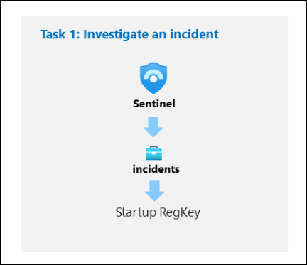

# Module 7 - Lab 1 - Exercise 8 - Investigate Incidents

   

### Task 1: Investigate an incident.

In this task, you will investigate an incident.

1. Log in to the WIN1 virtual machine with the password as provided in the Environment tab.  

1. In the Edge browser, navigate to the Azure portal at https://portal.azure.com.

1. In the **Sign in** dialog box, copy and paste in the **Username** provided in the environment details page (odl_user_DID@xxxxx.onmicrosoft.com) and then select Next.

1. In the **Enter password** dialog box, copy and paste in the Password and then select **Sign in**.

1. In the Search bar of the Azure portal, type *Sentinel*, then select **Microsoft Sentinel**.

1. Select the Microsoft Sentinel Workspace you created earlier.

1. Select the **Incidents** tab from Threat management area.

1. Review the list of Incidents

    **Note:** The analytical rules are generating alerts and incidents on the same specific log entry.  This is done to generate more alerts and incidents to be utilized in the lab.
    
1. Select one of the **Startup RegKey** incidents.

1. Review the incident details on the right blade that opened. Scroll down and select the **View full details** button.

1. On the left blade of the incident, change the Status to **Active** and then select **Apply**.

1. Scroll down to the *Tags* area, select **+** and type **RegKey** and select **OK**.

1. On the middle pane, select the tab **Comments** tab.

1. Type in the comments box: *I will research this* and select the **Comment** button to submit the new comment.

1. Review the Incident timeline window. Select the Incident Actions button at top-right and then Run playbook. You will see the PostMessageTeams-OnIncident playbook. This option help you to run playbooks manually.

1. Close the Run playbook on incident blade by selecting the x icon in the top right.

1. Review the Entities window. At least the Host entity that we mapped within the KQL query from the previous exercise should appear. Hint: If no entities are shown, refresh the page.

1. Select the new **Tasks (Preview)** button from the command bar.

1. Select **+ Add task**, type **Review who owns the machine** in the Title box and select **Save**.

1. Close the *Incident tasks (Preview)* blade by selecting the **x** icon in the top right.

1. Select the new **Activity Log** button from the command bar.

1. Review the actions you have taken during this exercise.

1. Close the *Incident activity log* blade by selecting the **x** icon in the top right.

1. From the almost hidden left blade, select the user icon named **Unassigned**. The new incident experience allows quick changes from here.

1. Select **Assign to me** and then scroll down to select **Apply** to save the changes.

1. Expand the left blade by selecting the **>>** icon. and then select the **Investigate** button.

    >**Hint:** If the icons are too small for your screen, select **(+)** to magnify them.

1. From the left pane, scroll down and select the **Investigate** button. **Hint:** If the icons are too small for your screen, select **(+)** to magnify them.

1. **Hover** the **ODL_user_xxx@mocholxxxx.onmicrosoft.com** entity icon and wait for new *exploration queries* to be shown. It looks like *Related Alerts* has more data on it. Select the name of the exploration query **Related Alerts** to bring them to the investigation graph or select **Events >** to investigate them with a KQL query.

1.	When you select an entity, a window on the right opens for more detailed information. Review the **Info** page.

1. Select **Timeline** button. Hover the first two incidents and see which things on the graph occurred at what point in time.

1. Select **Entities** button and review the *Entities* and *Alerts* related to *ODL_user_xxx@mocholxxxx.onmicrosoft.com*.

1. Close the investigation graph by selecting the **X** in the top right of the page.
  
## Proceed to Exercise 9
