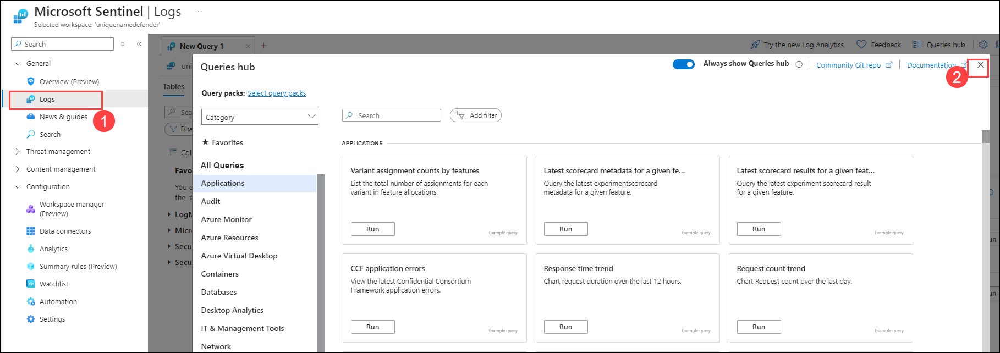
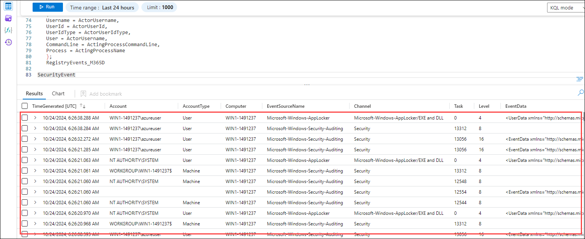
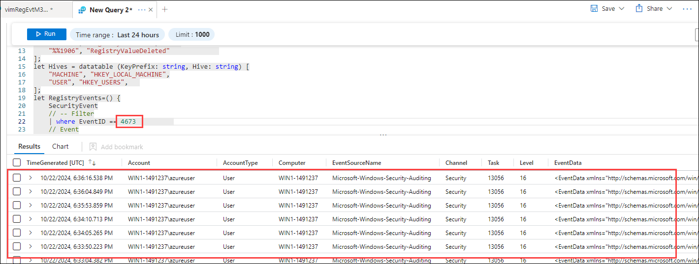

# Module 7 - Lab 1 - Exercise 7 - Create ASIM parsers

## Lab scenario


You are a Security Operations Analyst working at a company that implemented Microsoft Sentinel. You need to model ASIM parsers for a specific Windows registry event.  These simplified parsers will be finalized at a later time following the ASIM parser registry event normalization standard (https://docs.microsoft.com/en-us/azure/sentinel/registry-event-normalization-schema).

>**Important:** This lab involves entering lengthy KQL ASIM parser scripts into Microsoft Sentinel. The scripts were provided via download files at the beginning of this lab. An alternate location to download them is:  https://github.com/MicrosoftLearning/SC-200T00A-Microsoft-Security-Operations-Analyst/tree/master/Allfiles


## Objectives

After you complete this Exercise, you will be able to:

-   Task 1: Develop KQL Function for Microsoft 365 Defender Registry Event 
-   Task 2: Develop KQL Function for SecurityEvent table.
-   Task 3: Create a unifying workspace parser. 


### Task 1: Develop KQL Function for Microsoft 365 Defender Registry Event 

In this task, you create a function that is a workspace parser for DeviceRegistryEvents. 

1. Login to the WIN1 virtual machine with the password as provided in the environment tab.   

1. In the Edge browser, navigate to the Azure portal at https://portal.azure.com.

   >**Note:** If prompted to sign in, In the **Sign in** dialog box, copy and paste the **Username** and **Password** from the Environment tab and select **Sign in**.

1. In the Search bar of the Azure portal, type *Sentinel*, then select **Microsoft Sentinel**.

1. Select the Microsoft Sentinel Workspace you created earlier.

1. Select the **Logs (1)** under **General** section. close the **Queries hub** page by clicking on **X (2).**

    

1. Click on **Try the new Log Analytics** on the top right corner.

    

1. Change the mode to **KQL mode.**

    

1. Copy and paste the  KQL statements into a new query tab.

    ```KQL
       let RegistryType = datatable (TypeCode: string, TypeName: string) [
       "None", "Reg_None",
       "String", "Reg_Sz",
       "ExpandString", "Reg_Expand_Sz",
       "Binary", "Reg_Binary",
       "Dword", "Reg_DWord",
       "MultiString", "Reg_Multi_Sz",
       "QWord", "Reg_QWord"
       ];
       let RegistryEvents_M365D=() {
       DeviceRegistryEvents
       | extend
           // Event
           EventOriginalUid = tostring(ReportId), 
           EventCount = int(1), 
           EventProduct = 'M365 Defender for Endpoint', 
           EventVendor = 'Microsoft', 
           EventSchemaVersion = '0.1.0', 
           EventStartTime = TimeGenerated, 
           EventEndTime = TimeGenerated, 
           EventType = ActionType,
           // Registry
           RegistryKey = iff (ActionType in ("Reunion isfuzzy=true
   vimRegEvtM365D,
   vimRegEvtSecurityEventgistryKeyDeleted", "RegistryValueDeleted"), PreviousRegistryKey, RegistryKey),
           RegistryValue = iff (ActionType == "RegistryValueDeleted", PreviousRegistryValueName, RegistryValueName),
           // RegistryValueType -- original name is fine 
           // RegistryValueData -- original name is fine 
           RegistryKeyModified = iff (ActionType == "RegistryKeyRenamed", PreviousRegistryKey, ""),
           RegistryValueModified = iff (ActionType == "RegistryValueSet", PreviousRegistryValueName, ""),
           // RegistryValueTypeModified -- Not provided by Defender
           RegistryValueDataModified = PreviousRegistryValueData
       | lookup RegistryType on $left.RegistryValueType == $right.TypeCode
       | extend RegistryValueType = TypeName
       | project-away
           TypeName,
           PreviousRegistryKey,
           PreviousRegistryValueName,
           PreviousRegistryValueData
       // Device
       | extend
           DvcHostname = DeviceName, 
           DvcId = DeviceId, 
           Dvc = DeviceName 
       // Users
       | extend
           ActorUsername = iff (InitiatingProcessAccountDomain == '', InitiatingProcessAccountName, strcat(InitiatingProcessAccountDomain, '\\', InitiatingProcessAccountName)), 
           ActorUsernameType = iff(InitiatingProcessAccountDomain == '', 'Simple', 'Windows'), 
           ActorUserIdType = 'SID'
       | project-away InitiatingProcessAccountDomain, InitiatingProcessAccountName
       | project-rename
       ActorUserId = InitiatingProcessAccountSid, 
       ActorUserAadId = InitiatingProcessAccountObjectId, 
       ActorUserUpn = InitiatingProcessAccountUpn
       // Processes
       | extend
       ActingProcessId = tostring(InitiatingProcessId), 
       ParentProcessId = tostring(InitiatingProcessParentId) 
       | project-away InitiatingProcessId, InitiatingProcessParentId
       | project-rename
       ParentProcessName = InitiatingProcessParentFileName, 
       ParentProcessCreationTime = InitiatingProcessParentCreationTime, 
       ActingProcessName = InitiatingProcessFolderPath, 
       ActingProcessFileName = InitiatingProcessFileName,
       ActingProcessCommandLine = InitiatingProcessCommandLine, 
       ActingProcessMD5 = InitiatingProcessMD5, 
       ActingProcessSHA1 = InitiatingProcessSHA1, //OK
       ActingProcessSHA256 = InitiatingProcessSHA256, 
       ActingProcessIntegrityLevel = InitiatingProcessIntegrityLevel, 
       ActingProcessTokenElevation = InitiatingProcessTokenElevation, 
       ActingProcessCreationTime = InitiatingProcessCreationTime 
       // -- aliases
       | extend 
       Username = ActorUsername,
       UserId = ActorUserId,
       UserIdType = ActorUserIdType,
       User = ActorUsername,
       CommandLine = ActingProcessCommandLine,
       Process = ActingProcessName
       };
       RegistryEvents_M365D
    
    SecurityEvent
    ```

1. Select **Run** to confirm the KQL is valid.

    

1. Select **Save (1)** drop down, then **Save as function (2)**.

    

1. Under *Save as function* set the following then click on **Save (3).**

    |Setting|Value|
    |---|---|
    |Function name|vimRegEvtM365D **(1)**|
    |Legacy Category|MyASIM **(2)**|

        

     >**Note**: IF the Above query did not provide any output, it might take sometime for sentinel to gather the logs from the backend. meanwhile we can proceed with the next task and come back later after sometime.

### Task 2: Develop KQL Function for SecurityEvent table. 

In this task, you create a function that is a workspace parser for SecurityEvent.

1. Create a new query tab.

    >**Note**: Make sure to set the mode to **KQL Mode.**

1. Copy and paste the KQL statements into the new query tab.

    ```KQL
    let RegistryType = datatable (TypeCode: string, TypeName: string) [
    "%%1872", "Reg_None",
    "%%1873", "Reg_Sz",
    "%%1874", "Reg_Expand_Sz",
    "%%1875", "Reg_Binary",
    "%%1876", "Reg_DWord",
    "%%1879", "Reg_Multi_Sz",
    "%%1883", "Reg_QWord"
    ];
    let RegistryAction = datatable (EventOriginalSubType: string, EventType: string) [
        "%%1904", "RegistryValueSet",
        "%%1905", "RegistryValueSet",      
        "%%1906", "RegistryValueDeleted"             
    ];
    let Hives = datatable (KeyPrefix: string, Hive: string) [
        "MACHINE", "HKEY_LOCAL_MACHINE",
        "USER", "HKEY_USERS",   
    ];
    let RegistryEvents=() {
        SecurityEvent
        // -- Filter
        | where EventID == 4657          
        // Event
        | extend
            EventCount = int(1), 
            EventVendor = 'Microsoft', 
            EventProduct = 'Security Events', 
            EventSchemaVersion = '0.1.0', 
            EventStartTime = todatetime(TimeGenerated), 
            EventEndTime = todatetime(TimeGenerated),
            EventOriginalType = tostring(EventID) 
        | project-rename
            EventOriginalSubType = OperationType,
            EventOriginalUid = EventOriginId
        | lookup RegistryAction on EventOriginalSubType
        // Registry
        // Normalize key hive
        | parse ObjectName with "\\REGISTRY\\" KeyPrefix "\\" Key
        | lookup Hives on KeyPrefix
        | extend RegistryKey = strcat (Hive, "\\", Key)
        | project-away Hive, Key, KeyPrefix, ObjectName
        | project-rename
            RegistryValue = ObjectValueName
        | extend
            RegistryValueData = iff (EventOriginalSubType == "%%1906", OldValue, NewValue), 
            RegistryKeyModified = iff (EventOriginalSubType == "%%1905", RegistryKey, ""),
            RegistryValueModified = iff (EventOriginalSubType == "%%1905", RegistryValue, ""),
            RegistryValueDataModified = iff (EventOriginalSubType == "%%1905", OldValue, "")
        | lookup RegistryType on $left.NewValueType == $right.TypeCode
        | project-rename RegistryValueType = TypeName
        | lookup RegistryType on $left.OldValueType == $right.TypeCode
        | project-rename RegistryValueTypeModified = TypeName
        | project-away OldValue, NewValue, OldValueType, NewValueType
        // Device
        | extend
            DvcId = SourceComputerId,
            DvcHostname = Computer,
            DvcOs = 'Windows'
        // User
        | project-rename
            ActorUserId = SubjectUserSid, 
            ActorSessionId = SubjectLogonId, 
            ActorDomainName = SubjectDomainName
        | extend
            ActorUserIdType = 'SID',
            ActorUsername = iff (ActorDomainName == '-', SubjectUserName, SubjectAccount), 
            ActorUsernameType = iff(ActorDomainName == '-', 'Simple', 'Windows'),
            ActingProcessId = tostring(toint(ProcessId)) 
        // Process 
        | project-rename
            ActingProcessName = ProcessName
        // -- Aliases
        | extend
            User = ActorUsername,
            UserId = ActorUserId,
            Dvc = DvcHostname,
            Process = ActingProcessName
        // -- Remove potentially confusing
        | project-away 
            SubjectUserName,
            SubjectAccount
    };
    RegistryEvents
    ```

1. Select **Run** to confirm the KQL is valid.

    >**Note**: Make sure you replace the EventID which need to be copied from the KQL query 1 table by scrolling to the right and replace the 2nd KQL query with that event id.

        

1. Select **Save**, then **Save as function**.

1. Under *Save as function* set the following:

    |Setting|Value|
    |---|---|
    |Function name|vimRegEvtSecurityEvent|
    |Legacy Category|MyASIM|

    >**Note**: Sometimes it will take a long time  to get the output, Meanwhile you can proceed with the next task.

1. Then select **Save**.

### Task 3: Create a unifying workspace parser. 

In this task, you create a unifying parser function that combines the previous two functions.  

1. Create a new query tab.

1. Enter the following KQL Statement in a new query tab:

    ```KQL
    union isfuzzy=true
    vimRegEvtM365D,
    vimRegEvtSecurityEvent
    ```

    >**Note**: Sometimes the ouput of the query might not come as expected. please proceed with the next exercise.    

1. Select **Run** to confirm the KQL is valid.

1. Select **Save**, then **Save as function**.

1. Under *Save as function* set the following:

    |Setting|Value|
    |---|---|
    |Function name|imRegEvt|
    |Legacy Category|MyASIM|

1. Then select **Save**.

1. In a new query tab, enter **imRegEvt** and select **Run**.

1. Update the query to the following and select **Run**:

    ```KQL
    imRegEvt
    | summarize Count = count() by AccountType
    ```

    >**Note**: Sometimes the ouput of the query might not come as expected. please proceed with the next exercise.

## Review

In this exercise, you developed KQL functions for both Microsoft 365 Defender registry events and the SecurityEvent table to streamline data analysis. You then created a unifying workspace parser to integrate and standardize log data across these sources for more efficient security monitoring.

## Proceed to Exercise 8
