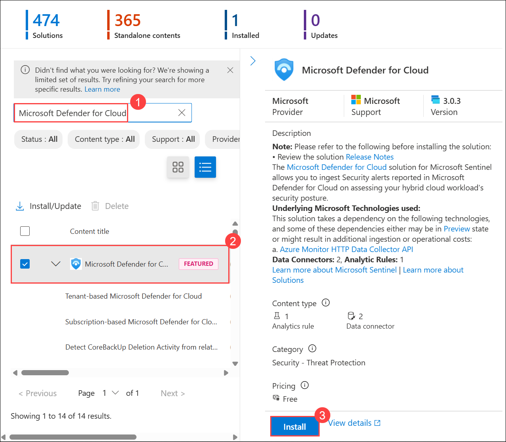
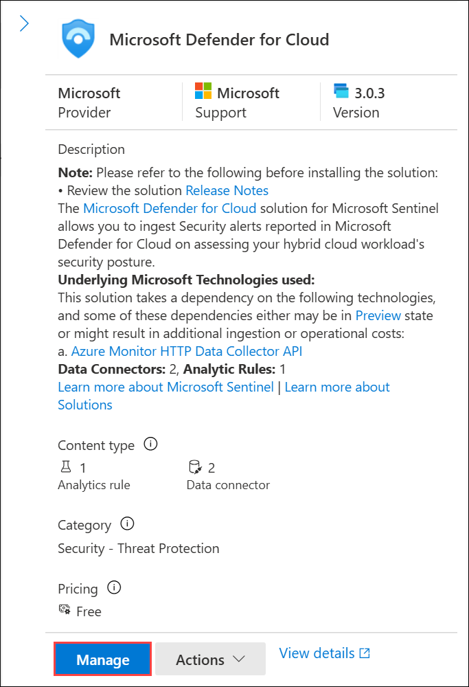
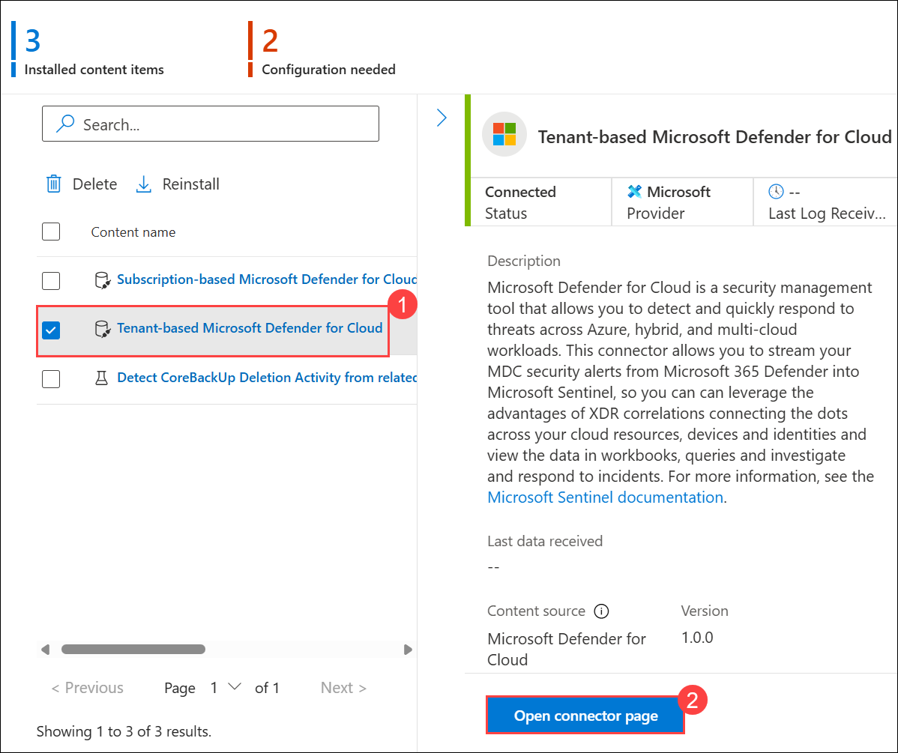
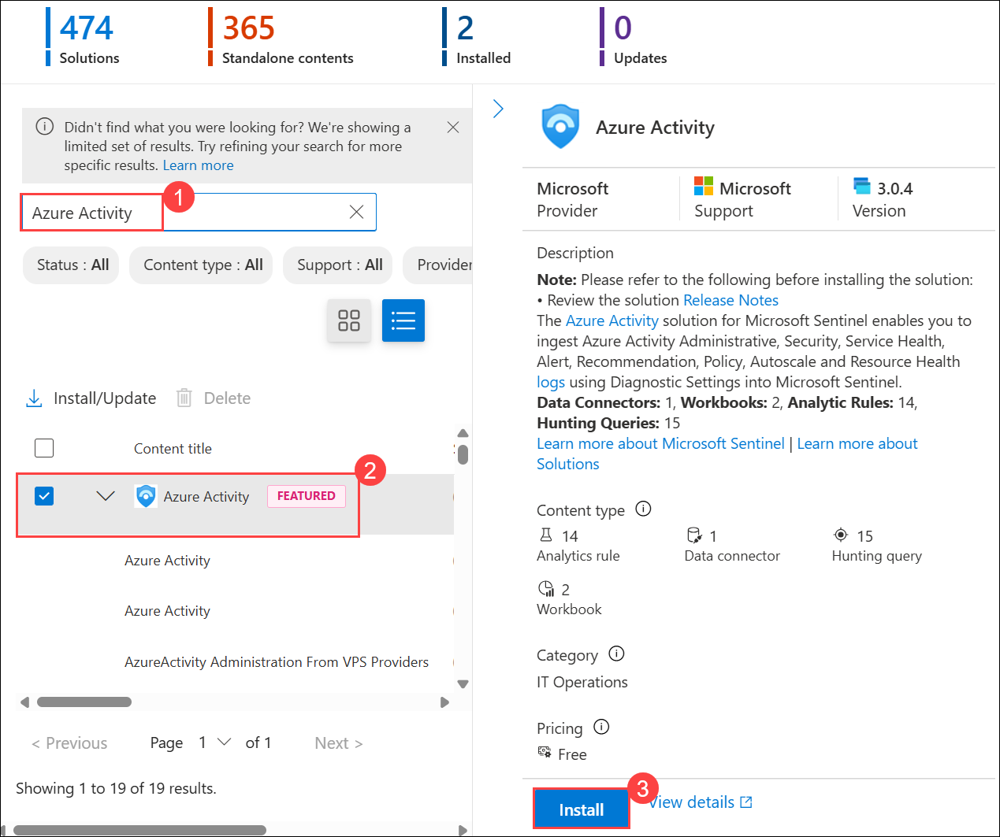
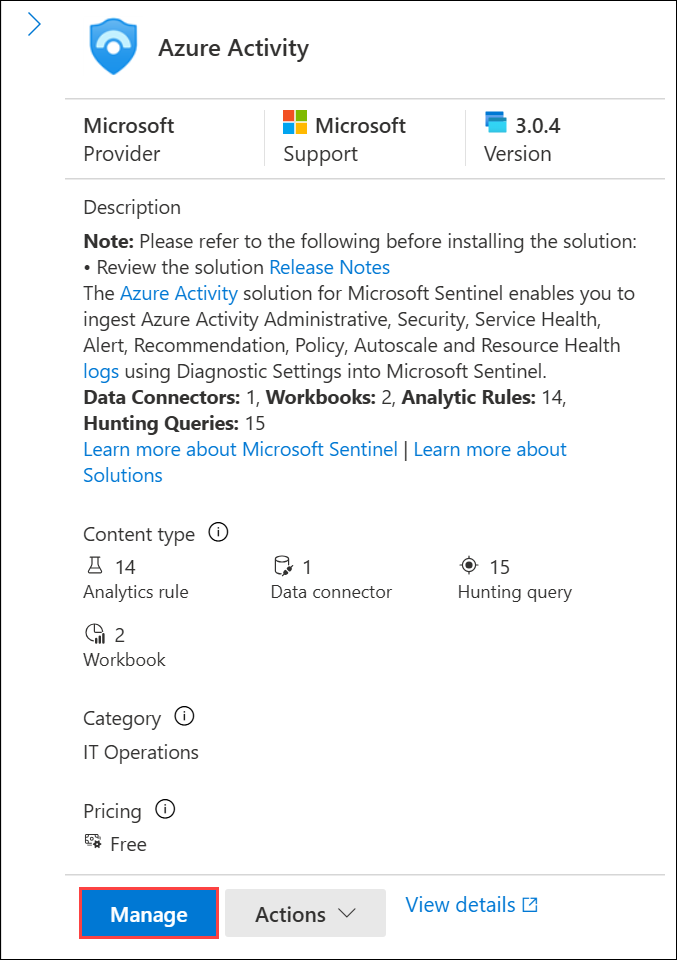
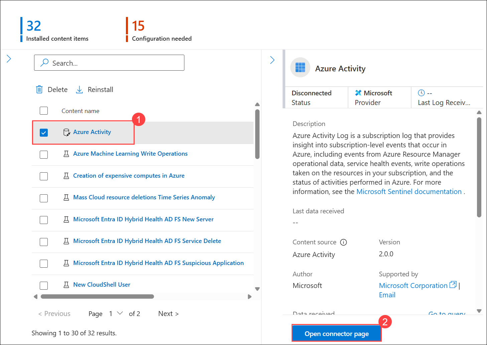
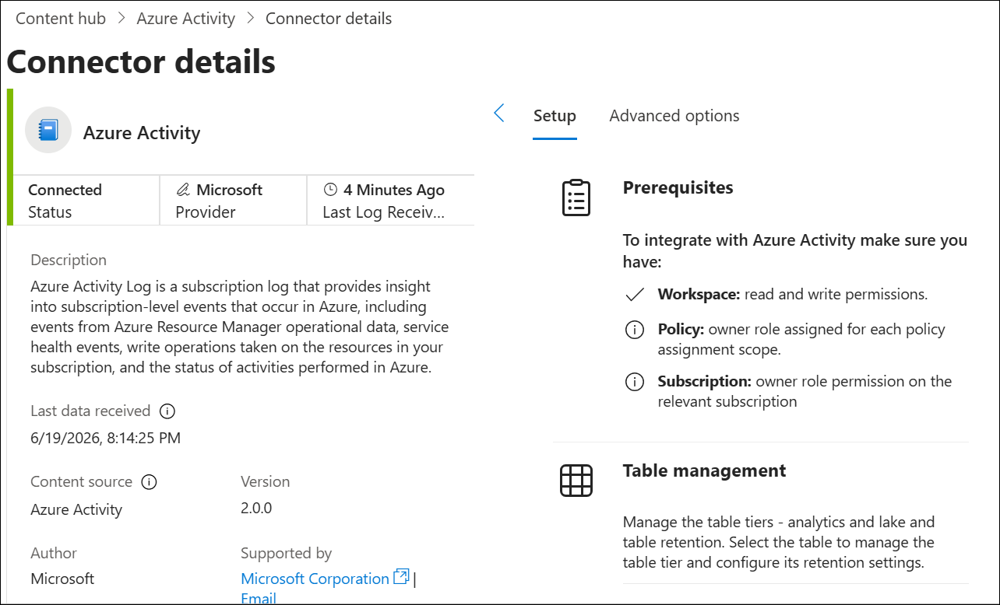
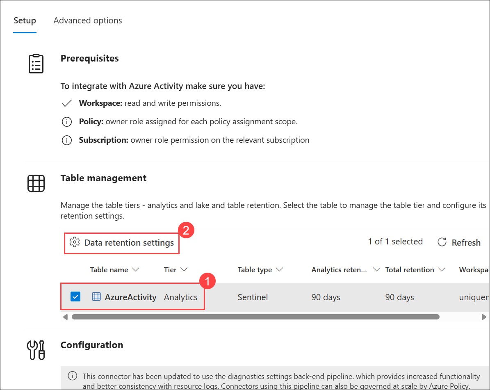
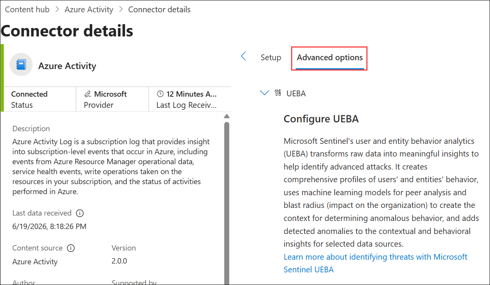

# Assignment-2: Connect data to Microsoft Sentinel using data connectors

## Lab Scenario

You are a Security Operations Analyst working at a company that implemented Microsoft Sentinel. You must learn how to connect log data from the many data sources in your organization. The organization has data from Microsoft 365, Microsoft 365 Defender, Azure resources, non-Azure virtual machines, etc. You start connecting the Microsoft sources first.

## Lab Objectives
 In this lab, you will perform the following:
- Task 1: Connect the Microsoft Defender for Cloud data connector
- Task 2: Connect the Azure Activity data connector

### Estimated Timing: 60 Minutes

## Architecture Diagram

  

### Task 1: Connect the Microsoft Defender for Cloud data connector

In this task, you will connect the Microsoft Defender for Cloud data connector.

1. On a new tab in the browser, go to **https://security.microsoft.com**.

1. Close the pop-up that appears.

    

1. On **Microsoft Defender** page, if the left navigation pane is collapsed, select **Show navigation** to expand it.

   

1. In the Microsoft Defender **Microsoft Sentinel (1)** navigation menu, scroll down to the **Content management (2)** section and select **Content Hub (3)**.

     

     > **Note:** If workspace is not connected, click on Connect workspace to connect. If no workspace is displayed initially, try refreshing the page using **Ctrl + F5**, signing out by selecting the circle with your initials in the top-right corner and choosing **Sign out**, and then signing back in using your **Tenant Email** credentials. You can also try opening the portal in **InPrivate/Incognito mode**. If the workspace is **already connected**, please **proceed to the next step**. 

     >**Note:** If the workspace is not populated with 5-10 minutes it may be an issue with the Defender portal. In that case, please contact Cloudlabs-Support@spektrasystems.com for assistance. 

     > **Important:** The total lab duration already includes any waiting time required for deployments, data connectors, or services (such as the **5–10 minutes** mentioned above). Please do not worry if certain steps take additional time to complete, and plan your activities accordingly while performing the lab.

1.  In the **Content hub**, search for the **Microsoft Defender for Cloud (1)** solution and select **Microsoft Defender for Cloud (2)** from the list.

1. On the **Microsoft Defender for Cloud** solution details page select **Install (3)**.

   

    > **Note:** If the **Content hub** page does not load, refresh the browser until it appears.  

1. When the installation completes,  search for the **Microsoft Defender for Cloud** solution and select it.

1. On the **Microsoft Defender for Cloud** solution details page select **Manage**.

    

    >**Note:** The **Microsoft Defender for Cloud** solution installs the **Subscription-based Microsoft Defender for Cloud (Legacy)** Data connector, the **Tenant-based Microsoft Defender for Cloud (Preview)** Data connector, and an **Analytics rule**. The **Tenant-based Microsoft Defender for Cloud** Data connector is used when a tenant has multiple subscriptions.

1. Select the **Back** arrow to view the content items and access the connector page.

     

1. Select the **Tenant-based Microsoft Defender for Cloud (1)** Data connector check-box, and select **Open connector page (2)**.

   

1. A new browser tab will open on the Azure portal Data Connector page. Verify that the **Tenant-based Microsoft Defender** for Cloud connector status shows **Connected**.

     

1. Review the Configuration section of the Instructions tab.

1. Note that "Microsoft Defender for Cloud alerts are connected to stream through the Microsoft 365 Defender" now, and that you "Cannot disconnect while Microsoft Defender XDR is connected".

1. Also note in the Details pane that the Data types use the SecurityAlert table.

1. You can now close this browser tab and return to Microsoft Defender XDR.

### Task 2: Connect the Azure Activity data connector

In this task, you will connect the **Azure Activity** data connector.

1. In the Microsoft Sentinel left menu, scroll down to the **Content management** section and select **Content Hub**.

1. In the **Content hub**, search for the **Azure Activity (1)** solution and select **Azure Activity (2)** from the list.

1. On the **Azure Activity** solution page select **Install (3)**.

   

    > **Note:** If the **Content hub** page does not load, refresh the browser until it appears.  

1. Select the **Back** arrow to view the content items and access the connector page.

     

1. When the installation completes select **Manage**.

    

    >**Note:** The **Azure Activity** solution installs the **Azure Activity** Data connector, 13 **Analytics rules**, 14 **Hunting queries**, and 1 **Workbook**.

1. Select the **Azure Activity (1)** Data connector and select **Open connector page (2)**.

    

1. In the **Configuration** area under the **Instructions** tab, scroll down to "2. Connect your subscriptions through diagnostic settings new pipeline", and select **Launch Azure Policy Assignment Wizard>**.

    

1. It will open in new tab, in the **Basics** tab, select the ellipsis button **(...) (1)** under **Scope** and select your **subscription (2)** from the drop-down list and click **Select (3)**.

    

1. Select **Parameters (1)**, click the workspace picker **(2)** for **Primary Log Analytics workspace**, choose **sentinelworkspace-01 (3)**, and then select **Select (4)**.

    

1. Select the **Remediation (1)** tab and select the **Create a remediation task (2)** checkbox. This action will apply the policy to existing Azure resources.

1. Select the **Review + Create (3)** button to review the configuration.

     

1. Select **Create** to finish.

   

1. Note that the status should show **Connected**.

    

    > **Note:** It may take 15–20 minutes for the Azure Activity data connector to show a Connected status after configuration.

    > **Note:** If the status does not show as connected after 15–20 minutes, close the tab, reopen it, and then check again.

1. In the **Setup** tab, Table management section, select the checkbox for the **AzureActivity (1)** table. The Gear wheel for Data retention settings appears.

1. Select the **Data retention settings (2)** and review the Manage AzureActivity settings in Analytics tier.

    

    > **Note:** This data connector is fully ported to Defender XDR.

1. Close out of the Manage AzureActivity page by selecting the X in the upper right corner.

1. Select the Advanced options tab at the top of page and review the Configure UEBA settings.

    

## Review
In this lab, you have completed the following:

- Created and accessed the Microsoft Sentinel Workspace
- Connected the Microsoft Defender for Cloud data connector
- Connected the Azure Activity data connector

### Congratulations, you’ve successfully completed the hands-on lab!

