# Lab 08 - Exercise 1: Connect data to Microsoft Sentinel using data connectors

## Lab Scenario

You are a Security Operations Analyst working at a company that implemented Microsoft Sentinel. You must learn how to connect log data from the many data sources in your organization. The organization has data from Microsoft 365, Microsoft 365 Defender, Azure resources, non-Azure virtual machines, etc. You start connecting the Microsoft sources first.

## Lab Objectives
 In this lab, you will perform the following:
- Task 1: Create the Microsoft Sentinel Workspace
- Task 2: Connect the Microsoft Defender for Cloud data connector
- Task 3: Connect the Azure Activity data connector

### Estimated Timing: 20 minutes

## Architecture Diagram

  

### Task 1: Create the Microsoft Sentinel Workspace

In this task, you will access your Microsoft Sentinel workspace.

1. In the Search bar of the Azure portal, type **Log Analytics (1)**, then select **Log Analytics workspaces (2)**.

   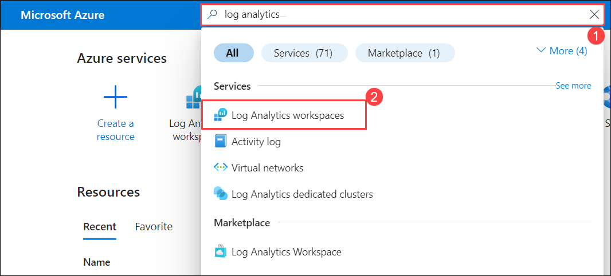

1. Select **+ Create** from the command bar.

   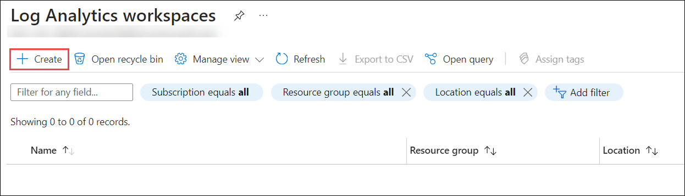

1. To create a **log analytics workspace**, follow these steps:

    - Select **rg-defender (1)** for the Resource group.
    - For the Name, enter **uniquenameDefender (2)**.
    - Leave the **default Region (3)**.
    - Select **Review + Create (4)**.

      

1. Once the workspace validation has passed, select **Create**.

   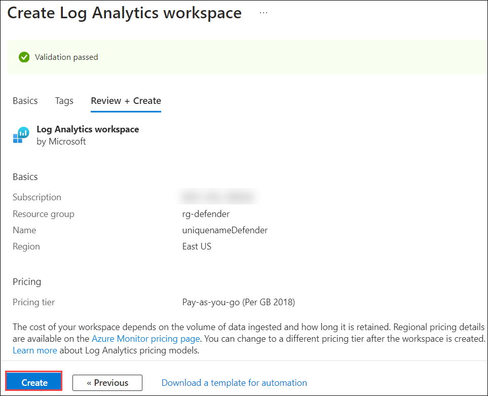

1. Wait for the new workspace to be provisioned, this may take a few minutes.
 
1. In the Search bar of the Azure portal, type **microsoft sentinel (1)**, then select **Microsoft Sentinel (2)**.

   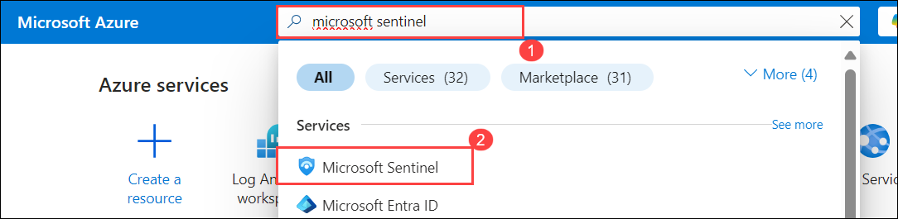

1. Select **+ Create** from the command bar.

 1. Select the newly created workspace **uniquenameDefender (1)** and click on **Add (1)**.
  
    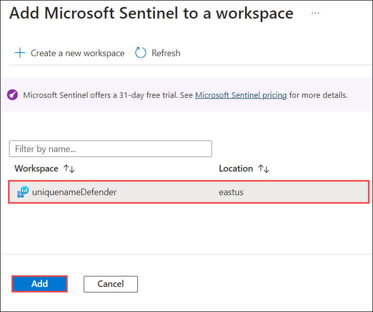

1. Select the **uniquenameDefender** microsoft Sentinel Workspace you created earlier.

   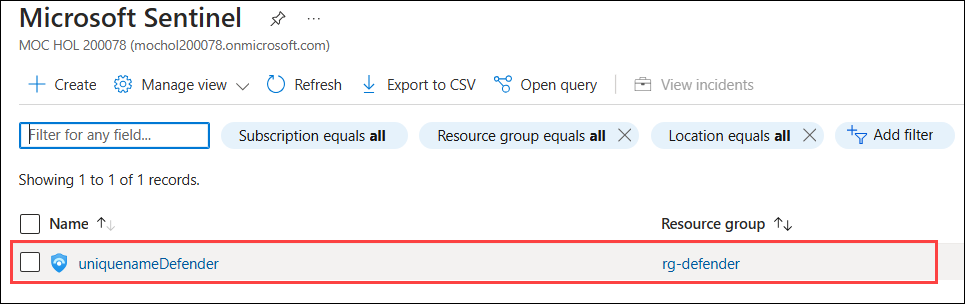

### Task 2: Connect the Microsoft Defender for Cloud data connector

In this task, you will connect the Microsoft Defender for Cloud data connector.

  >**Important:** To *Enable* Bi-directional sync, please rerun  **[Lab 05 Exercise 1](https://microsoftlearning.github.io/SC-200T00A-Microsoft-Security-Operations-Analyst/Instructions/Labs/LAB_AK_05_Lab1_Ex01_Enable_MDC.html)**, Task 2, and select **Setup** from the *Microsoft Defender for Cloud* navigation menu to verify all eligible Azure subscriptions are onboarded.

1. In the Microsoft Sentinel navigation menu, scroll down to the **Content management** section and select **Content Hub (1)**.

1.  In the **Content hub**, search for the **Microsoft Defender for Cloud (2)** solution and select **Microsoft Defender for Cloud (3)** from the list.

1. On the **Microsoft Defender for Cloud** solution details page select **Install (4)**.

   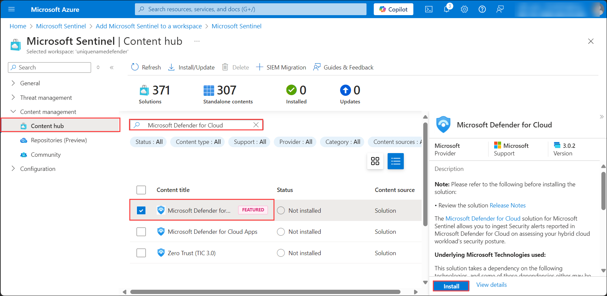

1. When the installation completes,  search for the **Microsoft Defender for Cloud** solution and select it.

1. On the **Microsoft Defender for Cloud** solution details page select **Manage**.

    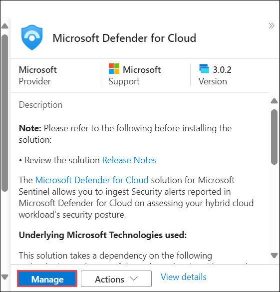

    >**Note:** The **Microsoft Defender for Cloud** solution installs the **Subscription-based Microsoft Defender for Cloud (Legacy)** Data connector, the **Tenant-based Microsoft Defender for Cloud (Preview)** Data connector, and an **Analytics rule**. The **Tenant-based Microsoft Defender for Cloud (Preview)** Data connector is used when a tenant has multiple subscriptions.

1. Select the **Subscription-based Microsoft Defender for Cloud (Legacy) (1)** Data connector check-box, and select **Open connector page (2)**.

   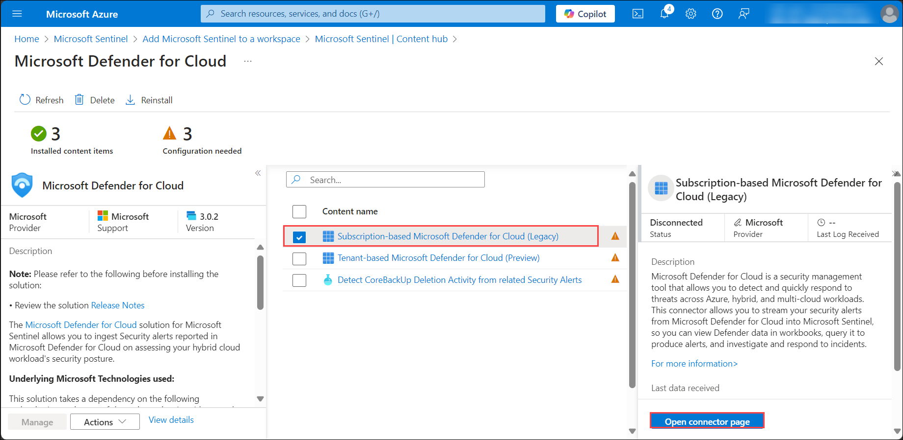

1. In the *Configuration* section, **select** the checkbox for the **Subscription** and either select the **Connect** link, or slide the **Status** option to the right

    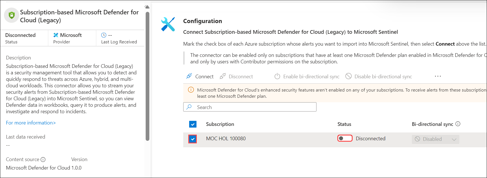

1. To enable bi-directional sync, select the **Enable Microsoft Defender for all subscriptions** link.

    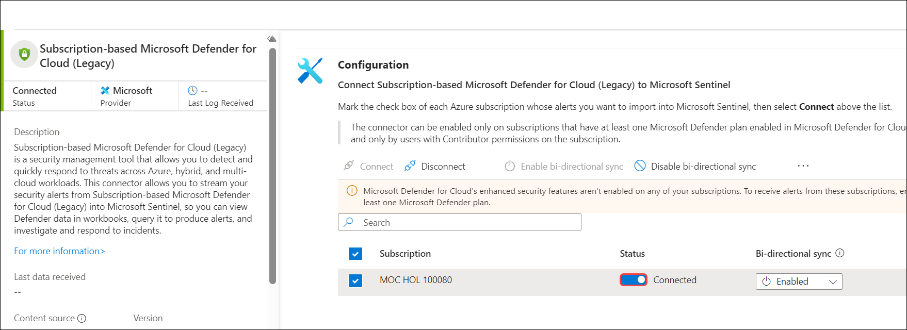

1. On the **Microsoft Defender for Cloud - Getting started** page, the checkbox for the **Subscription** should be selected, and the *Microsoft Defender plan* should display *On - Partial (30 trial days left)*.

1. Select the **X (Close)** button on the upper right to close the *Getting started* page. You should be back on the *Microsoft Defender for Cloud* configuration page.

1. The *Status* for the **Subscription** should now be **Connected** and *Bi-directional sync* should be **Enabled**.

   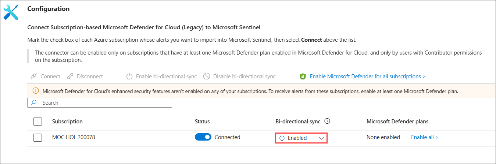

    <!--- 1. Scroll down and under the *Create incidents - Recommended!* area, verify that *Create incidents automatically from all alerts generated in this connected service* is **Enabled**. --->

### Task 3: Connect the Azure Activity data connector

In this task, you will connect the *Azure Activity* data connector.

1. In the Microsoft Sentinel left menus, scroll down to the **Content management** section and select **Content Hub**.

1. In the **Content hub**, search for the **Azure Activity** solution and select it from the list.

1. On the **Azure Activity** solution page select **Install**.

   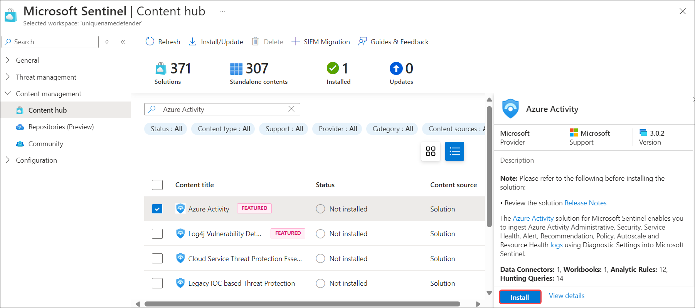

1. When the installation completes select **Manage**.

    >**Note:** The **Azure Activity** solution installs the **Azure Activity** Data connector, 12 **Analytics rules**, 14 **Hunting queries**, and 1 **Workbook**.

1. Select the **Azure Activity (1)** Data connector and select **Open connector page (2)**.

    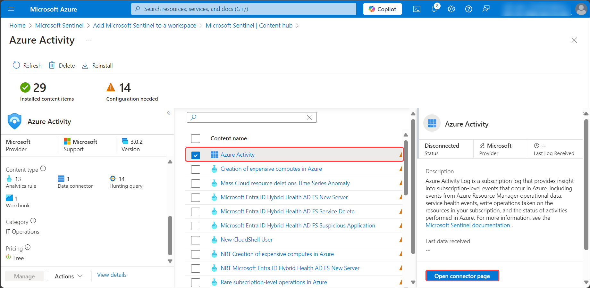

1. In the **Configuration** area under the **Instructions** tab, scroll down to "2. Connect your subscriptions through diagnostic settings new pipeline", and select **Launch Azure Policy Assignment Wizard>**.

    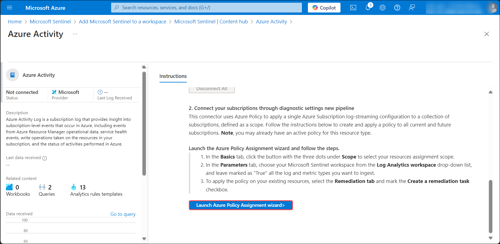

1. In the **Basics** tab, select the ellipsis button **(...) (1)** under **Scope** and select your **subscription (2)** from the drop-down list and click **Select (3)**.

    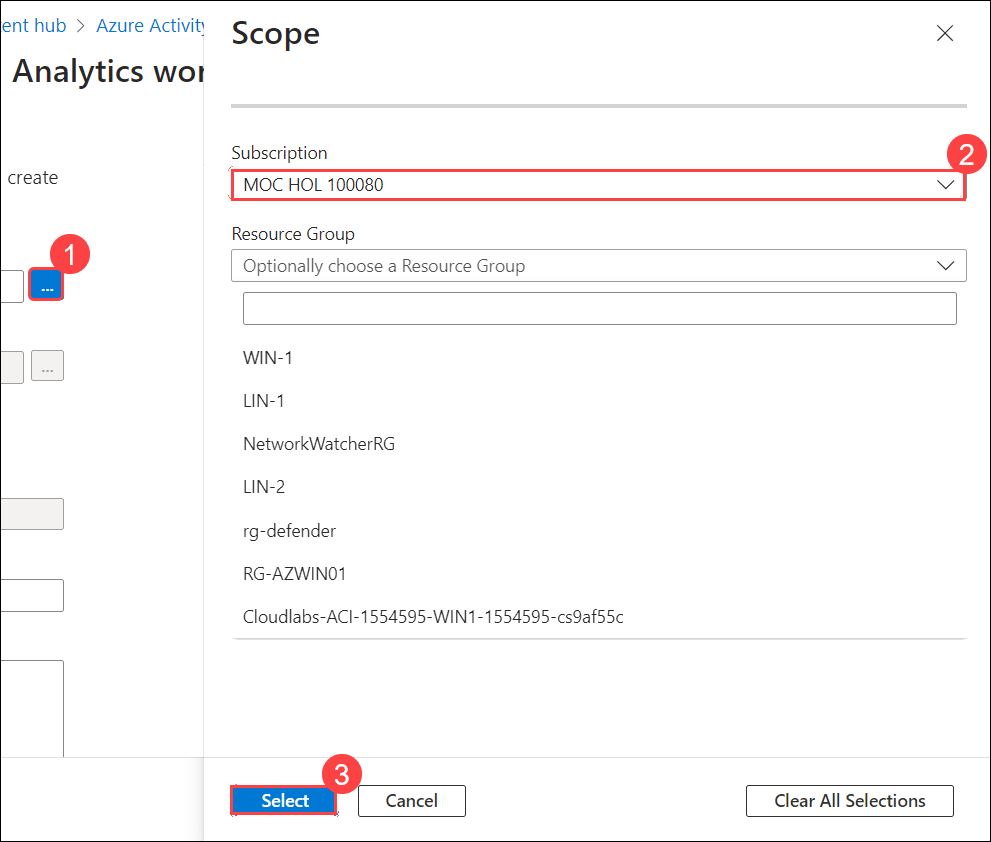

1. Select the **Parameters** tab, choose your *uniquenameDefender* workspace from the **Primary Log Analytics workspace** drop-down list. This action will apply the subscription configuration to send the information to the Log Analytics workspace.

    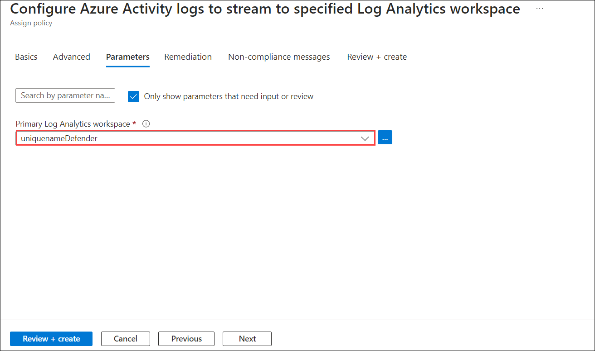

1. Select the **Remediation** tab and select the **Create a remediation task** checkbox. This action will apply the policy to existing Azure resources.

   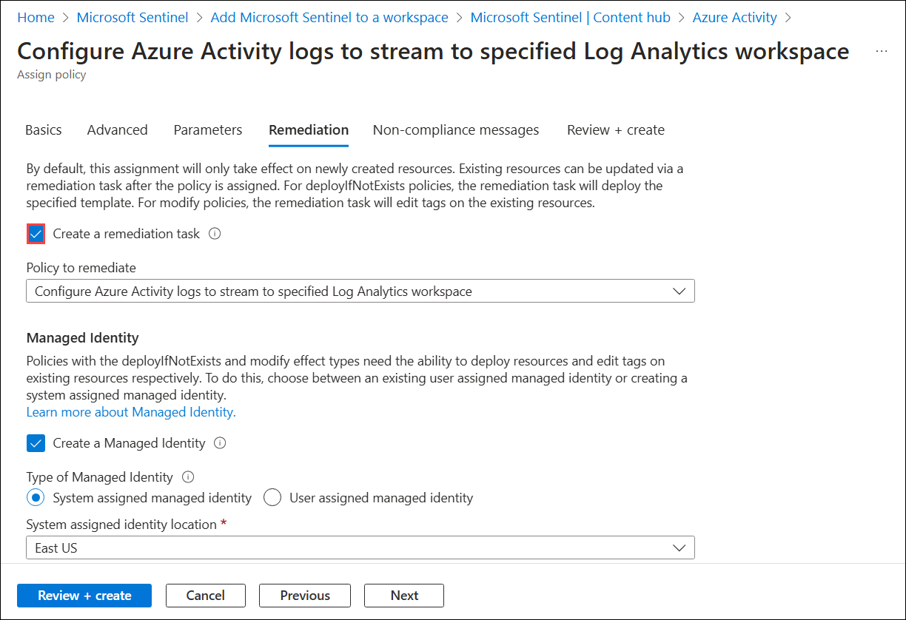

1. Select the **Review + Create** button to review the configuration.

1. Select **Create** to finish.

   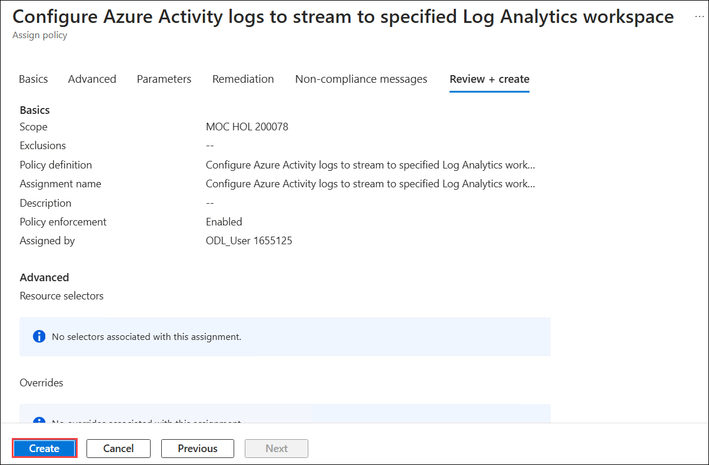

## Review
In this lab, you have completed the following:

- Created and accessed the Microsoft Sentinel Workspace
- Connected the Microsoft Defender for Cloud data connector
- Connected the Azure Activity data connector

## Select **Next** to continue to Lab 2
