# Lab-9a: Connect Windows devices to Microsoft Sentinel using data connectors

## Lab Scenario

You're a Security Operations Analyst working at a company that implemented Microsoft Sentinel. You must learn how to connect log data from the many data sources in your organization. The next source of data is Windows virtual machines inside and outside of Azure, like On-Premises environments or other Public Clouds.

## Lab Objectives
 In this lab, you will perform the following:
- Task 1: Create a Windows Virtual Machine in Azure
- Task 2: Install Azure Arc on an On-Premises Server
- Task 3: Connect an Azure Windows virtual machine
- Task 4: Connect a non-Azure Windows Machine

### Estimated Timing: 60 Minutes

## Architecture Diagram

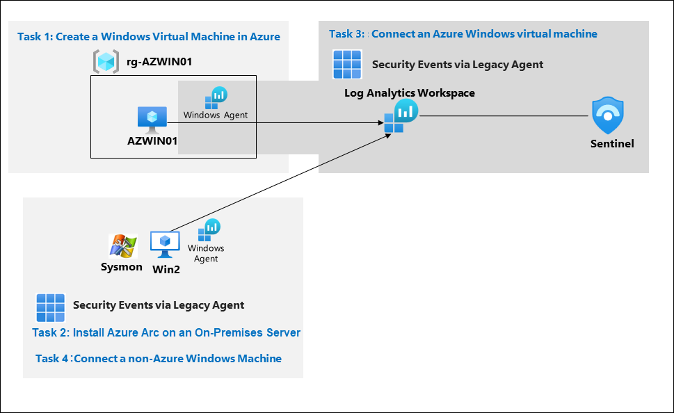

### Task 1: Create a Windows Virtual Machine in Azure

In this task, you'll create a Windows virtual machine in Azure.

1. In the Azure portal, Select **+ Create a Resource**. **Hint:** If you are already in the Azure Portal, select **Microsoft Azure** from the top bar to return to the Home page.

    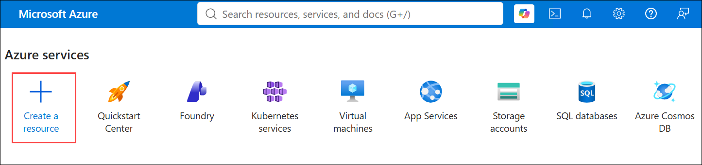

1. In the **Search services and marketplace** box, enter **Windows 11 (1)** and select **windows 11 (2)** from the drop-down list.

    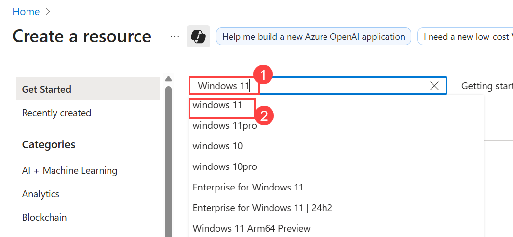

1. On the **Marketplace** page,  Select the box for **Microsoft Window 11**.

    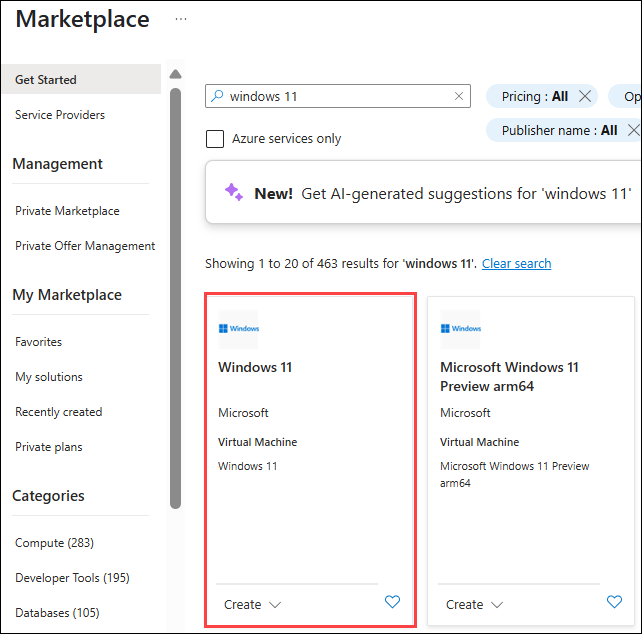

1. Open the **Plan** drop-down list and select **Windows 11 Enterprise, version 24H2 (1)**, select **Start with a pre-set configuration (2)** to continue.

   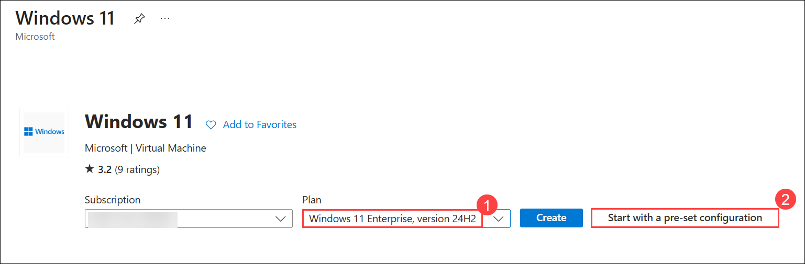

1. Select **Dev/Test (1)** and then select **Continue to create a VM (2)**.

   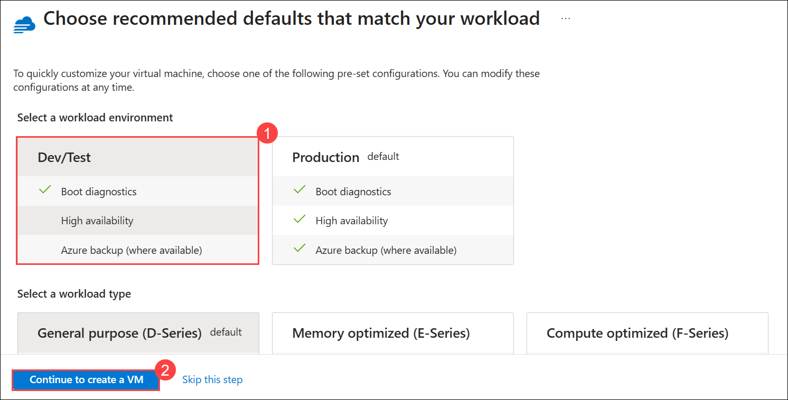

1. On **Create a virtual machine** page, configure the following settings: 

    | Setting | Value |
    | --- | --- |
    | Subscription | your default subscription **(1)** | 
    | Resource Group | Select **RG-AZWIN01 (2)**   |
    | Virtual machine name |  Enter **AZWIN01 (3)**  | 
    | Region | **Use default region (4)** |

      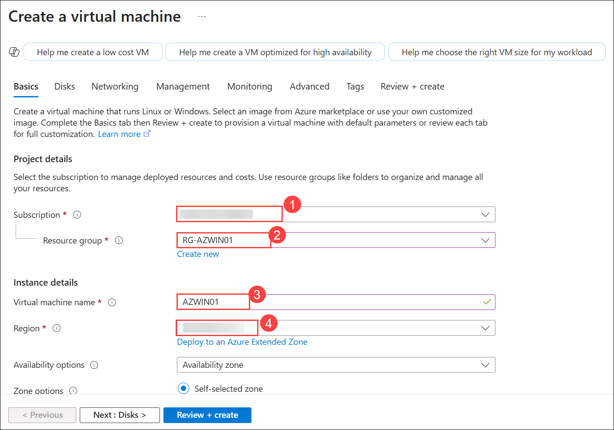

    | Setting | Value |
    | --- | --- |
    | Image | **Windows 11 Enterprise, version 24H2 (5)**  | 
    | Size| Should be selected as **Standard_B2s**. If it appears empty, select **See all sizes**, choose the **Standard_DS1_v2 (6)** click **Select**. |

      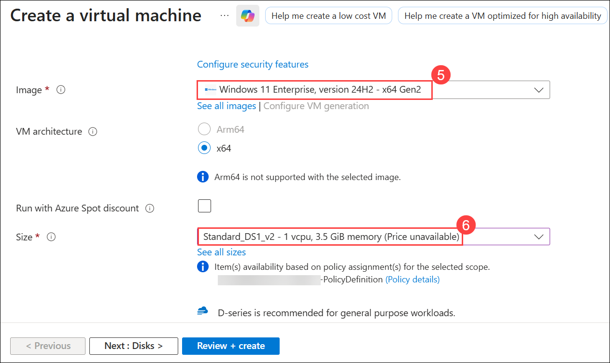

    | Setting | Value |
    | --- | --- |
    | Username | Enter **azureuser(7)**  |
    | Password  | Enter **Password.1!! (8)**  |
    | Confirm Password  | Enter **Password.1!! (9)** |
    | Select **Review + create (10)** |

      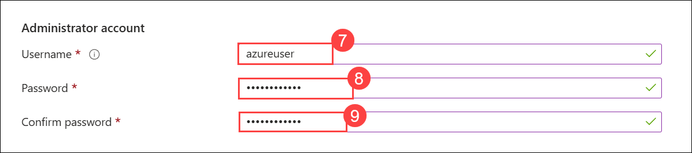

1. Select **Create**. Wait for the Resource to be created, this may take a few minutes.

    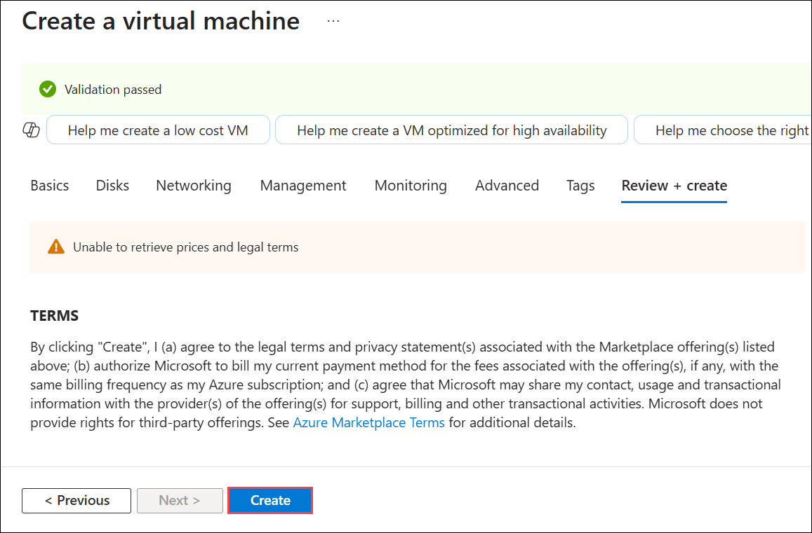

    >**Note:** If there is a **Networking** validation failure, select that tab, review its contents, and then select **Review + create** again.

### Task 2: Install Azure Arc on an On-Premises Server

In this task, you install Azure Arc on an on-premises server to make onboarding easier.

>**Important:** The next steps are done on a different machine from the one you were previously working on. Look for the Virtual Machine name references.

>**Important:** The **Windows Security Events via AMA** data connector requires Azure Arc for non-Azure devices. 

1. In the lab virtual machine, search for **Hyper-V Manager** from task bar and select to open.

    

1. Select **LABVM (1)**, then select **WIN2**. Right-click on the **WIN2 (2)** virtual machine and choose **Start**, then click **Continue**. After that, right-click on the **WIN2** virtual machine again and select **Connect (3)**.

    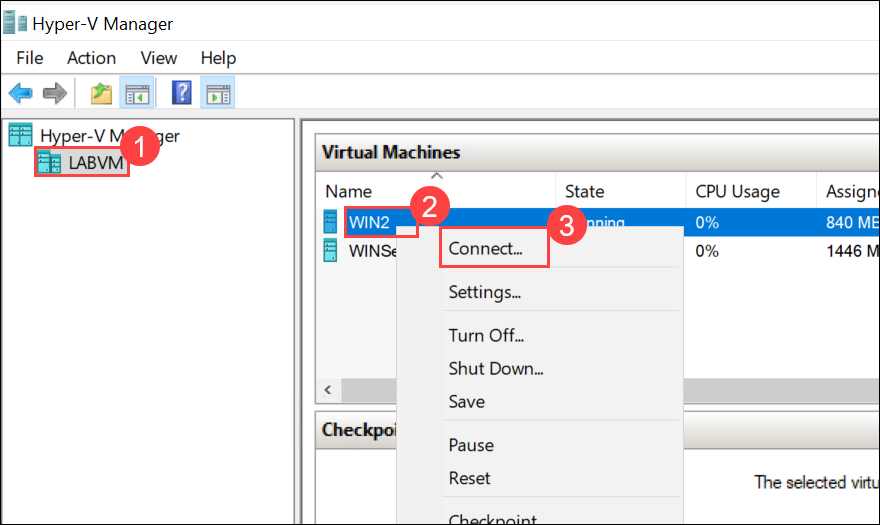
 
1. Inside **WIN2** Click on **connect**.
 
    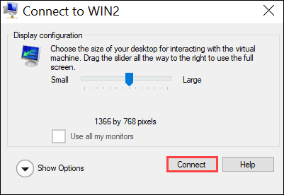

1. Enter the **Password** as `Password.1!!` when prompted, then hit **Enter**.

     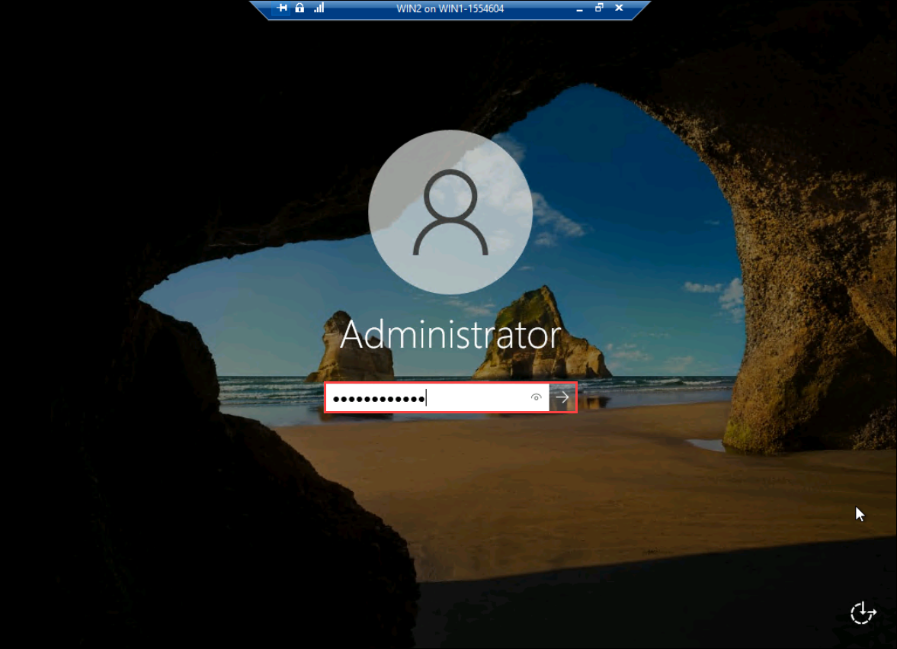

1. Open the Microsoft Edge browser inside **WIN2**.

1. In the **WIN2**, click on the **Azure Portal** icon as shown below:
 
   .png)

1. To sign in, use the credentials below:
   
    - **Email/Username: <inject key="AzureAdUserEmail"></inject>**
    - **Password: <inject key="AzureAdUserPassword"></inject>**

1. In the Search bar of the Azure portal, type **Azure arc (1)**, then select **Azure Arc (2)**.

   

1. In the navigation pane under **Azure Arc resources** select **Machines (1)**, select **+ Onboard/Create (2)**, then select **Onboard existing machines (3)**.

   

1. On the **Onboard existing machines with Azure Arc** page, select the default **Subscription (1)**, select **rg-defender (2)** as the **Resource group**.
 
1. For **Region**, select **(US) East Us (3)** from the drop-down list and then select **Download and run script (4)**.

    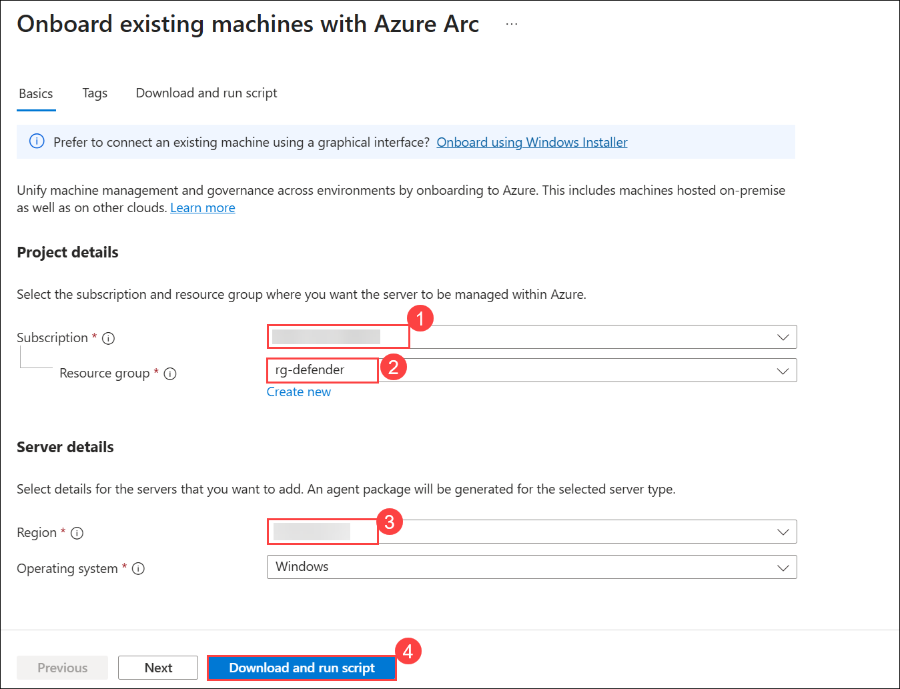

1. Scroll down and select the **Download** button. **Hint:** if your browser blocks the download, take action in the browser to allow it.

   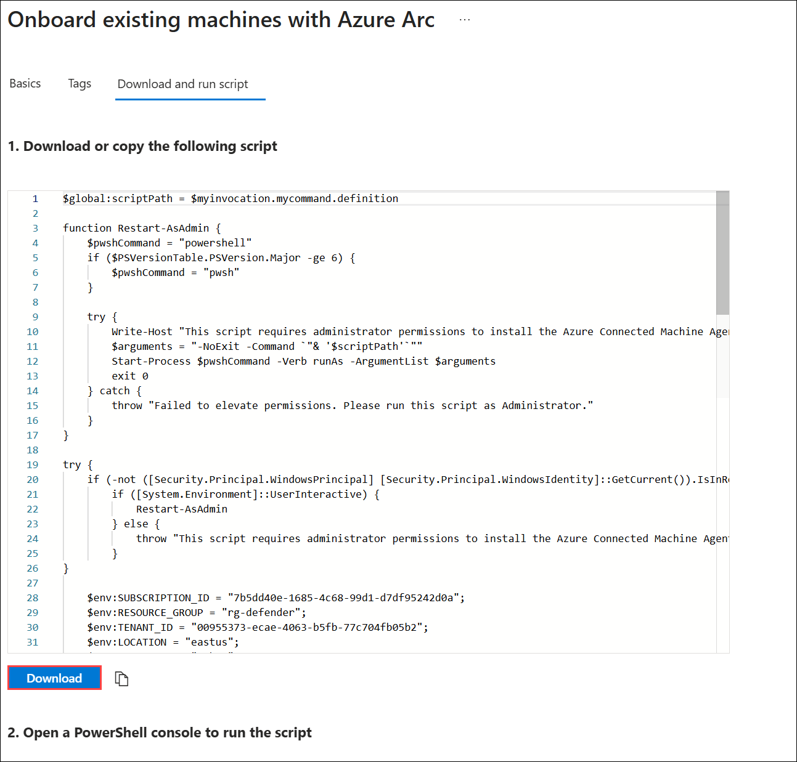

1. In Microsoft Edge Browser, select the ellipsis button (...) **(1)** if needed and then select **Keep (2)**.

   
    
1. Right-click the Windows Start **(1)** button and select **Windows PowerShell (Admin) (2)**.

   

1. Enter **Administrator** for "Username" and **Passw0rd!** for "Password" if you get a UAC prompt.

1. Run the below command to go to the **Downloads** folder:

     ```
      cd C:\Users\Administrator\Downloads
     ```

   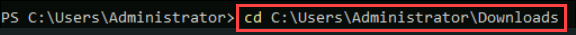

   >**Important:** If you do not have this directory, it most likely means that you are on the wrong machine. Go back to the beginning of Task 4 and change to WINServer and start over.

1. Run the below command.

    ```
    Set-ExecutionPolicy -ExecutionPolicy Unrestricted
    ```
    
1. Enter **A** for Yes to All and press Enter.

    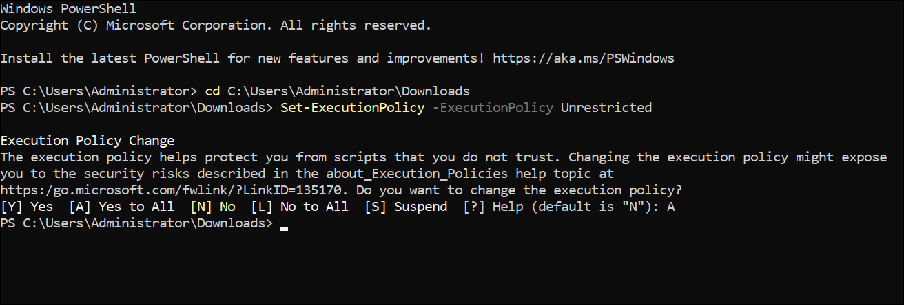

1. Now run the below command to execute the **Onboarding script**, which we downloaded earlier. 

    ```
    .\OnboardingScript.ps1
    ```

    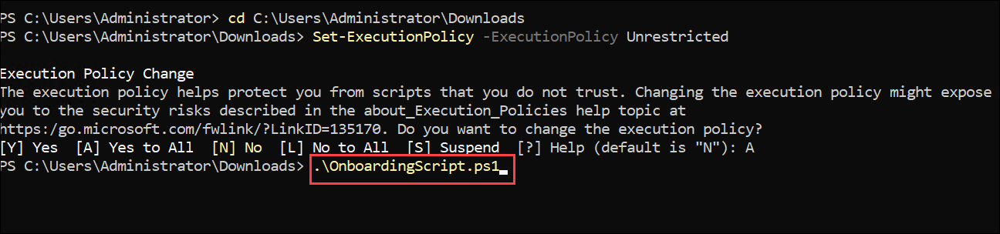

    >**Important:** If you get the error **"The term .\OnboardingScript.ps1 is not recognized..."**, make sure you are doing the steps for Task 4 in the WINServer virtual machine. Another issue might be that the name of the file changed due to multiple downloads, search for **".\OnboardingScript (1).ps1"** or other file numbers in the running directory.

1. Enter **R** to Run once and press Enter (this may take a couple of minutes).

    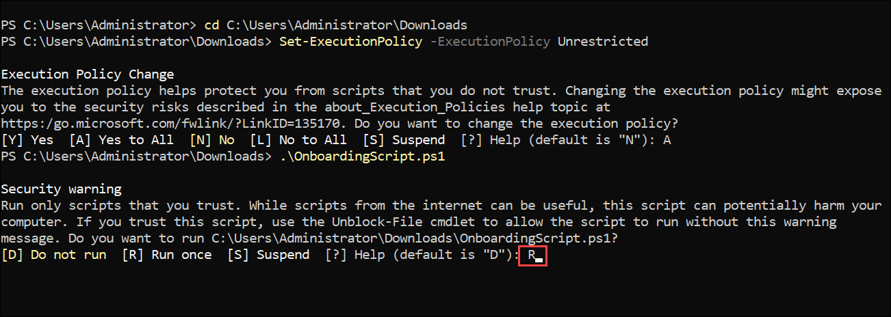

1. The setup process opens a new Microsoft Edge browser tab to authenticate the Azure Arc agent. Select your admin account, wait for the message **"Authentication complete"** and then go back to the Windows PowerShell window.

    

1. When the installation finishes, go back to the Azure portal page where you downloaded the script and select **Close**. Close the **Add servers with Azure Arc** to go back to the Azure Arc **Machines** page.

    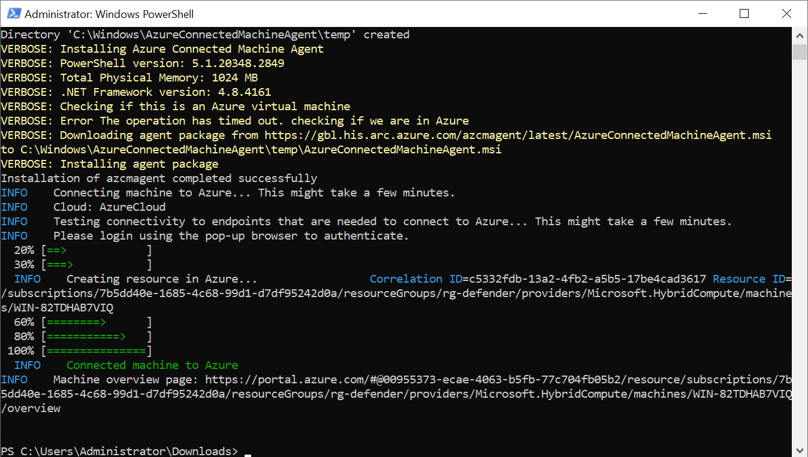

1. Select **Refresh** until WIN2 server name appears and the Status is **Connected**.
  
    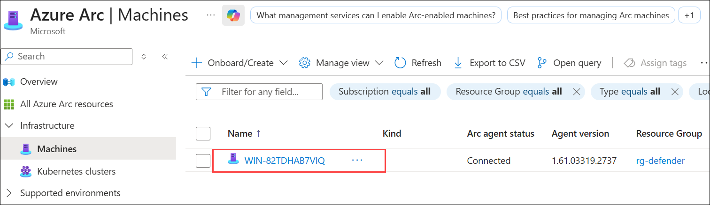

    >**Note:** This could take a couple of minutes.

### Task 3: Connect an Azure Windows virtual machine

In this task, you'll connect an Azure Windows virtual machine to Microsoft Sentinel.

1. On a new tab in the browser, go to **https://security.microsoft.com**

1. Close the pop-up that appears.

    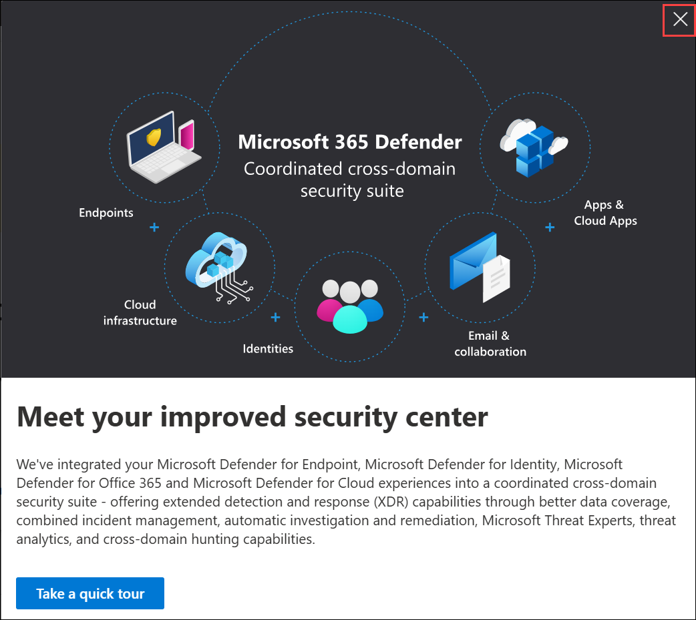

1. On **Microsoft Defender** page, if the left navigation pane is collapsed, select **Show navigation** to expand it.

   

1. In the Microsoft Defender **Microsoft Sentinel (1)** navigation menu, scroll down to the **Content management (2)** section and select **Content Hub (3)**.

     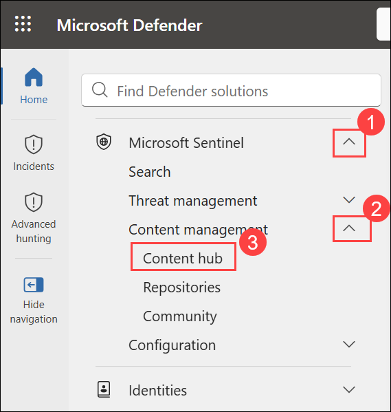

1. In the **Content hub**, search for the **Windows Security Events (1)** solution and select **Windows Security Events (2)** from the list, on the **Windows Security Events** solution page select **Install (3)**.

    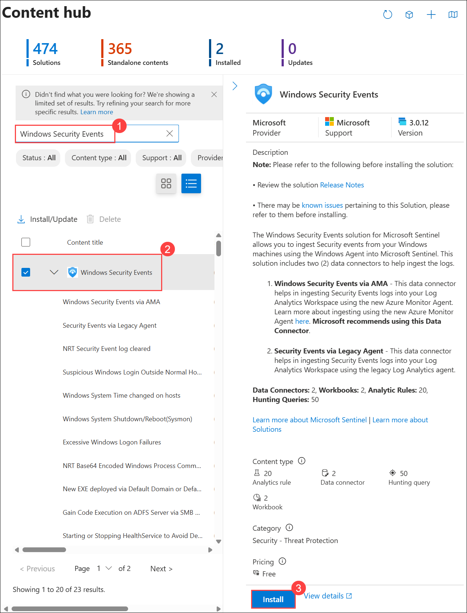

     > **Note:** If the **Content hub** page does not load, refresh the browser until it appears.  

1. When the installation completes, select **Manage**.

    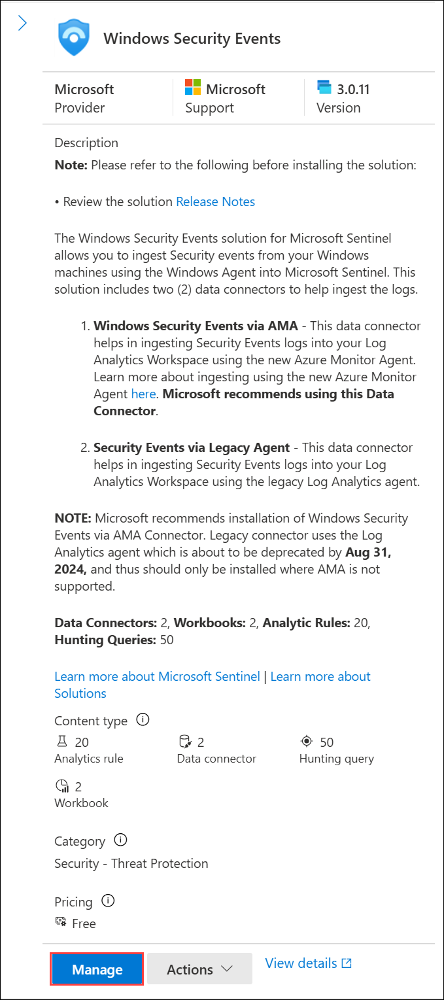

    >**Note:** The **Windows Security Events** solution installs both the **Windows Security Events via AMA** and the **Security Events via Legacy Agent** Data connectors, along with 2 Workbooks, 20 Analytic Rules, and 43 Hunting Queries.

1. Select the **Back** arrow to view the content items and access the connector page.

1. Select the **Windows Security Events via AMA (1)** Data connector, and select **Open connector page (2)** on the connector information blade.

   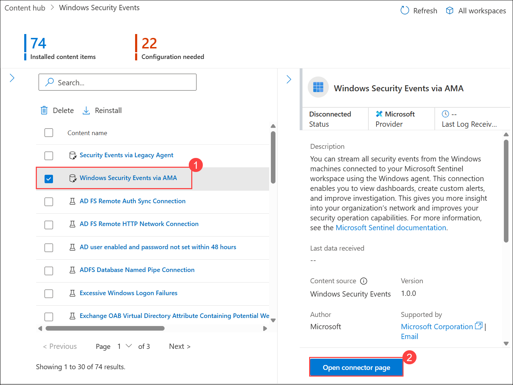
    
1. In the **Configuration** section, under the **Instructions** tab, select the **+ Create data collection rule**.

   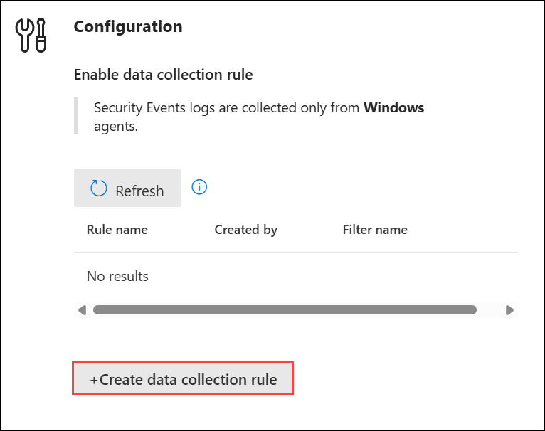

1. Enter **AZWINDCR (1)** for Rule Name, then select **Next: Resources (2)**.

   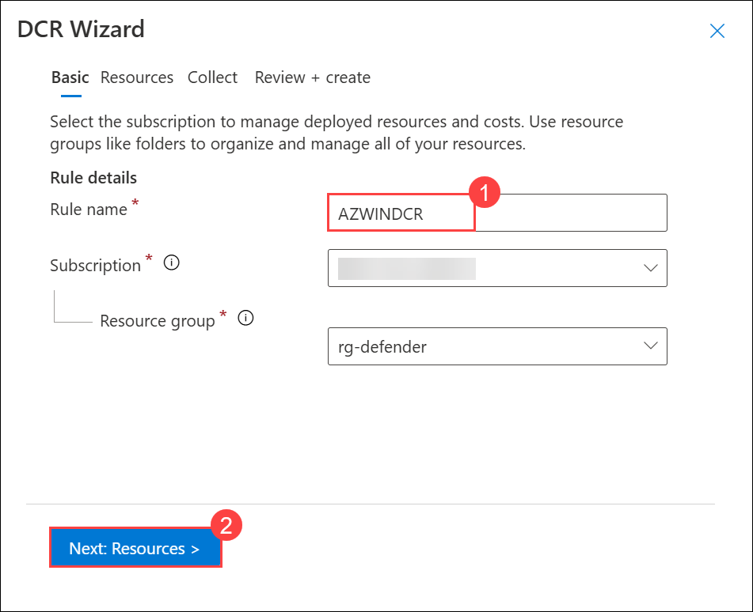

1. Select **Next: Resources>** to select the Virtual Machine we created.

1. Expand **RG-AZWIN01 (1)**, then select **AZWIN01 (2)**, next choose **Collect (3)**.

    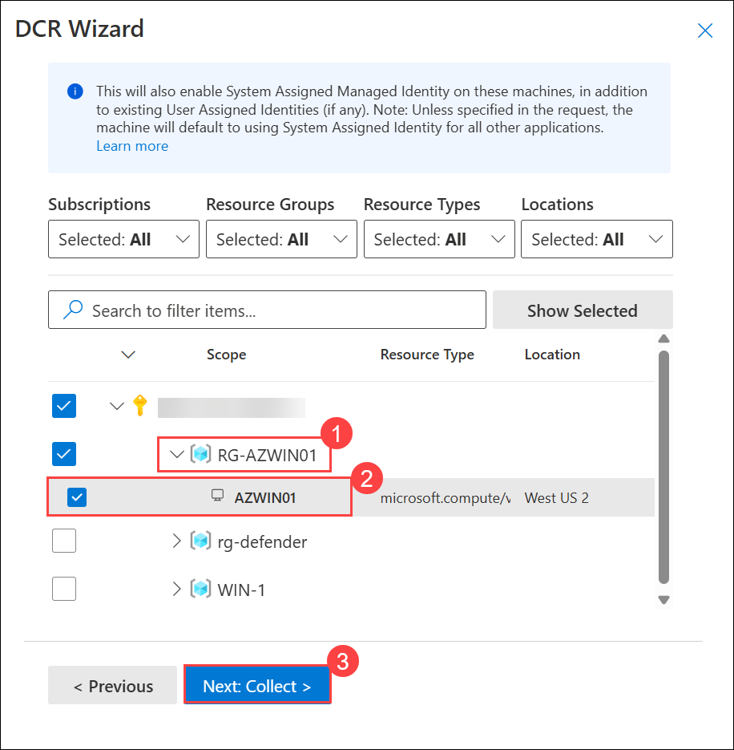

1. Review the various Security Event collection options, keep the setting for **All Security Events**, and then click on **Next: Review + Create**.

1. Select **Create** to save the Data Collection Rule.

   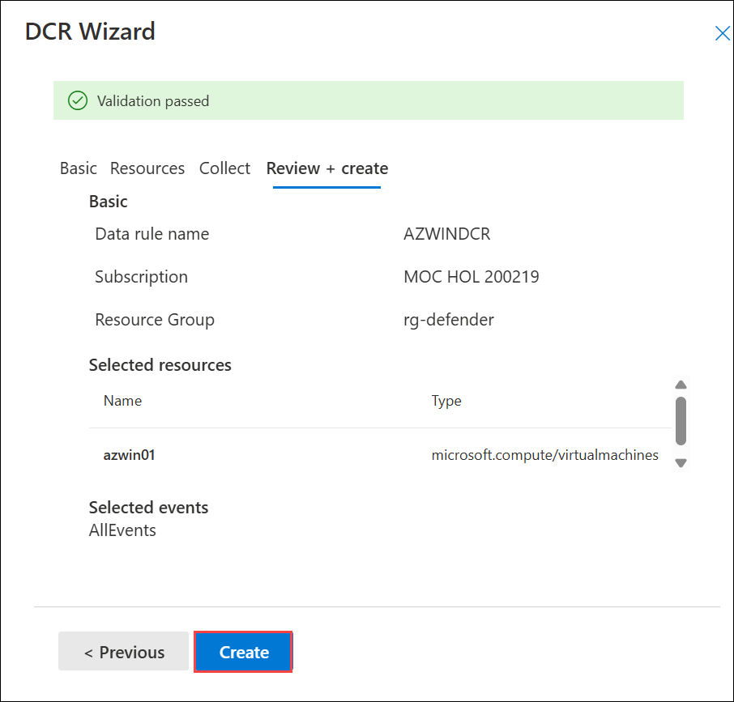

1. Wait a minute and then select **Refresh** to see the new data collection rule listed.

### Task 4: Connect a non-Azure Windows Machine

In this task, you'll add an Azure Arc-connected, non-Azure Windows virtual machine to Microsoft Sentinel.  

   >**Note:** The **Windows Security Events via AMA** data connector requires Azure Arc for non-Azure devices.

1. Make sure you are in the **Windows Security Events via AMA** data connector configuration in your Microsoft Sentinel workspace.

1. In the **Instructions** tab, under the **Configuration** section, edit the **AZWINDCR** **data collection rule** by selecting the **pencil** icon.

   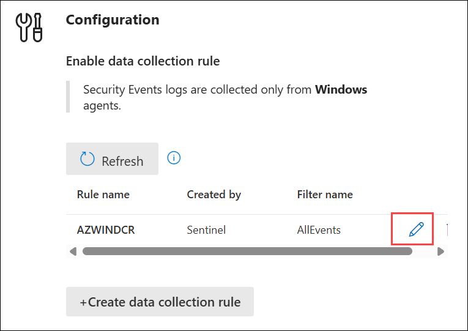
    
1. Select **Next: Resources**, and expand your **Subscription (1)** under **Scope** on the **Resources** tab.

    >**Hint:** You can expand the whole **Scope** hierarchy by selecting the ">" before the **Scope** column.

1. Expand **rg-defender (2)** (or the Resource Group you created), then select **WIN-xxxxxxxxxx (3)**.

    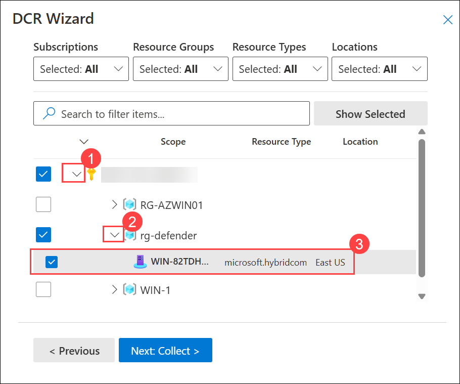

1. On the **Edit Data Collection Rule** page, select **Next: Collect**, then **Next: Review + create**.

   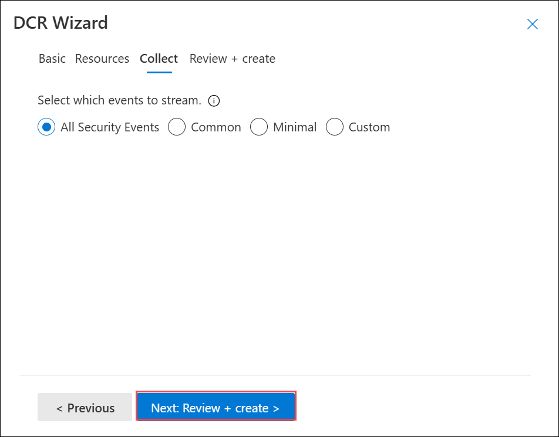

1. Once the **Validation Passed**, click on **Create**.

## Review
In this lab, you have completed the following:

- Created a Windows Virtual Machine in Azure
- Installed Azure Arc on an On-Premises Server
- Connected an Azure Windows virtual machine
- Connected a non-Azure Windows Machine

### Congratulations, you’ve successfully completed the hands-on lab!
