# Lab 08 - Exercise 3 - Connect Linux hosts to Microsoft Sentinel using data connectors

## Lab Scenario

You are a Security Operations Analyst working at a company that implemented Microsoft Sentinel. You must learn how to connect log data from the many data sources in your organization. The next source of data is Linux virtual machines using the Common Event Format (CEF) via Legacy Agent and Syslog connectors.

## Lab Objectives
 In this lab, you will perform the following: 
- Task 1: Access the Microsoft Sentinel Workspace
- Task 2: Connect a Linux Host using the Common Event Format connector
- Task 3: Connect a Linux host using the Syslog connector
- Task 4: Configure the facilities you want to collect and their severities for the Syslog connector

## Estimated Timing: 40 minutes

## Architecture Diagram

  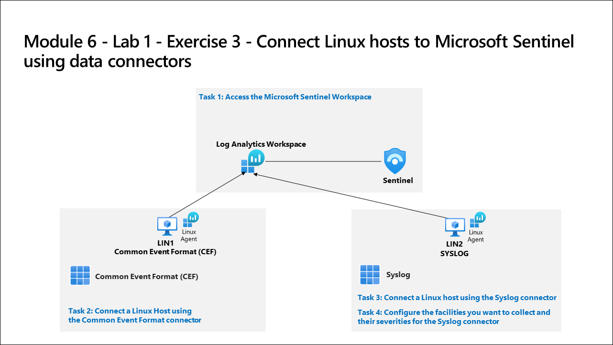

### Task 1: Access the Microsoft Sentinel Workspace

In this task, you will access your Microsoft Sentinel workspace.

1. In the Search bar of the Azure portal, type **Microsoft Sentinel (1)**, then select **Microsoft Sentinel (2)**.

   

1. Select the **uniquenameDefender** Microsoft Sentinel Workspace you created earlier.

   

### Task 2: Connect a Linux Host using the Common Event Format connector

In this task, you will connect a Linux host to Microsoft Sentinel with the Common Event Format (CEF) connector.

1. Select **Data connectors** from the Configuration area in Microsoft Sentinel.

1. Go to content hub and search **Common Event Format (1)** and click on **install (2)**.

   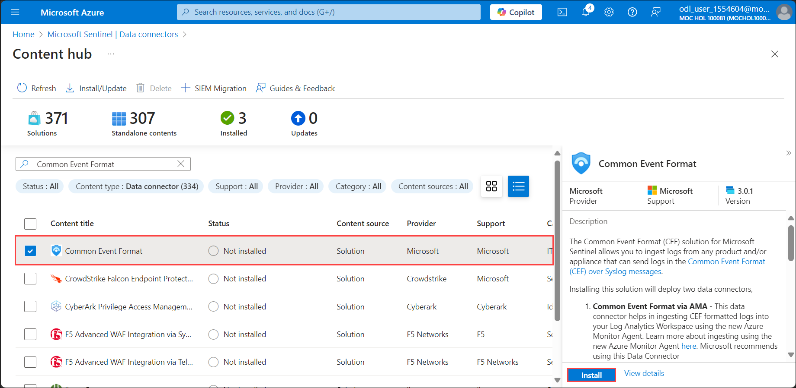

   >**Note:** If the **Common Event Format** option is not visible, click on **More content in the Content Hub**.

     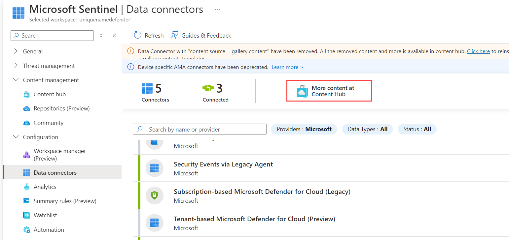 

1. From the Data Connectors tab, search for the **Common Event Format (CEF) via AMA** connector and select it from the list.

1. Select the **Open connector page** on the connector information blade.

   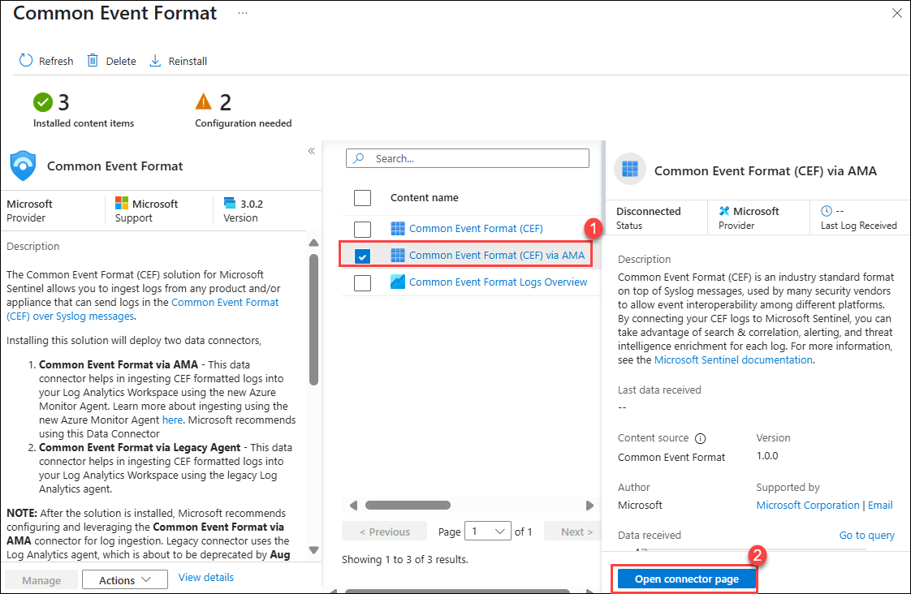

1. Under configuration, copy the command shown to install and apply the CEF connector and paste it into Notepad.

   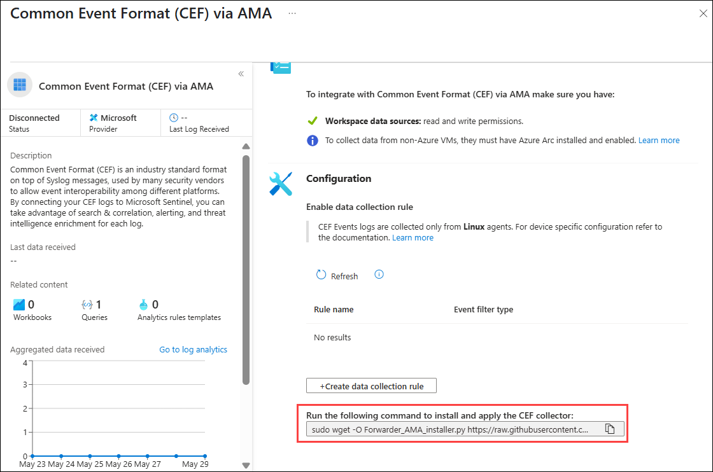

1. Back to the Azure portal, in the Search bar of the Azure portal, type **virtual machine**, then select **Virtual machine**.

1. Open **LIN1 (1)** Linux virtual machine and copy the **Public IP address (3)** of LIN1 from the **overview (2)** and paste on the notepad.

   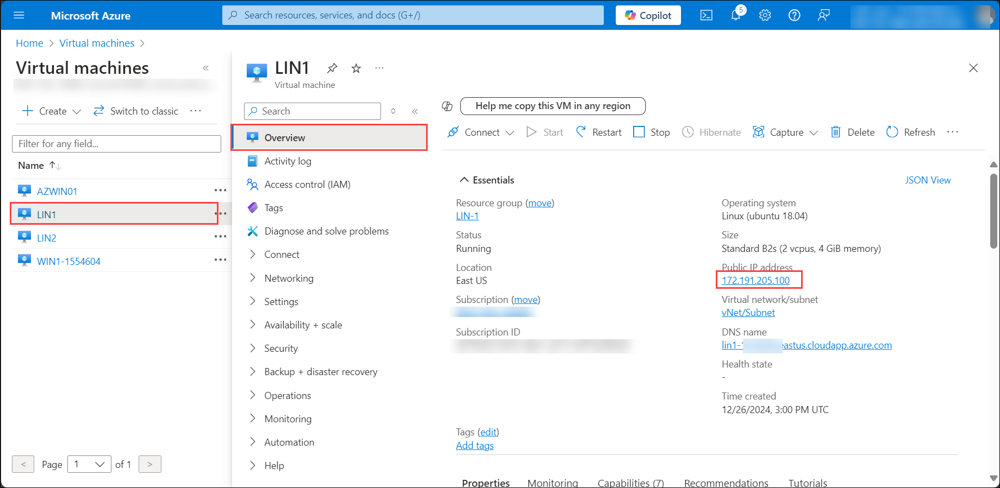

1. Go back to the WIN1 virtual machine. Launch Windows PowerShell as Administrator by right-clicking the Start menu icon and selecting **Windows PowerShell (Admin)**. Select **Yes** to allow the app to run in the User Account Control window that appears.

1. Enter the following PowerShell command, adjusting for your specific Linux server information, and press Enter:

    ```PowerShell
    ssh insert your linux-IP-address-here -l insert-linux-user-name-here
    ```
    
     >**Note**: Replace **insert your linux IP address here** with pasted on the notepad Public Ip address of **LIN1** and **insert linux username here** with **Admin Username** provided under Resource group: **LIN1** in the **Environment Details** page of the lab guide.

1. Enter **yes** to confirm the connection and then type the user's **password provided under Resource group: LIN1** in the Environment tab and press **enter**. Your screen should look something like this:

   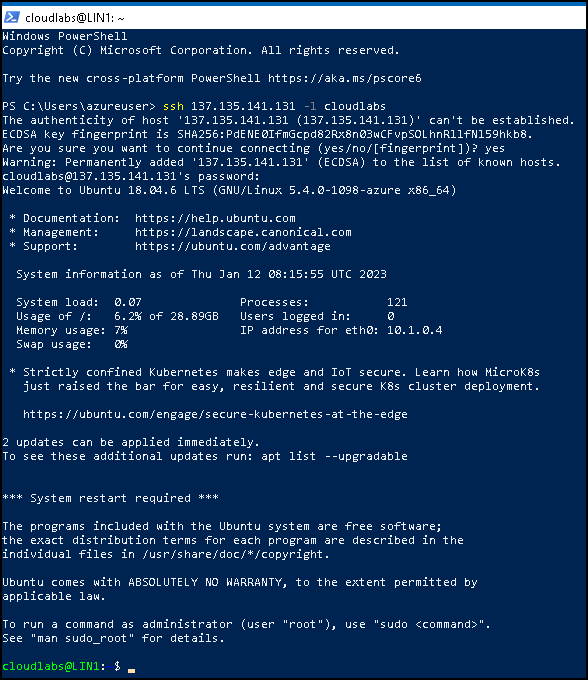

1. You are now ready to paste in the command that we copied from the earlier step. Make sure that the script from Azure is in the clipboard. In PowerShell, right-click the top bar and choose **Edit** and then **Paste**. Once pasted add a **3** to the word *python* as shown below:

   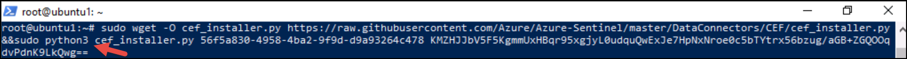
   
    >**Note:** You can also copy from the notepad you have pasted earlier.

1. Once the script is pasted in and adjusted, press Enter. The script will run against your Linux server remotely. When the script processes properly, it should look like this screen:

   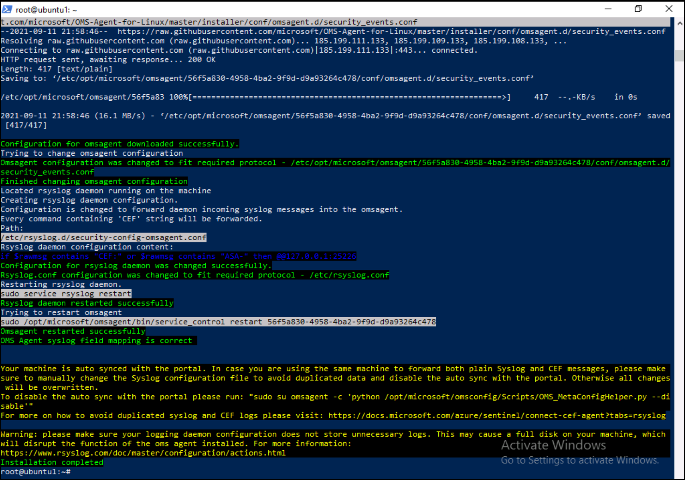

1. In the Search bar of the Azure portal, type *Sentinel*, then select **Microsoft Sentinel**.

1. Select the Microsoft Sentinel **defenderWorkspace**.

1. In the Microsoft Sentinel left navigation menu, scroll down to the *Content management* section and select **Content Hub**.

1. In the *Content hub*, search for the **Common Event Format** solution and select it from the list.

1. On the *Common Event Format* solution page select **Manage**.

    >**Note:** The *Common Event Format* solution installs both the *Common Events Format (CEF) via AMA* and the *Common Events Format (CEF) via Legacy Agent* Data connectors.

1. Select the *Common Events Format (CEF) via AMA* Data connector, and select **Open connector page** on the connector information blade.

1. In the *Configuration* section, select the **+Create data collection rule** button.

   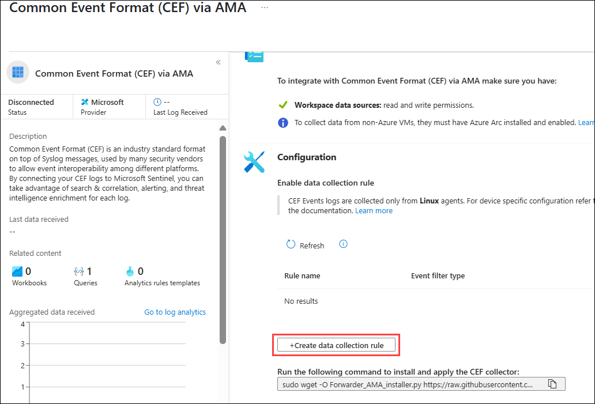

1. On the *Create data collection rule* page, *Basic* tab, enter **AZLINDCR** for Rule Name, then select **Next: Resources**.

   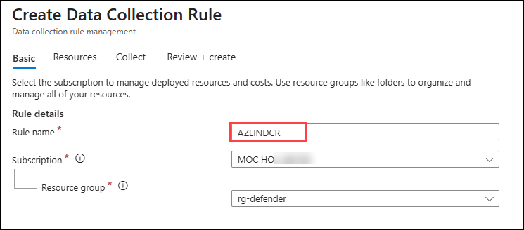

1. On the *Resources* tab, expand your *MOC Subscription* under *Scope*.

1. Expand **LIN1** resource group, then select **LIN1**.

   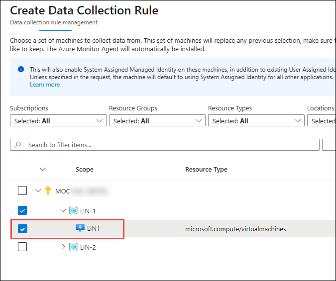

    >**Note:** You're *LIN1* virtual machine may appear with a different name, like ubuntuxxx.

1. Select **Next: Collect**. In the *Collect* tab, select the  *LOG_ALERT* drop-down menu, and select **LOG_WARNING**.

   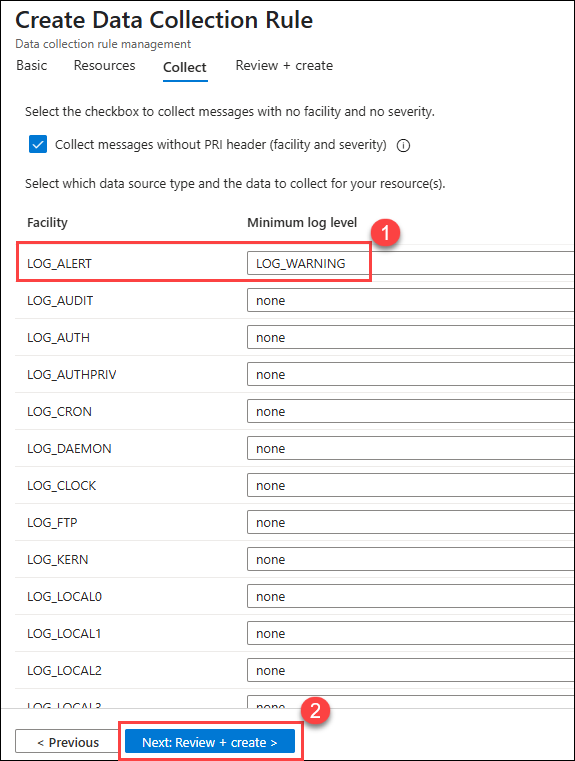

1. Select **Next: Review + create**, and select **Create**. Wait for the deployment to finish.

   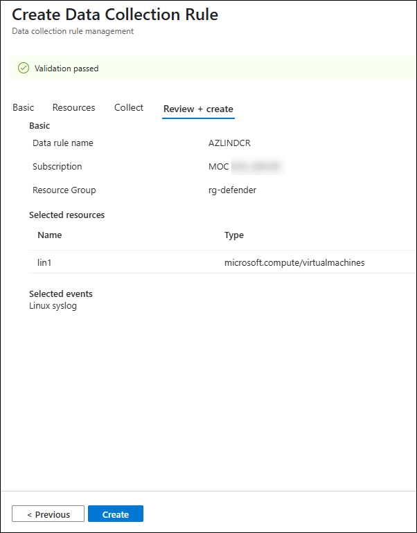

    >**Note:** You may need to refresh the page.

1. The *Common Event Format (CEF) via AMA* Data connector should now show **Connected**.

1. The data collection rule installs the Azure Monitor Agent (AMA), and the *CEF collector* install commands were pre-deployed on the LIN1 machine to install the CEF collector.

1. Return to the *PowerShell Command Prompt* window. You should still be connected to the LIN1 virtual machine.

1. At the Linux prompt, type the following command, and press Enter:

    ```cmd
    netstat -lnptv
    ```

1. You should see the rsyslog (or syslog-ng) daemon listening on port 514.

1. Type **exit** to close the remote shell connection to LIN1.

### Task 3: Connect a Linux host using the Syslog connector

In this task, you will connect a Linux host to Microsoft Sentinel with the Syslog connector.

1. Go back to the Edge browser. 

1. In the Search bar of the Azure portal, type **Sentinel**, then select **Microsoft Sentinel**.

1. Select the Microsoft Sentinel Workspace you created in a previous lab.

1. Go to the content hub in the data connector window, search for **Syslog**, and install it.

   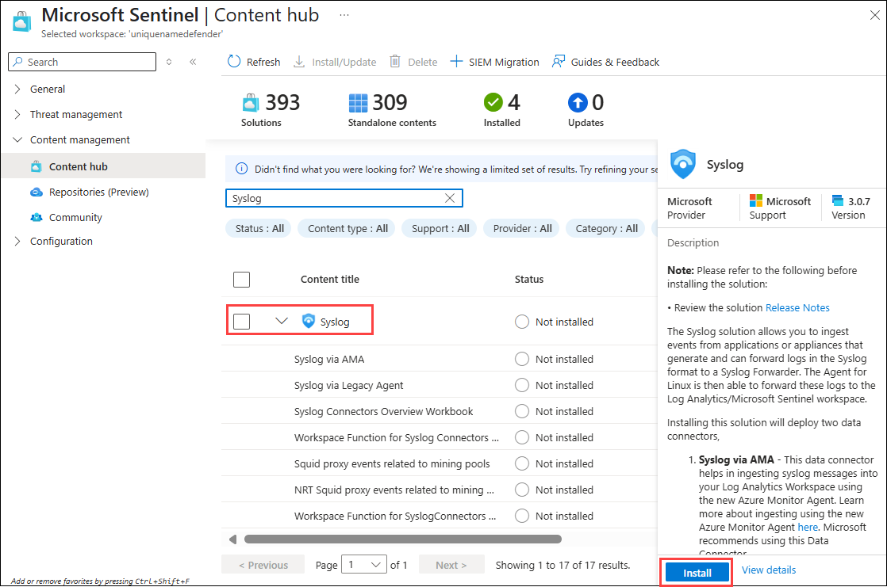
  
1. From the **Data Connectors tab (1)**, search for the **Syslog via Legacy Agent (2)** connector and select it from the list.

1. Select the **Open connector page (3)** on the connector information blade.

   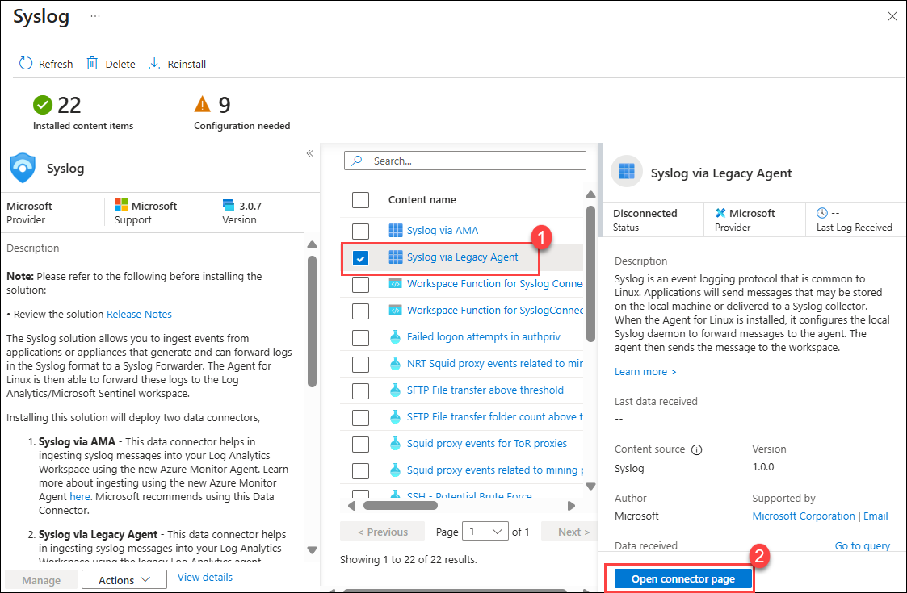

1. Under **Configuration**, open the **Install agent on a non-Azure Linux Machine** section.

1. Select the link for **Download & install agent for non-Azure Linux machine**. 

    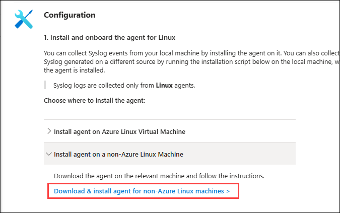

    >**Note:** Your Log Analytics workspace should show **2 Windows computers connected**. This corresponds to the WIN2 and AZWIN01 virtual machines connected earlier.

1. Select the tab for **Linux servers**.

   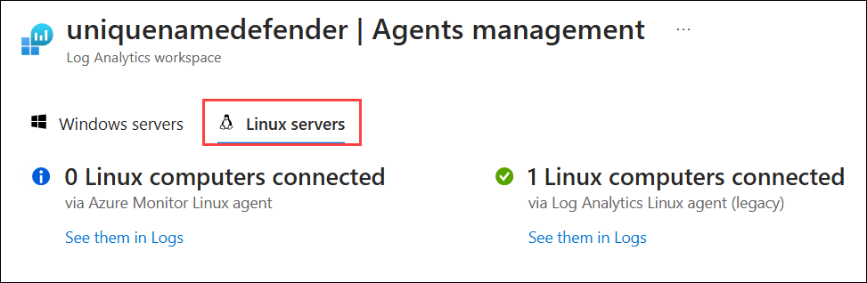

    >**Note:** Your Log Analytics workspace should show **1 Linux computer connected**. This corresponds to the LIN1 (ubuntu1) virtual machine connected earlier with the CEF connector.

1. Select **Log Analytics agent instructions**.

1. Copy the command in the **Download and onboard agent for Linux** area to the clipboard and paste it into Notepad.

   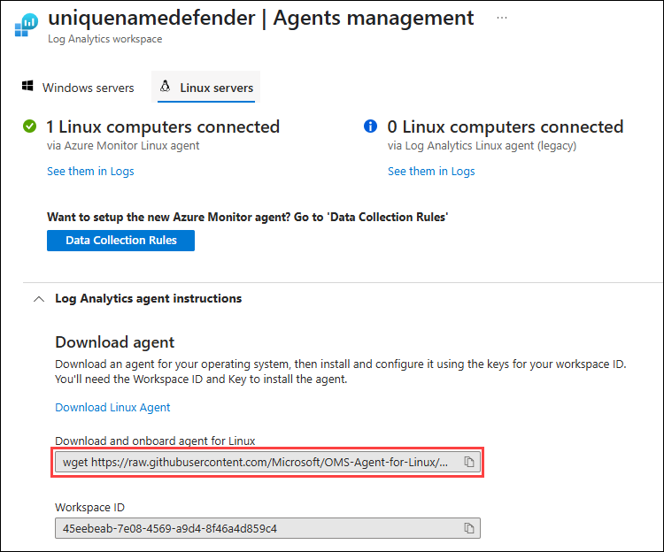
   
1. Go to the LIN2 Linux virtual machine in the Azure portal and copy the Public IP address of **LIN2** and paste it into a notepad.

1. Go back to the LabVM virtual machine, and launch a NEW Windows PowerShell as Administrator by right-clicking the Start menu icon and selecting **Windows PowerShell (Admin)**. Select **Yes** to allow the app to run in the User Account Control window that appears.

   >**Note:** You can reuse the Windows PowerShell window if the **Installation completed** for the last task by entering **exit** to close the connection to LIN1.

1. Enter the following PowerShell command, adjusting for your specific Linux server information, and press Enter:

    ```PowerShell
    ssh insert-your-linux-IP-address-here -l insert-linux-user-name-here
    ```

    >**Note**: Replace **insert your linux IP address here** with pasted on the notepad Public Ip address of **LIN2** and **insert linux username here** with **Admin Username** provided under Resource group: **LIN2** in the Environment tab
   
1. Enter **yes** to confirm the connection and then type the user's **password provided under Resource group: LIN2** in the Environment tab and press Enter. Your screen should look something like this:

   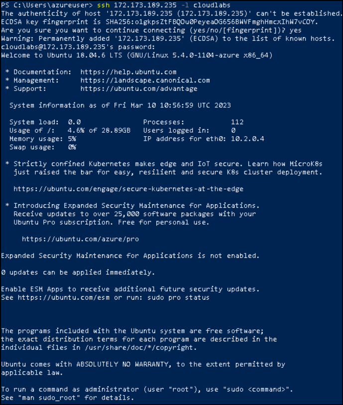

1. You are now ready to paste in the **Download and onboard agent for Linux** from the earlier step. Make sure that the script from Azure is in the clipboard. In PowerShell, right-click the top bar and choose **Edit (1)** and then **Paste (2)**. 

    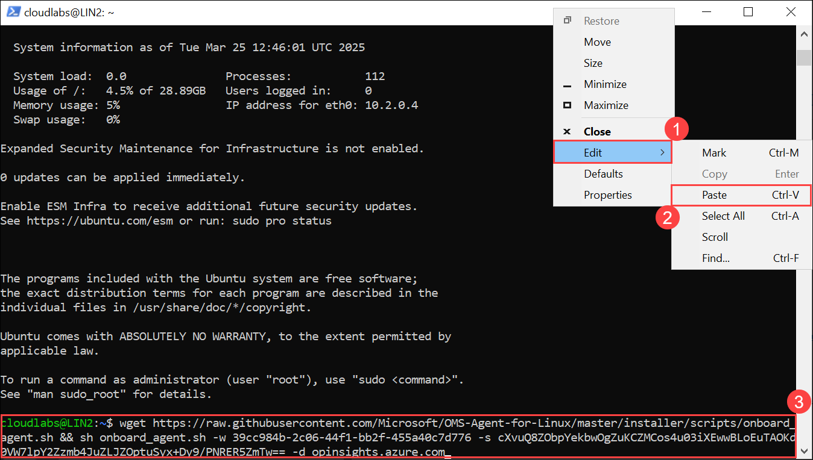

   >**Note:** You can also copy from the notepad you have pasted earlier.

1. Once the script is pasted in press Enter. The script will run against your Linux server remotely. You have completed the task. No further labs in this course rely on this connection.

1. When it finished, type **exit** to close the remote shell connection to LIN2.

### Task 4: Configure the facilities you want to collect and their severities for the Syslog connector

In this task, you will configure the Syslog collection facilities.

1. Go back to the Edge browser where you have your **Microsoft Sentinel** open and close the **Log Analytics workspace** page and the **Syslog**" data connector page by selecting the **x** in the top right corner twice.

1. In Microsoft Sentinel portal, select **Settings** from *Configuration* area and then select **Workspace settings** from the settings blade.

1. On the left menu Select **Legacy agents management (1)** from the **Classic** area.

1. Select the **Syslog (2)** tab.

1. Select the **+ Add facility** button.

1. Select **auth** from the drop-down menu for **Facility name**.

1. Select the **+ Add facility** button again.

1. Select **authpriv (3)** from the drop-down menu for **Facility name**.

1. Select **Apply (4)**.  You have completed this task.

    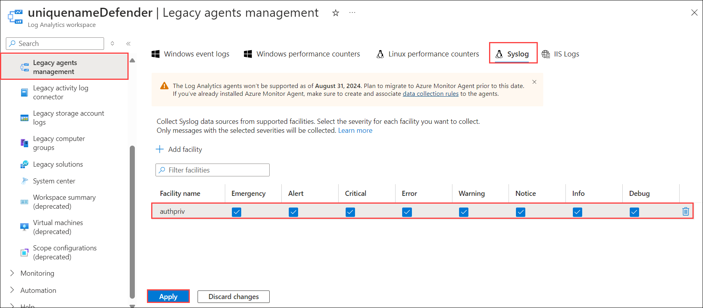

   >**Note:** If you have not performed Task 5 in Exercise 1 because licenses take some time to reflect, please go back to page 2 and perform Task 5 to successfully complete this lab.

## Review 
In this lab, you have completed the following:

- Accessed the Microsoft Sentinel Workspace
- Connected a Linux Host using the Common Event Format connector
- Connected a Linux host using the Syslog connector
- Configured the facilities you want to collect and their severities for the Syslog connector

## You have successfully completed this lab
