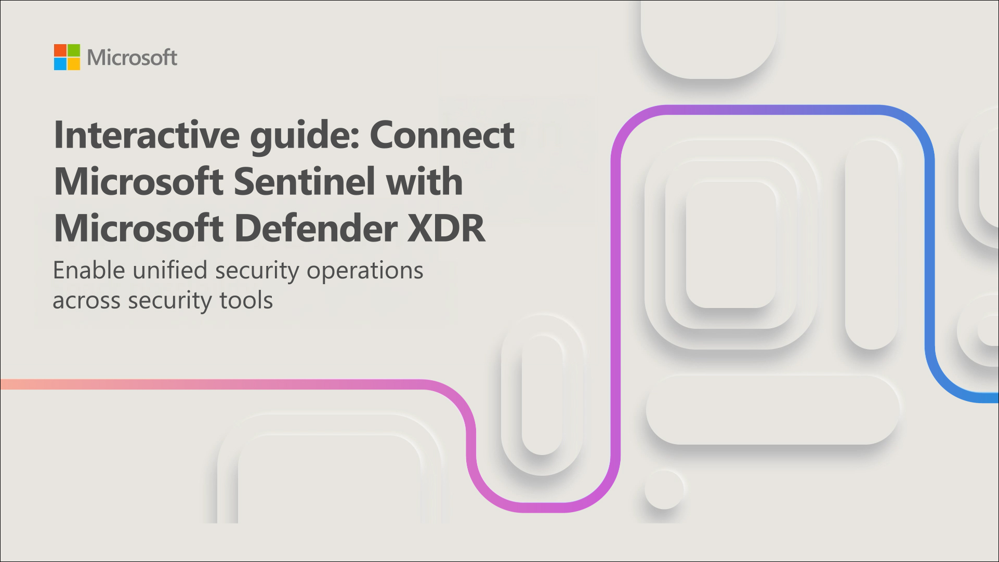
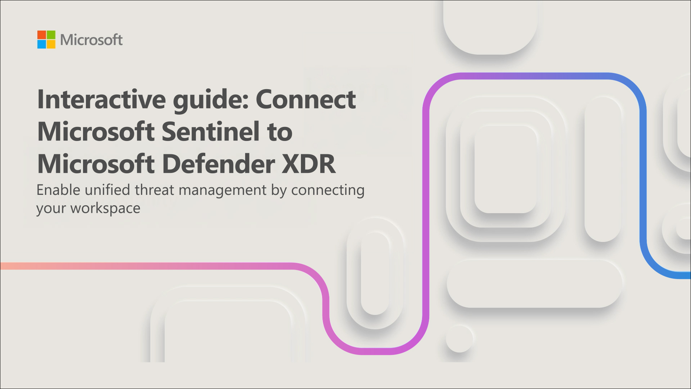

# Connect Defender XDR to Microsoft Sentinel using data connectors

## Lab scenario

You're a Security Operations Analyst working at a company that deployed both Microsoft Defender XDR and Microsoft Sentinel. You need to prepare for the Unified Security Operations Platform connecting Microsoft Sentinel to Defender XDR. Your next step will be to install the Defender XDR Content Hub solution and deploy the Defender XDR data connector to Microsoft Sentinel.

## Lab Objectives
 
 In this lab, you will perform the following:

- Task 1: Connect a new Microsoft Sentinel workspace to Defender XDR

- Task 2: Connect an existing Microsoft Sentinel workspace to Defender XDR

### Estimated Timing: 30 Minutes

## Architecture Diagram

## Task 1: Connect a new Microsoft Sentinel workspace to Defender XDR

In this interactive guide, which takes approximately 10 minutes to complete, you onboard a new Microsoft Sentinel workspace to Defender XDR.

**Select the image below to get started.**

## Task 2: Connect an existing Microsoft Sentinel workspace to Defender XDR

In this Interactive Guide, which takes approximately 10 minutes to complete, you connect an existing Microsoft Sentinel workspace to Defender XDR.

**Select the image below to get started.**

You have completed the simulation exercises to connect Microsoft Sentinel to Microsoft Defender XDR. You can now explore the Microsoft Sentinel capabilities in the Microsoft Defender portal.

>**Note:** Feel free to explore and compare the other Microsoft Sentinel capabilities, but as this is a simulation, your ability to explore Microsoft Sentinel in the Microsoft Defender portal is limited. In a real environment, you would be able to explore the full Microsoft Sentinel capabilities in the Microsoft Defender portal..

## Review
In this lab, you have completed the following:

- Connected a new Microsoft Sentinel workspace to Defender XDR
- Connected an existing Microsoft Sentinel workspace to Defender XDR

## You have successfully completed this lab