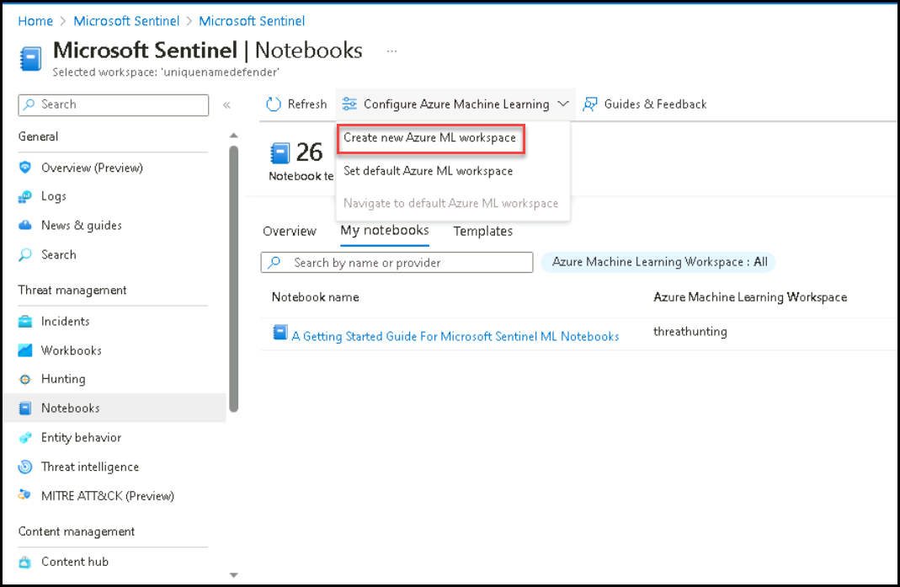
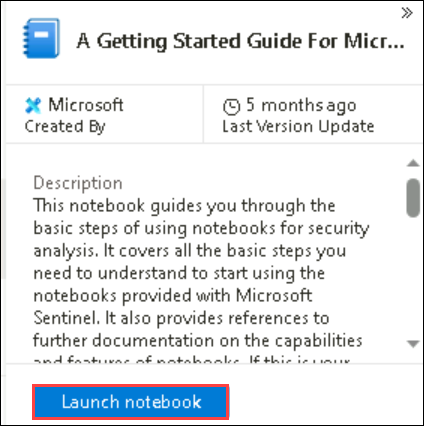

# Module 8 - Lab 1 - Exercise 2 - Threat Hunting using Notebooks with Microsoft Sentinel

## Lab scenario
You are a Security Operations Analyst working at a company that implemented Sentinel. You need to explore the benefits of threat hunting with Microsoft Sentinel Notebooks.

## Lab objectives
 In this lab, you will Understand the following:
  -  Task 1: Explore Notebooks

## Estimated time: 30 minutes

## Architecture Diagram

 

### Task 1: Explore Notebooks

In this task, you will explore using notebooks in Microsoft Sentinel.

1. In the Microsoft Sentinel Workspace, select **Notebooks** under the *Threat management* area.

1. Next, you need to create an AzureML Workspace. Select **Configure Azure Machine Learning** and then select the **Create new Azure ML workspace** button in the command bar.

     

1. In the Subscription box, select your subscription.

1. Select **Create new** for the Resource group and enter *RG-MachineLearning* for the Name and select **OK**. 

1. In the Workspace details section do the following:

     - Give your workspace a unique name.
     - Leave **East US** as the default value for *Region*.
     - Keep the default Storage account, Key vault, and Application insights information.
     - The Container registry option can remain as **None**.

1. At the bottom of the page, select **Review + Create**. When you see the *"Validation passed"* message, select **Create**. 

     >**Note:** It may take a few minutes to deploy the Machine Learning workspace.

1. After *Your deployment is complete* message appears, return to the Microsoft Sentinel portal.

1. Select **Notebooks** again and then select the **Templates** tab from the middle command bar. 

1. Select **A Getting Started Guide for Microsoft Sentinel** ML Notebooks. 

1. On the right pane, scroll down and select **Create from template** button. Review the default options and then select **Save**.

   

1. Once the saving is done, select the **Launch notebook** button. This will take you to the Microsoft Azure Machine Learning Studio.

    

1. Select **X** if an informational window appears in the Microsoft Azure Machine Learning Studio.

1. In the command bar, to the right of the **Compute instance:**  selector, select the **+** symbol to create a new compute instance. **Hint:** It might be hidden inside the ellipsis icon **(...)**.

     >**Note:** You can have more screen space by hiding the Azure ML Studio left blade by selecting the 3 lines on the top left, as well as the Notebooks Files by selecting the **<<** icon.

1. Type a unique name in the *Compute name* field. This will identify your compute instance.

1. Scroll down and select the first option available. **Hint:** Workload type: Development on Notebooks and lightweight testing.

1. Select the **Create** button at the bottom of the screen. Close any feedback window that may appear. This will take a few minutes; you will see a notification (bell icon) when it is done and the *Compute instance* left icon turns from blue to green.

1. Once the Compute has been created and running, verify that the kernel to use is *Python 3.8 - AzureML*. **Hint:** This is shown in the right of the command bar.

1. Select the **Authenticate** button and wait for the authentication to complete.

1. Clear all the results from the notebook by selecting the **Clear all outputs** from the command bar and following the *Getting Started* tutorial. **Hint:** This can be found by selecting the ellipsis (...) from the command bar.

>**Note:** If you cannot complete the steps above to access the Notebook, you can follow it on its GitHub viewer page instead. [Getting Started with Azure ML Notebooks and Microsoft Sentinel](https://nbviewer.org/github/Azure/Azure-Sentinel-Notebooks/blob/master/A%20Getting%20Started%20Guide%20For%20Azure%20Sentinel%20ML%20Notebooks.ipynb) 

## Review
In this lab, you have completed the following:
-  In this Lab, we successfully explored AZURE ML Notebooks.

## You have completed the lab.
