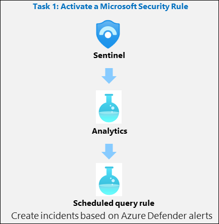
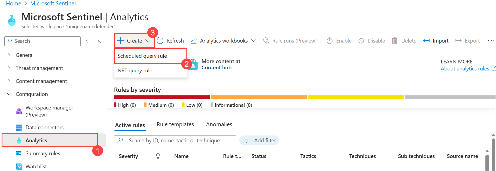
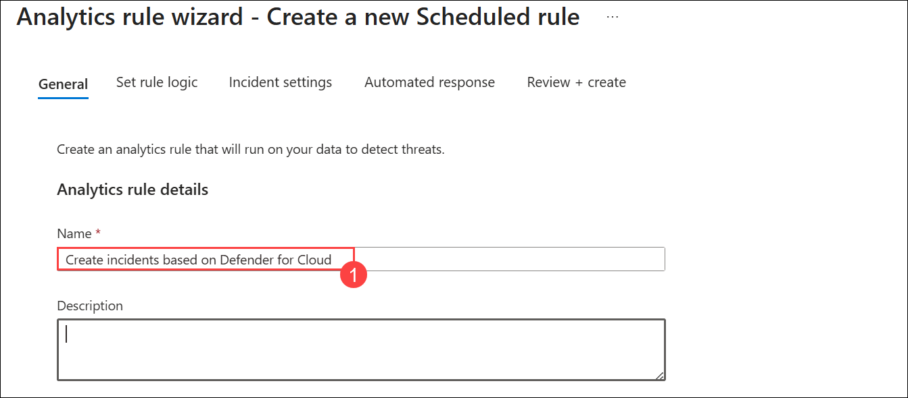
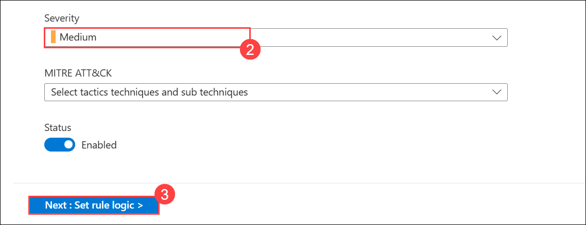
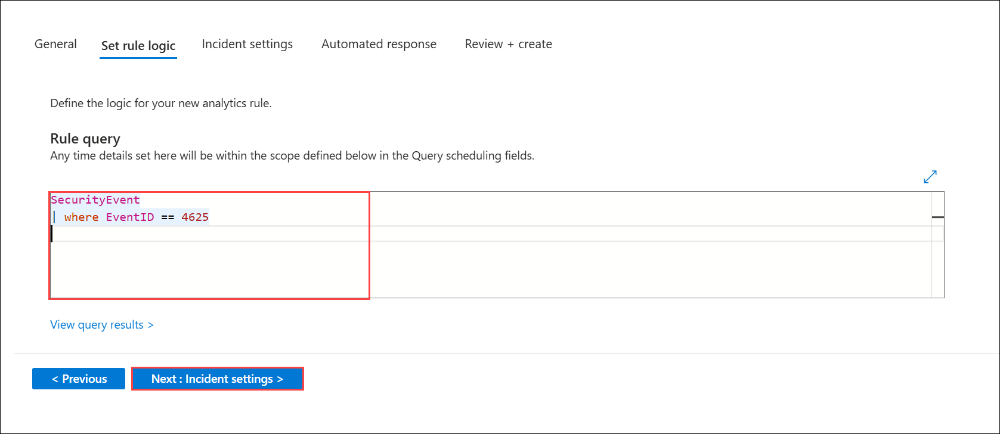
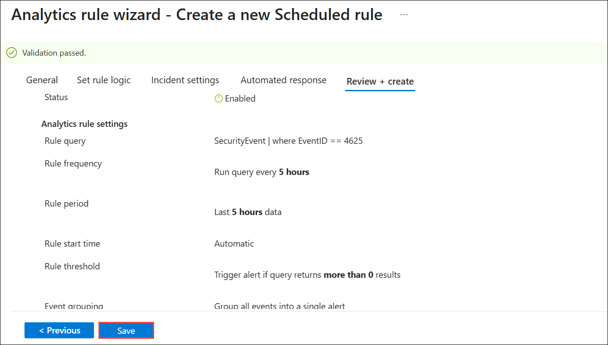

# Lab 09 - Exercise 1: Modify a Scheduled query rule

## Lab Scenario

You are a Security Operations Analyst working at a company that implemented Microsoft Sentinel. You must learn how to detect and mitigate threats using Microsoft Sentinel. First, you need to filter the alerts coming from Defender for Cloud into Microsoft Sentinel, by Severity. 

>**Note:** An **[interactive lab simulation](https://mslabs.cloudguides.com/guides/SC-200%20Lab%20Simulation%20-%20Modify%20a%20Microsoft%20Security%20rule)** is available that allows you to click through this lab at your own pace. You may find slight differences between the interactive simulation and the hosted lab, but the core concepts and ideas being demonstrated are the same.

>**Important:** The lab exercises for Learning Path #9 are in a **standalone** environment. If you exit the lab before completing it, you will be required to re-run the configurations again.

## Lab Objectives

 In this lab, you will perform the following:

 - Task 1: Activate a Scheduled query rule

## Estimated Timing: 20 Minutes

## Architecture Diagram

  

### Task 1: Activate a Scheduled query rule

In this task, you will activate a Microsoft Security rule.

1. In the Azure portal's search bar type **Microsoft sentinel (1)**, and select **Microsoft Sentinel (2)**.

   

1. Select **uniquenameDefender** Microsoft Sentinel Workspace.

   
        
1. Select **Analytics (1)** from the Configuration area. By default, you will see the **Active rules**.

   > **Note:** If you do not see the **Analytics** page in the Microsoft Sentinel portal, try refreshing the browser. Wait **5 minutes** and refresh again until it appears.

1. Select the **+ Create (2)** button from the command bar and select the **Scheduled query rule (3)**.

   

1. On the **Analytics rule wizard- Create a new Scheduled query rule** page, provide the following details and then click on **Next: Set rule logic(3)**:

   - Under Name, enter **Create incidents based on Defender for Cloud (1)**

   - Scroll down to Severity, select **Medium (2)**

     

     

1. On the **Set rule logic** pane, under **Rule query**, write the KQL query mentioned in the image, then select **Next: Incident settings**.

   

1. Select the **Next: Automated response (5)** button and then select **Next: Review + create** button.

1. On the **Analytics rule wizard- Create a new Scheduled query rule** page, Click on **save**.

   

### Review
In this lab, you have completed the following:

- Activated a Microsoft Security Rule

## Select **Next** to continue to Exercise 2
