# Lab - 10: Create a Playbook in Microsoft Sentinel

## Lab Scenario

You're a Security Operations Analyst working at a company that implemented Microsoft Sentinel. You must learn how to detect and mitigate threats using Microsoft Sentinel. Now, you want to respond and reMediate actions that can be run from Microsoft Sentinel as a routine.

With a playbook, you can help automate and orchestrate your threat response, integrate with other systems both internal and external, and can be set to run automatically in response to specific alerts or incidents, when triggered by an analytics rule or an automation rule, respectively.

>**Important:** The lab exercises for **Learning Path #9** are in a **standalone** environment. If you exit the lab before completing it, you will need to re-run the configurations upon re-entering.

## Lab Objectives
  
After completing this lab, you will be able to:
- Task 1: Create a Playbook in Microsoft Sentinel
- Task 2: Update a Playbook in Microsoft Sentinel
- Task 3: Create an Automation Rule

## Estimated Timing: 30 Minutes

## Architecture Diagram

  

### Task 1: Create a Playbook in Microsoft Sentinel

In this task, you'll create a Logic App that is used as a Playbook in Microsoft Sentinel.

1. On a new tab in the browser, go to **https://security.microsoft.com**

1. In the Microsoft Defender **Microsoft Sentinel (1)** navigation menu, scroll down to the **Content management (2)** section and select **Content Hub (3)**.

     

     > **Note:** After opening the **Microsoft Defender portal**, it may take **5–10 minutes** for the **Microsoft Sentinel workspace** to appear in the **Workspaces** list. If no workspace is displayed initially, **wait for a few minutes and refresh the page**, and then proceed to connect the workspace.  If the workspace is **already connected**, please **proceed to the next step**. 

     >**Note:** If the option is still not visible after trying these steps, it may be an issue with the Defender portal. In that case, please contact Cloudlabs-Support@spektrasystems.com for assistance.  

     > **Important:** The total lab duration already includes any waiting time required for deployments, data connectors, or services (such as the **5–10 minutes** mentioned above). Please do not worry if certain steps take additional time to complete, and plan your activities accordingly while performing the lab.

1. Within the search bar, search for **Sentinel SOAR Essentials (1)**, press **Enter** then select **Sentinel SOAR Essentials (2)** and then click on **Install (3)**.

   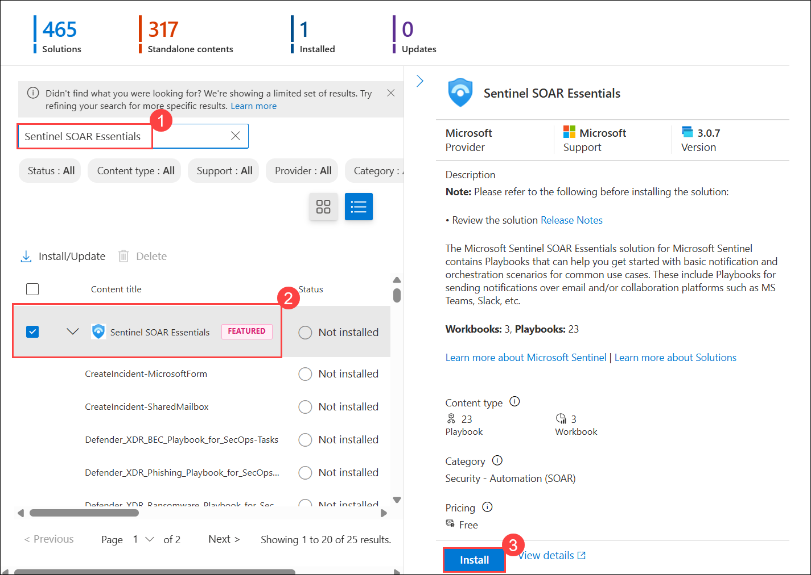

1. Within the solution details, select **Manage**.

    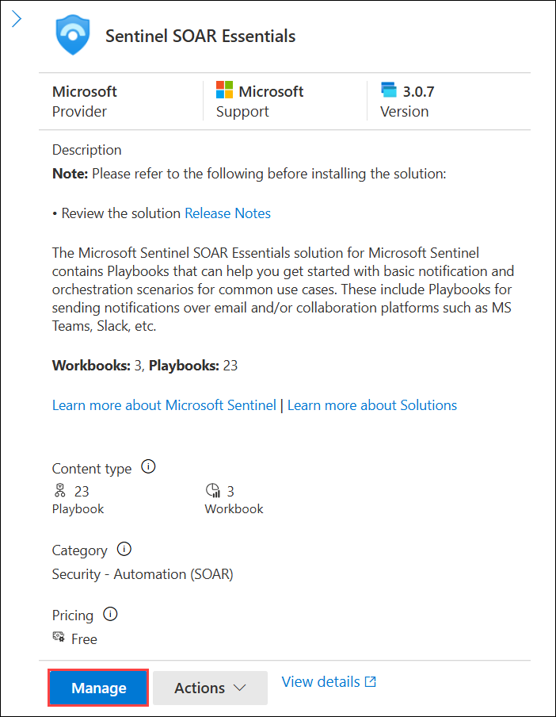

1. Find the **Defender_XDR_Ransomware_Playbook_for_SecOps-Tasks** playbook and select the name.

   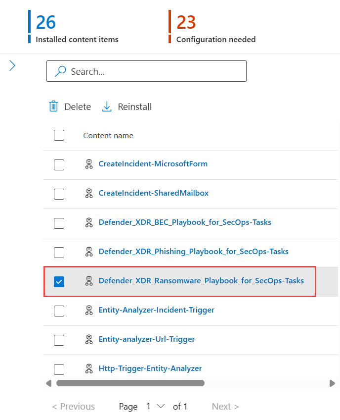

1. Select the **Incident tasks - Microsoft Defender XDR Ransomware Playbook for SecOps (1)** template. Then, in the details pane, select **Create playbook (2)**.

    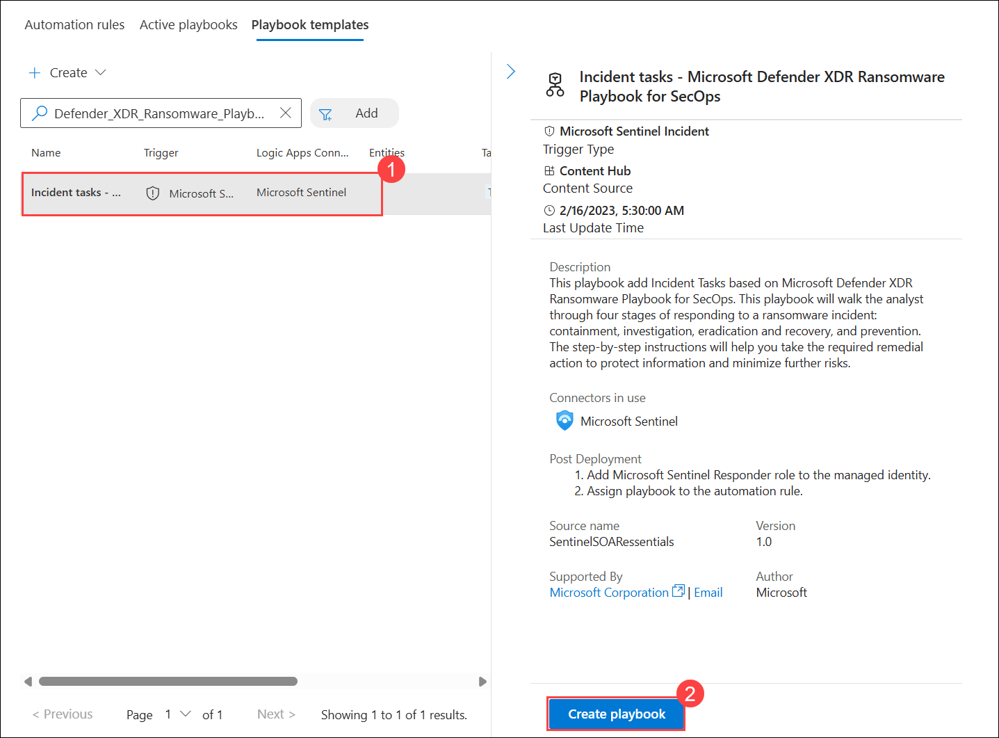

1. For Resource Group, select **Create New (1)**, enter **RG-playbooks (2)** and select **OK (3)**.

   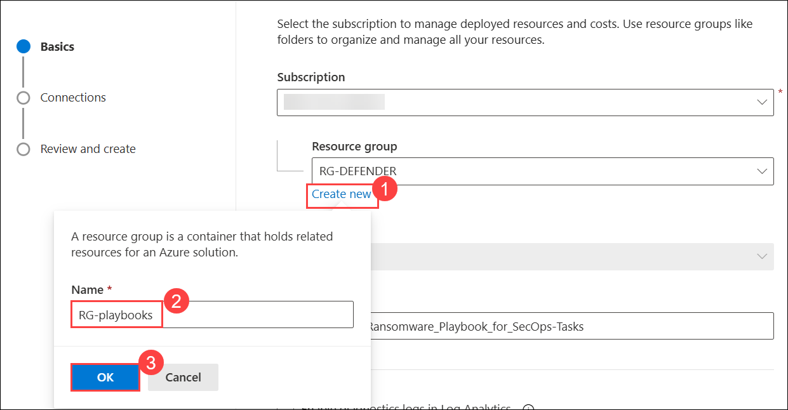

1. For the **Playbook name**, enter **Defender_XDR_Ransomware_Playbook_SecOps-Tasks (1)** (note that this would exceed the limit of 64 characters). Then, click on Select **Next:Connections (2)**.

   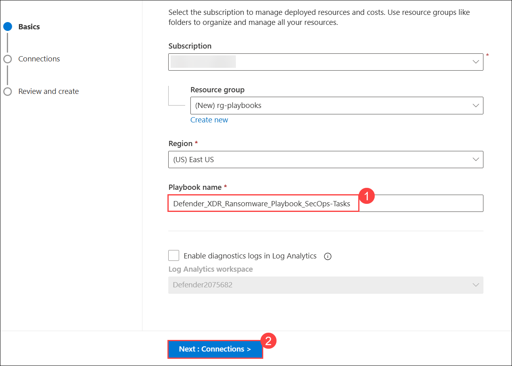

1. On the **Create playbook** page, select **Next: Review and create**.

    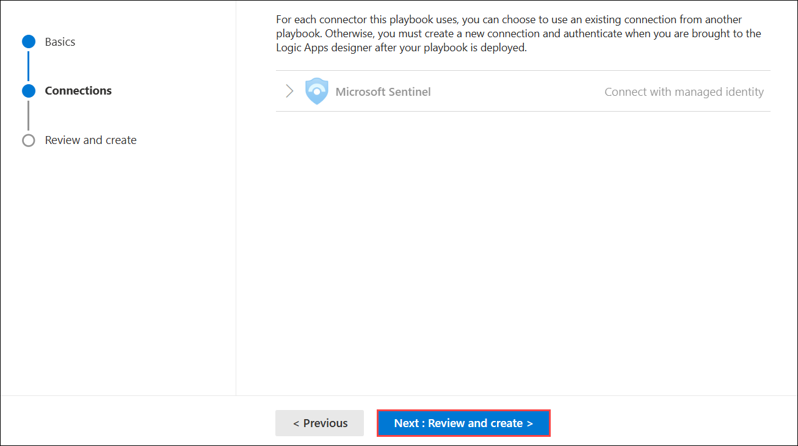

1. On the **Create playbook** page, select **Create Playbook**.

    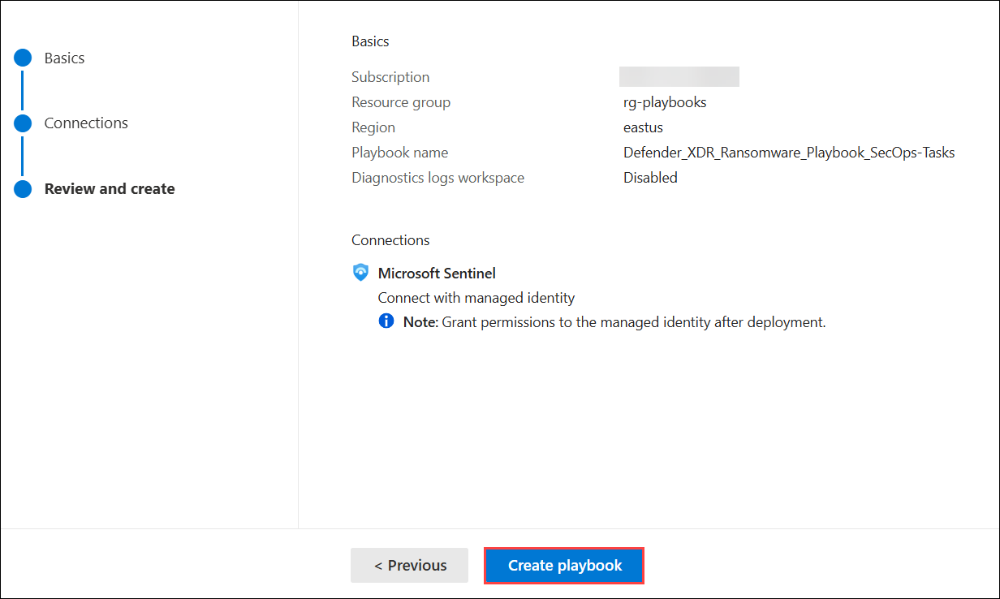

    >**Note:** Wait for the deployment to finish before proceeding to the next task.

1. Select the **Close and go to playbook** button to open the Logic App designer for the playbook.

### Task 2: Update a Playbook in Microsoft Sentinel

In this task, you update the new playbook you created with the proper connection information.

1. When the previous task completes you should be in the **Defender_XDR_Ransomware_Playbook_SecOps-Tasks | Logic app designer page**. If you aren't, complete steps 2-7 below.

    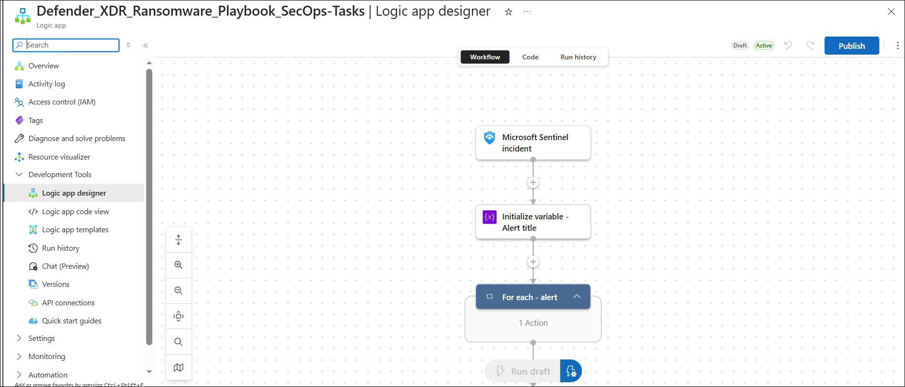

1. In the Search bar of the Azure portal, type Sentinel, then select Microsoft Sentinel.

1. Select your Microsoft Sentinel Workspace.

1. Select Automation under the Configuration area and then select the *Active Playbooks* tab.

1. Select Refresh from the command bar in case you don’t see any playbooks. You should see the playbook created from the previous step.

1. Select the **Defender_XDR_Ransomware_Playbook_SecOps_Tasks** playbook name link.

1. On the Logic app designer page for **Defender_XDR_Ransomware_Playbook_SecOps_Tasks**, in the command menu, select Edit.

    >**Note:** You may need to refresh the page.

1. Select the first block, **Microsoft Sentinel incident (1)**.

1. Select the **Change connection (2)** link.

    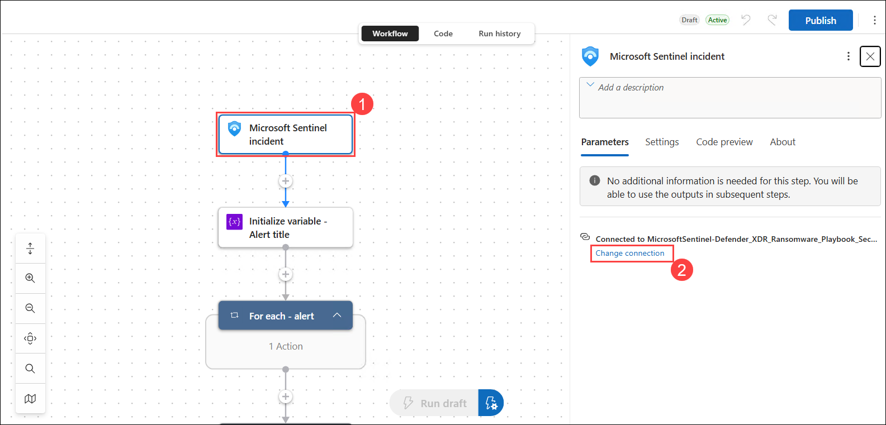

1. Scroll down the list of connections, select **Add new (1)** and select **Sign in (2)**.

    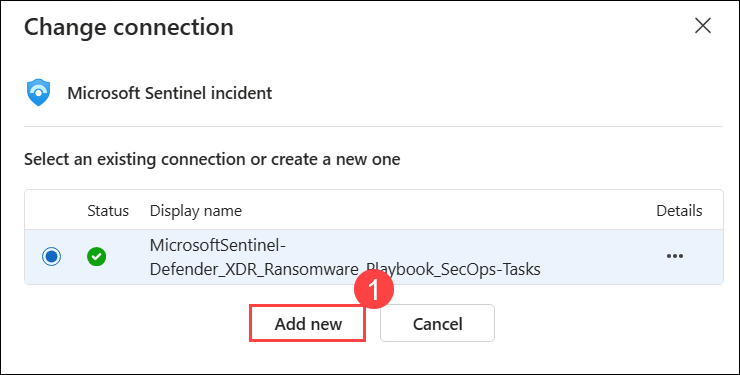

    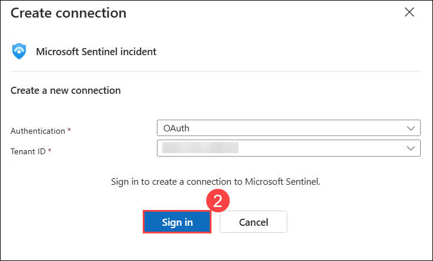

    >**Note:** If you see a **"The browser has blocked the popup window"** message while signing in, click the **Pop-up blocked** icon in the browser's address bar **(1)**, select **Always allow pop-ups and redirects from [https://portal.azure.com](https://portal.azure.com) (2)**, and then click **Done (3)**. After allowing pop-ups, click **Sign in** again to continue.

    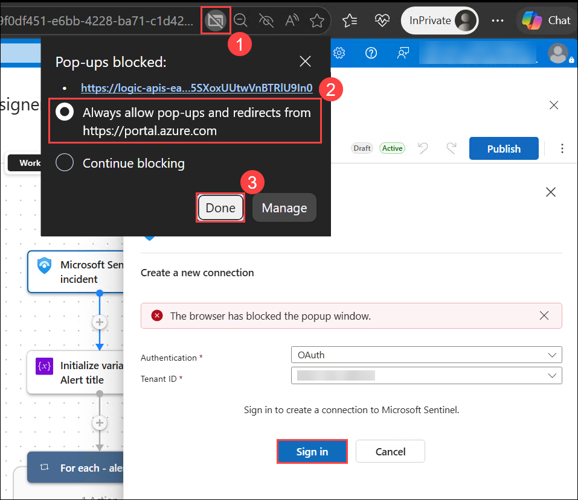

1. In the new window, select your Azure subscription admin credentials **<inject key="AzureAdUserEmail"></inject>** when prompted. 

    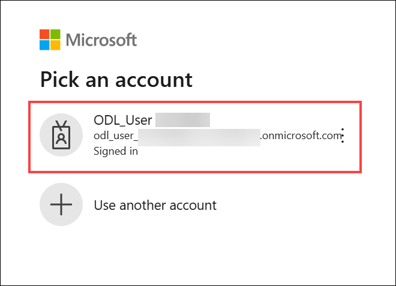

1. Your changes should auto-save, but selecting **Publish** on the command bar ensures they are applied.

    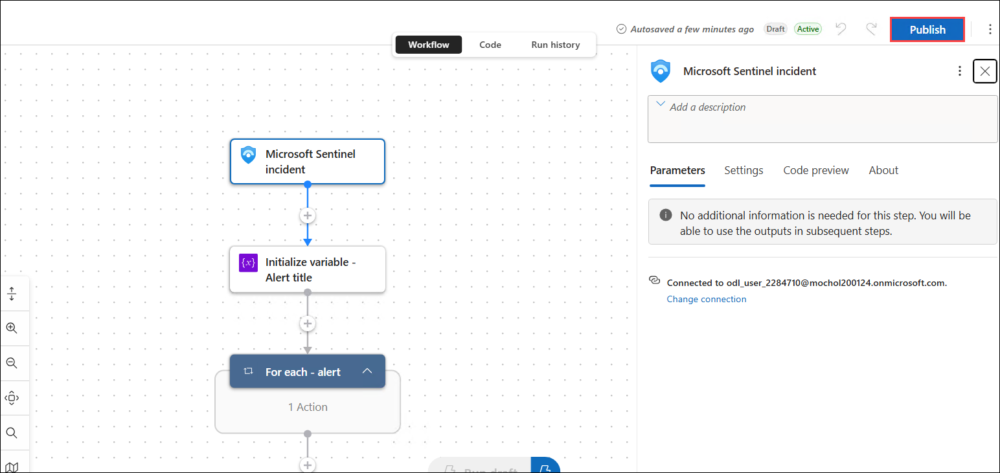

1. Select the **X** on the window to close it. The Logic App will be used in a future lab.

### Task 3: Create an Automation Rule

In this task, you will create an automation rule in Microsoft Sentinel that runs a playbook based on specific tactics.

### Grant Microsoft Sentinel permissions to run the playbook

1. In the Azure portal, open the **rg-playbooks** resource group. Select **Access control (IAM) (1)**, then select **Add (2)** > **Add role assignment (3)**.

    .png)

2. On the **Role** tab, search for **Microsoft Sentinel Automation Contributor (1)**, select the **Microsoft Sentinel Automation Contributor (2)** role, and then select **Review + assign (3)**.

    .png)

3. On the **Members** tab, ensure **User, group, or service principal (1)** is selected. Select **+ Select members (2)**, search for **Azure Security Insights (3)**, select **Azure Security Insights (4)**, and then select **Select (5)**.

    .png)

4. Verify that **Azure Security Insights** appears under **Members**, and then select **Review + assign** twice to assign the role.

    .png)

1. Navigate back to **Microsoft Sentinel** in Defender Portal.

1. Select **Automation (2)** under the **Configuration (1)** area and then click on the **+ Create (3)** drop-down and then select **Automation rule (4)**.

    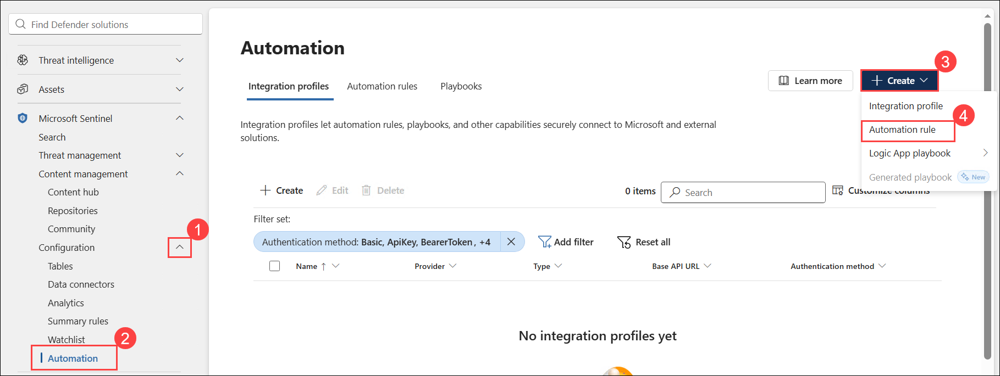

1. On the **Create Automation rule pane**, under **Rule type (1)**, select **Standard rule**.

2. In the **Name (2)** field, enter a name **myautomationrule<inject key="DeploymentID" enableCopy="false"/>** for the automation rule.

3. Under **Trigger (3)**, leave the default value as **When an incident is created**.

4. Under the **Conditions** section, configure the following:
    - Select **Tactics (4)** as the **Property**.
    - Select **Contains (5)** as the **Operator**.
    - Under **Value (6)**, select the following tactics:
        - Reconnaissance
        - Execution
        - Persistence
        - Command and Control
        - Exfiltration
        - PreAttack

5. Under **Actions**, select **Run Logic Apps playbook (7)**.

    > **Note:** If the playbook is unavailable, select **Manage playbook permissions** and grant Microsoft Sentinel the required permissions before continuing.

6. From the playbook list, select **Defender_XDR_Ransomware_Playbook_SecOps_Tasks (8)**.

7. Select **Create (9)** to create the automation rule.

    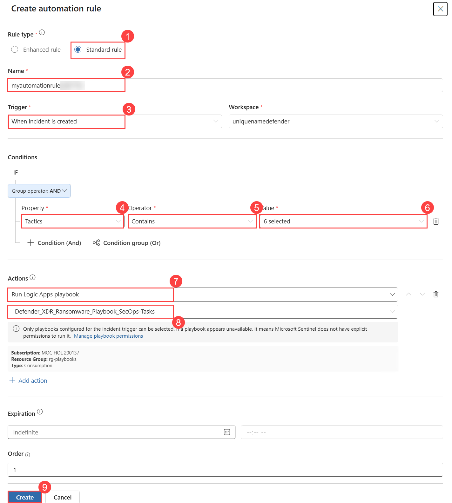

From here, depending on your role, you will either continue doing more architect exercises or you will pivot to the analyst exercises.

### Review
In this lab, you have completed the following:

- Created a Playbook in Microsoft Sentinel
- Updated a Playbook in Microsoft Sentinel
- Created an Automation Rule