# Module 9 - Lab 1 - Exercise 2 - Create a Playbook in Microsoft Sentinel

## Lab scenario

You're a Security Operations Analyst working at a company that implemented Microsoft Sentinel. You must learn how to detect and mitigate threats using Microsoft Sentinel. Now, you want to respond and reMediate actions that can be run from Microsoft Sentinel as a routine.

With a playbook, you can help automate and orchestrate your threat response, integrate with other systems both internal and external, and can be set to run automatically in response to specific alerts or incidents, when triggered by an analytics rule or an automation rule, respectively.

>**Important:** The lab exercises for Learning Path #9 are in a *standalone* environment. If you exit the lab before completing it, you will be required to re-run the configurations again.

## Lab Objectives
  
After completing this lab, you will be able to:
- Task 1: Create a Playbook in Microsoft Sentinel
- Task 2: Update a Playbook in Microsoft Sentinel
- Task 3: Create an Automation Rule

## Estimated timing: 30 minutes

### Task 1: Create a Playbook in Microsoft Sentinel

In this task, you'll create a Logic App that is used as a Playbook in Microsoft Sentinel.

1. In Azure Portal navigate to your Microsoft Sentinel Workspace.

1. In *Microsoft Sentinel*, navigate to **Content Hub**.

1. Within the search bar, look for **Sentinel SOAR Essentials**.

1. Select the solution that appears in the results and click on **Install**.

   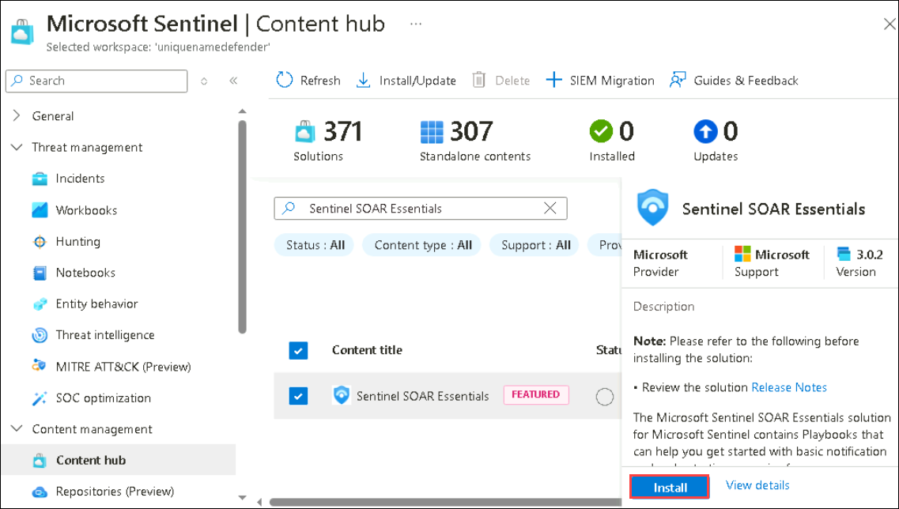

1. Within the solution details, select **Manage**.

    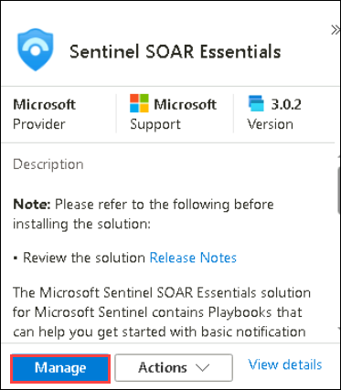

1. Find the **Defender_XDR_Ransomware_Playbook_for_SecOps-Tasks** playbook and select the name.

   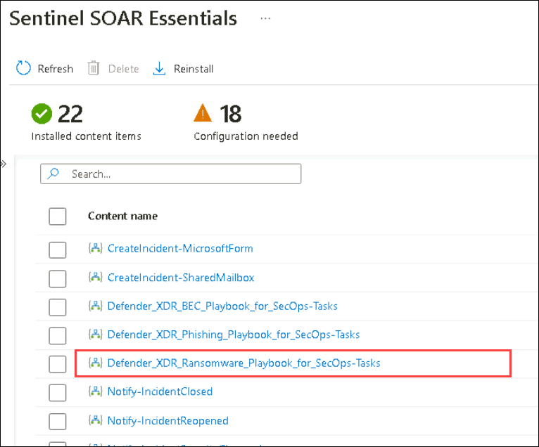

1. Select the **Incident tasks - Microsoft Defender XDR Ransomware Playbook for SecOps** template.

1. On the details pane, select **Create playbook**.

    

1. For Resource Group, select **Create New**, enter **RG-Playbooks** and select OK.

1. For Playbook name, enter **Defender_XDR_Ransomware_Playbook_SecOps-Tasks (1)** (would exceed limit of 64 characters).

1. Select **Connections (2)**.

   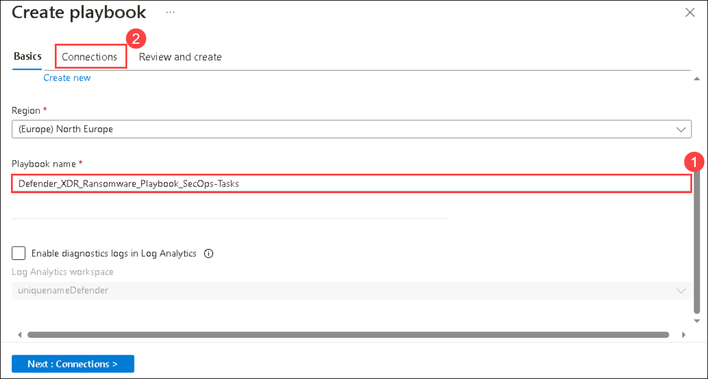

1. Select **Next: Review and create**.

    

1. Now select **Create Playbook**.

    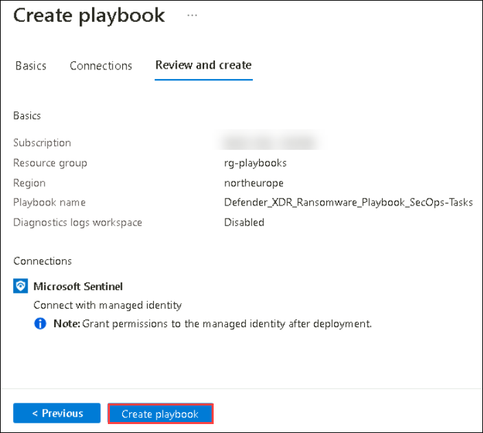

    >**Note:** Wait for the deployment to finish before proceeding to the next task.

### Task 2: Update a Playbook in Microsoft Sentinel

In this task, you’ll update the new playbook you created with the proper connection information.

1. In the Search bar of the Azure portal, type Sentinel, then select Microsoft Sentinel.

1. Select your Microsoft Sentinel Workspace.

1. Select Automation under the Configuration area and then select the Active Playbooks tab.

1. Select Refresh from the command bar in case you don’t see any playbooks. You should see the playbook created from the previous step.

1. Select the **Defender_XDR_Ransomware_Playbook_SecOps_Tasks** playbook name.

   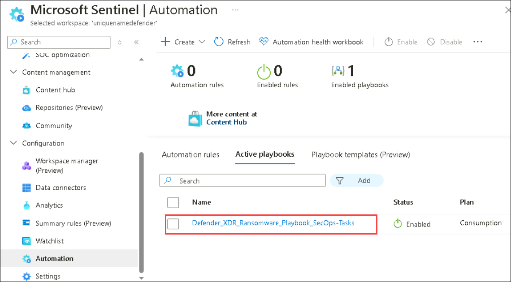

1. On the Logic App page for **Defender_XDR_Ransomware_Playbook_SecOps_Tasks**, in the command menu, select Edit.

    

    >**Note:** You may need to refresh the page.

1. Select the first block, Microsoft Sentinel incident.

1. Select the **Change connection** link.

    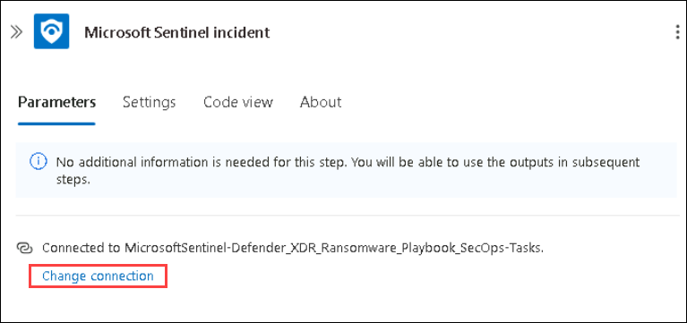

1. Select Add new and select Sign in. 

    

1. In the new window. Select your Azure subscription then click on **Sign in**.

   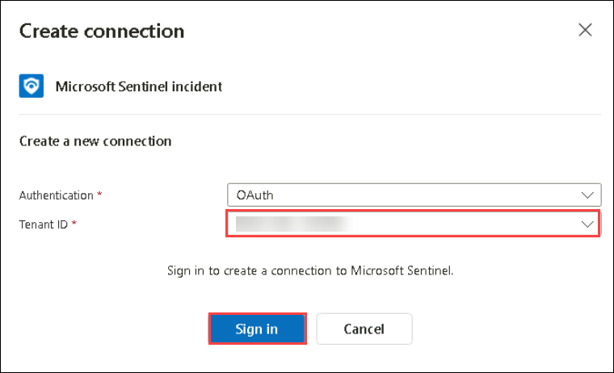

1. Admin credentials when prompted.

    

1. The last line of the block should now read “Connected to your-admin-username”.

1. Below within the logic split, select Add task to incident.

1. Select Save on the command bar. The Logic App will be used in a future lab.

    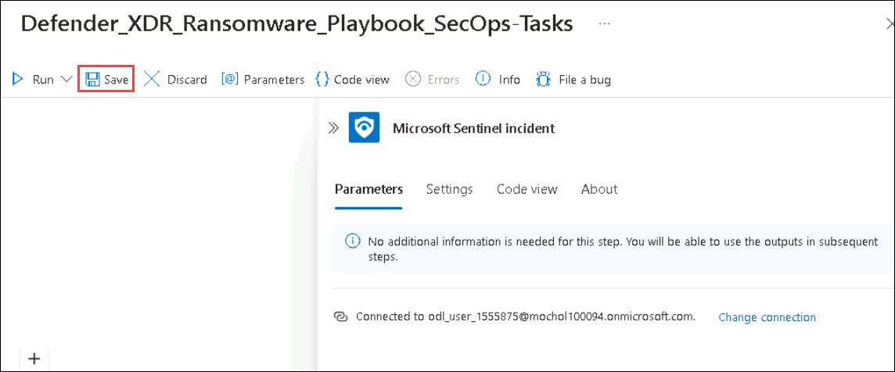

### Task 3: Create an Automation Rule

1. Within Microsoft Sentinel, go to Automation under Configuration.

1. Select Create and choose Automation Rule.

   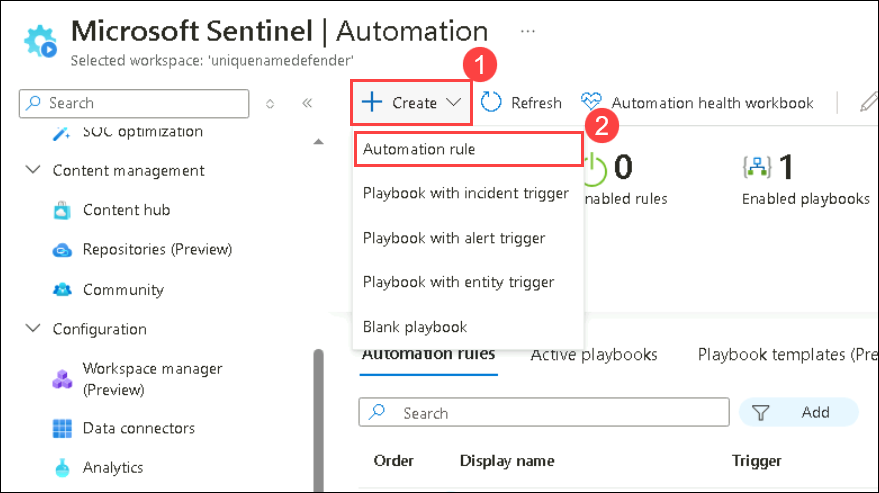

1. Give the rule a name as **myautomationrule<inject key="DeploymentID" enableCopy="false"/>**

1. Leave the incident provider as All.

1. Leave the Analytic rule name as All.

1. Click Add and choose And.

    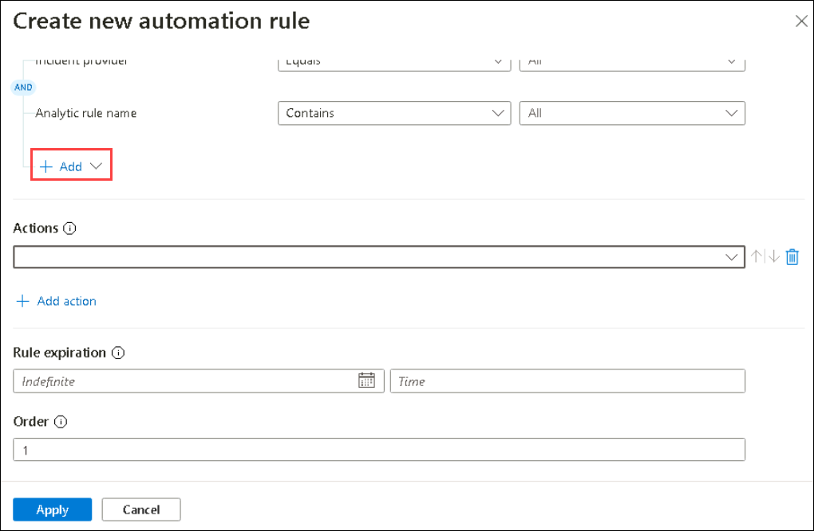

1. From the drop down, select Tactics.

1. Select the **Contains** operator from the dropdown.

1. Select the following tactics:
    - Reconnaissance
    - Execution
    - Persistence
    - Command and Control
    - Exfiltration
    - PreAttack

      

1. Under Actions, select Run Playbook.

1. Select the link to **Manage playbook permissions**.

1. On the *Manage Permissions* page, select the **RG-DEFENDER** resource group you created in the previous lab, and select **Apply**.

1. From the drop down list, select the **Defender_XDR_Ransomware_Playbook_SecOps_Tasks** playbook.

1. Select **Apply** at the bottom.

   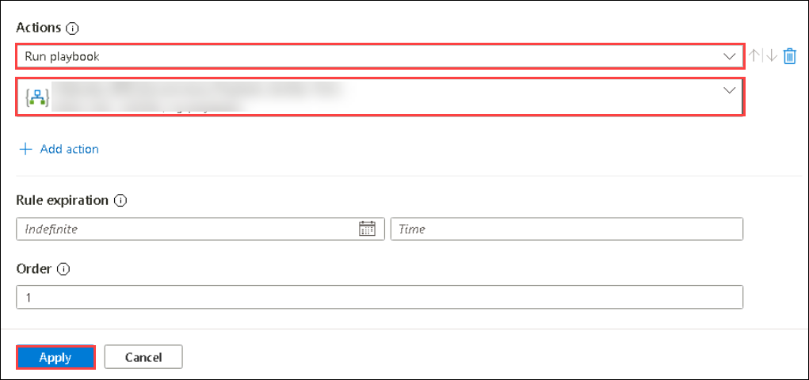

From here, depending on your role, you will either continue doing more architect exercises or you will pivot to the analyst exercises.

   > **Congratulations** on completing the task! Now, it's time to validate it. Here are the steps:
   > - Hit the Validate button for the corresponding task. You can proceed to the next task if you receive a success message.
   > - If not, carefully read the error message and retry the step, following the instructions in the lab guide.
   > - If you need any assistance, please contact us at labs-support@spektrasystems.com. We are available 24/7 to help you out.

   <validation step="9a03fda7-3dc7-407d-bbea-d9650d728011" />

### Review
In this lab, you have completed the following:
- You have created a Playbook in Microsoft Sentinel
- You have updated a Playbook in Microsoft Sentinel
- Created an Automation Rule

## Select **Next** to continue to Lab 3.
