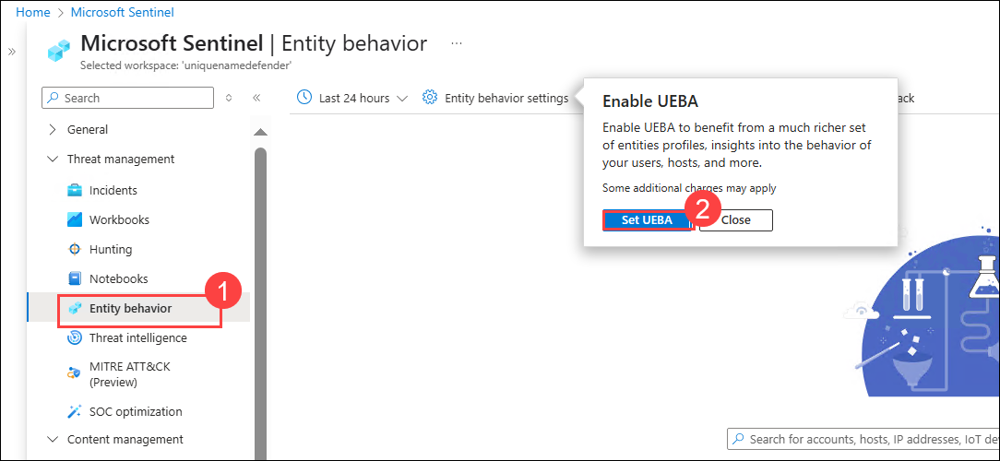
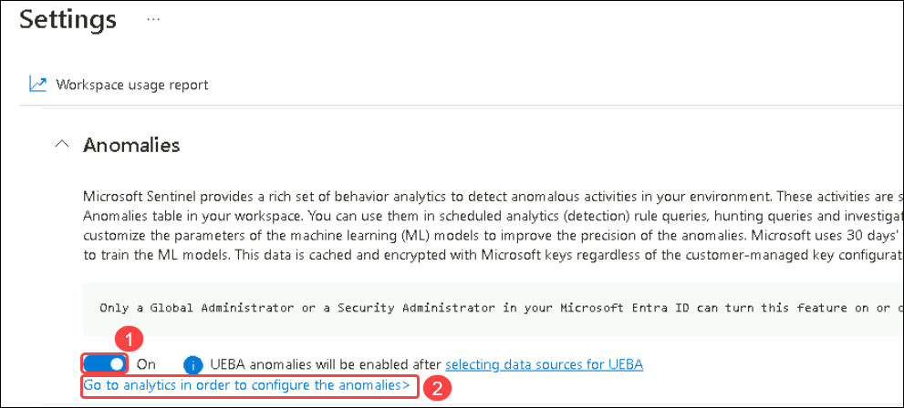
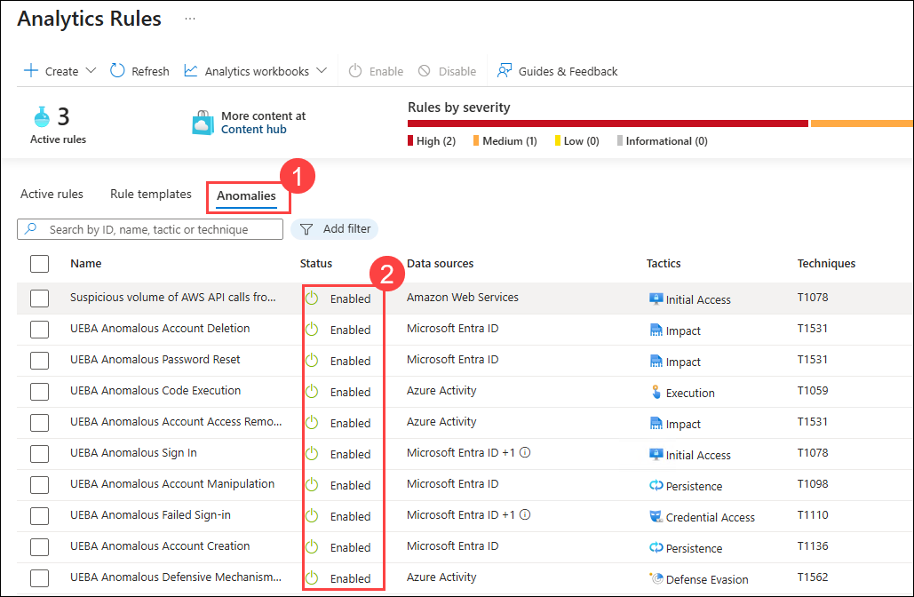
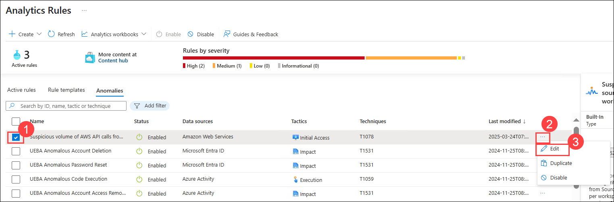
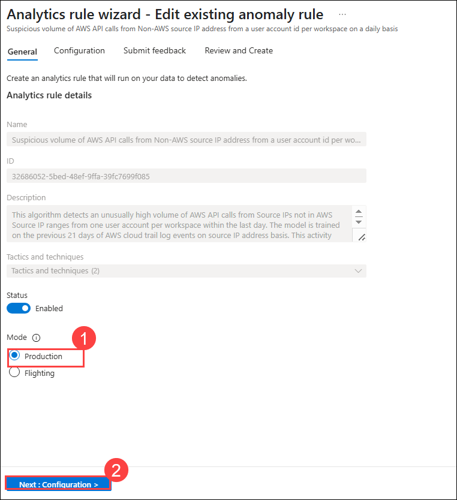
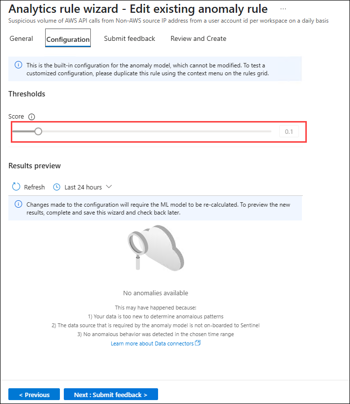
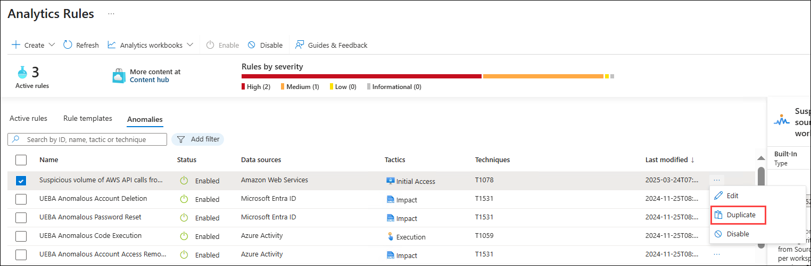
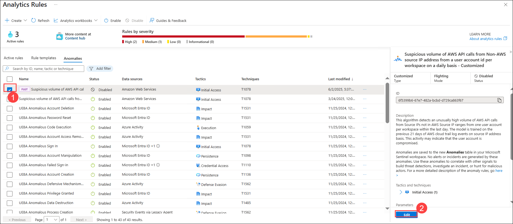
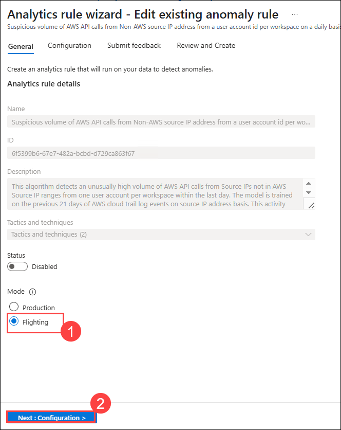
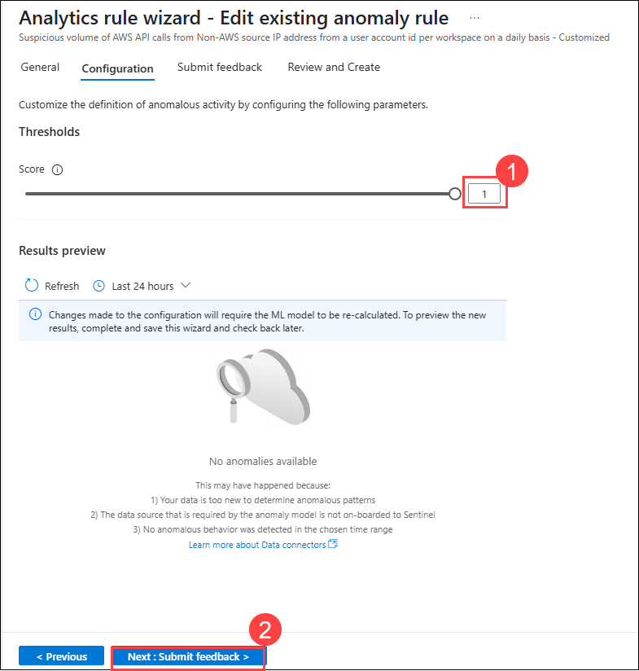

# Module 9 - Lab 1 - Exercise 4 - Explore Entity Behavior Analytics

## Lab Scenario

You are a Security Operations Analyst working at a company that implemented Microsoft Sentinel. You already created Scheduled and Microsoft Security Analytics rules. 

You need to configure Microsoft Sentinel to perform Entity Behavior Analytics to discover anomalies and provide entity analytic pages.

>**Note:** An **[interactive lab simulation](https://mslabs.cloudguides.com/guides/SC-200%20Lab%20Simulation%20-%20Explore%20entity%20behavior%20analytics)** is available that allows you to click through this lab at your own pace. You may find slight differences between the interactive simulation and the hosted lab, but the core concepts and ideas being demonstrated are the same. 

>**Important:** The lab exercises for Learning Path #9 are in a *standalone* environment. If you exit the lab before completing it, you will be required to re-run the configurations again.

## Lab Objectives
 In this lab, you will perform the following:
- Task 1: Explore Entity Behavior 
- Task 2: Confirm and review Anomalies rules

## Estimated Timing: 20 minutes

## Architecture Diagram

  

### Task 1: Explore Entity Behavior 

In this task, you will explore Entity behavior analytics in Microsoft Sentinel.

1. In the Azure portal's search bar type **Microsoft sentinel (1)**, and select **Microsoft Sentinel (2)**.

   

1. Select **uniquenameDefender** Microsoft Sentinel Workspace.

    

1. On the left menu Select the **Entity behavior (1)** page.

1. On the popup from **Entity behavior settings**, select **Set UEBA (2)**.

    

1. On the **Settings** tab under **Entity Behavior Analytics**, scroll down to the **Anomalies** section, read through the paragraph, and verify that the **switch** is set to **On (1)**. Then, select the **Go to analytics in order to configure the anomalies (2)** link.

    

### Task 2: Confirm and review Anomalies rules

In this task, you will confirm Anomalies analytics rules are enabled.

1. You should be now at the **Analytics** page, **Anomalies (1)** tab.

1. Confirm status column of the rules is **Enabled (2)**.

    

1. Select any rule **(1)** then select **ellipsis (...) (2)** icon at the right of the rule and then click **Edit (3)**.

    

    >**Note:** If you are not able to select the edit option, please refresh the page. Navigate to other tabs then come back to the **Anomalies** tab.

1. Review the **General** tab information. Notice the **Mode** is **Production (1)** and then select **Next: Configuration (2)**.

    

1. Review the *Configuration* tab information. Notice that you cannot change the **Anomaly score threshold**.

    

1. Then select **X** in the top right corner to exit the Analytics rule wizard.

1. Scroll right to the analytics rule you selected until see and select the ellipsis **(...)** icon.

1. Select **Duplicate**.

    

1. Scroll left to review the new rule with the **FLGT** tab at the beginning of the name.

1. Select **FLGT (1)** rule and then select **Edit (2)** on the rule blade.

    

1. Review the *General* tab information. Notice the *Mode* is **Flighting (1)** and then select **Next: Configuration (2)**.

    

1. Review the *Configuration* tab information. Notice that you can now change the **Anomaly score threshold**.

1. Set the value to **1 (1)** and then select **Next: Submit Feedback (2)**.

    

1. Select **Next: Review + Create** and then **Save** to update the rule.

    >**Note:** You can upgrade the **Flighting** rule to **Production** by modifying the setting on this rule and saving the changes. The existing **Production** rule will then become the new **Flighting** rule.
    
### Review
In this lab, you completed follwing tasks:

- Explored Entity Behavior 
- Confirmed and reviewed Anomalies rules

## Select **Next** to continue to Exercise 5
