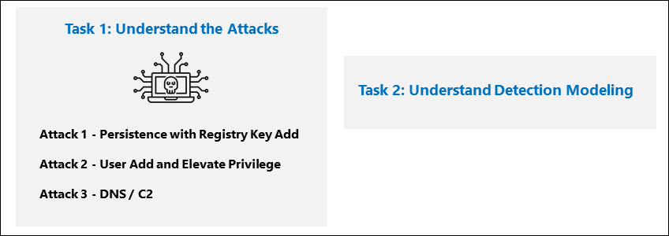
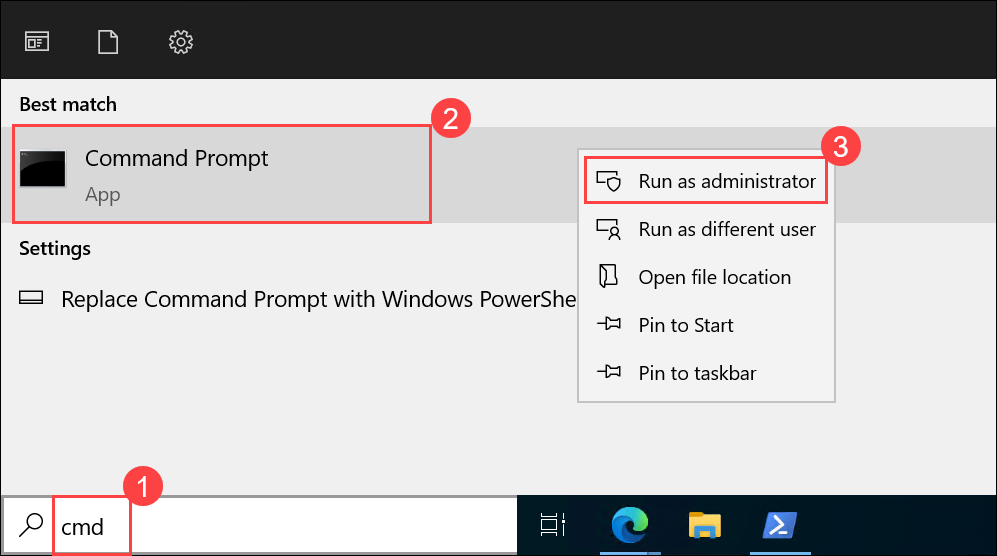
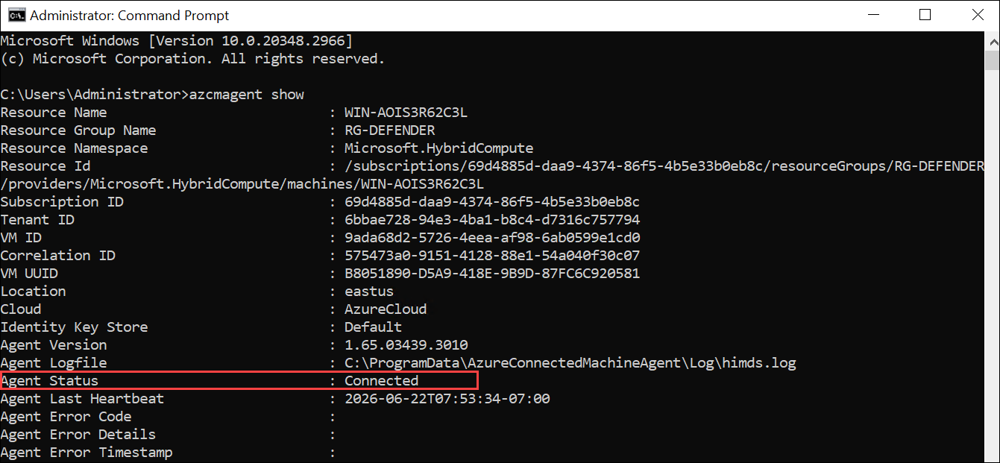
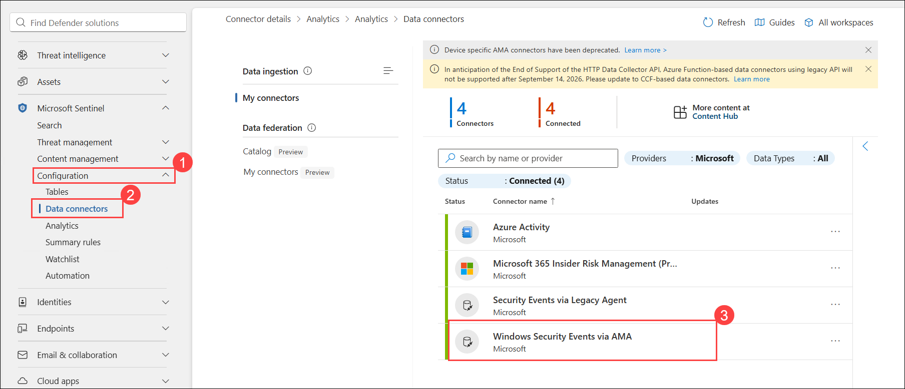
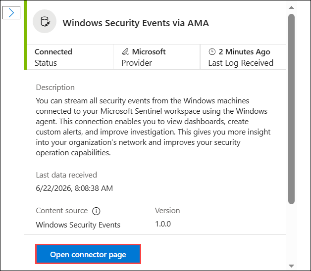
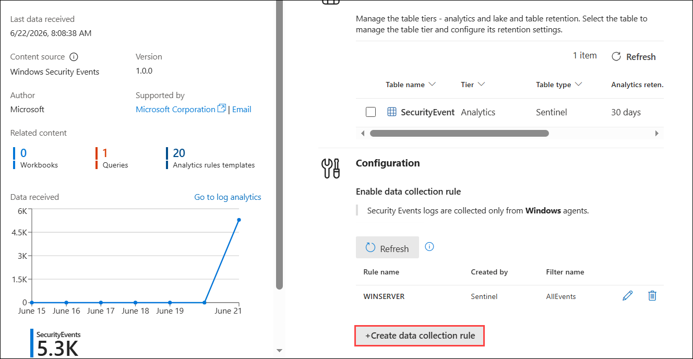
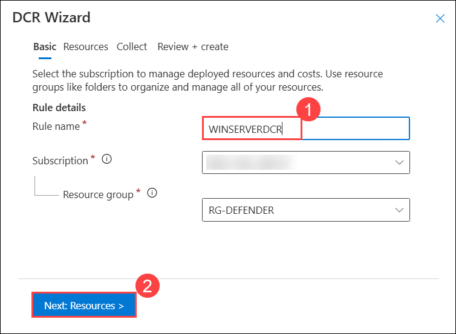
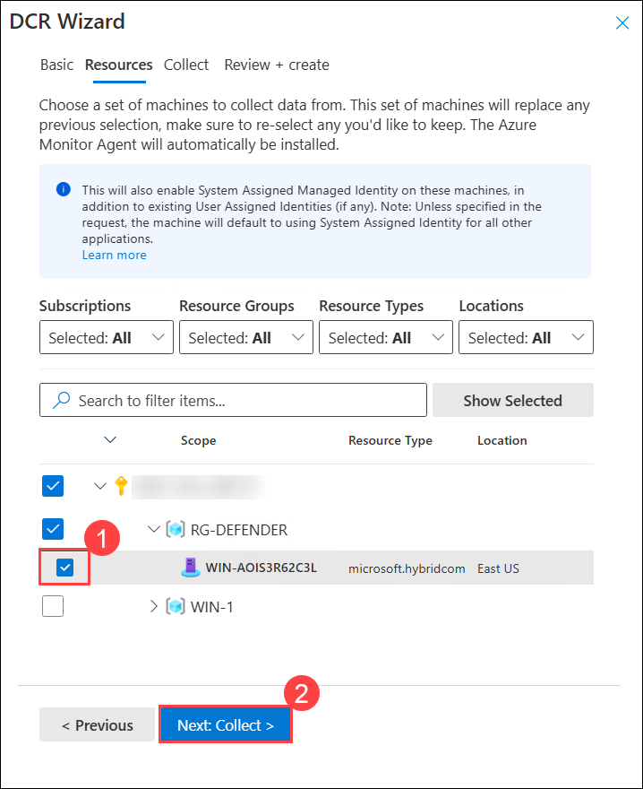

# Lab - Exercise 4: Prepare to perform simulated attacks

### Lab Scenario

In this lab, you will understand the attacks and about Detection Modeling

## Lab objectives
 In this lab, you will understand the following:

- Task 1: Connect an On-Premises Server
- Task 2: Connect a non-Azure Windows Machine
- Task 3: Understand the Attacks
- Attack 1 - Persistence with Registry Key Add.
- Attack 2 - User Add and Elevate Privilege
- Attack 3 - DNS / C2 
- Task 4: Understand Detection Modeling.

## Estimated timing: 10 Minutes

## Architecture Diagram

  

### Task 1: Connect an On-Premises Server

In this task, you'll connect an on-premises server to your Azure subscription. Azure Arc was pre-installed on this server. The server will be used in next exercises to run simulated attacks that you will later detect and investigate in Microsoft Sentinel.

>**Important:** The next steps are done on a different machine than the one you were previously working. Look for the Virtual Machine name in the references tab.

As described above, the Azure Arc Connected Machine agent (azcmagent) has been pre-installed on the **WINServer** machine. Before you attempt to connect this machine to your Azure subscription we will check the connection status.

1. On the *WINServer* machine, select the *search* icon and type **cmd (1)**.

1. In search results right click *Command Prompt* and select **Run as administrator (2)**.

    

1. In the Command Prompt window, type the following command to check the connection status of the Azure Arc agent:

    ```cmd
    azcmagent show
    ```

    

1. If the command output shows that *Agent status* is **Connected**. proceed to **Task 2**. 

1. If it is not connected, perform the following steps before proceeding to reconnect *WINServer* to Azure Arc:

    1. Open the the Azure portal `https://portal.azure.com` in the *Edge* browser, and verify that it is *not* listed as a resource in the *SentinelStatic* resource group. If it is, select it and delete it from the resource group.
    
    1. After *WINServer* is deleted from the resource group, run the following command from the *WINServer* command Prompt to make sure it is disconnected from Azure Arc:

        ```cmd
        azcmagent disconnect --force-local-only
        ```
    1. Leave the browser and Command Prompt windows open for the next steps.

1. Run the following command to connect the machine to Azure Arc:

    ```cmd
    azcmagent connect -g "SentinelStatic" -l "CentralUS" -s "Subscription ID string"
    ```
1. Replace the **Subscription ID string** with the *Subscription ID* provided under **Environment** tab. Make sure to keep the quotes.

1. Type **Enter** to run the command (this may take a couple minutes).

    >**Note**: If you see the *How do you want to open this?* browser selection window, select **Microsoft Edge**.

1. In the *Sign in* dialog box, enter your **Tenant Email** and **Tenant Password** provided under **Environment** tab and select **Sign in**. Wait for the *Authentication complete* message, close the browser tab and return to the *Command Prompt* window.

1. When the commands complete running, leave the *Command Prompt* window open and type the following command to confirm that the connection was successful:

    ```cmd
    azcmagent show
    ```
1. In the command output, verify that *Agent status* is **Connected**.

## Task 2: Connect a non-Azure Windows Machine

In this task, you'll add an Azure Arc connected, on-premises machine to Microsoft Sentinel.  

>**Note:** Microsoft Sentinel has been predeployed in your Azure subscription with the name **sentinelworkspace-01**, and the required *Content Hub* solutions have been installed.

1. In the Edge browser, navigate to Defender XDR at `https://security.microsoft.com`.

1. In the Microsoft Defender navigation menu, scroll down and expand the **Microsoft Sentinel** section.

1. Expand the **Configuration (1)** section and select **Data connectors (2)**.

1. In the *Data connectors*, search for the **Windows Security Events via AMA (3)** solution and select it from the list.

    

1. On the *Windows Security Events via AMA* details pane, select **Open connector page**.

    

    >**Note:** The *Windows Security Events* solution installs both the *Windows Security Events via AMA* and the *Security Events via Legacy Agent* Data connectors. Plus 2 Workbooks, 20 Analytic Rules, and 43 Hunting Queries.

1. In the *Configuration* section, under the *Instructions* tab, select the **Create data collection rule**.

    

1. Enter a Rule Name like **WINSERVERDCR (1)** for the DCR, then select **Next: Resources (2)**.

    

    >**Note:** Use a unique name for the Rule Name, consider using your *Student* username number to make it unique, for example, **WINXXXXXXXXDCR**.

1. Expand your *Subscription* under *Scope* on the *Resources* tab.

    >**Hint:** You can expand the whole *Scope* hierarchy by selecting the ">" before the *Scope* column.

1. Expand **RG-DEFENDER** Resource Group, then select **WIN-xxxx (1)**.

    

1. Select **Next: Collect (2)**, and leave the *All Security Events* selected.

1. Select **Next: Review + create >**.

1. Select **Create** after *Validation passed* is displayed.

### Task 3: Understand the Attacks

**IMPORTANT: You will perform no actions in this exercise.**  These instructions are only an explanation of the attacks you will perform in the next exercise. Please carefully read this page.

The attack patterns are based on an open-source project: https://github.com/redcanaryco/atomic-red-team

   **Note:** Some settings are triggered in a smaller time frame just for our lab purpose.

#### Attack 1 - Persistence with Registry Key Add.

This attack is run from a command prompt:

```Command
REG ADD "HKCU\SOFTWARE\Microsoft\Windows\CurrentVersion\Run" /V "SOC Test" /t REG_SZ /F /D "C:\temp\startup.bat"
```

#### Attack 2 - User Add and Elevate Privilege

Attackers will add new users and elevate the new user to the Administrators group.  This enables the attacker to logon with a different account that is privileged.

```Command
net user theusernametoadd /add
net user theusernametoadd ThePassword1!
net localgroup administrators theusernametoadd /add
```

#### Attack 3 - DNS / C2 

This attack will simulate a command and control (C2) communication.

```PowerShell
param(
    [string]$Domain = "microsoft.com",
    [string]$Subdomain = "subdomain",
    [string]$Sub2domain = "sub2domain",
    [string]$Sub3domain = "sub3domain",
    [string]$QueryType = "TXT",
        [int]$C2Interval = 8,
        [int]$C2Jitter = 20,
        [int]$RunTime = 240
)
$RunStart = Get-Date
$RunEnd = $RunStart.addminutes($RunTime)
$x2 = 1
$x3 = 1 
Do {
    $TimeNow = Get-Date
    Resolve-DnsName -type $QueryType $Subdomain".$(Get-Random -Minimum 1 -Maximum 999999)."$Domain -QuickTimeout
    if ($x2 -eq 3 )
    {
        Resolve-DnsName -type $QueryType $Sub2domain".$(Get-Random -Minimum 1 -Maximum 999999)."$Domain -QuickTimeout
        $x2 = 1
    }
    else
    {
        $x2 = $x2 + 1
    }
    if ($x3 -eq 7 )
    {
        Resolve-DnsName -type $QueryType $Sub3domain".$(Get-Random -Minimum 1 -Maximum 999999)."$Domain -QuickTimeout
        $x3 = 1
    }
    else
    {
        $x3 = $x3 + 1
    }
    $Jitter = ((Get-Random -Minimum -$C2Jitter -Maximum $C2Jitter) / 100 + 1) +$C2Interval
    Start-Sleep -Seconds $Jitter
}
Until ($TimeNow -ge $RunEnd)
```

### Task 4: Understand Detection Modeling.

The attack-detect configuration cycle used in this lab represents all data sources even though you are only focused on two specific data sources.

To build a detection, you first start with building a KQL statement.  Since you will attack a host, you will have representative data to start building the KQL statement.

The following lab runs the same attacks on a Windows host with Defender for Endpoint installed and Windows with Sysmon installed.  As you build the detections, you will see the difference in data normalization for each.

After you have the KQL statement, you create the Analytical Rule.

Once the rule triggers and creates the alerts and incidents, you then investigate to decide if you are providing fields that help Security Operations Analysts in their investigation.

Next, make any other changes to the analytics rule.

## Review
In this lab
- Understood attacks:

    - Attack 1 - Persistence with Registry Key Add.
    - Attack 2 - User Add and Elevate Privilege
    - Attack 3 - DNS / C2

- Understood Detection Modeling. 

## Select **Next** to continue to Exercise 5
