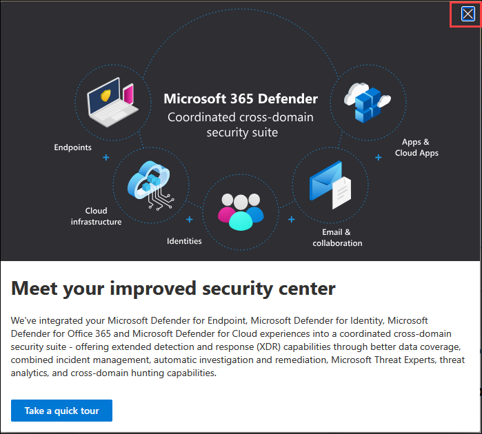
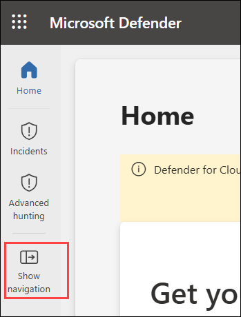
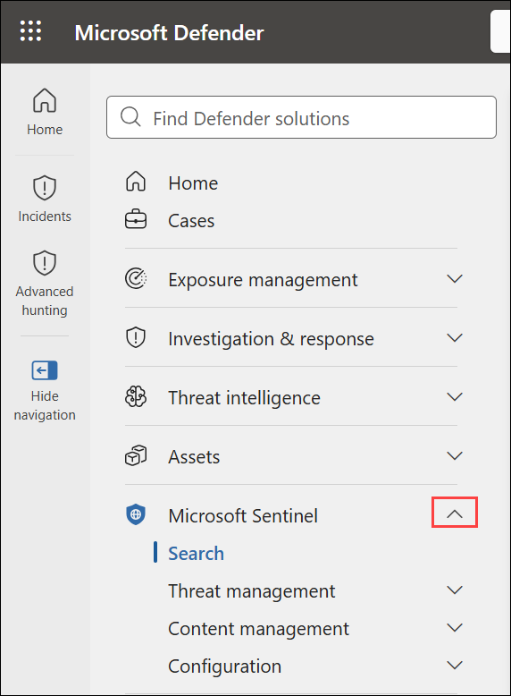
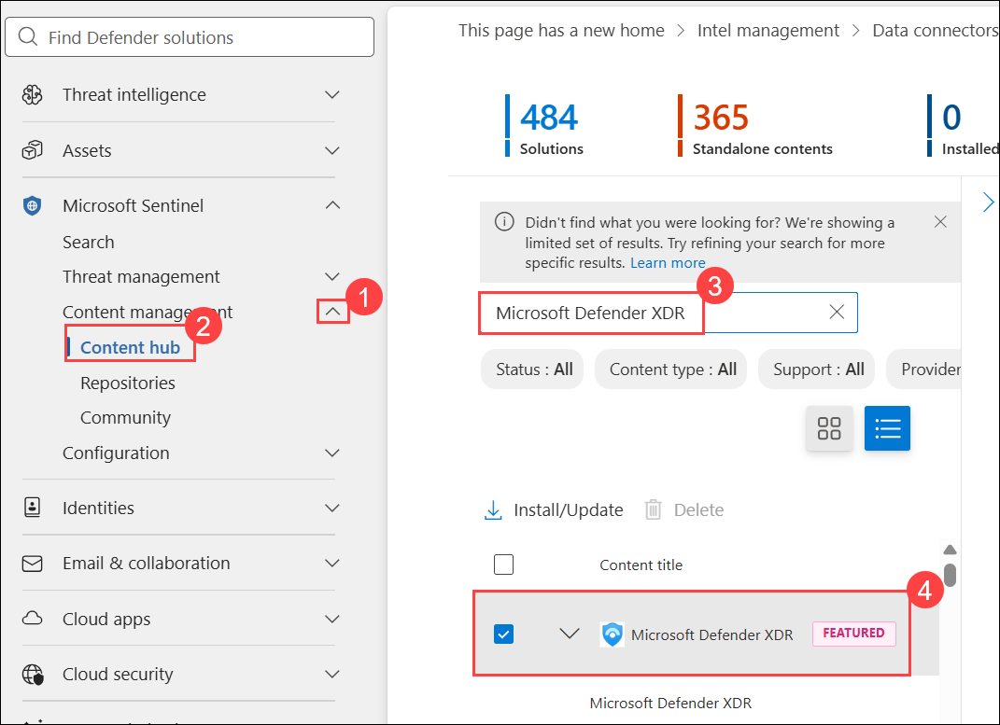
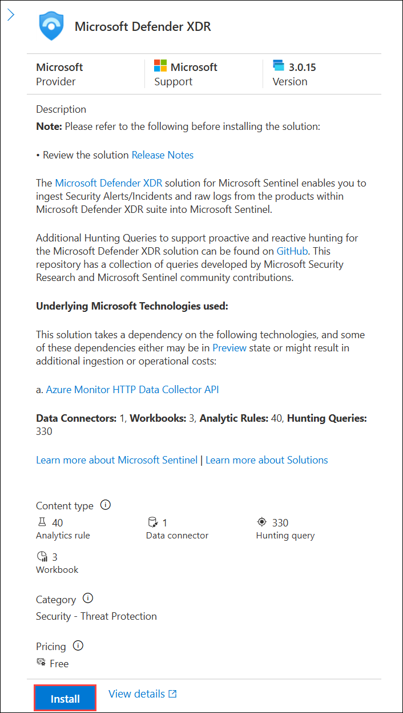
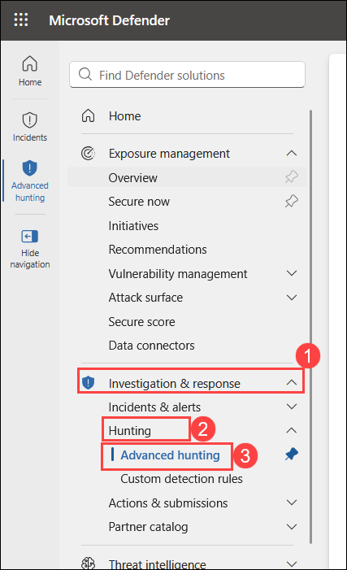
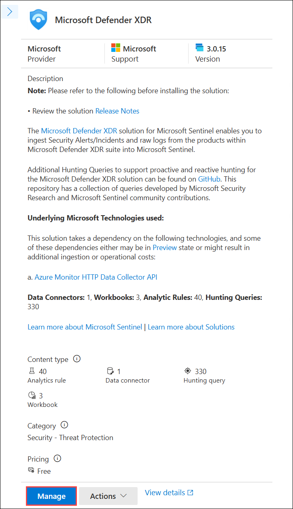
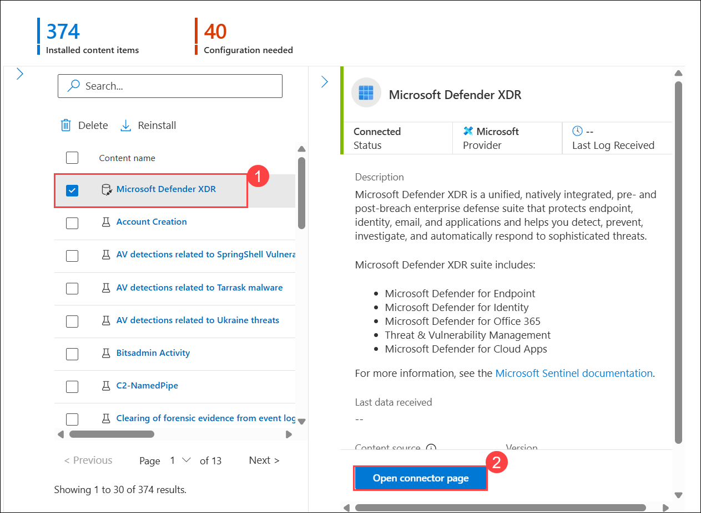
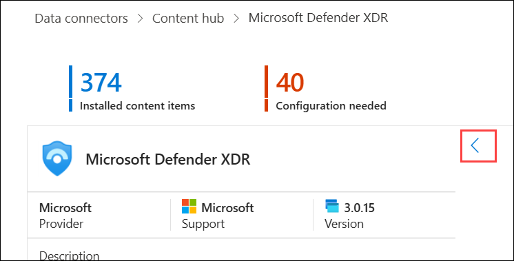

# Lab - Connect Defender XDR to Microsoft Sentinel using data connectors

## Lab scenario

You're a Security Operations Analyst working at a company that has deployed both Microsoft Defender XDR and Microsoft Sentinel. You need to unify your security operations by connecting Microsoft Sentinel to the Microsoft Defender portal. Once connected, the Microsoft Defender XDR data connector streams Defender XDR incidents, alerts, and advanced hunting events into Microsoft Sentinel and keeps incidents synchronized between the two experiences. In this lab you connect your Sentinel workspace to the Defender portal, confirm the Defender XDR connector, and run an advanced hunting query against Microsoft Sentinel data.


## Lab Objectives
 In this lab, you will perform the following:

- Task 1: Connect the Microsoft Defender XDR connector

- Task 2: Explore Microsoft Sentinel in the Defender portal and run an advanced hunting query

- Task 3: Verify the Microsoft Defender XDR connector status

### Estimated Timing: 120 Minutes

## Task 1: Connect the Microsoft Defender XDR connector

1. On the **LabVM**, open **Edge** browser, go to the **Microsoft Defender portal** by visiting the following link: [Security portal](https://security.microsoft.com).

1. In the **Sign in** dialog box, copy and paste **Email/Username: <inject key="AzureAdUserEmail"></inject>** and then select **Next**.

1. In the **Enter password** dialog box, copy and paste **Password: <inject key="AzureAdUserPassword"></inject>** and then select **Sign in**.

1. Close the welcome page in **Microsoft Defender** portal.

   

1. On **Microsoft Defender** page, if the left navigation pane is collapsed, select **Show navigation** to expand it.

   

1. In the Microsoft Defender portal, confirm that **Microsoft Sentinel** appears in the left navigation pane. Expand it and note the available sections: **Search**, **Threat management**, **Content management**, and **Configuration**.

     

    >**Note:** There are capability differences between the Azure portal Microsoft Sentinel experience and Microsoft Sentinel in the Defender portal. See **[Portal capability differences](https://learn.microsoft.com/azure/sentinel/microsoft-sentinel-defender-portal#capability-differences-between-portals)**.

1. In the **Microsoft Sentinel** navigation menu, expand **Content management (1)**, select **Content hub (2)**, search for **Microsoft Defender XDR (3)**, and then select the **Microsoft Defender XDR (4)** solution.

     

1. In the **Microsoft Defender XDR** solution pane, select **Install**.

     

## Task 2: Explore Microsoft Sentinel in the Defender portal and run an advanced hunting query

1. In the Microsoft Defender navigation menu, expand the **Investigation & Response (1)** section.

1. Expand the **Hunting (2)** section and select **Advanced hunting (3)**.

   

1. In *Advanced hunting*, select the **Schema** tab. Scroll to the **Microsoft Sentinel** heading — your Microsoft Sentinel tables, functions, and queries appear under the corresponding tabs.

1. Double-click the **ThreatIntelligenceIndicator** table to add it to the query pane.

    > **Note:** If your workspace has no threat intelligence indicators yet, this query will return no rows. To generate sample data, add indicators from the **Threat intelligence** page (**Microsoft Sentinel** > **Threat management** > **Threat intelligence**), or substitute a table you know contains data, such as `SecurityIncident` or `SecurityAlert`.

1. In the *Query* pane, review the auto-generated KQL query that returns threat intelligence indicators, then select **Run query**.

1. Confirm that results are returned in the *Results* pane (or that the query runs successfully, if your workspace has no indicators yet).

## Task 3: Verify the Microsoft Defender XDR connector status

In this task, you confirm that the Defender XDR connector is connected and streaming data.

1. In the **Microsoft Sentinel** navigation menu, expand **Content management (1)**, select **Content hub (2)**, search for **Microsoft Defender XDR (3)**, and then select the **Microsoft Defender XDR (4)** solution.

     

1. On **Microsoft Defender XDR** page, select **Manage**.

     

1. On the **Content hub** page, select **Microsoft Defender XDR (1)**, It should show a status of **Connected**. scroll down in the details pane, and then select **Open connector page (2)**.

     

     > **Note:** Select the **Back** button to collapse the navigation pane and provide more space on the **Content hub** page.

     

1. Review the data graph. It shows separate lines for incidents, alerts, and events, confirming ingestion.

1. (Optional) Verify Defender XDR incident ingestion with a query. In Microsoft Sentinel **Logs** (Azure portal) or **Advanced hunting** (Defender portal), run:

    ```kusto
    SecurityIncident
    | where ProviderName == "Microsoft XDR"
    | take 20
    ```

    Rows returned confirm that Defender XDR incidents are flowing into Microsoft Sentinel.

## Results

After completing this lab you have:

- Connected a Microsoft Sentinel workspace to the Microsoft Defender portal for a unified security operations experience.
- Confirmed that the Microsoft Defender XDR data connector is connected (automatically, via onboarding) or connected it manually from the Azure portal.
- Explored Microsoft Sentinel content in the Defender portal and run an advanced hunting query.
- Verified that Defender XDR incidents and alerts are streaming into Microsoft Sentinel.