# Module 9 - Lab 1 - Exercise 8 - Investigate Incidents

## Lab Scenario

You are a Security Operations Analyst working at a company that implemented Microsoft Sentinel. You already created Scheduled and Microsoft Security Analytics rules. The Fusion and Anomalies Analytics rules are also enabled in your environment. Now is the time to investigate the Incidents created by them.

An incident can include multiple alerts. It is an aggregation of all the relevant evidence for a specific investigation. The properties related to the alerts, such as severity and status, are set at the incident level. After you let Microsoft Sentinel know what kinds of threats you are looking for and how to find them, you can monitor detected threats by investigating incidents.

>**Important:** The lab exercises for Learning Path #9 are in a *standalone* environment. If you exit the lab before completing it, you will be required to re-run the configurations again.

## Lab Objectives
 In this lab, you will Understand the following:
 - Task 1: Investigate an incident

## Estimated Timing: 20 minutes

## Architecture Diagram

  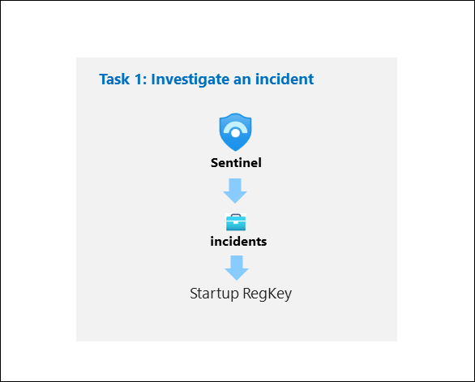

### Task 1: Investigate an incident

In this task, you will investigate an incident.

1. On the **Sentinal** page, select the **Incidents (1)** page.

1. Review the list of **incidents (2)**.

   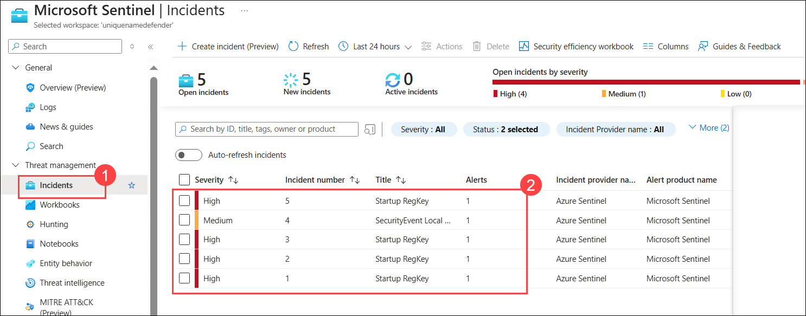

    >**Note:** The Analytics rules are generating alerts and incidents on the same specific log entry. Remember that this was done in the *Query scheduling* configuration to generate more alerts and incidents to be utilized in the lab.
  
1. Select one of the **Startup RegKey** incidents.

1. Review the incident details on the right blade that opened. Scroll down and select the **View full details** button.

   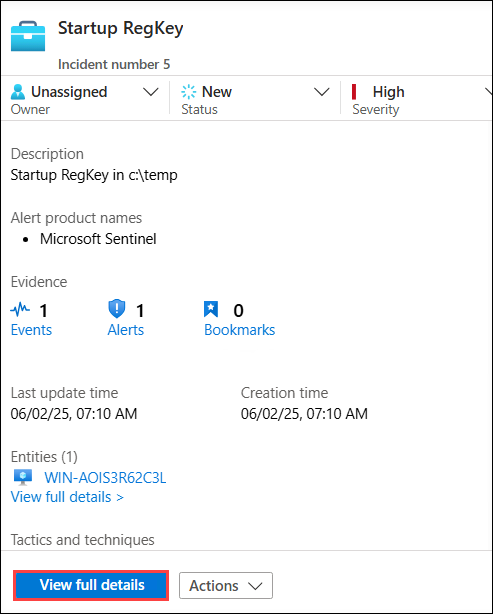

1. If the "New incident experience" pop-up appears, follow the prompts by reading the information by selecting the **Next** button.

1. On the left blade of the incident, click on **New (1)** status drop down, change the Status to **Active (2)** and then select **Apply (3)**.

   

1. Click on **Unassigned (1)** drop down, the select **<inject key="AzureAdUserEmail"></inject> (2)** and the **Apply (3)**.

   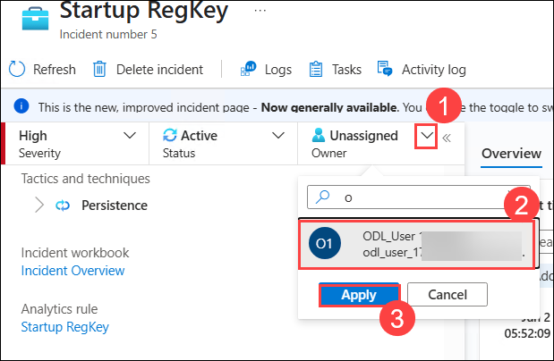

1. Scroll down to the *Tags* area, select **+ (1)** and type **RegKey (2)** and select **OK (3)**.

    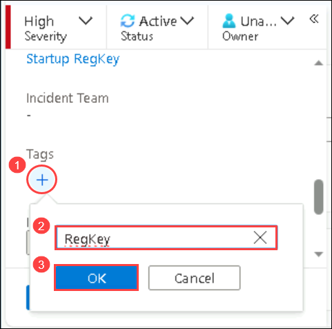

1. Scroll down and in the **Write a comment...** box type: **I will research this (1)** and select the **> (2)** icon to submit the new comment.

    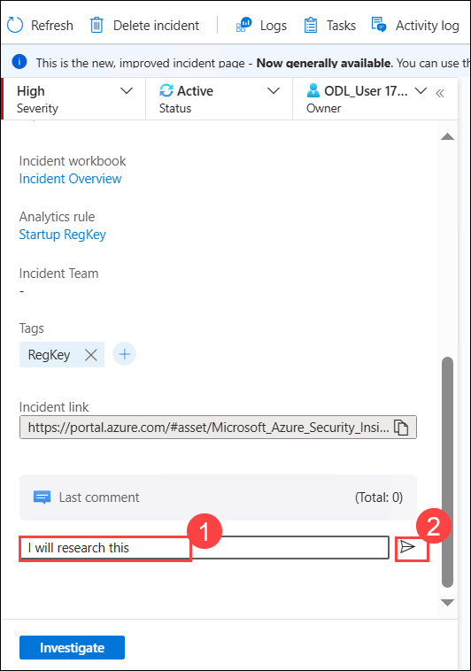

1. Hide the left blade by selecting the **<<** icon next to the owner.

1. Review the **Incident timeline** window. Select the **Incident Actions (1)** button at top-right and then **Run playbook (2)**. You will see the Defender_XDR_Ransomware_Playbook_for_SecOps-Tasks playbook. 

    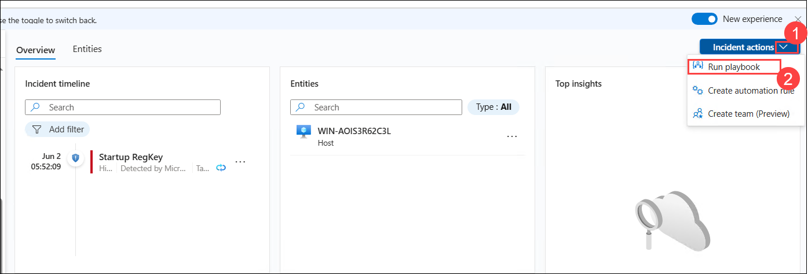

1. This option help you to run playbooks manually. No need of running now.   

    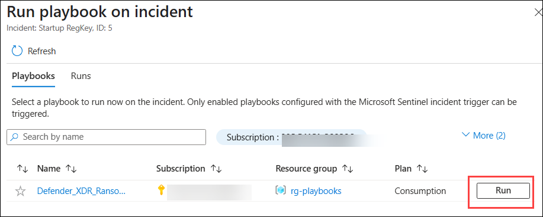

1. Close the *Run playbook on incident blade* by selecting the **X** icon in the top right.

1. Review the **Entities** window. At least the *Host* entity that we mapped within the KQL query from the previous exercise should appear. **Hint:** If no entities are shown, refresh the page.

    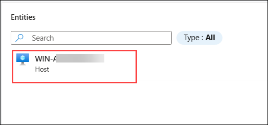

1. Select the **Tasks** button from the command bar.

    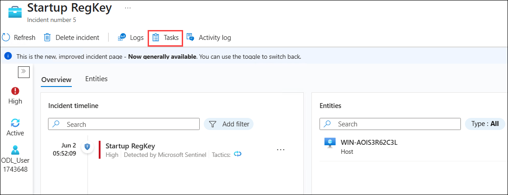

1. Select **+ Add task (1)**, type **Review who owns the machine (2)** in the Title box and select **Save (3)**.

    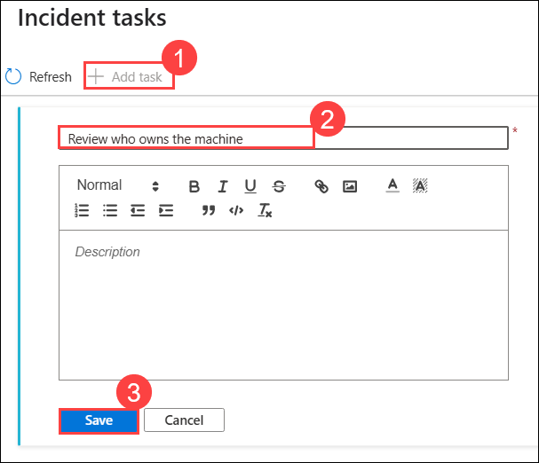

1. Close the *Incident tasks* blade by selecting the **x** icon in the top right.

1. Select the new **Activity Log (1)** button from the command bar.

1. Review the actions you have taken during this exercise **(2)**.

    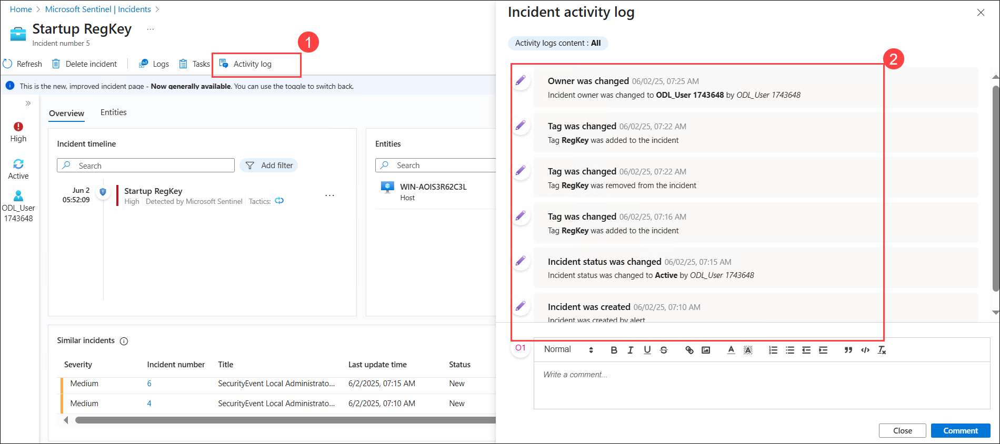

1. Close the *Incident activity log* blade by selecting the **x** icon in the top right.

1. From the almost hidden left blade, select the user icon named **<inject key="AzureAdUserEmail"></inject> (1)**. The new incident experience allows quick changes from here.

1. Select **Assign to me (2)** and then scroll down to select **Apply (3)** to save the changes.

   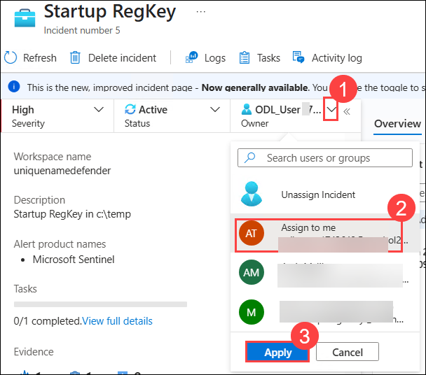

1. Expand the left blade by selecting the **>>** icon. and then select the **Investigate** button.

      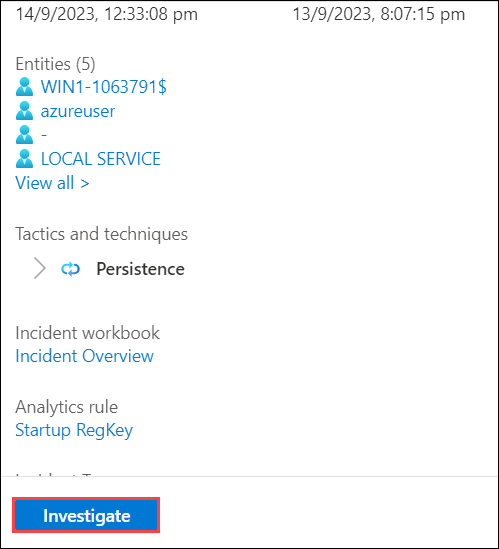

1. **Hover** the WINServer entity icon and wait for new *exploration queries* to be shown. It looks like *Related Alerts* has more data on it. Select the name of the exploration query **Related Alerts** to bring them to the investigation graph or select **Events >** to investigate them with a KQL query.

   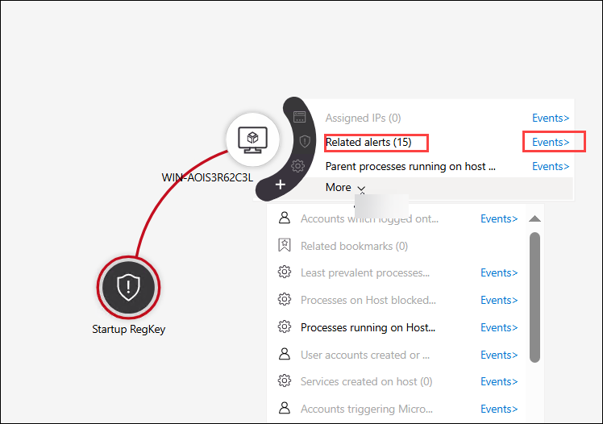 

1. You will ge the graph like this also.   

   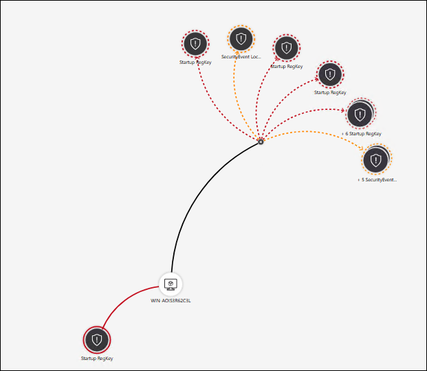    

    >**Note:** You might see only one entity initially, as it may take some time for the other entities to appear. Please do not wait and proceed to the next steps.

    >**Hint:** If the icons are too small for your screen, select **(+)** to magnify them.   

1. Close the query window by selecting the **X** icon at the top right to go back to the *Investigation* page.

1. Now select the **WINServer** entity, a window on the right opens for more detailed information. Review the **Info** page.

   >**Note:** If the right window does not open then click on the blade icon.

1. Select **Timeline** button. Hover the incidents and see which things on the graph occurred at what point in time.

   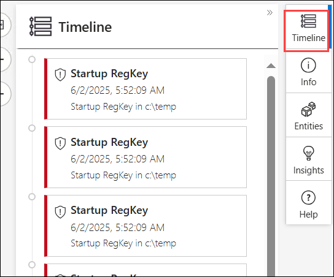 

1. Select **Entities** button and review the *Entities* and *Alerts* related to *WINServer*.

   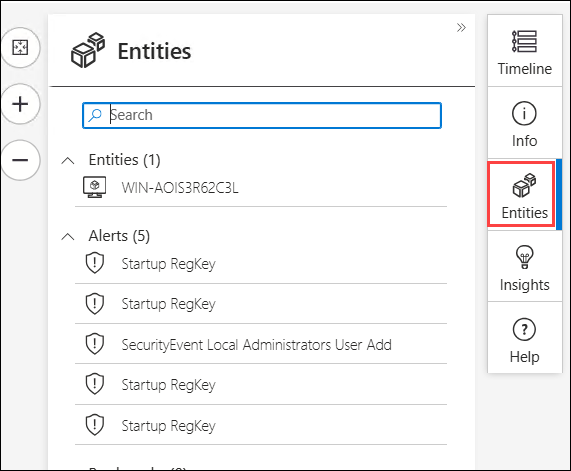 

1. Back in the incident page, in the left pane select **Active Status (1)** and select **Closed (2)**. 

    - In the *Select classification* drop-down review the different options. After that, select **True positive - suspicious activity (3)** and then select **Apply (4)**

      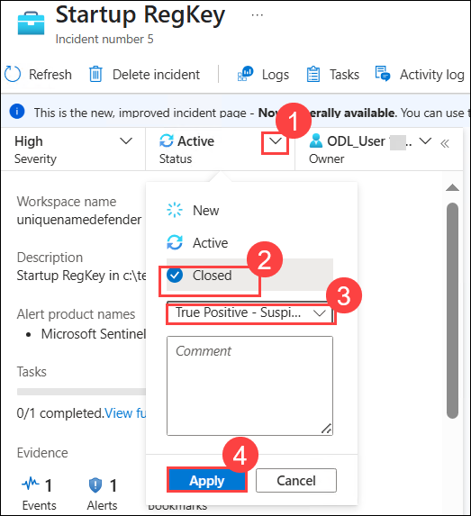     

## Review
In this lab, you have completed the following:
- Investigated an incident.

## Select **Next** to continue to Lab 9
