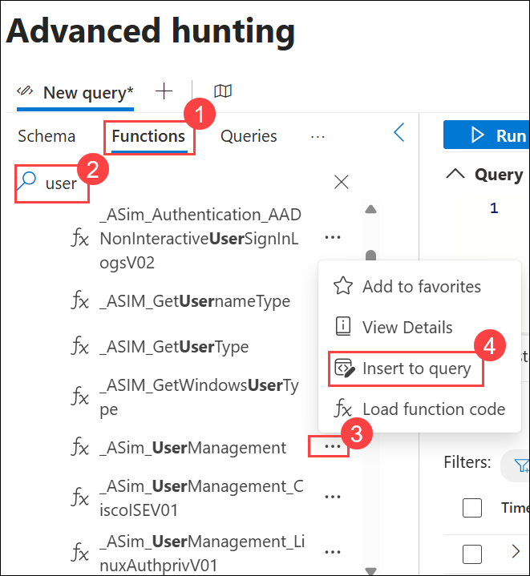
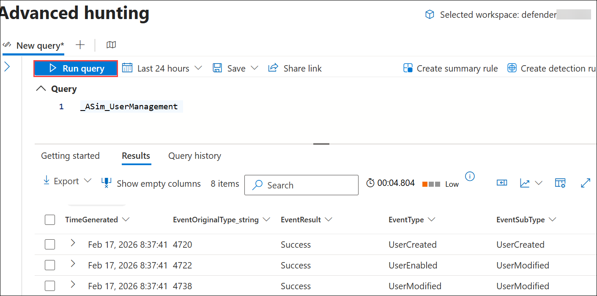

# Lab 09 - Exercise 8: Deploy ASIM parsers

## Lab Scenario

You're a Security Operations Analyst working at a company that implemented Microsoft Sentinel. You need to model ASIM parsers for a specific User Management event. These parsers will be finalized at a later time following the [Advanced Security Information Model (ASIM) User Management Event normalization schema reference].

>**Important:** The lab exercises for Learning Path #9 are in a **standalone** environment. If you exit the lab before completing it, you will be required to re-run the configurations again.

## Lab Objectives
 In this lab, you will Understand following:

 - Task 1: Deploy the User Management Schema ASIM parsers

## Estimated Timing: 30 Minutes

## Architecture Diagram

### Task 1: Deploy the User Management Schema ASIM parsers

In this task, you'll review the User Management Schema parsers that are included with the Microsoft Sentinel deployment.

1. Navigate back to **https://security.microsoft.com**

1. In the **Microsoft Defender** portal, expand **Investigation & response (1)**, expand **Hunting (2)**, and then select **Advanced hunting (3)**.

    

    >**Note:** Refresh the browser if log page is not loading

1. In **Advanced hunting**, select the **Functions (1)** tab, in the **Search** bar type **user (2)**, and scroll down through the ASIM parser functions until you see the following **_ASim_UserManagement (3)** for Microsoft Windows under the **Microsoft Sentinel** heading and then choose **Insert to query (4)**.

    

1. **Run** the ASIM function query. If you've completed the previous lab exercises you should see results and no error messages.

   

## Review
In this lab, you have completed the following:

-  Deployed the User Management Schema ASIM parser 

## Proceed to Exercise 9
