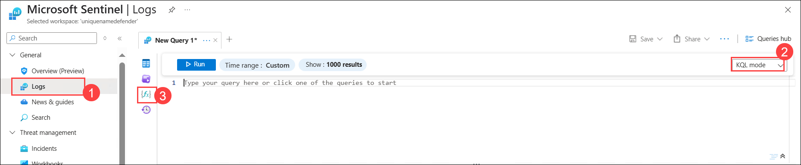
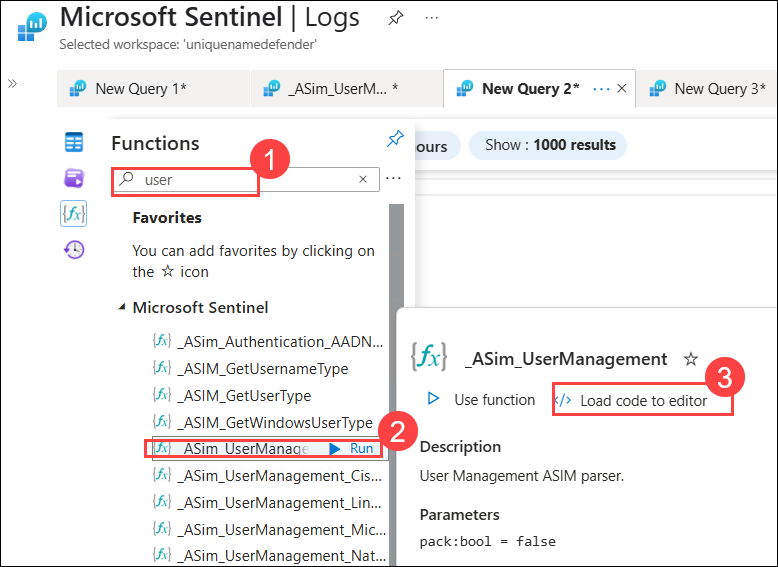
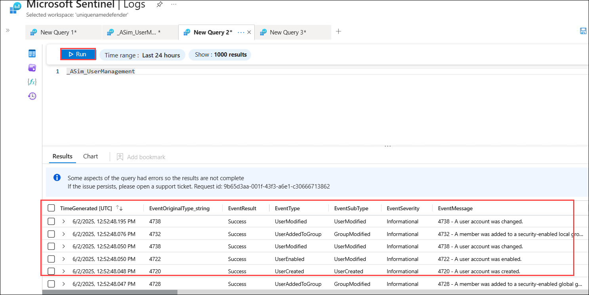

# Lab 09 - Exercise 9: Deploy ASIM parsers

## Lab Scenario

You're a Security Operations Analyst working at a company that implemented Microsoft Sentinel. You need to model ASIM parsers for a specific User Management event. These parsers will be finalized at a later time following the [Advanced Security Information Model (ASIM) User Management Event normalization schema reference].

>**Important:** The lab exercises for Learning Path #9 are in a *standalone* environment. If you exit the lab before completing it, you will be required to re-run the configurations again.

## Lab Objectives
 In this lab, you will Understand following:

 - Task 1: Deploy the User Management Schema ASIM parsers

## Estimated Timing: 30 minutes

## Architecture Diagram

### Task 1: Deploy the User Management Schema ASIM parsers

In this task, you'll review the User Management Schema parsers that are included with the Microsoft Sentinel deployment.

1. In the Azure portal's search bar type **Microsoft sentinel (1)**, and select **Microsoft Sentinel (2)**.

   

1. Select your **uniquenameDefender** Microsoft Sentinel Workspace.

   

1. Select **Logs (1)** under the *General* left menu.

   - Open the *Schema and Filter* blade by selecting **>>** if needed
   - Set the mode to **KQL mode (2)**
   - Select the **Functions (3)** tab (next to the Tables and Queries tabs)
   **Hint:** You might need to select the ellipsis icon **(...)** to select the tab

        

1. In the *Search* bar type **user (1)**, and scroll down through the ASIM parser functions until you see the following **_ASim_UserManagement** for Microsoft Windows under the *Microsoft Sentinel* heading.

1. Hover over the **_ASim_UserManagement (2)** ASIM function and then select **Load the function code (3)** in the popup window.

   

1. In *Logs* Open a New Query tab.

1. Go back to the *Schema and Filter* blade and now hover the **_ASim_UserManagement** ASIM filtering parser for Microsoft Windows Events and Security Events* and then select **Use in editor**.

   

1. **Run** the ASIM function query. If you've completed the previous lab exercises you should see results and no error messages.

   

## Review
In this lab, you have completed the following:

-  Deployed the User Management Schema ASIM parser 

## Proceed to Exercise 10
