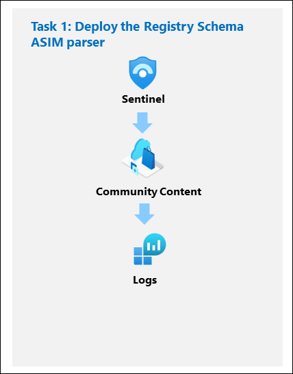
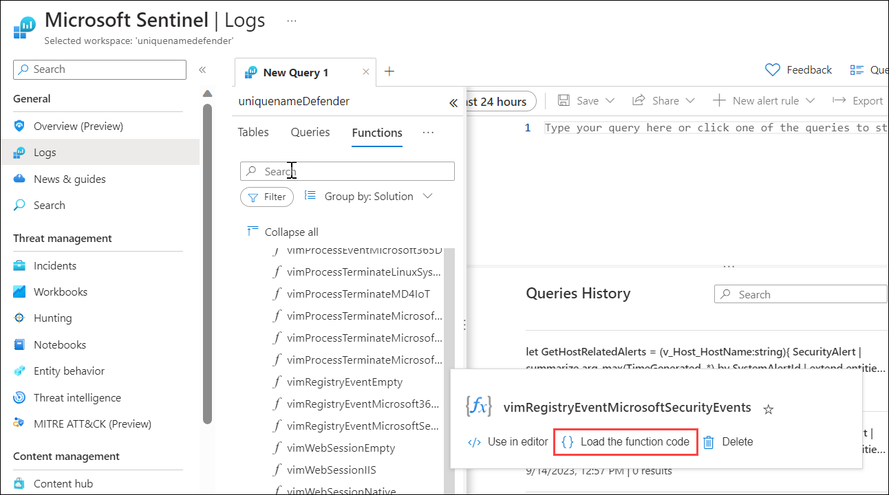
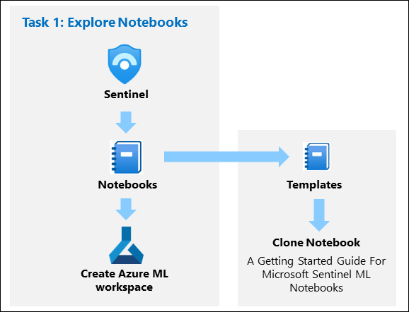

# Module 9 - Lab 1 - Exercise 2 - Threat Hunting using Notebooks with Microsoft Sentinel
# Module 7 - Lab 1 - Exercise 9 - Create ASIM parsers

## Lab scenario

You are a Security Operations Analyst working at a company that implemented Microsoft Sentinel. You need to model ASIM parsers for a specific Windows registry event. These simplified parsers will be finalized at a later time following the [Advanced Security Information Model (ASIM) Registry Event normalization schema reference](https://docs.microsoft.com/en-us/azure/sentinel/registry-event-normalization-schema).

## Lab objectives
 In this lab, you will Understand the following:
 -  Task 1: Deploy the Registry Schema ASIM parser.

## Estimated timing: 20 minutes

## Architecture Diagram

 

### Task 1: Deploy the Registry Schema ASIM parser. 

1. In the Search bar of the Azure portal, type *Sentinel*, then select **Microsoft Sentinel**.

1. Select your Microsoft Sentinel Workspace you created earlier.

1. Select the **Community** page under the *Content management* area on the left side of the page.

1. On the right pane, select the **Onboard community content** link. This will open a new tab in the Edge Browser for Microsoft Sentinel GitHub content. **Hint:** You might need to scroll right to see the link. Alternatively, follow this link instead: [Microsoft Sentinel on GitHub](https://github.com/Azure/Azure-Sentinel).

1. Select the **ASIM** folder. Here, you can deploy a template that contains all ASIM parsers, but we will only focus on the Registry Schema.

1. Scroll down and next to **Registry**, select the **Deploy to Azure** button.

1. For *Resource Group*, select **RG-Defender** where your Sentinel workspace resides.

1. For *Workspace*, type your Sentinel workspace name, like *uniquenameDefender*.

1. Leave the other default values and select **Review + create**.

1. Select **Create** to deploy the template. Notice the Names of the different resources.

1. In the Search bar of the Azure portal, type *Sentinel*, then select **Microsoft Sentinel**.

1. Select the Microsoft Sentinel Workspace you created earlier.

1. Select **Logs** under the *General* left menu.

1. Open the *Schema and Filter* blade by selecting **>>** if needed.

1. Select the **Functions** tab (next to the Tables and Queries tabs). **Hint:** You might need to select the ellipsis icon **(...)** to select the tab.

1. Expand **Workspace functions**. Notice that the names correspond to the templates you just deployed.

1. Hover the **vimRegistryEventMicrosoftSecurityEvents** *workspace parser* and then select **Load the function code**.

    

1. Review the KQL that is parsing the Event ID 4657 to simplifying your analysis of the data in the Microsoft Sentinel workspace.

1. **Run** the query. You should not get any results or errors, it is just for validation purposes.

1. Go back to the *Schema and Filter* blade and now hover the **imRegistry** *unifying parser* and then select **Load the function code**.

1. Notice that the unifying parsers use the *union* operator to run all the workspace parsers at once. If you develop a parser for the Registry Schema you will need to add it here.

1. **Run** the query. You should not get any results or errors; it is just for validation purposes.

1. This unifying parser can now be used for Analytic Rules or Hunting Queries.

## Review
In this lab, you have completed the following:
-  Deployed the Registry Schema ASIM parser. 

## Proceed to Exercise 10
## Lab scenario
You are a Security Operations Analyst working at a company that implemented Sentinel. You need to explore the benefits of threat hunting with Microsoft Sentinel Notebooks.

## Lab objectives
 In this lab, you will Understand the following:
  -  Task 1: Explore Notebooks

## Estimated time: 30 minutes

## Architecture Diagram

 

### Task 1: Explore Notebooks

In this task, you will explore using notebooks in Microsoft Sentinel.

1. In the Microsoft Sentinel Workspace, select **Notebooks** under the *Threat management* area.

1. Next, you need to create an AzureML Workspace. Select **Configure Azure Machine Learning** and then select the **Create new Azure ML workspace** button in the command bar.

     

1. In the Subscription box, select your subscription.

1. Select **Create new** for the Resource group and enter *RG-MachineLearning* for the Name and select **OK**. 

1. In the Workspace details section do the following:

     - Give your workspace a unique name.
     - Leave **East US** as the default value for *Region*.
     - Keep the default Storage account, Key vault, and Application insights information.
     - The Container registry option can remain as **None**.

1. At the bottom of the page, select **Review + Create**. When you see the *"Validation passed"* message, select **Create**. 

     >**Note:** It may take a few minutes to deploy the Machine Learning workspace.

1. After *Your deployment is complete* message appears, return to the Microsoft Sentinel portal.

1. Select **Notebooks** again and then select the **Templates** tab from the middle command bar. 

1. Select **A Getting Started Guide for Microsoft Sentinel** ML Notebooks. 

1. On the right pane, scroll down and select **Create from template** button. Review the default options and then select **Save**.

   

1. Once the saving is done, select the **Launch notebook** button. This will take you to the Microsoft Azure Machine Learning Studio.

    

1. Select **Close** if an informational window appears in the Microsoft Azure Machine Learning Studio.

1. In the command bar, to the right of the **Compute instance:**  selector, select the **+** symbol to create a new compute instance. **Hint:** It might be hidden inside the ellipsis icon **(...)**.

     >**Note:** You can have more screen space by hiding the Azure ML Studio left blade by selecting the 3 lines on the top left, as well as the Notebooks Files by selecting the **<<** icon.

1. Type a unique name in the *Compute name* field. This will identify your compute instance.

1. Scroll down and select the first option available. **Hint:** Workload type: Development on Notebooks and lightweight testing.

1. Select the **Review + Create** button at the bottom of the screen, then scroll down and select **Create**. Close any feedback window that may appear. This takes a few minutes, you'll see a notification (bell icon) when it's done and the *Compute instance* left icon turns from blue to green.

1. Once the Compute has been created and running, verify that the kernel to use is *Python 3.8 - AzureML*. **Hint:** This is shown in the right of the command bar.

1. Select the **Authenticate** button and wait for the authentication to complete.

1. Clear all the results from the notebook by selecting the **Clear all outputs** from the command bar and following the *Getting Started* tutorial. **Hint:** This can be found by selecting the ellipsis (...) from the command bar.

1. Review section *1 Introdution* in the notebook and proceed to section *2 Initializing the notebook and MSTICPy*.

1. In section *2 Initializing the notebook and MSTICPy*, review the content on initalizing the notebook and installing the MSTICPy package.

1. Run the *Python code* to initialize the cell by selecting the **Run cell** button (Play icon) to the left of the code.

1. It should take approximately 15 seconds to run. Once it's done, review the output messages and disregard any warnings about the Python kernel version. The code ran successfully if *msticpyconfig.yaml* was created in the *utils* folder in the *file explorer* pane on the left. It may take another 30 seconds for the file to appear.

    >**Hint:** You can clear the output messages by selecting the ellipsis (...) on the left of the code window for the *Output menu* and selecting the *Clear output* (square with an x*) icon.

1. Select the **msticpyconfig.yaml** file in the *file explorer* pane on the left to review the contents of the file and then close it.

1. Proceed to section *3 Querying data with MSTICPy* and review the contents. Don't run the *Multiple Microsoft Sentinel workspaces* code cell as it fails, but the other code cells can be run successfully.

>**Note:** If you cannot complete the steps above to access the Notebook, you can follow it on its GitHub viewwer page instead. [Getting Started with Azure ML Notebooks and Microsoft Sentinel](https://nbviewer.org/github/Azure/Azure-Sentinel-Notebooks/blob/master/A%20Getting%20Started%20Guide%20For%20Azure%20Sentinel%20ML%20Notebooks.ipynb) 

>**Note:** If you cannot complete the steps above to access the Notebook, you can follow it on its GitHub viewer page instead. [Getting Started with Azure ML Notebooks and Microsoft Sentinel](https://nbviewer.org/github/Azure/Azure-Sentinel-Notebooks/blob/master/A%20Getting%20Started%20Guide%20For%20Azure%20Sentinel%20ML%20Notebooks.ipynb) 

## Review
In this lab, you have completed the following:
-  In this Lab, we successfully explored AZURE ML Notebooks.

## You have completed the lab.

> **Congratulations** on completing the task! Now, it's time to validate it. Here are the steps:
> - Navigate to the Lab Validation Page, from the upper right corner in the lab guide section.
> - Hit the Validate button for the corresponding task. You can proceed to the next task if you receive a success message.
> - If not, carefully read the error message and retry the step, following the instructions in the lab guide.
> - If you need any assistance, please contact us at labs-support@spektrasystems.com. We are available 24/7 to help you out.
