# Lab 09 - Exercise 10: Use Repositories in Microsoft Sentinel

## Lab scenario

You are a Security Operations Analyst working at a company that implemented Microsoft Sentinel. You already created Scheduled and Microsoft Security Analytics rules.  You need to centralize analytical rules in an Azure DevOps repository.  Then connect Sentinel to the Azure DevOps repository and import the content. 

>**Important:** The lab exercises for Learning Path #9 are in a **standalone** environment. If you exit the lab before completing it, you will be required to re-run the configurations again.

## Lab Objectives
 In this lab, you will Understand following:
 - Task 1: Create and export an analytical rule
 - Task 2: Create our Azure DevOps environment
 - Task 3: Connect Sentinel to Azure DevOps.

## Estimated Timing: 30 Minutes

## Architecture Diagram

   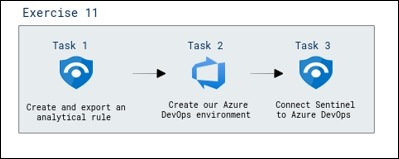

### Task 1: Create and export an analytical rule

In this task, you will enable Entity behavior analytics in Microsoft Sentinel.

1. Navigate back to the Microsoft Defender **https://security.microsoft.com**

1. In the **Configuration (1)** section, select **Analytics (2)**, and then choose the **Startup RegKey (3)** rule.

    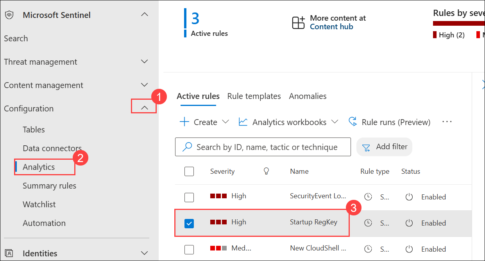

1. Select the **Startup RegKey** rule then click on **Export (2)** from the toolbar. **Hint:** You might need to select the ellipsis icon **(...) (1)** to see it.

   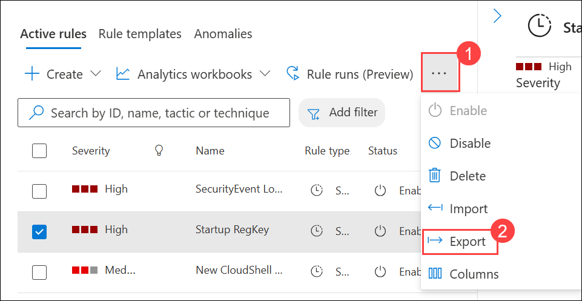

1. The rule is exported to a text file named **Azure_Sentinel_analytic_rule.json**.

1. Select **Open file** below the name of the downloaded file.

   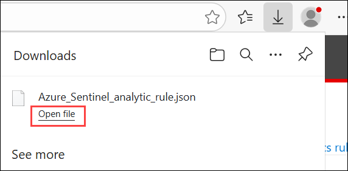

1. Then select **More apps**.

1. Select **Notepad** and then select **OK**.

1. Review the Azure Resource Manager template and the close it when done.

### Task 2: Create our Azure DevOps environment

In this task, you will create an Azure DevOps repository.

1. Open another tab in the browser and navigate to (https://aex.dev.azure.com).

1. On the **We need a few more details** page, select **Continue**.

   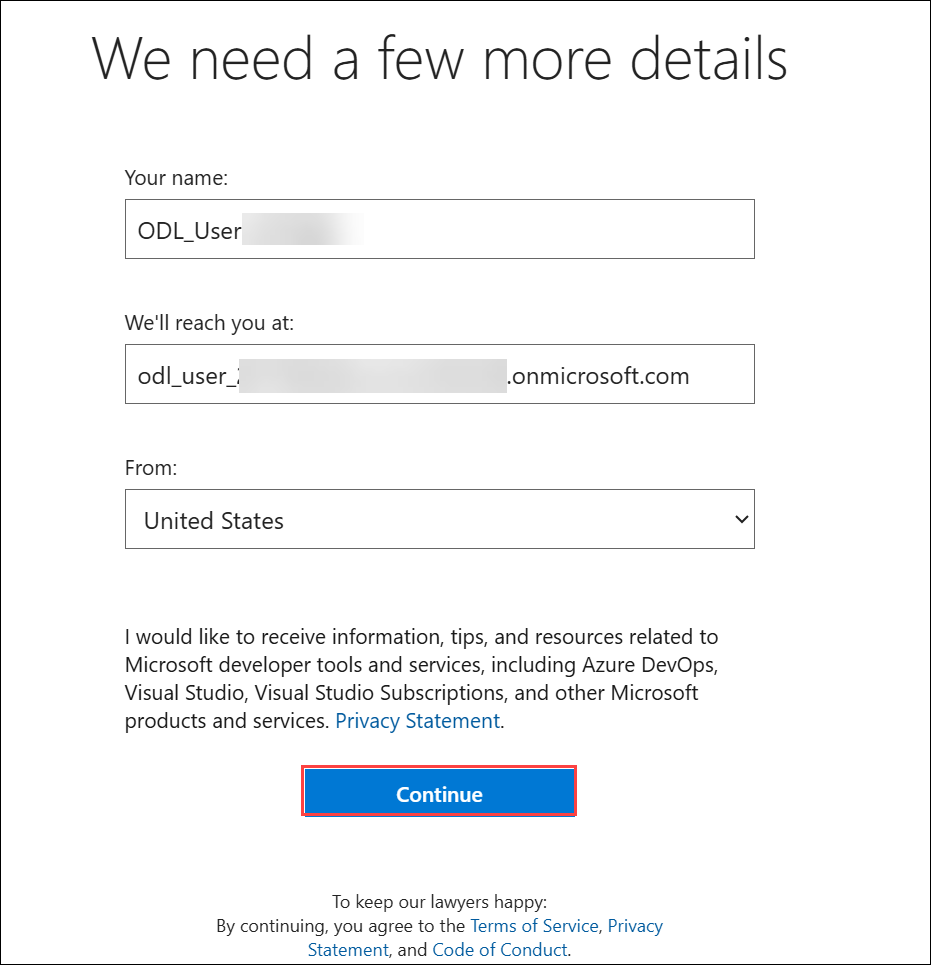

1. On the **Get started with Azure DevOps** page, select **Create new organization**.

   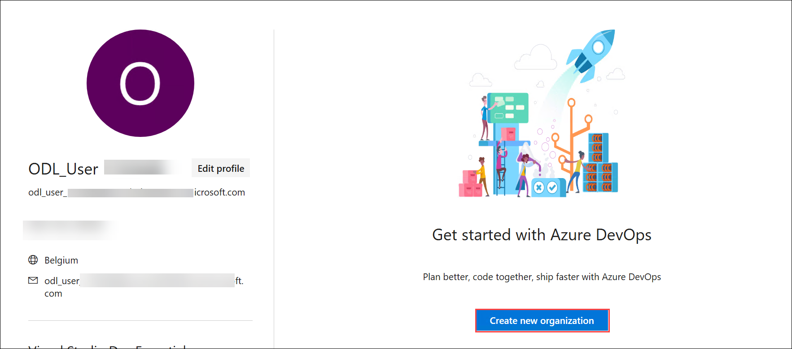

1. Then select **Continue**.

1. On the **Almost done...** page, enter a name for your DevOps organization that you would not want to use in the future, like for example, your tenant prefix. **Hint:** It can be found in the Resources tab of your lab (WWLx...).

1. **Enter characters you see**, then **Continue**.

   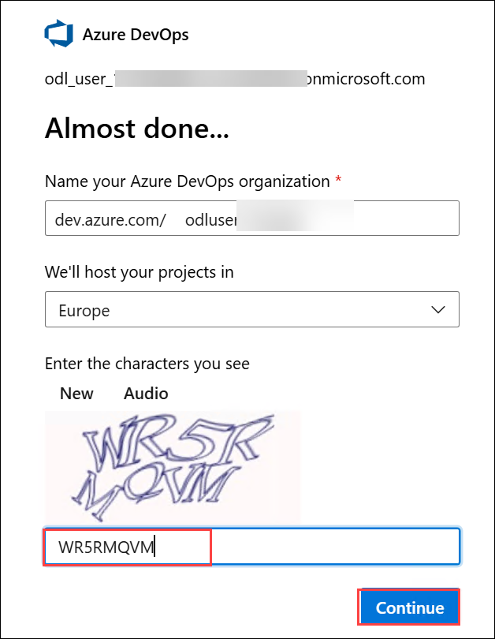

1. On the **Create a project to get started** page, enter **My Sentinel Content (1)** and then select **+ Create project (2)**.

   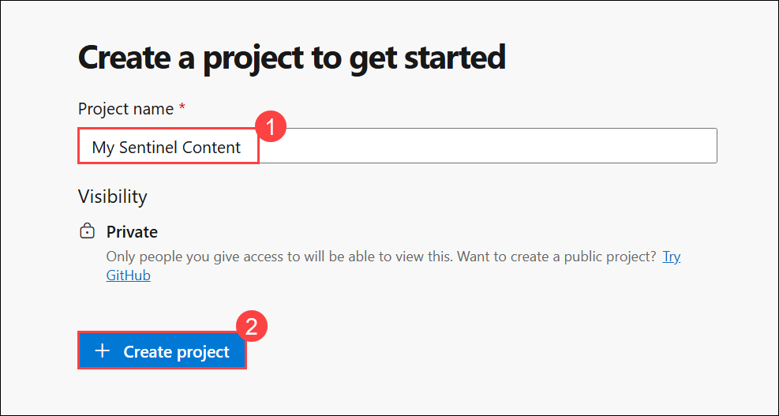

1. Navigate to **Repos (1)** on the left pane. At the bottom of the page in the area **Initialize main branch with a README or gitignore (2)**, select **Initialize (3)**.

     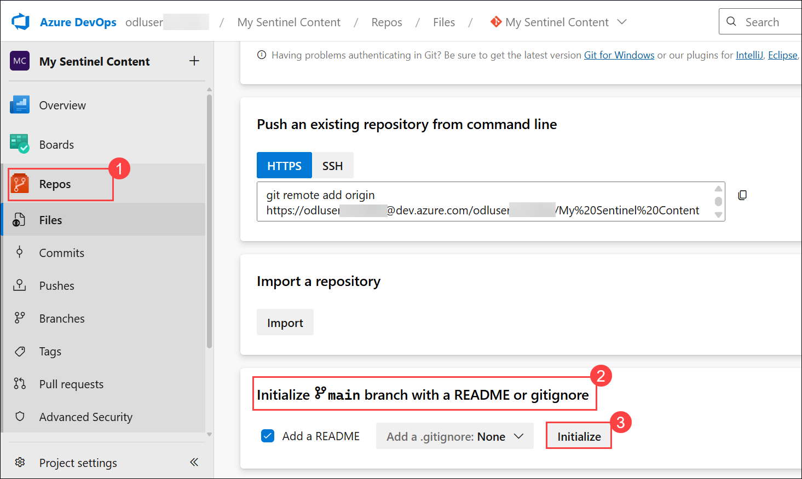

1. The page should show the Files for the Repo.  the only file is README.me.

1. On the Files (right side of the page) blade, the toolbar includes options **Set up build**, **Clone**, **...** Select the colon icon **(:)** to show more options.

   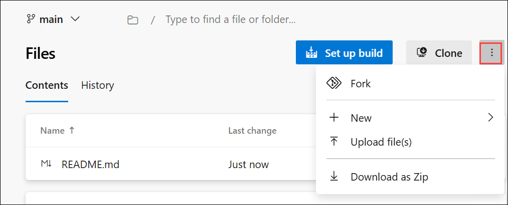

1. Select **Upload Files**.

   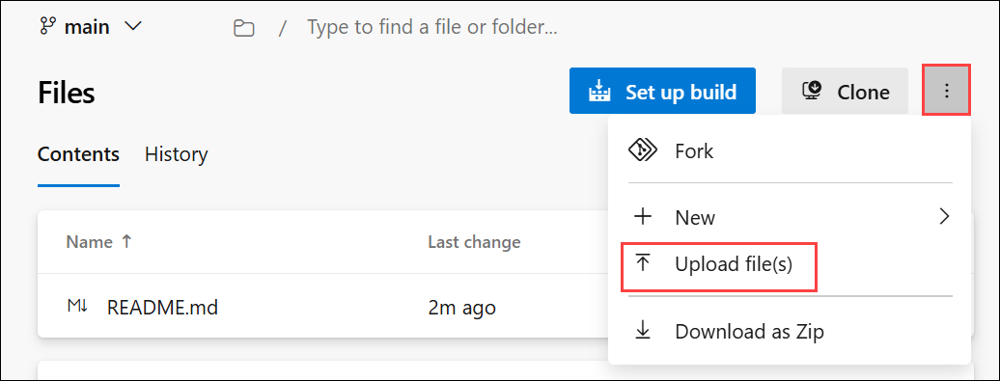

1. Select **Browse (1)**, then navigate to **Downloads (2)**. Select the file **Azure_Sentinel_analytic_rule.json (3)** and then click **Open (4)**.

   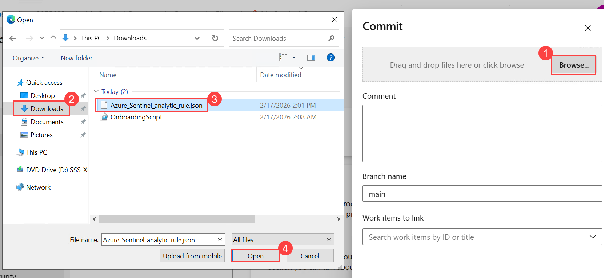

1. Select **Commit**.

   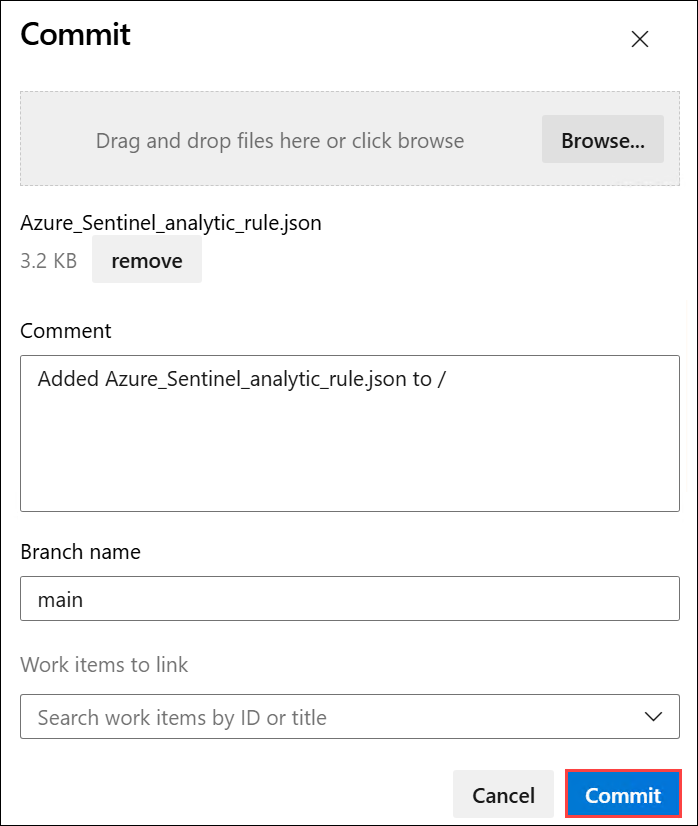

1. Select **Azure DevOps (1)** on the top left corner of the page.  This displays your organization and projects.

1. Select **Organization settings (2)** from the bottom left of the page.

   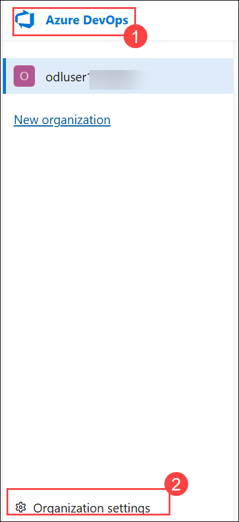

1. Select **Policies (1)** under the **Security** area of the left blade.

   >**Note:** If the Policies option is not visible, click on the **Back arrow**, and it should appear.

1. Toggle **On (2)** **Third-party application access via OAuth** under the **Application connection policies** area.

   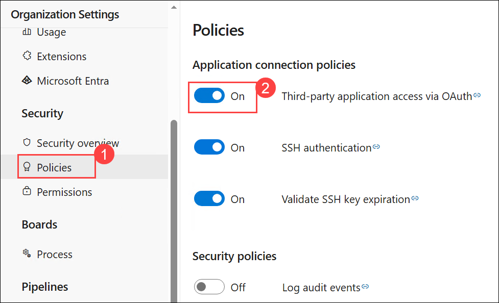

### Task 3: Connect Sentinel to Azure DevOps.

In this task, you will connect Microsoft Sentinel to Azure DevOps to manage content and repositories.

1. Navigate back to **Defender portal**, expand Microsoft Sentinel, select **Repositories (1)** in the **Content Management** section. Select **+ Add new (2)** button from the toolbar.

   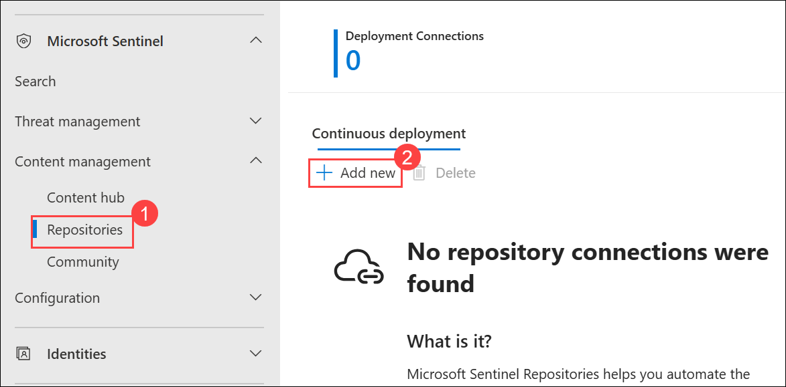

1. On the **Create new deployment connection** page,

   - For the name enter **My Content (1)**.

   - For Source control, select **Azure DevOps (2)**.

   - Select **Authorize (3)**. 

     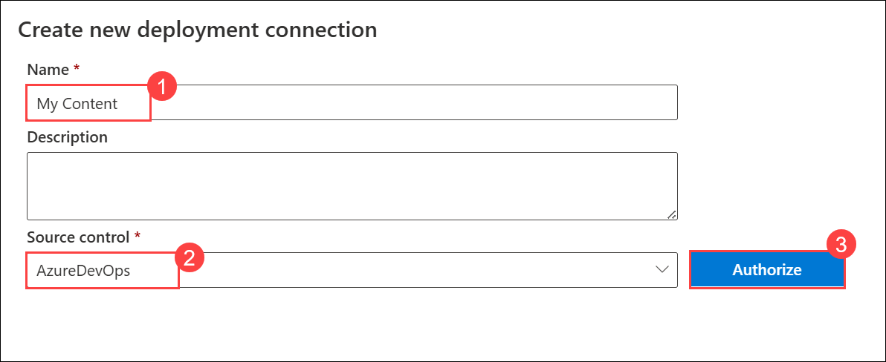
     
      >**Note**: If prompted, scroll down the permissions request and then select **Accept**.   

1. Provide the following details:

   - Select the Organization you created earlier **odluser<inject key="DeploymentID" enableCopy="false"/>** **(1)**.

   - Select the Project you created earlier, **My Sentinel Content (2)**.

   - Select the Repository you created earlier, **My Sentinel Content (3)**. **Hint:** You might need to scroll down within the drop-down to see the repository.

   - Select the Branch **refsheads/main (4)**. **Hint:** You might need to scroll down within the drop-down to see the branch.

   - Select **all content types (5)**.

   - Then select **Create (6)**.

     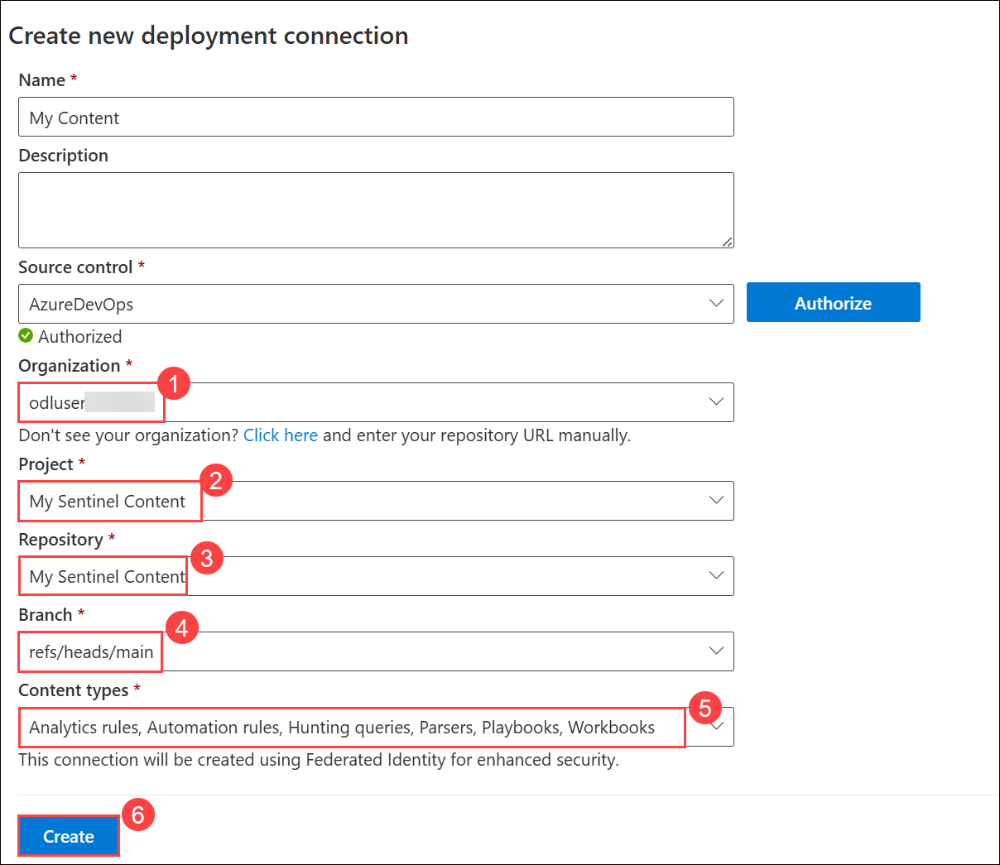  

1. Go back to Microsoft Sentinel workspace if needed.

1. Go to the **Repositories(1)** page, select **Refresh (2)**. Wait until the last deployment status is **Failed (3)**.  

   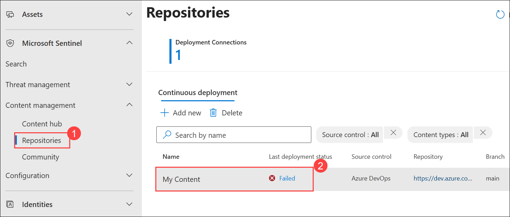

   >**Note:** The **Failed** status is due to limitations in the hosted lab environment. You would normally see **Succeeded**. Then you can see in the **Analytics** the imported rule **Rule from Azure DevOps**.

## Review
- Created and exported an analytical rule
- Created our Azure DevOps environment
- Connected Sentinel to Azure DevOps
   
## You have successfully completed the lab
