# Lab 10 - Exercise 1: Perform Threat Hunting in Microsoft Sentinel

## Lab scenario

You're a Security Operations Analyst working at a company that implemented Microsoft Sentinel. You have received threat intelligence about a Command and Control (C2 or C&C) technique. You need to perform a hunt and watch for the threat.

   >**Important:** The lab exercises for Learning Path #10 are in a **standalone** environment. If you exit the lab before completing it, you will be required to re-run the configurations again.

   >**Note:** The log data created in the previous Learning Path **Perform Attacks** lab exercises will not be available in this lab without rerunning the **Attack 3** on WIN1 server in Exercise 5.

## Lab objectives
 In this lab, you will perform the following:
 - Task 1: Create a hunting query 
 - Task 2: Create a NRT query rule
 - Task 3: Create a Search
 - Task 4: Create a hunt that combines multiple queries into a MITRE tactic
 
## Estimated timing: 40 Minutes

## Architecture Diagram

 

### Task 1: Create a hunting query

In this task, you'll create a hunting query, bookmark a result, and create a Livestream.

1. In the Azure portal's search bar type **Microsoft sentinel (1)**, and select **Microsoft Sentinel (2)**.

   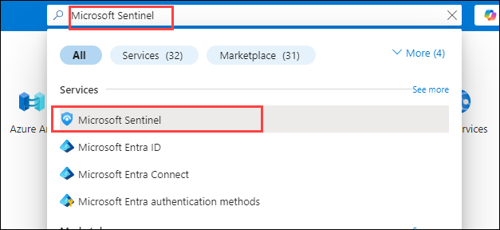

1. Select your **uniquenameDefender** Microsoft Sentinel Workspace.

   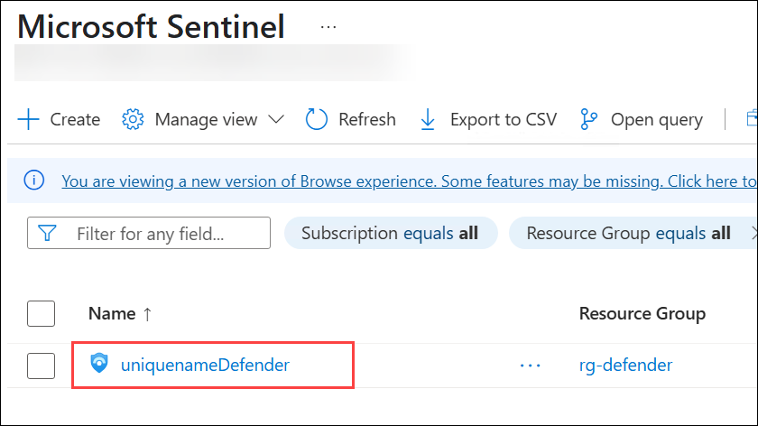

1. On the Select **Logs (1)**. Set the mode to **KQL mode (2)**.

   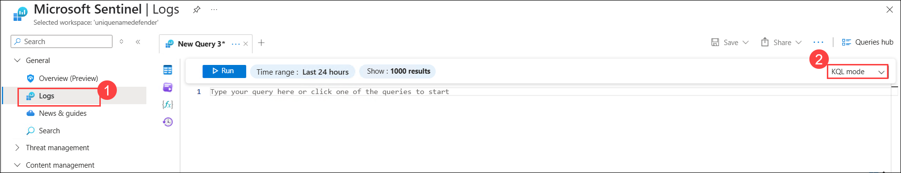

   > **Note:** If you do not see **Logs page** in the Microsoft Sentinel portal, try refreshing the browser. Wait 5 minutes and refresh again until it appears.

1. Enter the following KQL Statement in the **New Query 1** space:

   >**Important:** Please paste any KQL queries first in Notepad and then copy from there to the **New Query 1** Log window to avoid any errors.

    ```KQL
    let lookback = 2d; 
    SecurityEvent 
    | where TimeGenerated >= ago(lookback) 
    | where EventID == 4688 and Process =~ "powershell.exe"
    | extend PwshParam = trim(@"[^/\\]*powershell(.exe)+" , CommandLine) 
    | project TimeGenerated, Computer, SubjectUserName, PwshParam 
    | summarize min(TimeGenerated), count() by Computer, SubjectUserName, PwshParam 
    | order by count_ desc nulls last 
    ```

1. Review the different results. You have now identified PowerShell requests that are running in your environment.

   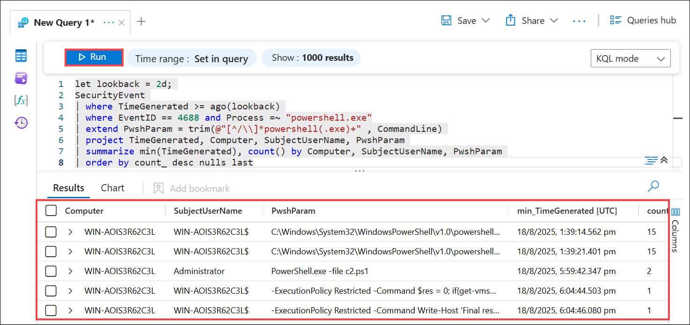

1. Select the checkbox of the results that shows the **Administrator (1)** SubjectUsername.

1. In the middle command bar, select the **Add bookmark (2)** button.

   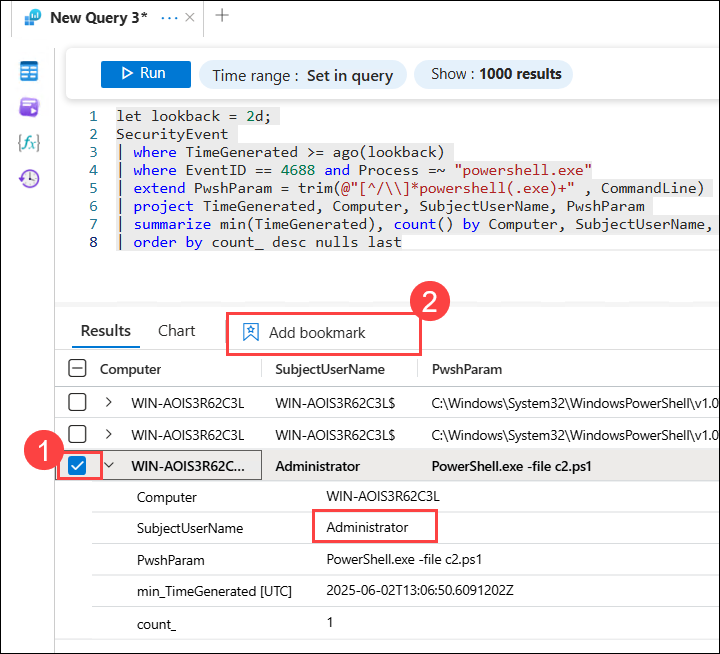

1. On the **Add bookmark** page,

   - Select **+ Add new entity (1)** under **Entity mapping**.

   - For **Entity** select **Host**, then **Hostname** and **Computer** for the values **(2)**.

   - For **Tactics and Techniques**, select **Command and Control (3)**.

   - Go back to the **Add bookmark** blade, and the select **Create (4)**. We will map this bookmark to an incident later.

     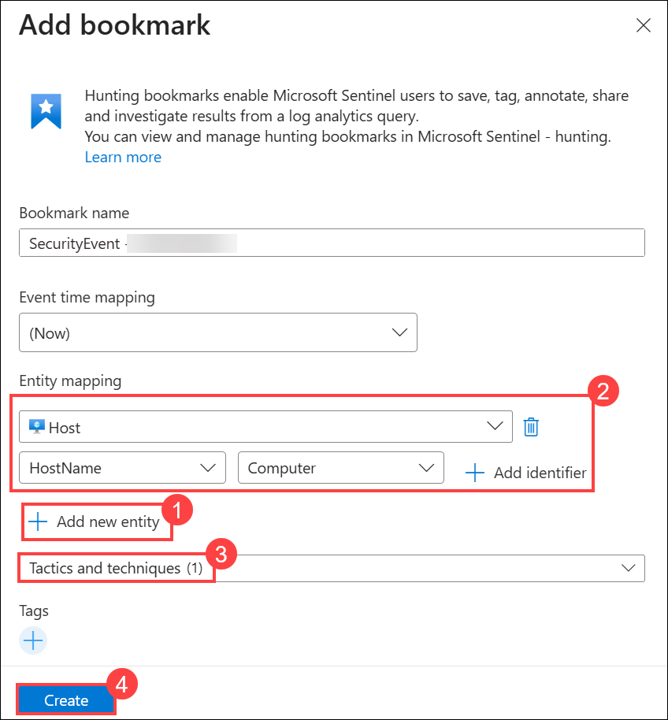   

1. Close the **Logs** window by selecting the **X** in the top-right of the window and select **OK** to discard the changes. 

1. Select your **uniquenameDefender** Microsoft Sentinel workspace again.

1. Select the **Hunting (1)** page under the **Threat Management** area. Click on the **Queries (2)** tab and then **+ New Query (3)** from the command bar.

   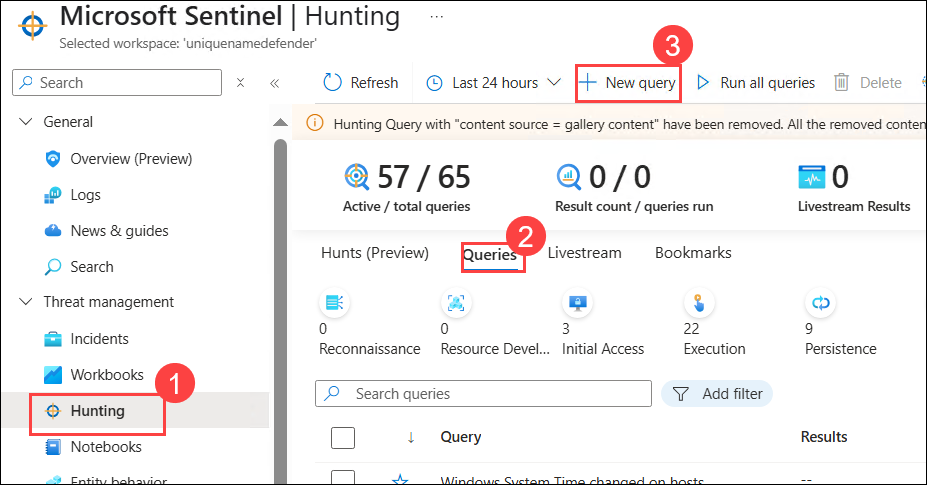

   > **Note:** If you do not see **Hunting page** in the Microsoft Sentinel portal,try refreshing the browser. Wait 5 minutes and refresh again until it appears.

1. In the **Create hunting query** window, for the **Name** enter **PowerShell Hunt (1)**.

1. For the **Custom query** enter the following KQL statement **(2)**:

    ```KQL
    let lookback = 2d; 
    SecurityEvent 
    | where TimeGenerated >= ago(lookback) 
    | where EventID == 4688 and Process =~ "powershell.exe"
    | extend PwshParam = trim(@"[^/\\]*powershell(.exe)+" , CommandLine) 
    | project TimeGenerated, Computer, SubjectUserName, PwshParam 
    | summarize min(TimeGenerated), count() by Computer, SubjectUserName, PwshParam 
    | order by count_ desc nulls last 
    ```

1. Scroll down and under **Entity mapping** select **(3)**:
   
    - Select **+ Add new entity** under *Entity mapping*.
    - For the **Entity type** drop-down list select **Host**.
    - For the **Identifier** drop-down list select **HostName**.
    - For the **Value** drop-down list select **Computer**.

1. Scroll down and under **Tactics & Techniques** select **Command and Control (4)** and then select **Create (5)** to create the hunting query.

   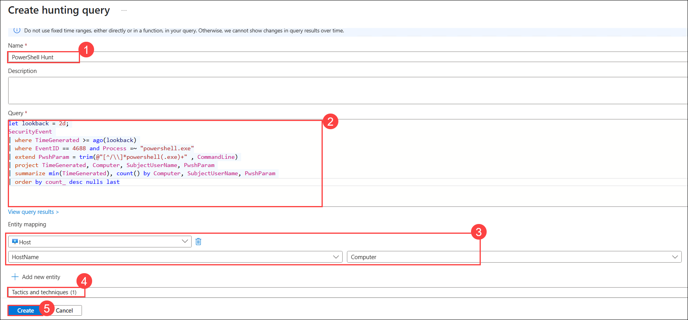

1. In the **"Microsoft Sentinel - Hunting"** blade, search for the query you just created in the list, **PowerShell Hunt**.

1. Select **PowerShell Hunt (1)** from the list. Select the **View Results (2)** button from the right pane. 

   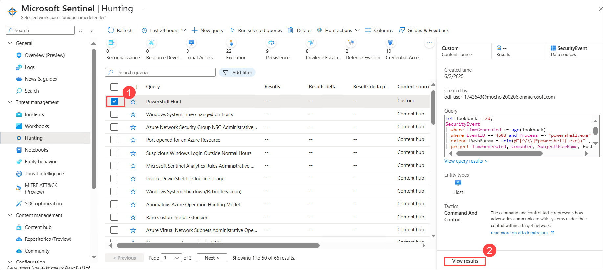

1. The KQL query will automatically run.   

   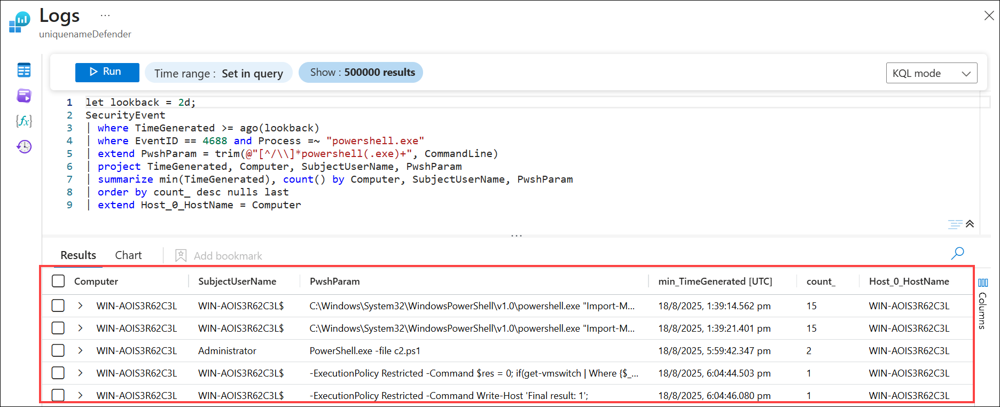   

1. Close the **Logs** window by selecting the **X** in the top-right of the window and select **OK** to discard the changes. 

1. Right-click the **PowerShell Hunt (1)** query and select **Add to livestream (2)**. **Hint:** This also can be done by sliding right and selecting the ellipsis **(...)** at the end of the row to open a context menu.

   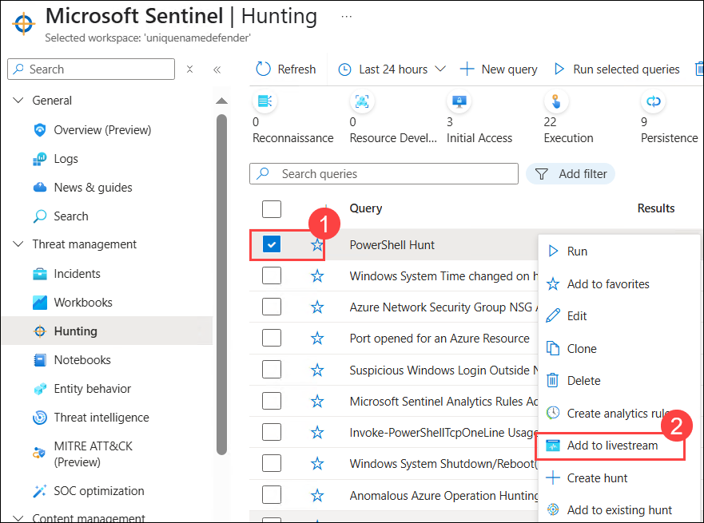

1. Review that the **Status** is now **Running**. This is running every 30 seconds in the background and you'll receive a notification in the Azure portal (bell icon) when a new result is found. 

   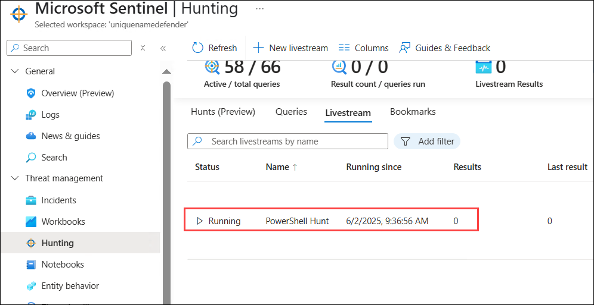

1. Select the **Bookmarks (1)** tab in the middle pane. Click on the bookmark you created from the results list **(2)**.

1. On the right pane, scroll down and select the **Investigate (3)** button. **Hint:** It might take a couple of minutes to show the investigation graph.

   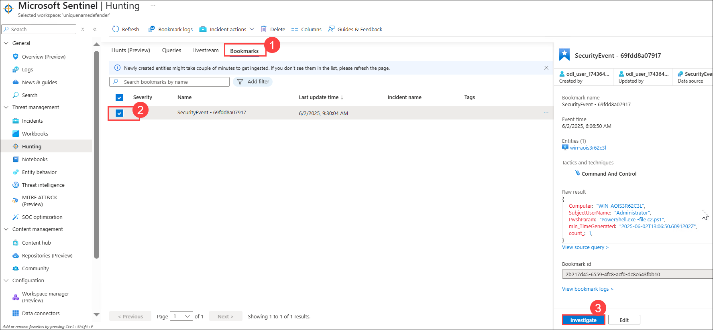

1. Explore the Investigation graph just like you did in the previous module. Notice the high number of **Related alerts** for **WINServer**.

1. Close the **Investigation** graph window by selecting the **X** in the top-right of the window. 

1. Hide the right blade by selecting the **>>** icon and then scroll right until you see the ellipsis **(...)** icon.

1. Select **Add to existing incident (1)**. All the incidents appear in the right pane.

   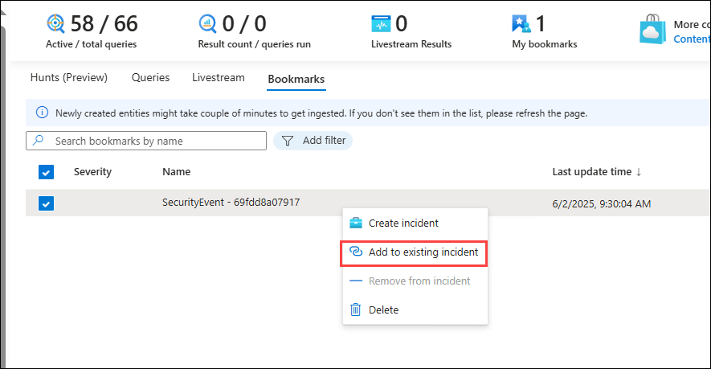

1. Select one of the incidents **(1)** and then select **Add (2)**. 

   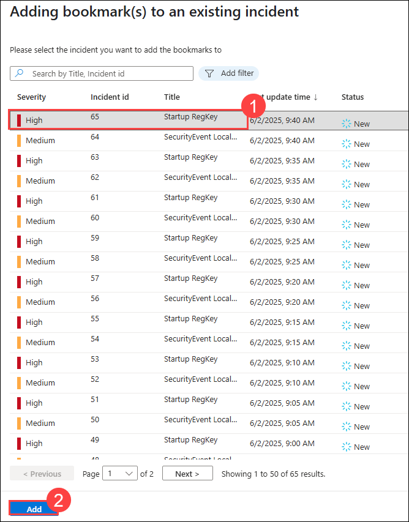

1. Scroll left to notice that the **Severity** column is now populated with the incident's data.

   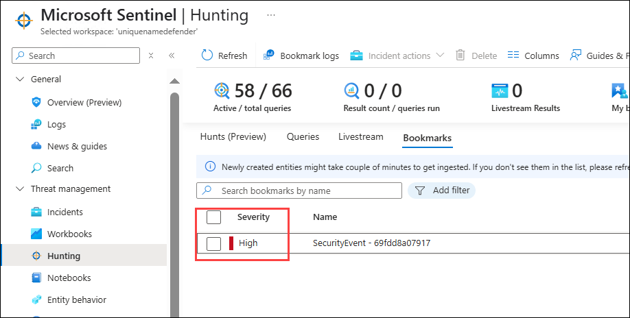

### Task 2: Create an NRT query rule

In this task, instead of using a LiveStream, you'll create an NRT analytics query rule. NRT rules run every minute and lookback one minute. The benefit to NRT rules are they can use the alert and incident creation logic.

1. Select the **Analytics (1)** page under **Configuration** in Microsoft Sentinel. 

   > **Note:** If you do not see **Analytics page** in the Microsoft Sentinel portal,try refreshing the browser. Wait 5 minutes and refresh again until it appears.

1. Select the **Create (2)** tab, then **NRT query rule (3)**.

   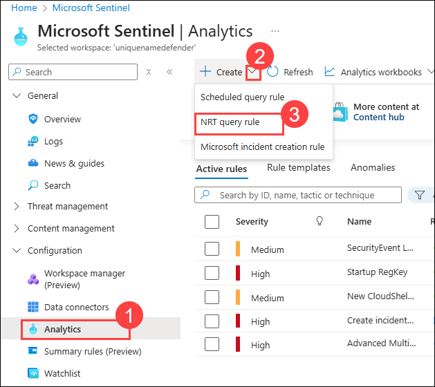

1. This starts the "Analytics rule wizard". For the **General** tab type:

    |Setting|Value|
    |---|---|
    |Name|**NRT PowerShell Hunt (1)**|
    |Description|**NRT PowerShell Hunt (2)**|
    |Severity|**High (3)**|
    |Tactics|**Command and Control (4)**|

      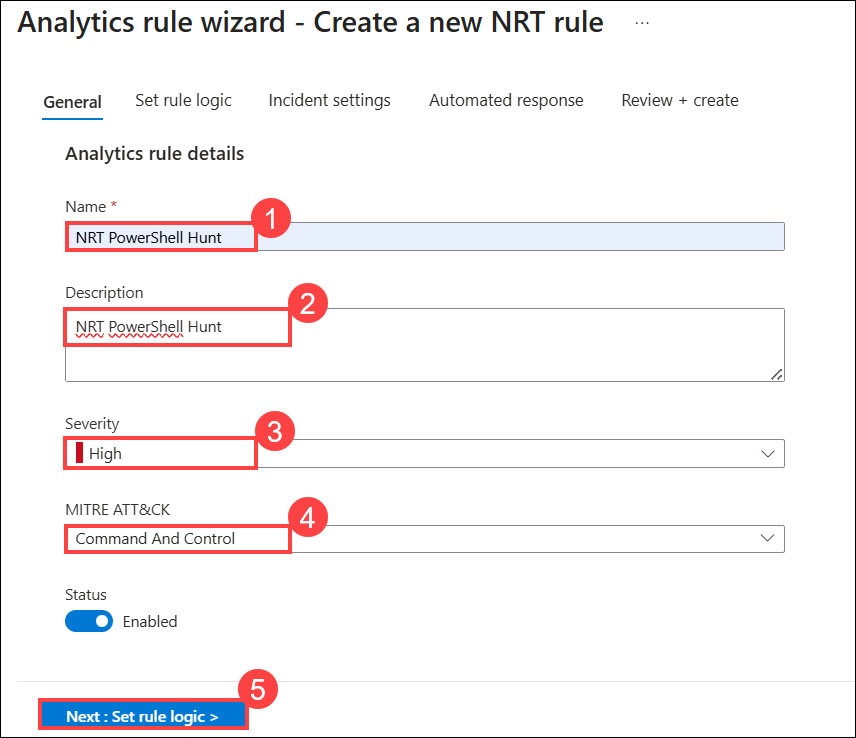

1. Select **Next: Set rule logic > (5)** button. 

1. For the **Rule query** enter the following KQL statement:

    ```KQL
    let lookback = 2d; 
    SecurityEvent 
    | where TimeGenerated >= ago(lookback) 
    | where EventID == 4688 and Process =~ "powershell.exe"
    | extend PwshParam = trim(@"[^/\\]*powershell(.exe)+" , CommandLine) 
    | project TimeGenerated, Computer, SubjectUserName, PwshParam 
    | summarize min(TimeGenerated), count() by Computer, SubjectUserName, PwshParam
    ```

1. Select **View query results >** to make sure your query doesn't have any errors.

   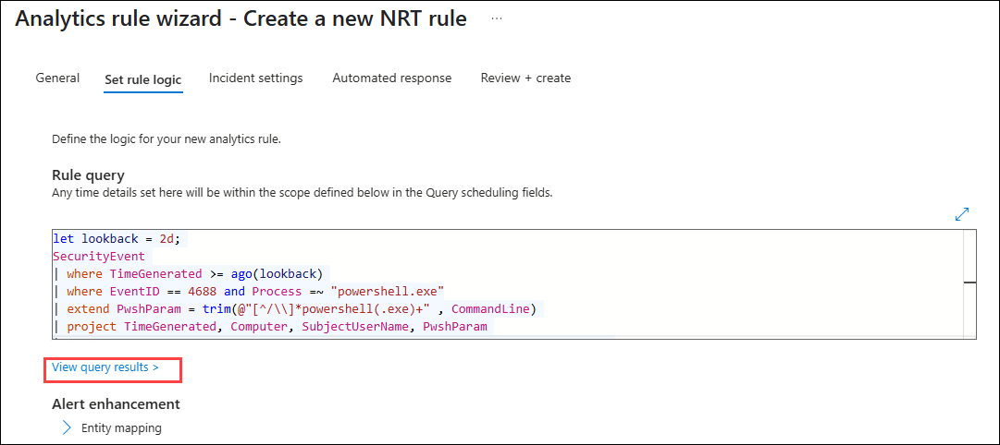

1. Close the **Logs** window by selecting the **X** in the top-right of the window and select **OK** to discard the changes. 

1. Under **Entity mapping**, provide the following details **(1)**:
     
    - Select **+ Add new entity** under *Entity mapping*.
    - For the **Entity type** drop-down list select **Host**.
    - For the **Identifier** drop-down list select **HostName**.
    - For the **Value** drop-down list select **Computer**.

1. Scroll down and select **Next: Incident settings> (2)** button.

   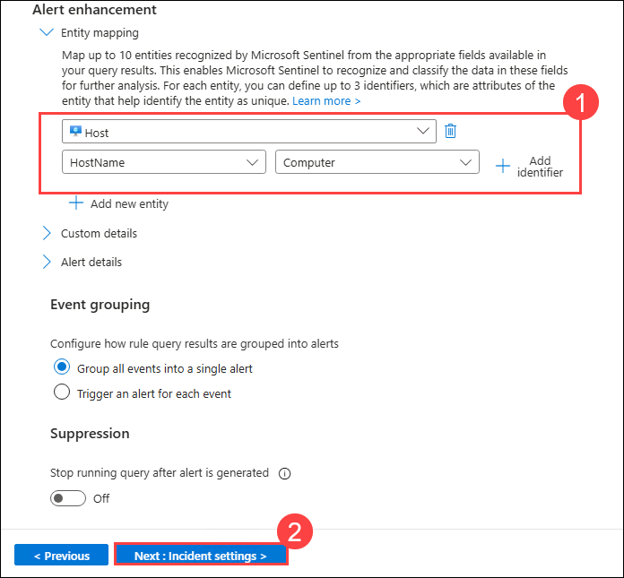

1. For the **Incident settings** tab, leave the default values and select **Next: Automated response>** button.

1. For the **Automated response** tab, leave the default values and select **Next: Review and create >** button.

1. On the **Review and Create** tab, select the **Save** button to create and save the new Scheduled Analytics rule.

### Task 3: Create a Search job

In this task, you'll use a Search job to look for a C2.

>**Note:** The **Restore** operation incurs costs that can deplete your Azure subscription credits. For that reason, you won't be performing the restore operation in this lab. However, you can follow the steps below to perform the restore operation in your own environment.

1. On the left menu Select the **Search** page under **General** in Microsoft Sentinel.

   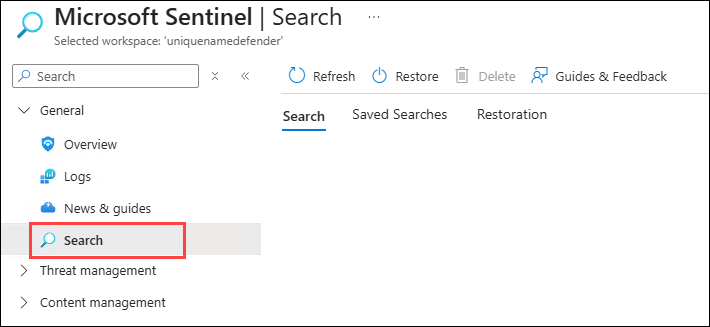

   > **Note:** If you do not see **Search page** in the Microsoft Sentinel portal,try refreshing the browser. Wait 5 minutes and refresh again until it appears.

1. In the search box, enter **reg.exe (1)** and then select **Start (2)**.

   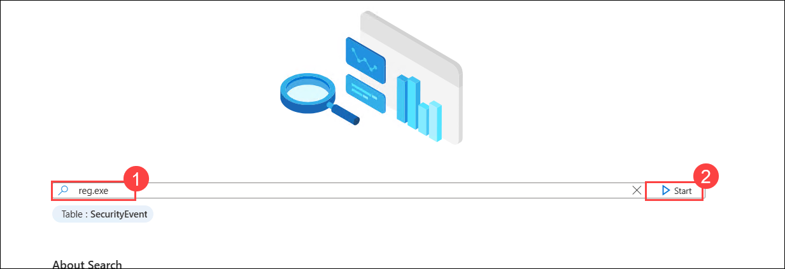

1. A new window running the query opens. Select the ellipsis icon **(...) (1)** from the top right and then toggle the **Search job mode (2)**.

   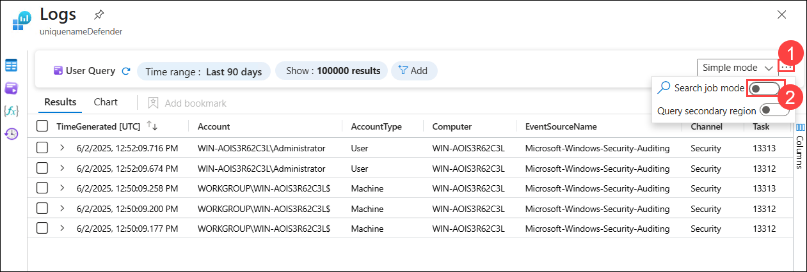

1. Select **Search job** button from the command bar. 

   >**Note**: Search job button needs some time to get enable, meanwhile you can proceed with the next steps.

1. The search job creates a new table with your results as soon as they arrive. The results can be consulted from the **Saved Searches** tab.

1. Close the **Logs** window by selecting the **X** in the top-right of the window and select **OK** to discard the changes. 
 
1. Select the **Restoration (1)** tab from the command bar and then the **Restore (2)** button.

   - Under **Select a table to restore**, search for and select **SecurityEvent (3)**.

   - Review the options available and then select the **Cancel (4)** button.

     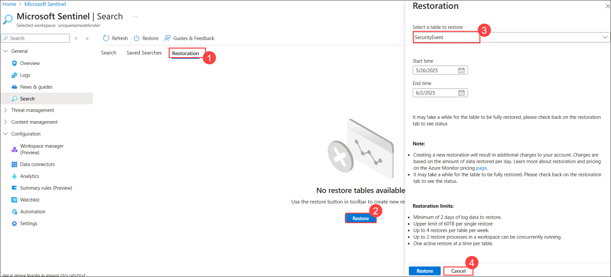   

      >**Note:** If you were running the job, the restore would run for a couple of minutes and your data would be available in a new table.

### Task 4: Create a hunt that combines multiple queries into a MITRE tactic

1. The MITRE ATT&CK map helps you identify specific gaps in your detection coverage. Use predefined hunting queries for specific MITRE ATT&CK techniques as a starting point to develop new detection logic.

1. In Microsoft Sentinel, expand **Threat management (1)** from the left navigation menus. Select **MITRE ATT&CK (Preview) (2)**.

1. Unselect items in the **Active rules** drop-down menu **(3)**.

   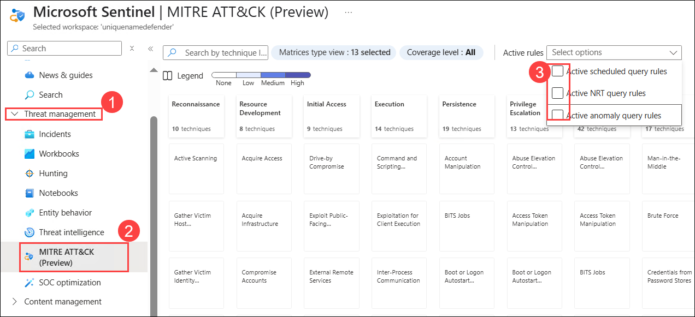

1. Select **Hunting queries** in the **Simulated rules** filter to see which techniques have hunting queries associated with them.

   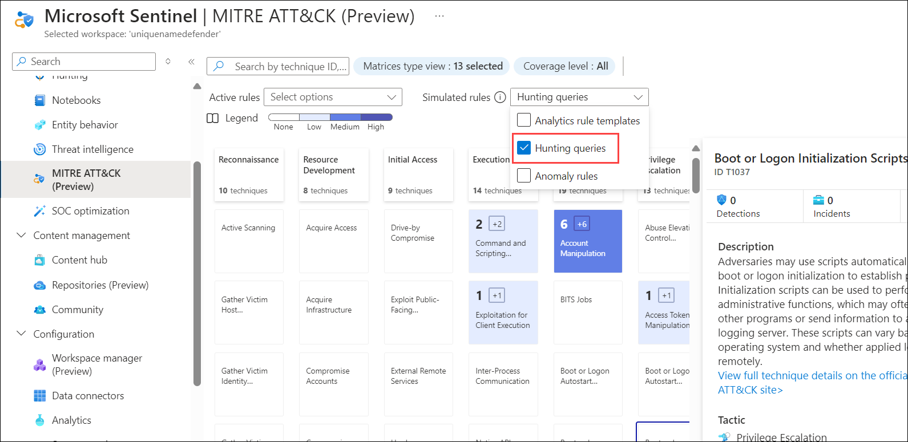

1. Select the card for **Account Manipulation**.

   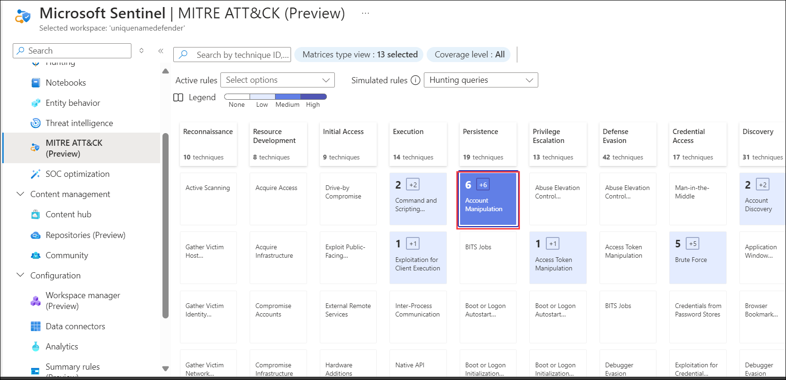

1. In the details pane, locate **Simulated coverage** and select the **View** link next to **Hunting queries**.

   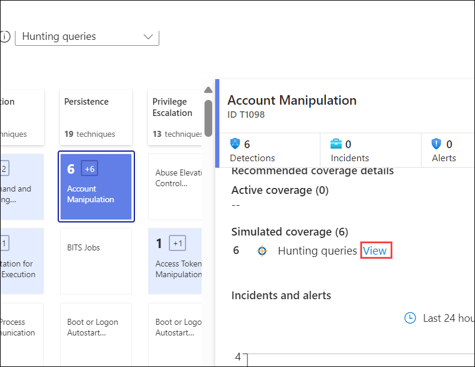

1. This link takes you to a filtered view of the Queries tab on the Hunting page based on the technique you selected.

1. Select all the queries for that technique by selecting the box near the top of the list on the left **(1)**.

   - Select the **Hunt actions (2)** drop down menu near the middle of the screen above the filters.

   - Select **Create new hunt (3)**. All the queries you selected are cloned for this new hunt.

     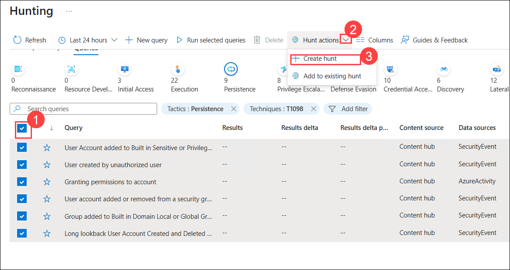

1. Fill out the hunt name as **myhunt (1)** and optional fields. The description is a good place to verbalize your hypothesis. The Hypothesis pull down menu is where you set the status of your working hypothesis and then select **Create (2)** to get started.

   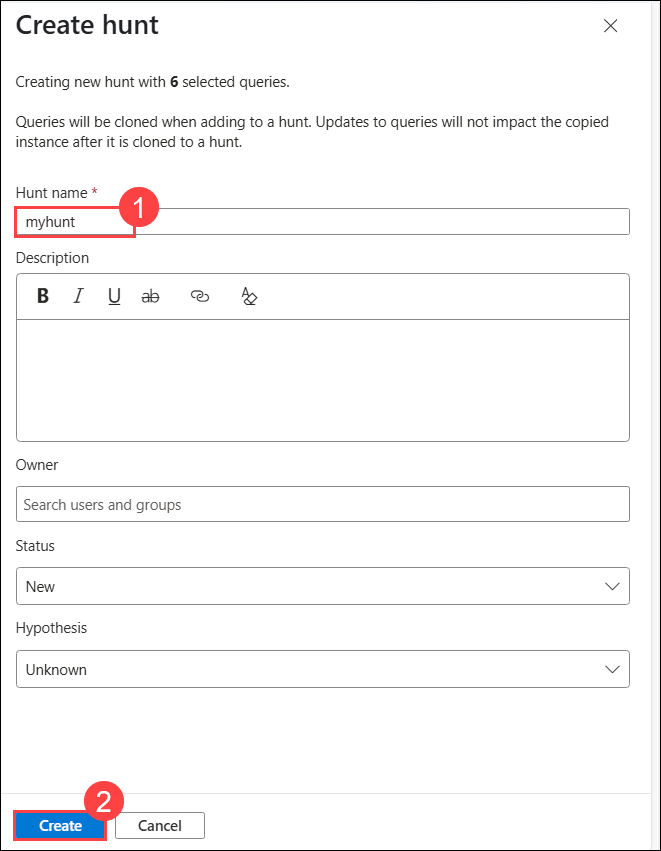

1. Select the **Hunts (Preview)** tab to view your new hunt.

1. Select the hunt link by name to view the details and take actions.

   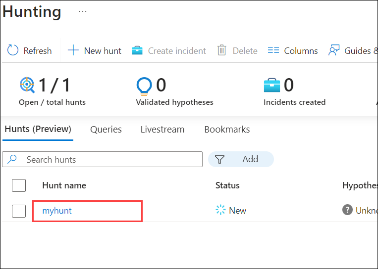

1. View the details pane with the Hunt name, Description, Content, Last update time, and Creation time.

1. Select all of the queries by using the box next to the **Query** column **(1)**.

1. Either select **Run selected queries (2)** or uncheck the selected rows and **right click** and **Run** a single query.

   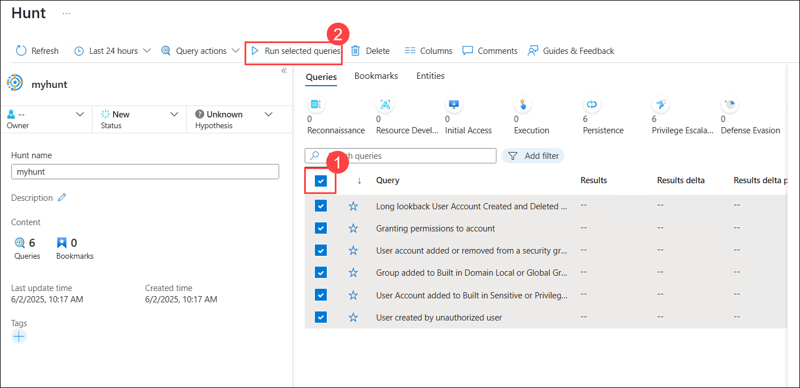

1. You can also select a single query and select **View results** in the details pane.

1. Review which queries returned results.

1. Based on the results, determine if there's enough strong evidence to validate the hypothesis. If there isn’t, close the Hunt and mark it as invalidated.

1. Alternative Steps:
    - Go to Microsoft Sentinel.
    - Expand Threat management.
    - Choose Hunting.
    - Select ‘add filter’.
    - Set the filter to tactics: persistence.
    - Add another filter.
    - Set the second filter to have techniques: T1098.

## Review
In this lab, you have completed the following:
- Created a hunting query.
- Created an NRT query rule.
- Created a Search.
- Created a hunt that combines multiple queries into a MITRE tactic.

## Click on **Next** to proceed to Exercise 2 
