# Lab - Lesson 14 Lab 11a: Perform Threat Hunting in Microsoft Sentinel

### Estimated Timing: 1 Hours

## Lab Scenario

You're a Security Operations Analyst working at a company that implemented Microsoft Sentinel. Threat intelligence has warned you about a **Command-and-Control (C2)** technique in which malware on a compromised host quietly "beacons" out to an attacker's server — often disguised as ordinary DNS lookups. Your job is to _hunt_: proactively search your logs for signs of this activity, rather than waiting for an alert.

> **Where this lab runs:** You'll work in the Microsoft Defender portal (which hosts Microsoft Sentinel), signed in from the **WIN-1 virtual machine** in your CloudLabs environment using the tenant credentials CloudLabs provides. **Do not use your personal computer.**

### How this lab handles data

Real threat hunting depends on log data already existing in your workspace. Getting fresh data into Sentinel involves a slow chain — connecting a server, configuring a data collection rule, running an attack, and waiting for events to ingest and for jobs to finish (often **hours**).

**To keep you hunting instead of waiting, this lab uses pre-populated data.** Your workspace (**SentinelWorkspace-01**) has already been loaded with the `SecurityEvent` data from a simulated C2 attack, so every query you run returns results immediately. The data-generation steps (Azure Arc, the data collection rule, and the C2 script) have already been done for you and are summarized at the end for reference only — you do **not** need to run them.

> **Analogy:** Instead of asking you to plant a garden and wait months for it to grow, we've given you a garden that's already grown so you can get straight to the actual skill — hunting through it.

## Lab objectives

In this lab, you will perform the following:

- Task 1: Sign in to Microsoft Sentinel
- Task 2: Write and run your first hunting query
- Task 3: Refine the query to confirm the hypothesis
- Task 4: Save your finding by linking results to an incident
- Task 5: Save a reusable hunting query
- Task 6: Organize and expand your hunt with MITRE ATT&CK

### Background: threat hunting concepts

**Threat hunting** is the practice of _proactively_ searching your environment for malicious activity that hasn't triggered an alert yet. That "not previously detected" part is what separates hunting from incident response — in hunting, you start from a hypothesis and go looking, rather than reacting to something the system already flagged.

A good **hunting hypothesis** is: achievable, narrow in scope, time-bound, useful, and tied to a real threat you're defending against. For this lab, your hypothesis is:

> _"If a host on our network is running a C2 beacon, we should see PowerShell repeatedly executing a suspicious script (`c2.ps1`) that generates unusual outbound DNS queries, within the last two days."_

The query language you'll use is **KQL (Kusto Query Language)** — the language Sentinel and Advanced hunting use to search log tables. You'll query the **SecurityEvent** table, which holds Windows security events including process-creation events (Event ID **4688**).

### Task 1: Sign in to Microsoft Sentinel

In this task you'll sign in to the Microsoft Defender portal from the WIN-1 virtual machine and open the Microsoft Sentinel section.

1. Minimize the **WINServer** virtual machine that you were using during the prerequisite section of the lab. This will bring you back to the **WIN1** virtual machine.

1. Open the **Microsoft Edge** from the desktop, go to the Defender portal at `https://security.microsoft.com`.

1. You'll see the **Sign into Microsoft Azure** tab. Here, enter your credentials:
   - **Email/Username:** <inject key="AzureAdUserEmail"></inject>

     

1. Next, provide your password:
   - **Password:** <inject key="AzureAdUserPassword"></inject>

     

1. If prompted to stay signed in, you can click **No**.

   

1. Close the **Meet your improved security center** pop-up using **X**.

   

1. In the navigation menu, select **Show navigation (1)** and then scroll down and expand the **Microsoft Sentinel (2)** section so you can see its options.

   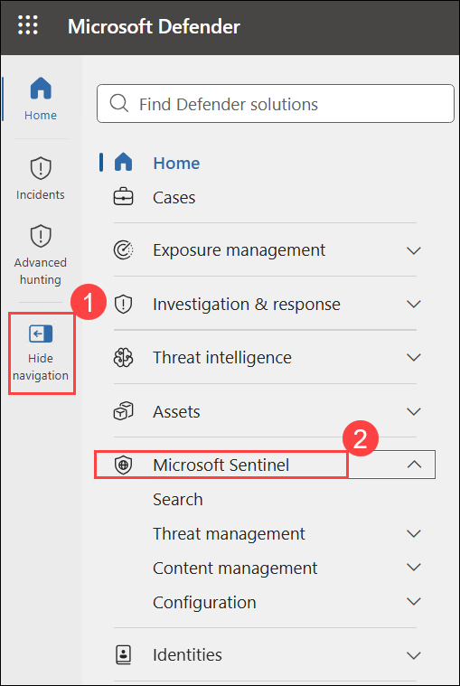

   **What to expect:** The Microsoft Sentinel section expands to show its sub-sections, including _Investigation & Response_ and _Threat management_ - these are where the rest of this lab happens.

### Task 2: Write and run your first hunting query

In this task you'll translate your hypothesis into KQL and start hunting in **Advanced hunting**.

1. In the navigation menu, expand **Investigation & Response (1)**, then expand **Hunting (2)** and select **Advanced hunting (3)**.

   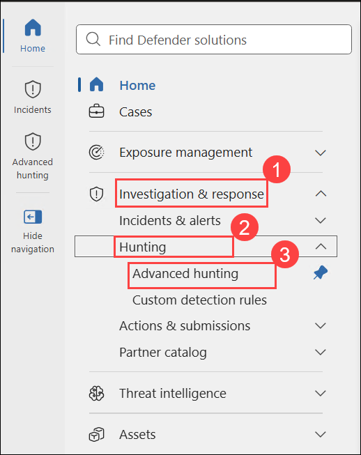

   > **Note:** Paste any KQL into Notepad first, then copy it from Notepad into the query window. This avoids formatting errors that can occur pasting directly into the browser.

1. If prompted with **Try out guided hunting** pop-up window, you can either select **Take tour** or **Not now**.

   .png>)

1. Copy & paste this query in the **New query (1)** space and select **Run query (2)**. It looks in the last two days of `SecurityEvent` data for PowerShell process-creation events:

   ```kql
   let lookback = 2d;
   SecurityEvent
   | where TimeGenerated >= ago(lookback)
   | where EventID == 4688 and Process =~ "powershell.exe"
   | extend PwshParam = trim(@"[^/\\]*powershell(.exe)+" , CommandLine)
   | project TimeGenerated, Computer, SubjectUserName, PwshParam
   ```

   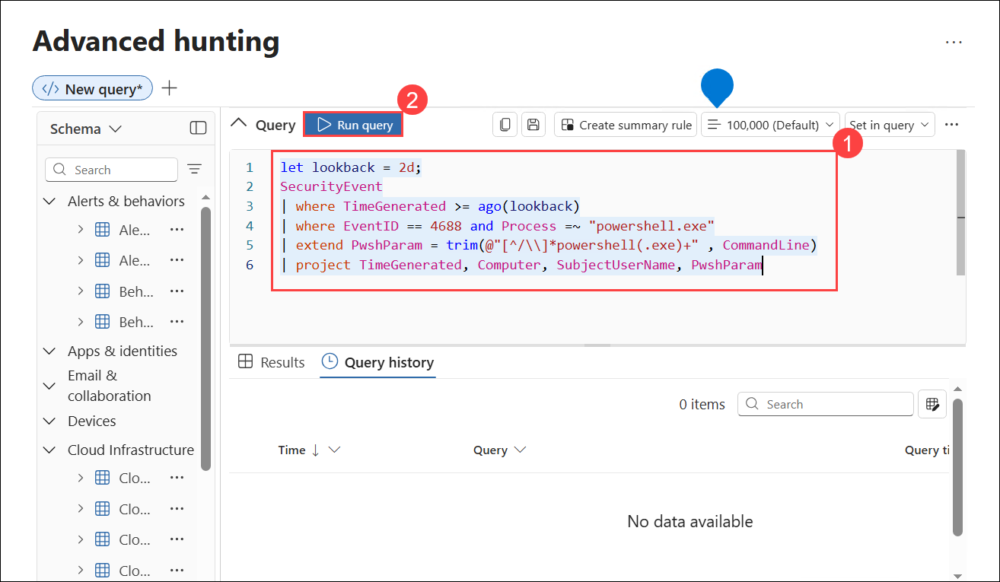

   **Reading the query, line by line:**
   - `let lookback = 2d;` defines a variable for the time window.
   - `SecurityEvent` is the table you're searching.
   - `where TimeGenerated >= ago(lookback)` limits to the last two days.
   - `where EventID == 4688 and Process =~ "powershell.exe"` keeps only PowerShell process-creation events (`=~` means case-insensitive match).
   - `extend PwshParam = ...` creates a new column with just the command-line parameters.
   - `project` chooses which columns to display.

1. Review the results. You've now surfaced every PowerShell execution in the environment - the raw material for your hunt.

   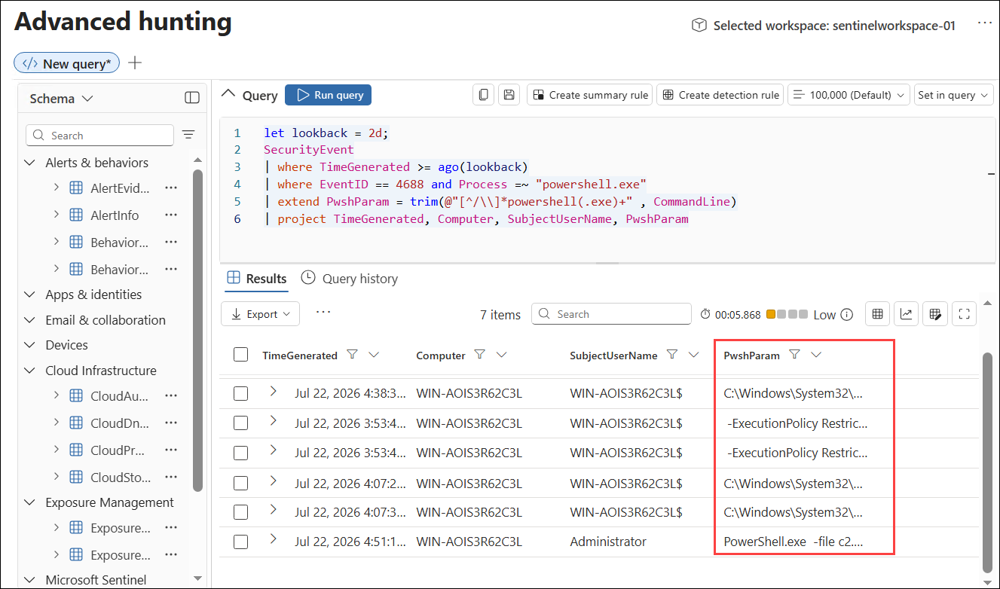

   **What to look for:** Scan the **PwshParam** column for anything unusual. The C2 beacon shows up as PowerShell running **`-file c2.ps1`** - a script name that has no business running repeatedly on a normal machine.

### Task 3: Refine the query to confirm the hypothesis

A first query casts a wide net. In this task you'll refine it to focus on the suspicious activity and quantify it - a key hunting skill.

1. Modify your query to filter directly for the suspicious script and count how often each host ran it. Replace the query with the following:

   ```kql
   let lookback = 2d;
   SecurityEvent
   | where TimeGenerated >= ago(lookback)
   | where EventID == 4688 and Process =~ "powershell.exe"
   | extend PwshParam = trim(@"[^/\\]*powershell(.exe)+" , CommandLine)
   | where PwshParam has "c2.ps1"
   | summarize FirstSeen = min(TimeGenerated), Executions = count() by Computer, SubjectUserName, PwshParam
   | order by Executions desc
   ```

   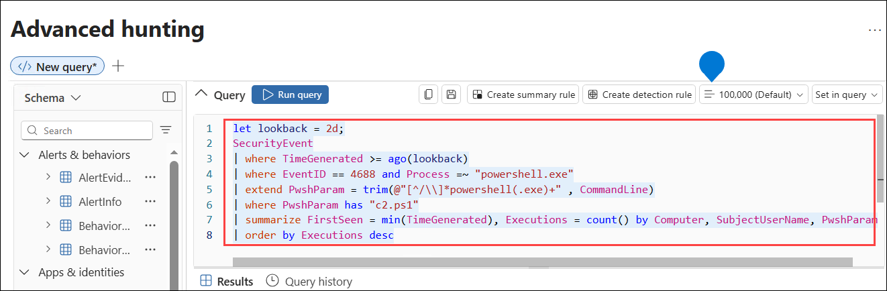

   **What changed and why:**
   - The new `where PwshParam has "c2.ps1"` line filters to just the suspicious script.
   - `summarize ... by` groups the results by host and user, giving you a **first-seen time** and an **execution count** — turning raw events into evidence.
   - `order by Executions desc` puts the noisiest host at the top.

1. Select **Run query**.

   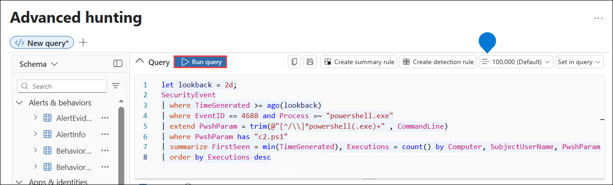

   > **Note:** If this query returns no results, wait about 10 minutes for the data to ingest and run it again. If it's still empty, go to the **WINServer** VM, close the terminal window running `c2.ps1`, and restart it using the command `Start PowerShell.exe -file c2.ps1` in the already open Command Prompt window again.

1. Review the results.

   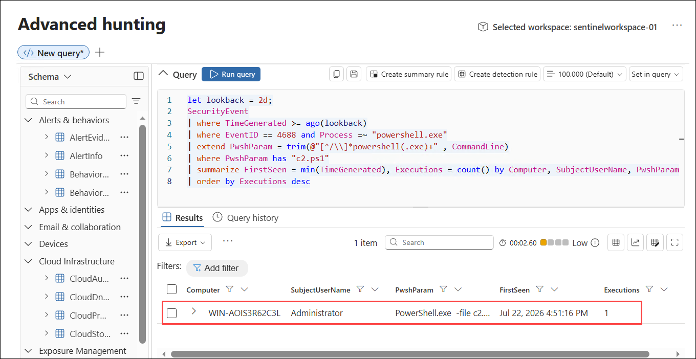

   **Interpreting the result:** A single host repeatedly executing `c2.ps1` many times is exactly the beaconing pattern your hypothesis predicted. That repetition many executions at regular intervals is the signature of a C2 beacon, and it's strong evidence to escalate.

   > **Think about it:** Why summarize instead of just listing every event? Because "this host ran the script 180 times in two days" is far more actionable than 180 individual rows. Summarization turns noise into a finding.

### Task 4: Save your finding by linking results to an incident

Hunting is only useful if findings are captured. In this task you'll promote your evidence into an **incident** so the SOC can act on it.

1. Re-run the first (unsummarized) query from Task 2 by so you have individual result rows:

   ```kql
   let lookback = 2d;
   SecurityEvent
   | where TimeGenerated >= ago(lookback)
   | where EventID == 4688 and Process =~ "powershell.exe"
   | extend PwshParam = trim(@"[^/\\]*powershell(.exe)+" , CommandLine)
   | where PwshParam has "c2.ps1"
   | project TimeGenerated, Computer, SubjectUserName, PwshParam
   ```

   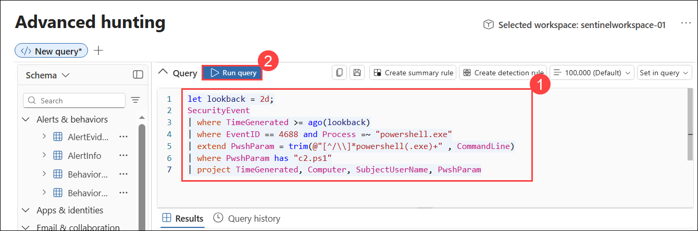

1. In the results, select the checkbox next to one or more rows showing `-file c2.ps1`.

   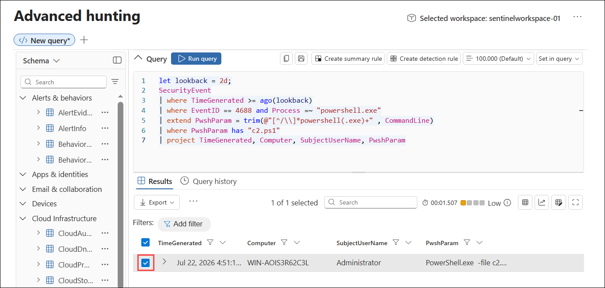

1. In the **Results** command bar, click on **ellipsis (...) (1)** and select the **Link to incident (2)** icon.

   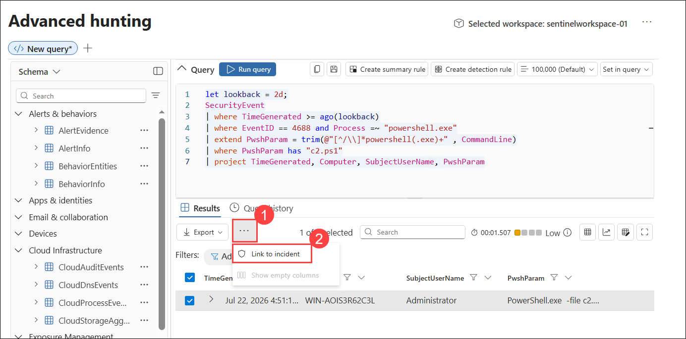

1. In the **Link to incident** pane, ensure **Create new incident (1)** is selected and fill in the following details:

   | Setting             | Value                                              |
   | ------------------- | -------------------------------------------------- |
   | Alert title         | **PowerShell C2 Hunt (2)**                         |
   | Severity            | **High (3)**                                       |
   | Category            | **Command and Control (4)**                        |
   | MITRE techniques    | **T1094: Custom Command and Control Protocol (5)** |
   | Description         | **PowerShell C2 Hunt results (6)**                 |
   | Recommended actions | **Perform incident remediation (7)**               |

   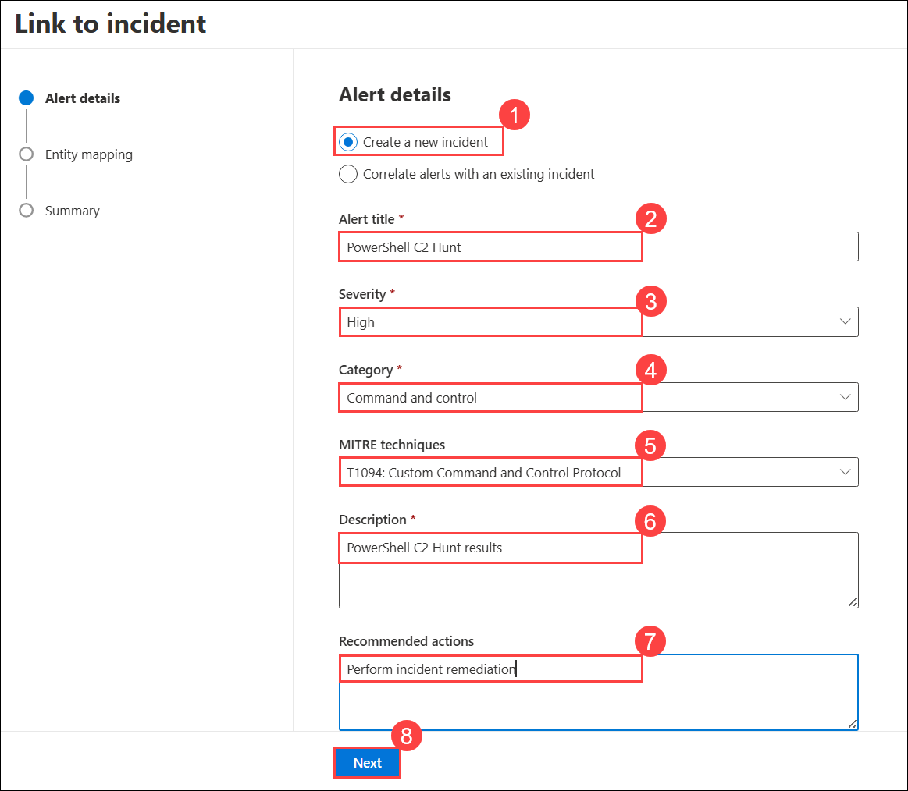

1. Select **Next (8)**.

1. On the **Entity mapping** pane, under **Impacted Assets** select **+ Add assets (1)**. For _Entity_ select **Device (2)**, then **Hostname (3)** and **Computer (4)** for _Identifier_ and _Column_ and then select **Next (5)**.

   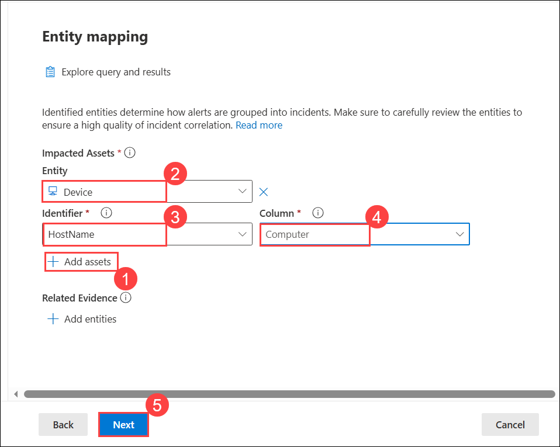

1. On the **Summary** pane select **Submit**, then **Done**.

   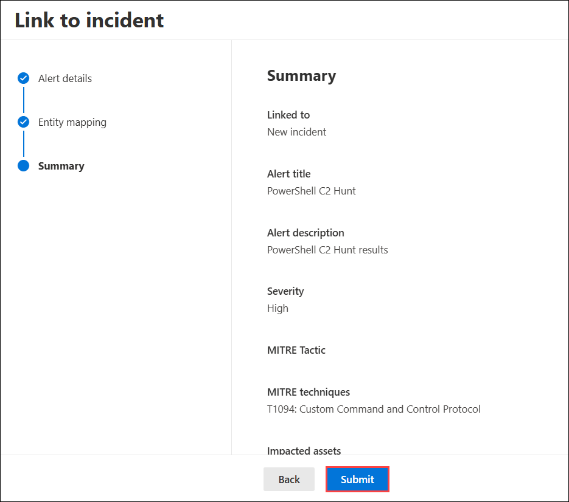

1. In the left navigation menu, expand **Investigation & Response (1) > Incidents & Alerts (2) > Incidents (3)**. Confirm the **PowerShell C2 Hunt (4)** incident is listed.

   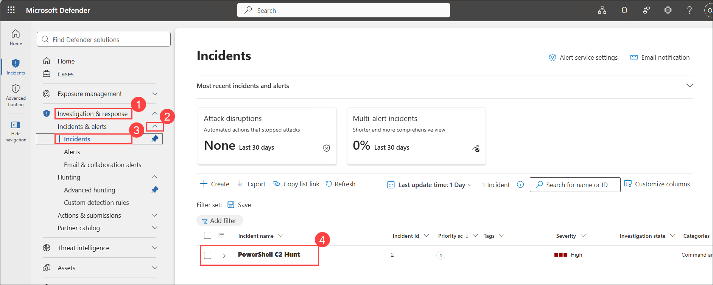

   **What to expect:** A new incident named **PowerShell C2 Hunt** appears in the Incidents list.

### Task 5: Save a reusable hunting query

Bookmarks preserve a query _and_ the specific results you found relevant, so you can return to your evidence later. In this task you'll save your hunt as a reusable query and bookmark a key result.

1. In the **Microsoft Sentinel (1)** section, expand **Threat management (2)** and select **Hunting (3)**.

   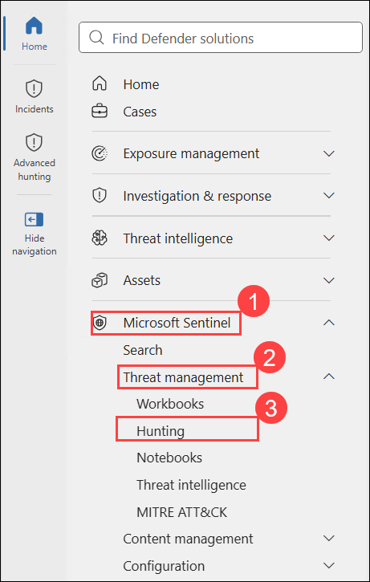

1. Select the **Queries (1)** tab, then **+ New query (2)** from the command bar.

   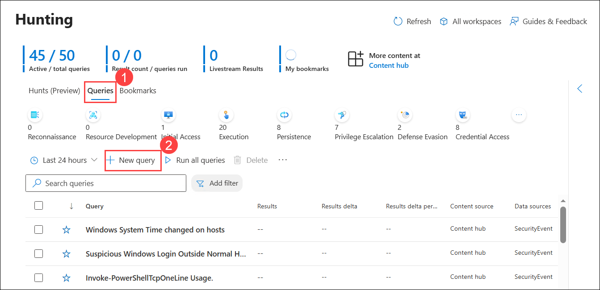

1. In _Create custom query_, set **Name (1)** to **PowerShell C2 Hunt** and paste this **(2)** into _Custom query_:

   ```kql
   let lookback = 2d;
   SecurityEvent
   | where TimeGenerated >= ago(lookback)
   | where EventID == 4688 and Process =~ "powershell.exe"
   | extend PwshParam = trim(@"[^/\\]*powershell(.exe)+" , CommandLine)
   | where PwshParam has "c2.ps1"
   | summarize FirstSeen = min(TimeGenerated), Executions = count() by Computer, SubjectUserName, PwshParam
   | order by Executions desc
   ```

1. Under _Entity mapping_, select **+ Add new entity (3)**: set **Entity type** = **Host (4)**, **Identifier** = **HostName (5)**, **Value** = **Computer (6)**.

   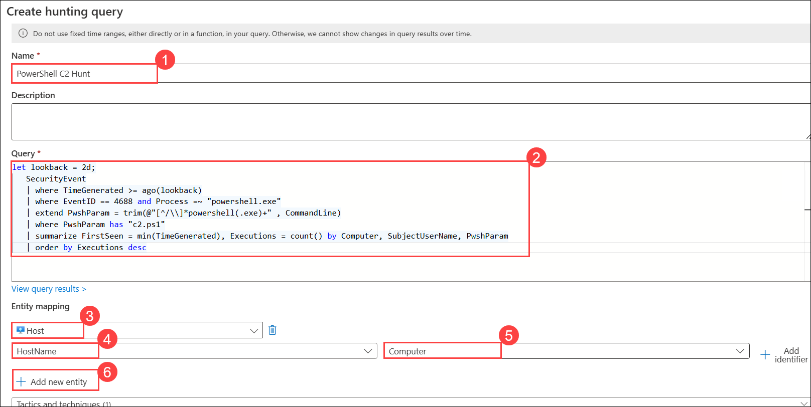

1. Under _Tactics & Techniques_, select **Command and Control (7)**, then select **Create (8)**.

   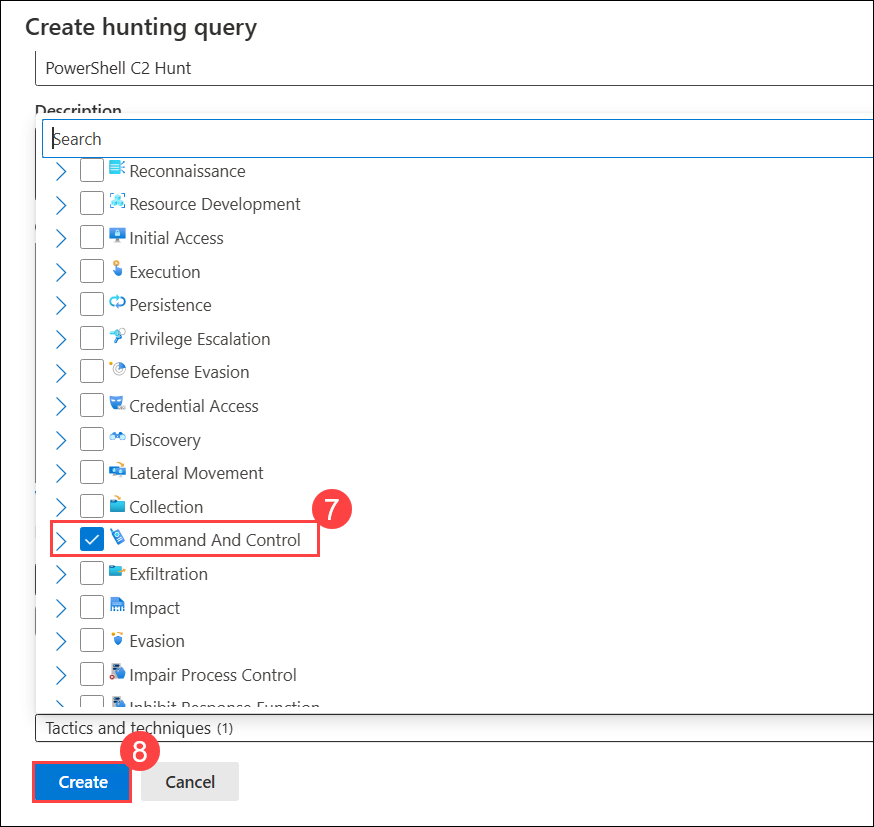

1. Back on the **Hunting** page **Queries** tab, find and select **PowerShell C2 Hunt (1)** in the list, and select **Run selected queries (2)**.

   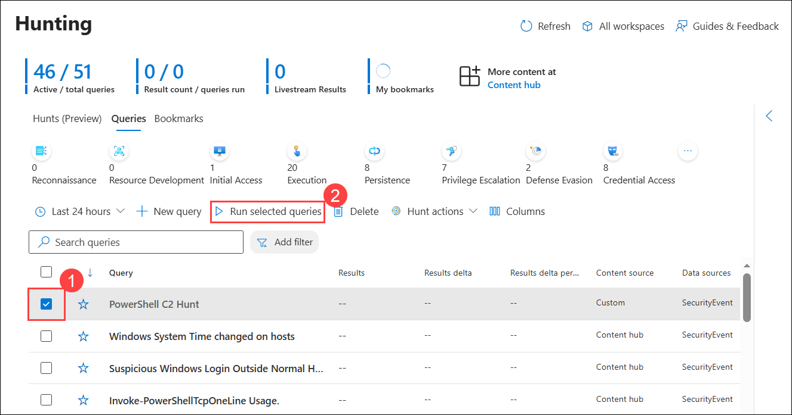

1. Review the number of results shown in the **Results** column - your saved query is now reusable any time you want to re-hunt.

   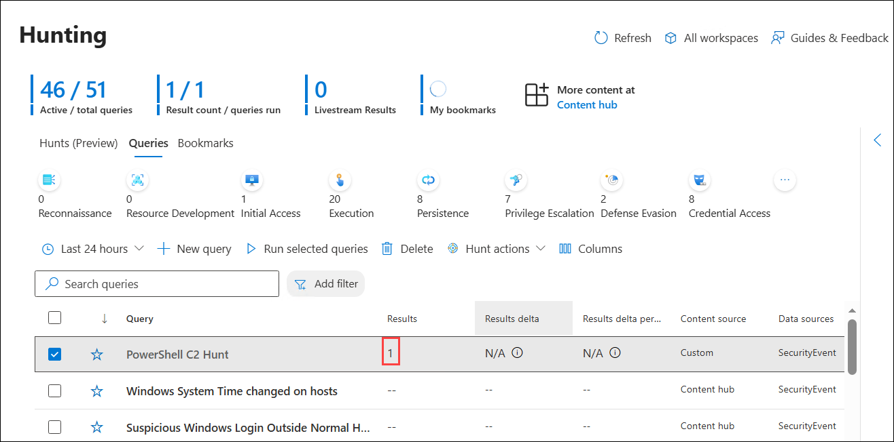

### Task 6: Organize and expand your hunt with MITRE ATT&CK

The **MITRE ATT&CK** framework catalogs attacker tactics and techniques. In this task, Sentinel maps hunting queries to ATT&CK so you can find coverage gaps and pull in related queries.

1. In the **Microsoft Sentinel** section, expand **Threat management (1)** and select **MITRE ATT&CK (2)**.

   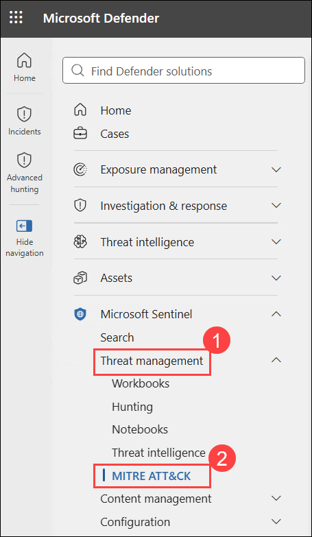

1. In the _Active rules_ drop-down, unselect the items so the view isn't filtered by active rules.

   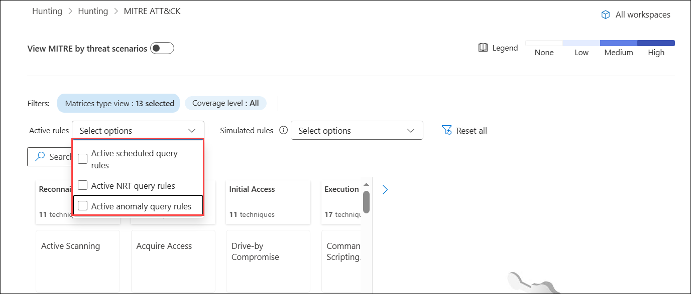

1. In the _Simulated rules_ filter, select **Hunting queries** to see which techniques have hunting queries available.

   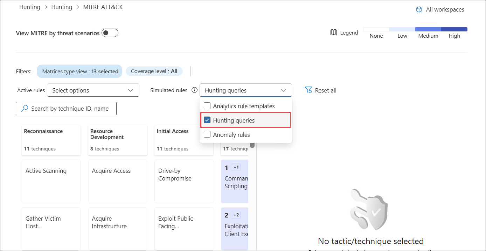

   **What you're seeing:** Each column is a **tactic** (the attacker's goal, like _Command and Control_) and each cell is a **technique** (how they achieve it). Coloring shows where you have detection or hunting coverage.

   

1. Select the card for **Account Manipulation**.

   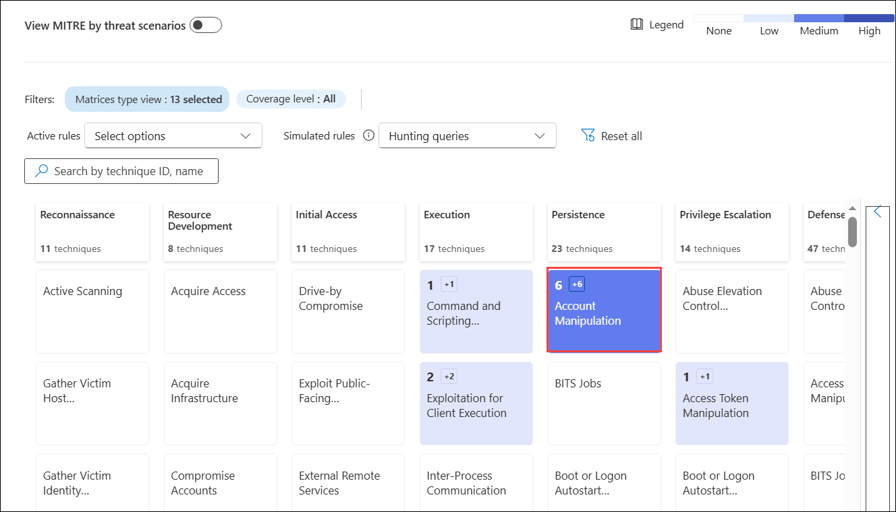

1. In the details pane, under _Simulated coverage_, select the **View** link next to _Hunting queries_. This opens a filtered list of hunting queries for that technique.

   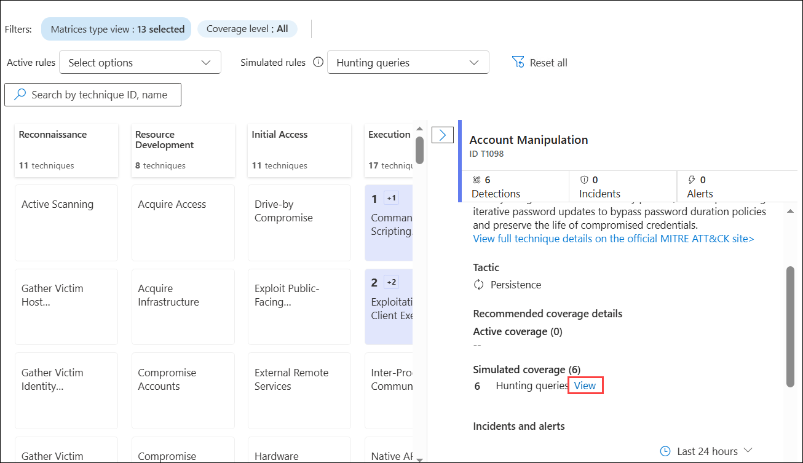

1. Select all the queries for the technique using the checkbox at the top of the list **(1)**.

1. Select the **Hunt actions (2)** drop-down (above the filters) and choose **+ Create hunt (3)**. The selected queries are cloned into a new hunt.

   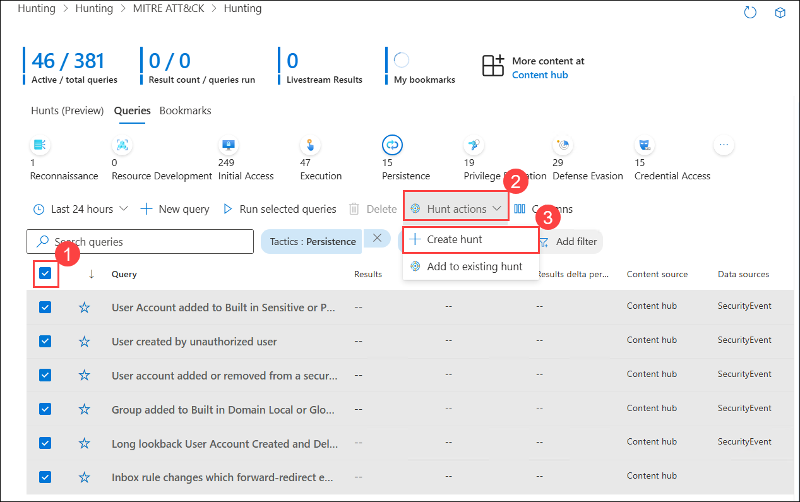

1. Give the hunt a **name** as `Suspicious Local Admin Account Creation` **(1)**, and in the **Description** write your hypothesis `If an attacker is attempting privilege escalation on a compromised host, we should see a new local user account created and added to the Administrators group outside of normal, approved account-provisioning activity, within the last two days.` **(2)**. Use the **Status** drop-down to set it to **New (3)** and using **Hypothesis** drop-down select **Unknown (4)**. Select **Create (5)**.

   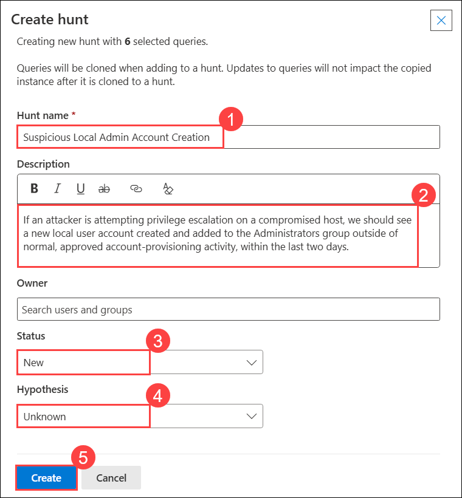

1. Select the **Hunts (Preview) (1)** tab, then select your hunt `Suspicious Local Admin Account Creation` **(2)** to open it.

   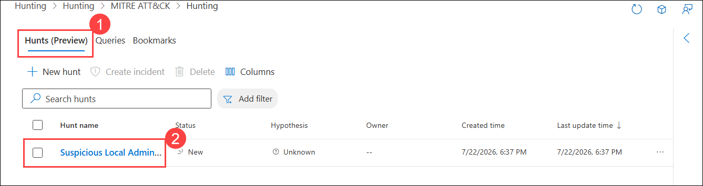

1. In the hunt, select all queries using the checkbox next to the _Query_ column **(1)**, then select **Run selected queries (2)** (or right-click a single query and choose **Run**).

   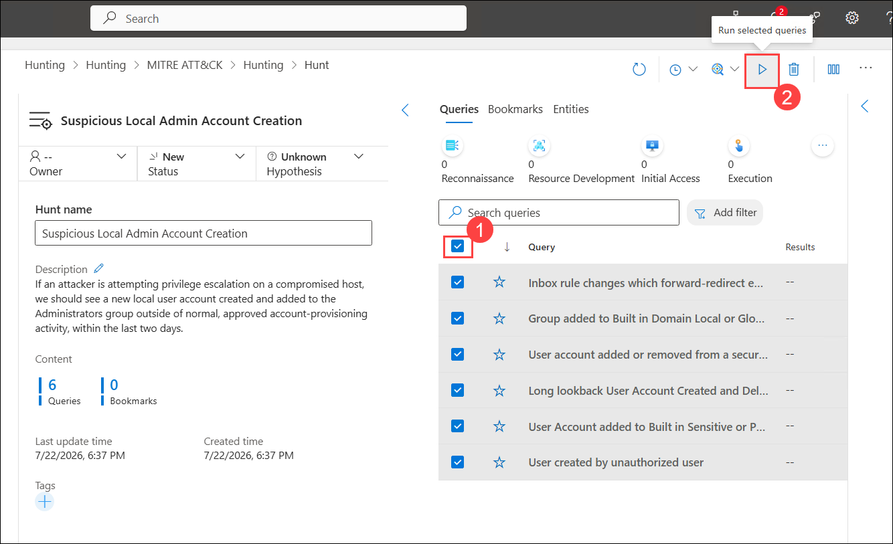

1. Review which queries returned results. Based on the evidence, decide whether your hypothesis is supported. If not, close the hunt and mark it **Invalidated** - a negative result is still a valid hunting outcome.

   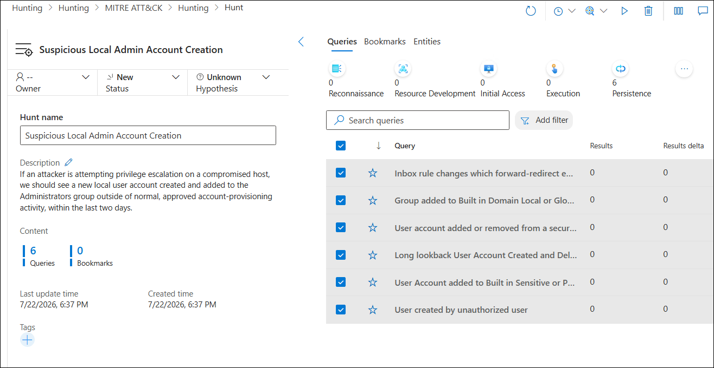

   > **Think about it:** Why is "nothing found" still useful? Because a well-scoped hunt that finds nothing _reduces uncertainty_ - you've checked for that threat and can document that it isn't present, which is itself valuable to the SOC.

### Reference only: how the sample data was generated

You did **not** need to perform these steps — they were done for you to pre-populate the workspace. They're documented here so you understand where the data came from:

1. **Azure Arc** connected an on-premises server (**WINServer**) to the Azure subscription, so its logs could flow to Azure.
2. A **Data Collection Rule** (Windows Security Events via AMA) was created to ingest **All Security Events** from WINServer into **SentinelWorkspace-01**.
3. A PowerShell script (**c2.ps1**) ran on WINServer, simulating a C2 beacon by issuing repeated randomized DNS queries — generating the process-creation (4688) events you hunted through.

The reason these are pre-done: each step involves ingestion and processing delays (often hours), which would otherwise block the actual hunting work.

## Knowledge check

Test your understanding. Answers are below.

1. How does threat hunting differ from alert triage or incident response?
2. List three qualities of a good threat-hunting hypothesis.
3. In the KQL query, what does the `summarize ... by Computer` step accomplish, and why is it more useful than listing every raw event?
4. What is the purpose of a bookmark in Sentinel hunting?
5. How does the MITRE ATT&CK view help a threat hunter decide where to hunt next?

<details>
<summary>Show answers</summary>

1. Hunting is proactive — you start from a hypothesis and search for threats that haven't triggered an alert. Triage/incident response is reactive, starting from something the system already flagged.
2. Any three of: achievable, narrow in scope, time-bound, useful/efficient, tied to a real threat model.
3. It groups events by host (and user), producing counts and first-seen times. "This host ran c2.ps1 180 times" is far more actionable than 180 individual rows — it turns noise into evidence.
4. A bookmark preserves a specific query result you found relevant, along with the query, so you can return to that exact evidence later during an investigation.
5. It shows which tactics/techniques have detection or hunting coverage, revealing gaps, and lets you pull in predefined hunting queries for a chosen technique to expand the hunt.

</details>

## Review

In this lab, you have completed the following:

- Signed in to Microsoft Sentinel in the Microsoft Defender portal
- Wrote and ran KQL hunting queries against pre-populated `SecurityEvent` data to test a C2 hunting hypothesis
- Refined a query with filtering and summarization to confirm the hypothesis
- Linked hunting results to a new incident (**PowerShell C2 Hunt**)
- Saved a reusable hunting query and a bookmark to preserve your evidence
- Mapped and expanded your hunt using the MITRE ATT&CK framework

These are the same threat-hunting skills a SOC analyst uses to proactively find threats before they trigger an alert.

### You've successfully completed the hand's-on lab!
